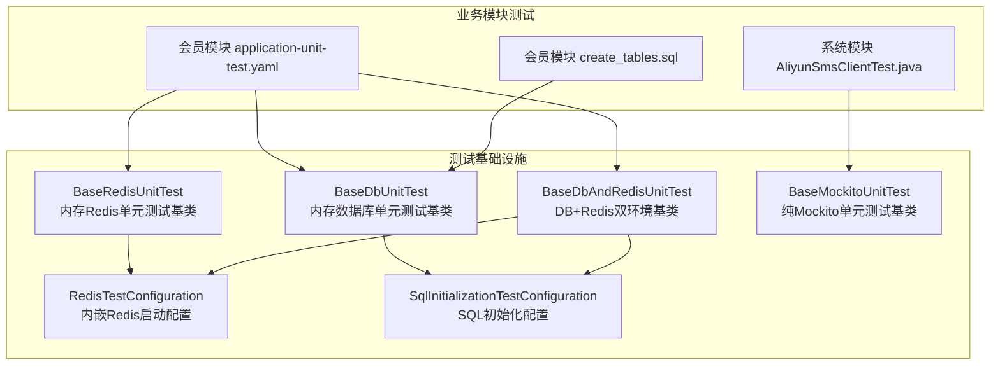
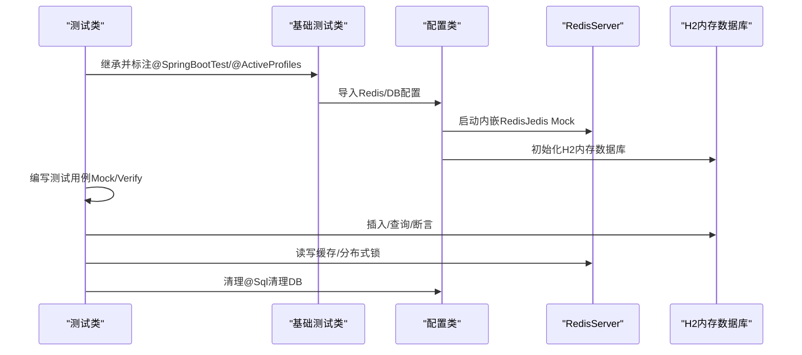
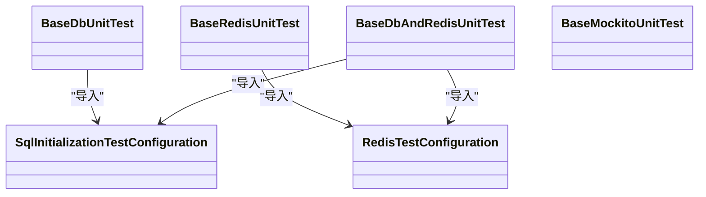
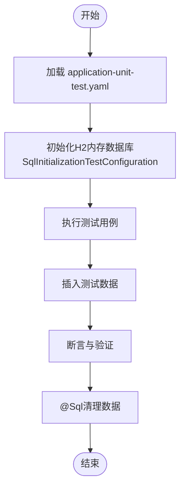
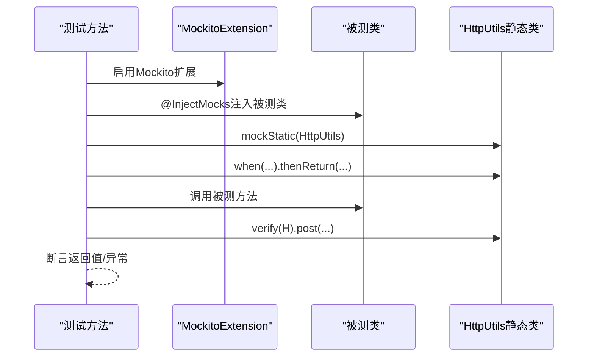
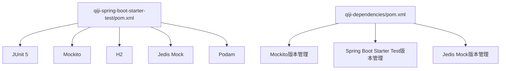

# 单元测试指南

<cite>
**本文引用的文件**
- [BaseDbUnitTest.java](file://qiji-framework/qiji-spring-boot-starter-test/src/main/java/com.qiji.cps/framework/test/core/ut/BaseDbUnitTest.java)
- [BaseRedisUnitTest.java](file://qiji-framework/qiji-spring-boot-starter-test/src/main/java/com.qiji.cps/framework/test/core/ut/BaseRedisUnitTest.java)
- [BaseDbAndRedisUnitTest.java](file://qiji-framework/qiji-spring-boot-starter-test/src/main/java/com.qiji.cps/framework/test/core/ut/BaseDbAndRedisUnitTest.java)
- [BaseMockitoUnitTest.java](file://qiji-framework/qiji-spring-boot-starter-test/src/main/java/com.qiji.cps/framework/test/core/ut/BaseMockitoUnitTest.java)
- [RedisTestConfiguration.java](file://qiji-framework/qiji-spring-boot-starter-test/src/main/java/com.qiji.cps/framework/test/config/RedisTestConfiguration.java)
- [SqlInitializationTestConfiguration.java](file://qiji-framework/qiji-spring-boot-starter-test/src/main/java/com.qiji.cps/framework/test/config/SqlInitializationTestConfiguration.java)
- [qiji-spring-boot-starter-test/pom.xml](file://qiji-framework/qiji-spring-boot-starter-test/pom.xml)
- [qiji-dependencies/pom.xml](file://qiji-dependencies/pom.xml)
- [application-unit-test.yaml（会员模块）](file://qiji-module-member/src/test/resources/application-unit-test.yaml)
- [create_tables.sql（会员模块）](file://qiji-module-member/src/test/resources/sql/create_tables.sql)
- [AliyunSmsClientTest.java](file://qiji-module-system/src/test/java/ncom.qiji.cps/module/system/framework/sms/core/client/impl/AliyunSmsClientTest.java)
</cite>

## 目录
1. [简介](#简介)
2. [项目结构](#项目结构)
3. [核心组件](#核心组件)
4. [架构总览](#架构总览)
5. [详细组件分析](#详细组件分析)
6. [依赖分析](#依赖分析)
7. [性能考虑](#性能考虑)
8. [故障排查指南](#故障排查指南)
9. [结论](#结论)
10. [附录](#附录)

## 简介
本指南面向 AgenticCPS 系统的单元测试实践，基于现有框架能力，系统化介绍测试框架选择与配置（JUnit 5、Mockito）、测试环境搭建（H2 内存数据库、Jedis Mock 内嵌 Redis）、基础测试类的组织与使用（BaseDbUnitTest、BaseRedisUnitTest、BaseDbAndRedisUnitTest、BaseMockitoUnitTest），并提供 Service 层、Controller 层、DAO 层的测试编写范式与最佳实践。同时涵盖 Mockito 使用技巧、测试数据准备与清理、测试覆盖率要求与提升方法，以及在 IDE 中运行、批量执行与报告生成的实操建议。

## 项目结构
AgenticCPS 采用多模块 Maven 结构，测试基础设施集中在 qiji-spring-boot-starter-test 模块，并通过各业务模块的 test/resources 提供单元测试专用配置与脚本。关键位置如下：
- 测试基础类：qiji-spring-boot-starter-test/src/main/java/.../test/core/ut
- 测试配置：qiji-spring-boot-starter-test/src/main/java/.../test/config
- 单元测试配置文件：各模块 test/resources 下的 application-unit-test.yaml
- 测试 SQL 脚本：各模块 test/resources/sql 下的建表与初始化脚本

图表来源
- [BaseDbUnitTest.java:1-47](file://qiji-framework/qiji-spring-boot-starter-test/src/main/java/com.qiji.cps/framework/test/core/ut/BaseDbUnitTest.java#L1-L47)
- [BaseRedisUnitTest.java:1-36](file://qiji-framework/qiji-spring-boot-starter-test/src/main/java/com.qiji.cps/framework/test/core/ut/BaseRedisUnitTest.java#L1-L36)
- [BaseDbAndRedisUnitTest.java:1-55](file://qiji-framework/qiji-spring-boot-starter-test/src/main/java/com.qiji.cps/framework/test/core/ut/BaseDbAndRedisUnitTest.java#L1-L55)
- [BaseMockitoUnitTest.java:1-14](file://qiji-framework/qiji-spring-boot-starter-test/src/main/java/com.qiji.cps/framework/test/core/ut/BaseMockitoUnitTest.java#L1-L14)
- [RedisTestConfiguration.java:1-36](file://qiji-framework/qiji-spring-boot-starter-test/src/main/java/com.qiji.cps/framework/test/config/RedisTestConfiguration.java#L1-L36)
- [SqlInitializationTestConfiguration.java:1-53](file://qiji-framework/qiji-spring-boot-starter-test/src/main/java/com.qiji.cps/framework/test/config/SqlInitializationTestConfiguration.java#L1-L53)
- [application-unit-test.yaml（会员模块）:1-49](file://qiji-module-member/src/test/resources/application-unit-test.yaml#L1-L49)
- [create_tables.sql（会员模块）:1-114](file://qiji-module-member/src/test/resources/sql/create_tables.sql#L1-L114)
- [AliyunSmsClientTest.java:1-161](file://qiji-module-system/src/test/java/ncom.qiji.cps/module/system/framework/sms/core/client/impl/AliyunSmsClientTest.java#L1-L161)

章节来源
- [BaseDbUnitTest.java:1-47](file://qiji-framework/qiji-spring-boot-starter-test/src/main/java/com.qiji.cps/framework/test/core/ut/BaseDbUnitTest.java#L1-L47)
- [BaseRedisUnitTest.java:1-36](file://qiji-framework/qiji-spring-boot-starter-test/src/main/java/com.qiji.cps/framework/test/core/ut/BaseRedisUnitTest.java#L1-L36)
- [BaseDbAndRedisUnitTest.java:1-55](file://qiji-framework/qiji-spring-boot-starter-test/src/main/java/com.qiji.cps/framework/test/core/ut/BaseDbAndRedisUnitTest.java#L1-L55)
- [BaseMockitoUnitTest.java:1-14](file://qiji-framework/qiji-spring-boot-starter-test/src/main/java/com.qiji.cps/framework/test/core/ut/BaseMockitoUnitTest.java#L1-L14)
- [RedisTestConfiguration.java:1-36](file://qiji-framework/qiji-spring-boot-starter-test/src/main/java/com.qiji.cps/framework/test/config/RedisTestConfiguration.java#L1-L36)
- [SqlInitializationTestConfiguration.java:1-53](file://qiji-framework/qiji-spring-boot-starter-test/src/main/java/com.qiji.cps/framework/test/config/SqlInitializationTestConfiguration.java#L1-L53)
- [application-unit-test.yaml（会员模块）:1-49](file://qiji-module-member/src/test/resources/application-unit-test.yaml#L1-L49)
- [create_tables.sql（会员模块）:1-114](file://qiji-module-member/src/test/resources/sql/create_tables.sql#L1-L114)
- [AliyunSmsClientTest.java:1-161](file://qiji-module-system/src/test/java/ncom.qiji.cps/module/system/framework/sms/core/client/impl/AliyunSmsClientTest.java#L1-L161)

## 核心组件
- 基础测试类
  - BaseDbUnitTest：启用内存数据库（H2）与 MyBatis Plus，适合 DAO/Service 层单元测试，自动清理数据。
  - BaseRedisUnitTest：启用内嵌 Redis（Jedis Mock），适合涉及缓存/分布式锁的单元测试。
  - BaseDbAndRedisUnitTest：同时启用内存数据库与 Redis，适合跨模块交互测试。
  - BaseMockitoUnitTest：仅启用 Mockito 扩展，适合纯 Mock 的单元测试。
- 测试配置
  - RedisTestConfiguration：启动内嵌 RedisServer，端口由 RedisProperties 提供。
  - SqlInitializationTestConfiguration：替代默认 SQL 初始化逻辑，支持延迟加载场景。
- 测试依赖
  - JUnit 5、Mockito Inline、H2、Jedis Mock、Podam（随机对象生成）。

章节来源
- [BaseDbUnitTest.java:1-47](file://qiji-framework/qiji-spring-boot-starter-test/src/main/java/com.qiji.cps/framework/test/core/ut/BaseDbUnitTest.java#L1-L47)
- [BaseRedisUnitTest.java:1-36](file://qiji-framework/qiji-spring-boot-starter-test/src/main/java/com.qiji.cps/framework/test/core/ut/BaseRedisUnitTest.java#L1-L36)
- [BaseDbAndRedisUnitTest.java:1-55](file://qiji-framework/qiji-spring-boot-starter-test/src/main/java/com.qiji.cps/framework/test/core/ut/BaseDbAndRedisUnitTest.java#L1-L55)
- [BaseMockitoUnitTest.java:1-14](file://qiji-framework/qiji-spring-boot-starter-test/src/main/java/com.qiji.cps/framework/test/core/ut/BaseMockitoUnitTest.java#L1-L14)
- [RedisTestConfiguration.java:1-36](file://qiji-framework/qiji-spring-boot-starter-test/src/main/java/com.qiji.cps/framework/test/config/RedisTestConfiguration.java#L1-L36)
- [SqlInitializationTestConfiguration.java:1-53](file://qiji-framework/qiji-spring-boot-starter-test/src/main/java/com.qiji.cps/framework/test/config/SqlInitializationTestConfiguration.java#L1-L53)
- [qiji-spring-boot-starter-test/pom.xml:35-59](file://qiji-framework/qiji-spring-boot-starter-test/pom.xml#L35-L59)
- [qiji-dependencies/pom.xml:396-427](file://qiji-dependencies/pom.xml#L396-L427)

## 架构总览
下图展示单元测试运行时的典型交互：测试类继承基础基类，加载 application-unit-test.yaml，按需引入 Redis 或 DB 配置，执行测试并自动清理。

图表来源
- [BaseDbUnitTest.java:24-26](file://qiji-framework/qiji-spring-boot-starter-test/src/main/java/com.qiji.cps/framework/test/core/ut/BaseDbUnitTest.java#L24-L26)
- [BaseRedisUnitTest.java:19-21](file://qiji-framework/qiji-spring-boot-starter-test/src/main/java/com.qiji.cps/framework/test/core/ut/BaseRedisUnitTest.java#L19-L21)
- [BaseDbAndRedisUnitTest.java:27-29](file://qiji-framework/qiji-spring-boot-starter-test/src/main/java/com.qiji.cps/framework/test/core/ut/BaseDbAndRedisUnitTest.java#L27-L29)
- [RedisTestConfiguration.java:25-33](file://qiji-framework/qiji-spring-boot-starter-test/src/main/java/com.qiji.cps/framework/test/config/RedisTestConfiguration.java#L25-L33)
- [SqlInitializationTestConfiguration.java:34-39](file://qiji-framework/qiji-spring-boot-starter-test/src/main/java/com.qiji.cps/framework/test/config/SqlInitializationTestConfiguration.java#L34-L39)
- [application-unit-test.yaml（会员模块）:8-29](file://qiji-module-member/src/test/resources/application-unit-test.yaml#L8-L29)

## 详细组件分析

### 基础测试类与配置
- BaseDbUnitTest
  - 启用内存数据库与 MyBatis Plus，自动导入数据源、事务管理、SQL 初始化配置。
  - 使用 @Sql 在每个测试方法后清理数据，保证测试隔离性。
- BaseRedisUnitTest
  - 启用内嵌 Redis（Jedis Mock），通过 RedisTestConfiguration 注入 RedisServer Bean。
  - 配合 application-unit-test.yaml 中的 Redis 端口配置。
- BaseDbAndRedisUnitTest
  - 同时启用内存数据库与 Redis，适合需要跨存储层验证的场景。
- BaseMockitoUnitTest
  - 仅启用 Mockito 扩展，适合纯 Mock 的单元测试，无需数据库或 Redis。

图表来源
- [BaseDbUnitTest.java:29-43](file://qiji-framework/qiji-spring-boot-starter-test/src/main/java/com.qiji.cps/framework/test/core/ut/BaseDbUnitTest.java#L29-L43)
- [BaseRedisUnitTest.java:23-32](file://qiji-framework/qiji-spring-boot-starter-test/src/main/java/com.qiji.cps/framework/test/core/ut/BaseRedisUnitTest.java#L23-L32)
- [BaseDbAndRedisUnitTest.java:32-51](file://qiji-framework/qiji-spring-boot-starter-test/src/main/java/com.qiji.cps/framework/test/core/ut/BaseDbAndRedisUnitTest.java#L32-L51)
- [RedisTestConfiguration.java:17-35](file://qiji-framework/qiji-spring-boot-starter-test/src/main/java/com.qiji.cps/framework/test/config/RedisTestConfiguration.java#L17-L35)
- [SqlInitializationTestConfiguration.java:26-50](file://qiji-framework/qiji-spring-boot-starter-test/src/main/java/com.qiji.cps/framework/test/config/SqlInitializationTestConfiguration.java#L26-L50)

章节来源
- [BaseDbUnitTest.java:17-47](file://qiji-framework/qiji-spring-boot-starter-test/src/main/java/com.qiji.cps/framework/test/core/ut/BaseDbUnitTest.java#L17-L47)
- [BaseRedisUnitTest.java:12-36](file://qiji-framework/qiji-spring-boot-starter-test/src/main/java/com.qiji.cps/framework/test/core/ut/BaseRedisUnitTest.java#L12-L36)
- [BaseDbAndRedisUnitTest.java:20-55](file://qiji-framework/qiji-spring-boot-starter-test/src/main/java/com.qiji.cps/framework/test/core/ut/BaseDbAndRedisUnitTest.java#L20-L55)
- [BaseMockitoUnitTest.java:6-14](file://qiji-framework/qiji-spring-boot-starter-test/src/main/java/com.qiji.cps/framework/test/core/ut/BaseMockitoUnitTest.java#L6-L14)
- [RedisTestConfiguration.java:12-36](file://qiji-framework/qiji-spring-boot-starter-test/src/main/java/com.qiji.cps/framework/test/config/RedisTestConfiguration.java#L12-L36)
- [SqlInitializationTestConfiguration.java:17-53](file://qiji-framework/qiji-spring-boot-starter-test/src/main/java/com.qiji.cps/framework/test/config/SqlInitializationTestConfiguration.java#L17-L53)

### 测试数据准备与清理
- H2 内存数据库
  - 通过 application-unit-test.yaml 指定 H2 数据源与 schema 初始化路径。
  - 通过 SqlInitializationTestConfiguration 实现 SQL 初始化，兼容延迟加载。
  - 通过 @Sql 在测试结束后清理数据，确保测试互不影响。
- 测试脚本
  - 各模块 test/resources/sql 下提供建表脚本，如 create_tables.sql。
- Redis
  - 通过 RedisTestConfiguration 启动内嵌 RedisServer，端口来自 RedisProperties。

图表来源
- [application-unit-test.yaml（会员模块）:8-29](file://qiji-module-member/src/test/resources/application-unit-test.yaml#L8-L29)
- [SqlInitializationTestConfiguration.java:34-39](file://qiji-framework/qiji-spring-boot-starter-test/src/main/java/com.qiji.cps/framework/test/config/SqlInitializationTestConfiguration.java#L34-L39)
- [create_tables.sql（会员模块）:1-114](file://qiji-module-member/src/test/resources/sql/create_tables.sql#L1-L114)
- [BaseDbUnitTest.java](file://qiji-framework/qiji-spring-boot-starter-test/src/main/java/com.qiji.cps/framework/test/core/ut/BaseDbUnitTest.java#L26)

章节来源
- [application-unit-test.yaml（会员模块）:8-29](file://qiji-module-member/src/test/resources/application-unit-test.yaml#L8-L29)
- [SqlInitializationTestConfiguration.java:17-53](file://qiji-framework/qiji-spring-boot-starter-test/src/main/java/com.qiji.cps/framework/test/config/SqlInitializationTestConfiguration.java#L17-L53)
- [create_tables.sql（会员模块）:1-114](file://qiji-module-member/src/test/resources/sql/create_tables.sql#L1-L114)
- [BaseDbUnitTest.java:17-27](file://qiji-framework/qiji-spring-boot-starter-test/src/main/java/com.qiji.cps/framework/test/core/ut/BaseDbUnitTest.java#L17-L27)

### Mockito 使用技巧与示例
- 基本用法
  - 使用 @ExtendWith(MockitoExtension.class) 启用 Mockito。
  - 使用 @InjectMocks 注入被测对象，@Mock/@Spy 注入依赖。
  - 使用 when(...).thenReturn(...) 设置 Stub。
  - 使用 verify(...) 进行行为断言。
- 静态/外部依赖 Mock
  - 使用 mockStatic(...) 对静态方法或外部工具类进行 Mock。
- 示例参考
  - 系统模块 AliyunSmsClientTest 展示了对外部 HTTP 请求的 Mock 与断言。

图表来源
- [BaseMockitoUnitTest.java](file://qiji-framework/qiji-spring-boot-starter-test/src/main/java/com.qiji.cps/framework/test/core/ut/BaseMockitoUnitTest.java#L11)
- [AliyunSmsClientTest.java:42-67](file://qiji-module-system/src/test/java/ncom.qiji.cps/module/system/framework/sms/core/client/impl/AliyunSmsClientTest.java#L42-L67)

章节来源
- [BaseMockitoUnitTest.java:6-14](file://qiji-framework/qiji-spring-boot-starter-test/src/main/java/com.qiji.cps/framework/test/core/ut/BaseMockitoUnitTest.java#L6-L14)
- [AliyunSmsClientTest.java:30-161](file://qiji-module-system/src/test/java/ncom.qiji.cps/module/system/framework/sms/core/client/impl/AliyunSmsClientTest.java#L30-L161)

### Service 层测试编写范式
- 适用基类：BaseDbUnitTest 或 BaseDbAndRedisUnitTest
- 步骤
  - 准备测试数据：使用随机对象生成器或手动构造，插入到 H2 表。
  - 调用 Service 方法，必要时对其他模块 Service 使用 Mock。
  - 断言结果与副作用（数据库/缓存）。
  - 清理：依赖 @Sql 在测试结束后自动清理。
- 边界与异常
  - 覆盖空值、非法输入、唯一约束冲突、并发竞争等场景。

章节来源
- [BaseDbUnitTest.java:17-27](file://qiji-framework/qiji-spring-boot-starter-test/src/main/java/com.qiji.cps/framework/test/core/ut/BaseDbUnitTest.java#L17-L27)
- [BaseDbAndRedisUnitTest.java:20-30](file://qiji-framework/qiji-spring-boot-starter-test/src/main/java/com.qiji.cps/framework/test/core/ut/BaseDbAndRedisUnitTest.java#L20-L30)

### Controller 层测试编写范式
- 适用基类：BaseMockitoUnitTest（纯 Mock）或结合 WebMvcTest（如存在）
- 步骤
  - 使用 @WebMvcTest 或 @ExtendWith(MockitoExtension.class)。
  - Mock Service 层，避免真实 DB/Redis。
  - 使用 MockMvc 发起请求，断言响应状态与内容。
- 边界与异常
  - 参数校验失败、鉴权失败、业务异常分支。

章节来源
- [BaseMockitoUnitTest.java:6-14](file://qiji-framework/qiji-spring-boot-starter-test/src/main/java/com.qiji.cps/framework/test/core/ut/BaseMockitoUnitTest.java#L6-L14)

### DAO 层测试编写范式
- 适用基类：BaseDbUnitTest 或 BaseDbAndRedisUnitTest
- 步骤
  - 使用 @Test 注解编写用例。
  - 通过 Mapper 插入/查询数据，断言结果。
  - 利用 @Sql 清理，确保测试隔离。
- 边界与异常
  - 空集合、分页越界、乐观锁冲突等。

章节来源
- [BaseDbUnitTest.java:17-27](file://qiji-framework/qiji-spring-boot-starter-test/src/main/java/com.qiji.cps/framework/test/core/ut/BaseDbUnitTest.java#L17-L27)

## 依赖分析
- 测试框架与工具
  - JUnit 5：测试执行与生命周期管理。
  - Mockito：Mock 对象、Stub、Verify。
  - H2：内存数据库，快速初始化与清理。
  - Jedis Mock：内嵌 Redis，模拟缓存/分布式锁。
  - Podam：随机生成 POJO，简化测试数据构造。
- 版本与传递依赖
  - qiji-dependencies 统一管理版本，避免冲突。

图表来源
- [qiji-spring-boot-starter-test/pom.xml:35-59](file://qiji-framework/qiji-spring-boot-starter-test/pom.xml#L35-L59)
- [qiji-dependencies/pom.xml:396-427](file://qiji-dependencies/pom.xml#L396-L427)

章节来源
- [qiji-spring-boot-starter-test/pom.xml:35-59](file://qiji-framework/qiji-spring-boot-starter-test/pom.xml#L35-L59)
- [qiji-dependencies/pom.xml:396-427](file://qiji-dependencies/pom.xml#L396-L427)

## 性能考虑
- 启用懒加载与延迟初始化：application-unit-test.yaml 中已开启懒加载与延迟初始化，缩短启动时间。
- 内存数据库与内嵌 Redis：避免外部依赖，提升测试吞吐。
- 避免重复初始化：RedisTestConfiguration 已处理端口占用问题，减少启动失败重试。
- 合理拆分测试：将复杂场景拆分为多个小用例，便于并行执行与定位问题。

章节来源
- [application-unit-test.yaml（会员模块）:2-4](file://qiji-module-member/src/test/resources/application-unit-test.yaml#L2-L4)
- [RedisTestConfiguration.java:25-33](file://qiji-framework/qiji-spring-boot-starter-test/src/main/java/com.qiji.cps/framework/test/config/RedisTestConfiguration.java#L25-L33)

## 故障排查指南
- Redis 端口占用
  - 现象：启动失败，提示端口被占用。
  - 处理：RedisTestConfiguration 已尝试捕获异常并忽略，确保多次运行不会阻塞。
- SQL 初始化失败
  - 现象：表未创建或初始化脚本未执行。
  - 处理：确认 application-unit-test.yaml 中 schema 路径正确，SqlInitializationTestConfiguration 已启用。
- 测试数据污染
  - 现象：测试间相互影响。
  - 处理：确保使用 @Sql 清理，或在测试前插入、测试后清理。
- 静态方法 Mock 失败
  - 现象：无法对静态方法进行 when(...)。
  - 处理：使用 mockStatic(...) 包裹静态调用。

章节来源
- [RedisTestConfiguration.java:25-33](file://qiji-framework/qiji-spring-boot-starter-test/src/main/java/com.qiji.cps/framework/test/config/RedisTestConfiguration.java#L25-L33)
- [SqlInitializationTestConfiguration.java:34-39](file://qiji-framework/qiji-spring-boot-starter-test/src/main/java/com.qiji.cps/framework/test/config/SqlInitializationTestConfiguration.java#L34-L39)
- [AliyunSmsClientTest.java:42-67](file://qiji-module-system/src/test/java/ncom.qiji.cps/module/system/framework/sms/core/client/impl/AliyunSmsClientTest.java#L42-L67)

## 结论
AgenticCPS 的单元测试体系依托 qiji-spring-boot-starter-test 提供的基础测试类与配置，结合 H2 与 Jedis Mock，实现了高效、隔离、可维护的测试环境。通过合理选择基类、规范数据准备与清理、善用 Mockito 技巧，可以高质量地覆盖 Service/Controller/DAO 各层逻辑，并在 IDE 与 CI 中稳定运行。

## 附录
- 测试运行与调试
  - 在 IDE 中直接运行单个测试类或测试方法。
  - 使用 Maven 命令批量执行：mvn test。
  - 生成测试报告：可通过 Surefire 插件输出 XML 报告，配合 CI 平台聚合。
- 覆盖率要求与提升
  - 建议：语句覆盖率≥80%，分支覆盖率≥70%。
  - 提升方法：优先覆盖异常分支与边界条件；对复杂流程拆分为多个小用例；对跨模块交互使用 Mock 控制外部依赖。