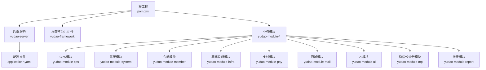
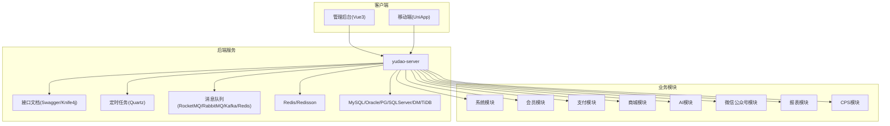
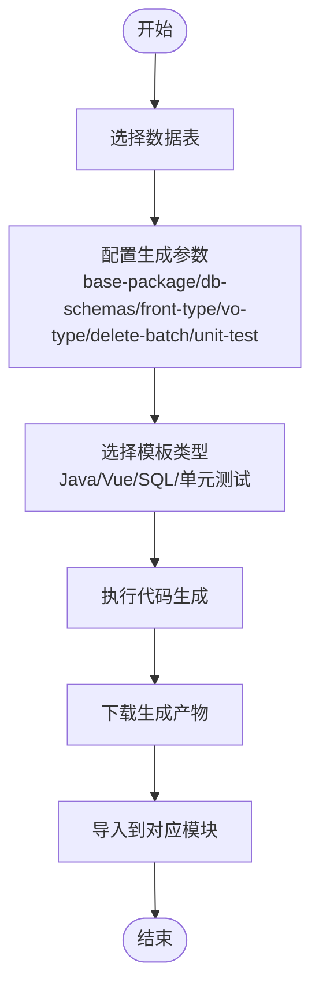
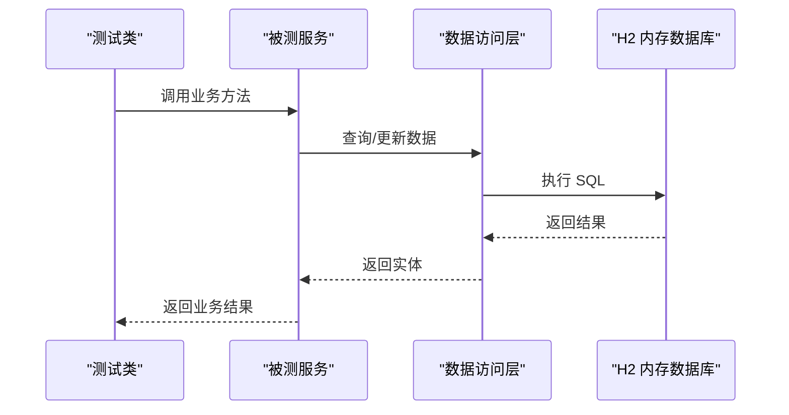
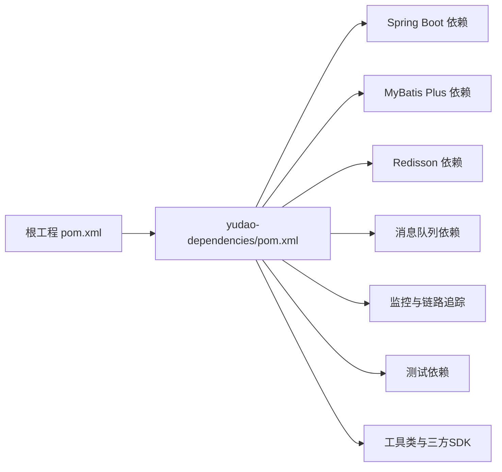

# 开发指南

<cite>
**本文引用的文件**
- [README.md](file://README.md)
- [pom.xml](file://pom.xml)
- [lombok.config](file://lombok.config)
- [application.yaml](file://yudao-server/src/main/resources/application.yaml)
- [application-dev.yaml](file://yudao-server/src/main/resources/application-dev.yaml)
- [yudao-dependencies/pom.xml](file://yudao-dependencies/pom.xml)
- [application-unit-test.yaml](file://yudao-module-infra/src/test/resources/application-unit-test.yaml)
- [Dockerfile](file://yudao-server/Dockerfile)
- [docker.env](file://script/docker/docker.env)
- [docker-compose.yaml](file://sql/tools/docker-compose.yaml)
- [deploy.sh](file://script/shell/deploy.sh)
</cite>

## 目录
1. [简介](#简介)
2. [项目结构](#项目结构)
3. [核心组件](#核心组件)
4. [架构总览](#架构总览)
5. [详细组件分析](#详细组件分析)
6. [依赖分析](#依赖分析)
7. [性能考虑](#性能考虑)
8. [故障排查指南](#故障排查指南)
9. [结论](#结论)
10. [附录](#附录)

## 简介
AgenticCPS 是基于 ruoyi-vue-pro 框架构建的一站式多平台CPS返利查询与导购系统，目标是为消费者提供返利查询、跨平台比价、推广链接生成和返利提现等服务。系统采用多模块架构，后端基于 Spring Boot 3.x + MyBatis Plus，数据库支持 MySQL、Oracle、PostgreSQL、SQL Server、MariaDB、达梦 DM、TiDB 等，缓存使用 Redis，消息队列支持 Event、Redis、RabbitMQ、Kafka、RocketMQ 等，具备完善的基础设施能力（代码生成、接口文档、定时任务、文件存储、WebSocket、监控、链路追踪、服务保障等）。

## 项目结构
- 顶层聚合工程，统一管理版本与插件
- 多模块划分：基础框架、业务模块（系统、会员、基础设施、支付、商城、AI、MP、报表、CPS等）
- 后端服务入口：yudao-server
- 前端：Admin Vue3、Admin UniApp、Mall UniApp
- 基础设施：代码生成、接口文档、定时任务、文件存储、监控、链路追踪等

**图示来源**
- [pom.xml:10-25](file://pom.xml#L10-L25)
- [README.md:363-380](file://README.md#L363-L380)

**章节来源**
- [pom.xml:10-25](file://pom.xml#L10-L25)
- [README.md:363-380](file://README.md#L363-L380)

## 核心组件
- 多模块聚合工程：统一版本管理、插件管理、仓库镜像
- 框架与公共组件：封装通用能力（安全、数据权限、IP、Excel、Redis、MyBatis、作业、监控、MQ、WebSocket、测试等）
- 业务模块：按领域拆分，如系统、会员、支付、商城、AI、MP、报表、CPS等
- 后端服务：yudao-server，提供管理后台与用户APP的服务端能力
- 基础设施：代码生成、接口文档（Swagger/Knife4j）、定时任务、文件存储、WebSocket、监控与链路追踪、服务保障（分布式锁、幂等、限流）

**章节来源**
- [README.md:17-32](file://README.md#L17-L32)
- [README.md:101-123](file://README.md#L101-L123)

## 架构总览
系统采用多模块架构，后端服务通过 Spring Boot 启动，使用 MyBatis Plus 进行数据访问，Redis 作为缓存与消息队列（Redis Streams/Pub/Sub），数据库支持多厂商，消息队列支持多种实现，具备完善的监控与链路追踪能力。

**图示来源**
- [README.md:17-32](file://README.md#L17-L32)
- [application.yaml:41-54](file://yudao-server/src/main/resources/application.yaml#L41-L54)
- [application.yaml:120-145](file://yudao-server/src/main/resources/application.yaml#L120-L145)
- [application.yaml:90-96](file://yudao-server/src/main/resources/application.yaml#L90-L96)

## 详细组件分析

### 开发环境搭建
- IDE 配置
  - 推荐使用 IntelliJ IDEA，启用 Lombok 支持（lombok.config 已配置）
  - Maven 使用华为/阿里镜像加速，提升依赖下载速度
- Maven 项目导入
  - 使用根工程 pom.xml 导入，确保多模块完整加载
  - Java 版本：JDK 17（属性中定义）
- 数据库连接
  - 开发环境默认使用 MySQL，连接串、账号密码在 application-dev.yaml 中配置
  - Druid 连接池监控：开启慢 SQL 记录与控制台访问
- Redis 配置
  - Redisson 默认配置即可满足大多数场景
  - 单元测试使用本地 Redis（端口 16379）
- 消息队列
  - RocketMQ、RabbitMQ、Kafka 可按需启用，配置在 application-dev.yaml 中
- 定时任务
  - Quartz 使用 JDBC 存储，集群模式，线程池大小可调
- 监控与链路追踪
  - Actuator 开放所有端点
  - Spring Boot Admin 客户端配置
  - SkyWalking 链路追踪与日志中心

**章节来源**
- [lombok.config:1-5](file://lombok.config#L1-L5)
- [pom.xml:31-45](file://pom.xml#L31-L45)
- [application-dev.yaml:13-58](file://yudao-server/src/main/resources/application-dev.yaml#L13-L58)
- [application-dev.yaml:67-97](file://yudao-server/src/main/resources/application-dev.yaml#L67-L97)
- [application-dev.yaml:98-114](file://yudao-server/src/main/resources/application-dev.yaml#L98-L114)
- [application-dev.yaml:122-145](file://yudao-server/src/main/resources/application-dev.yaml#L122-L145)
- [application-dev.yaml:146-150](file://yudao-server/src/main/resources/application-dev.yaml#L146-L150)
- [application.yaml:120-145](file://yudao-server/src/main/resources/application.yaml#L120-L145)
- [application.yaml:125-131](file://yudao-server/src/main/resources/application.yaml#L125-L131)
- [application.yaml:132-145](file://yudao-server/src/main/resources/application.yaml#L132-L145)

### 代码规范与最佳实践
- Java 编码规范
  - 遵循阿里巴巴 Java 开发手册
  - 使用 Lombok 简化样板代码（lombok.config 已配置）
- 命名约定
  - 包名：cn.iocoder.yudao.module.{业务域}
  - 类名：驼峰命名，Service/Controller/DAO/DTO/VO/DO
  - 常量：UPPER_SNAKE_CASE
- 注释规范
  - 类与方法需提供清晰注释，接口文档由 Swagger/Knife4j 自动生成
- Git 提交规范
  - 建议采用 Conventional Commits 规范（类型: 说明，范围: 变更描述）
  - 提交前执行单元测试与基本代码检查

**章节来源**
- [README.md:44](file://README.md#L44)
- [lombok.config:1-5](file://lombok.config#L1-L5)
- [application.yaml:41-54](file://yudao-server/src/main/resources/application.yaml#L41-L54)

### 代码生成器使用
- 位置：基础设施模块 yudao-module-infra 提供代码生成能力
- 生成内容：Java、Vue 前后端代码、SQL 脚本、接口文档
- 配置项：base-package、db-schemas、front-type、vo-type、delete-batch-enable、unit-test-enable
- 使用流程
  - 在 Infra 模块中配置生成模板与参数
  - 选择表结构，一键生成 CRUD 代码
  - 下载生成产物并导入对应模块

**图示来源**
- [application.yaml:303-310](file://yudao-server/src/main/resources/application.yaml#L303-L310)

**章节来源**
- [application.yaml:303-310](file://yudao-server/src/main/resources/application.yaml#L303-L310)
- [README.md:27](file://README.md#L27)

### 单元测试编写指南
- 测试框架
  - JUnit 5 + Mockito（含 inline 支持 final 类与静态方法）
- 测试配置
  - 单元测试使用 H2 内存数据库，Redis 端口 16379
  - MyBatis Mapper 延迟加载，提升测试启动速度
- 测试覆盖率
  - 建议核心业务模块覆盖率不低于 80%
- 测试用例设计
  - 覆盖正常路径、边界条件、异常分支
  - 使用 @Mock/@InjectMocks 等注解模拟外部依赖

**图示来源**
- [application-unit-test.yaml:8-23](file://yudao-module-infra/src/test/resources/application-unit-test.yaml#L8-L23)
- [application-unit-test.yaml:24-30](file://yudao-module-infra/src/test/resources/application-unit-test.yaml#L24-L30)
- [application-unit-test.yaml:31-33](file://yudao-module-infra/src/test/resources/application-unit-test.yaml#L31-L33)

**章节来源**
- [yudao-dependencies/pom.xml:389-430](file://yudao-dependencies/pom.xml#L389-L430)
- [application-unit-test.yaml:1-51](file://yudao-module-infra/src/test/resources/application-unit-test.yaml#L1-L51)

### 调试与问题排查
- IDE 调试
  - 使用断点调试，结合日志定位问题
  - 启动参数：-parameters，便于参数名解析
- 日志分析
  - 控制台与文件日志结合，关注慢 SQL 与异常堆栈
  - Druid 监控控制台：/druid
- 性能分析
  - Actuator 暴露端点，采集 JVM、线程、HTTP 请求指标
  - SkyWalking 链路追踪，定位慢调用与异常
- 常见问题
  - 数据库连接失败：检查 application-dev.yaml 中的连接串与账号密码
  - Redis 连接失败：确认端口与网络可达
  - 定时任务未执行：检查 Quartz 配置与集群模式

**章节来源**
- [pom.xml:102-105](file://pom.xml#L102-L105)
- [application-dev.yaml:14-28](file://yudao-server/src/main/resources/application-dev.yaml#L14-L28)
- [application-dev.yaml:146-150](file://yudao-server/src/main/resources/application-dev.yaml#L146-L150)
- [application.yaml:125-131](file://yudao-server/src/main/resources/application.yaml#L125-L131)
- [application.yaml:132-145](file://yudao-server/src/main/resources/application.yaml#L132-L145)

### 扩展开发
- 新增业务模块
  - 在 yudao-module-* 下创建新模块，继承 yudao-dependencies 版本管理
  - 在根 pom.xml 中注册模块
- 扩展现有功能
  - 复用 yudao-framework 中的通用组件（安全、数据权限、Redis、MyBatis、作业、监控、MQ、WebSocket、测试）
- 集成第三方服务
  - 支付：支付宝、微信支付 SDK 已引入
  - 短信：阿里云、腾讯云等短信通道
  - 云存储：MinIO、阿里云、腾讯云、七牛云
  - 微信生态：公众号、小程序、企业微信、钉钉

**章节来源**
- [pom.xml:10-25](file://pom.xml#L10-L25)
- [yudao-dependencies/pom.xml:612-685](file://yudao-dependencies/pom.xml#L612-L685)

### 开发工具与插件推荐
- IDE 插件
  - Lombok（lombok.config 已配置）
  - MapStruct Processor（编译期处理器）
  - Alibaba Java Coding Guidelines（代码规范检查）
- 代码检查
  - SpotBugs、PMD、Checkstyle（建议在 CI 中集成）
- API 测试
  - Postman、REST Client（IDE 内置）
  - Swagger UI：/swagger-ui

**章节来源**
- [lombok.config:1-5](file://lombok.config#L1-L5)
- [pom.xml:69-106](file://pom.xml#L69-L106)
- [application.yaml:41-54](file://yudao-server/src/main/resources/application.yaml#L41-L54)

### 开发流程与协作规范
- 分支管理
  - 主分支：稳定版本
  - 开发分支：feature/*、fix/*、hotfix/*
- 提交与合并
  - 提交前运行单元测试与代码检查
  - 使用 Pull Request 进行代码评审
- 版本发布
  - 使用 Maven 版本管理，统一修订版本号

**章节来源**
- [pom.xml:31-45](file://pom.xml#L31-L45)

## 依赖分析
- 版本管理：yudao-dependencies 统一管理 Spring Boot、MyBatis Plus、Redisson、RocketMQ、Lock4j、SkyWalking、JustAuth、微信 SDK 等依赖版本
- 插件管理：maven-surefire-plugin、maven-compiler-plugin、flatten-maven-plugin
- 仓库镜像：华为云、阿里云 Maven 源加速

**图示来源**
- [pom.xml:47-57](file://pom.xml#L47-L57)
- [yudao-dependencies/pom.xml:84-687](file://yudao-dependencies/pom.xml#L84-L687)

**章节来源**
- [pom.xml:47-57](file://pom.xml#L47-L57)
- [yudao-dependencies/pom.xml:84-687](file://yudao-dependencies/pom.xml#L84-L687)

## 性能考虑
- 数据库性能
  - Druid 连接池参数调优（初始大小、最大活跃数、空闲时间）
  - 慢 SQL 监控与日志分析
- 缓存策略
  - Redis 缓存热点数据，合理设置 TTL
  - 使用 Redisson 进行分布式锁与限流
- 定时任务
  - Quartz 集群模式，线程池大小根据业务负载调整
- 接口性能
  - 启用参数名发现（-parameters），提升调试与可观测性
  - 接口文档与监控端点配合，定位性能瓶颈

**章节来源**
- [application-dev.yaml:33-47](file://yudao-server/src/main/resources/application-dev.yaml#L33-L47)
- [application-dev.yaml:87-95](file://yudao-server/src/main/resources/application-dev.yaml#L87-L95)
- [pom.xml:102-105](file://pom.xml#L102-L105)
- [application.yaml:125-131](file://yudao-server/src/main/resources/application.yaml#L125-L131)

## 故障排查指南
- 启动失败
  - 检查数据库连接串与账号密码
  - 确认 Redis 服务可用
- 接口异常
  - 查看 Swagger UI 与接口文档
  - 结合 Actuator 指标与 SkyWalking 链路追踪
- 单元测试失败
  - 确认 H2 内存数据库初始化脚本
  - 检查 Redis 端口与容器配置

**章节来源**
- [application-dev.yaml:13-58](file://yudao-server/src/main/resources/application-dev.yaml#L13-L58)
- [application-unit-test.yaml:19-23](file://yudao-module-infra/src/test/resources/application-unit-test.yaml#L19-L23)
- [application.yaml:125-131](file://yudao-server/src/main/resources/application.yaml#L125-L131)

## 结论
AgenticCPS 基于成熟的 ruoyi-vue-pro 框架，具备完善的多模块架构与丰富的基础设施能力。通过本文档的开发指南，开发者可以快速搭建开发环境、遵循代码规范、使用代码生成器、编写高质量单元测试，并掌握调试与扩展开发的方法。建议在团队协作中严格执行分支管理与代码评审流程，持续提升系统稳定性与可维护性。

## 附录
- 部署与运维
  - Dockerfile 与 docker-compose.yaml 提供容器化部署参考
  - docker.env 提供环境变量配置示例
  - deploy.sh 提供部署脚本示例

**章节来源**
- [Dockerfile](file://yudao-server/Dockerfile)
- [docker-compose.yaml](file://sql/tools/docker-compose.yaml)
- [docker.env](file://script/docker/docker.env)
- [deploy.sh](file://script/shell/deploy.sh)