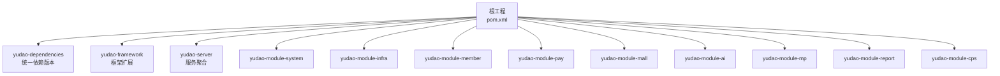
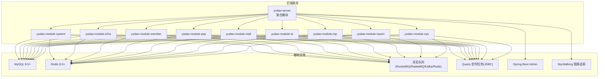
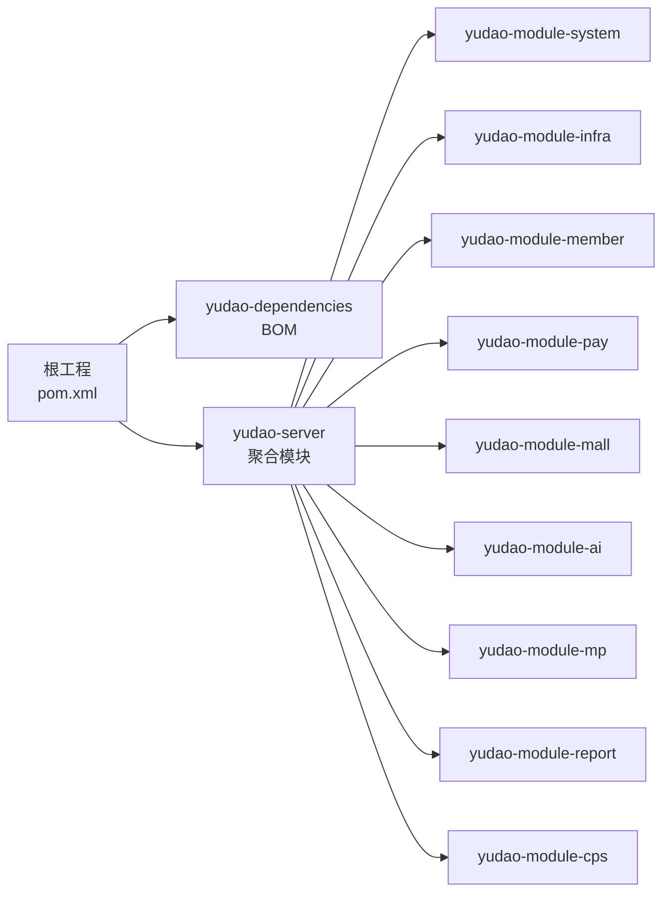

# 开发环境搭建

<cite>
**本文引用的文件**
- [pom.xml](file://pom.xml)
- [yudao-dependencies/pom.xml](file://yudao-dependencies/pom.xml)
- [yudao-server/pom.xml](file://yudao-server/pom.xml)
- [application-dev.yaml](file://yudao-server/src/main/resources/application-dev.yaml)
- [application-local.yaml](file://yudao-server/src/main/resources/application-local.yaml)
- [lombok.config](file://lombok.config)
- [README.md](file://README.md)
- [ruoyi-vue-pro.sql](file://sql/mysql/ruoyi-vue-pro.sql)
- [http-client.env.json](file://script/idea/http-client.env.json)
</cite>

## 目录
1. [简介](#简介)
2. [项目结构](#项目结构)
3. [核心组件](#核心组件)
4. [架构总览](#架构总览)
5. [详细组件分析](#详细组件分析)
6. [依赖关系分析](#依赖关系分析)
7. [性能考虑](#性能考虑)
8. [故障排查指南](#故障排查指南)
9. [结论](#结论)
10. [附录](#附录)

## 简介
本指南面向AgenticCPS系统（基于ruoyi-vue-pro）的开发者，提供从零搭建开发环境的完整步骤，涵盖硬件与软件要求、JDK与Maven版本、IDE推荐配置、数据库与Redis本地部署、项目克隆与导入、配置文件设置、环境验证以及常用开发工具与插件配置。目标是帮助你在最短时间内完成本地开发环境准备并成功运行系统。

## 项目结构
AgenticCPS采用多模块Maven工程，核心模块包括：
- yudao-dependencies：统一依赖版本管理
- yudao-framework：框架扩展与公共能力
- yudao-server：后端服务聚合模块
- yudao-module-*：各业务模块（如system、infra、member、pay、mall、ai、mp、report、cps等）
- yudao-ui-*：前端UI（admin-vue3、admin-uniapp、mall-uniapp）

图表来源
- [pom.xml:10-25](file://pom.xml#L10-L25)
- [yudao-server/pom.xml:23-99](file://yudao-server/pom.xml#L23-L99)

章节来源
- [pom.xml:10-25](file://pom.xml#L10-L25)
- [README.md:363-380](file://README.md#L363-L380)

## 核心组件
- 后端框架：Spring Boot 3.5.9（基于BOM统一管理）
- 数据库：MySQL 8.0+（支持多数据库，含Oracle、PostgreSQL、SQL Server、DM、Kingbase、OpenGauss等）
- 缓存：Redis 6.0+（Redisson客户端）
- 定时任务：Quartz（JDBC存储）
- 消息队列：Event、Redis、RabbitMQ、Kafka、RocketMQ
- 开发工具：Lombok、MapStruct、MyBatis Plus、Druid、Lock4j、SkyWalking、Spring Boot Admin等

章节来源
- [yudao-dependencies/pom.xml:16-82](file://yudao-dependencies/pom.xml#L16-L82)
- [README.md:383-405](file://README.md#L383-L405)

## 架构总览
后端服务通过yudao-server聚合各业务模块，提供RESTful API给前端（admin-vue3、admin-uniapp、mall-uniapp）。系统支持多数据源、分布式锁、定时任务、消息队列、监控与链路追踪等基础设施能力。

图表来源
- [yudao-server/pom.xml:23-99](file://yudao-server/pom.xml#L23-L99)
- [application-dev.yaml:5-66](file://yudao-server/src/main/resources/application-dev.yaml#L5-L66)
- [application-local.yaml:5-87](file://yudao-server/src/main/resources/application-local.yaml#L5-L87)

## 详细组件分析

### 硬件与软件要求
- 操作系统：Windows/Linux/macOS
- CPU：建议至少4核
- 内存：建议8GB以上（开发+数据库+缓存）
- 磁盘：建议50GB可用空间（含JDK、Maven、数据库、Redis）
- 网络：可访问公网（Maven中央仓库、GitHub、第三方SDK）

章节来源
- [README.md:346-351](file://README.md#L346-L351)

### JDK与Maven版本
- JDK版本：项目使用Java 17作为默认版本（属性java.version=17），同时支持JDK 8与JDK 17/21（参考README中的分支说明）
- Maven版本：建议使用Maven 3.6+（具体版本由项目构建插件管理）
- Maven源：项目内置华为云与阿里云镜像加速

章节来源
- [pom.xml:31-45](file://pom.xml#L31-L45)
- [pom.xml:144-173](file://pom.xml#L144-L173)
- [README.md:17-18](file://README.md#L17-L18)

### IDE推荐配置
- IntelliJ IDEA：推荐安装以下插件
  - Lombok（消除样板代码）
  - MapStruct（对象映射）
  - MyBatis Log Plugin（SQL日志）
  - Alibaba Java Coding Guidelines（代码规范）
  - Rainbow Brackets（括号配色）
- Eclipse：推荐安装Lombok插件与Buildship Gradle插件（若使用Gradle）
- 项目导入：推荐使用Maven导入，确保勾选“Import projects recursively”

章节来源
- [lombok.config:1-5](file://lombok.config#L1-L5)
- [yudao-dependencies/pom.xml:458-477](file://yudao-dependencies/pom.xml#L458-L477)

### 数据库与Redis本地配置
- MySQL 8.0+
  - 创建数据库：ruoyi-vue-pro
  - 执行初始化SQL：使用sql/mysql/ruoyi-vue-pro.sql
  - 连接参数：application-dev.yaml与application-local.yaml中已内置默认连接串（127.0.0.1:3306）
- Redis 6.0+
  - 启动Redis服务（默认端口6379）
  - 连接参数：application-dev.yaml与application-local.yaml中已内置默认host/port/database
- Quartz定时任务
  - 本地环境默认关闭自动启动（local），开发环境可按需开启
  - JDBC存储：initialize-schema设为NEVER，需手动创建表结构

章节来源
- [application-dev.yaml:50-57](file://yudao-server/src/main/resources/application-dev.yaml#L50-L57)
- [application-local.yaml:50-86](file://yudao-server/src/main/resources/application-local.yaml#L50-L86)
- [ruoyi-vue-pro.sql:1-200](file://sql/mysql/ruoyi-vue-pro.sql#L1-L200)

### 项目克隆与导入
- 克隆仓库：使用Git克隆到本地
- 导入方式：在IDE中选择“Import Project”，选择根目录的pom.xml，勾选“Import projects recursively”
- 依赖下载：首次导入会自动下载Maven依赖（可使用国内镜像加速）
- 模块选择：默认启用system、infra、member、report、pay、mp、product、promotion、trade、statistics、ai、cps等模块

章节来源
- [yudao-server/pom.xml:23-99](file://yudao-server/pom.xml#L23-L99)
- [pom.xml:10-25](file://pom.xml#L10-L25)

### 环境变量与配置文件
- 环境切换
  - application-dev.yaml：开发环境配置（默认）
  - application-local.yaml：本地开发环境配置（默认关闭Quartz自动启动）
- 关键配置项说明
  - 数据库连接：datasource.dynamic.primary、master/slave URL、用户名/密码
  - Redis连接：data.redis.host/port/database/password
  - 定时任务：spring.quartz.job-store-type、initialize-schema、线程池大小
  - 监控：management.endpoints.web.exposure.include、spring.boot.admin.client.url
  - 日志：logging.file.name
  - 微信公众号/小程序：wx.mp、wx.miniapp、config-storage.type/key-prefix
  - yudao自定义配置：yudao.pay、yudao.cps、yudao.security等

章节来源
- [application-dev.yaml:1-212](file://yudao-server/src/main/resources/application-dev.yaml#L1-L212)
- [application-local.yaml:1-293](file://yudao-server/src/main/resources/application-local.yaml#L1-L293)

### 开发环境验证
- 项目编译：mvn clean install（或IDE中执行）
- 数据库连接测试：启动yudao-server，访问Druid监控页面（默认开启）或查看日志
- 服务启动测试：访问http://127.0.0.1:48080（端口可在application-dev.yaml中配置）
- 接口测试：使用IDE内置HTTP客户端或Postman，参考http-client.env.json中的环境配置

章节来源
- [http-client.env.json:1-21](file://script/idea/http-client.env.json#L1-L21)
- [application-dev.yaml:1-2](file://yudao-server/src/main/resources/application-dev.yaml#L1-L2)

### 常用开发工具与插件
- Lombok：通过lombok.config统一配置（如chain、equals/hashCode等）
- MapStruct：对象映射，配合Lombok使用
- MyBatis Plus：数据库访问增强
- Druid：数据库连接池与SQL监控
- Lock4j：分布式锁
- SkyWalking：链路追踪
- Spring Boot Admin：服务监控
- MyBatis Log Plugin：SQL日志查看

章节来源
- [lombok.config:1-5](file://lombok.config#L1-L5)
- [yudao-dependencies/pom.xml:458-477](file://yudao-dependencies/pom.xml#L458-L477)
- [yudao-dependencies/pom.xml:180-216](file://yudao-dependencies/pom.xml#L180-L216)
- [yudao-dependencies/pom.xml:244-260](file://yudao-dependencies/pom.xml#L244-L260)
- [yudao-dependencies/pom.xml:305-322](file://yudao-dependencies/pom.xml#L305-L322)
- [yudao-dependencies/pom.xml:324-370](file://yudao-dependencies/pom.xml#L324-L370)

## 依赖关系分析
- 依赖管理：yudao-dependencies通过BOM集中管理Spring Boot、MyBatis Plus、Redisson、MapStruct、Lombok等版本
- 构建插件：maven-compiler-plugin、maven-surefire-plugin、flatten-maven-plugin等
- yudao-server聚合各业务模块，按需启用（默认注释的模块可按需取消注释以启用）

图表来源
- [pom.xml:47-57](file://pom.xml#L47-L57)
- [yudao-server/pom.xml:23-99](file://yudao-server/pom.xml#L23-L99)

章节来源
- [pom.xml:47-57](file://pom.xml#L47-L57)
- [yudao-dependencies/pom.xml:84-101](file://yudao-dependencies/pom.xml#L84-L101)
- [yudao-server/pom.xml:23-99](file://yudao-server/pom.xml#L23-L99)

## 性能考虑
- 数据库连接池：Druid默认配置已开启慢SQL记录与连接池参数调优
- 缓存：Redisson默认配置适用于大多数场景，建议根据业务量调整
- 定时任务：Quartz线程池大小与集群配置需结合实际负载评估
- 日志：本地开发可开启DEBUG级别以辅助定位问题，生产环境建议降低日志级别

## 故障排查指南
- 数据库连接失败
  - 检查MySQL服务是否启动
  - 校验application-dev.yaml/application-local.yaml中的URL、用户名、密码
  - 确认ruoyi-vue-pro.sql已执行
- Redis连接失败
  - 检查Redis服务是否启动
  - 校验application-dev.yaml/application-local.yaml中的host/port/database
- 服务启动失败
  - 查看控制台日志，确认端口占用（默认48080）
  - 检查依赖下载是否完整（可清理~/.m2/repository后重试）
- Druid监控不可用
  - 确认spring.datasource.druid.web-stat-filter.enabled=true
  - 访问/druid路径并登录（默认未设置用户名/密码）

章节来源
- [application-dev.yaml:13-31](file://yudao-server/src/main/resources/application-dev.yaml#L13-L31)
- [application-local.yaml:13-31](file://yudao-server/src/main/resources/application-local.yaml#L13-L31)

## 结论
按照本指南完成硬件与软件准备、数据库与Redis本地部署、项目克隆与导入、配置文件设置与环境验证后，你将具备完整的AgenticCPS开发环境。建议在本地开发完成后，结合CI/CD流程进行持续集成与部署。

## 附录
- 端口与服务
  - 后端服务端口：48080（application-dev.yaml）
  - Druid监控：/druid
  - Actuator监控：/actuator
  - Spring Boot Admin：/admin
- 常用命令
  - mvn clean install
  - mvn spring-boot:run（在yudao-server模块）
- 参考文档
  - README.md中的技术栈与模块说明
  - 各模块的入门文档（位于yudao-framework与各模块的资源目录中）