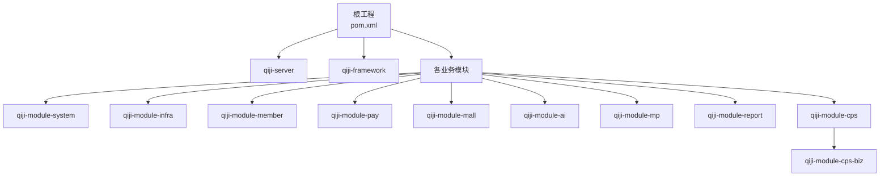
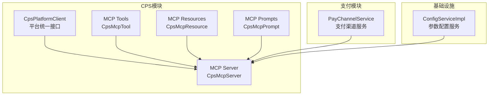
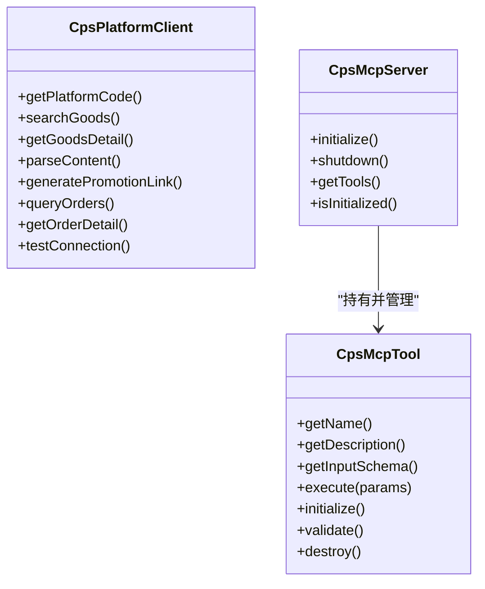
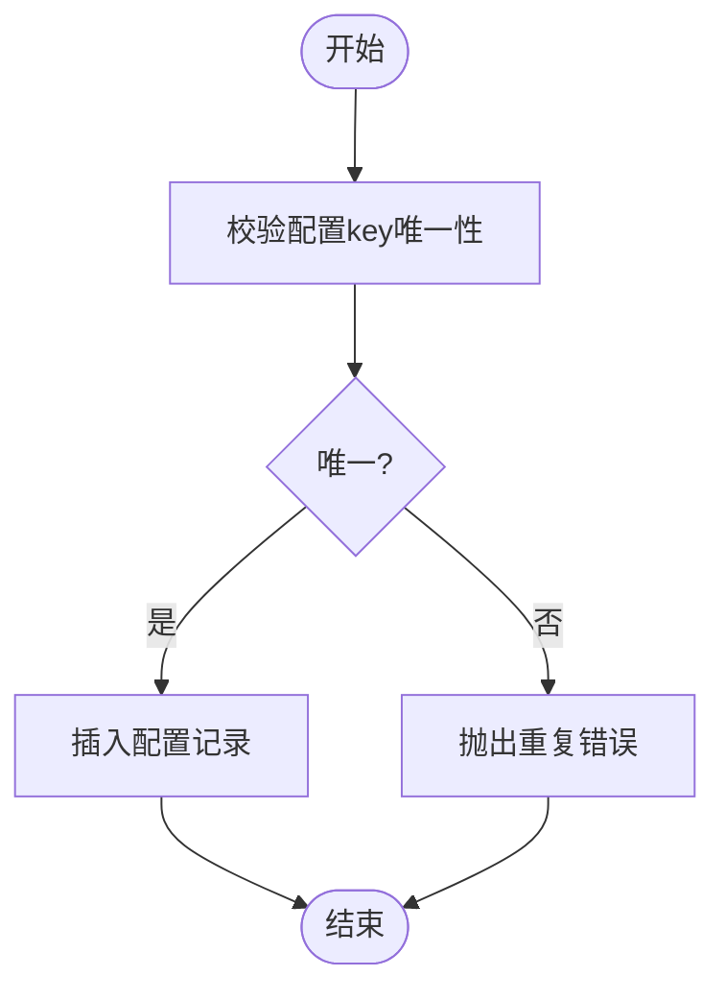
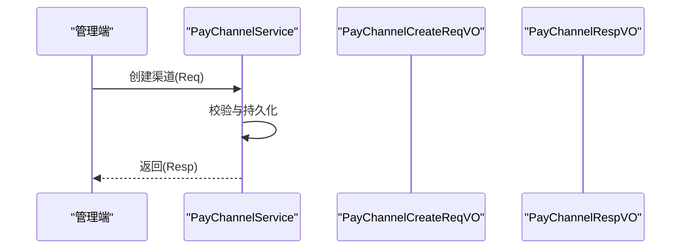
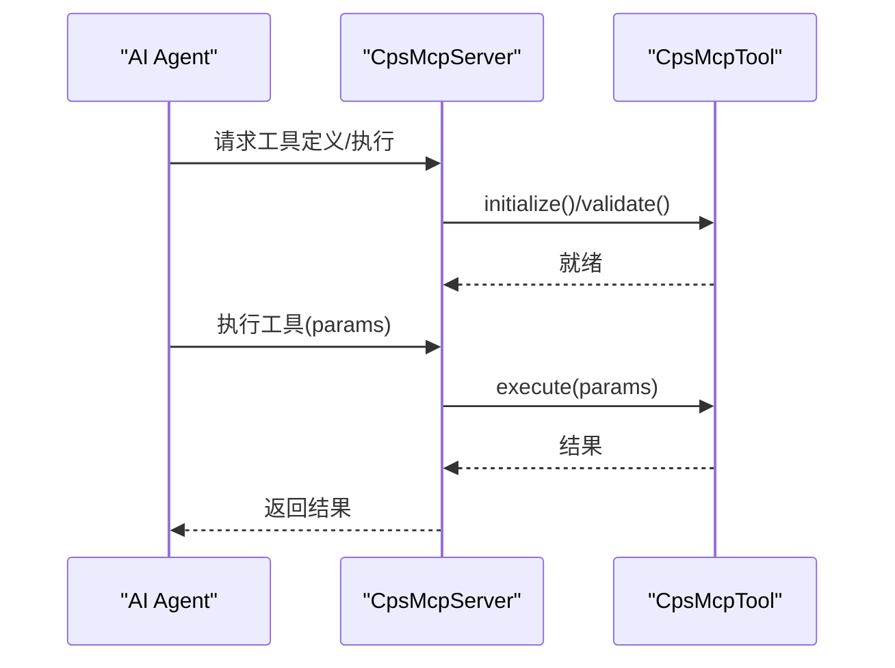
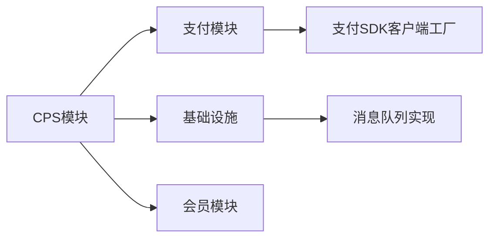

# 扩展开发指南

<cite>
**本文引用的文件**
- [README.md](file://README.md)
- [pom.xml](file://pom.xml)
- [CpsMcpServerConfig.java](file://qiji-module-cps/qiji-module-cps-biz/src/main/java/cn/zhijian/cps/mcp/server/CpsMcpServerConfig.java)
- [CpsMcpServer.java](file://qiji-module-cps/qiji-module-cps-biz/src/main/java/cn/zhijian/cps/mcp/server/CpsMcpServer.java)
- [CpsMcpTool.java](file://qiji-module-cps/qiji-module-cps-biz/src/main/java/cn/zhijian/cps/mcp/tool/CpsMcpTool.java)
- [CpsMcpResource.java](file://qiji-module-cps/qiji-module-cps-biz/src/main/java/cn/zhijian/cps/mcp/resource/CpsMcpResource.java)
- [CpsMcpPrompt.java](file://qiji-module-cps/qiji-module-cps-biz/src/main/java/cn/zhijian/cps/mcp/prompt/CpsMcpPrompt.java)
- [CpsPlatformClient.java](file://qiji-module-cps/qiji-module-cps-biz/src/main/java/cn/zhijian/cps/client/CpsPlatformClient.java)
- [ConfigServiceImpl.java](file://qiji-module-infra/src/main/java/com.qiji.cps/module/infra/service/config/ConfigServiceImpl.java)
- [PayChannelService.java](file://qiji-module-pay/src/main/java/com.qiji.cps/module/pay/service/channel/PayChannelService.java)
- [PayChannelCreateReqVO.java](file://qiji-module-pay/src/main/java/com.qiji.cps/module/pay/controller/admin/channel/vo/PayChannelCreateReqVO.java)
- [PayChannelRespVO.java](file://qiji-module-pay/src/main/java/com.qiji.cps/module/pay/controller/admin/channel/vo/PayChannelRespVO.java)
- [GlobalExceptionHandler.java](file://qiji-framework/qiji-spring-boot-starter-web/src/main/java/com.qiji.cps/framework/web/core/handler/GlobalExceptionHandler.java)
- [CPS系统PRD文档.md](file://docs/CPS系统PRD文档.md)
</cite>

## 目录
1. [引言](#引言)
2. [项目结构](#项目结构)
3. [核心组件](#核心组件)
4. [架构总览](#架构总览)
5. [详细组件分析](#详细组件分析)
6. [依赖分析](#依赖分析)
7. [性能考虑](#性能考虑)
8. [故障排查指南](#故障排查指南)
9. [结论](#结论)
10. [附录](#附录)

## 引言
本指南面向AgenticCPS系统的扩展开发者，围绕以下目标展开：新增业务模块、扩展现有功能、接入第三方服务（CPS平台、支付渠道、消息队列等）、扩展MCP协议能力（新增AI工具、扩展MCP服务器功能、实现自定义MCP资源）、插件化开发设计、配置扩展与热更新、以及最佳实践（接口设计、异常处理、性能与安全）。文档以仓库现有代码为依据，结合PRD与模块化架构，提供可落地的扩展路径。

## 项目结构
AgenticCPS采用多模块Maven聚合工程，核心模块包括系统、基础设施、会员、支付、商城、AI、MP、报表与CPS模块。CPS模块包含API定义、业务实现、适配器、MCP接口层等，是本次扩展的重点。

**图表来源**
- [pom.xml:10-25](file://pom.xml#L10-L25)

**章节来源**
- [pom.xml:10-25](file://pom.xml#L10-L25)
- [README.md:196-352](file://README.md#L196-L352)

## 核心组件
- CPS平台适配层：统一接口定义，策略模式适配多平台（淘宝、京东、拼多多、抖音等）。
- MCP协议层：基于MCP（Model Context Protocol）提供AI Agent接口，包含Tools、Resources、Prompts与Server主入口。
- 支付模块：支付渠道抽象与管理，支持多渠道配置与客户端工厂。
- 基础设施配置：参数配置服务，支持动态配置与分页查询。
- 全局异常处理：针对模块缺失与未实现场景给出明确提示。

**章节来源**
- [CpsPlatformClient.java:11-66](file://qiji-module-cps/qiji-module-cps-biz/src/main/java/cn/zhijian/cps/client/CpsPlatformClient.java#L11-L66)
- [CpsMcpServer.java:16-87](file://qiji-module-cps/qiji-module-cps-biz/src/main/java/cn/zhijian/cps/mcp/server/CpsMcpServer.java#L16-L87)
- [CpsMcpTool.java:9-62](file://qiji-module-cps/qiji-module-cps-biz/src/main/java/cn/zhijian/cps/mcp/tool/CpsMcpTool.java#L9-L62)
- [CpsMcpResource.java:9-52](file://qiji-module-cps/qiji-module-cps-biz/src/main/java/cn/zhijian/cps/mcp/resource/CpsMcpResource.java#L9-L52)
- [CpsMcpPrompt.java:9-53](file://qiji-module-cps/qiji-module-cps-biz/src/main/java/cn/zhijian/cps/mcp/prompt/CpsMcpPrompt.java#L9-L53)
- [PayChannelService.java:18-53](file://qiji-module-pay/src/main/java/com.qiji.cps/module/pay/service/channel/PayChannelService.java#L18-L53)
- [ConfigServiceImpl.java:27-124](file://qiji-module-infra/src/main/java/com.qiji.cps/module/infra/service/config/ConfigServiceImpl.java#L27-L124)
- [GlobalExceptionHandler.java:413-434](file://qiji-framework/qiji-spring-boot-starter-web/src/main/java/com.qiji.cps/framework/web/core/handler/GlobalExceptionHandler.java#L413-L434)

## 架构总览
CPS模块通过适配器模式对接多平台，MCP层为AI Agent提供标准化接口，支付模块与基础设施模块提供能力复用。整体遵循“模块解耦、接口抽象、策略扩展”的设计原则。

**图表来源**
- [CpsPlatformClient.java:11-66](file://qiji-module-cps/qiji-module-cps-biz/src/main/java/cn/zhijian/cps/client/CpsPlatformClient.java#L11-L66)
- [CpsMcpServer.java:16-87](file://qiji-module-cps/qiji-module-cps-biz/src/main/java/cn/zhijian/cps/mcp/server/CpsMcpServer.java#L16-L87)
- [CpsMcpTool.java:9-62](file://qiji-module-cps/qiji-module-cps-biz/src/main/java/cn/zhijian/cps/mcp/tool/CpsMcpTool.java#L9-L62)
- [CpsMcpResource.java:9-52](file://qiji-module-cps/qiji-module-cps-biz/src/main/java/cn/zhijian/cps/mcp/resource/CpsMcpResource.java#L9-L52)
- [CpsMcpPrompt.java:9-53](file://qiji-module-cps/qiji-module-cps-biz/src/main/java/cn/zhijian/cps/mcp/prompt/CpsMcpPrompt.java#L9-L53)
- [PayChannelService.java:18-53](file://qiji-module-pay/src/main/java/com.qiji.cps/module/pay/service/channel/PayChannelService.java#L18-L53)
- [ConfigServiceImpl.java:27-124](file://qiji-module-infra/src/main/java/com.qiji.cps/module/infra/service/config/ConfigServiceImpl.java#L27-L124)

## 详细组件分析

### 新增业务模块（策略扩展与自动装配）
- 模块结构设计
  - 建议沿用现有模块目录风格：controller、service、dal、convert、enums、job、mcp（如涉及AI接口）等。
  - 若为平台扩展，参考CPS平台适配器模式，定义统一Client接口并提供具体实现。
- 依赖关系配置
  - 在根pom中新增模块声明，确保依赖版本由qiji-dependencies统一管理。
  - 如需复用支付、会员、系统能力，引入对应模块依赖。
- 自动装配配置
  - 使用Spring配置类注册Bean，或通过条件装配启用模块功能。
  - 对于MCP扩展，参考CpsMcpServerConfig，将Tool/Resource/Prompt注入Server。
- 模块间通信
  - 通过接口契约与DTO进行解耦；必要时使用消息队列或定时任务异步通信。

**图表来源**
- [CpsPlatformClient.java:11-66](file://qiji-module-cps/qiji-module-cps-biz/src/main/java/cn/zhijian/cps/client/CpsPlatformClient.java#L11-L66)
- [CpsMcpServer.java:16-87](file://qiji-module-cps/qiji-module-cps-biz/src/main/java/cn/zhijian/cps/mcp/server/CpsMcpServer.java#L16-L87)
- [CpsMcpTool.java:9-62](file://qiji-module-cps/qiji-module-cps-biz/src/main/java/cn/zhijian/cps/mcp/tool/CpsMcpTool.java#L9-L62)

**章节来源**
- [CpsPlatformClient.java:11-66](file://qiji-module-cps/qiji-module-cps-biz/src/main/java/cn/zhijian/cps/client/CpsPlatformClient.java#L11-L66)
- [CpsMcpServerConfig.java:15-30](file://qiji-module-cps/qiji-module-cps-biz/src/main/java/cn/zhijian/cps/mcp/server/CpsMcpServerConfig.java#L15-L30)
- [CpsMcpServer.java:16-87](file://qiji-module-cps/qiji-module-cps-biz/src/main/java/cn/zhijian/cps/mcp/server/CpsMcpServer.java#L16-L87)

### 扩展现有功能（接口与配置）
- 在现有模块中添加新功能
  - 保持接口稳定，新增方法采用默认方法或扩展接口，避免破坏兼容性。
  - 使用枚举与DTO扩展配置项，避免硬编码。
- 修改现有接口
  - 通过版本化或条件配置实现平滑过渡；对不兼容变更提供迁移指引。
- 扩展配置选项
  - 借鉴ConfigServiceImpl的实现，提供key唯一性校验、分页查询、系统/自定义配置区分等能力。

**图表来源**
- [ConfigServiceImpl.java:97-122](file://qiji-module-infra/src/main/java/com.qiji.cps/module/infra/service/config/ConfigServiceImpl.java#L97-L122)

**章节来源**
- [ConfigServiceImpl.java:27-124](file://qiji-module-infra/src/main/java/com.qiji.cps/module/infra/service/config/ConfigServiceImpl.java#L27-L124)

### 第三方服务集成（CPS平台、支付渠道、消息队列）
- 接入新的CPS平台
  - 实现CpsPlatformClient接口，提供平台编码与核心能力（搜索、详情、解析、转链、订单查询等）。
  - 在适配器目录新增平台包，并在配置处注册。
- 集成新的支付渠道
  - 使用PayChannelService接口管理渠道，Create/Update/Query/Delete均通过VO驱动。
  - 渠道配置以JSON字符串形式存储，便于扩展不同SDK参数。
- 扩展消息队列
  - 复用qiji-spring-boot-starter-mq，按需引入RabbitMQ/Kafka/RocketMQ等实现。

**图表来源**
- [PayChannelService.java:18-53](file://qiji-module-pay/src/main/java/com.qiji.cps/module/pay/service/channel/PayChannelService.java#L18-L53)
- [PayChannelCreateReqVO.java:15-25](file://qiji-module-pay/src/main/java/com.qiji.cps/module/pay/controller/admin/channel/vo/PayChannelCreateReqVO.java#L15-L25)
- [PayChannelRespVO.java:11-25](file://qiji-module-pay/src/main/java/com.qiji.cps/module/pay/controller/admin/channel/vo/PayChannelRespVO.java#L11-L25)

**章节来源**
- [CpsPlatformClient.java:11-66](file://qiji-module-cps/qiji-module-cps-biz/src/main/java/cn/zhijian/cps/client/CpsPlatformClient.java#L11-L66)
- [PayChannelService.java:18-53](file://qiji-module-pay/src/main/java/com.qiji.cps/module/pay/service/channel/PayChannelService.java#L18-L53)
- [PayChannelCreateReqVO.java:15-25](file://qiji-module-pay/src/main/java/com.qiji.cps/module/pay/controller/admin/channel/vo/PayChannelCreateReqVO.java#L15-L25)
- [PayChannelRespVO.java:11-25](file://qiji-module-pay/src/main/java/com.qiji.cps/module/pay/controller/admin/channel/vo/PayChannelRespVO.java#L11-L25)

### MCP协议扩展（新增AI工具、扩展服务器、自定义资源）
- 添加新的AI工具
  - 实现CpsMcpTool接口，提供名称、描述、输入Schema与执行逻辑。
  - 在CpsMcpServerConfig中注入List<CpsMcpTool>，由Server统一初始化与验证。
- 扩展MCP服务器功能
  - 通过CpsMcpServer的initialize/shutdown管理生命周期；可扩展能力声明与ServerInfo。
- 实现自定义MCP资源
  - 实现CpsMcpResource接口，提供只读数据读取能力；在Server中注册。
- MCP访问控制与统计
  - 参考PRD中的API Key管理、Tools配置、访问日志等页面，可在管理后台进行权限与限流配置。

**图表来源**
- [CpsMcpServer.java:38-61](file://qiji-module-cps/qiji-module-cps-biz/src/main/java/cn/zhijian/cps/mcp/server/CpsMcpServer.java#L38-L61)
- [CpsMcpTool.java:29-30](file://qiji-module-cps/qiji-module-cps-biz/src/main/java/cn/zhijian/cps/mcp/tool/CpsMcpTool.java#L29-L30)

**章节来源**
- [CpsMcpServerConfig.java:15-30](file://qiji-module-cps/qiji-module-cps-biz/src/main/java/cn/zhijian/cps/mcp/server/CpsMcpServerConfig.java#L15-L30)
- [CpsMcpServer.java:16-87](file://qiji-module-cps/qiji-module-cps-biz/src/main/java/cn/zhijian/cps/mcp/server/CpsMcpServer.java#L16-L87)
- [CpsMcpTool.java:9-62](file://qiji-module-cps/qiji-module-cps-biz/src/main/java/cn/zhijian/cps/mcp/tool/CpsMcpTool.java#L9-L62)
- [CpsMcpResource.java:9-52](file://qiji-module-cps/qiji-module-cps-biz/src/main/java/cn/zhijian/cps/mcp/resource/CpsMcpResource.java#L9-L52)
- [CPS系统PRD文档.md:698-737](file://docs/CPS系统PRD文档.md#L698-L737)

### 插件化开发设计
- 接口定义：参考CpsPlatformClient、CpsMcpTool等接口，统一抽象能力边界。
- 实现注册：通过Spring容器注入或配置类注册，实现“即插即用”。
- 动态加载：结合配置中心与条件装配，实现运行时开关与热切换。

**章节来源**
- [CpsPlatformClient.java:11-66](file://qiji-module-cps/qiji-module-cps-biz/src/main/java/cn/zhijian/cps/client/CpsPlatformClient.java#L11-L66)
- [CpsMcpTool.java:9-62](file://qiji-module-cps/qiji-module-cps-biz/src/main/java/cn/zhijian/cps/mcp/tool/CpsMcpTool.java#L9-L62)

### 配置扩展（新增配置项、热更新、多环境）
- 新增配置项：沿用ConfigServiceImpl的key唯一性校验与分页查询，支持系统/自定义配置区分。
- 热更新：结合基础设施模块的配置能力，实现运行时刷新；对MCP Server可提供重载能力。
- 多环境：通过application-{env}.yaml与环境变量组合，实现不同环境差异化配置。

**章节来源**
- [ConfigServiceImpl.java:27-124](file://qiji-module-infra/src/main/java/com.qiji.cps/module/infra/service/config/ConfigServiceImpl.java#L27-L124)

## 依赖分析
- 模块耦合
  - CPS模块对支付、会员、系统、基础设施存在复用关系，建议通过接口与DTO解耦。
  - MCP扩展与CPS业务解耦，通过Tool/Resource/Prompt接口隔离。
- 外部依赖
  - 支付模块依赖支付SDK客户端工厂；消息队列依赖具体实现（Redis/RabbitMQ/Kafka/RocketMQ）。
- 循环依赖
  - 通过接口抽象与分层设计避免循环依赖；若出现，优先下沉或拆分。

**图表来源**
- [pom.xml:10-25](file://pom.xml#L10-L25)
- [PayChannelService.java:18-53](file://qiji-module-pay/src/main/java/com.qiji.cps/module/pay/service/channel/PayChannelService.java#L18-L53)

**章节来源**
- [pom.xml:10-25](file://pom.xml#L10-L25)
- [PayChannelService.java:18-53](file://qiji-module-pay/src/main/java/com.qiji.cps/module/pay/service/channel/PayChannelService.java#L18-L53)

## 性能考虑
- 搜索与比价延迟：单平台搜索P99<2秒，多平台比价P99<5秒，转链生成<1秒。
- 订单与返利：订单同步延迟<30分钟，返利入账在平台结算后24小时内。
- 并发与限流：MCP侧可通过API Key与限流配置控制QPS；支付与CPS接口建议结合限流与熔断。

**章节来源**
- [README.md:306-315](file://README.md#L306-L315)

## 故障排查指南
- 模块缺失提示：当调用未开启模块接口时，全局异常处理器会返回明确提示，指引用户导入对应模块表结构或开启模块。
- 支付模块：确认渠道配置JSON格式正确，渠道编码与状态有效。
- MCP访问：检查API Key权限级别与限流配置，核对Tools与Resources定义是否正确初始化。

**章节来源**
- [GlobalExceptionHandler.java:413-434](file://qiji-framework/qiji-spring-boot-starter-web/src/main/java/com.qiji.cps/framework/web/core/handler/GlobalExceptionHandler.java#L413-L434)
- [PayChannelCreateReqVO.java:17-23](file://qiji-module-pay/src/main/java/com.qiji.cps/module/pay/controller/admin/channel/vo/PayChannelCreateReqVO.java#L17-L23)

## 结论
通过策略适配、接口抽象与MCP协议扩展，AgenticCPS具备良好的可扩展性。开发者可按本文路径快速新增模块、扩展功能、接入第三方服务与AI工具，并在保证性能与安全的前提下实现稳定演进。

## 附录
- 最佳实践清单
  - 接口设计：保持向后兼容，使用默认方法与版本化策略。
  - 异常处理：统一异常分类与提示，避免泄露内部细节。
  - 性能优化：缓存热点数据、异步处理耗时操作、合理限流与降级。
  - 安全防护：API Key分级、参数校验、敏感信息脱敏、审计日志。