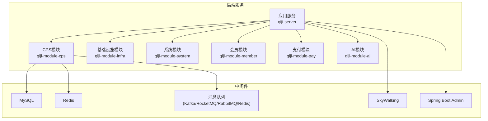
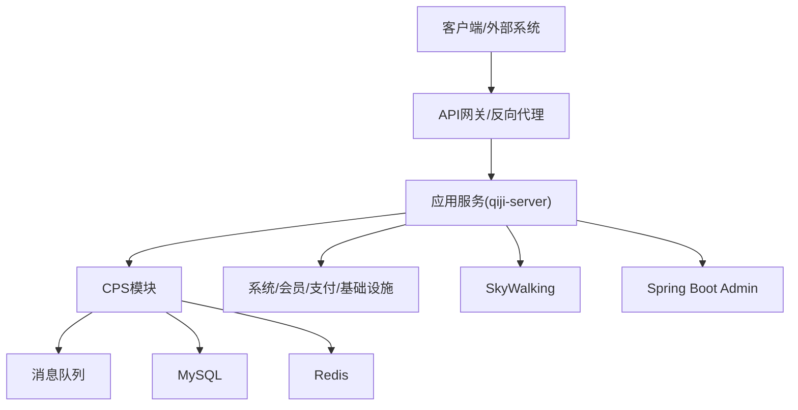
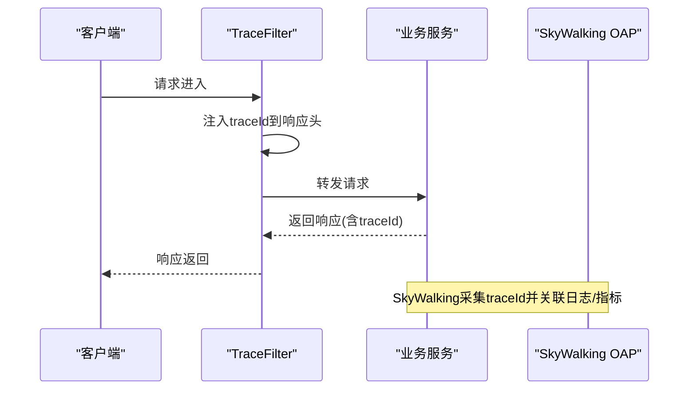
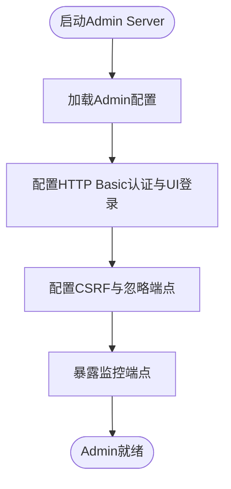
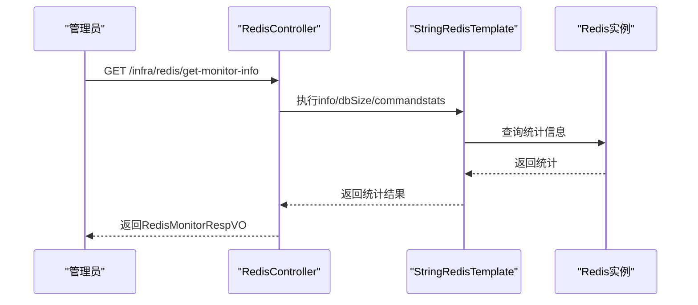
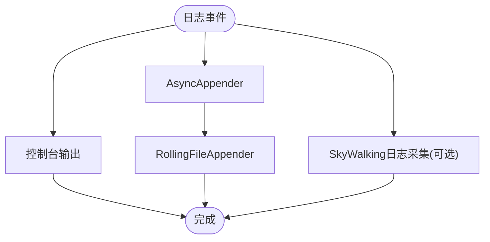
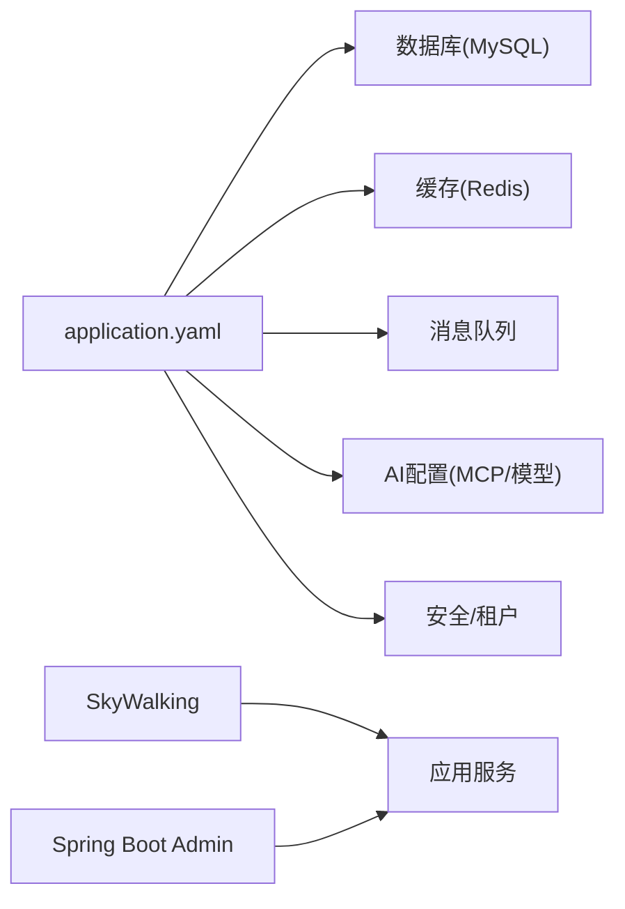

# 调试与问题排查

<cite>
**本文引用的文件**
- [README.md](file://README.md)
- [application.yaml](file://qiji-server/src/main/resources/application.yaml)
- [logback-spring.xml](file://qiji-server/src/main/resources/logback-spring.xml)
- [QijiTracerAutoConfiguration.java](file://qiji-framework/qiji-spring-boot-starter-monitor/src/main/java/com.qiji.cps/framework/tracer/config/QijiTracerAutoConfiguration.java)
- [QijiMetricsAutoConfiguration.java](file://qiji-framework/qiji-spring-boot-starter-monitor/src/main/java/com.qiji.cps/framework/tracer/config/QijiMetricsAutoConfiguration.java)
- [BizTrace.java](file://qiji-framework/qiji-spring-boot-starter-monitor/src/main/java/com.qiji.cps/framework/tracer/core/annotation/BizTrace.java)
- [AdminServerConfiguration.java](file://qiji-module-infra/src/main/java/com.qiji.cps/module/infra/framework/monitor/config/AdminServerConfiguration.java)
- [RedisController.java](file://qiji-module-infra/src/main/java/com.qiji.cps/module/infra/controller/admin/redis/RedisController.java)
- [RedisMonitorRespVO.java](file://qiji-module-infra/src/main/java/com.qiji.cps/module/infra/controller/admin/redis/vo/RedisMonitorRespVO.java)
- [RedisConvert.java](file://qiji-module-infra/src/main/java/com.qiji.cps/module/infra/convert/redis/RedisConvert.java)
- [RedisTestConfiguration.java](file://qiji-framework/qiji-spring-boot-starter-test/src/main/java/com.qiji.cps/framework/test/config/RedisTestConfiguration.java)
</cite>

## 目录
1. [简介](#简介)
2. [项目结构](#项目结构)
3. [核心组件](#核心组件)
4. [架构总览](#架构总览)
5. [详细组件分析](#详细组件分析)
6. [依赖分析](#依赖分析)
7. [性能考虑](#性能考虑)
8. [故障排查指南](#故障排查指南)
9. [结论](#结论)
10. [附录](#附录)

## 简介
本指南面向AgenticCPS系统（基于ruoyi-vue-pro）的研发与运维团队，提供系统性的调试与问题排查方法。内容覆盖IDE断点调试、变量观察、调用栈分析、远程调试、日志分析（Logback配置、日志级别、关键日志追踪、异常堆栈）、性能分析工具（JProfiler、VisualVM、Arthas）使用建议、常见问题诊断（数据库连接、Redis连接、API接口异常、业务逻辑错误）、监控与告警（SkyWalking链路追踪、Spring Boot Admin监控、自定义指标）、问题排查流程（问题复现、日志收集、代码分析、环境对比）以及生产环境处理流程（上报、紧急处理、修复验证、回滚预案）。

## 项目结构
AgenticCPS系统采用多模块架构，后端以Spring Boot为核心，结合MyBatis Plus、Redis/Redisson、消息队列（Kafka/RocketMQ/RabbitMQ/Redis Pub/Sub）、工作流（Flowable）、AI能力（Spring AI + MCP）、监控（SkyWalking、Spring Boot Admin、Micrometer）等技术栈。CPS模块位于qiji-module-cps，提供多平台CPS接入、商品搜索/比价、推广链接生成、订单同步、佣金结算、返利配置与提现等能力，并通过MCP协议对外提供AI Agent接口。

**章节来源**
- [README.md: 193-352:193-352](file://README.md#L193-L352)

## 核心组件
- 应用配置与运行环境
  - application.yaml：包含Spring、MyBatis Plus、Redis、消息队列、AI与MCP、安全与租户、WebSocket、Swagger等配置项，支撑系统运行与调试。
- 日志系统
  - logback-spring.xml：控制台输出、异步文件输出、可选SkyWalking日志采集，支持按级别与模式输出。
- 链路追踪与指标
  - QijiTracerAutoConfiguration：注册TraceFilter，注入traceId到响应头，便于SkyWalking采集。
  - QijiMetricsAutoConfiguration：Micrometer通用标签配置，统一应用名标签。
  - BizTrace注解：业务埋点标签（biz.id、biz.type），配合SkyWalking OAP侧配置生效。
- 监控与告警
  - AdminServerConfiguration：Spring Boot Admin服务端启用与安全配置（HTTP Basic + UI登录），独立于业务Token认证。
  - RedisController：提供Redis监控信息接口，便于排查缓存问题。
- 测试与本地调试
  - RedisTestConfiguration：单元测试中内嵌Redis服务，便于本地快速验证。

**章节来源**
- [application.yaml: 1-353:1-353](file://qiji-server/src/main/resources/application.yaml#L1-L353)
- [logback-spring.xml: 1-57:1-57](file://qiji-server/src/main/resources/logback-spring.xml#L1-L57)
- [QijiTracerAutoConfiguration.java: 1-54:1-54](file://qiji-framework/qiji-spring-boot-starter-monitor/src/main/java/com.qiji.cps/framework/tracer/config/QijiTracerAutoConfiguration.java#L1-L54)
- [QijiMetricsAutoConfiguration.java: 1-28:1-28](file://qiji-framework/qiji-spring-boot-starter-monitor/src/main/java/com.qiji.cps/framework/tracer/config/QijiMetricsAutoConfiguration.java#L1-L28)
- [BizTrace.java: 1-43:1-43](file://qiji-framework/qiji-spring-boot-starter-monitor/src/main/java/com.qiji.cps/framework/tracer/core/annotation/BizTrace.java#L1-L43)
- [AdminServerConfiguration.java: 1-108:1-108](file://qiji-module-infra/src/main/java/com.qiji.cps/module/infra/framework/monitor/config/AdminServerConfiguration.java#L1-L108)
- [RedisController.java: 1-43:1-43](file://qiji-module-infra/src/main/java/com.qiji.cps/module/infra/controller/admin/redis/RedisController.java#L1-L43)
- [RedisMonitorRespVO.java: 1-43:1-43](file://qiji-module-infra/src/main/java/com.qiji.cps/module/infra/controller/admin/redis/vo/RedisMonitorRespVO.java#L1-L43)
- [RedisConvert.java: 1-29:1-29](file://qiji-module-infra/src/main/java/com.qiji.cps/module/infra/convert/redis/RedisConvert.java#L1-L29)
- [RedisTestConfiguration.java: 1-35:1-35](file://qiji-framework/qiji-spring-boot-starter-test/src/main/java/com.qiji.cps/framework/test/config/RedisTestConfiguration.java#L1-L35)

## 架构总览
系统采用“应用服务 + 多业务模块 + 中间件”的分层架构。应用服务负责统一入口与配置，业务模块按职责拆分，中间件提供数据存储、消息与链路追踪能力。监控体系通过SkyWalking与Spring Boot Admin实现端到端观测。

**图表来源**
- [application.yaml: 1-353:1-353](file://qiji-server/src/main/resources/application.yaml#L1-L353)
- [README.md: 193-352:193-352](file://README.md#L193-L352)

## 详细组件分析

### 链路追踪与业务埋点
- TraceFilter：在过滤器阶段注入traceId到响应头，便于SkyWalking采集。
- BizTrace注解：在方法上标注biz.id与biz.type，结合SkyWalking OAP侧配置生效，实现业务维度的链路追踪。
- Micrometer指标：统一common tags（application），便于在Admin与Prometheus/Grafana中聚合。

**图表来源**
- [QijiTracerAutoConfiguration.java: 45-51:45-51](file://qiji-framework/qiji-spring-boot-starter-monitor/src/main/java/com.qiji.cps/framework/tracer/config/QijiTracerAutoConfiguration.java#L45-L51)
- [BizTrace.java: 16-42:16-42](file://qiji-framework/qiji-spring-boot-starter-monitor/src/main/java/com.qiji.cps/framework/tracer/core/annotation/BizTrace.java#L16-L42)

**章节来源**
- [QijiTracerAutoConfiguration.java: 17-53:17-53](file://qiji-framework/qiji-spring-boot-starter-monitor/src/main/java/com.qiji.cps/framework/tracer/config/QijiTracerAutoConfiguration.java#L17-L53)
- [QijiMetricsAutoConfiguration.java: 16-27:16-27](file://qiji-framework/qiji-spring-boot-starter-monitor/src/main/java/com.qiji.cps/framework/tracer/config/QijiMetricsAutoConfiguration.java#L16-L27)
- [BizTrace.java: 13-42:13-42](file://qiji-framework/qiji-spring-boot-starter-monitor/src/main/java/com.qiji.cps/framework/tracer/core/annotation/BizTrace.java#L13-L42)

### Spring Boot Admin监控
- AdminServerConfiguration启用Admin Server，使用独立的HTTP Basic认证与UI登录，不影响业务Token认证。
- 支持静态资源放行、异步请求放行、CSRF配置等，确保客户端注册与UI访问正常。

**图表来源**
- [AdminServerConfiguration.java: 30-105:30-105](file://qiji-module-infra/src/main/java/com.qiji.cps/module/infra/framework/monitor/config/AdminServerConfiguration.java#L30-L105)

**章节来源**
- [AdminServerConfiguration.java: 29-107:29-107](file://qiji-module-infra/src/main/java/com.qiji.cps/module/infra/framework/monitor/config/AdminServerConfiguration.java#L29-L107)

### Redis监控接口
- RedisController提供/get-monitor-info接口，获取info、dbSize、命令统计等信息，便于定位热点命令、内存与慢查询。
- RedisConvert将Redis命令统计解析为标准化结构，RedisMonitorRespVO定义返回体。

**图表来源**
- [RedisController.java: 29-41:29-41](file://qiji-module-infra/src/main/java/com.qiji.cps/module/infra/controller/admin/redis/RedisController.java#L29-L41)
- [RedisConvert.java: 16-27:16-27](file://qiji-module-infra/src/main/java/com.qiji.cps/module/infra/convert/redis/RedisConvert.java#L16-L27)
- [RedisMonitorRespVO.java: 15-43:15-43](file://qiji-module-infra/src/main/java/com.qiji.cps/module/infra/controller/admin/redis/vo/RedisMonitorRespVO.java#L15-L43)

**章节来源**
- [RedisController.java: 24-43:24-43](file://qiji-module-infra/src/main/java/com.qiji.cps/module/infra/controller/admin/redis/RedisController.java#L24-L43)
- [RedisMonitorRespVO.java: 11-43:11-43](file://qiji-module-infra/src/main/java/com.qiji.cps/module/infra/controller/admin/redis/vo/RedisMonitorRespVO.java#L11-L43)
- [RedisConvert.java: 12-29:12-29](file://qiji-module-infra/src/main/java/com.qiji.cps/module/infra/convert/redis/RedisConvert.java#L12-L29)

### 日志系统与分析
- 控制台输出：CONSOLE_LOG_PATTERN高亮输出，便于本地调试。
- 文件输出：RollingFileAppender按天与大小滚动，避免单文件过大。
- 异步写入：AsyncAppender提升吞吐，减少I/O阻塞。
- SkyWalking日志采集：可选启用，实现日志中心与链路关联。

**图表来源**
- [logback-spring.xml: 8-54:8-54](file://qiji-server/src/main/resources/logback-spring.xml#L8-L54)

**章节来源**
- [logback-spring.xml: 1-57:1-57](file://qiji-server/src/main/resources/logback-spring.xml#L1-L57)

## 依赖分析
- 配置依赖
  - application.yaml集中管理数据库、缓存、消息队列、AI/MCP、安全与租户等配置，影响调试与排障方向。
- 监控依赖
  - SkyWalking与Spring Boot Admin作为外部组件，需正确配置Agent与服务端，确保链路与指标可用。
- 模块耦合
  - CPS模块依赖基础设施（Redis、消息队列、定时任务）、系统模块（权限、字典）、支付模块（钱包/提现）、AI模块（向量存储、模型）。

**图表来源**
- [application.yaml: 1-353:1-353](file://qiji-server/src/main/resources/application.yaml#L1-L353)
- [README.md: 383-404:383-404](file://README.md#L383-L404)

**章节来源**
- [application.yaml: 1-353:1-353](file://qiji-server/src/main/resources/application.yaml#L1-L353)
- [README.md: 383-404:383-404](file://README.md#L383-L404)

## 性能考虑
- 日志性能
  - 使用AsyncAppender与合理队列大小，避免日志成为性能瓶颈。
  - 控制台高亮输出仅用于本地开发，生产环境建议关闭或降低级别。
- 链路追踪
  - traceId注入与指标标签统一，有助于快速定位热点接口与慢事务。
- 缓存与数据库
  - Redis命令统计与dbSize监控，结合热点命令优化与索引调整。
  - SQL慢查询与连接池状态监控，结合业务埋点定位瓶颈。

[本节为通用指导，无需列出章节来源]

## 故障排查指南

### IDE调试技巧
- 断点设置
  - 在Controller入口、Service关键方法、DAO层SQL执行前后设置断点，观察参数与返回值。
  - 在异常捕获处设置条件断点，仅在特定异常类型或业务条件下触发。
- 变量观察
  - 观察上下文参数（如traceId、memberId、itemId）、DTO转换结果、Redis Key前缀与TTL、SQL执行计划。
- 调用栈分析
  - 结合traceId在SkyWalking中查看调用链，定位异常发生的具体环节。
- 远程调试
  - 通过JVM参数开启远程调试端口，连接生产/预发环境进行断点调试，注意仅在低峰时段进行。

[本节为通用指导，无需列出章节来源]

### 日志分析方法
- Logback配置
  - 控制台高亮输出、文件滚动策略、异步写入、可选SkyWalking日志采集。
- 日志级别
  - 本地开发：DEBUG；测试/预发：INFO；生产：WARN/ERROR，避免日志风暴。
- 关键日志追踪
  - 业务埋点：BizTrace注解标注biz.id与biz.type，配合SkyWalking OAP配置生效。
  - API访问日志：结合Swagger接口文档与访问日志，定位请求参数与响应异常。
- 异常堆栈分析
  - 重点查看异常根因、调用栈中业务方法、第三方SDK返回码与错误描述。

**章节来源**
- [logback-spring.xml: 1-57:1-57](file://qiji-server/src/main/resources/logback-spring.xml#L1-L57)
- [BizTrace.java: 13-42:13-42](file://qiji-framework/qiji-spring-boot-starter-monitor/src/main/java/com.qiji.cps/framework/tracer/core/annotation/BizTrace.java#L13-L42)

### 性能分析工具使用
- JProfiler/VisualVM
  - 适用于CPU、内存、GC、线程、SQL与JDBC连接池的可视化分析。
- Arthas
  - 在生产环境非侵入式诊断，支持方法级耗时分析、类与方法热力图、动态替换、线程转储等。
- 使用建议
  - 优先在预发环境验证，生产环境谨慎开启，避免对业务造成额外开销。

[本节为通用指导，无需列出章节来源]

### 常见问题诊断与解决
- 数据库连接问题
  - 现象：连接超时、连接池耗尽、SQL执行缓慢。
  - 排查：检查application.yaml中的数据源配置、连接池参数；结合数据库监控与慢查询日志定位。
- Redis连接问题
  - 现象：连接失败、命令超时、Key过期异常。
  - 排查：使用/get-monitor-info接口查看dbSize与命令统计；核对Redis连接配置与网络连通性。
- API接口异常
  - 现象：401/403鉴权失败、400参数校验失败、500服务异常。
  - 排查：结合Swagger接口文档核对请求参数；查看API访问日志与异常日志；确认BizTrace埋点与traceId。
- 业务逻辑错误
  - 现象：订单状态不同步、返利计算偏差、推广链接无效。
  - 排查：核对CPS平台适配器与策略配置；检查定时任务与消息队列消费；结合业务埋点与链路追踪定位。

**章节来源**
- [application.yaml: 120-145:120-145](file://qiji-server/src/main/resources/application.yaml#L120-L145)
- [RedisController.java: 29-41:29-41](file://qiji-module-infra/src/main/java/com.qiji.cps/module/infra/controller/admin/redis/RedisController.java#L29-L41)

### 监控与告警配置
- SkyWalking链路追踪
  - 配置Agent与OAP，启用traceId注入与业务埋点标签；在Admin中查看拓扑与调用链。
- Spring Boot Admin监控
  - 启用Admin Server，配置HTTP Basic认证与UI登录；在Admin UI查看实例健康、指标与日志。
- 自定义指标收集
  - 通过Micrometer common tags统一应用名，结合Prometheus/Grafana进行可视化。

**章节来源**
- [QijiTracerAutoConfiguration.java: 45-51:45-51](file://qiji-framework/qiji-spring-boot-starter-monitor/src/main/java/com.qiji.cps/framework/tracer/config/QijiTracerAutoConfiguration.java#L45-L51)
- [QijiMetricsAutoConfiguration.java: 21-25:21-25](file://qiji-framework/qiji-spring-boot-starter-monitor/src/main/java/com.qiji.cps/framework/tracer/config/QijiMetricsAutoConfiguration.java#L21-L25)
- [AdminServerConfiguration.java: 61-105:61-105](file://qiji-module-infra/src/main/java/com.qiji.cps/module/infra/framework/monitor/config/AdminServerConfiguration.java#L61-L105)

### 问题排查的系统性方法
- 问题复现
  - 明确前置条件、输入参数、期望结果与实际结果；尽量在预发环境复现。
- 日志收集
  - 按时间窗口收集应用日志、数据库慢查询日志、Redis命令统计、SkyWalking链路。
- 代码分析
  - 结合断点与调用栈，定位异常方法与第三方依赖；核对配置与参数校验。
- 环境对比
  - 对比本地、预发与生产环境的配置差异，排除环境因素。

[本节为通用指导，无需列出章节来源]

### 生产环境问题处理流程
- 问题上报
  - 明确影响范围、紧急程度、初步原因与影响用户数。
- 紧急处理
  - 降级非关键功能、临时关闭高风险接口、回滚最近变更。
- 修复验证
  - 在预发环境验证修复；灰度发布并持续监控。
- 回滚预案
  - 准备回滚脚本与配置恢复方案；确保快速回退。

[本节为通用指导，无需列出章节来源]

## 结论
通过完善的日志体系、链路追踪与监控平台，结合系统化的调试与排障流程，AgenticCPS系统能够在开发、测试与生产环境中高效定位与解决问题。建议在日常开发中充分利用BizTrace埋点、Admin与SkyWalking，形成“可观测—可诊断—可修复”的闭环。

[本节为总结性内容，无需列出章节来源]

## 附录
- 配置与文件清单
  - application.yaml：应用配置总入口
  - logback-spring.xml：日志配置
  - QijiTracerAutoConfiguration.java：TraceFilter注册
  - QijiMetricsAutoConfiguration.java：指标通用标签
  - BizTrace.java：业务埋点注解
  - AdminServerConfiguration.java：Admin Server安全配置
  - RedisController.java：Redis监控接口
  - RedisMonitorRespVO.java：Redis监控返回体
  - RedisConvert.java：Redis命令统计解析
  - RedisTestConfiguration.java：测试内嵌Redis

**章节来源**
- [application.yaml: 1-353:1-353](file://qiji-server/src/main/resources/application.yaml#L1-L353)
- [logback-spring.xml: 1-57:1-57](file://qiji-server/src/main/resources/logback-spring.xml#L1-L57)
- [QijiTracerAutoConfiguration.java: 17-53:17-53](file://qiji-framework/qiji-spring-boot-starter-monitor/src/main/java/com.qiji.cps/framework/tracer/config/QijiTracerAutoConfiguration.java#L17-L53)
- [QijiMetricsAutoConfiguration.java: 16-27:16-27](file://qiji-framework/qiji-spring-boot-starter-monitor/src/main/java/com.qiji.cps/framework/tracer/config/QijiMetricsAutoConfiguration.java#L16-L27)
- [BizTrace.java: 13-42:13-42](file://qiji-framework/qiji-spring-boot-starter-monitor/src/main/java/com.qiji.cps/framework/tracer/core/annotation/BizTrace.java#L13-L42)
- [AdminServerConfiguration.java: 29-107:29-107](file://qiji-module-infra/src/main/java/com.qiji.cps/module/infra/framework/monitor/config/AdminServerConfiguration.java#L29-L107)
- [RedisController.java: 24-43:24-43](file://qiji-module-infra/src/main/java/com.qiji.cps/module/infra/controller/admin/redis/RedisController.java#L24-L43)
- [RedisMonitorRespVO.java: 11-43:11-43](file://qiji-module-infra/src/main/java/com.qiji.cps/module/infra/controller/admin/redis/vo/RedisMonitorRespVO.java#L11-L43)
- [RedisConvert.java: 12-29:12-29](file://qiji-module-infra/src/main/java/com.qiji.cps/module/infra/convert/redis/RedisConvert.java#L12-L29)
- [RedisTestConfiguration.java: 17-35:17-35](file://qiji-framework/qiji-spring-boot-starter-test/src/main/java/com.qiji.cps/framework/test/config/RedisTestConfiguration.java#L17-L35)