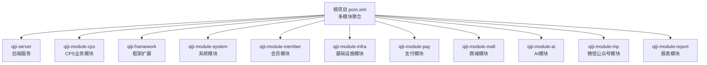
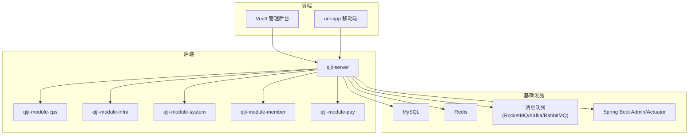
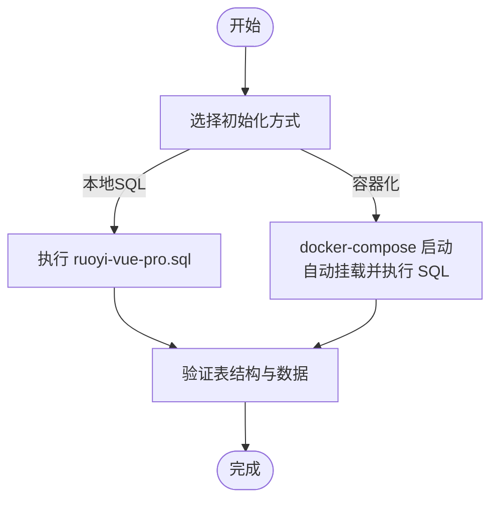
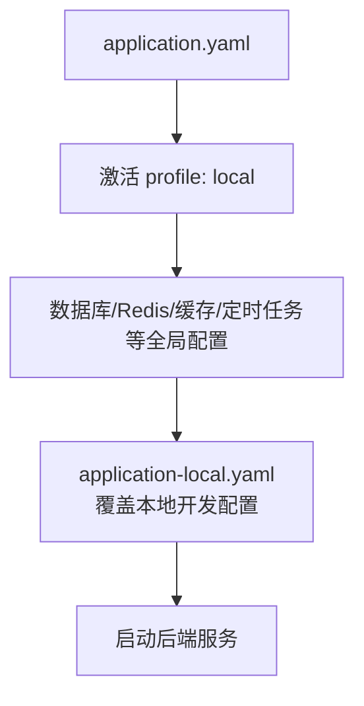
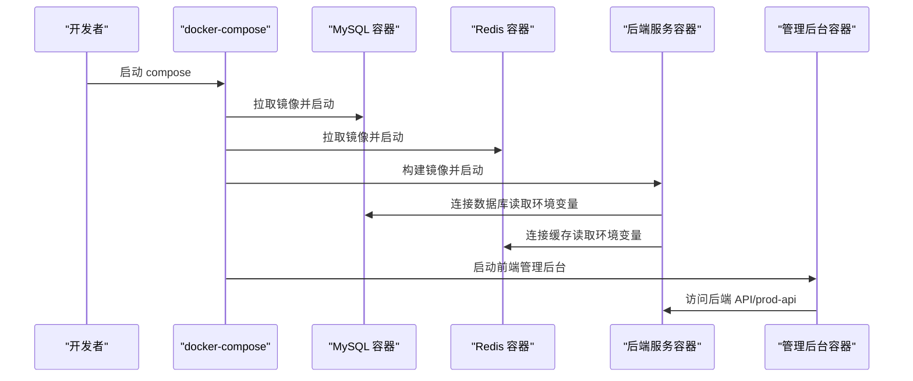
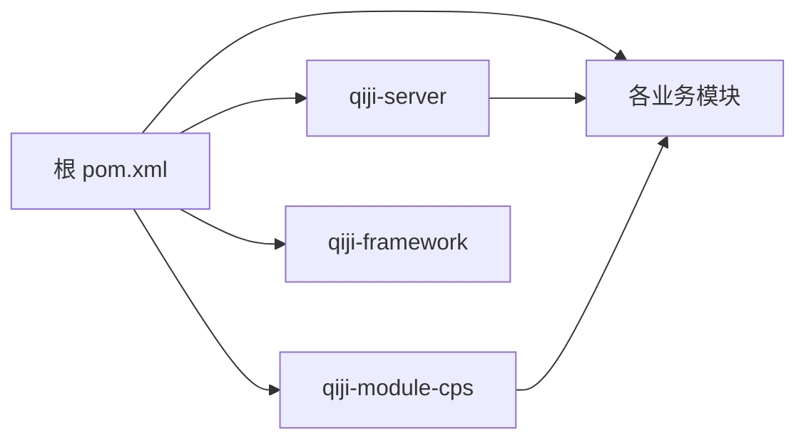

# 快速开始

<cite>
**本文引用的文件**
- [README.md](file://README.md)
- [pom.xml](file://pom.xml)
- [qiji-server/Dockerfile](file://qiji-server/Dockerfile)
- [script/docker/docker-compose.yml](file://script/docker/docker-compose.yml)
- [script/docker/docker.env](file://script/docker/docker.env)
- [qiji-server/src/main/resources/application.yaml](file://qiji-server/src/main/resources/application.yaml)
- [qiji-server/src/main/resources/application-local.yaml](file://qiji-server/src/main/resources/application-local.yaml)
- [sql/mysql/ruoyi-vue-pro.sql](file://sql/mysql/ruoyi-vue-pro.sql)
- [script/shell/deploy.sh](file://script/shell/deploy.sh)
- [qiji-module-cps/pom.xml](file://qiji-module-cps/pom.xml)
</cite>

## 目录
1. [简介](#简介)
2. [项目结构](#项目结构)
3. [核心组件](#核心组件)
4. [架构总览](#架构总览)
5. [详细组件分析](#详细组件分析)
6. [依赖分析](#依赖分析)
7. [性能考虑](#性能考虑)
8. [故障排除指南](#故障排除指南)
9. [结论](#结论)
10. [附录](#附录)

## 简介
AgenticCPS 是基于 ruoyi-vue-pro 框架构建的一站式多平台CPS返利查询与导购系统，提供多平台CPS接入、商品搜索与比价、返利与提现、MCP AI接口等能力。本文面向首次使用者，提供从零开始的完整部署与运行指南，涵盖开发环境准备、数据库初始化、本地与容器化部署、启动与访问、默认账号密码以及常见问题排查。

## 项目结构
- 后端采用多模块 Maven 结构，核心模块包括 qiji-server（服务端）、qiji-module-cps（CPS业务模块）等。
- 前端包含 Vue3 管理后台与 uni-app 移动端工程（位于 qiji-ui 目录下，详见 README）。
- 项目使用 Spring Boot 3.x + MyBatis Plus，数据库支持 MySQL、Oracle、PostgreSQL、SQL Server、达梦、OpenGauss 等，缓存使用 Redis。

**章节来源**
- [pom.xml:10-25](file://pom.xml#L10-L25)
- [README.md:363-380](file://README.md#L363-L380)

## 核心组件
- 后端服务：qiji-server，负责对外提供 REST API、定时任务、监控与安全等能力。
- CPS 模块：qiji-module-cps，提供多平台CPS接入、商品搜索比价、返利与提现、MCP AI接口等。
- 基础设施：qiji-framework 与 qiji-module-infra，提供数据源、缓存、定时任务、消息队列、监控等通用能力。
- 系统模块：qiji-module-system，提供用户、角色、菜单、部门、租户等系统基础能力。
- 会员与支付：qiji-module-member 与 qiji-module-pay，复用会员与支付能力。

**章节来源**
- [README.md:340-352](file://README.md#L340-L352)
- [qiji-module-cps/pom.xml:20-22](file://qiji-module-cps/pom.xml#L20-L22)

## 架构总览
系统采用前后端分离架构，后端通过 Spring Boot 提供 REST API，前端通过 Vue3 管理后台与 uni-app 移动端访问。数据库使用 MySQL，缓存使用 Redis，消息队列支持多种实现，监控使用 Spring Boot Admin 与 Actuator。

**章节来源**
- [README.md:17-32](file://README.md#L17-L32)
- [README.md:381-405](file://README.md#L381-L405)

## 详细组件分析

### 开发环境与版本要求
- JDK：项目使用 Java 17（Spring Boot 3.x 推荐），Dockerfile 使用 Eclipse Temurin 21 JRE。
- Maven：用于构建多模块项目。
- 数据库：MySQL 5.7 / 8.0+（示例脚本为 MySQL 8.2）。
- 缓存：Redis 5.0 / 6.0 / 7.0。
- 定时任务：Quartz（由 qiji-spring-boot-starter-job 提供）。
- 消息队列：支持 RocketMQ、Kafka、RabbitMQ 等。

**章节来源**
- [pom.xml:34](file://pom.xml#L34)
- [qiji-server/Dockerfile:3](file://qiji-server/Dockerfile#L3)
- [README.md:386-391](file://README.md#L386-L391)

### 数据库初始化
- 使用 sql/mysql/ruoyi-vue-pro.sql 初始化数据库。
- 若使用容器化部署，docker-compose 会在首次启动时挂载该 SQL 文件并自动初始化。
- Quartz 表结构由 qiji-spring-boot-starter-job 提供，可在本地禁用自动配置或手动初始化。

**章节来源**
- [sql/mysql/ruoyi-vue-pro.sql:1-200](file://sql/mysql/ruoyi-vue-pro.sql#L1-L200)
- [script/docker/docker-compose.yml:18](file://script/docker/docker-compose.yml#L18)

### 本地开发环境配置
- application.yaml：设置应用名、激活 profile、Swagger、Flowable、MyBatis Plus、缓存、消息队列、AI 与 MCP 等全局配置。
- application-local.yaml：本地开发常用配置，如数据库连接、Redis、定时任务、监控、微信公众号/小程序配置、CPS 平台密钥占位等。
- 本地默认端口：后端 48080，管理后台前端 8080（容器化时映射）。

**章节来源**
- [qiji-server/src/main/resources/application.yaml:1-353](file://qiji-server/src/main/resources/application.yaml#L1-L353)
- [qiji-server/src/main/resources/application-local.yaml:1-293](file://qiji-server/src/main/resources/application-local.yaml#L1-L293)

### 容器化部署（docker-compose）
- docker-compose.yml：定义 mysql、redis、server、admin 四个服务，自动挂载 SQL 初始化脚本，暴露端口并传递环境变量。
- docker.env：集中管理数据库、JVM、Redis 等环境变量。
- Dockerfile：基于 Eclipse Temurin 21 JRE，设置时区与 JVM 参数，暴露 48080 端口。

**章节来源**
- [script/docker/docker-compose.yml:1-85](file://script/docker/docker-compose.yml#L1-L85)
- [script/docker/docker.env:1-26](file://script/docker/docker.env#L1-L26)
- [qiji-server/Dockerfile:1-24](file://qiji-server/Dockerfile#L1-L24)

### 项目启动步骤
- 本地启动
  - 准备 MySQL 与 Redis，执行数据库初始化脚本。
  - 配置 application-local.yaml 中的数据库与 Redis 地址、账号密码。
  - 启动 qiji-server（application.yaml 激活 local）。
- 容器化启动
  - 确保 docker-compose.yml 与 docker.env 在 script/docker 目录下。
  - 执行 docker-compose up -d 启动全部服务。
  - 访问 http://localhost:8080（管理后台），后端健康检查地址 http://localhost:48080/actuator/health。

**章节来源**
- [script/shell/deploy.sh:93-104](file://script/shell/deploy.sh#L93-L104)
- [script/docker/docker-compose.yml:35-56](file://script/docker/docker-compose.yml#L35-L56)

### 访问地址与默认账号密码
- 后端服务端口：48080
- 管理后台前端端口：8080（容器化映射）
- Spring Boot Admin：/admin（由 application.yaml 配置）
- 默认账号：admin / admin（来自 application-local.yaml）

**章节来源**
- [qiji-server/src/main/resources/application-local.yaml:161-163](file://qiji-server/src/main/resources/application-local.yaml#L161-L163)
- [qiji-server/src/main/resources/application.yaml:154-166](file://qiji-server/src/main/resources/application.yaml#L154-L166)

### 数据库初始化顺序与注意事项
- 先执行主库初始化 SQL（ruoyi-vue-pro.sql）。
- Quartz 表结构由框架提供，若使用 JDBC JobStore，请确保手动初始化或调整 initialize-schema 配置。
- 多数据源（主从）在本地配置中已示例，可按需启用从库。

**章节来源**
- [sql/mysql/ruoyi-vue-pro.sql:1-200](file://sql/mysql/ruoyi-vue-pro.sql#L1-L200)
- [qiji-server/src/main/resources/application-local.yaml:116-118](file://qiji-server/src/main/resources/application-local.yaml#L116-L118)

## 依赖分析
- 构建与运行依赖：Maven、JDK 17、Spring Boot 3.x、MyBatis Plus、Redis、Quartz、消息队列等。
- 模块依赖：qiji-module-cps 依赖 qiji-module-member、qiji-module-pay、qiji-module-system、qiji-module-infra 等模块能力。

**章节来源**
- [pom.xml:10-25](file://pom.xml#L10-L25)
- [README.md:363-380](file://README.md#L363-L380)

## 性能考虑
- 缓存：使用 Redis 作为缓存与分布式锁，合理设置 TTL 与连接池参数。
- 数据库：使用 Druid 连接池，开启慢 SQL 记录与监控。
- 定时任务：Quartz 使用 JDBC 存储，集群模式下注意 misfire 阈值与线程池大小。
- 日志：按模块设置日志级别，避免过度打印影响性能。

**章节来源**
- [qiji-server/src/main/resources/application-local.yaml:146-194](file://qiji-server/src/main/resources/application-local.yaml#L146-L194)
- [qiji-server/src/main/resources/application.yaml:90-96](file://qiji-server/src/main/resources/application.yaml#L90-L96)

## 故障排除指南
- 启动失败（端口占用）
  - 检查 48080、6379、3306、8080 端口是否被占用，必要时修改 docker-compose.yml 或本机映射。
- 数据库连接失败
  - 核对 application-local.yaml 中的数据库 URL、用户名、密码；或 docker.env 中的 MASTER/SLAVE 数据源配置。
- Redis 连接失败
  - 确认 Redis 容器已启动且端口映射正确；检查 application-local.yaml 中的 host 与 port。
- Swagger/接口文档不可用
  - 确认 application.yaml 中 springdoc 与 knife4j 已启用。
- 定时任务未执行
  - 检查 application-local.yaml 中 Quartz 的 auto-startup 与 jdbc.initialize-schema 配置。
- 健康检查失败
  - 使用 curl 访问 /actuator/health，查看日志定位问题。

**章节来源**
- [qiji-server/src/main/resources/application.yaml:41-48](file://qiji-server/src/main/resources/application.yaml#L41-L48)
- [qiji-server/src/main/resources/application-local.yaml:93-118](file://qiji-server/src/main/resources/application-local.yaml#L93-L118)
- [script/shell/deploy.sh:106-143](file://script/shell/deploy.sh#L106-L143)

## 结论
通过本文档，您可以完成 AgenticCPS 的开发环境准备、数据库初始化、本地与容器化部署，并成功启动后端与管理后台。遇到问题时，可依据故障排除指南快速定位与解决。建议在本地完成功能验证后再进行生产环境部署。

## 附录

### 快速命令清单
- 本地启动后端：mvn spring-boot:run（激活 local profile）
- 容器化启动：docker-compose up -d
- 停止容器：docker-compose down
- 健康检查：curl http://localhost:48080/actuator/health

### 配置项速查
- 数据库连接：spring.datasource.dynamic.datasource.master.*
- Redis 连接：spring.data.redis.*
- 定时任务：spring.quartz.*
- 监控：management.endpoints.web.exposure.include=*
- Spring Boot Admin：spring.boot.admin.client.url 与 /admin