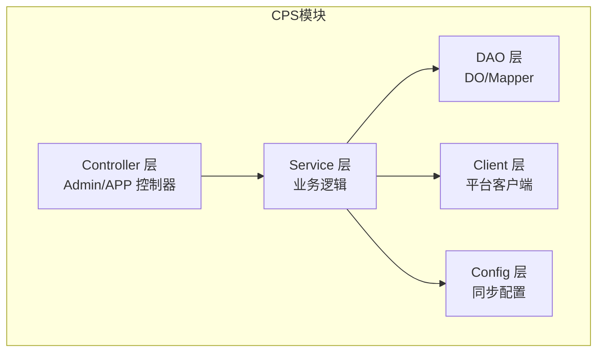
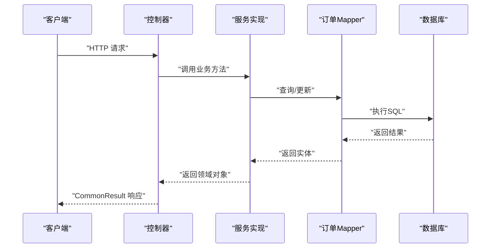
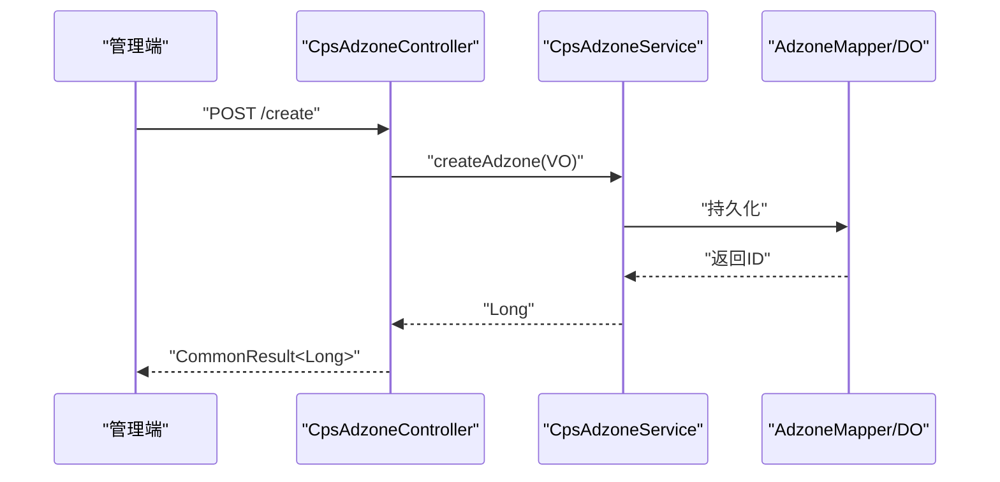
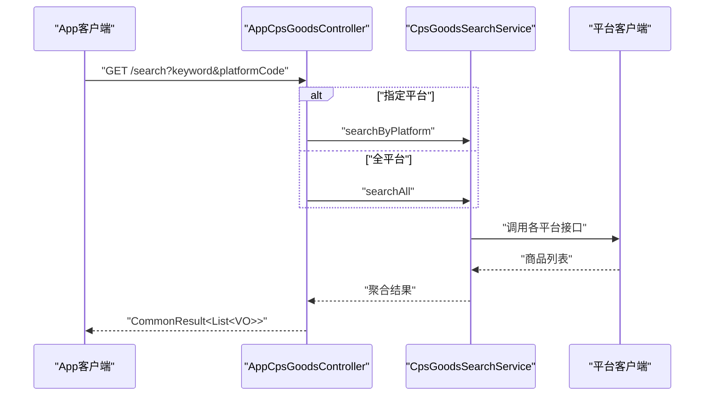
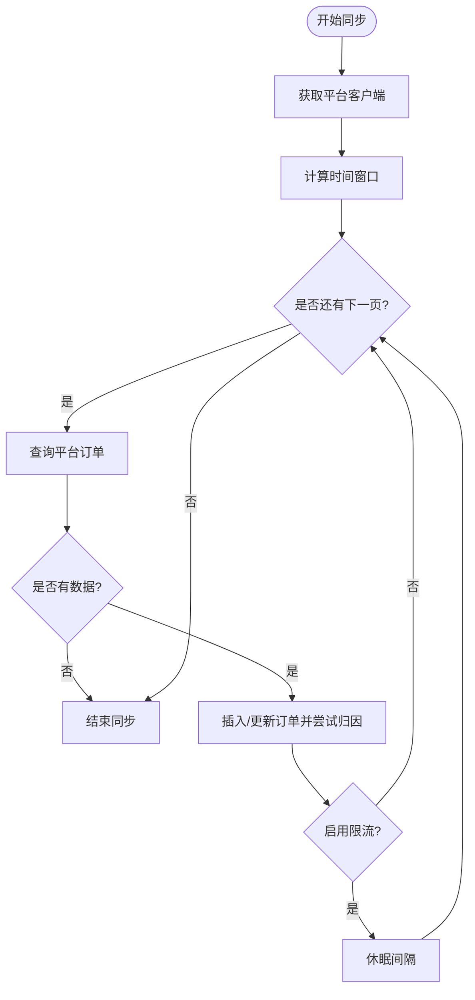
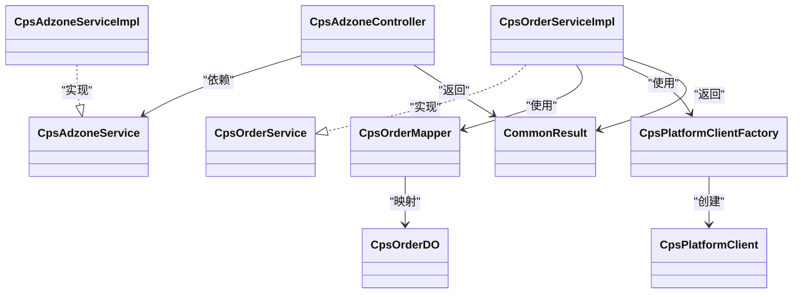
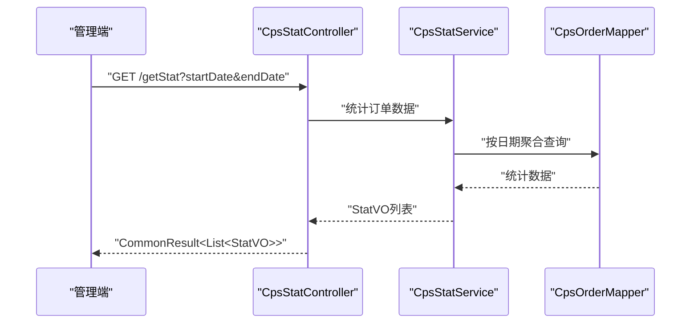

# API接口扩展

<cite>
**本文引用的文件**
- [CpsAdzoneController.java](file://yudao-module-cps/yudao-module-cps-biz/src/main/java/cn/zhijian/cps/controller/admin/CpsAdzoneController.java)
- [AppCpsGoodsController.java](file://yudao-module-cps/yudao-module-cps-biz/src/main/java/cn/zhijian/cps/controller/app/AppCpsGoodsController.java)
- [CpsOrderService.java](file://yudao-module-cps/yudao-module-cps-biz/src/main/java/cn/zhijian/cps/service/CpsOrderService.java)
- [CpsOrderServiceImpl.java](file://yudao-module-cps/yudao-module-cps-biz/src/main/java/cn/zhijian/cps/service/CpsOrderServiceImpl.java)
- [CpsOrderMapper.java](file://yudao-module-cps/yudao-module-cps-biz/src/main/java/cn/zhijian/cps/dal/mysql/CpsOrderMapper.java)
- [CpsOrderDO.java](file://yudao-module-cps/yudao-module-cps-biz/src/main/java/cn/zhijian/cps/dal/dataobject/CpsOrderDO.java)
- [CommonResult.java](file://yudao-framework/yudao-common/src/main/java/cn/iocoder/yudao/framework/common/pojo/CommonResult.java)
- [CpsPlatformClient.java](file://yudao-module-cps/yudao-module-cps-biz/src/main/java/cn/zhijian/cps/client/CpsPlatformClient.java)
- [CpsPlatformClientFactory.java](file://yudao-module-cps/yudao-module-cps-biz/src/main/java/cn/zhijian/cps/service/CpsPlatformClientFactory.java)
- [CpsPlatformClientFactoryImpl.java](file://yudao-module-cps/yudao-module-cps-biz/src/main/java/cn/zhijian/cps/service/CpsPlatformClientFactoryImpl.java)
- [CpsOrderSyncConfig.java](file://yudao-module-cps/yudao-module-cps-biz/src/main/java/cn/zhijian/cps/config/CpsOrderSyncConfig.java)
- [CpsAdzoneService.java](file://yudao-module-cps/yudao-module-cps-biz/src/main/java/cn/zhijian/cps/service/CpsAdzoneService.java)
- [CpsAdzoneServiceImpl.java](file://yudao-module-cps/yudao-module-cps-biz/src/main/java/cn/zhijian/cps/service/CpsAdzoneServiceImpl.java)
- [CpsOrderAttributionService.java](file://yudao-module-cps/yudao-module-cps-biz/src/main/java/cn/zhijian/cps/service/order/CpsOrderAttributionService.java)
- [ErrorCodeConstants.java](file://yudao-module-cps/yudao-module-cps-biz/src/main/java/cn/zhijian/cps/enums/ErrorCodeConstants.java)
- [YudaoServerApplication.java](file://yudao-server/src/main/java/cn/iocoder/yudao/server/YudaoServerApplication.java)
- [application.yaml](file://yudao-server/src/main/resources/application.yaml)
- [Swagger 文档说明.md](file://yudao-framework/yudao-spring-boot-starter-web/src/main/resources/Swagger 文档说明.md)
</cite>

## 目录
1. [简介](#简介)
2. [项目结构](#项目结构)
3. [核心组件](#核心组件)
4. [架构总览](#架构总览)
5. [详细组件分析](#详细组件分析)
6. [依赖分析](#依赖分析)
7. [性能考虑](#性能考虑)
8. [故障排查指南](#故障排查指南)
9. [结论](#结论)
10. [附录](#附录)

## 简介
本文件面向AgenticCPS系统的API接口扩展，系统采用前后端分离架构，后端基于Spring Boot与MyBatis-Plus，遵循“Controller-Service-DAO”三层架构。API层通过RESTful风格暴露接口，统一使用CommonResult作为响应体，结合权限注解与参数校验保障安全与正确性。本文将系统讲解API架构设计、新增接口流程、安全机制、参数校验、响应与错误处理、版本管理、性能优化、监控调试以及扩展示例。

## 项目结构
AgenticCPS位于yudao-module-cps模块中，核心目录组织如下：
- controller：按角色划分Admin与App两类控制器，分别对应管理后台与移动端接口
- service：业务服务层，包含订单、推广位、平台对接等服务
- dal：数据访问层，包含DO与Mapper
- client：第三方平台客户端封装
- config：运行配置，如订单同步窗口、限流等
- enums：枚举与错误码常量

**图表来源**
- [CpsAdzoneController.java:22-72](file://yudao-module-cps/yudao-module-cps-biz/src/main/java/cn/zhijian/cps/controller/admin/CpsAdzoneController.java#L22-L72)
- [AppCpsGoodsController.java:24-116](file://yudao-module-cps/yudao-module-cps-biz/src/main/java/cn/zhijian/cps/controller/app/AppCpsGoodsController.java#L24-L116)
- [CpsOrderServiceImpl.java:27-235](file://yudao-module-cps/yudao-module-cps-biz/src/main/java/cn/zhijian/cps/service/CpsOrderServiceImpl.java#L27-L235)
- [CpsOrderMapper.java:14-47](file://yudao-module-cps/yudao-module-cps-biz/src/main/java/cn/zhijian/cps/dal/mysql/CpsOrderMapper.java#L14-L47)
- [CpsPlatformClient.java](file://yudao-module-cps/yudao-module-cps-biz/src/main/java/cn/zhijian/cps/client/CpsPlatformClient.java)

**章节来源**
- [CpsAdzoneController.java:22-72](file://yudao-module-cps/yudao-module-cps-biz/src/main/java/cn/zhijian/cps/controller/admin/CpsAdzoneController.java#L22-L72)
- [AppCpsGoodsController.java:24-116](file://yudao-module-cps/yudao-module-cps-biz/src/main/java/cn/zhijian/cps/controller/app/AppCpsGoodsController.java#L24-L116)

## 核心组件
- 统一响应体：CommonResult，提供success/error静态方法，约定返回结构
- 控制器：Admin与App控制器，使用@RequestMapping定义前缀，结合@PreAuthorize进行权限控制
- 服务层：封装业务逻辑，事务与异常处理在Service层集中管理
- DAO层：基于BaseMapperX的自定义查询，支持条件构造与分页
- 平台客户端：抽象平台客户端接口与工厂，屏蔽多平台差异
- 配置：订单同步窗口、分页大小、限流间隔等

**章节来源**
- [CommonResult.java:19-121](file://yudao-framework/yudao-common/src/main/java/cn/iocoder/yudao/framework/common/pojo/CommonResult.java#L19-L121)
- [CpsAdzoneController.java:22-72](file://yudao-module-cps/yudao-module-cps-biz/src/main/java/cn/zhijian/cps/controller/admin/CpsAdzoneController.java#L22-L72)
- [CpsOrderServiceImpl.java:27-235](file://yudao-module-cps/yudao-module-cps-biz/src/main/java/cn/zhijian/cps/service/CpsOrderServiceImpl.java#L27-L235)
- [CpsOrderMapper.java:14-47](file://yudao-module-cps/yudao-module-cps-biz/src/main/java/cn/zhijian/cps/dal/mysql/CpsOrderMapper.java#L14-L47)

## 架构总览
AgenticCPS的API采用标准的MVC+分层架构，请求从Controller进入，经由Service处理业务，DAO访问数据库，必要时通过Client调用第三方平台接口。权限控制通过Spring Security注解实现，参数校验通过Jakarta Bean Validation注解完成。

**图表来源**
- [CpsAdzoneController.java:31-70](file://yudao-module-cps/yudao-module-cps-biz/src/main/java/cn/zhijian/cps/controller/admin/CpsAdzoneController.java#L31-L70)
- [CpsOrderServiceImpl.java:43-56](file://yudao-module-cps/yudao-module-cps-biz/src/main/java/cn/zhijian/cps/service/CpsOrderServiceImpl.java#L43-L56)
- [CpsOrderMapper.java:16-23](file://yudao-module-cps/yudao-module-cps-biz/src/main/java/cn/zhijian/cps/dal/mysql/CpsOrderMapper.java#L16-L23)

## 详细组件分析

### 推广位管理接口（Admin）
- 路由前缀：/admin-api/cps/adzone
- 主要接口：创建、更新、删除、单个查询、分页查询
- 权限控制：@PreAuthorize基于权限字符串校验
- 参数校验：@Valid + VO对象参数
- 响应格式：统一返回CommonResult

**图表来源**
- [CpsAdzoneController.java:31-36](file://yudao-module-cps/yudao-module-cps-biz/src/main/java/cn/zhijian/cps/controller/admin/CpsAdzoneController.java#L31-L36)
- [CpsAdzoneService.java](file://yudao-module-cps/yudao-module-cps-biz/src/main/java/cn/zhijian/cps/service/CpsAdzoneService.java)
- [CpsAdzoneServiceImpl.java](file://yudao-module-cps/yudao-module-cps-biz/src/main/java/cn/zhijian/cps/service/CpsAdzoneServiceImpl.java)

**章节来源**
- [CpsAdzoneController.java:22-72](file://yudao-module-cps/yudao-module-cps-biz/src/main/java/cn/zhijian/cps/controller/admin/CpsAdzoneController.java#L22-L72)

### 商品搜索与比价接口（App）
- 路由前缀：/app-api/cps/goods
- 主要接口：搜索、多平台比价、详情
- 并行策略：当未指定平台时，聚合多平台结果
- 日志记录：关键操作记录INFO级别日志

**图表来源**
- [AppCpsGoodsController.java:34-63](file://yudao-module-cps/yudao-module-cps-biz/src/main/java/cn/zhijian/cps/controller/app/AppCpsGoodsController.java#L34-L63)
- [CpsPlatformClient.java](file://yudao-module-cps/yudao-module-cps-biz/src/main/java/cn/zhijian/cps/client/CpsPlatformClient.java)

**章节来源**
- [AppCpsGoodsController.java:24-116](file://yudao-module-cps/yudao-module-cps-biz/src/main/java/cn/zhijian/cps/controller/app/AppCpsGoodsController.java#L24-L116)

### 订单同步与状态更新（Service）
- 路由入口：/admin-api/cps/order（控制器未在已读文件中，但Service完整）
- 关键能力：批量同步、单笔状态同步、归因处理、幂等插入/更新
- 并发与限流：按配置进行分页与请求间隔控制
- 错误处理：异常捕获并抛出运行时异常，便于上层统一处理

**图表来源**
- [CpsOrderServiceImpl.java:58-147](file://yudao-module-cps/yudao-module-cps-biz/src/main/java/cn/zhijian/cps/service/CpsOrderServiceImpl.java#L58-L147)
- [CpsOrderSyncConfig.java](file://yudao-module-cps/yudao-module-cps-biz/src/main/java/cn/zhijian/cps/config/CpsOrderSyncConfig.java)

**章节来源**
- [CpsOrderService.java:10-22](file://yudao-module-cps/yudao-module-cps-biz/src/main/java/cn/zhijian/cps/service/CpsOrderService.java#L10-L22)
- [CpsOrderServiceImpl.java:27-235](file://yudao-module-cps/yudao-module-cps-biz/src/main/java/cn/zhijian/cps/service/CpsOrderServiceImpl.java#L27-L235)
- [CpsOrderMapper.java:14-47](file://yudao-module-cps/yudao-module-cps-biz/src/main/java/cn/zhijian/cps/dal/mysql/CpsOrderMapper.java#L14-L47)
- [CpsOrderDO.java:22-79](file://yudao-module-cps/yudao-module-cps-biz/src/main/java/cn/zhijian/cps/dal/dataobject/CpsOrderDO.java#L22-L79)

## 依赖分析
- 控制器依赖服务接口；服务实现依赖Mapper与平台客户端工厂；Mapper依赖MyBatis-Plus基础能力
- 平台客户端通过工厂模式按平台代码选择具体实现
- 错误码与异常通过枚举与工具类统一管理

**图表来源**
- [CpsAdzoneController.java:28-29](file://yudao-module-cps/yudao-module-cps-biz/src/main/java/cn/zhijian/cps/controller/admin/CpsAdzoneController.java#L28-L29)
- [CpsAdzoneService.java](file://yudao-module-cps/yudao-module-cps-biz/src/main/java/cn/zhijian/cps/service/CpsAdzoneService.java)
- [CpsAdzoneServiceImpl.java](file://yudao-module-cps/yudao-module-cps-biz/src/main/java/cn/zhijian/cps/service/CpsAdzoneServiceImpl.java)
- [CpsOrderService.java:10-22](file://yudao-module-cps/yudao-module-cps-biz/src/main/java/cn/zhijian/cps/service/CpsOrderService.java#L10-L22)
- [CpsOrderServiceImpl.java:27-235](file://yudao-module-cps/yudao-module-cps-biz/src/main/java/cn/zhijian/cps/service/CpsOrderServiceImpl.java#L27-L235)
- [CpsOrderMapper.java:14-47](file://yudao-module-cps/yudao-module-cps-biz/src/main/java/cn/zhijian/cps/dal/mysql/CpsOrderMapper.java#L14-L47)
- [CpsOrderDO.java:22-79](file://yudao-module-cps/yudao-module-cps-biz/src/main/java/cn/zhijian/cps/dal/dataobject/CpsOrderDO.java#L22-L79)
- [CpsPlatformClientFactory.java](file://yudao-module-cps/yudao-module-cps-biz/src/main/java/cn/zhijian/cps/service/CpsPlatformClientFactory.java)
- [CpsPlatformClient.java](file://yudao-module-cps/yudao-module-cps-biz/src/main/java/cn/zhijian/cps/client/CpsPlatformClient.java)
- [CommonResult.java:19-121](file://yudao-framework/yudao-common/src/main/java/cn/iocoder/yudao/framework/common/pojo/CommonResult.java#L19-L121)

**章节来源**
- [CpsPlatformClientFactoryImpl.java](file://yudao-module-cps/yudao-module-cps-biz/src/main/java/cn/zhijian/cps/service/CpsPlatformClientFactoryImpl.java)
- [CpsPlatformClient.java](file://yudao-module-cps/yudao-module-cps-biz/src/main/java/cn/zhijian/cps/client/CpsPlatformClient.java)

## 性能考虑
- 分页与批量：订单同步采用分页拉取与批量入库，减少内存占用与网络压力
- 平台限流：通过配置启用请求间隔，避免触发第三方平台限流
- 幂等与归因：先查重再插入/更新，归因失败也落库，保证最终一致性
- 缓存策略：可在Service层引入Redis缓存热点商品与推广位信息，降低重复查询成本
- 并发控制：对高并发场景下的订单同步建议使用分布式锁或消息队列削峰

[本节为通用性能建议，无需列出具体文件来源]

## 故障排查指南
- 统一异常：Service层抛出RuntimeException，前端通过CommonResult的错误码与消息识别
- 错误码：通过ErrorCodeConstants集中定义，便于定位问题类型
- 日志：控制器与服务层均记录关键操作日志，便于回溯
- 常见问题
  - 参数校验失败：检查VO对象与校验注解
  - 权限不足：确认权限字符串与用户角色
  - 平台接口异常：查看平台客户端工厂与限流配置

**章节来源**
- [CpsOrderServiceImpl.java:143-146](file://yudao-module-cps/yudao-module-cps-biz/src/main/java/cn/zhijian/cps/service/CpsOrderServiceImpl.java#L143-L146)
- [ErrorCodeConstants.java](file://yudao-module-cps/yudao-module-cps-biz/src/main/java/cn/zhijian/cps/enums/ErrorCodeConstants.java)

## 结论
AgenticCPS的API架构清晰、职责分明，通过统一响应体、权限注解与参数校验确保了接口的一致性与安全性。新增接口应严格遵循“Controller-Service-DAO”分层与命名规范，优先复用平台客户端与配置能力，确保性能与稳定性。

[本节为总结性内容，无需列出具体文件来源]

## 附录

### API开发指南
- 接口设计原则
  - 资源化命名：以名词短语表达资源，如/cps/adzone
  - 动作明确：GET/POST/PUT/DELETE语义清晰
  - 版本化：通过路径前缀区分版本，如/admin-api/v1
- 命名规范
  - 控制器：XxxController
  - 服务接口：XxxService
  - 服务实现：XxxServiceImpl
  - 数据对象：XxxDO
  - Mapper：XxxMapper
- 文档编写
  - 使用Swagger注解描述接口、参数与返回
  - 在application.yaml中开启Swagger或Knife4j
- 测试方法
  - 单元测试覆盖Service核心逻辑
  - 集成测试验证Controller到DAO链路
  - 并发测试评估限流与分页策略

**章节来源**
- [Swagger 文档说明.md](file://yudao-framework/yudao-spring-boot-starter-web/src/main/resources/Swagger 文档说明.md)
- [application.yaml](file://yudao-server/src/main/resources/application.yaml)

### 新增API接口步骤
- 控制器层
  - 创建Controller类，定义@RequestMapping与@Tag
  - 使用@PreAuthorize声明权限
  - 使用@Valid进行参数校验
- 服务层
  - 定义Service接口与实现类
  - 编写业务逻辑，必要时调用平台客户端
  - 使用事务注解@Transactional标注有状态变更的方法
- DAO层
  - 在Mapper中添加自定义查询方法
  - 使用LambdaQueryWrapperX构建条件查询
- 响应与错误
  - 统一返回CommonResult
  - 使用ErrorCodeConstants定义错误码

**章节来源**
- [CpsAdzoneController.java:22-72](file://yudao-module-cps/yudao-module-cps-biz/src/main/java/cn/zhijian/cps/controller/admin/CpsAdzoneController.java#L22-L72)
- [CpsOrderServiceImpl.java:27-235](file://yudao-module-cps/yudao-module-cps-biz/src/main/java/cn/zhijian/cps/service/CpsOrderServiceImpl.java#L27-L235)
- [CpsOrderMapper.java:14-47](file://yudao-module-cps/yudao-module-cps-biz/src/main/java/cn/zhijian/cps/dal/mysql/CpsOrderMapper.java#L14-L47)
- [CommonResult.java:19-121](file://yudao-framework/yudao-common/src/main/java/cn/iocoder/yudao/framework/common/pojo/CommonResult.java#L19-L121)

### 安全机制
- 认证授权
  - 使用Spring Security注解@PreAuthorize进行权限控制
  - 权限字符串与菜单/角色绑定
- 接口保护
  - 对敏感接口增加权限校验
  - 对外部调用可结合签名工具（参考CpsApiSignUtil）

**章节来源**
- [CpsAdzoneController.java:33-40](file://yudao-module-cps/yudao-module-cps-biz/src/main/java/cn/zhijian/cps/controller/admin/CpsAdzoneController.java#L33-L40)
- [CpsApiSignUtil.java](file://yudao-module-cps/yudao-module-cps-biz/src/main/java/cn/zhijian/cps/client/util/CpsApiSignUtil.java)

### 参数验证与数据校验
- 输入参数验证：使用@Valid + VO对象，配合javax.validation注解
- 业务规则校验：在Service层进行复杂规则判断
- 数据格式检查：通过枚举与常量约束取值范围

**章节来源**
- [AppCpsGoodsController.java:34-63](file://yudao-module-cps/yudao-module-cps-biz/src/main/java/cn/zhijian/cps/controller/app/AppCpsGoodsController.java#L34-L63)
- [CpsAdzoneController.java:34-42](file://yudao-module-cps/yudao-module-cps-biz/src/main/java/cn/zhijian/cps/controller/admin/CpsAdzoneController.java#L34-L42)

### 响应格式与错误处理
- 统一响应格式：CommonResult，包含code、msg、data
- 错误码定义：ErrorCodeConstants集中管理
- 异常处理：Service层抛出运行时异常，前端统一解析

**章节来源**
- [CommonResult.java:19-121](file://yudao-framework/yudao-common/src/main/java/cn/iocoder/yudao/framework/common/pojo/CommonResult.java#L19-L121)
- [CpsOrderServiceImpl.java:143-146](file://yudao-module-cps/yudao-module-cps-biz/src/main/java/cn/zhijian/cps/service/CpsOrderServiceImpl.java#L143-L146)

### 版本管理
- 版本策略：通过URL前缀区分版本，如/admin-api/v1
- 向后兼容：新增字段采用可选，不破坏旧字段
- 废弃接口：保留一段时间并标注过期，引导迁移

[本节为通用版本管理建议，无需列出具体文件来源]

### 监控与调试
- 日志：控制器与服务层记录关键操作日志
- 链路追踪：结合SkyWalking或内置Tracer
- 监控端点：Actuator暴露健康检查与指标

**章节来源**
- [AppCpsGoodsController.java:37-84](file://yudao-module-cps/yudao-module-cps-biz/src/main/java/cn/zhijian/cps/controller/app/AppCpsGoodsController.java#L37-L84)
- [CpsOrderServiceImpl.java:61-141](file://yudao-module-cps/yudao-module-cps-biz/src/main/java/cn/zhijian/cps/service/CpsOrderServiceImpl.java#L61-L141)

### 扩展示例：新增一个CPS统计报表接口
- 目标：提供按日期维度的订单汇总统计
- 步骤
  - 控制器：在admin包下创建CpsStatController，定义/getStat接口
  - 服务：新增CpsStatService接口与实现，聚合订单数据
  - DAO：在CpsOrderMapper中新增按日期统计的查询方法
  - 响应：返回CommonResult<List<StatVO>>
  - 权限：添加权限字符串并在控制器使用@PreAuthorize
  - 文档：补充Swagger注解与示例

**图表来源**
- [CpsOrderMapper.java:16-23](file://yudao-module-cps/yudao-module-cps-biz/src/main/java/cn/zhijian/cps/dal/mysql/CpsOrderMapper.java#L16-L23)
- [CpsOrderServiceImpl.java:53-56](file://yudao-module-cps/yudao-module-cps-biz/src/main/java/cn/zhijian/cps/service/CpsOrderServiceImpl.java#L53-L56)