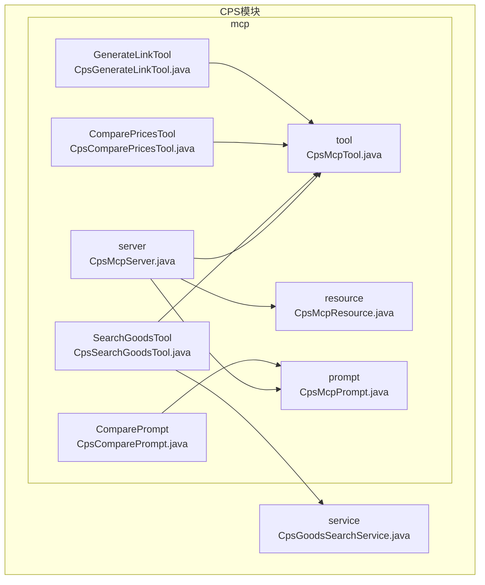
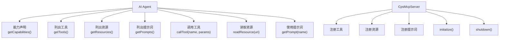
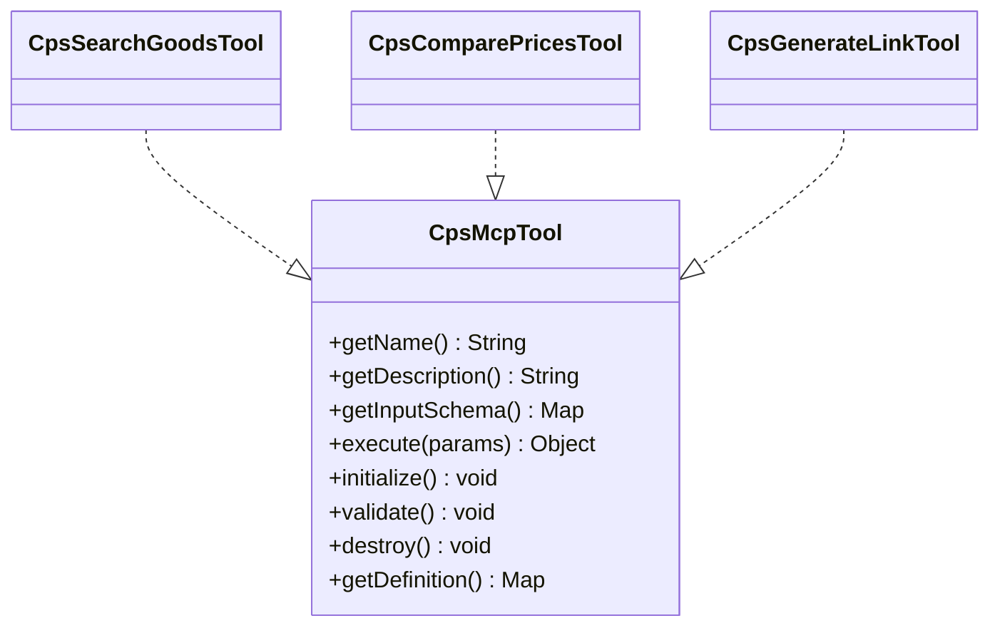
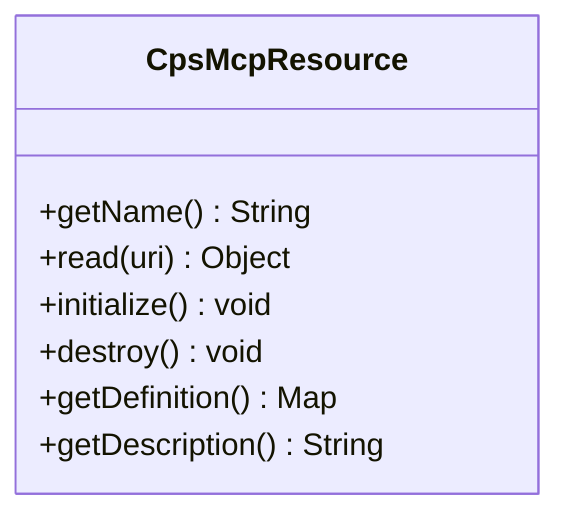
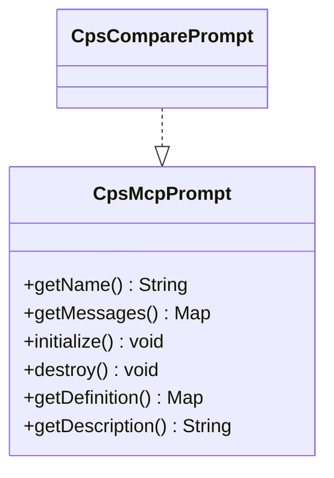
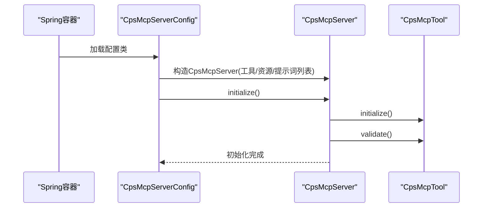
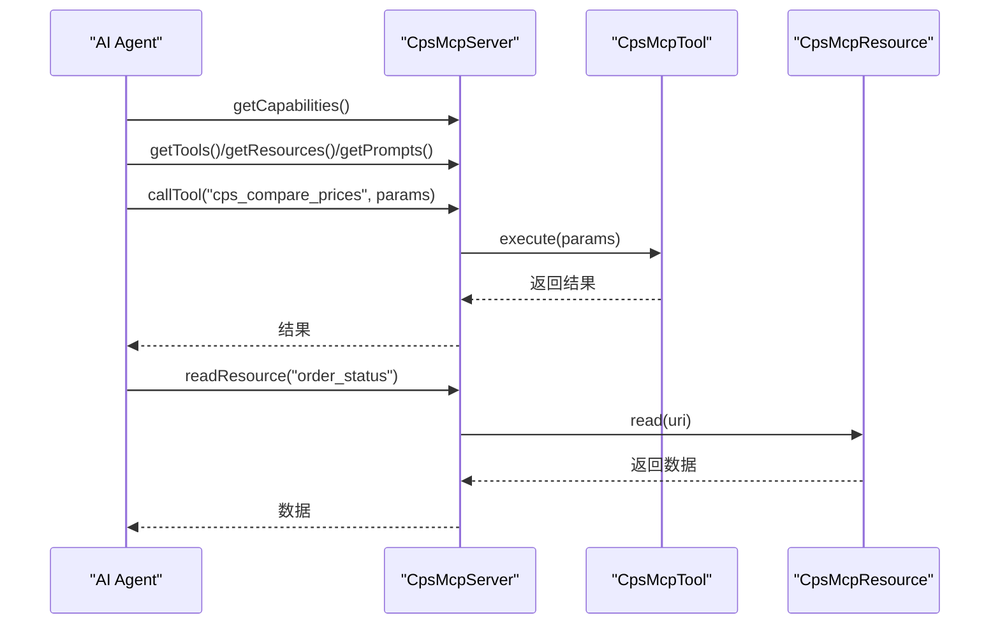
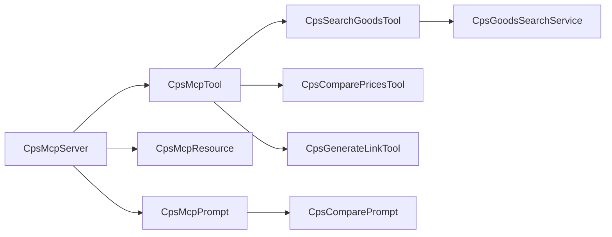

# MCP Tools扩展开发

<cite>
**本文引用的文件**
- [CpsMcpServer.java](file://qiji-module-cps/qiji-module-cps-biz/src/main/java/cn/zhijian/cps/mcp/server/CpsMcpServer.java)
- [CpsMcpServerConfig.java](file://qiji-module-cps/qiji-module-cps-biz/src/main/java/cn/zhijian/cps/mcp/server/CpsMcpServerConfig.java)
- [CpsMcpTool.java](file://qiji-module-cps/qiji-module-cps-biz/src/main/java/cn/zhijian/cps/mcp/tool/CpsMcpTool.java)
- [CpsSearchGoodsTool.java](file://qiji-module-cps/qiji-module-cps-biz/src/main/java/cn/zhijian/cps/mcp/tool/CpsSearchGoodsTool.java)
- [CpsComparePricesTool.java](file://qiji-module-cps/qiji-module-cps-biz/src/main/java/cn/zhijian/cps/mcp/tool/CpsComparePricesTool.java)
- [CpsGenerateLinkTool.java](file://qiji-module-cps/qiji-module-cps-biz/src/main/java/cn/zhijian/cps/mcp/tool/CpsGenerateLinkTool.java)
- [CpsMcpResource.java](file://qiji-module-cps/qiji-module-cps-biz/src/main/java/cn/zhijian/cps/mcp/resource/CpsMcpResource.java)
- [CpsMcpPrompt.java](file://qiji-module-cps/qiji-module-cps-biz/src/main/java/cn/zhijian/cps/mcp/prompt/CpsMcpPrompt.java)
- [CpsComparePrompt.java](file://qiji-module-cps/qiji-module-cps-biz/src/main/java/cn/zhijian/cps/mcp/prompt/CpsComparePrompt.java)
- [CpsGoodsSearchService.java](file://qiji-module-cps/qiji-module-cps-biz/src/main/java/cn/zhijian/cps/service/goods/CpsGoodsSearchService.java)
- [README.md](file://README.md)
- [CPS系统PRD文档.md](file://docs/CPS系统PRD文档.md)
</cite>

## 目录
1. [简介](#简介)
2. [项目结构](#项目结构)
3. [核心组件](#核心组件)
4. [架构总览](#架构总览)
5. [详细组件分析](#详细组件分析)
6. [依赖关系分析](#依赖关系分析)
7. [性能考虑](#性能考虑)
8. [故障排查指南](#故障排查指南)
9. [结论](#结论)
10. [附录](#附录)

## 简介
本文件面向AgenticCPS系统的MCP（Model Context Protocol）Tools扩展开发，系统性阐述MCP协议在CPS系统中的应用方式，包括协议能力声明、消息格式、交互流程；详解现有MCP Tools实现（CpsComparePricesTool、CpsGenerateLinkTool、CpsSearchGoodsTool）的功能边界、参数与返回值设计；给出新工具开发的接口实现、参数校验、错误处理与性能优化实践；说明工具的注册与发现机制（基于Spring容器的组件扫描与SPI风格装配）、动态加载与生命周期管理；提供从工具类编写到测试与集成的完整示例路径；解释工具与AI Agent的交互方式（参数传递、结果处理、状态管理）；介绍配置管理（参数配置、环境变量、运行时调整）；最后提供监控与调试方法（日志、指标、错误追踪）。

## 项目结构
MCP相关代码位于CPS模块biz工程中，采用按职责分层的包组织方式：
- server：MCP服务器主入口与能力声明
- tool：MCP工具接口与具体实现
- resource：MCP资源接口与实现
- prompt：MCP提示词接口与实现

图表来源
- [CpsMcpServer.java:1-184](file://qiji-module-cps/qiji-module-cps-biz/src/main/java/cn/zhijian/cps/mcp/server/CpsMcpServer.java#L1-L184)
- [CpsMcpTool.java:1-62](file://qiji-module-cps/qiji-module-cps-biz/src/main/java/cn/zhijian/cps/mcp/tool/CpsMcpTool.java#L1-L62)
- [CpsMcpResource.java:1-52](file://qiji-module-cps/qiji-module-cps-biz/src/main/java/cn/zhijian/cps/mcp/resource/CpsMcpResource.java#L1-L52)
- [CpsMcpPrompt.java:1-52](file://qiji-module-cps/qiji-module-cps-biz/src/main/java/cn/zhijian/cps/mcp/prompt/CpsMcpPrompt.java#L1-L52)
- [CpsSearchGoodsTool.java:1-36](file://qiji-module-cps/qiji-module-cps-biz/src/main/java/cn/zhijian/cps/mcp/tool/CpsSearchGoodsTool.java#L1-L36)
- [CpsComparePricesTool.java:1-36](file://qiji-module-cps/qiji-module-cps-biz/src/main/java/cn/zhijian/cps/mcp/tool/CpsComparePricesTool.java#L1-L36)
- [CpsGenerateLinkTool.java:1-37](file://qiji-module-cps/qiji-module-cps-biz/src/main/java/cn/zhijian/cps/mcp/tool/CpsGenerateLinkTool.java#L1-L37)
- [CpsComparePrompt.java:1-29](file://qiji-module-cps/qiji-module-cps-biz/src/main/java/cn/zhijian/cps/mcp/prompt/CpsComparePrompt.java#L1-L29)
- [CpsGoodsSearchService.java:1-50](file://qiji-module-cps/qiji-module-cps-biz/src/main/java/cn/zhijian/cps/service/goods/CpsGoodsSearchService.java#L1-L50)

章节来源
- [CpsMcpServer.java:1-184](file://qiji-module-cps/qiji-module-cps-biz/src/main/java/cn/zhijian/cps/mcp/server/CpsMcpServer.java#L1-L184)
- [CpsMcpServerConfig.java:1-30](file://qiji-module-cps/qiji-module-cps-biz/src/main/java/cn/zhijian/cps/mcp/server/CpsMcpServerConfig.java#L1-L30)

## 核心组件
- MCP Server（CpsMcpServer）：负责工具、资源、提示词的注册、生命周期管理、能力声明与调用转发。
- 工具接口（CpsMcpTool）：定义工具名称、描述、输入Schema、执行与生命周期钩子。
- 资源接口（CpsMcpResource）：定义资源名称、只读读取与生命周期钩子。
- 提示词接口（CpsMcpPrompt）：定义提示词名称、消息集合与生命周期钩子。
- 现有工具实现：CpsSearchGoodsTool、CpsComparePricesTool、CpsGenerateLinkTool。
- 现有提示词实现：CpsComparePrompt。
- 业务服务对接：CpsGoodsSearchService用于商品搜索与比价的业务逻辑支撑。

章节来源
- [CpsMcpServer.java:16-184](file://qiji-module-cps/qiji-module-cps-biz/src/main/java/cn/zhijian/cps/mcp/server/CpsMcpServer.java#L16-L184)
- [CpsMcpTool.java:9-62](file://qiji-module-cps/qiji-module-cps-biz/src/main/java/cn/zhijian/cps/mcp/tool/CpsMcpTool.java#L9-L62)
- [CpsMcpResource.java:9-52](file://qiji-module-cps/qiji-module-cps-biz/src/main/java/cn/zhijian/cps/mcp/resource/CpsMcpResource.java#L9-L52)
- [CpsMcpPrompt.java:9-52](file://qiji-module-cps/qiji-module-cps-biz/src/main/java/cn/zhijian/cps/mcp/prompt/CpsMcpPrompt.java#L9-L52)
- [CpsSearchGoodsTool.java:12-36](file://qiji-module-cps/qiji-module-cps-biz/src/main/java/cn/zhijian/cps/mcp/tool/CpsSearchGoodsTool.java#L12-L36)
- [CpsComparePricesTool.java:12-36](file://qiji-module-cps/qiji-module-cps-biz/src/main/java/cn/zhijian/cps/mcp/tool/CpsComparePricesTool.java#L12-L36)
- [CpsGenerateLinkTool.java:12-37](file://qiji-module-cps/qiji-module-cps-biz/src/main/java/cn/zhijian/cps/mcp/tool/CpsGenerateLinkTool.java#L12-L37)
- [CpsComparePrompt.java:11-29](file://qiji-module-cps/qiji-module-cps-biz/src/main/java/cn/zhijian/cps/mcp/prompt/CpsComparePrompt.java#L11-L29)
- [CpsGoodsSearchService.java:13-50](file://qiji-module-cps/qiji-module-cps-biz/src/main/java/cn/zhijian/cps/service/goods/CpsGoodsSearchService.java#L13-L50)

## 架构总览
MCP Server作为统一入口，通过Spring容器收集所有CpsMcpTool、CpsMcpResource、CpsMcpPrompt实现，并在启动时完成初始化与校验。AI Agent通过MCP协议与其交互，获取能力声明、列出工具/资源/提示词、调用工具或读取资源、使用提示词模板。

图表来源
- [CpsMcpServer.java:38-82](file://qiji-module-cps/qiji-module-cps-biz/src/main/java/cn/zhijian/cps/mcp/server/CpsMcpServer.java#L38-L82)
- [CpsMcpServer.java:87-148](file://qiji-module-cps/qiji-module-cps-biz/src/main/java/cn/zhijian/cps/mcp/server/CpsMcpServer.java#L87-L148)
- [CpsMcpServer.java:153-175](file://qiji-module-cps/qiji-module-cps-biz/src/main/java/cn/zhijian/cps/mcp/server/CpsMcpServer.java#L153-L175)

## 详细组件分析

### 工具接口与实现
- 接口职责：定义工具的唯一标识、描述、输入Schema、执行体以及生命周期钩子（initialize/validate/destroy），并提供标准化的定义导出。
- 现有实现：
  - CpsSearchGoodsTool：商品搜索工具，支持关键词、平台、价格区间、排序等筛选条件。
  - CpsComparePricesTool：跨平台比价工具，返回各平台价格、返利与实付价格，辅助推荐最优方案。
  - CpsGenerateLinkTool：推广链接生成工具，根据商品ID与平台生成带归因参数的推广链接/口令。

图表来源
- [CpsMcpTool.java:9-62](file://qiji-module-cps/qiji-module-cps-biz/src/main/java/cn/zhijian/cps/mcp/tool/CpsMcpTool.java#L9-L62)
- [CpsSearchGoodsTool.java:12-36](file://qiji-module-cps/qiji-module-cps-biz/src/main/java/cn/zhijian/cps/mcp/tool/CpsSearchGoodsTool.java#L12-L36)
- [CpsComparePricesTool.java:12-36](file://qiji-module-cps/qiji-module-cps-biz/src/main/java/cn/zhijian/cps/mcp/tool/CpsComparePricesTool.java#L12-L36)
- [CpsGenerateLinkTool.java:12-37](file://qiji-module-cps/qiji-module-cps-biz/src/main/java/cn/zhijian/cps/mcp/tool/CpsGenerateLinkTool.java#L12-L37)

章节来源
- [CpsMcpTool.java:9-62](file://qiji-module-cps/qiji-module-cps-biz/src/main/java/cn/zhijian/cps/mcp/tool/CpsMcpTool.java#L9-L62)
- [CpsSearchGoodsTool.java:12-36](file://qiji-module-cps/qiji-module-cps-biz/src/main/java/cn/zhijian/cps/mcp/tool/CpsSearchGoodsTool.java#L12-L36)
- [CpsComparePricesTool.java:12-36](file://qiji-module-cps/qiji-module-cps-biz/src/main/java/cn/zhijian/cps/mcp/tool/CpsComparePricesTool.java#L12-L36)
- [CpsGenerateLinkTool.java:12-37](file://qiji-module-cps/qiji-module-cps-biz/src/main/java/cn/zhijian/cps/mcp/tool/CpsGenerateLinkTool.java#L12-L37)

### 资源接口与实现
- 接口职责：定义资源名称、只读读取能力与生命周期钩子，提供标准化定义导出。
- 使用场景：AI Agent通过资源读取用户订单状态、返利汇总等只读数据。

图表来源
- [CpsMcpResource.java:9-52](file://qiji-module-cps/qiji-module-cps-biz/src/main/java/cn/zhijian/cps/mcp/resource/CpsMcpResource.java#L9-L52)

章节来源
- [CpsMcpResource.java:9-52](file://qiji-module-cps/qiji-module-cps-biz/src/main/java/cn/zhijian/cps/mcp/resource/CpsMcpResource.java#L9-L52)

### 提示词接口与实现
- 接口职责：定义提示词名称、消息集合与生命周期钩子，提供标准化定义导出。
- 现有实现：CpsComparePrompt，用于帮助用户进行跨平台比价分析。

图表来源
- [CpsMcpPrompt.java:9-52](file://qiji-module-cps/qiji-module-cps-biz/src/main/java/cn/zhijian/cps/mcp/prompt/CpsMcpPrompt.java#L9-L52)
- [CpsComparePrompt.java:11-29](file://qiji-module-cps/qiji-module-cps-biz/src/main/java/cn/zhijian/cps/mcp/prompt/CpsComparePrompt.java#L11-L29)

章节来源
- [CpsMcpPrompt.java:9-52](file://qiji-module-cps/qiji-module-cps-biz/src/main/java/cn/zhijian/cps/mcp/prompt/CpsMcpPrompt.java#L9-L52)
- [CpsComparePrompt.java:11-29](file://qiji-module-cps/qiji-module-cps-biz/src/main/java/cn/zhijian/cps/mcp/prompt/CpsComparePrompt.java#L11-L29)

### MCP Server与生命周期管理
- 注册与发现：通过构造函数收集List<CpsMcpTool>/List<CpsMcpResource>/List<CpsMcpPrompt>，以名称为键存入并发映射。
- 初始化：依次调用每个组件的initialize与validate钩子，标记初始化完成。
- 关闭：依次调用destroy钩子，释放资源。
- 能力声明：getCapabilities返回tools/resources/prompts的能力开关与serverInfo。
- 调用与读取：callTool与readResource提供工具执行与资源读取入口，包含未找到时的异常处理。

图表来源
- [CpsMcpServerConfig.java:21-29](file://qiji-module-cps/qiji-module-cps-biz/src/main/java/cn/zhijian/cps/mcp/server/CpsMcpServerConfig.java#L21-L29)
- [CpsMcpServer.java:38-61](file://qiji-module-cps/qiji-module-cps-biz/src/main/java/cn/zhijian/cps/mcp/server/CpsMcpServer.java#L38-L61)

章节来源
- [CpsMcpServer.java:16-184](file://qiji-module-cps/qiji-module-cps-biz/src/main/java/cn/zhijian/cps/mcp/server/CpsMcpServer.java#L16-L184)
- [CpsMcpServerConfig.java:15-30](file://qiji-module-cps/qiji-module-cps-biz/src/main/java/cn/zhijian/cps/mcp/server/CpsMcpServerConfig.java#L15-L30)

### 工具与AI Agent交互流程
- 能力声明：Agent通过getCapabilities了解server能力。
- 列表获取：Agent通过getTools/getResources/getPrompts获取可用清单。
- 工具调用：Agent调用callTool(name, params)，Server转发至对应工具执行。
- 资源读取：Agent调用readResource(uri)，Server按名称或URI前缀匹配资源并读取。
- 提示词使用：Agent调用getPrompt(name)，Server返回消息集合供Agent使用。

图表来源
- [CpsMcpServer.java:87-148](file://qiji-module-cps/qiji-module-cps-biz/src/main/java/cn/zhijian/cps/mcp/server/CpsMcpServer.java#L87-L148)

章节来源
- [CpsMcpServer.java:87-148](file://qiji-module-cps/qiji-module-cps-biz/src/main/java/cn/zhijian/cps/mcp/server/CpsMcpServer.java#L87-L148)

### 现有工具功能与参数设计
- CpsSearchGoodsTool
  - 功能：根据关键词在指定或全部CPS平台搜索商品，返回商品列表及预估返利信息，支持价格区间、优惠券、排序等筛选。
  - 输入Schema：待完善（当前返回null，需补充字段定义）。
  - 执行逻辑：待完善（当前返回null，需实现搜索与聚合）。
- CpsComparePricesTool
  - 功能：根据关键词自动跨平台比价，返回各平台价格、返利和实付价格，推荐最优购买方案。
  - 输入Schema：待完善（当前返回null，需补充字段定义）。
  - 执行逻辑：待完善（当前返回null，需实现并发查询与排序）。
- CpsGenerateLinkTool
  - 功能：根据商品ID和平台生成推广链接/口令，自动注入用户归因参数。
  - 输入Schema：待完善（当前返回null，需补充字段定义）。
  - 执行逻辑：待完善（当前返回null，需实现转链生成）。

章节来源
- [CpsSearchGoodsTool.java:12-36](file://qiji-module-cps/qiji-module-cps-biz/src/main/java/cn/zhijian/cps/mcp/tool/CpsSearchGoodsTool.java#L12-L36)
- [CpsComparePricesTool.java:12-36](file://qiji-module-cps/qiji-module-cps-biz/src/main/java/cn/zhijian/cps/mcp/tool/CpsComparePricesTool.java#L12-L36)
- [CpsGenerateLinkTool.java:12-37](file://qiji-module-cps/qiji-module-cps-biz/src/main/java/cn/zhijian/cps/mcp/tool/CpsGenerateLinkTool.java#L12-L37)

### 与业务服务的衔接
- CpsGoodsSearchService提供单平台搜索、全平台并行搜索、跨平台比价、商品详情等能力，是工具实现的重要业务支撑。
- 工具实现应复用该服务，避免重复封装，确保一致性与可维护性。

章节来源
- [CpsGoodsSearchService.java:13-50](file://qiji-module-cps/qiji-module-cps-biz/src/main/java/cn/zhijian/cps/service/goods/CpsGoodsSearchService.java#L13-L50)

## 依赖关系分析
- 组件耦合：CpsMcpServer对工具、资源、提示词均为弱耦合的聚合关系，通过名称索引与生命周期钩子解耦。
- 外部依赖：工具实现依赖CpsGoodsSearchService等业务服务；Spring容器负责组件发现与装配。
- 潜在循环：当前结构无直接循环依赖，但工具实现可能间接依赖业务服务，需避免在initialize中做重IO。

图表来源
- [CpsMcpServer.java:27-33](file://qiji-module-cps/qiji-module-cps-biz/src/main/java/cn/zhijian/cps/mcp/server/CpsMcpServer.java#L27-L33)
- [CpsSearchGoodsTool.java:12-36](file://qiji-module-cps/qiji-module-cps-biz/src/main/java/cn/zhijian/cps/mcp/tool/CpsSearchGoodsTool.java#L12-L36)
- [CpsComparePricesTool.java:12-36](file://qiji-module-cps/qiji-module-cps-biz/src/main/java/cn/zhijian/cps/mcp/tool/CpsComparePricesTool.java#L12-L36)
- [CpsGenerateLinkTool.java:12-37](file://qiji-module-cps/qiji-module-cps-biz/src/main/java/cn/zhijian/cps/mcp/tool/CpsGenerateLinkTool.java#L12-L37)
- [CpsGoodsSearchService.java:13-50](file://qiji-module-cps/qiji-module-cps-biz/src/main/java/cn/zhijian/cps/service/goods/CpsGoodsSearchService.java#L13-L50)

章节来源
- [CpsMcpServer.java:16-33](file://qiji-module-cps/qiji-module-cps-biz/src/main/java/cn/zhijian/cps/mcp/server/CpsMcpServer.java#L16-L33)

## 性能考虑
- 并发查询：跨平台比价应采用并行查询策略，结合线程池与超时控制，避免阻塞。
- 缓存策略：对热点商品详情、平台配置等进行缓存，降低重复查询开销。
- 超时与重试：对外部平台调用设置合理超时与指数退避重试，提升稳定性。
- 日志与指标：记录关键路径耗时、错误率与成功率，便于定位瓶颈。
- PRD性能目标参考：单平台搜索P99<2秒、多平台比价P99<5秒、转链生成<1秒等。

## 故障排查指南
- 工具未找到：调用callTool时若工具名不存在会抛出异常，检查工具注册与名称是否一致。
- 资源未找到：readResource时若资源不存在或URI不匹配，会抛出异常，检查资源定义与URI前缀。
- 初始化失败：initialize/validate阶段异常会导致服务不可用，检查依赖与配置。
- 日志输出：Server在初始化与关闭时打印状态日志，便于快速确认生命周期状态。
- 监控指标：建议埋点记录工具调用次数、耗时分布、错误码统计，结合链路追踪定位问题。

章节来源
- [CpsMcpServer.java:114-137](file://qiji-module-cps/qiji-module-cps-biz/src/main/java/cn/zhijian/cps/mcp/server/CpsMcpServer.java#L114-L137)
- [CpsMcpServer.java:38-82](file://qiji-module-cps/qiji-module-cps-biz/src/main/java/cn/zhijian/cps/mcp/server/CpsMcpServer.java#L38-L82)

## 结论
MCP Tools扩展为AI Agent与CPS业务能力之间提供了标准化、可扩展的桥梁。通过清晰的接口抽象、Spring容器的组件发现与装配、完善的生命周期管理，开发者可以快速新增工具与资源，同时保持系统稳定与可观测。建议在实现新工具时遵循参数Schema规范化、错误处理幂等化、性能优化工程化的原则，并结合业务服务复用已有能力，持续完善工具集以支撑更丰富的Agent交互场景。

## 附录

### 开发新MCP Tool的步骤
- 实现CpsMcpTool接口：定义getName/getDescription/getInputSchema/execute，并在需要时覆盖initialize/validate/destroy。
- 参数Schema设计：明确输入字段类型、必填性、取值范围，便于Agent正确构造请求。
- 业务对接：优先复用CpsGoodsSearchService等现有业务服务，减少重复实现。
- 错误处理：对非法参数、外部平台异常、超时等情况进行分类处理与降级。
- 生命周期：在initialize中进行轻量初始化，在destroy中释放资源；validate用于静态校验。
- 测试与集成：编写单元测试与集成测试，验证工具在不同参数组合下的行为与性能。

章节来源
- [CpsMcpTool.java:9-62](file://qiji-module-cps/qiji-module-cps-biz/src/main/java/cn/zhijian/cps/mcp/tool/CpsMcpTool.java#L9-L62)
- [CpsGoodsSearchService.java:13-50](file://qiji-module-cps/qiji-module-cps-biz/src/main/java/cn/zhijian/cps/service/goods/CpsGoodsSearchService.java#L13-L50)

### 工具与Agent交互要点
- 参数传递：严格依据getInputSchema构造参数，避免多余字段导致Agent拒绝。
- 结果处理：统一返回结构化的对象，便于Agent解析与展示。
- 状态管理：在工具内部维护必要的上下文状态（如限流、配额），并在destroy中清理。

### 配置管理
- 参数配置：通过配置文件或环境变量控制工具行为（如并发度、超时、开关）。
- 运行时调整：结合监控指标动态调整策略（如限流阈值、缓存容量）。

### 监控与调试
- 日志：在关键路径输出结构化日志，包含请求ID、工具名、耗时、状态码。
- 指标：采集QPS、P95/P99延迟、错误率、资源使用率等。
- 错误追踪：为每次调用生成唯一traceId，串联日志与指标，快速定位问题。

### 参考资料与规范
- MCP协议能力声明与交互流程参考PRD文档中的AI Agent工作流与工具列表。

章节来源
- [README.md:275-314](file://README.md#L275-L314)
- [CPS系统PRD文档.md:662-676](file://docs/CPS系统PRD文档.md#L662-L676)