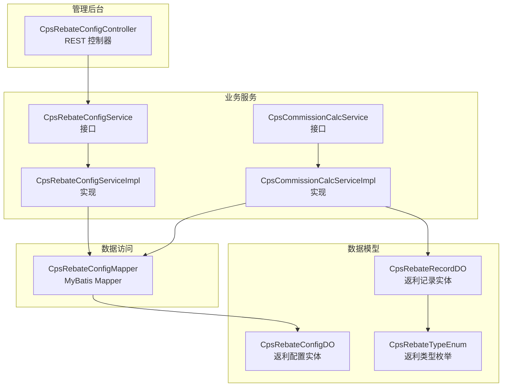
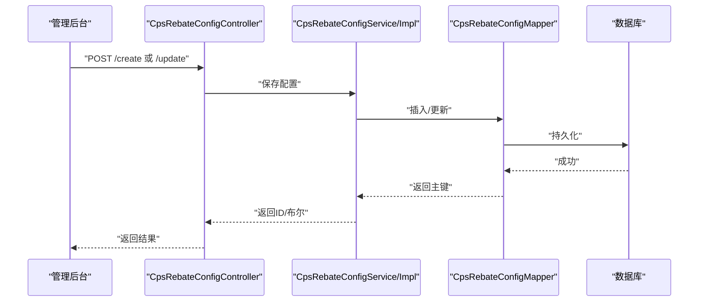
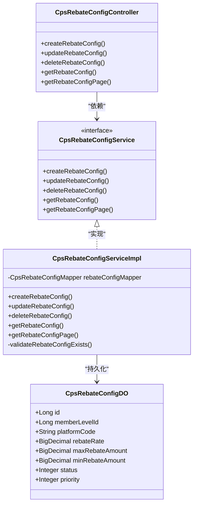
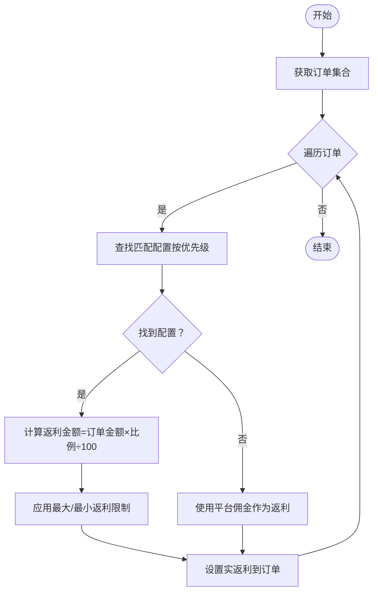
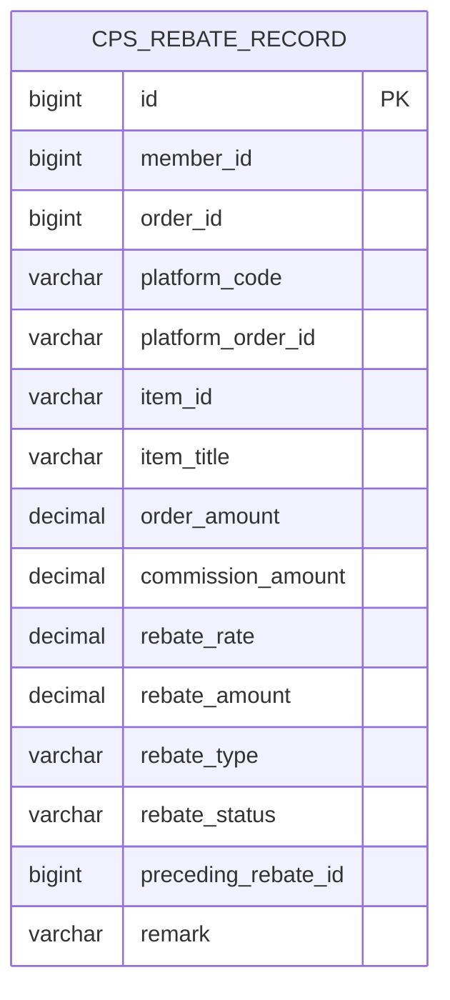
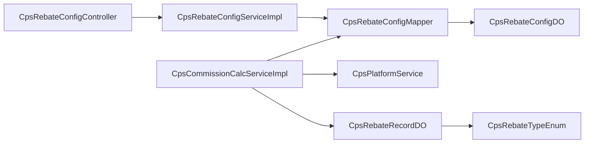

# 业务规则定制

<cite>
**本文引用的文件**
- [CPS系统PRD文档.md](file://docs/CPS系统PRD文档.md)
- [CpsRebateConfigService.java](file://qiji-module-cps/qiji-module-cps-biz/src/main/java/cn/zhijian/cps/service/CpsRebateConfigService.java)
- [CpsRebateConfigServiceImpl.java](file://qiji-module-cps/qiji-module-cps-biz/src/main/java/cn/zhijian/cps/service/CpsRebateConfigServiceImpl.java)
- [CpsRebateConfigDO.java](file://qiji-module-cps/qiji-module-cps-biz/src/main/java/cn/zhijian/cps/dal/dataobject/CpsRebateConfigDO.java)
- [CpsCommissionCalcService.java](file://qiji-module-cps/qiji-module-cps-biz/src/main/java/cn/zhijian/cps/service/commission/CpsCommissionCalcService.java)
- [CpsCommissionCalcServiceImpl.java](file://qiji-module-cps/qiji-module-cps-biz/src/main/java/cn/zhijian/cps/service/commission/CpsCommissionCalcServiceImpl.java)
- [CpsRebateRecordDO.java](file://qiji-module-cps/qiji-module-cps-biz/src/main/java/cn/zhijian/cps/dal/dataobject/CpsRebateRecordDO.java)
- [CpsRebateTypeEnum.java](file://qiji-module-cps/qiji-module-cps-biz/src/main/java/cn/zhijian/cps/enums/CpsRebateTypeEnum.java)
- [CpsRebateConfigController.java](file://qiji-module-cps/qiji-module-cps-biz/src/main/java/cn/zhijian/cps/controller/admin/CpsRebateConfigController.java)
</cite>

## 目录
1. [引言](#引言)
2. [项目结构](#项目结构)
3. [核心组件](#核心组件)
4. [架构总览](#架构总览)
5. [详细组件分析](#详细组件分析)
6. [依赖分析](#依赖分析)
7. [性能考虑](#性能考虑)
8. [故障排查指南](#故障排查指南)
9. [结论](#结论)
10. [附录](#附录)

## 引言
本文件面向AgenticCPS系统的业务规则定制，围绕“规则引擎、配置管理、动态规则”三大主题，系统性阐述如何定制CPS返利规则（比例、计算方式、生效条件）、会员等级与权益（等级设置、升级条件、特权配置）、商品分类与属性（分类规则、属性定义、筛选条件）、促销活动规则（满减活动、折扣规则、叠加限制）。同时提供完整的开发指南（规则配置、代码实现、测试验证）、版本管理与回滚机制（配置变更、规则更新、历史记录）、性能优化（缓存策略、批量处理、异步执行）、监控与审计（执行日志、性能指标、合规检查），并给出可直接落地的定制示例。

## 项目结构
AgenticCPS的业务规则主要集中在CPS模块biz层，包含控制器、服务、数据对象与枚举等。规则配置通过管理后台接口进行维护，计算逻辑由佣金计算服务实现，最终落库为返利记录。

**图表来源**
- [CpsRebateConfigController.java:1-73](file://qiji-module-cps/qiji-module-cps-biz/src/main/java/cn/zhijian/cps/controller/admin/CpsRebateConfigController.java#L1-L73)
- [CpsRebateConfigService.java:1-24](file://qiji-module-cps/qiji-module-cps-biz/src/main/java/cn/zhijian/cps/service/CpsRebateConfigService.java#L1-L24)
- [CpsRebateConfigServiceImpl.java:1-67](file://qiji-module-cps/qiji-module-cps-biz/src/main/java/cn/zhijian/cps/service/CpsRebateConfigServiceImpl.java#L1-L67)
- [CpsCommissionCalcService.java:1-38](file://qiji-module-cps/qiji-module-cps-biz/src/main/java/cn/zhijian/cps/service/commission/CpsCommissionCalcService.java#L1-L38)
- [CpsCommissionCalcServiceImpl.java:1-170](file://qiji-module-cps/qiji-module-cps-biz/src/main/java/cn/zhijian/cps/service/commission/CpsCommissionCalcServiceImpl.java#L1-L170)
- [CpsRebateConfigDO.java:1-41](file://qiji-module-cps/qiji-module-cps-biz/src/main/java/cn/zhijian/cps/dal/dataobject/CpsRebateConfigDO.java#L1-L41)
- [CpsRebateRecordDO.java:1-55](file://qiji-module-cps/qiji-module-cps-biz/src/main/java/cn/zhijian/cps/dal/dataobject/CpsRebateRecordDO.java#L1-L55)
- [CpsRebateTypeEnum.java:1-21](file://qiji-module-cps/qiji-module-cps-biz/src/main/java/cn/zhijian/cps/enums/CpsRebateTypeEnum.java#L1-L21)

**章节来源**
- [CpsRebateConfigController.java:1-73](file://qiji-module-cps/qiji-module-cps-biz/src/main/java/cn/zhijian/cps/controller/admin/CpsRebateConfigController.java#L1-L73)
- [CpsRebateConfigService.java:1-24](file://qiji-module-cps/qiji-module-cps-biz/src/main/java/cn/zhijian/cps/service/CpsRebateConfigService.java#L1-L24)
- [CpsRebateConfigServiceImpl.java:1-67](file://qiji-module-cps/qiji-module-cps-biz/src/main/java/cn/zhijian/cps/service/CpsRebateConfigServiceImpl.java#L1-L67)
- [CpsCommissionCalcService.java:1-38](file://qiji-module-cps/qiji-module-cps-biz/src/main/java/cn/zhijian/cps/service/commission/CpsCommissionCalcService.java#L1-L38)
- [CpsCommissionCalcServiceImpl.java:1-170](file://qiji-module-cps/qiji-module-cps-biz/src/main/java/cn/zhijian/cps/service/commission/CpsCommissionCalcServiceImpl.java#L1-L170)
- [CpsRebateConfigDO.java:1-41](file://qiji-module-cps/qiji-module-cps-biz/src/main/java/cn/zhijian/cps/dal/dataobject/CpsRebateConfigDO.java#L1-L41)
- [CpsRebateRecordDO.java:1-55](file://qiji-module-cps/qiji-module-cps-biz/src/main/java/cn/zhijian/cps/dal/dataobject/CpsRebateRecordDO.java#L1-L55)
- [CpsRebateTypeEnum.java:1-21](file://qiji-module-cps/qiji-module-cps-biz/src/main/java/cn/zhijian/cps/enums/CpsRebateTypeEnum.java#L1-L21)

## 核心组件
- 规则配置管理
  - 控制器：提供创建、更新、删除、查询、分页等接口，权限校验基于注解。
  - 服务：封装持久化与校验逻辑，负责DTO与DO之间的转换。
  - 数据对象：存储返利配置的维度（会员等级、平台、比例、上下限、优先级、状态）。
- 佣金/返利计算
  - 接口：定义单笔/批量计算能力，并支持按会员等级重载。
  - 实现：按优先级匹配配置，计算返利金额并应用上下限约束。
- 返利记录
  - 数据对象：记录返利类型（入账、扣回、调整）、状态、金额、关联订单等。
  - 枚举：统一返利类型常量。

**章节来源**
- [CpsRebateConfigController.java:1-73](file://qiji-module-cps/qiji-module-cps-biz/src/main/java/cn/zhijian/cps/controller/admin/CpsRebateConfigController.java#L1-L73)
- [CpsRebateConfigService.java:1-24](file://qiji-module-cps/qiji-module-cps-biz/src/main/java/cn/zhijian/cps/service/CpsRebateConfigService.java#L1-L24)
- [CpsRebateConfigServiceImpl.java:1-67](file://qiji-module-cps/qiji-module-cps-biz/src/main/java/cn/zhijian/cps/service/CpsRebateConfigServiceImpl.java#L1-L67)
- [CpsRebateConfigDO.java:1-41](file://qiji-module-cps/qiji-module-cps-biz/src/main/java/cn/zhijian/cps/dal/dataobject/CpsRebateConfigDO.java#L1-L41)
- [CpsCommissionCalcService.java:1-38](file://qiji-module-cps/qiji-module-cps-biz/src/main/java/cn/zhijian/cps/service/commission/CpsCommissionCalcService.java#L1-L38)
- [CpsCommissionCalcServiceImpl.java:1-170](file://qiji-module-cps/qiji-module-cps-biz/src/main/java/cn/zhijian/cps/service/commission/CpsCommissionCalcServiceImpl.java#L1-L170)
- [CpsRebateRecordDO.java:1-55](file://qiji-module-cps/qiji-module-cps-biz/src/main/java/cn/zhijian/cps/dal/dataobject/CpsRebateRecordDO.java#L1-L55)
- [CpsRebateTypeEnum.java:1-21](file://qiji-module-cps/qiji-module-cps-biz/src/main/java/cn/zhijian/cps/enums/CpsRebateTypeEnum.java#L1-L21)

## 架构总览
下图展示了从管理后台到规则引擎与计算服务的整体流程，以及与数据库的交互关系。

**图表来源**
- [CpsRebateConfigController.java:31-53](file://qiji-module-cps/qiji-module-cps-biz/src/main/java/cn/zhijian/cps/controller/admin/CpsRebateConfigController.java#L31-L53)
- [CpsRebateConfigServiceImpl.java:27-44](file://qiji-module-cps/qiji-module-cps-biz/src/main/java/cn/zhijian/cps/service/CpsRebateConfigServiceImpl.java#L27-L44)
- [CpsRebateConfigDO.java:25-38](file://qiji-module-cps/qiji-module-cps-biz/src/main/java/cn/zhijian/cps/dal/dataobject/CpsRebateConfigDO.java#L25-L38)

## 详细组件分析

### 组件A：返利配置管理（规则配置）
- 职责
  - 提供返利配置的增删改查与分页能力。
  - 通过权限注解控制操作范围。
- 关键点
  - DTO与DO转换，避免控制器直接操作领域对象。
  - 存在存在性校验，防止对不存在的配置进行更新/删除。
- 数据模型
  - 返利配置维度：会员等级ID（可空）、平台编码（可空）、返利比例、单笔上下限、优先级、状态。
- 接口与实现
  - 控制器：暴露REST接口，完成鉴权与参数封装。
  - 服务：封装业务校验与Mapper调用。
  - Mapper：基于MyBatis的SQL映射。

**图表来源**
- [CpsRebateConfigController.java:1-73](file://qiji-module-cps/qiji-module-cps-biz/src/main/java/cn/zhijian/cps/controller/admin/CpsRebateConfigController.java#L1-L73)
- [CpsRebateConfigService.java:1-24](file://qiji-module-cps/qiji-module-cps-biz/src/main/java/cn/zhijian/cps/service/CpsRebateConfigService.java#L1-L24)
- [CpsRebateConfigServiceImpl.java:1-67](file://qiji-module-cps/qiji-module-cps-biz/src/main/java/cn/zhijian/cps/service/CpsRebateConfigServiceImpl.java#L1-L67)
- [CpsRebateConfigDO.java:1-41](file://qiji-module-cps/qiji-module-cps-biz/src/main/java/cn/zhijian/cps/dal/dataobject/CpsRebateConfigDO.java#L1-L41)

**章节来源**
- [CpsRebateConfigController.java:1-73](file://qiji-module-cps/qiji-module-cps-biz/src/main/java/cn/zhijian/cps/controller/admin/CpsRebateConfigController.java#L1-L73)
- [CpsRebateConfigService.java:1-24](file://qiji-module-cps/qiji-module-cps-biz/src/main/java/cn/zhijian/cps/service/CpsRebateConfigService.java#L1-L24)
- [CpsRebateConfigServiceImpl.java:1-67](file://qiji-module-cps/qiji-module-cps-biz/src/main/java/cn/zhijian/cps/service/CpsRebateConfigServiceImpl.java#L1-L67)
- [CpsRebateConfigDO.java:1-41](file://qiji-module-cps/qiji-module-cps-biz/src/main/java/cn/zhijian/cps/dal/dataobject/CpsRebateConfigDO.java#L1-L41)

### 组件B：佣金/返利计算（规则引擎）
- 职责
  - 根据订单金额与匹配的返利配置计算返利金额。
  - 支持按会员等级重载与批量计算。
- 计算优先级
  - 1) 会员等级 + 平台组合配置
  - 2) 仅会员等级配置
  - 3) 仅平台配置
  - 4) 默认配置（无等级无平台）
- 计算公式与约束
  - 返利金额 = 订单金额 × 返利比例 ÷ 100
  - 应用最大/最小返利限制（若配置）
- 批量处理
  - 对订单集合逐个计算，异常时回退为使用平台佣金作为返利。

**图表来源**
- [CpsCommissionCalcServiceImpl.java:64-79](file://qiji-module-cps/qiji-module-cps-biz/src/main/java/cn/zhijian/cps/service/commission/CpsCommissionCalcServiceImpl.java#L64-L79)
- [CpsCommissionCalcServiceImpl.java:89-124](file://qiji-module-cps/qiji-module-cps-biz/src/main/java/cn/zhijian/cps/service/commission/CpsCommissionCalcServiceImpl.java#L89-L124)
- [CpsCommissionCalcServiceImpl.java:133-167](file://qiji-module-cps/qiji-module-cps-biz/src/main/java/cn/zhijian/cps/service/commission/CpsCommissionCalcServiceImpl.java#L133-L167)

**章节来源**
- [CpsCommissionCalcService.java:1-38](file://qiji-module-cps/qiji-module-cps-biz/src/main/java/cn/zhijian/cps/service/commission/CpsCommissionCalcService.java#L1-L38)
- [CpsCommissionCalcServiceImpl.java:1-170](file://qiji-module-cps/qiji-module-cps-biz/src/main/java/cn/zhijian/cps/service/commission/CpsCommissionCalcServiceImpl.java#L1-L170)

### 组件C：返利记录（审计与状态）
- 职责
  - 记录每次返利的明细，包括会员、订单、平台、金额、比例、类型、状态、备注等。
- 类型与状态
  - 类型：入账、扣回、调整（枚举统一管理）。
  - 状态：待结算、已到账、已扣回。
- 与PRD一致性
  - 与PRD中的“返利入账到会员钱包”“返利扣回流程”保持一致。

**图表来源**
- [CpsRebateRecordDO.java:1-55](file://qiji-module-cps/qiji-module-cps-biz/src/main/java/cn/zhijian/cps/dal/dataobject/CpsRebateRecordDO.java#L1-L55)
- [CpsRebateTypeEnum.java:1-21](file://qiji-module-cps/qiji-module-cps-biz/src/main/java/cn/zhijian/cps/enums/CpsRebateTypeEnum.java#L1-L21)

**章节来源**
- [CpsRebateRecordDO.java:1-55](file://qiji-module-cps/qiji-module-cps-biz/src/main/java/cn/zhijian/cps/dal/dataobject/CpsRebateRecordDO.java#L1-L55)
- [CpsRebateTypeEnum.java:1-21](file://qiji-module-cps/qiji-module-cps-biz/src/main/java/cn/zhijian/cps/enums/CpsRebateTypeEnum.java#L1-L21)

### 组件D：业务规则定制要点（对照PRD）
- 返利规则定制
  - 比例：配置返利比例（百分比），支持按等级、平台、全平台、默认配置。
  - 计算方式：订单金额×比例÷100，再应用最大/最小限制。
  - 生效条件：启用状态、优先级、平台与等级匹配。
- 会员等级与权益
  - 等级设置：在PRD中定义等级与默认比例；可在配置中覆盖。
  - 升级条件：PRD未定义具体数值，可在业务侧扩展（例如消费金额/积分）。
  - 特权配置：通过返利配置的“会员等级 + 平台”组合实现差异化权益。
- 商品分类与属性
  - PRD未提供分类与属性的规则定义，可在商品域模块扩展。
- 促销活动规则
  - PRD未提供满减/折扣/叠加限制的具体规则，可在促销域模块扩展。

**章节来源**
- [CPS系统PRD文档.md:586-620](file://docs/CPS系统PRD文档.md#L586-L620)
- [CpsCommissionCalcServiceImpl.java:89-124](file://qiji-module-cps/qiji-module-cps-biz/src/main/java/cn/zhijian/cps/service/commission/CpsCommissionCalcServiceImpl.java#L89-L124)
- [CpsRebateConfigDO.java:25-38](file://qiji-module-cps/qiji-module-cps-biz/src/main/java/cn/zhijian/cps/dal/dataobject/CpsRebateConfigDO.java#L25-L38)

## 依赖分析
- 控制器依赖服务接口，服务实现依赖Mapper与平台服务。
- 计算服务依赖配置Mapper与平台服务，用于匹配配置与平台费率。
- 数据模型之间通过返利记录与配置形成闭环，记录承载审计与状态。

**图表来源**
- [CpsRebateConfigController.java:1-73](file://qiji-module-cps/qiji-module-cps-biz/src/main/java/cn/zhijian/cps/controller/admin/CpsRebateConfigController.java#L1-L73)
- [CpsRebateConfigServiceImpl.java:1-67](file://qiji-module-cps/qiji-module-cps-biz/src/main/java/cn/zhijian/cps/service/CpsRebateConfigServiceImpl.java#L1-L67)
- [CpsCommissionCalcServiceImpl.java:1-170](file://qiji-module-cps/qiji-module-cps-biz/src/main/java/cn/zhijian/cps/service/commission/CpsCommissionCalcServiceImpl.java#L1-L170)
- [CpsRebateConfigDO.java:1-41](file://qiji-module-cps/qiji-module-cps-biz/src/main/java/cn/zhijian/cps/dal/dataobject/CpsRebateConfigDO.java#L1-L41)
- [CpsRebateRecordDO.java:1-55](file://qiji-module-cps/qiji-module-cps-biz/src/main/java/cn/zhijian/cps/dal/dataobject/CpsRebateRecordDO.java#L1-L55)
- [CpsRebateTypeEnum.java:1-21](file://qiji-module-cps/qiji-module-cps-biz/src/main/java/cn/zhijian/cps/enums/CpsRebateTypeEnum.java#L1-L21)

**章节来源**
- [CpsRebateConfigController.java:1-73](file://qiji-module-cps/qiji-module-cps-biz/src/main/java/cn/zhijian/cps/controller/admin/CpsRebateConfigController.java#L1-L73)
- [CpsRebateConfigServiceImpl.java:1-67](file://qiji-module-cps/qiji-module-cps-biz/src/main/java/cn/zhijian/cps/service/CpsRebateConfigServiceImpl.java#L1-L67)
- [CpsCommissionCalcServiceImpl.java:1-170](file://qiji-module-cps/qiji-module-cps-biz/src/main/java/cn/zhijian/cps/service/commission/CpsCommissionCalcServiceImpl.java#L1-L170)
- [CpsRebateConfigDO.java:1-41](file://qiji-module-cps/qiji-module-cps-biz/src/main/java/cn/zhijian/cps/dal/dataobject/CpsRebateConfigDO.java#L1-L41)
- [CpsRebateRecordDO.java:1-55](file://qiji-module-cps/qiji-module-cps-biz/src/main/java/cn/zhijian/cps/dal/dataobject/CpsRebateRecordDO.java#L1-L55)
- [CpsRebateTypeEnum.java:1-21](file://qiji-module-cps/qiji-module-cps-biz/src/main/java/cn/zhijian/cps/enums/CpsRebateTypeEnum.java#L1-L21)

## 性能考虑
- 缓存策略
  - 配置缓存：对“启用且有效”的返利配置进行缓存，按平台与等级维度分组，降低频繁查询成本。
  - 订单计算缓存：对已结算订单的返利结果进行缓存，避免重复计算。
- 批量处理
  - 订单批量计算：在计算服务中对订单集合进行批量处理，减少事务与IO开销。
  - 批量写入：返利记录入库采用批量插入或合并写入策略。
- 异步执行
  - 订单结算后，返利入账与通知可异步执行，提升吞吐。
- 并发与锁
  - 对同一订单的返利处理加分布式锁，避免重复入账。
- 监控与指标
  - 计算耗时、命中率、异常率、批量处理吞吐等指标埋点。

[本节为通用指导，不直接分析具体文件]

## 故障排查指南
- 配置相关
  - 未找到匹配配置：检查配置状态、优先级、平台与等级是否为空或匹配。
  - 上下限异常：确认最大/最小返利金额配置是否合理。
- 计算相关
  - 订单金额为空或非正：计算结果为零，需检查上游订单数据。
  - 批量计算异常：单订单异常不影响整体流程，但需关注日志与回退逻辑。
- 记录相关
  - 返利类型与状态：确保类型枚举与状态流转符合预期。
- 日志与审计
  - 控制器与服务均输出关键日志，便于定位问题。

**章节来源**
- [CpsCommissionCalcServiceImpl.java:41-61](file://qiji-module-cps/qiji-module-cps-biz/src/main/java/cn/zhijian/cps/service/commission/CpsCommissionCalcServiceImpl.java#L41-L61)
- [CpsCommissionCalcServiceImpl.java:64-79](file://qiji-module-cps/qiji-module-cps-biz/src/main/java/cn/zhijian/cps/service/commission/CpsCommissionCalcServiceImpl.java#L64-L79)
- [CpsRebateRecordDO.java:45-48](file://qiji-module-cps/qiji-module-cps-biz/src/main/java/cn/zhijian/cps/dal/dataobject/CpsRebateRecordDO.java#L45-L48)
- [CpsRebateTypeEnum.java:13-15](file://qiji-module-cps/qiji-module-cps-biz/src/main/java/cn/zhijian/cps/enums/CpsRebateTypeEnum.java#L13-L15)

## 结论
AgenticCPS的业务规则定制以“配置驱动 + 规则引擎”为核心：通过管理后台对返利配置进行灵活维护，计算服务依据优先级与上下限进行精确计算，最终以返利记录实现审计与状态跟踪。该架构具备良好的扩展性与可运维性，能够支撑复杂的CPS返利场景。

[本节为总结，不直接分析具体文件]

## 附录

### 业务规则开发指南（步骤）
- 规则配置
  - 在管理后台创建/更新返利配置，设置会员等级、平台、比例、上下限、优先级与状态。
  - 通过分页查询核对配置生效范围。
- 代码实现
  - 若需扩展新的匹配维度（如商品类目），可在计算服务中扩展匹配逻辑。
  - 若需引入促销叠加，可在计算前增加促销评估步骤。
- 测试验证
  - 单测：覆盖不同优先级、上下限、异常场景。
  - 集成测：模拟订单结算流程，验证返利入账与扣回。
- 版本管理与回滚
  - 配置变更：通过管理后台进行灰度发布，观察指标与日志。
  - 回滚：若发现异常，快速恢复至上一个稳定配置版本。
- 性能优化
  - 配置缓存、批量处理、异步执行、并发锁与指标埋点。
- 监控与审计
  - 关键日志、慢查询、异常告警、合规检查（如返利类型与状态一致性）。

[本节为通用指导，不直接分析具体文件]

### 定制示例（落地步骤）
- 示例1：为钻石会员在淘宝平台设置专属返利比例
  - 步骤：在返利配置中新增一条“会员等级=钻石 + 平台=淘宝”的配置，设置比例与优先级，启用状态。
  - 验证：下单后计算服务按优先级命中该配置，返利金额按规则计算。
- 示例2：限制单笔返利上限
  - 步骤：在配置中设置最大返利金额，计算时自动取较小值。
  - 验证：超过上限的订单按上限返利，日志记录最大限制应用。
- 示例3：批量结算并入账
  - 步骤：定时任务批量计算订单返利，写入返利记录，异步入账。
  - 验证：批量日志与单订单日志一致，异常订单回退为平台佣金。

**章节来源**
- [CpsRebateConfigController.java:31-53](file://qiji-module-cps/qiji-module-cps-biz/src/main/java/cn/zhijian/cps/controller/admin/CpsRebateConfigController.java#L31-L53)
- [CpsCommissionCalcServiceImpl.java:64-79](file://qiji-module-cps/qiji-module-cps-biz/src/main/java/cn/zhijian/cps/service/commission/CpsCommissionCalcServiceImpl.java#L64-L79)
- [CpsRebateRecordDO.java:45-48](file://qiji-module-cps/qiji-module-cps-biz/src/main/java/cn/zhijian/cps/dal/dataobject/CpsRebateRecordDO.java#L45-L48)