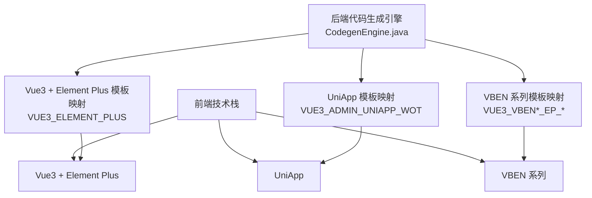
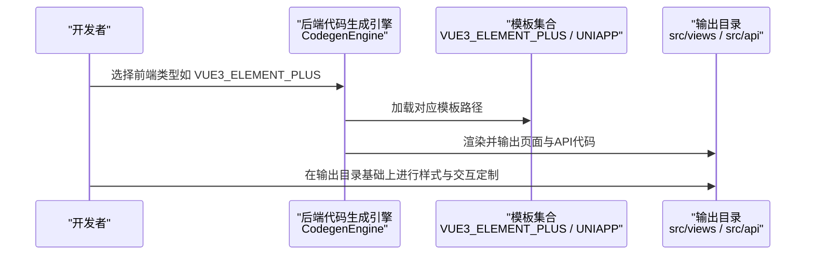
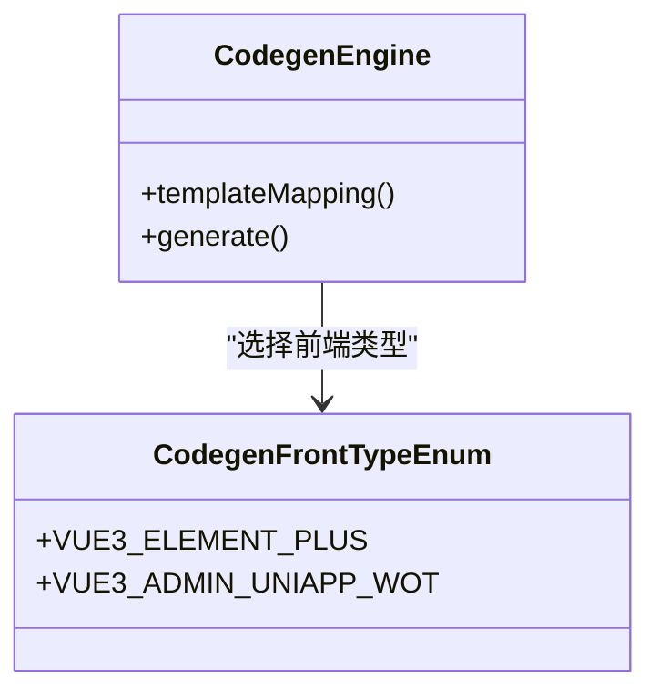

# 前端界面定制

<cite>
**本文引用的文件**
- [pom.xml](file://pom.xml)
- [CodegenFrontTypeEnum.java](file://qiji-module-infra/src/main/java/com.qiji.cps/module/infra/enums/codegen/CodegenFrontTypeEnum.java)
- [CodegenEngine.java](file://qiji-module-infra/src/main/java/com.qiji.cps/module/infra/service/codegen/inner/CodegenEngine.java)
- [CodegenEngineVue3Test.java](file://qiji-module-infra/src/test/java/com.qiji.cps/module/infra/service/codegen/inner/CodegenEngineVue3Test.java)
- [README.md（qiji-ui-admin-vue3）](file://qiji-ui/qiji-ui-admin-vue3/README.md)
- [README.md（qiji-ui-admin-uniapp）](file://qiji-ui/qiji-ui-admin-uniapp/README.md)
</cite>

## 目录
1. [简介](#简介)
2. [项目结构](#项目结构)
3. [核心组件](#核心组件)
4. [架构总览](#架构总览)
5. [组件详解](#组件详解)
6. [依赖关系分析](#依赖关系分析)
7. [性能考量](#性能考量)
8. [故障排查指南](#故障排查指南)
9. [结论](#结论)
10. [附录](#附录)

## 简介
本文件面向AgenticCPS系统的前端界面定制，聚焦于以下目标：
- 基于Vue3 + Element Plus的管理后台界面定制
- 基于UniApp的多端适配（Web、移动端、小程序）
- 页面布局、组件样式、交互效果的定制方法
- 移动端响应式设计、触摸交互与性能优化
- 现有组件的样式覆盖、功能增强与行为调整
- 主题系统定制（颜色、字体、图标）
- 国际化与本地化（多语言、地区、时区）
- 界面性能优化（懒加载、资源压缩、缓存策略）
- 提供可落地的定制示例与步骤

## 项目结构
从工程结构看，前端相关模块以“代码生成”为核心能力，通过后端模板引擎生成不同前端技术栈的页面与API代码，包括：
- Vue3 + Element Plus（管理后台）
- UniApp（多端）
- 其他VBEN系列模板（作为对比参考）

图表来源
- [CodegenEngine.java:124-150](file://qiji-module-infra/src/main/java/com.qiji.cps/module/infra/service/codegen/inner/CodegenEngine.java#L124-L150)
- [CodegenEngine.java:624-631](file://qiji-module-infra/src/main/java/com.qiji.cps/module/infra/service/codegen/inner/CodegenEngine.java#L624-L631)
- [CodegenEngine.java:633-640](file://qiji-module-infra/src/main/java/com.qiji.cps/module/infra/service/codegen/inner/CodegenEngine.java#L633-L640)

章节来源
- [pom.xml:10-25](file://pom.xml#L10-L25)
- [README.md（qiji-ui-admin-vue3）:1-5](file://qiji-ui/qiji-ui-admin-vue3/README.md#L1-L5)
- [README.md（qiji-ui-admin-uniapp）:1-5](file://qiji-ui/qiji-ui-admin-uniapp/README.md#L1-L5)

## 核心组件
- 代码生成前端类型枚举：定义了多种前端模板类型，其中与本定制目标直接相关的是：
  - VUE3_ELEMENT_PLUS：Vue3 + Element Plus标准模板
  - VUE3_ADMIN_UNIAPP_WOT：Vue3 Admin + UniApp + WOT多端模板
- 代码生成引擎：负责将数据库表映射到具体模板，并输出到指定目录结构，形成可定制的前端页面与API。

章节来源
- [CodegenFrontTypeEnum.java:13-28](file://qiji-module-infra/src/main/java/com.qiji.cps/module/infra/enums/codegen/CodegenFrontTypeEnum.java#L13-L28)
- [CodegenEngine.java:124-150](file://qiji-module-infra/src/main/java/com.qiji.cps/module/infra/service/codegen/inner/CodegenEngine.java#L124-L150)

## 架构总览
前端定制的核心流程是：后端根据选择的前端类型，将模板渲染为页面与API代码，再由前端团队在此基础上进行样式、交互与主题的二次定制。

图表来源
- [CodegenEngine.java:124-150](file://qiji-module-infra/src/main/java/com.qiji.cps/module/infra/service/codegen/inner/CodegenEngine.java#L124-L150)
- [CodegenEngine.java:624-631](file://qiji-module-infra/src/main/java/com.qiji.cps/module/infra/service/codegen/inner/CodegenEngine.java#L624-L631)
- [CodegenEngine.java:633-640](file://qiji-module-infra/src/main/java/com.qiji.cps/module/infra/service/codegen/inner/CodegenEngine.java#L633-L640)

## 组件详解

### Vue3 + Element Plus 管理后台定制
- 页面与组件生成
  - 列表页、表单页、子表组件等模板映射至 views/* 与 components/* 目录
  - API层生成位于 api/* 目录，便于对接后端接口
- 定制要点
  - 页面布局：在 index.vue 中组织 ElContainer、ElHeader、ElAside、ElMain 结构，按需调整侧边栏与面包屑
  - 组件样式：通过 scoped CSS 或全局样式覆盖 Element Plus 组件默认样式；注意 !important 的谨慎使用
  - 交互效果：在表单页与列表页中增强校验提示、批量操作、分页与筛选交互
- 示例路径
  - 列表页模板映射：[CodegenEngine.java:125-128](file://qiji-module-infra/src/main/java/com.qiji.cps/module/infra/service/codegen/inner/CodegenEngine.java#L125-L128)
  - 表单页模板映射：[CodegenEngine.java:127-128](file://qiji-module-infra/src/main/java/com.qiji.cps/module/infra/service/codegen/inner/CodegenEngine.java#L127-L128)
  - API模板映射：[CodegenEngine.java:139-140](file://qiji-module-infra/src/main/java/com.qiji.cps/module/infra/service/codegen/inner/CodegenEngine.java#L139-L140)

章节来源
- [CodegenEngine.java:124-150](file://qiji-module-infra/src/main/java/com.qiji.cps/module/infra/service/codegen/inner/CodegenEngine.java#L124-L150)

### UniApp 多端适配定制
- 生成规则
  - 采用 VUE3_ADMIN_UNIAPP_WOT 类型，输出到 pages-* 目录，适配 Web、App、小程序三端
- 定制要点
  - 响应式设计：利用 uni-app 的 rpx 单位与媒体查询，适配不同屏幕尺寸
  - 触摸交互：在表单与列表中增强手势支持（如滑动删除、长按菜单）
  - 性能优化：按需引入组件、减少全局样式体积、启用分包加载
- 示例路径
  - 模板映射（首页、搜索表单、表单详情）：[CodegenEngine.java:141-150](file://qiji-module-infra/src/main/java/com.qiji.cps/module/infra/service/codegen/inner/CodegenEngine.java#L141-L150)

章节来源
- [CodegenEngine.java:141-150](file://qiji-module-infra/src/main/java/com.qiji.cps/module/infra/service/codegen/inner/CodegenEngine.java#L141-L150)

### 现有组件修改与增强
- 样式覆盖
  - 在 Element Plus 组件上使用 :deep() 或自定义类名，避免影响全局样式
  - 通过 CSS 变量或主题色板统一调整主色调、按钮与表格样式
- 功能增强
  - 在生成的表单页中增加联动校验、动态字段、富文本编辑器等
  - 在列表页中增加多选、批量导出、快速筛选与排序
- 行为调整
  - 将默认的 ElDialog 替换为抽屉式弹窗，提升移动端体验
  - 为按钮组增加加载态与禁用态，防止重复提交

章节来源
- [CodegenEngine.java:124-150](file://qiji-module-infra/src/main/java/com.qiji.cps/module/infra/service/codegen/inner/CodegenEngine.java#L124-L150)

### 主题系统定制
- 颜色方案
  - 通过 CSS 变量或 Element Plus 主题变量，集中管理主色、辅色、状态色
- 字体设置
  - 在全局样式中统一中英文字体族，确保多语言显示一致
- 图标替换
  - 使用自定义 SVG 图标替换 Element Plus 默认图标，保持品牌一致性

章节来源
- [CodegenEngine.java:124-150](file://qiji-module-infra/src/main/java/com.qiji.cps/module/infra/service/codegen/inner/CodegenEngine.java#L124-L150)

### 国际化与本地化
- 多语言支持
  - 在生成的页面中使用 i18n 注入文本，确保文案可替换
- 地区设置与时区
  - 在日期时间组件中固定时区与格式，避免跨时区显示异常
- 示例路径
  - 表单与列表页中对日期字段的格式化处理：[CodegenEngine.java:401-410](file://qiji-module-infra/src/main/java/com.qiji.cps/module/infra/service/codegen/inner/CodegenEngine.java#L401-L410)

章节来源
- [CodegenEngine.java:401-410](file://qiji-module-infra/src/main/java/com.qiji.cps/module/infra/service/codegen/inner/CodegenEngine.java#L401-L410)

### 界面性能优化
- 组件懒加载
  - 将重型组件（如图表、富文本）按需加载，减少首屏体积
- 资源压缩
  - 在构建阶段开启 Tree Shaking、CSS/JS 压缩与图片优化
- 缓存策略
  - 列表页增加本地缓存与服务端分页缓存，降低重复请求

章节来源
- [CodegenEngine.java:124-150](file://qiji-module-infra/src/main/java/com.qiji.cps/module/infra/service/codegen/inner/CodegenEngine.java#L124-L150)

## 依赖关系分析
- 技术栈依赖
  - Vue3 + Element Plus：管理后台的标准UI组合
  - UniApp：多端适配的基础框架
- 生成器依赖
  - CodegenFrontTypeEnum 定义前端类型
  - CodegenEngine 负责模板映射与输出路径

图表来源
- [CodegenFrontTypeEnum.java:13-28](file://qiji-module-infra/src/main/java/com.qiji.cps/module/infra/enums/codegen/CodegenFrontTypeEnum.java#L13-L28)
- [CodegenEngine.java:124-150](file://qiji-module-infra/src/main/java/com.qiji.cps/module/infra/service/codegen/inner/CodegenEngine.java#L124-L150)

章节来源
- [CodegenFrontTypeEnum.java:13-28](file://qiji-module-infra/src/main/java/com.qiji.cps/module/infra/enums/codegen/CodegenFrontTypeEnum.java#L13-L28)
- [CodegenEngine.java:124-150](file://qiji-module-infra/src/main/java/com.qiji.cps/module/infra/service/codegen/inner/CodegenEngine.java#L124-L150)

## 性能考量
- 按需加载：将非关键组件延迟加载，缩短首屏渲染时间
- 资源优化：在构建配置中启用压缩与去重，减小包体积
- 缓存策略：结合浏览器与服务端缓存，减少重复请求
- 移动端优化：控制DOM层级、避免过度重绘，提升滚动与点击流畅度

## 故障排查指南
- 生成路径不匹配
  - 检查前端类型与模板映射是否正确，确认输出目录结构
  - 参考路径映射定义：[CodegenEngine.java:124-150](file://qiji-module-infra/src/main/java/com.qiji.cps/module/infra/service/codegen/inner/CodegenEngine.java#L124-L150)
- 样式冲突
  - 使用作用域或命名空间隔离样式，避免全局污染
- 国际化缺失
  - 在生成的页面中补充 i18n 文案，确保所有文本可替换
- 性能问题
  - 分析首屏资源与关键渲染路径，启用懒加载与缓存

章节来源
- [CodegenEngine.java:124-150](file://qiji-module-infra/src/main/java/com.qiji.cps/module/infra/service/codegen/inner/CodegenEngine.java#L124-L150)
- [CodegenEngine.java:401-410](file://qiji-module-infra/src/main/java/com.qiji.cps/module/infra/service/codegen/inner/CodegenEngine.java#L401-L410)

## 结论
通过后端代码生成器与前端模板体系，AgenticCPS实现了从“页面 + API”到“多端适配”的高效产出。在此基础上，前端团队可围绕布局、样式、交互、主题与国际化进行深度定制，并结合性能优化策略，持续提升用户体验与维护效率。

## 附录
- 快速开始
  - 选择前端类型：VUE3_ELEMENT_PLUS 或 VUE3_ADMIN_UNIAPP_WOT
  - 执行代码生成，得到 views 与 api 目录
  - 在生成产物基础上进行样式与交互定制
- 参考文件
  - 前端类型枚举：[CodegenFrontTypeEnum.java](file://qiji-module-infra/src/main/java/com.qiji.cps/module/infra/enums/codegen/CodegenFrontTypeEnum.java)
  - 生成引擎与模板映射：[CodegenEngine.java](file://qiji-module-infra/src/main/java/com.qiji.cps/module/infra/service/codegen/inner/CodegenEngine.java)
  - 生成测试用例（Vue3）：[CodegenEngineVue3Test.java](file://qiji-module-infra/src/test/java/com.qiji.cps/module/infra/service/codegen/inner/CodegenEngineVue3Test.java)
  - 管理后台说明：[README.md（qiji-ui-admin-vue3）](file://qiji-ui/qiji-ui-admin-vue3/README.md)
  - UniApp 说明：[README.md（qiji-ui-admin-uniapp）](file://qiji-ui/qiji-ui-admin-uniapp/README.md)