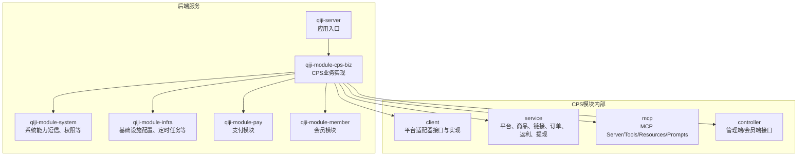
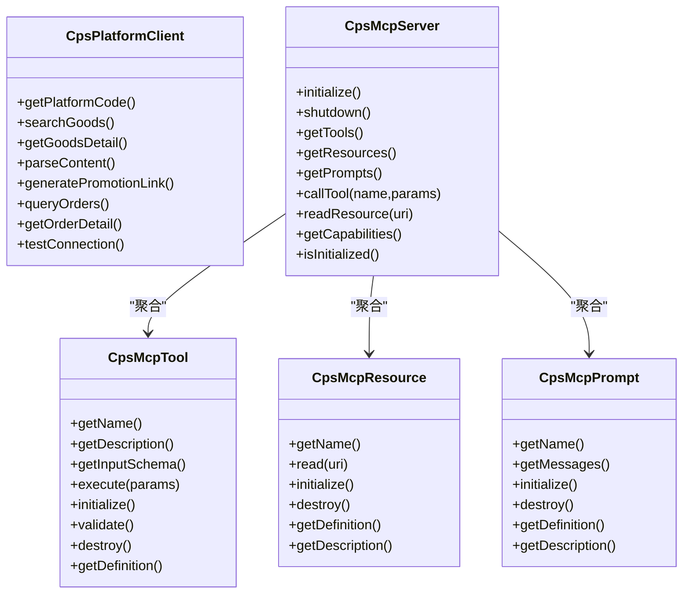
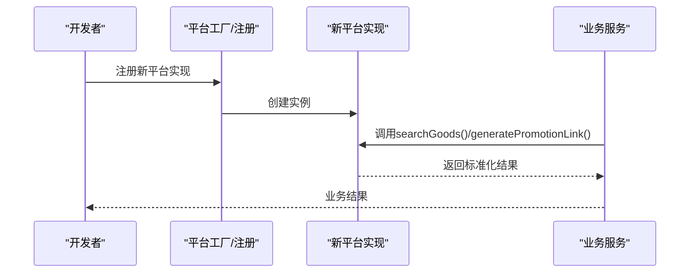
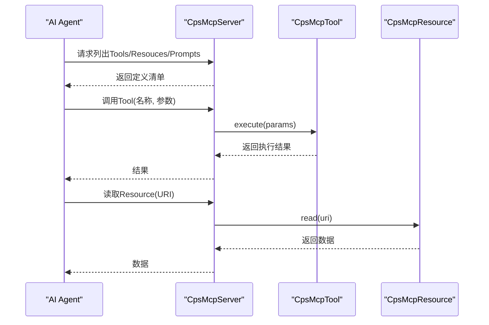
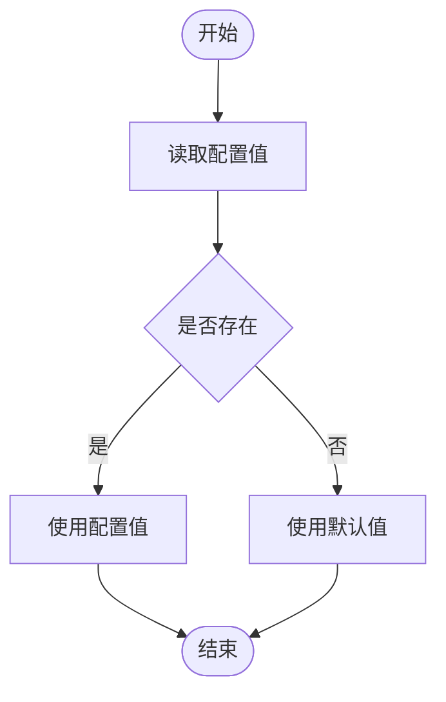
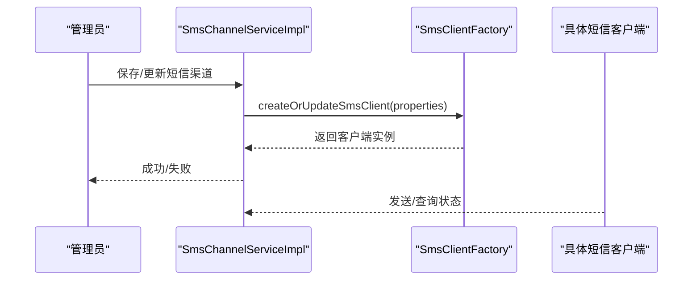
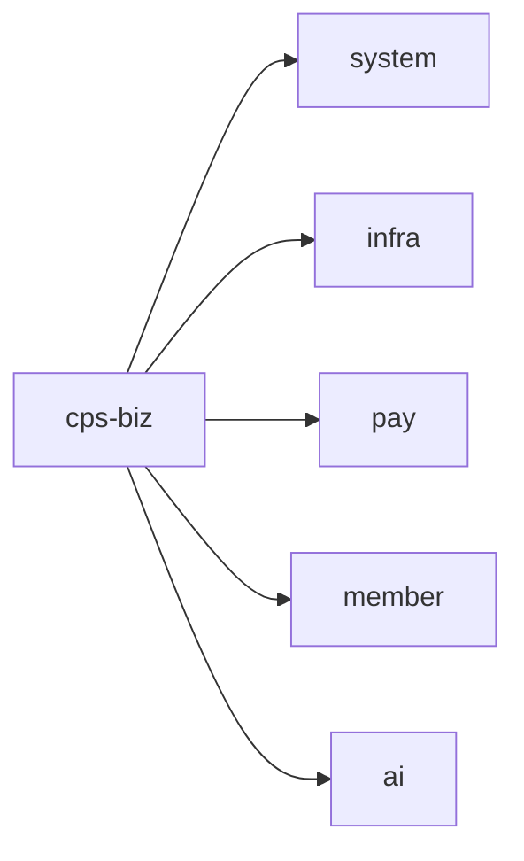

# 扩展与定制

<cite>
**本文引用的文件**
- [README.md](file://README.md)
- [CpsPlatformClient.java](file://qiji-module-cps/qiji-module-cps-biz/src/main/java/cn/zhijian/cps/client/CpsPlatformClient.java)
- [CpsMcpServer.java](file://qiji-module-cps/qiji-module-cps-biz/src/main/java/cn/zhijian/cps/mcp/server/CpsMcpServer.java)
- [CpsMcpServerConfig.java](file://qiji-module-cps/qiji-module-cps-biz/src/main/java/cn/zhijian/cps/mcp/server/CpsMcpServerConfig.java)
- [CpsMcpTool.java](file://qiji-module-cps/qiji-module-cps-biz/src/main/java/cn/zhijian/cps/mcp/tool/CpsMcpTool.java)
- [CpsSearchGoodsTool.java](file://qiji-module-cps/qiji-module-cps-biz/src/main/java/cn/zhijian/cps/mcp/tool/CpsSearchGoodsTool.java)
- [CpsMcpResource.java](file://qiji-module-cps/qiji-module-cps-biz/src/main/java/cn/zhijian/cps/mcp/resource/CpsMcpResource.java)
- [CpsPlatformResource.java](file://qiji-module-cps/qiji-module-cps-biz/src/main/java/cn/zhijian/cps/mcp/resource/CpsPlatformResource.java)
- [CpsMcpPrompt.java](file://qiji-module-cps/qiji-module-cps-biz/src/main/java/cn/zhijian/cps/mcp/prompt/CpsMcpPrompt.java)
- [application.yaml](file://qiji-server/src/main/resources/application.yaml)
- [ConfigServiceImpl.java](file://qiji-module-infra/src/main/java/com.qiji.cps/module/infra/service/config/ConfigServiceImpl.java)
- [ConfigApiImpl.java](file://qiji-module-infra/src/main/java/com.qiji.cps/module/infra/api/config/ConfigApiImpl.java)
- [SmsClientFactory.java](file://qiji-module-system/src/main/java/com.qiji.cps/module/system/framework/sms/core/client/SmsClientFactory.java)
- [SmsChannelServiceImpl.java](file://qiji-module-system/src/main/java/com.qiji.cps/module/system/service/sms/SmsChannelServiceImpl.java)
- [QiniuSmsClient.java](file://qiji-module-system/src/main/java/com.qiji.cps/module/system/framework/sms/core/client/impl/QiniuSmsClient.java)
- [CPS系统PRD文档.md](file://docs/CPS系统PRD文档.md)
</cite>

## 目录
1. [简介](#简介)
2. [项目结构](#项目结构)
3. [核心组件](#核心组件)
4. [架构总览](#架构总览)
5. [详细组件分析](#详细组件分析)
6. [依赖分析](#依赖分析)
7. [性能考虑](#性能考虑)
8. [故障排查指南](#故障排查指南)
9. [结论](#结论)
10. [附录](#附录)

## 简介
本文件面向AgenticCPS系统的扩展与定制，围绕以下目标展开：
- 通过适配器模式快速接入新的CPS平台
- 扩展现有的MCP Tools接口能力
- 自定义业务规则与流程
- 插件化架构与SPI机制、动态加载、配置管理
- 第三方集成方案：支付网关、短信服务、文件存储、消息队列
- 定制开发指导：修改现有功能、新增业务模块、调整UI界面
- API扩展方法：新增接口、修改接口、向后兼容
- 性能优化与定制化最佳实践

## 项目结构
AgenticCPS基于多模块架构，CPS模块位于qiji-module-cps，核心分为biz与api两部分，MCP子系统独立于业务控制器之外，便于与AI Agent对接。

**图表来源**
- [README.md: 196-233:196-233](file://README.md#L196-L233)

**章节来源**
- [README.md: 196-233:196-233](file://README.md#L196-L233)

## 核心组件
- 平台适配器接口：统一CPS平台能力抽象，便于快速接入新平台
- MCP接口层：基于MCP协议的AI Agent接口层，包含Tools、Resources、Prompts
- 配置管理：集中参数配置与运行时读取
- 第三方集成：短信、文件存储、消息队列等

**章节来源**
- [CpsPlatformClient.java: 11-66:11-66](file://qiji-module-cps/qiji-module-cps-biz/src/main/java/cn/zhijian/cps/client/CpsPlatformClient.java#L11-L66)
- [CpsMcpServer.java: 16-120:16-120](file://qiji-module-cps/qiji-module-cps-biz/src/main/java/cn/zhijian/cps/mcp/server/CpsMcpServer.java#L16-L120)
- [CpsMcpTool.java: 9-61:9-61](file://qiji-module-cps/qiji-module-cps-biz/src/main/java/cn/zhijian/cps/mcp/tool/CpsMcpTool.java#L9-L61)
- [CpsMcpResource.java: 9-51:9-51](file://qiji-module-cps/qiji-module-cps-biz/src/main/java/cn/zhijian/cps/mcp/resource/CpsMcpResource.java#L9-L51)
- [CpsMcpPrompt.java: 9-52:9-52](file://qiji-module-cps/qiji-module-cps-biz/src/main/java/cn/zhijian/cps/mcp/prompt/CpsMcpPrompt.java#L9-L52)
- [ConfigServiceImpl.java: 27-37:27-37](file://qiji-module-infra/src/main/java/com.qiji.cps/module/infra/service/config/ConfigServiceImpl.java#L27-L37)
- [ConfigApiImpl.java: 16-27:16-27](file://qiji-module-infra/src/main/java/com.qiji.cps/module/infra/api/config/ConfigApiImpl.java#L16-L27)

## 架构总览
CPS模块采用“适配器 + 服务层 + 控制器 + MCP接口层”的分层设计，平台接入通过适配器接口统一抽象，MCP接口层对外提供AI Agent可调用的能力。

**图表来源**
- [CpsPlatformClient.java: 11-66:11-66](file://qiji-module-cps/qiji-module-cps-biz/src/main/java/cn/zhijian/cps/client/CpsPlatformClient.java#L11-L66)
- [CpsMcpServer.java: 16-183:16-183](file://qiji-module-cps/qiji-module-cps-biz/src/main/java/cn/zhijian/cps/mcp/server/CpsMcpServer.java#L16-L183)
- [CpsMcpTool.java: 9-61:9-61](file://qiji-module-cps/qiji-module-cps-biz/src/main/java/cn/zhijian/cps/mcp/tool/CpsMcpTool.java#L9-L61)
- [CpsMcpResource.java: 9-51:9-51](file://qiji-module-cps/qiji-module-cps-biz/src/main/java/cn/zhijian/cps/mcp/resource/CpsMcpResource.java#L9-L51)
- [CpsMcpPrompt.java: 9-52:9-52](file://qiji-module-cps/qiji-module-cps-biz/src/main/java/cn/zhijian/cps/mcp/prompt/CpsMcpPrompt.java#L9-L52)

## 详细组件分析

### 平台适配器模式与扩展
- 设计要点
  - 通过统一接口抽象平台能力，屏蔽不同平台差异
  - 通过工厂或注册机制实现动态加载与切换
  - 通过DTO标准化请求/响应，降低耦合
- 扩展步骤
  - 新建实现类并实现统一接口
  - 在配置或SPI中注册新平台
  - 编写测试连通性与关键流程
- 适配器接口能力
  - 搜索、详情、解析、生成推广链接、增量订单查询、单笔订单详情、连通性测试

**图表来源**
- [CpsPlatformClient.java: 11-66:11-66](file://qiji-module-cps/qiji-module-cps-biz/src/main/java/cn/zhijian/cps/client/CpsPlatformClient.java#L11-L66)

**章节来源**
- [CpsPlatformClient.java: 11-66:11-66](file://qiji-module-cps/qiji-module-cps-biz/src/main/java/cn/zhijian/cps/client/CpsPlatformClient.java#L11-L66)

### MCP接口层扩展
- MCP Server生命周期管理
  - 初始化：依次初始化Tools、Resources、Prompts
  - 关闭：释放资源
  - 定义获取：提供Tools/Resouces/Prompts清单
  - 调用：按名称路由到具体实现
- MCP接口定义
  - Tool：可执行函数，具备名称、描述、输入Schema、执行逻辑
  - Resource：只读数据源，具备名称与URI读取
  - Prompt：预定义消息模板
- 配置与启用
  - 通过配置文件启用MCP Server，并设置端点
  - 通过Spring容器注入Tool/Resource/Prompt实现

**图表来源**
- [CpsMcpServer.java: 16-120:16-120](file://qiji-module-cps/qiji-module-cps-biz/src/main/java/cn/zhijian/cps/mcp/server/CpsMcpServer.java#L16-L120)
- [CpsMcpTool.java: 9-61:9-61](file://qiji-module-cps/qiji-module-cps-biz/src/main/java/cn/zhijian/cps/mcp/tool/CpsMcpTool.java#L9-L61)
- [CpsMcpResource.java: 9-51:9-51](file://qiji-module-cps/qiji-module-cps-biz/src/main/java/cn/zhijian/cps/mcp/resource/CpsMcpResource.java#L9-L51)
- [CpsMcpPrompt.java: 9-52:9-52](file://qiji-module-cps/qiji-module-cps-biz/src/main/java/cn/zhijian/cps/mcp/prompt/CpsMcpPrompt.java#L9-L52)
- [CpsMcpServerConfig.java: 21-29:21-29](file://qiji-module-cps/qiji-module-cps-biz/src/main/java/cn/zhijian/cps/mcp/server/CpsMcpServerConfig.java#L21-L29)

**章节来源**
- [CpsMcpServer.java: 16-183:16-183](file://qiji-module-cps/qiji-module-cps-biz/src/main/java/cn/zhijian/cps/mcp/server/CpsMcpServer.java#L16-L183)
- [CpsMcpTool.java: 9-61:9-61](file://qiji-module-cps/qiji-module-cps-biz/src/main/java/cn/zhijian/cps/mcp/tool/CpsMcpTool.java#L9-L61)
- [CpsMcpResource.java: 9-51:9-51](file://qiji-module-cps/qiji-module-cps-biz/src/main/java/cn/zhijian/cps/mcp/resource/CpsMcpResource.java#L9-L51)
- [CpsMcpPrompt.java: 9-52:9-52](file://qiji-module-cps/qiji-module-cps-biz/src/main/java/cn/zhijian/cps/mcp/prompt/CpsMcpPrompt.java#L9-L52)
- [CpsMcpServerConfig.java: 21-29:21-29](file://qiji-module-cps/qiji-module-cps-biz/src/main/java/cn/zhijian/cps/mcp/server/CpsMcpServerConfig.java#L21-L29)
- [application.yaml: 199-216:199-216](file://qiji-server/src/main/resources/application.yaml#L199-L216)

### 配置管理与动态加载
- 配置读取
  - 通过服务层读取配置值
  - 通过API层对外暴露配置读取能力
- 动态配置
  - 通过配置中心或数据库配置表实现参数化
  - 在运行时刷新或缓存配置
- 环境配置
  - 通过profile区分开发/生产环境
  - 通过环境变量覆盖默认配置

**图表来源**
- [ConfigServiceImpl.java: 27-37:27-37](file://qiji-module-infra/src/main/java/com.qiji.cps/module/infra/service/config/ConfigServiceImpl.java#L27-L37)
- [ConfigApiImpl.java: 22-25:22-25](file://qiji-module-infra/src/main/java/com.qiji.cps/module/infra/api/config/ConfigApiImpl.java#L22-L25)

**章节来源**
- [ConfigServiceImpl.java: 27-37:27-37](file://qiji-module-infra/src/main/java/com.qiji.cps/module/infra/service/config/ConfigServiceImpl.java#L27-L37)
- [ConfigApiImpl.java: 22-25:22-25](file://qiji-module-infra/src/main/java/com.qiji.cps/module/infra/api/config/ConfigApiImpl.java#L22-L25)
- [application.yaml: 5-6:5-6](file://qiji-server/src/main/resources/application.yaml#L5-L6)

### 第三方集成方案
- 短信服务
  - 工厂模式：根据渠道编码/ID获取客户端
  - 动态创建/更新客户端
  - 七牛云等实现示例
- 文件存储、消息队列、支付网关
  - 采用类似工厂/适配器模式，统一抽象与接入
  - 通过配置管理与运行时注册实现动态切换

**图表来源**
- [SmsChannelServiceImpl.java: 29-34:29-34](file://qiji-module-system/src/main/java/com.qiji.cps/module/system/service/sms/SmsChannelServiceImpl.java#L29-L34)
- [SmsClientFactory.java: 19-36:19-36](file://qiji-module-system/src/main/java/com.qiji.cps/module/system/framework/sms/core/client/SmsClientFactory.java#L19-L36)
- [QiniuSmsClient.java: 34](file://qiji-module-system/src/main/java/com.qiji.cps/module/system/framework/sms/core/client/impl/QiniuSmsClient.java#L34)

**章节来源**
- [SmsChannelServiceImpl.java: 29-34:29-34](file://qiji-module-system/src/main/java/com.qiji.cps/module/system/service/sms/SmsChannelServiceImpl.java#L29-L34)
- [SmsClientFactory.java: 19-36:19-36](file://qiji-module-system/src/main/java/com.qiji.cps/module/system/framework/sms/core/client/SmsClientFactory.java#L19-L36)
- [QiniuSmsClient.java: 34](file://qiji-module-system/src/main/java/com.qiji.cps/module/system/framework/sms/core/client/impl/QiniuSmsClient.java#L34)

### API扩展方法
- 新增接口
  - 在controller层新增REST接口
  - 在service层实现业务逻辑
  - 在DTO层定义输入/输出
- 修改接口
  - 保持向后兼容：新增字段使用默认值
  - 通过版本号或前缀区分新旧接口
- 向后兼容
  - 保留旧接口一段时间
  - 提供迁移指引与过渡期

**章节来源**
- [README.md: 235-269:235-269](file://README.md#L235-L269)

## 依赖分析
- 模块间依赖
  - qiji-module-cps-biz依赖qiji-module-system、qiji-module-infra、qiji-module-pay、qiji-module-member
  - qiji-module-cps-biz内部通过client/service/controller/mcp分层解耦
- 外部依赖
  - Spring Boot、MyBatis Plus、Redis、消息队列、AI能力等

**图表来源**
- [README.md: 340-344:340-344](file://README.md#L340-L344)

**章节来源**
- [README.md: 340-344:340-344](file://README.md#L340-L344)

## 性能考虑
- 搜索与比价
  - 单平台搜索P99 < 2秒，多平台比价P99 < 5秒
- 订单与返利
  - 订单同步延迟 < 30分钟
  - 返利入账在平台结算后24小时内
- 缓存与异步
  - 使用Redis缓存热点数据
  - 使用消息队列异步处理耗时任务

**章节来源**
- [README.md: 306-315:306-315](file://README.md#L306-L315)

## 故障排查指南
- MCP服务状态
  - 检查MCP Server是否初始化成功
  - 检查Tools/Resouces/Prompts是否正确注册
- API Key与权限
  - 核对API Key状态、权限级别、限流配置
- 平台连通性
  - 使用平台测试接口验证连通性
- 配置问题
  - 检查配置中心/数据库配置是否生效
  - 检查环境变量与profile

**章节来源**
- [CpsMcpServer.java: 38-61:38-61](file://qiji-module-cps/qiji-module-cps-biz/src/main/java/cn/zhijian/cps/mcp/server/CpsMcpServer.java#L38-L61)
- [CPS系统PRD文档.md: 698-737:698-737](file://docs/CPS系统PRD文档.md#L698-L737)

## 结论
AgenticCPS通过适配器模式、MCP接口层与配置管理，提供了清晰的扩展路径。开发者可按本文指导快速接入新平台、扩展MCP能力、定制业务规则与流程，并结合配置与第三方集成实现灵活的系统定制。

## 附录
- 快速上手
  - 接入新平台：实现平台适配器接口，注册并测试
  - 扩展MCP：实现Tool/Resource/Prompt，注入Spring容器
  - 定制配置：通过配置服务读取/更新参数
  - 集成第三方：采用工厂/适配器模式，统一抽象与接入