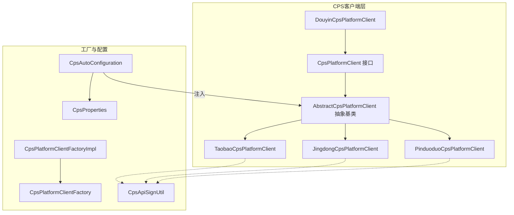
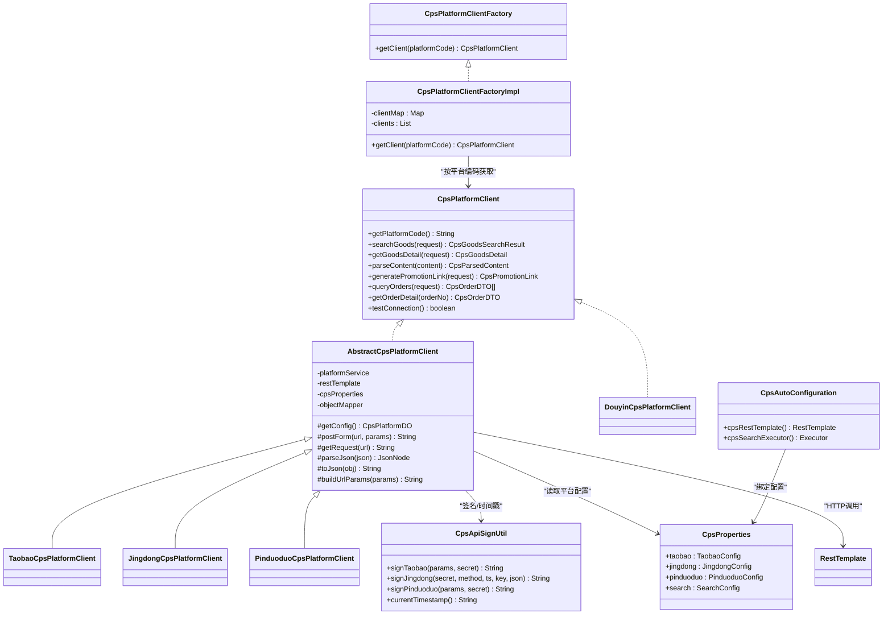
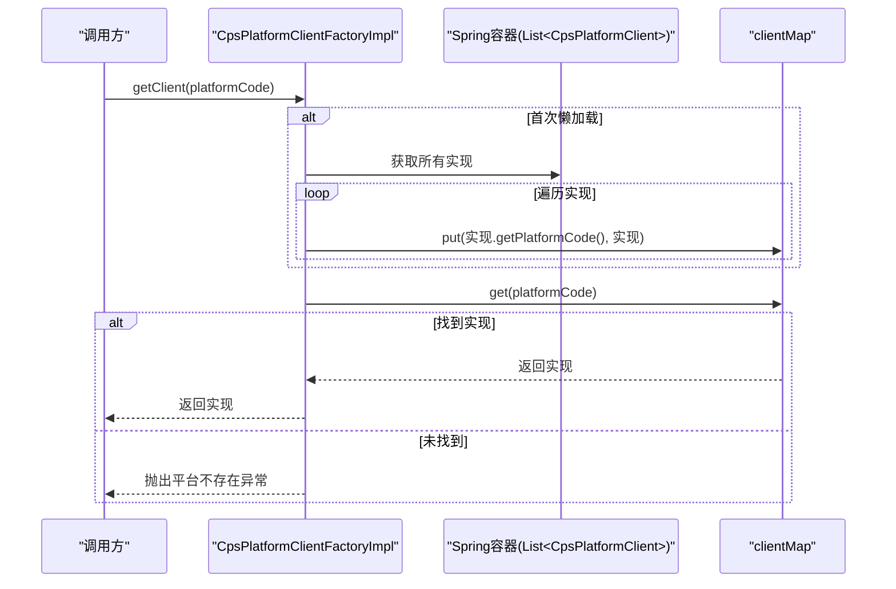
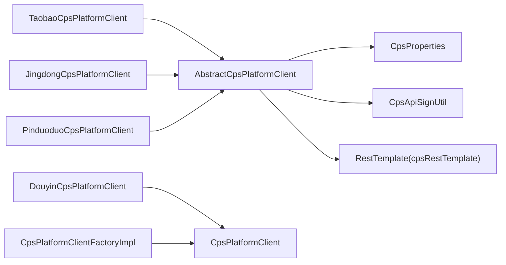

# 插件机制与适配器模式

<cite>
**本文引用的文件**
- [AbstractCpsPlatformClient.java](file://yudao-module-cps/yudao-module-cps-biz/src/main/java/cn/zhijian/cps/client/AbstractCpsPlatformClient.java)
- [CpsPlatformClient.java](file://yudao-module-cps/yudao-module-cps-biz/src/main/java/cn/zhijian/cps/client/CpsPlatformClient.java)
- [TaobaoCpsPlatformClient.java](file://yudao-module-cps/yudao-module-cps-biz/src/main/java/cn/zhijian/cps/client/TaobaoCpsPlatformClient.java)
- [JingdongCpsPlatformClient.java](file://yudao-module-cps/yudao-module-cps-biz/src/main/java/cn/zhijian/cps/client/JingdongCpsPlatformClient.java)
- [PinduoduoCpsPlatformClient.java](file://yudao-module-cps/yudao-module-cps-biz/src/main/java/cn/zhijian/cps/client/PinduoduoCpsPlatformClient.java)
- [DouyinCpsPlatformClient.java](file://yudao-module-cps/yudao-module-cps-biz/src/main/java/cn/zhijian/cps/client/DouyinCpsPlatformClient.java)
- [CpsPlatformClientFactory.java](file://yudao-module-cps/yudao-module-cps-biz/src/main/java/cn/zhijian/cps/service/CpsPlatformClientFactory.java)
- [CpsPlatformClientFactoryImpl.java](file://yudao-module-cps/yudao-module-cps-biz/src/main/java/cn/zhijian/cps/service/CpsPlatformClientFactoryImpl.java)
- [CpsAutoConfiguration.java](file://yudao-module-cps/yudao-module-cps-biz/src/main/java/cn/zhijian/cps/config/CpsAutoConfiguration.java)
- [CpsProperties.java](file://yudao-module-cps/yudao-module-cps-biz/src/main/java/cn/zhijian/cps/config/CpsProperties.java)
- [CpsApiSignUtil.java](file://yudao-module-cps/yudao-module-cps-biz/src/main/java/cn/zhijian/cps/client/util/CpsApiSignUtil.java)
</cite>

## 目录
1. [简介](#简介)
2. [项目结构](#项目结构)
3. [核心组件](#核心组件)
4. [架构总览](#架构总览)
5. [详细组件分析](#详细组件分析)
6. [依赖分析](#依赖分析)
7. [性能考虑](#性能考虑)
8. [故障排查指南](#故障排查指南)
9. [结论](#结论)
10. [附录：插件开发与接入指南](#附录插件开发与接入指南)

## 简介
本文件面向AgenticCPS系统的“插件机制与适配器模式”，系统性阐述CPS平台适配器设计、SPI式插件加载、配置管理、异常处理与错误恢复策略，并给出新平台接入的完整指南。通过对现有淘宝、京东、拼多多、抖音适配器的实现对比，帮助读者快速理解如何以最小成本接入新的CPS平台。

## 项目结构
CPS模块采用“接口 + 抽象基类 + 多实现 + 工厂 + 配置”的分层设计：
- 接口层：统一对外能力契约
- 抽象基类：封装通用HTTP调用、签名、解析、参数构建等
- 平台实现：针对不同联盟平台的差异化实现
- 工厂层：基于Spring SPI的懒加载与实例选择
- 配置层：集中管理各平台的AppKey/AppSecret、默认推广位、API网关等

图示来源
- [CpsPlatformClient.java:11-66](file://yudao-module-cps/yudao-module-cps-biz/src/main/java/cn/zhijian/cps/client/CpsPlatformClient.java#L11-L66)
- [AbstractCpsPlatformClient.java:26-144](file://yudao-module-cps/yudao-module-cps-biz/src/main/java/cn/zhijian/cps/client/AbstractCpsPlatformClient.java#L26-L144)
- [TaobaoCpsPlatformClient.java:21-468](file://yudao-module-cps/yudao-module-cps-biz/src/main/java/cn/zhijian/cps/client/TaobaoCpsPlatformClient.java#L21-L468)
- [JingdongCpsPlatformClient.java:21-503](file://yudao-module-cps/yudao-module-cps-biz/src/main/java/cn/zhijian/cps/client/JingdongCpsPlatformClient.java#L21-L503)
- [PinduoduoCpsPlatformClient.java:21-469](file://yudao-module-cps/yudao-module-cps-biz/src/main/java/cn/zhijian/cps/client/PinduoduoCpsPlatformClient.java#L21-L469)
- [DouyinCpsPlatformClient.java:14-65](file://yudao-module-cps/yudao-module-cps-biz/src/main/java/cn/zhijian/cps/client/DouyinCpsPlatformClient.java#L14-L65)
- [CpsPlatformClientFactory.java:8-18](file://yudao-module-cps/yudao-module-cps-biz/src/main/java/cn/zhijian/cps/service/CpsPlatformClientFactory.java#L8-L18)
- [CpsPlatformClientFactoryImpl.java:20-42](file://yudao-module-cps/yudao-module-cps-biz/src/main/java/cn/zhijian/cps/service/CpsPlatformClientFactoryImpl.java#L20-L42)
- [CpsAutoConfiguration.java:17-55](file://yudao-module-cps/yudao-module-cps-biz/src/main/java/cn/zhijian/cps/config/CpsAutoConfiguration.java#L17-L55)
- [CpsProperties.java:10-115](file://yudao-module-cps/yudao-module-cps-biz/src/main/java/cn/zhijian/cps/config/CpsProperties.java#L10-L115)
- [CpsApiSignUtil.java:15-123](file://yudao-module-cps/yudao-module-cps-biz/src/main/java/cn/zhijian/cps/client/util/CpsApiSignUtil.java#L15-L123)

章节来源
- [CpsPlatformClient.java:11-66](file://yudao-module-cps/yudao-module-cps-biz/src/main/java/cn/zhijian/cps/client/CpsPlatformClient.java#L11-L66)
- [AbstractCpsPlatformClient.java:26-144](file://yudao-module-cps/yudao-module-cps-biz/src/main/java/cn/zhijian/cps/client/AbstractCpsPlatformClient.java#L26-L144)
- [CpsPlatformClientFactoryImpl.java:20-42](file://yudao-module-cps/yudao-module-cps-biz/src/main/java/cn/zhijian/cps/service/CpsPlatformClientFactoryImpl.java#L20-L42)
- [CpsAutoConfiguration.java:17-55](file://yudao-module-cps/yudao-module-cps-biz/src/main/java/cn/zhijian/cps/config/CpsAutoConfiguration.java#L17-L55)
- [CpsProperties.java:10-115](file://yudao-module-cps/yudao-module-cps-biz/src/main/java/cn/zhijian/cps/config/CpsProperties.java#L10-L115)
- [CpsApiSignUtil.java:15-123](file://yudao-module-cps/yudao-module-cps-biz/src/main/java/cn/zhijian/cps/client/util/CpsApiSignUtil.java#L15-L123)

## 核心组件
- 统一接口：定义平台能力清单（搜索、详情、解析、推广链接、订单查询/详情、连通性测试）
- 抽象基类：封装HTTP调用、JSON解析、URL参数拼装、签名工具调用、RestTemplate注入等
- 平台实现：淘宝（TOP）、京东（JOS）、拼多多（PDD Pop）、抖音（预留扩展）
- 工厂与SPI：基于Spring容器收集所有实现，懒加载到Map，按平台编码获取
- 配置与签名：集中配置各平台参数；统一签名工具支持三大平台

章节来源
- [CpsPlatformClient.java:11-66](file://yudao-module-cps/yudao-module-cps-biz/src/main/java/cn/zhijian/cps/client/CpsPlatformClient.java#L11-L66)
- [AbstractCpsPlatformClient.java:26-144](file://yudao-module-cps/yudao-module-cps-biz/src/main/java/cn/zhijian/cps/client/AbstractCpsPlatformClient.java#L26-L144)
- [CpsPlatformClientFactoryImpl.java:20-42](file://yudao-module-cps/yudao-module-cps-biz/src/main/java/cn/zhijian/cps/service/CpsPlatformClientFactoryImpl.java#L20-L42)
- [CpsProperties.java:10-115](file://yudao-module-cps/yudao-module-cps-biz/src/main/java/cn/zhijian/cps/config/CpsProperties.java#L10-L115)
- [CpsApiSignUtil.java:15-123](file://yudao-module-cps/yudao-module-cps-biz/src/main/java/cn/zhijian/cps/client/util/CpsApiSignUtil.java#L15-L123)

## 架构总览
下图展示“接口 + 抽象基类 + 多实现 + 工厂 + 配置”的交互关系，以及HTTP调用与签名流程。

图示来源
- [CpsPlatformClient.java:11-66](file://yudao-module-cps/yudao-module-cps-biz/src/main/java/cn/zhijian/cps/client/CpsPlatformClient.java#L11-L66)
- [AbstractCpsPlatformClient.java:26-144](file://yudao-module-cps/yudao-module-cps-biz/src/main/java/cn/zhijian/cps/client/AbstractCpsPlatformClient.java#L26-L144)
- [TaobaoCpsPlatformClient.java:21-468](file://yudao-module-cps/yudao-module-cps-biz/src/main/java/cn/zhijian/cps/client/TaobaoCpsPlatformClient.java#L21-L468)
- [JingdongCpsPlatformClient.java:21-503](file://yudao-module-cps/yudao-module-cps-biz/src/main/java/cn/zhijian/cps/client/JingdongCpsPlatformClient.java#L21-L503)
- [PinduoduoCpsPlatformClient.java:21-469](file://yudao-module-cps/yudao-module-cps-biz/src/main/java/cn/zhijian/cps/client/PinduoduoCpsPlatformClient.java#L21-L469)
- [DouyinCpsPlatformClient.java:14-65](file://yudao-module-cps/yudao-module-cps-biz/src/main/java/cn/zhijian/cps/client/DouyinCpsPlatformClient.java#L14-L65)
- [CpsPlatformClientFactory.java:8-18](file://yudao-module-cps/yudao-module-cps-biz/src/main/java/cn/zhijian/cps/service/CpsPlatformClientFactory.java#L8-L18)
- [CpsPlatformClientFactoryImpl.java:20-42](file://yudao-module-cps/yudao-module-cps-biz/src/main/java/cn/zhijian/cps/service/CpsPlatformClientFactoryImpl.java#L20-L42)
- [CpsAutoConfiguration.java:17-55](file://yudao-module-cps/yudao-module-cps-biz/src/main/java/cn/zhijian/cps/config/CpsAutoConfiguration.java#L17-L55)
- [CpsProperties.java:10-115](file://yudao-module-cps/yudao-module-cps-biz/src/main/java/cn/zhijian/cps/config/CpsProperties.java#L10-L115)
- [CpsApiSignUtil.java:15-123](file://yudao-module-cps/yudao-module-cps-biz/src/main/java/cn/zhijian/cps/client/util/CpsApiSignUtil.java#L15-L123)

## 详细组件分析

### 抽象基类：AbstractCpsPlatformClient
- 职责
  - 注入平台服务、RestTemplate、CPS配置
  - 提供HTTP GET/POST表单封装、JSON解析、对象序列化、URL参数拼装
  - 通过平台服务获取当前平台配置（按平台编码）
- 设计要点
  - 使用RestTemplate进行HTTP调用，异常统一记录日志并返回空值
  - JSON解析失败、序列化失败均记录日志并兜底
  - 通过CpsApiSignUtil统一生成签名，避免重复逻辑

章节来源
- [AbstractCpsPlatformClient.java:26-144](file://yudao-module-cps/yudao-module-cps-biz/src/main/java/cn/zhijian/cps/client/AbstractCpsPlatformClient.java#L26-L144)

### 接口：CpsPlatformClient
- 规范统一能力边界：平台编码、商品搜索、详情、内容解析、推广链接、订单查询/详情、连通性测试
- 便于未来扩展更多平台（如DouyinCpsPlatformClient）

章节来源
- [CpsPlatformClient.java:11-66](file://yudao-module-cps/yudao-module-cps-biz/src/main/java/cn/zhijian/cps/client/CpsPlatformClient.java#L11-L66)

### 平台实现对比：淘宝、京东、拼多多、抖音
- 淘宝（TOP协议）
  - 方法命名与参数：使用taobao前缀的方法名，参数包含method/app_key/timestamp/format/v/sign_method等
  - 口令解析：支持淘口令解析API与URL直抽
  - 订单状态映射：根据tk_status映射到paid/received/invalid/settled
- 京东（JOS协议）
  - 参数结构：param_json整体传参，method/app_key/timestamp/format/v/sign/sign_method
  - 短链处理：对u.jd.com短链做一次HTTP跳转解析
  - 订单状态映射：根据validCode映射到paid/received/settled/invalid
- 拼多多（PDD Pop）
  - 参数结构：type/client_id/timestamp/data_type，价格单位为分，需转换为元
  - 短链处理：对p.pinduoduo.com/yangkeduo.com短链做一次HTTP跳转解析
  - 订单状态映射：根据order_status映射到paid/received/settled/refunded/invalid
- 抖音（预留）
  - 当前为空实现，便于后续接入

章节来源
- [TaobaoCpsPlatformClient.java:21-468](file://yudao-module-cps/yudao-module-cps-biz/src/main/java/cn/zhijian/cps/client/TaobaoCpsPlatformClient.java#L21-L468)
- [JingdongCpsPlatformClient.java:21-503](file://yudao-module-cps/yudao-module-cps-biz/src/main/java/cn/zhijian/cps/client/JingdongCpsPlatformClient.java#L21-L503)
- [PinduoduoCpsPlatformClient.java:21-469](file://yudao-module-cps/yudao-module-cps-biz/src/main/java/cn/zhijian/cps/client/PinduoduoCpsPlatformClient.java#L21-L469)
- [DouyinCpsPlatformClient.java:14-65](file://yudao-module-cps/yudao-module-cps-biz/src/main/java/cn/zhijian/cps/client/DouyinCpsPlatformClient.java#L14-L65)

### 工厂与SPI：CpsPlatformClientFactory
- 作用
  - 懒加载：首次调用时扫描容器内所有CpsPlatformClient实现，按平台编码注册到Map
  - 安全访问：未找到平台编码时抛出业务异常
- SPI机制
  - 通过Spring容器收集实现（如@Component注解），无需手动维护注册表
  - 支持运行时新增实现（只要实现CpsPlatformClient并被Spring扫描）

图示来源
- [CpsPlatformClientFactoryImpl.java:20-42](file://yudao-module-cps/yudao-module-cps-biz/src/main/java/cn/zhijian/cps/service/CpsPlatformClientFactoryImpl.java#L20-L42)

章节来源
- [CpsPlatformClientFactory.java:8-18](file://yudao-module-cps/yudao-module-cps-biz/src/main/java/cn/zhijian/cps/service/CpsPlatformClientFactory.java#L8-L18)
- [CpsPlatformClientFactoryImpl.java:20-42](file://yudao-module-cps/yudao-module-cps-biz/src/main/java/cn/zhijian/cps/service/CpsPlatformClientFactoryImpl.java#L20-L42)

### 配置与签名：CpsProperties 与 CpsApiSignUtil
- 配置项
  - 淘宝：appKey、appSecret、apiUrl、defaultAdzoneId
  - 京东：appKey、appSecret、apiUrl、defaultAdzoneId
  - 拼多多：clientId、clientSecret、apiUrl、defaultPid
  - 搜索：parallelTimeout、defaultPageSize
- 签名工具
  - 提供三种签名方法：淘宝TOP、京东JOS、拼多多Pop
  - 统一MD5摘要计算与时间戳生成

章节来源
- [CpsProperties.java:10-115](file://yudao-module-cps/yudao-module-cps-biz/src/main/java/cn/zhijian/cps/config/CpsProperties.java#L10-L115)
- [CpsApiSignUtil.java:15-123](file://yudao-module-cps/yudao-module-cps-biz/src/main/java/cn/zhijian/cps/client/util/CpsApiSignUtil.java#L15-L123)

### HTTP与线程池：CpsAutoConfiguration
- RestTemplate
  - 使用OkHttp3ClientHttpRequestFactory，设置连接/读/写超时与重试
  - Bean名称为“cpsRestTemplate”，在抽象基类中按限定名注入
- 搜索线程池
  - 用于多平台并行搜索，可配置核心/最大线程、队列容量、优雅关闭等待时间

章节来源
- [CpsAutoConfiguration.java:17-55](file://yudao-module-cps/yudao-module-cps-biz/src/main/java/cn/zhijian/cps/config/CpsAutoConfiguration.java#L17-L55)

## 依赖分析
- 组件耦合
  - 平台实现依赖抽象基类（继承关系），复用HTTP与解析逻辑
  - 工厂依赖接口（多态），通过容器收集实现
  - 抽象基类依赖配置、签名工具、RestTemplate
- 外部依赖
  - Spring容器（@Component、@Qualifier、RestTemplate）
  - Jackson（JSON解析/序列化）
  - OkHttp3（HTTP客户端）
- 循环依赖
  - 未发现循环依赖：接口/抽象基类/实现/工厂/配置分层清晰

图示来源
- [AbstractCpsPlatformClient.java:26-144](file://yudao-module-cps/yudao-module-cps-biz/src/main/java/cn/zhijian/cps/client/AbstractCpsPlatformClient.java#L26-L144)
- [TaobaoCpsPlatformClient.java:21-468](file://yudao-module-cps/yudao-module-cps-biz/src/main/java/cn/zhijian/cps/client/TaobaoCpsPlatformClient.java#L21-L468)
- [JingdongCpsPlatformClient.java:21-503](file://yudao-module-cps/yudao-module-cps-biz/src/main/java/cn/zhijian/cps/client/JingdongCpsPlatformClient.java#L21-L503)
- [PinduoduoCpsPlatformClient.java:21-469](file://yudao-module-cps/yudao-module-cps-biz/src/main/java/cn/zhijian/cps/client/PinduoduoCpsPlatformClient.java#L21-L469)
- [DouyinCpsPlatformClient.java:14-65](file://yudao-module-cps/yudao-module-cps-biz/src/main/java/cn/zhijian/cps/client/DouyinCpsPlatformClient.java#L14-L65)
- [CpsPlatformClientFactoryImpl.java:20-42](file://yudao-module-cps/yudao-module-cps-biz/src/main/java/cn/zhijian/cps/service/CpsPlatformClientFactoryImpl.java#L20-L42)
- [CpsAutoConfiguration.java:17-55](file://yudao-module-cps/yudao-module-cps-biz/src/main/java/cn/zhijian/cps/config/CpsAutoConfiguration.java#L17-L55)
- [CpsProperties.java:10-115](file://yudao-module-cps/yudao-module-cps-biz/src/main/java/cn/zhijian/cps/config/CpsProperties.java#L10-L115)
- [CpsApiSignUtil.java:15-123](file://yudao-module-cps/yudao-module-cps-biz/src/main/java/cn/zhijian/cps/client/util/CpsApiSignUtil.java#L15-L123)

## 性能考虑
- HTTP调用
  - 使用OkHttp3ClientHttpRequestFactory，合理设置超时，避免阻塞
  - 对GET/POST两类调用分别封装，减少重复代码
- 并行搜索
  - 提供独立线程池，控制并发度与队列长度，避免资源耗尽
- JSON解析
  - 统一使用Jackson，异常捕获并记录，避免中断主流程
- 签名与时间戳
  - 统一生成，避免重复计算

章节来源
- [CpsAutoConfiguration.java:17-55](file://yudao-module-cps/yudao-module-cps-biz/src/main/java/cn/zhijian/cps/config/CpsAutoConfiguration.java#L17-L55)
- [AbstractCpsPlatformClient.java:26-144](file://yudao-module-cps/yudao-module-cps-biz/src/main/java/cn/zhijian/cps/client/AbstractCpsPlatformClient.java#L26-L144)

## 故障排查指南
- 网络异常
  - 现象：postForm/getRequest返回null
  - 排查：检查API网关地址、网络连通性、超时配置
  - 参考：[AbstractCpsPlatformClient.java:54-96](file://yudao-module-cps/yudao-module-cps-biz/src/main/java/cn/zhijian/cps/client/AbstractCpsPlatformClient.java#L54-L96)
- 签名错误
  - 现象：平台返回签名错误或业务错误
  - 排查：核对参数顺序、编码、时间戳格式；确认secret正确
  - 参考：[CpsApiSignUtil.java:29-87](file://yudao-module-cps/yudao-module-cps-biz/src/main/java/cn/zhijian/cps/client/util/CpsApiSignUtil.java#L29-L87)
- JSON解析失败
  - 现象：parseJson返回null
  - 排查：检查响应体格式、字符集、字段路径
  - 参考：[AbstractCpsPlatformClient.java:101-111](file://yudao-module-cps/yudao-module-cps-biz/src/main/java/cn/zhijian/cps/client/AbstractCpsPlatformClient.java#L101-L111)
- 平台不存在
  - 现象：工厂按平台编码获取失败
  - 排查：确认平台编码与实现一致、Spring已扫描到实现
  - 参考：[CpsPlatformClientFactoryImpl.java:35-40](file://yudao-module-cps/yudao-module-cps-biz/src/main/java/cn/zhijian/cps/service/CpsPlatformClientFactoryImpl.java#L35-L40)
- 连通性测试
  - 各平台实现提供testConnection，优先调用基础可用接口验证
  - 参考：[TaobaoCpsPlatformClient.java:277-301](file://yudao-module-cps/yudao-module-cps-biz/src/main/java/cn/zhijian/cps/client/TaobaoCpsPlatformClient.java#L277-L301)，[JingdongCpsPlatformClient.java:272-290](file://yudao-module-cps/yudao-module-cps-biz/src/main/java/cn/zhijian/cps/client/JingdongCpsPlatformClient.java#L272-L290)，[PinduoduoCpsPlatformClient.java:257-279](file://yudao-module-cps/yudao-module-cps-biz/src/main/java/cn/zhijian/cps/client/PinduoduoCpsPlatformClient.java#L257-L279)

## 结论
该系统通过“接口 + 抽象基类 + 多实现 + 工厂 + 配置 + 签名工具”的组合，实现了CPS平台的高扩展与低耦合。抽象基类封装了HTTP、签名、解析等共性逻辑，平台实现仅关注差异化API细节；工厂通过SPI懒加载实现，便于新增平台；配置与线程池提供了良好的可运维性。现有淘宝、京东、拼多多、抖音适配器展示了不同协议风格下的最佳实践，为新平台接入提供了清晰模板。

## 附录：插件开发与接入指南

### 一、新平台接入步骤
1. 新建实现类
   - 实现CpsPlatformClient接口，或继承AbstractCpsPlatformClient以复用HTTP/解析逻辑
   - 在类上添加@Component，确保被Spring扫描
   - 实现getPlatformCode，返回唯一平台编码（如“xigua”）
   - 实现搜索、详情、解析、推广链接、订单查询/详情、连通性测试等方法
   - 参考：[CpsPlatformClient.java:11-66](file://yudao-module-cps/yudao-module-cps-biz/src/main/java/cn/zhijian/cps/client/CpsPlatformClient.java#L11-L66)，[AbstractCpsPlatformClient.java:26-144](file://yudao-module-cps/yudao-module-cps-biz/src/main/java/cn/zhijian/cps/client/AbstractCpsPlatformClient.java#L26-L144)
2. 配置平台参数
   - 在CpsProperties中新增配置类（如XiguaConfig），包含appKey/appSecret、apiUrl、默认推广位等
   - 在application.yaml中按yudao.cps.xigua.*配置
   - 参考：[CpsProperties.java:10-115](file://yudao-module-cps/yudao-module-cps-biz/src/main/java/cn/zhijian/cps/config/CpsProperties.java#L10-L115)
3. 签名与时间戳
   - 若平台签名规则与现有三种不同，可在CpsApiSignUtil中新增签名方法，或在实现类中自定义签名
   - 参考：[CpsApiSignUtil.java:15-123](file://yudao-module-cps/yudao-module-cps-biz/src/main/java/cn/zhijian/cps/client/util/CpsApiSignUtil.java#L15-L123)
4. HTTP调用
   - 如需自定义HTTP行为，可在实现类中直接使用RestTemplate或自定义客户端
   - 参考：[CpsAutoConfiguration.java:17-55](file://yudao-module-cps/yudao-module-cps-biz/src/main/java/cn/zhijian/cps/config/CpsAutoConfiguration.java#L17-L55)
5. 工厂与SPI
   - 不需要额外注册，Spring会自动收集实现；可通过工厂按平台编码获取
   - 参考：[CpsPlatformClientFactoryImpl.java:20-42](file://yudao-module-cps/yudao-module-cps-biz/src/main/java/cn/zhijian/cps/service/CpsPlatformClientFactoryImpl.java#L20-L42)
6. 连通性测试
   - 实现testConnection，优先调用平台可用的基础接口
   - 参考：[TaobaoCpsPlatformClient.java:277-301](file://yudao-module-cps/yudao-module-cps-biz/src/main/java/cn/zhijian/cps/client/TaobaoCpsPlatformClient.java#L277-L301)

### 二、接口规范与数据模型
- 统一请求/响应对象：CpsGoodsSearchRequest、CpsGoodsDetailRequest、CpsParsedContent、CpsPromotionLinkRequest、CpsOrderQueryRequest、CpsGoodsDetail、CpsOrderDTO
- 字段约定：平台编码、商品ID、标题、图片、价格、券金额、佣金率/金额、订单状态、时间字段等
- 参考：[CpsPlatformClient.java:11-66](file://yudao-module-cps/yudao-module-cps-biz/src/main/java/cn/zhijian/cps/client/CpsPlatformClient.java#L11-L66)

### 三、测试方法
- 单元测试建议
  - Mock RestTemplate，验证HTTP参数构造、签名生成、JSON解析路径
  - 验证异常分支：空响应、解析失败、签名错误
- 集成测试建议
  - 使用testConnection验证平台连通性
  - 调用真实接口进行端到端验证（注意沙箱环境）

### 四、部署流程
- 配置平台参数（密钥、网关、默认推广位）
- 打包并启动服务，确认Spring扫描到新实现
- 通过工厂按平台编码调用，观察日志与指标

### 五、异常处理与错误恢复
- 网络异常：记录日志并返回空/默认值，避免中断主流程
- API限流/错误：解析错误响应，必要时重试或降级
- 数据解析错误：捕获异常并记录，返回空对象或默认值
- 参考：[AbstractCpsPlatformClient.java:54-144](file://yudao-module-cps/yudao-module-cps-biz/src/main/java/cn/zhijian/cps/client/AbstractCpsPlatformClient.java#L54-L144)