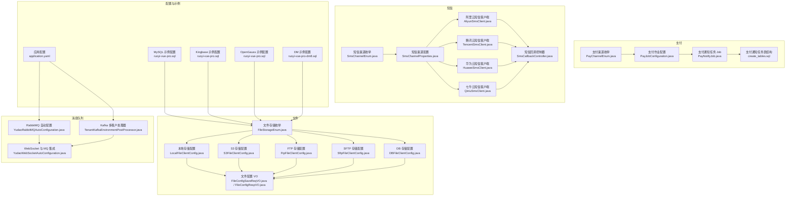
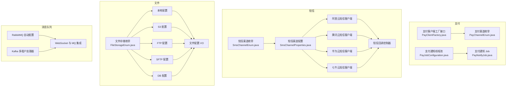
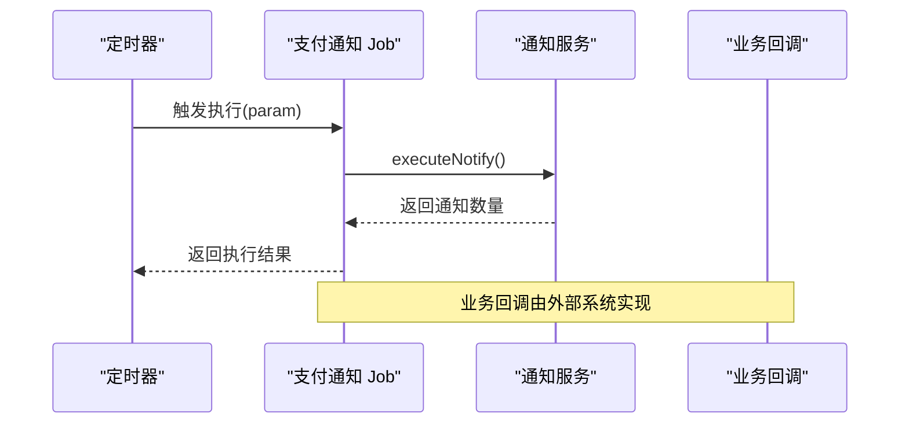
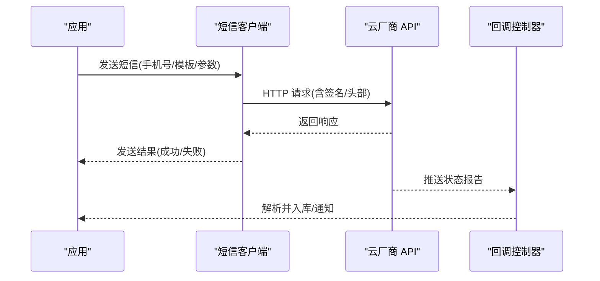
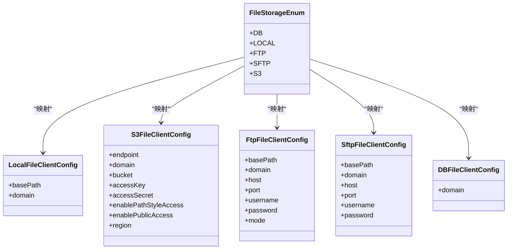
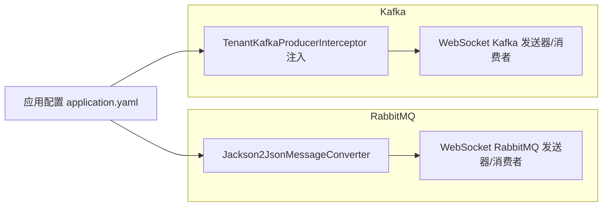
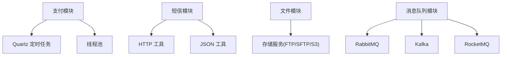

# 第三方服务集成

<cite>
**本文引用的文件**
- [支付渠道枚举 PayChannelEnum.java](file://yudao-module-pay/src/main/java/cn/iocoder/yudao/module/pay/enums/PayChannelEnum.java)
- [支付作业配置 PayJobConfiguration.java](file://yudao-module-pay/src/main/java/cn/iocoder/yudao/module/pay/framework/job/config/PayJobConfiguration.java)
- [支付通知任务表结构 create_tables.sql](file://yudao-module-pay/src/test/resources/sql/create_tables.sql)
- [支付通知任务 Job PayNotifyJob.java](file://yudao-module-pay/src/main/java/cn/iocoder/yudao/module/pay/job/notify/PayNotifyJob.java)
- [短信渠道枚举 SmsChannelEnum.java](file://yudao-module-system/src/main/java/cn/iocoder/yudao/module/system/framework/sms/core/enums/SmsChannelEnum.java)
- [短信渠道配置 SmsChannelProperties.java](file://yudao-module-system/src/main/java/cn/iocoder/yudao/module/system/framework/sms/core/property/SmsChannelProperties.java)
- [阿里云短信客户端 AliyunSmsClient.java](file://yudao-module-system/src/main/java/cn/iocoder/yudao/module/system/framework/sms/core/client/impl/AliyunSmsClient.java)
- [腾讯云短信客户端 TencentSmsClient.java](file://yudao-module-system/src/main/java/cn/iocoder/yudao/module/system/framework/sms/core/client/impl/TencentSmsClient.java)
- [华为云短信客户端 HuaweiSmsClient.java](file://yudao-module-system/src/main/java/cn/iocoder/yudao/module/system/framework/sms/core/client/impl/HuaweiSmsClient.java)
- [七牛云短信客户端 QiniuSmsClient.java](file://yudao-module-system/src/main/java/cn/iocoder/yudao/module/system/framework/sms/core/client/impl/QiniuSmsClient.java)
- [短信回调控制器 SmsCallbackController.java](file://yudao-module-system/src/main/java/cn/iocoder/yudao/module/system/controller/admin/sms/SmsCallbackController.java)
- [文件存储枚举 FileStorageEnum.java](file://yudao-module-infra/src/main/java/cn/iocoder/yudao/module/infra/framework/file/core/enums/FileStorageEnum.java)
- [本地文件存储配置 LocalFileClientConfig.java](file://yudao-module-infra/src/main/java/cn/iocoder/yudao/module/infra/framework/file/core/client/local/LocalFileClientConfig.java)
- [S3 文件存储配置 S3FileClientConfig.java](file://yudao-module-infra/src/main/java/cn/iocoder/yudao/module/infra/framework/file/core/client/s3/S3FileClientConfig.java)
- [FTP 文件存储配置 FtpFileClientConfig.java](file://yudao-module-infra/src/main/java/cn/iocoder/yudao/module/infra/framework/file/core/client/ftp/FtpFileClientConfig.java)
- [SFTP 文件存储配置 SftpFileClientConfig.java](file://yudao-module-infra/src/main/java/cn/iocoder/yudao/module/infra/framework/file/core/client/sftp/SftpFileClientConfig.java)
- [数据库文件存储配置 DBFileClientConfig.java](file://yudao-module-infra/src/main/java/cn/iocoder/yudao/module/infra/framework/file/core/client/db/DBFileClientConfig.java)
- [文件配置保存 VO FileConfigSaveReqVO.java](file://yudao-module-infra/src/main/java/cn/iocoder/yudao/module/infra/controller/admin/file/vo/config/FileConfigSaveReqVO.java)
- [文件配置响应 VO FileConfigRespVO.java](file://yudao-module-infra/src/main/java/cn/iocoder/yudao/module/infra/controller/admin/file/vo/config/FileConfigRespVO.java)
- [应用配置 application.yaml](file://yudao-server/src/main/resources/application.yaml)
- [RabbitMQ 自动配置 YudaoRabbitMQAutoConfiguration.java](file://yudao-framework/yudao-spring-boot-starter-mq/src/main/java/cn/iocoder/yudao/framework/mq/rabbitmq/config/YudaoRabbitMQAutoConfiguration.java)
- [多租户 Kafka 环境处理器 TenantKafkaEnvironmentPostProcessor.java](file://yudao-framework/yudao-spring-boot-starter-biz-tenant/src/main/java/cn/iocoder/yudao/framework/tenant/core/mq/kafka/TenantKafkaEnvironmentPostProcessor.java)
- [WebSocket 与 MQ 集成配置 YudaoWebSocketAutoConfiguration.java](file://yudao-framework/yudao-spring-boot-starter-websocket/src/main/java/cn/iocoder/yudao/framework/websocket/config/YudaoWebSocketAutoConfiguration.java)
- [MySQL 示例文件配置 ruoyi-vue-pro.sql](file://sql/mysql/ruoyi-vue-pro.sql)
- [Kingbase 示例文件配置 ruoyi-vue-pro.sql](file://sql/kingbase/ruoyi-vue-pro.sql)
- [OpenGauss 示例文件配置 ruoyi-vue-pro.sql](file://sql/opengauss/ruoyi-vue-pro.sql)
- [DM 示例文件配置 ruoyi-vue-pro-dm8.sql](file://sql/dm/ruoyi-vue-pro-dm8.sql)
</cite>

## 目录
1. [简介](#简介)
2. [项目结构](#项目结构)
3. [核心组件](#核心组件)
4. [架构总览](#架构总览)
5. [详细组件分析](#详细组件分析)
6. [依赖关系分析](#依赖关系分析)
7. [性能考虑](#性能考虑)
8. [故障排查指南](#故障排查指南)
9. [结论](#结论)
10. [附录](#附录)

## 简介
本文件面向 AgenticCPS 系统的第三方服务集成能力，系统性梳理并说明以下第三方服务类型的集成方式与最佳实践：
- 支付网关：支持微信支付、支付宝、钱包支付等渠道，覆盖多种支付形态（H5、小程序、App、扫码、条码等）
- 短信服务：支持阿里云、腾讯云、华为云、七牛云等多家服务商，包含发送、模板查询、回调解析
- 邮件服务：基于 SMTP 的邮箱账号配置，支持 SSL/STARTTLS 开关
- 文件存储：支持本地存储、FTP、SFTP、S3（兼容多家云厂商）等
- 消息队列：统一抽象支持 Redis、RabbitMQ、RocketMQ、Kafka 四类中间件

文档提供配置要点、认证机制、错误处理策略、监控与运维建议，并给出可直接定位到源码的路径指引，便于快速落地。

## 项目结构
围绕第三方服务集成的相关模块与文件分布如下：
- 支付模块：支付渠道枚举、支付作业配置、支付通知任务表结构、支付通知定时任务
- 短信模块：短信渠道枚举、短信渠道配置、各云厂商短信客户端、短信回调控制器
- 文件模块：文件存储枚举与各类存储配置类、文件配置的 VO
- 消息队列模块：RabbitMQ 自动配置、Kafka 多租户拦截器、WebSocket 与 MQ 集成
- 应用配置：消息队列相关全局配置项
- 示例数据：不同数据库下的文件存储配置示例

**图表来源**
- [支付渠道枚举 PayChannelEnum.java:1-68](file://yudao-module-pay/src/main/java/cn/iocoder/yudao/module/pay/enums/PayChannelEnum.java#L1-L68)
- [支付作业配置 PayJobConfiguration.java:1-28](file://yudao-module-pay/src/main/java/cn/iocoder/yudao/module/pay/framework/job/config/PayJobConfiguration.java#L1-L28)
- [支付通知任务表结构 create_tables.sql:124-148](file://yudao-module-pay/src/test/resources/sql/create_tables.sql#L124-L148)
- [支付通知任务 Job PayNotifyJob.java:1-31](file://yudao-module-pay/src/main/java/cn/iocoder/yudao/module/pay/job/notify/PayNotifyJob.java#L1-L31)
- [短信渠道枚举 SmsChannelEnum.java:1-38](file://yudao-module-system/src/main/java/cn/iocoder/yudao/module/system/framework/sms/core/enums/SmsChannelEnum.java#L1-L38)
- [短信渠道配置 SmsChannelProperties.java:1-53](file://yudao-module-system/src/main/java/cn/iocoder/yudao/module/system/framework/sms/core/property/SmsChannelProperties.java#L1-L53)
- [阿里云短信客户端 AliyunSmsClient.java:1-198](file://yudao-module-system/src/main/java/cn/iocoder/yudao/module/system/framework/sms/core/client/impl/AliyunSmsClient.java#L1-L198)
- [腾讯云短信客户端 TencentSmsClient.java:1-68](file://yudao-module-system/src/main/java/cn/iocoder/yudao/module/system/framework/sms/core/client/impl/TencentSmsClient.java#L1-L68)
- [华为云短信客户端 HuaweiSmsClient.java:62-89](file://yudao-module-system/src/main/java/cn/iocoder/yudao/module/system/framework/sms/core/client/impl/HuaweiSmsClient.java#L62-L89)
- [七牛云短信客户端 QiniuSmsClient.java:1-156](file://yudao-module-system/src/main/java/cn/iocoder/yudao/module/system/framework/sms/core/client/impl/QiniuSmsClient.java#L1-L156)
- [短信回调控制器 SmsCallbackController.java:31-65](file://yudao-module-system/src/main/java/cn/iocoder/yudao/module/system/controller/admin/sms/SmsCallbackController.java#L31-L65)
- [文件存储枚举 FileStorageEnum.java:1-56](file://yudao-module-infra/src/main/java/cn/iocoder/yudao/module/infra/framework/file/core/enums/FileStorageEnum.java#L1-L56)
- [本地文件存储配置 LocalFileClientConfig.java:1-31](file://yudao-module-infra/src/main/java/cn/iocoder/yudao/module/infra/framework/file/core/client/local/LocalFileClientConfig.java#L1-L31)
- [S3 文件存储配置 S3FileClientConfig.java:1-109](file://yudao-module-infra/src/main/java/cn/iocoder/yudao/module/infra/framework/file/core/client/s3/S3FileClientConfig.java#L1-L109)
- [FTP 文件存储配置 FtpFileClientConfig.java:1-59](file://yudao-module-infra/src/main/java/cn/iocoder/yudao/module/infra/framework/file/core/client/ftp/FtpFileClientConfig.java#L1-L59)
- [SFTP 文件存储配置 SftpFileClientConfig.java:1-52](file://yudao-module-infra/src/main/java/cn/iocoder/yudao/module/infra/framework/file/core/client/sftp/SftpFileClientConfig.java#L1-L52)
- [数据库文件存储配置 DBFileClientConfig.java:1-25](file://yudao-module-infra/src/main/java/cn/iocoder/yudao/module/infra/framework/file/core/client/db/DBFileClientConfig.java#L1-L25)
- [文件配置保存 VO FileConfigSaveReqVO.java:1-31](file://yudao-module-infra/src/main/java/cn/iocoder/yudao/module/infra/controller/admin/file/vo/config/FileConfigSaveReqVO.java#L1-L31)
- [文件配置响应 VO FileConfigRespVO.java:1-34](file://yudao-module-infra/src/main/java/cn/iocoder/yudao/module/infra/controller/admin/file/vo/config/FileConfigRespVO.java#L1-L34)
- [应用配置 application.yaml:120-134](file://yudao-server/src/main/resources/application.yaml#L120-L134)
- [RabbitMQ 自动配置 YudaoRabbitMQAutoConfiguration.java:1-28](file://yudao-framework/yudao-spring-boot-starter-mq/src/main/java/cn/iocoder/yudao/framework/mq/rabbitmq/config/YudaoRabbitMQAutoConfiguration.java#L1-L28)
- [多租户 Kafka 环境处理器 TenantKafkaEnvironmentPostProcessor.java:1-37](file://yudao-framework/yudao-spring-boot-starter-biz-tenant/src/main/java/cn/iocoder/yudao/framework/tenant/core/mq/kafka/TenantKafkaEnvironmentPostProcessor.java#L1-L37)
- [WebSocket 与 MQ 集成配置 YudaoWebSocketAutoConfiguration.java:122-152](file://yudao-framework/yudao-spring-boot-starter-websocket/src/main/java/cn/iocoder/yudao/framework/websocket/config/YudaoWebSocketAutoConfiguration.java#L122-L152)
- [MySQL 示例文件配置 ruoyi-vue-pro.sql:291-292](file://sql/mysql/ruoyi-vue-pro.sql#L291-L292)
- [Kingbase 示例文件配置 ruoyi-vue-pro.sql:483-489](file://sql/kingbase/ruoyi-vue-pro.sql#L483-L489)
- [OpenGauss 示例文件配置 ruoyi-vue-pro.sql:483-489](file://sql/opengauss/ruoyi-vue-pro.sql#L483-L489)
- [DM 示例文件配置 ruoyi-vue-pro-dm8.sql:406-409](file://sql/dm/ruoyi-vue-pro-dm8.sql#L406-L409)

**章节来源**
- [支付渠道枚举 PayChannelEnum.java:1-68](file://yudao-module-pay/src/main/java/cn/iocoder/yudao/module/pay/enums/PayChannelEnum.java#L1-L68)
- [短信渠道枚举 SmsChannelEnum.java:1-38](file://yudao-module-system/src/main/java/cn/iocoder/yudao/module/system/framework/sms/core/enums/SmsChannelEnum.java#L1-L38)
- [文件存储枚举 FileStorageEnum.java:1-56](file://yudao-module-infra/src/main/java/cn/iocoder/yudao/module/infra/framework/file/core/enums/FileStorageEnum.java#L1-L56)
- [应用配置 application.yaml:120-134](file://yudao-server/src/main/resources/application.yaml#L120-L134)

## 核心组件
- 支付网关
  - 渠道枚举：覆盖微信 JSAPI、小程序、App、Native、H5、付款码；支付宝 PC、Wap、App、扫码、条码；钱包支付等
  - 通知任务：定时扫描待通知记录，回调业务接口
  - 通知线程池：独立线程池保障通知并发与稳定性
- 短信服务
  - 渠道枚举：支持阿里云、腾讯云、华为云、七牛云
  - 渠道配置：包含签名、账号、密钥、回调地址等
  - 客户端实现：各云厂商的发送、模板查询、回调解析
  - 回调入口：统一接收各云厂商推送的状态报告
- 文件存储
  - 存储枚举：DB、本地、FTP、SFTP、S3
  - 配置类：针对每种存储的参数校验与约束
  - 配置 VO：用于管理后台的创建/修改与查询
- 消息队列
  - 统一抽象：Redis、RabbitMQ、RocketMQ、Kafka
  - RabbitMQ：Jackson2Json 序列化转换器
  - Kafka：多租户拦截器自动注入
  - WebSocket：支持通过 MQ 推送消息

**章节来源**
- [支付渠道枚举 PayChannelEnum.java:18-35](file://yudao-module-pay/src/main/java/cn/iocoder/yudao/module/pay/enums/PayChannelEnum.java#L18-L35)
- [支付作业配置 PayJobConfiguration.java:12-26](file://yudao-module-pay/src/main/java/cn/iocoder/yudao/module/pay/framework/job/config/PayJobConfiguration.java#L12-L26)
- [支付通知任务 Job PayNotifyJob.java:17-29](file://yudao-module-pay/src/main/java/cn/iocoder/yudao/module/pay/job/notify/PayNotifyJob.java#L17-L29)
- [短信渠道枚举 SmsChannelEnum.java:15-22](file://yudao-module-system/src/main/java/cn/iocoder/yudao/module/system/framework/sms/core/enums/SmsChannelEnum.java#L15-L22)
- [短信渠道配置 SmsChannelProperties.java:16-51](file://yudao-module-system/src/main/java/cn/iocoder/yudao/module/system/framework/sms/core/property/SmsChannelProperties.java#L16-L51)
- [阿里云短信客户端 AliyunSmsClient.java:37-49](file://yudao-module-system/src/main/java/cn/iocoder/yudao/module/system/framework/sms/core/client/impl/AliyunSmsClient.java#L37-L49)
- [腾讯云短信客户端 TencentSmsClient.java:34-58](file://yudao-module-system/src/main/java/cn/iocoder/yudao/module/system/framework/sms/core/client/impl/TencentSmsClient.java#L34-L58)
- [华为云短信客户端 HuaweiSmsClient.java:62-74](file://yudao-module-system/src/main/java/cn/iocoder/yudao/module/system/framework/sms/core/client/impl/HuaweiSmsClient.java#L62-L74)
- [七牛云短信客户端 QiniuSmsClient.java:34-42](file://yudao-module-system/src/main/java/cn/iocoder/yudao/module/system/framework/sms/core/client/impl/QiniuSmsClient.java#L34-L42)
- [短信回调控制器 SmsCallbackController.java:31-63](file://yudao-module-system/src/main/java/cn/iocoder/yudao/module/system/controller/admin/sms/SmsCallbackController.java#L31-L63)
- [文件存储枚举 FileStorageEnum.java:26-35](file://yudao-module-infra/src/main/java/cn/iocoder/yudao/module/infra/framework/file/core/enums/FileStorageEnum.java#L26-L35)
- [本地文件存储配置 LocalFileClientConfig.java:14-28](file://yudao-module-infra/src/main/java/cn/iocoder/yudao/module/infra/framework/file/core/client/local/LocalFileClientConfig.java#L14-L28)
- [S3 文件存储配置 S3FileClientConfig.java:17-106](file://yudao-module-infra/src/main/java/cn/iocoder/yudao/module/infra/framework/file/core/client/s3/S3FileClientConfig.java#L17-L106)
- [FTP 文件存储配置 FtpFileClientConfig.java:14-56](file://yudao-module-infra/src/main/java/cn/iocoder/yudao/module/infra/framework/file/core/client/ftp/FtpFileClientConfig.java#L14-L56)
- [SFTP 文件存储配置 SftpFileClientConfig.java:14-49](file://yudao-module-infra/src/main/java/cn/iocoder/yudao/module/infra/framework/file/core/client/sftp/SftpFileClientConfig.java#L14-L49)
- [数据库文件存储配置 DBFileClientConfig.java:14-22](file://yudao-module-infra/src/main/java/cn/iocoder/yudao/module/infra/framework/file/core/client/db/DBFileClientConfig.java#L14-L22)
- [文件配置保存 VO FileConfigSaveReqVO.java:10-26](file://yudao-module-infra/src/main/java/cn/iocoder/yudao/module/infra/controller/admin/file/vo/config/FileConfigSaveReqVO.java#L10-L26)
- [文件配置响应 VO FileConfigRespVO.java:9-26](file://yudao-module-infra/src/main/java/cn/iocoder/yudao/module/infra/controller/admin/file/vo/config/FileConfigRespVO.java#L9-L26)
- [RabbitMQ 自动配置 YudaoRabbitMQAutoConfiguration.java:15-26](file://yudao-framework/yudao-spring-boot-starter-mq/src/main/java/cn/iocoder/yudao/framework/mq/rabbitmq/config/YudaoRabbitMQAutoConfiguration.java#L15-L26)
- [多租户 Kafka 环境处理器 TenantKafkaEnvironmentPostProcessor.java:17-35](file://yudao-framework/yudao-spring-boot-starter-biz-tenant/src/main/java/cn/iocoder/yudao/framework/tenant/core/mq/kafka/TenantKafkaEnvironmentPostProcessor.java#L17-L35)
- [WebSocket 与 MQ 集成配置 YudaoWebSocketAutoConfiguration.java:122-152](file://yudao-framework/yudao-spring-boot-starter-websocket/src/main/java/cn/iocoder/yudao/framework/websocket/config/YudaoWebSocketAutoConfiguration.java#L122-L152)

## 架构总览
系统通过“统一抽象 + 多实现”的方式集成第三方服务，核心思想：
- 通过枚举/配置类定义服务能力边界与参数约束
- 通过客户端实现对接具体云厂商或中间件
- 通过定时任务/回调/配置中心等方式实现异步通知与运行时配置变更
- 通过消息队列实现解耦与扩展

**图表来源**
- [支付客户端工厂接口 PayClientFactory.java:1-29](file://yudao-module-pay/src/main/java/cn/iocoder/yudao/module/pay/framework/pay/core/client/PayClientFactory.java#L1-L29)
- [支付渠道枚举 PayChannelEnum.java:18-35](file://yudao-module-pay/src/main/java/cn/iocoder/yudao/module/pay/enums/PayChannelEnum.java#L18-L35)
- [支付作业配置 PayJobConfiguration.java:12-26](file://yudao-module-pay/src/main/java/cn/iocoder/yudao/module/pay/framework/job/config/PayJobConfiguration.java#L12-L26)
- [支付通知任务 Job PayNotifyJob.java:17-29](file://yudao-module-pay/src/main/java/cn/iocoder/yudao/module/pay/job/notify/PayNotifyJob.java#L17-L29)
- [短信渠道枚举 SmsChannelEnum.java:15-22](file://yudao-module-system/src/main/java/cn/iocoder/yudao/module/system/framework/sms/core/enums/SmsChannelEnum.java#L15-L22)
- [短信渠道配置 SmsChannelProperties.java:16-51](file://yudao-module-system/src/main/java/cn/iocoder/yudao/module/system/framework/sms/core/property/SmsChannelProperties.java#L16-L51)
- [阿里云短信客户端 AliyunSmsClient.java:37-49](file://yudao-module-system/src/main/java/cn/iocoder/yudao/module/system/framework/sms/core/client/impl/AliyunSmsClient.java#L37-L49)
- [腾讯云短信客户端 TencentSmsClient.java:34-58](file://yudao-module-system/src/main/java/cn/iocoder/yudao/module/system/framework/sms/core/client/impl/TencentSmsClient.java#L34-L58)
- [华为云短信客户端 HuaweiSmsClient.java:62-74](file://yudao-module-system/src/main/java/cn/iocoder/yudao/module/system/framework/sms/core/client/impl/HuaweiSmsClient.java#L62-L74)
- [七牛云短信客户端 QiniuSmsClient.java:34-42](file://yudao-module-system/src/main/java/cn/iocoder/yudao/module/system/framework/sms/core/client/impl/QiniuSmsClient.java#L34-L42)
- [短信回调控制器 SmsCallbackController.java:31-63](file://yudao-module-system/src/main/java/cn/iocoder/yudao/module/system/controller/admin/sms/SmsCallbackController.java#L31-L63)
- [文件存储枚举 FileStorageEnum.java:26-35](file://yudao-module-infra/src/main/java/cn/iocoder/yudao/module/infra/framework/file/core/enums/FileStorageEnum.java#L26-L35)
- [本地文件存储配置 LocalFileClientConfig.java:14-28](file://yudao-module-infra/src/main/java/cn/iocoder/yudao/module/infra/framework/file/core/client/local/LocalFileClientConfig.java#L14-L28)
- [S3 文件存储配置 S3FileClientConfig.java:17-106](file://yudao-module-infra/src/main/java/cn/iocoder/yudao/module/infra/framework/file/core/client/s3/S3FileClientConfig.java#L17-L106)
- [FTP 文件存储配置 FtpFileClientConfig.java:14-56](file://yudao-module-infra/src/main/java/cn/iocoder/yudao/module/infra/framework/file/core/client/ftp/FtpFileClientConfig.java#L14-L56)
- [SFTP 文件存储配置 SftpFileClientConfig.java:14-49](file://yudao-module-infra/src/main/java/cn/iocoder/yudao/module/infra/framework/file/core/client/sftp/SftpFileClientConfig.java#L14-L49)
- [数据库文件存储配置 DBFileClientConfig.java:14-22](file://yudao-module-infra/src/main/java/cn/iocoder/yudao/module/infra/framework/file/core/client/db/DBFileClientConfig.java#L14-L22)
- [文件配置保存 VO FileConfigSaveReqVO.java:10-26](file://yudao-module-infra/src/main/java/cn/iocoder/yudao/module/infra/controller/admin/file/vo/config/FileConfigSaveReqVO.java#L10-L26)
- [文件配置响应 VO FileConfigRespVO.java:9-26](file://yudao-module-infra/src/main/java/cn/iocoder/yudao/module/infra/controller/admin/file/vo/config/FileConfigRespVO.java#L9-L26)
- [RabbitMQ 自动配置 YudaoRabbitMQAutoConfiguration.java:15-26](file://yudao-framework/yudao-spring-boot-starter-mq/src/main/java/cn/iocoder/yudao/framework/mq/rabbitmq/config/YudaoRabbitMQAutoConfiguration.java#L15-L26)
- [多租户 Kafka 环境处理器 TenantKafkaEnvironmentPostProcessor.java:17-35](file://yudao-framework/yudao-spring-boot-starter-biz-tenant/src/main/java/cn/iocoder/yudao/framework/tenant/core/mq/kafka/TenantKafkaEnvironmentPostProcessor.java#L17-L35)
- [WebSocket 与 MQ 集成配置 YudaoWebSocketAutoConfiguration.java:122-152](file://yudao-framework/yudao-spring-boot-starter-websocket/src/main/java/cn/iocoder/yudao/framework/websocket/config/YudaoWebSocketAutoConfiguration.java#L122-L152)

## 详细组件分析

### 支付网关集成
- 支付渠道类型
  - 微信支付：JSAPI、小程序、App、Native、H5、付款码
  - 支付宝：PC 网站、Wap 网站、App、扫码、条码
  - 钱包支付
- 集成方式
  - 通过支付渠道枚举定义渠道编码，用于区分不同支付形态
  - 通过支付通知任务 Job 定时扫描待通知记录，回调业务线接口
  - 通过独立线程池处理通知，避免阻塞主流程
- 配置与表结构
  - 通知任务表包含下次通知时间、最后执行时间、通知次数、最大通知次数、回调地址等字段
- 错误处理
  - 通知失败重试至最大次数
  - 线程池拒绝策略采用调用方运行策略，确保不会丢弃通知

**图表来源**
- [支付通知任务 Job PayNotifyJob.java:24-29](file://yudao-module-pay/src/main/java/cn/iocoder/yudao/module/pay/job/notify/PayNotifyJob.java#L24-L29)
- [支付作业配置 PayJobConfiguration.java:14-26](file://yudao-module-pay/src/main/java/cn/iocoder/yudao/module/pay/framework/job/config/PayJobConfiguration.java#L14-L26)
- [支付通知任务表结构 create_tables.sql:124-137](file://yudao-module-pay/src/test/resources/sql/create_tables.sql#L124-L137)

**章节来源**
- [支付渠道枚举 PayChannelEnum.java:18-35](file://yudao-module-pay/src/main/java/cn/iocoder/yudao/module/pay/enums/PayChannelEnum.java#L18-L35)
- [支付通知任务 Job PayNotifyJob.java:17-29](file://yudao-module-pay/src/main/java/cn/iocoder/yudao/module/pay/job/notify/PayNotifyJob.java#L17-L29)
- [支付作业配置 PayJobConfiguration.java:12-26](file://yudao-module-pay/src/main/java/cn/iocoder/yudao/module/pay/framework/job/config/PayJobConfiguration.java#L12-L26)
- [支付通知任务表结构 create_tables.sql:124-148](file://yudao-module-pay/src/test/resources/sql/create_tables.sql#L124-L148)

### 短信服务集成
- 支持的短信服务商
  - 阿里云、腾讯云、华为云、七牛云
- 集成方式
  - 通过短信渠道枚举与配置类定义渠道编码、签名、账号、密钥、回调地址
  - 各云厂商客户端实现发送、模板查询、回调解析
  - 提供统一的回调入口，接收各云厂商推送的状态报告
- 认证机制
  - 阿里云：基于 HMAC-SHA256 的签名机制
  - 腾讯云：基于 SDK AppId 与签名的组合参数
  - 华为云：基于 apiKey 的 accessKeyId 与 sender 组合
  - 七牛云：基于 HMAC-SHA1 的签名机制
- 错误处理
  - 发送返回码判断与日志记录
  - 模板审核状态映射与异常处理
  - 回调解析统一为内部 DTO 结构

**图表来源**
- [阿里云短信客户端 AliyunSmsClient.java:51-72](file://yudao-module-system/src/main/java/cn/iocoder/yudao/module/system/framework/sms/core/client/impl/AliyunSmsClient.java#L51-L72)
- [腾讯云短信客户端 TencentSmsClient.java:34-58](file://yudao-module-system/src/main/java/cn/iocoder/yudao/module/system/framework/sms/core/client/impl/TencentSmsClient.java#L34-L58)
- [华为云短信客户端 HuaweiSmsClient.java:76-89](file://yudao-module-system/src/main/java/cn/iocoder/yudao/module/system/framework/sms/core/client/impl/HuaweiSmsClient.java#L76-L89)
- [七牛云短信客户端 QiniuSmsClient.java:44-65](file://yudao-module-system/src/main/java/cn/iocoder/yudao/module/system/framework/sms/core/client/impl/QiniuSmsClient.java#L44-L65)
- [短信回调控制器 SmsCallbackController.java:31-63](file://yudao-module-system/src/main/java/cn/iocoder/yudao/module/system/controller/admin/sms/SmsCallbackController.java#L31-L63)

**章节来源**
- [短信渠道枚举 SmsChannelEnum.java:15-22](file://yudao-module-system/src/main/java/cn/iocoder/yudao/module/system/framework/sms/core/enums/SmsChannelEnum.java#L15-L22)
- [短信渠道配置 SmsChannelProperties.java:16-51](file://yudao-module-system/src/main/java/cn/iocoder/yudao/module/system/framework/sms/core/property/SmsChannelProperties.java#L16-L51)
- [阿里云短信客户端 AliyunSmsClient.java:37-49](file://yudao-module-system/src/main/java/cn/iocoder/yudao/module/system/framework/sms/core/client/impl/AliyunSmsClient.java#L37-L49)
- [腾讯云短信客户端 TencentSmsClient.java:34-58](file://yudao-module-system/src/main/java/cn/iocoder/yudao/module/system/framework/sms/core/client/impl/TencentSmsClient.java#L34-L58)
- [华为云短信客户端 HuaweiSmsClient.java:62-74](file://yudao-module-system/src/main/java/cn/iocoder/yudao/module/system/framework/sms/core/client/impl/HuaweiSmsClient.java#L62-L74)
- [七牛云短信客户端 QiniuSmsClient.java:34-42](file://yudao-module-system/src/main/java/cn/iocoder/yudao/module/system/framework/sms/core/client/impl/QiniuSmsClient.java#L34-L42)
- [短信回调控制器 SmsCallbackController.java:31-63](file://yudao-module-system/src/main/java/cn/iocoder/yudao/module/system/controller/admin/sms/SmsCallbackController.java#L31-L63)

### 邮件服务集成
- 配置要点
  - SMTP 服务器域名、端口、SSL/STARTTLS 开关
  - 发件人邮箱、用户名、密码
- 模板与队列
  - 系统提供模板管理与发送队列能力（在相关模块中实现）
- 最佳实践
  - 建议使用专用发件账号与域名
  - 启用 SSL/STARTTLS 提升安全性
  - 对模板变量进行参数校验与占位符检查

**章节来源**
- [文件配置保存 VO FileConfigSaveReqVO.java:10-26](file://yudao-module-infra/src/main/java/cn/iocoder/yudao/module/infra/controller/admin/file/vo/config/FileConfigSaveReqVO.java#L10-L26)
- [文件配置响应 VO FileConfigRespVO.java:9-26](file://yudao-module-infra/src/main/java/cn/iocoder/yudao/module/infra/controller/admin/file/vo/config/FileConfigRespVO.java#L9-L26)

### 文件存储集成
- 支持的存储类型
  - DB：基于数据库的文件存储
  - 本地：本地磁盘路径与自定义域名
  - FTP：主机、端口、用户名、密码、连接模式、基础路径、域名
  - SFTP：主机、端口、用户名、密码、基础路径、域名
  - S3：节点地址、自定义域名、Bucket、AccessKey、AccessSecret、PathStyle 访问、公开访问、区域
- 配置校验
  - 各配置类均包含参数校验注解，确保必填项与格式正确
- 示例配置
  - MySQL/Kingbase/OpenGauss/DM 数据库中均包含示例文件存储配置，可直接导入使用

**图表来源**
- [文件存储枚举 FileStorageEnum.java:26-35](file://yudao-module-infra/src/main/java/cn/iocoder/yudao/module/infra/framework/file/core/enums/FileStorageEnum.java#L26-L35)
- [本地文件存储配置 LocalFileClientConfig.java:14-28](file://yudao-module-infra/src/main/java/cn/iocoder/yudao/module/infra/framework/file/core/client/local/LocalFileClientConfig.java#L14-L28)
- [S3 文件存储配置 S3FileClientConfig.java:17-106](file://yudao-module-infra/src/main/java/cn/iocoder/yudao/module/infra/framework/file/core/client/s3/S3FileClientConfig.java#L17-L106)
- [FTP 文件存储配置 FtpFileClientConfig.java:14-56](file://yudao-module-infra/src/main/java/cn/iocoder/yudao/module/infra/framework/file/core/client/ftp/FtpFileClientConfig.java#L14-L56)
- [SFTP 文件存储配置 SftpFileClientConfig.java:14-49](file://yudao-module-infra/src/main/java/cn/iocoder/yudao/module/infra/framework/file/core/client/sftp/SftpFileClientConfig.java#L14-L49)
- [数据库文件存储配置 DBFileClientConfig.java:14-22](file://yudao-module-infra/src/main/java/cn/iocoder/yudao/module/infra/framework/file/core/client/db/DBFileClientConfig.java#L14-L22)

**章节来源**
- [文件存储枚举 FileStorageEnum.java:26-35](file://yudao-module-infra/src/main/java/cn/iocoder/yudao/module/infra/framework/file/core/enums/FileStorageEnum.java#L26-L35)
- [本地文件存储配置 LocalFileClientConfig.java:14-28](file://yudao-module-infra/src/main/java/cn/iocoder/yudao/module/infra/framework/file/core/client/local/LocalFileClientConfig.java#L14-L28)
- [S3 文件存储配置 S3FileClientConfig.java:17-106](file://yudao-module-infra/src/main/java/cn/iocoder/yudao/module/infra/framework/file/core/client/s3/S3FileClientConfig.java#L17-L106)
- [FTP 文件存储配置 FtpFileClientConfig.java:14-56](file://yudao-module-infra/src/main/java/cn/iocoder/yudao/module/infra/framework/file/core/client/ftp/FtpFileClientConfig.java#L14-L56)
- [SFTP 文件存储配置 SftpFileClientConfig.java:14-49](file://yudao-module-infra/src/main/java/cn/iocoder/yudao/module/infra/framework/file/core/client/sftp/SftpFileClientConfig.java#L14-L49)
- [数据库文件存储配置 DBFileClientConfig.java:14-22](file://yudao-module-infra/src/main/java/cn/iocoder/yudao/module/infra/framework/file/core/client/db/DBFileClientConfig.java#L14-L22)
- [文件配置保存 VO FileConfigSaveReqVO.java:10-26](file://yudao-module-infra/src/main/java/cn/iocoder/yudao/module/infra/controller/admin/file/vo/config/FileConfigSaveReqVO.java#L10-L26)
- [文件配置响应 VO FileConfigRespVO.java:9-26](file://yudao-module-infra/src/main/java/cn/iocoder/yudao/module/infra/controller/admin/file/vo/config/FileConfigRespVO.java#L9-L26)
- [MySQL 示例文件配置 ruoyi-vue-pro.sql:291-292](file://sql/mysql/ruoyi-vue-pro.sql#L291-L292)
- [Kingbase 示例文件配置 ruoyi-vue-pro.sql:483-489](file://sql/kingbase/ruoyi-vue-pro.sql#L483-L489)
- [OpenGauss 示例文件配置 ruoyi-vue-pro.sql:483-489](file://sql/opengauss/ruoyi-vue-pro.sql#L483-L489)
- [DM 示例文件配置 ruoyi-vue-pro-dm8.sql:406-409](file://sql/dm/ruoyi-vue-pro-dm8.sql#L406-L409)

### 消息队列集成
- 统一抽象
  - 支持 Redis、RabbitMQ、RocketMQ、Kafka 四类中间件
- RabbitMQ
  - 默认使用 Jackson2JsonMessageConverter 进行消息序列化
- Kafka
  - 多租户环境自动注入 TenantKafkaProducerInterceptor 拦截器
- WebSocket
  - 支持通过 MQ 推送消息，提供 RabbitMQ/RocketMQ 两种发送器与消费者

**图表来源**
- [RabbitMQ 自动配置 YudaoRabbitMQAutoConfiguration.java:15-26](file://yudao-framework/yudao-spring-boot-starter-mq/src/main/java/cn/iocoder/yudao/framework/mq/rabbitmq/config/YudaoRabbitMQAutoConfiguration.java#L15-L26)
- [多租户 Kafka 环境处理器 TenantKafkaEnvironmentPostProcessor.java:17-35](file://yudao-framework/yudao-spring-boot-starter-biz-tenant/src/main/java/cn/iocoder/yudao/framework/tenant/core/mq/kafka/TenantKafkaEnvironmentPostProcessor.java#L17-L35)
- [WebSocket 与 MQ 集成配置 YudaoWebSocketAutoConfiguration.java:122-152](file://yudao-framework/yudao-spring-boot-starter-websocket/src/main/java/cn/iocoder/yudao/framework/websocket/config/YudaoWebSocketAutoConfiguration.java#L122-L152)
- [应用配置 application.yaml:120-134](file://yudao-server/src/main/resources/application.yaml#L120-L134)

**章节来源**
- [RabbitMQ 自动配置 YudaoRabbitMQAutoConfiguration.java:15-26](file://yudao-framework/yudao-spring-boot-starter-mq/src/main/java/cn/iocoder/yudao/framework/mq/rabbitmq/config/YudaoRabbitMQAutoConfiguration.java#L15-L26)
- [多租户 Kafka 环境处理器 TenantKafkaEnvironmentPostProcessor.java:17-35](file://yudao-framework/yudao-spring-boot-starter-biz-tenant/src/main/java/cn/iocoder/yudao/framework/tenant/core/mq/kafka/TenantKafkaEnvironmentPostProcessor.java#L17-L35)
- [WebSocket 与 MQ 集成配置 YudaoWebSocketAutoConfiguration.java:122-152](file://yudao-framework/yudao-spring-boot-starter-websocket/src/main/java/cn/iocoder/yudao/framework/websocket/config/YudaoWebSocketAutoConfiguration.java#L122-L152)
- [应用配置 application.yaml:120-134](file://yudao-server/src/main/resources/application.yaml#L120-L134)

## 依赖关系分析
- 模块间耦合
  - 支付模块与 Quartz、线程池存在运行时依赖
  - 短信模块与 HTTP 工具、JSON 工具存在运行时依赖
  - 文件模块与多种存储客户端存在运行时依赖
  - 消息队列模块与各中间件客户端存在运行时依赖
- 外部依赖
  - 支付：云厂商 API
  - 短信：各云厂商 API
  - 文件：FTP/SFTP/S3 服务端
  - 消息队列：RabbitMQ/Kafka/RocketMQ 服务端

**图表来源**
- [支付作业配置 PayJobConfiguration.java:14-26](file://yudao-module-pay/src/main/java/cn/iocoder/yudao/module/pay/framework/job/config/PayJobConfiguration.java#L14-L26)
- [阿里云短信客户端 AliyunSmsClient.java:14-28](file://yudao-module-system/src/main/java/cn/iocoder/yudao/module/system/framework/sms/core/client/impl/AliyunSmsClient.java#L14-L28)
- [S3 文件存储配置 S3FileClientConfig.java:17-106](file://yudao-module-infra/src/main/java/cn/iocoder/yudao/module/infra/framework/file/core/client/s3/S3FileClientConfig.java#L17-L106)
- [RabbitMQ 自动配置 YudaoRabbitMQAutoConfiguration.java:15-26](file://yudao-framework/yudao-spring-boot-starter-mq/src/main/java/cn/iocoder/yudao/framework/mq/rabbitmq/config/YudaoRabbitMQAutoConfiguration.java#L15-L26)

**章节来源**
- [支付作业配置 PayJobConfiguration.java:14-26](file://yudao-module-pay/src/main/java/cn/iocoder/yudao/module/pay/framework/job/config/PayJobConfiguration.java#L14-L26)
- [阿里云短信客户端 AliyunSmsClient.java:14-28](file://yudao-module-system/src/main/java/cn/iocoder/yudao/module/system/framework/sms/core/client/impl/AliyunSmsClient.java#L14-L28)
- [S3 文件存储配置 S3FileClientConfig.java:17-106](file://yudao-module-infra/src/main/java/cn/iocoder/yudao/module/infra/framework/file/core/client/s3/S3FileClientConfig.java#L17-L106)
- [RabbitMQ 自动配置 YudaoRabbitMQAutoConfiguration.java:15-26](file://yudao-framework/yudao-spring-boot-starter-mq/src/main/java/cn/iocoder/yudao/framework/mq/rabbitmq/config/YudaoRabbitMQAutoConfiguration.java#L15-L26)

## 性能考虑
- 支付通知
  - 使用独立线程池，合理设置核心/最大线程数、队列容量与拒绝策略
  - 控制通知频率与重试上限，避免对下游造成压力
- 短信发送
  - 合理设置并发与限流，避免触发云厂商速率限制
  - 对模板与参数进行预校验，减少无效请求
- 文件存储
  - S3/FTP/SFTP 选择合适的连接池与超时参数
  - 本地存储注意磁盘空间与权限
- 消息队列
  - 根据吞吐量调整生产者/消费者的并发度
  - 合理设置分区与副本，保证高可用

## 故障排查指南
- 支付通知
  - 检查通知任务表字段是否正确更新（下次通知时间、通知次数、回调地址）
  - 查看线程池配置与拒绝策略是否合理
- 短信回调
  - 确认回调地址已正确暴露且可被云厂商访问
  - 检查回调解析逻辑与状态映射
- 文件存储
  - 校验配置类参数是否满足校验规则
  - 检查存储服务连通性与权限
- 消息队列
  - 确认中间件服务可用，网络连通正常
  - 检查序列化配置与消费者组设置

**章节来源**
- [支付通知任务表结构 create_tables.sql:124-148](file://yudao-module-pay/src/test/resources/sql/create_tables.sql#L124-L148)
- [支付作业配置 PayJobConfiguration.java:14-26](file://yudao-module-pay/src/main/java/cn/iocoder/yudao/module/pay/framework/job/config/PayJobConfiguration.java#L14-L26)
- [短信回调控制器 SmsCallbackController.java:31-63](file://yudao-module-system/src/main/java/cn/iocoder/yudao/module/system/controller/admin/sms/SmsCallbackController.java#L31-L63)
- [S3 文件存储配置 S3FileClientConfig.java:17-106](file://yudao-module-infra/src/main/java/cn/iocoder/yudao/module/infra/framework/file/core/client/s3/S3FileClientConfig.java#L17-L106)
- [RabbitMQ 自动配置 YudaoRabbitMQAutoConfiguration.java:15-26](file://yudao-framework/yudao-spring-boot-starter-mq/src/main/java/cn/iocoder/yudao/framework/mq/rabbitmq/config/YudaoRabbitMQAutoConfiguration.java#L15-L26)

## 结论
AgenticCPS 系统通过统一抽象与多实现的方式，实现了对支付、短信、邮件、文件存储与消息队列等第三方服务的标准化集成。依托清晰的配置类、客户端实现与回调/通知机制，系统具备良好的扩展性与可维护性。建议在生产环境中结合业务流量与 SLA 要求，优化线程池、限流与重试策略，并完善监控与告警体系。

## 附录
- 配置文件格式与示例
  - 支付通知线程池配置：[支付作业配置 PayJobConfiguration.java:14-26](file://yudao-module-pay/src/main/java/cn/iocoder/yudao/module/pay/framework/job/config/PayJobConfiguration.java#L14-L26)
  - 应用层消息队列配置：[应用配置 application.yaml:120-134](file://yudao-server/src/main/resources/application.yaml#L120-L134)
  - 文件存储示例配置（MySQL/Kingbase/OpenGauss/DM）：
    - [MySQL 示例文件配置 ruoyi-vue-pro.sql:291-292](file://sql/mysql/ruoyi-vue-pro.sql#L291-L292)
    - [Kingbase 示例文件配置 ruoyi-vue-pro.sql:483-489](file://sql/kingbase/ruoyi-vue-pro.sql#L483-L489)
    - [OpenGauss 示例文件配置 ruoyi-vue-pro.sql:483-489](file://sql/opengauss/ruoyi-vue-pro.sql#L483-L489)
    - [DM 示例文件配置 ruoyi-vue-pro-dm8.sql:406-409](file://sql/dm/ruoyi-vue-pro-dm8.sql#L406-L409)
- 代码示例路径
  - 支付渠道枚举：[支付渠道枚举 PayChannelEnum.java:18-35](file://yudao-module-pay/src/main/java/cn/iocoder/yudao/module/pay/enums/PayChannelEnum.java#L18-L35)
  - 短信渠道配置与客户端：
    - [短信渠道配置 SmsChannelProperties.java:16-51](file://yudao-module-system/src/main/java/cn/iocoder/yudao/module/system/framework/sms/core/property/SmsChannelProperties.java#L16-L51)
    - [阿里云短信客户端 AliyunSmsClient.java:37-49](file://yudao-module-system/src/main/java/cn/iocoder/yudao/module/system/framework/sms/core/client/impl/AliyunSmsClient.java#L37-L49)
    - [腾讯云短信客户端 TencentSmsClient.java:34-58](file://yudao-module-system/src/main/java/cn/iocoder/yudao/module/system/framework/sms/core/client/impl/TencentSmsClient.java#L34-L58)
    - [华为云短信客户端 HuaweiSmsClient.java:62-74](file://yudao-module-system/src/main/java/cn/iocoder/yudao/module/system/framework/sms/core/client/impl/HuaweiSmsClient.java#L62-L74)
    - [七牛云短信客户端 QiniuSmsClient.java:34-42](file://yudao-module-system/src/main/java/cn/iocoder/yudao/module/system/framework/sms/core/client/impl/QiniuSmsClient.java#L34-L42)
  - 文件存储配置类：
    - [本地文件存储配置 LocalFileClientConfig.java:14-28](file://yudao-module-infra/src/main/java/cn/iocoder/yudao/module/infra/framework/file/core/client/local/LocalFileClientConfig.java#L14-L28)
    - [S3 文件存储配置 S3FileClientConfig.java:17-106](file://yudao-module-infra/src/main/java/cn/iocoder/yudao/module/infra/framework/file/core/client/s3/S3FileClientConfig.java#L17-L106)
    - [FTP 文件存储配置 FtpFileClientConfig.java:14-56](file://yudao-module-infra/src/main/java/cn/iocoder/yudao/module/infra/framework/file/core/client/ftp/FtpFileClientConfig.java#L14-L56)
    - [SFTP 文件存储配置 SftpFileClientConfig.java:14-49](file://yudao-module-infra/src/main/java/cn/iocoder/yudao/module/infra/framework/file/core/client/sftp/SftpFileClientConfig.java#L14-L49)
    - [数据库文件存储配置 DBFileClientConfig.java:14-22](file://yudao-module-infra/src/main/java/cn/iocoder/yudao/module/infra/framework/file/core/client/db/DBFileClientConfig.java#L14-L22)
  - 消息队列配置：
    - [RabbitMQ 自动配置 YudaoRabbitMQAutoConfiguration.java:15-26](file://yudao-framework/yudao-spring-boot-starter-mq/src/main/java/cn/iocoder/yudao/framework/mq/rabbitmq/config/YudaoRabbitMQAutoConfiguration.java#L15-L26)
    - [多租户 Kafka 环境处理器 TenantKafkaEnvironmentPostProcessor.java:17-35](file://yudao-framework/yudao-spring-boot-starter-biz-tenant/src/main/java/cn/iocoder/yudao/framework/tenant/core/mq/kafka/TenantKafkaEnvironmentPostProcessor.java#L17-L35)
    - [WebSocket 与 MQ 集成配置 YudaoWebSocketAutoConfiguration.java:122-152](file://yudao-framework/yudao-spring-boot-starter-websocket/src/main/java/cn/iocoder/yudao/framework/websocket/config/YudaoWebSocketAutoConfiguration.java#L122-L152)