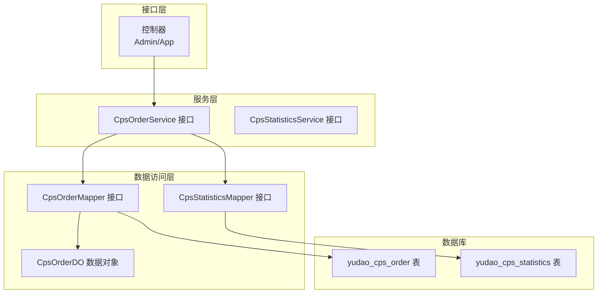
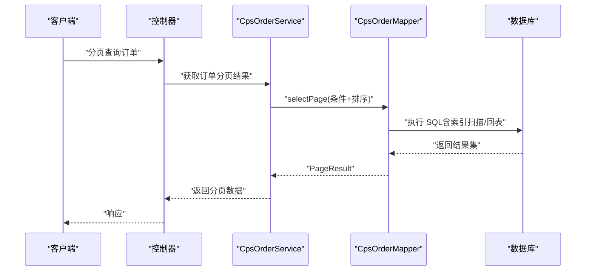
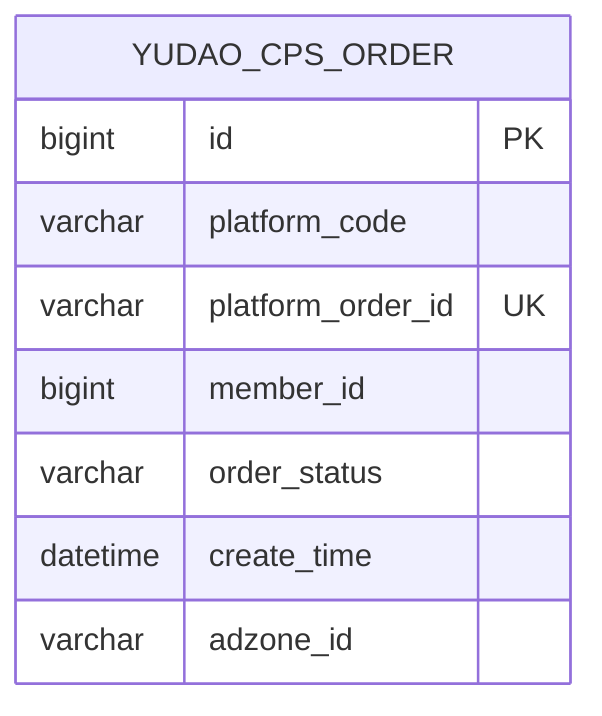
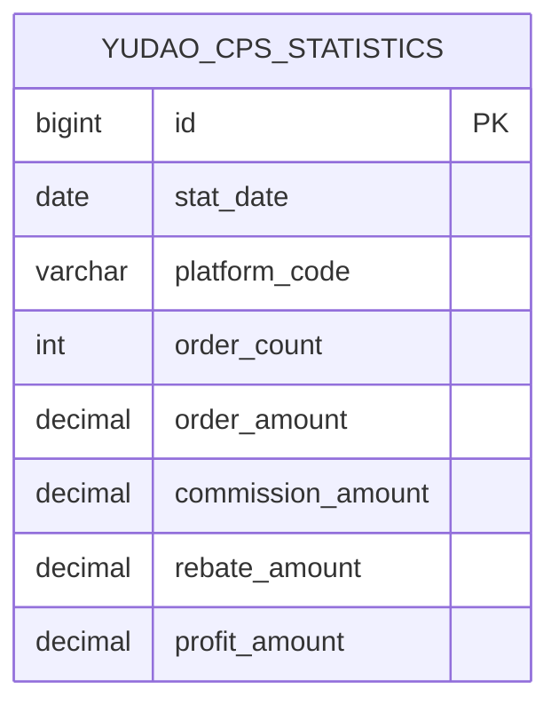
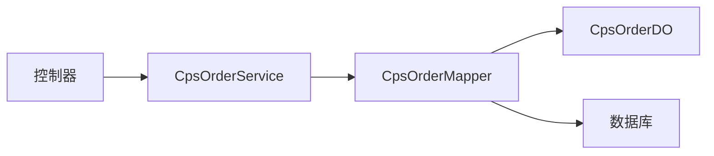

# 数据库性能优化

<cite>
**本文引用的文件**
- [cps-schema.sql](file://sql/module/cps-schema.sql)
- [CpsOrderMapper.java](file://yudao-module-cps/yudao-module-cps-biz/src/main/java/cn/zhijian/cps/dal/mysql/CpsOrderMapper.java)
- [CpsOrderDO.java](file://yudao-module-cps/yudao-module-cps-biz/src/main/java/cn/zhijian/cps/dal/dataobject/CpsOrderDO.java)
- [CpsStatisticsMapper.java](file://yudao-module-cps/yudao-module-cps-biz/src/main/java/cn/zhijian/cps/dal/mysql/CpsStatisticsMapper.java)
- [CpsOrderService.java](file://yudao-module-cps/yudao-module-cps-biz/src/main/java/cn/zhijian/cps/service/CpsOrderService.java)
- [CpsOrderStatusEnum.java](file://yudao-module-cps/yudao-module-cps-biz/src/main/java/cn/zhijian/cps/enums/CpsOrderStatusEnum.java)
</cite>

## 目录
1. [简介](#简介)
2. [项目结构](#项目结构)
3. [核心组件](#核心组件)
4. [架构总览](#架构总览)
5. [详细组件分析](#详细组件分析)
6. [依赖分析](#依赖分析)
7. [性能考量](#性能考量)
8. [故障排查指南](#故障排查指南)
9. [结论](#结论)
10. [附录](#附录)

## 简介
本专项文档聚焦于 AgenticCPS 系统的数据库性能优化，围绕高频访问的数据表与查询场景，系统性提出索引优化、查询优化、分库分表、缓存策略、连接池与事务优化、批量操作优化以及性能监控与调优工具的使用建议。目标是在保障数据一致性的前提下，显著降低延迟、提升吞吐，并增强系统的可维护性与可扩展性。

## 项目结构
CPS 模块采用典型的分层架构：接口层（Controller）、服务层（Service）、数据访问层（Mapper/DO），配合统一的 MyBatis-Plus 基类与通用查询封装，形成清晰的职责边界与可扩展性。

**图表来源**
- [CpsOrderService.java:10-22](file://yudao-module-cps/yudao-module-cps-biz/src/main/java/cn/zhijian/cps/service/CpsOrderService.java#L10-L22)
- [CpsOrderMapper.java:14-40](file://yudao-module-cps/yudao-module-cps-biz/src/main/java/cn/zhijian/cps/dal/mysql/CpsOrderMapper.java#L14-L40)
- [CpsStatisticsMapper.java:14-30](file://yudao-module-cps/yudao-module-cps-biz/src/main/java/cn/zhijian/cps/dal/mysql/CpsStatisticsMapper.java#L14-L30)
- [CpsOrderDO.java:22-79](file://yudao-module-cps/yudao-module-cps-biz/src/main/java/cn/zhijian/cps/dal/dataobject/CpsOrderDO.java#L22-L79)

**章节来源**
- [CpsOrderService.java:10-22](file://yudao-module-cps/yudao-module-cps-biz/src/main/java/cn/zhijian/cps/service/CpsOrderService.java#L10-L22)
- [CpsOrderMapper.java:14-40](file://yudao-module-cps/yudao-module-cps-biz/src/main/java/cn/zhijian/cps/dal/mysql/CpsOrderMapper.java#L14-L40)
- [CpsStatisticsMapper.java:14-30](file://yudao-module-cps/yudao-module-cps-biz/src/main/java/cn/zhijian/cps/dal/mysql/CpsStatisticsMapper.java#L14-L30)
- [CpsOrderDO.java:22-79](file://yudao-module-cps/yudao-module-cps-biz/src/main/java/cn/zhijian/cps/dal/dataobject/CpsOrderDO.java#L22-L79)

## 核心组件
- 订单表（yudao_cps_order）：承载订单生命周期与返利计算的关键表，包含平台编码、会员 ID、订单状态、时间字段等高频过滤与排序字段。
- 统计表（yudao_cps_statistics）：按日聚合的统计数据，支持按日期范围与平台维度查询。
- Mapper/DO 层：基于通用基类与 Lambda 查询封装，提供分页、范围查询、排序等常用能力。
- 枚举与状态：统一管理订单状态，便于在查询与业务逻辑中保持一致性。

**章节来源**
- [cps-schema.sql:58-100](file://sql/module/cps-schema.sql#L58-L100)
- [CpsOrderMapper.java:16-38](file://yudao-module-cps/yudao-module-cps-biz/src/main/java/cn/zhijian/cps/dal/mysql/CpsOrderMapper.java#L16-L38)
- [CpsStatisticsMapper.java:16-28](file://yudao-module-cps/yudao-module-cps-biz/src/main/java/cn/zhijian/cps/dal/mysql/CpsStatisticsMapper.java#L16-L28)
- [CpsOrderDO.java:22-79](file://yudao-module-cps/yudao-module-cps-biz/src/main/java/cn/zhijian/cps/dal/dataobject/CpsOrderDO.java#L22-L79)
- [CpsOrderStatusEnum.java:11-29](file://yudao-module-cps/yudao-module-cps-biz/src/main/java/cn/zhijian/cps/enums/CpsOrderStatusEnum.java#L11-L29)

## 架构总览
从查询路径看，接口层通过 Service 调用 Mapper，Mapper 使用通用基类与 Lambda 包装器进行条件拼装与分页，最终落到具体表上执行。该模式有利于统一优化点的落地与复用。

**图表来源**
- [CpsOrderService.java:16-18](file://yudao-module-cps/yudao-module-cps-biz/src/main/java/cn/zhijian/cps/service/CpsOrderService.java#L16-L18)
- [CpsOrderMapper.java:16-23](file://yudao-module-cps/yudao-module-cps-biz/src/main/java/cn/zhijian/cps/dal/mysql/CpsOrderMapper.java#L16-L23)

## 详细组件分析

### 订单表（yudao_cps_order）与查询优化
- 现有索引
  - 主键索引（自增 ID）
  - 唯一索引：platform_order_id
  - 辅助索引：member_id、order_status、create_time、platform_code
- 高频查询场景
  - 按平台编码与会员 ID 分页查询
  - 按订单状态过滤
  - 按创建时间范围查询
  - 按平台订单号精确查询
  - 按同步时间与返利状态组合查询（用于定时同步）

**图表来源**
- [cps-schema.sql:58-100](file://sql/module/cps-schema.sql#L58-L100)
- [CpsOrderDO.java:22-79](file://yudao-module-cps/yudao-module-cps-biz/src/main/java/cn/zhijian/cps/dal/dataobject/CpsOrderDO.java#L22-L79)

**章节来源**
- [cps-schema.sql:58-100](file://sql/module/cps-schema.sql#L58-L100)
- [CpsOrderMapper.java:16-38](file://yudao-module-cps/yudao-module-cps-biz/src/main/java/cn/zhijian/cps/dal/mysql/CpsOrderMapper.java#L16-L38)
- [CpsOrderDO.java:22-79](file://yudao-module-cps/yudao-module-cps-biz/src/main/java/cn/zhijian/cps/dal/dataobject/CpsOrderDO.java#L22-L79)

### 统计表（yudao_cps_statistics）与查询优化
- 现有索引
  - 主键索引（自增 ID）
  - 唯一索引：stat_date + platform_code
- 高频查询场景
  - 按日期范围与平台维度查询
  - 按日期升序/降序排序

**图表来源**
- [cps-schema.sql:191-210](file://sql/module/cps-schema.sql#L191-L210)

**章节来源**
- [cps-schema.sql:191-210](file://sql/module/cps-schema.sql#L191-L210)
- [CpsStatisticsMapper.java:16-28](file://yudao-module-cps/yudao-module-cps-biz/src/main/java/cn/zhijian/cps/dal/mysql/CpsStatisticsMapper.java#L16-L28)

### 索引优化方案
- 设计原则
  - 选择性优先：高选择性的列优先建立索引
  - 前缀匹配：LIKE 以通配符开头的模式尽量避免，必要时使用全文索引或重构字段
  - 覆盖索引：将查询所需字段纳入索引，减少回表
  - 复合索引顺序：将区分度高且常作为过滤条件的列放在前面
- 针对性建议
  - 订单表
    - 建议复合索引：(platform_code, member_id, create_time)
    - 建议复合索引：(order_status, create_time)
    - 建议复合索引：(platform_code, order_status, create_time)
    - 将常用查询字段（如 adzone_id、external_info）纳入覆盖索引，减少回表
  - 统计表
    - 建议复合索引：(stat_date, platform_code)
    - 如需按平台维度聚合，可考虑 (platform_code, stat_date)
- 避免索引失效
  - 避免在索引列上使用函数或表达式
  - 避免 leading wildcard 的 LIKE
  - 避免在索引列上进行类型转换
  - 避免对索引列使用 IS NULL/IS NOT NULL（除非明确需要）

**章节来源**
- [cps-schema.sql:58-100](file://sql/module/cps-schema.sql#L58-L100)
- [cps-schema.sql:191-210](file://sql/module/cps-schema.sql#L191-L210)
- [CpsOrderMapper.java:16-38](file://yudao-module-cps/yudao-module-cps-biz/src/main/java/cn/zhijian/cps/dal/mysql/CpsOrderMapper.java#L16-L38)
- [CpsStatisticsMapper.java:16-28](file://yudao-module-cps/yudao-module-cps-biz/src/main/java/cn/zhijian/cps/dal/mysql/CpsStatisticsMapper.java#L16-L28)

### 查询优化技术
- 慢查询分析
  - 开启慢查询日志，设置阈值（如 100ms），定期巡检
  - 使用 EXPLAIN 分析执行计划，关注 rows、filtered、Extra 字段
- 执行计划优化
  - 优先使用覆盖索引，避免回表
  - 合理使用 LIMIT，避免一次性返回过多数据
  - 将可选条件改为“存在性检查”，减少不必要的 JOIN
- SQL 语句改写技巧
  - 将 OR 改写为 UNION，确保每个分支都能命中索引
  - 使用 BETWEEN 替代多个等值比较
  - 将 IN 子查询改写为 JOIN 或 EXISTS
  - 对日期范围查询，尽量使用左闭右闭区间，减少边界问题

**章节来源**
- [CpsOrderMapper.java:16-38](file://yudao-module-cps/yudao-module-cps-biz/src/main/java/cn/zhijian/cps/dal/mysql/CpsOrderMapper.java#L16-L38)
- [CpsStatisticsMapper.java:16-28](file://yudao-module-cps/yudao-module-cps-biz/src/main/java/cn/zhijian/cps/dal/mysql/CpsStatisticsMapper.java#L16-L28)

### 分库分表考虑与实施
- 数据分片策略
  - 订单表：按平台编码或会员 ID 分片；若按会员 ID 分片，可结合时间维度做二次分片
  - 统计表：按日期分片（月/季），避免热点
- 路由规则设计
  - 平台编码路由到固定分片，保证跨平台聚合时的复杂度可控
  - 会员 ID 路由到固定分片，支持按用户维度的快速查询
- 跨分片查询处理
  - 使用中间件或应用层聚合，避免全局扫描
  - 对需要跨分片的报表，采用离线导出或异步聚合
- 事务与一致性
  - 同一分片内事务保持本地化
  - 跨分片事务采用 TCC/SAGA 或最终一致性方案

**章节来源**
- [cps-schema.sql:58-100](file://sql/module/cps-schema.sql#L58-L100)
- [cps-schema.sql:191-210](file://sql/module/cps-schema.sql#L191-L210)

### 缓存策略设计
- 应用场景
  - 订单详情与列表：短期热点数据（如近 1 小时内的订单）
  - 平台配置与返利配置：低频变更，适合长缓存
  - 统计数据：按天缓存，定时刷新
- 缓存一致性
  - 写路径：先写数据库，再更新/删除缓存（延时双删或 Cache-Aside）
  - 读路径：缓存未命中时回源数据库并回填缓存
- 缓存穿透防护
  - 对空结果也进行短时缓存
  - 使用布隆过滤器拦截不存在的 Key

**章节来源**
- [CpsOrderMapper.java:25-31](file://yudao-module-cps/yudao-module-cps-biz/src/main/java/cn/zhijian/cps/dal/mysql/CpsOrderMapper.java#L25-L31)
- [CpsStatisticsMapper.java:23-27](file://yudao-module-cps/yudao-module-cps-biz/src/main/java/cn/zhijian/cps/dal/mysql/CpsStatisticsMapper.java#L23-L27)

### 数据库连接池与事务优化
- 连接池优化
  - 设置合理的最大连接数与空闲连接数，避免过度占用
  - 启用连接泄漏检测与健康检查
- 事务优化
  - 缩小事务范围，尽早提交
  - 避免在事务中执行 IO 密集型操作
  - 使用合适的隔离级别，减少锁竞争
- 批量操作优化
  - 使用 JDBC 批处理或 MyBatis 批处理
  - 控制批大小，避免内存压力过大
  - 对大事务拆分为多次小事务

**章节来源**
- [CpsOrderMapper.java:16-38](file://yudao-module-cps/yudao-module-cps-biz/src/main/java/cn/zhijian/cps/dal/mysql/CpsOrderMapper.java#L16-L38)

### 性能监控与调优工具
- 监控指标
  - QPS、P95/P99 延迟、连接池使用率、锁等待、慢查询数量
- 工具推荐
  - MySQL：慢查询日志、EXPLAIN、Performance Schema、pt-query-digest
  - 应用侧：埋点与链路追踪（如 SkyWalking）、APM（如 Pinpoint/Jaeger）
- 调优流程
  - 识别瓶颈（CPU/IO/锁/网络）
  - 基于 EXPLAIN 与慢查询定位问题 SQL
  - 通过索引、SQL 改写、缓存、分库分表等手段逐项验证

**章节来源**
- [CpsOrderMapper.java:16-38](file://yudao-module-cps/yudao-module-cps-biz/src/main/java/cn/zhijian/cps/dal/mysql/CpsOrderMapper.java#L16-L38)

## 依赖分析
- 组件耦合
  - Mapper 依赖 DO 与通用基类，职责清晰
  - Service 依赖 Mapper，不直接操作数据库
- 关键依赖链
  - 控制器 -> Service -> Mapper -> 数据库
- 潜在风险
  - 查询条件缺失导致全表扫描
  - 复杂 JOIN 影响缓存命中与索引利用

**图表来源**
- [CpsOrderService.java:10-22](file://yudao-module-cps/yudao-module-cps-biz/src/main/java/cn/zhijian/cps/service/CpsOrderService.java#L10-L22)
- [CpsOrderMapper.java:14-40](file://yudao-module-cps/yudao-module-cps-biz/src/main/java/cn/zhijian/cps/dal/mysql/CpsOrderMapper.java#L14-L40)
- [CpsOrderDO.java:22-79](file://yudao-module-cps/yudao-module-cps-biz/src/main/java/cn/zhijian/cps/dal/dataobject/CpsOrderDO.java#L22-L79)

**章节来源**
- [CpsOrderService.java:10-22](file://yudao-module-cps/yudao-module-cps-biz/src/main/java/cn/zhijian/cps/service/CpsOrderService.java#L10-L22)
- [CpsOrderMapper.java:14-40](file://yudao-module-cps/yudao-module-cps-biz/src/main/java/cn/zhijian/cps/dal/mysql/CpsOrderMapper.java#L14-L40)
- [CpsOrderDO.java:22-79](file://yudao-module-cps/yudao-module-cps-biz/src/main/java/cn/zhijian/cps/dal/dataobject/CpsOrderDO.java#L22-L79)

## 性能考量
- 热点表与热点字段
  - yudao_cps_order 是核心热点表，需重点优化索引与查询
  - 统计表按天分片，避免写放大
- 写多读少与读多写少
  - 写多读少场景：优化写路径（批量、异步、削峰）
  - 读多写少场景：加强缓存与覆盖索引
- 事务与锁
  - 减少长事务，避免行锁升级为表锁
  - 使用间隙锁与临键锁注意范围控制

## 故障排查指南
- 常见问题
  - 查询慢：检查是否存在全表扫描、索引未命中、JOIN 过多
  - 死锁：排查事务范围过大、锁顺序不一致
  - 缓存穿透：确认空结果缓存与布隆过滤器
- 排查步骤
  - 采集慢查询日志与执行计划
  - 核对索引定义与查询条件
  - 检查缓存命中率与一致性策略
  - 观察连接池与数据库资源使用情况

**章节来源**
- [CpsOrderMapper.java:16-38](file://yudao-module-cps/yudao-module-cps-biz/src/main/java/cn/zhijian/cps/dal/mysql/CpsOrderMapper.java#L16-L38)
- [CpsStatisticsMapper.java:16-28](file://yudao-module-cps/yudao-module-cps-biz/src/main/java/cn/zhijian/cps/dal/mysql/CpsStatisticsMapper.java#L16-L28)

## 结论
通过对 CPS 系统核心表 yudao_cps_order 与 yudao_cps_statistics 的索引现状与查询模式进行分析，建议优先完善复合索引、引入覆盖索引、优化慢查询与 SQL 改写，并辅以缓存、连接池与事务优化。对于未来规模增长，应评估分库分表策略与跨分片查询方案，持续以监控与调优工具驱动性能迭代。

## 附录
- 快速检查清单
  - 是否为高频查询字段建立了合适索引
  - 是否存在回表与全表扫描
  - 是否使用了覆盖索引
  - 是否对日期范围查询进行了边界优化
  - 缓存策略是否覆盖热点数据
  - 连接池与事务配置是否合理
  - 是否具备慢查询与执行计划分析能力