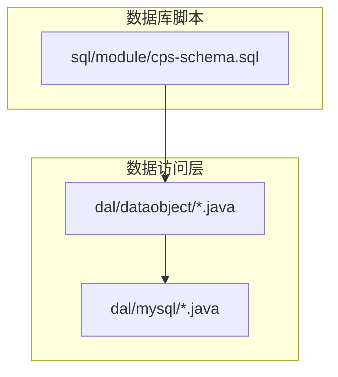
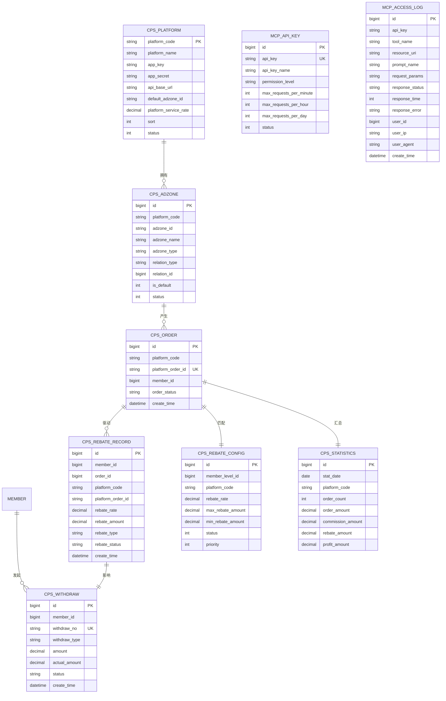
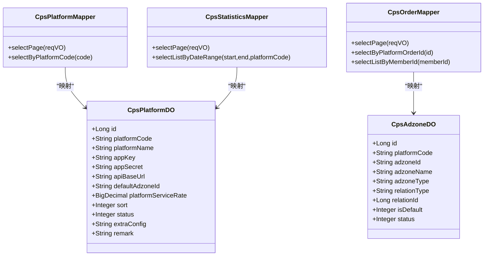
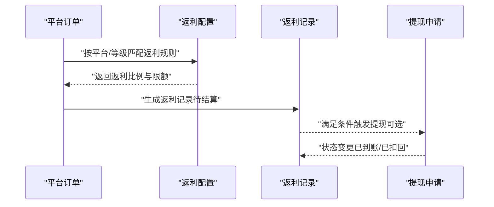
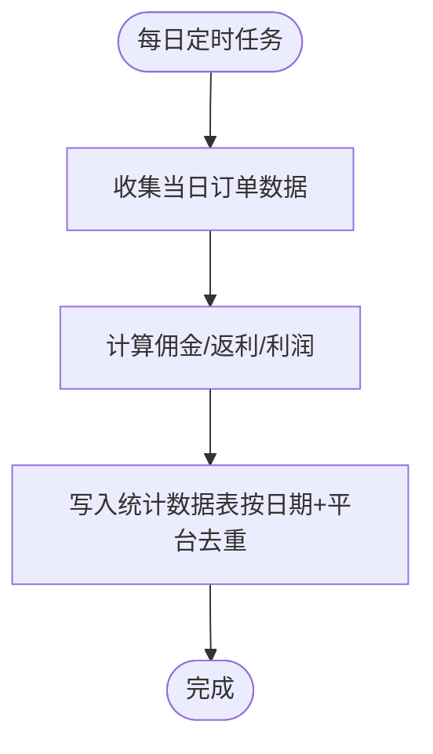
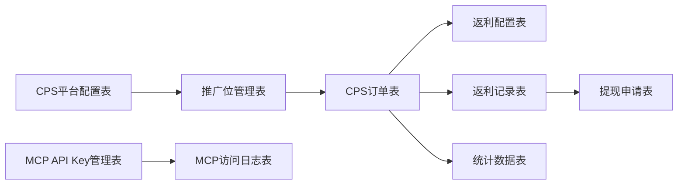

# 数据库设计

<cite>
**本文引用的文件**
- [cps-schema.sql](file://sql/module/cps-schema.sql)
- [CpsPlatformDO.java](file://yudao-module-cps/yudao-module-cps-biz/src/main/java/cn/zhijian/cps/dal/dataobject/CpsPlatformDO.java)
- [CpsAdzoneDO.java](file://yudao-module-cps/yudao-module-cps-biz/src/main/java/cn/zhijian/cps/dal/dataobject/CpsAdzoneDO.java)
- [CpsOrderMapper.java](file://yudao-module-cps/yudao-module-cps-biz/src/main/java/cn/zhijian/cps/dal/mysql/CpsOrderMapper.java)
- [CpsPlatformMapper.java](file://yudao-module-cps/yudao-module-cps-biz/src/main/java/cn/zhijian/cps/dal/mysql/CpsPlatformMapper.java)
- [CpsStatisticsMapper.java](file://yudao-module-cps/yudao-module-cps-biz/src/main/java/cn/zhijian/cps/dal/mysql/CpsStatisticsMapper.java)
</cite>

## 目录
1. [简介](#简介)
2. [项目结构](#项目结构)
3. [核心组件](#核心组件)
4. [架构总览](#架构总览)
5. [详细组件分析](#详细组件分析)
6. [依赖分析](#依赖分析)
7. [性能考量](#性能考量)
8. [故障排查指南](#故障排查指南)
9. [结论](#结论)
10. [附录](#附录)

## 简介
本文件面向 AgenticCPS 系统，提供一套完整的数据库设计方案，覆盖 CPS 平台配置、推广位管理、订单、返利配置、返利记录、提现申请、统计数据、MCP API Key 管理、MCP 访问日志等九张业务表。内容包括：
- 表结构定义、字段类型、约束与索引
- 表间关系与外键约束
- ER 关系图与数据模型图
- 数据访问层（MyBatis Plus）实现要点
- 性能优化策略（索引、查询、分表分库）
- 数据迁移与版本管理、备份恢复
- 数据安全与隐私保护、数据生命周期管理

## 项目结构
CPS 模块的数据库对象主要由两部分组成：
- 建表脚本：位于 sql/module/cps-schema.sql
- 数据访问层：位于 yudao-module-cps/yudao-module-cps-biz/src/main/java/cn/zhijian/cps/dal 下，包含实体类与 Mapper 接口

**图表来源**
- [cps-schema.sql:1-265](file://sql/module/cps-schema.sql#L1-L265)
- [CpsPlatformDO.java:1-82](file://yudao-module-cps/yudao-module-cps-biz/src/main/java/cn/zhijian/cps/dal/dataobject/CpsPlatformDO.java#L1-L82)
- [CpsAdzoneDO.java:1-41](file://yudao-module-cps/yudao-module-cps-biz/src/main/java/cn/zhijian/cps/dal/dataobject/CpsAdzoneDO.java#L1-L41)

**章节来源**
- [cps-schema.sql:1-265](file://sql/module/cps-schema.sql#L1-L265)

## 核心组件
本节对九张核心业务表进行逐项说明，涵盖字段、类型、约束、索引与典型用途。

- CPS平台配置表（yudao_cps_platform）
  - 字段要点：平台编码（唯一）、平台名称、Logo、AppKey/AppSecret、API 基础地址、默认推广位、服务费率、排序、状态、扩展配置、备注、创建/更新时间、软删
  - 约束与索引：主键自增；唯一索引 uk_platform_code
  - 典型用途：统一接入各平台参数与密钥，支持多平台聚合

- 推广位管理表（yudao_cps_adzone）
  - 字段要点：所属平台编码、推广位 ID、名称、类型（通用/渠道专属/用户专属）、关联类型与 ID、是否默认、状态、创建/更新时间、软删
  - 约束与索引：主键自增；索引 idx_platform_code、idx_adzone_id
  - 典型用途：按平台/用户/渠道维度管理推广位

- CPS订单表（yudao_cps_order）
  - 字段要点：平台编码、平台订单号（唯一）、父订单号、会员归因信息、商品信息、价格与券后价、佣金比例/金额、预估/实际返利、推广位、外部追踪参数、订单状态、各关键时间点、重试次数与错误信息、创建/更新时间、软删
  - 约束与索引：主键自增；唯一索引 uk_platform_order_id；多处业务常用字段建立普通索引
  - 典型用途：跨平台订单归集、状态同步、返利计算依据

- 返利配置表（yudao_cps_rebate_config）
  - 字段要点：会员等级限制、平台限制、返利比例、单笔上下限、状态、优先级、创建/更新时间、软删
  - 约束与索引：主键自增；索引 idx_member_level_id、idx_platform_code
  - 典型用途：按等级/平台动态配置返利规则

- 返利记录表（yudao_cps_rebate_record）
  - 字段要点：会员、订单、平台与平台订单号、商品信息、订单金额、可分配佣金、返利比例/金额、返利类型（入账/扣回/调整）、状态、前序返利 ID、备注、创建/更新时间、软删
  - 约束与索引：主键自增；多处业务字段建立索引
  - 典型用途：明细级返利流水与状态跟踪

- 提现申请表（yudao_cps_withdraw）
  - 字段要点：会员、提现单号（唯一）、类型（支付宝/微信/银行卡）、账户与户名、金额、手续费、实到账、状态、审核备注、转账单号与时间、错误信息、创建/更新时间、软删
  - 约束与索引：主键自增；唯一索引 uk_withdraw_no；多处业务字段建立索引
  - 典型用途：提现流程与资金结算跟踪

- 统计数据表（yudao_cps_statistics）
  - 字段要点：统计日期、平台编码（含 total 全平台）、订单数、订单金额、佣金总额、返利总额、利润总额、创建/更新时间、软删
  - 约束与索引：主键自增；唯一索引 uk_stat_date_platform
  - 典型用途：按日/平台维度生成报表与看板

- MCP API Key 管理表（yudao_cps_mcp_api_key）
  - 字段要点：API Key（唯一，加密存储）、名称、权限级别、QPS/时/日限额、状态、最后使用时间、总调用次数、成功次数、备注、创建/更新时间、软删
  - 约束与索引：主键自增；唯一索引 uk_api_key
  - 典型用途：MCP 能力访问鉴权与用量治理

- MCP 访问日志表（yudao_cps_mcp_access_log）
  - 字段要点：API Key、Tool 名称、Resource URI、Prompt 名称、请求参数（脱敏）、响应状态、耗时、错误信息、用户 ID/IP/User-Agent、创建/更新时间、软删
  - 约束与索引：主键自增；索引 idx_api_key、idx_tool_name、idx_create_time
  - 典型用途：审计、监控与问题定位

**章节来源**
- [cps-schema.sql:8-31](file://sql/module/cps-schema.sql#L8-L31)
- [cps-schema.sql:36-55](file://sql/module/cps-schema.sql#L36-L55)
- [cps-schema.sql:60-100](file://sql/module/cps-schema.sql#L60-L100)
- [cps-schema.sql:105-123](file://sql/module/cps-schema.sql#L105-L123)
- [cps-schema.sql:128-157](file://sql/module/cps-schema.sql#L128-L157)
- [cps-schema.sql:162-188](file://sql/module/cps-schema.sql#L162-L188)
- [cps-schema.sql:193-210](file://sql/module/cps-schema.sql#L193-L210)
- [cps-schema.sql:215-236](file://sql/module/cps-schema.sql#L215-L236)
- [cps-schema.sql:241-264](file://sql/module/cps-schema.sql#L241-L264)

## 架构总览
下图展示九张表之间的逻辑关系与数据流向，强调订单与返利、提现、统计之间的关联。

**图表来源**
- [cps-schema.sql:8-31](file://sql/module/cps-schema.sql#L8-L31)
- [cps-schema.sql:36-55](file://sql/module/cps-schema.sql#L36-L55)
- [cps-schema.sql:60-100](file://sql/module/cps-schema.sql#L60-L100)
- [cps-schema.sql:105-123](file://sql/module/cps-schema.sql#L105-L123)
- [cps-schema.sql:128-157](file://sql/module/cps-schema.sql#L128-L157)
- [cps-schema.sql:162-188](file://sql/module/cps-schema.sql#L162-L188)
- [cps-schema.sql:193-210](file://sql/module/cps-schema.sql#L193-L210)
- [cps-schema.sql:215-236](file://sql/module/cps-schema.sql#L215-L236)
- [cps-schema.sql:241-264](file://sql/module/cps-schema.sql#L241-L264)

## 详细组件分析

### 数据访问层（MyBatis Plus）实现
- 实体类映射
  - 平台配置实体：对应 yudao_cps_platform，字段与建表脚本一致，包含主键、平台编码、名称、密钥、费率、状态、扩展配置等
  - 推广位实体：对应 yudao_cps_adzone，包含平台编码、推广位 ID、类型、关联关系、默认标记、状态等
  - 订单、返利配置、返利记录、提现、统计、MCP Key、MCP 日志等实体均与对应表结构一一映射

- Mapper 接口设计
  - 基于 BaseMapperX 的通用 Mapper，提供分页、条件查询、批量插入等能力
  - 针对业务场景提供默认方法，如按平台编码、会员 ID、状态、日期范围等条件查询
  - 示例：
    - 平台配置 Mapper：按平台编码查询、分页查询
    - 订单 Mapper：按平台订单号查询、按会员 ID 查询列表、按状态/时间区间分页
    - 统计 Mapper：按日期范围与平台编码查询列表、分页查询

- 查询封装
  - 使用 LambdaQueryWrapperX 封装条件查询，支持空值跳过（eqIfPresent）、区间查询（betweenIfPresent）、排序等
  - 通过默认方法简化控制器层调用，避免重复代码

**图表来源**
- [CpsPlatformDO.java:1-82](file://yudao-module-cps/yudao-module-cps-biz/src/main/java/cn/zhijian/cps/dal/dataobject/CpsPlatformDO.java#L1-L82)
- [CpsAdzoneDO.java:1-41](file://yudao-module-cps/yudao-module-cps-biz/src/main/java/cn/zhijian/cps/dal/dataobject/CpsAdzoneDO.java#L1-L41)
- [CpsPlatformMapper.java:1-25](file://yudao-module-cps/yudao-module-cps-biz/src/main/java/cn/zhijian/cps/dal/mysql/CpsPlatformMapper.java#L1-L25)
- [CpsOrderMapper.java:1-32](file://yudao-module-cps/yudao-module-cps-biz/src/main/java/cn/zhijian/cps/dal/mysql/CpsOrderMapper.java#L1-L32)
- [CpsStatisticsMapper.java:1-30](file://yudao-module-cps/yudao-module-cps-biz/src/main/java/cn/zhijian/cps/dal/mysql/CpsStatisticsMapper.java#L1-L30)

**章节来源**
- [CpsPlatformDO.java:1-82](file://yudao-module-cps/yudao-module-cps-biz/src/main/java/cn/zhijian/cps/dal/dataobject/CpsPlatformDO.java#L1-L82)
- [CpsAdzoneDO.java:1-41](file://yudao-module-cps/yudao-module-cps-biz/src/main/java/cn/zhijian/cps/dal/dataobject/CpsAdzoneDO.java#L1-L41)
- [CpsPlatformMapper.java:1-25](file://yudao-module-cps/yudao-module-cps-biz/src/main/java/cn/zhijian/cps/dal/mysql/CpsPlatformMapper.java#L1-L25)
- [CpsOrderMapper.java:1-32](file://yudao-module-cps/yudao-module-cps-biz/src/main/java/cn/zhijian/cps/dal/mysql/CpsOrderMapper.java#L1-L32)
- [CpsStatisticsMapper.java:1-30](file://yudao-module-cps/yudao-module-cps-biz/src/main/java/cn/zhijian/cps/dal/mysql/CpsStatisticsMapper.java#L1-L30)

### 订单到返利的处理流程

**图表来源**
- [cps-schema.sql:60-100](file://sql/module/cps-schema.sql#L60-L100)
- [cps-schema.sql:105-123](file://sql/module/cps-schema.sql#L105-L123)
- [cps-schema.sql:128-157](file://sql/module/cps-schema.sql#L128-L157)
- [cps-schema.sql:162-188](file://sql/module/cps-schema.sql#L162-L188)

### 统计数据生成流程

**图表来源**
- [cps-schema.sql:193-210](file://sql/module/cps-schema.sql#L193-L210)

## 依赖分析
- 内部依赖
  - 订单表依赖推广位表（推广位 ID），用于归因与结算
  - 返利记录表依赖订单表（订单 ID）与会员表（会员 ID），用于明细追踪
  - 提现申请表依赖会员表（会员 ID），用于资金结算
  - 统计数据表依赖订单表，用于聚合计算
  - MCP 访问日志表依赖 MCP API Key 表，用于权限与审计

- 外部依赖
  - 各平台 API（通过平台配置表中的 AppKey/AppSecret 与 API 基础地址）
  - 支付通道（提现类型对应不同支付方式）

**图表来源**
- [cps-schema.sql:8-31](file://sql/module/cps-schema.sql#L8-L31)
- [cps-schema.sql:36-55](file://sql/module/cps-schema.sql#L36-L55)
- [cps-schema.sql:60-100](file://sql/module/cps-schema.sql#L60-L100)
- [cps-schema.sql:105-123](file://sql/module/cps-schema.sql#L105-L123)
- [cps-schema.sql:128-157](file://sql/module/cps-schema.sql#L128-L157)
- [cps-schema.sql:162-188](file://sql/module/cps-schema.sql#L162-L188)
- [cps-schema.sql:193-210](file://sql/module/cps-schema.sql#L193-L210)
- [cps-schema.sql:215-236](file://sql/module/cps-schema.sql#L215-L236)
- [cps-schema.sql:241-264](file://sql/module/cps-schema.sql#L241-L264)

## 性能考量
- 索引优化
  - 订单表：按会员 ID、订单状态、创建时间、平台编码建立索引，支撑分页与筛选
  - 返利记录表：按会员 ID、订单 ID、平台订单号、类型、状态、创建时间建立索引，支撑明细查询与报表
  - 提现表：按会员 ID、状态、创建时间建立索引，支撑提现流程查询
  - 推广位表：按平台编码、推广位 ID 建立索引，支撑快速定位
  - 统计表：按日期与平台编码唯一索引，避免重复写入
  - MCP 日志表：按 API Key、Tool 名称、创建时间建立索引，支撑审计与查询

- 查询优化
  - 使用分页查询与条件过滤（eqIfPresent、betweenIfPresent）
  - 避免 SELECT *，按需选择字段
  - 对高频查询字段保持窄索引，减少回表

- 分表分库考虑
  - 订单与返利记录：按日期（如按月）分表，或按会员 ID 哈希分片
  - 统计表：按日期分区，便于滚动清理
  - MCP 日志：按时间分区，结合保留策略清理历史

- 缓存策略
  - 平台配置与返利配置可缓存，结合失效策略
  - 统计结果可短期缓存，降低热点查询压力

[本节为通用建议，无需列出具体文件来源]

## 故障排查指南
- 常见问题
  - 订单重复：检查订单号唯一索引与幂等处理
  - 返利重复/遗漏：核对返利配置优先级与订单状态流转
  - 提现异常：核对账户信息、状态机与转账回调
  - 统计不准确：检查定时任务执行与分区/分表策略

- 审计与监控
  - 利用 MCP 访问日志定位调用异常
  - 订单与返利记录的状态变更留痕，便于回溯

**章节来源**
- [cps-schema.sql:60-100](file://sql/module/cps-schema.sql#L60-L100)
- [cps-schema.sql:128-157](file://sql/module/cps-schema.sql#L128-L157)
- [cps-schema.sql:162-188](file://sql/module/cps-schema.sql#L162-L188)
- [cps-schema.sql:241-264](file://sql/module/cps-schema.sql#L241-L264)

## 结论
本文给出了 AgenticCPS 系统的数据库设计方案，明确了九张核心表的结构、索引与关系，并结合 MyBatis Plus 的 Mapper 设计提供了可落地的数据访问实现思路。配合索引优化、查询优化与分表分库策略，可在高并发场景下保障系统稳定性与性能。同时，完善的审计与监控体系有助于问题定位与运营分析。

## 附录
- 数据迁移与版本管理
  - 建议采用数据库版本控制工具（如 Liquibase/ Flyway），以脚本形式管理 schema 变更
  - 迁移脚本按模块拆分，先创建/修改表结构，再补充索引与约束
  - 迁移前做好备份，迁移后验证数据完整性与查询性能

- 备份与恢复
  - 定期全量备份 + 增量备份
  - 关键表（订单、返利、提现、统计）增加备份频率
  - 恢复演练定期进行，确保 RTO/RPO 满足业务要求

- 数据安全与隐私保护
  - 敏感字段（AppSecret、支付账户、日志参数）加密存储与脱敏显示
  - API Key 管理表对密钥进行加密存储并限制可见范围
  - MCP 日志对敏感参数进行脱敏处理

- 数据生命周期管理
  - 明确数据保留期限（日志、统计、订单明细等）
  - 自动化清理策略，避免历史数据膨胀
  - 软删字段统一使用 deleted 字段，支持逻辑回收

[本节为通用建议，无需列出具体文件来源]