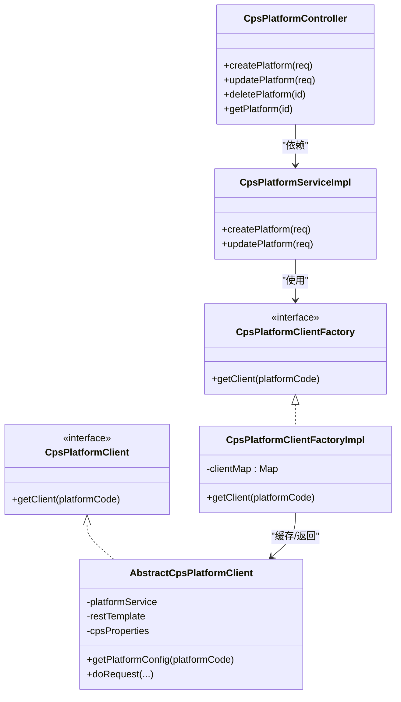
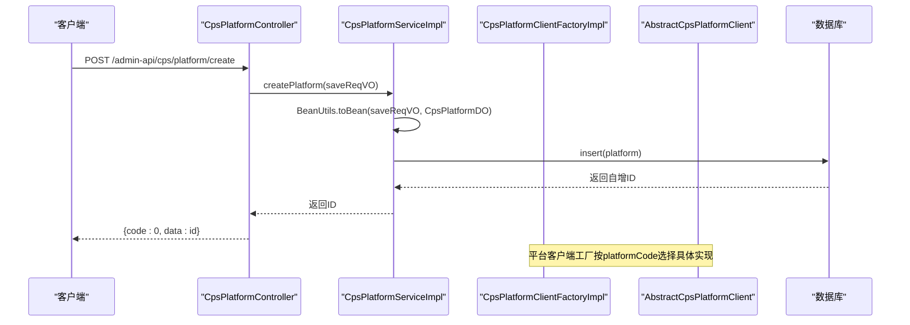
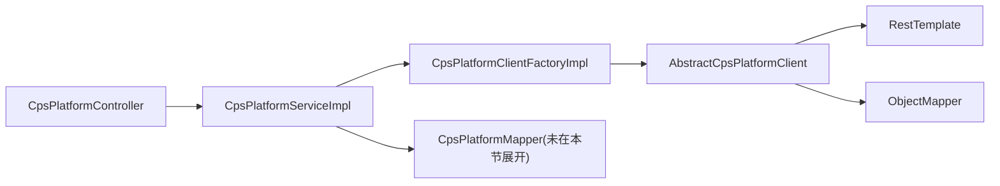

# 数据模型集成与关系映射

<cite>
**本文引用的文件**
- [cps-schema.sql](file://sql/module/cps-schema.sql)
- [CpsPlatformDO.java](file://yudao-module-cps/yudao-module-cps-biz/src/main/java/cn/zhijian/cps/dal/dataobject/CpsPlatformDO.java)
- [CpsAdzoneDO.java](file://yudao-module-cps/yudao-module-cps-biz/src/main/java/cn/zhijian/cps/dal/dataobject/CpsAdzoneDO.java)
- [CpsOrderDO.java](file://yudao-module-cps/yudao-module-cps-biz/src/main/java/cn/zhijian/cps/dal/dataobject/CpsOrderDO.java)
- [CpsRebateConfigDO.java](file://yudao-module-cps/yudao-module-cps-biz/src/main/java/cn/zhijian/cps/dal/dataobject/CpsRebateConfigDO.java)
- [CpsStatisticsDO.java](file://yudao-module-cps/yudao-module-cps-biz/src/main/java/cn/zhijian/cps/dal/dataobject/CpsStatisticsDO.java)
- [CpsPlatformController.java](file://yudao-module-cps/yudao-module-cps-biz/src/main/java/cn/zhijian/cps/controller/admin/CpsPlatformController.java)
- [CpsPlatformServiceImpl.java](file://yudao-module-cps/yudao-module-cps-biz/src/main/java/cn/zhijian/cps/service/CpsPlatformServiceImpl.java)
- [CpsPlatformClientFactory.java](file://yudao-module-cps/yudao-module-cps-biz/src/main/java/cn/zhijian/cps/service/CpsPlatformClientFactory.java)
- [CpsPlatformClientFactoryImpl.java](file://yudao-module-cps/yudao-module-cps-biz/src/main/java/cn/zhijian/cps/service/CpsPlatformClientFactoryImpl.java)
- [AbstractCpsPlatformClient.java](file://yudao-module-cps/yudao-module-cps-biz/src/main/java/cn/zhijian/cps/client/AbstractCpsPlatformClient.java)
- [CpsPlatformResource.java](file://yudao-module-cps/yudao-module-cps-biz/src/main/java/cn/zhijian/cps/mcp/resource/CpsPlatformResource.java)
</cite>

## 目录
1. [引言](#引言)
2. [项目结构](#项目结构)
3. [核心组件](#核心组件)
4. [架构总览](#架构总览)
5. [详细组件分析](#详细组件分析)
6. [依赖分析](#依赖分析)
7. [性能考虑](#性能考虑)
8. [故障排查指南](#故障排查指南)
9. [结论](#结论)
10. [附录](#附录)

## 引言
本文件面向AgenticCPS系统的数据模型集成与关系映射，聚焦CPS模块的数据库表结构、实体类设计、实体间关系、枚举与配置、DTO/VO/BO转换、安全与审计、以及版本演进与迁移策略。文档以仓库中的建表脚本与Java实体类为依据，结合控制器与服务层实现，形成从数据库到应用层的完整数据模型视图。

## 项目结构
CPS模块的数据模型主要由以下部分组成：
- 数据库建模：位于sql/module/cps-schema.sql，定义了平台配置、推广位、订单、返利配置、返利记录、提现、统计数据、MCP API Key与访问日志等表。
- 实体类：位于yudao-module-cps-biz模块的dal.dataobject包，对应上述表结构。
- 控制器与服务：位于controller.admin与service包，负责业务编排与对外接口。
- 客户端与资源：client与mcp.resource包，封装平台适配器与MCP资源访问。

```mermaid
graph TB
subgraph "数据库层"
T1["yudao_cps_platform<br/>平台配置"]
T2["yudao_cps_adzone<br/>推广位"]
T3["yudao_cps_order<br/>订单"]
T4["yudao_cps_rebate_config<br/>返利配置"]
T5["yudao_cps_rebate_record<br/>返利记录"]
T6["yudao_cps_withdraw<br/>提现"]
T7["yudao_cps_statistics<br/>统计数据"]
T8["yudao_cps_mcp_api_key<br/>MCP API Key"]
T9["yudao_cps_mcp_access_log<br/>MCP访问日志"]
end
subgraph "实体层"
E1["CpsPlatformDO"]
E2["CpsAdzoneDO"]
E3["CpsOrderDO"]
E4["CpsRebateConfigDO"]
E5["CpsStatisticsDO"]
end
subgraph "应用层"
C1["CpsPlatformController"]
S1["CpsPlatformServiceImpl"]
F1["CpsPlatformClientFactory"]
F2["CpsPlatformClientFactoryImpl"]
A1["AbstractCpsPlatformClient"]
R1["CpsPlatformResource"]
end
T1 --> E1
T2 --> E2
T3 --> E3
T4 --> E4
T7 --> E5
C1 --> S1
S1 --> F1
F1 --> F2
F2 --> A1
R1 --> C1
```



图表来源
- [cps-schema.sql](file://sql/module/cps-schema.sql)
- [CpsPlatformDO.java](file://yudao-module-cps/yudao-module-cps-biz/src/main/java/cn/zhijian/cps/dal/dataobject/CpsPlatformDO.java)
- [CpsAdzoneDO.java](file://yudao-module-cps/yudao-module-cps-biz/src/main/java/cn/zhijian/cps/dal/dataobject/CpsAdzoneDO.java)
- [CpsOrderDO.java](file://yudao-module-cps/yudao-module-cps-biz/src/main/java/cn/zhijian/cps/dal/dataobject/CpsOrderDO.java)
- [CpsRebateConfigDO.java](file://yudao-module-cps/yudao-module-cps-biz/src/main/java/cn/zhijian/cps/dal/dataobject/CpsRebateConfigDO.java)
- [CpsStatisticsDO.java](file://yudao-module-cps/yudao-module-cps-biz/src/main/java/cn/zhijian/cps/dal/dataobject/CpsStatisticsDO.java)
- [CpsPlatformController.java](file://yudao-module-cps/yudao-module-cps-biz/src/main/java/cn/zhijian/cps/controller/admin/CpsPlatformController.java)
- [CpsPlatformServiceImpl.java](file://yudao-module-cps/yudao-module-cps-biz/src/main/java/cn/zhijian/cps/service/CpsPlatformServiceImpl.java)
- [CpsPlatformClientFactory.java](file://yudao-module-cps/yudao-module-cps-biz/src/main/java/cn/zhijian/cps/service/CpsPlatformClientFactory.java)
- [CpsPlatformClientFactoryImpl.java](file://yudao-module-cps/yudao-module-cps-biz/src/main/java/cn/zhijian/cps/service/CpsPlatformClientFactoryImpl.java)
- [AbstractCpsPlatformClient.java](file://yudao-module-cps/yudao-module-cps-biz/src/main/java/cn/zhijian/cps/client/AbstractCpsPlatformClient.java)
- [CpsPlatformResource.java](file://yudao-module-cps/yudao-module-cps-biz/src/main/java/cn/zhijian/cps/mcp/resource/CpsPlatformResource.java)

章节来源
- [cps-schema.sql](file://sql/module/cps-schema.sql)
- [CpsPlatformDO.java](file://yudao-module-cps/yudao-module-cps-biz/src/main/java/cn/zhijian/cps/dal/dataobject/CpsPlatformDO.java)

## 核心组件
- 平台配置表与实体：平台配置表承载平台接入信息，实体类映射其字段，含主键、编码、名称、密钥、默认推广位、费率、状态、排序、扩展配置等。
- 推广位表与实体：推广位表记录不同维度的推广位（通用/渠道专属/用户专属），并支持与渠道或用户的关联。
- 订单表：记录跨平台订单的生命周期关键时间点、金额、佣金与返利计算字段、状态与重试信息。
- 返利配置表：按会员等级与平台维度配置返利比例、上下限与优先级。
- 返利记录表：记录会员的返利明细、类型、状态与前置返利ID（用于扣回/调整）。
- 提现表：记录提现申请、账户信息、手续费、状态与转账信息。
- 统计数据表：按日期与平台聚合订单、佣金、返利、利润等指标。
- MCP相关表：API Key管理与访问日志，支撑MCP资源访问与审计。

章节来源
- [cps-schema.sql](file://sql/module/cps-schema.sql)
- [CpsPlatformDO.java](file://yudao-module-cps/yudao-module-cps-biz/src/main/java/cn/zhijian/cps/dal/dataobject/CpsPlatformDO.java)
- [CpsAdzoneDO.java](file://yudao-module-cps/yudao-module-cps-biz/src/main/java/cn/zhijian/cps/dal/dataobject/CpsAdzoneDO.java)
- [CpsOrderDO.java](file://yudao-module-cps/yudao-module-cps-biz/src/main/java/cn/zhijian/cps/dal/dataobject/CpsOrderDO.java)
- [CpsRebateConfigDO.java](file://yudao-module-cps/yudao-module-cps-biz/src/main/java/cn/zhijian/cps/dal/dataobject/CpsRebateConfigDO.java)
- [CpsStatisticsDO.java](file://yudao-module-cps/yudao-module-cps-biz/src/main/java/cn/zhijian/cps/dal/dataobject/CpsStatisticsDO.java)

## 架构总览
下图展示数据库表、实体类与应用层组件的关系映射，以及平台客户端工厂与抽象适配器在数据流转中的作用。

```mermaid
erDiagram
YUDAO_CPS_PLATFORM ||--o{ YUDAO_CPS_ADZONE : "1对多"
YUDAO_CPS_PLATFORM ||--o{ YUDAO_CPS_ORDER : "1对多"
YUDAO_CPS_PLATFORM ||--o{ YUDAO_CPS_REBATE_CONFIG : "1对多"
YUDAO_CPS_MEMBER ||--o{ YUDAO_CPS_WITHDRAW : "1对多"
YUDAO_CPS_MEMBER ||--o{ YUDAO_CPS_REBATE_RECORD : "1对多"
YUDAO_CPS_ORDER ||--|| YUDAO_CPS_REBATE_RECORD : "1对1(可选)"
YUDAO_CPS_ADZONE ||--o{ YUDAO_CPS_ORDER : "1对多"
YUDAO_CPS_PLATFORM {
bigint id PK
varchar platform_code UK
varchar platform_name
varchar app_key
varchar app_secret
varchar api_base_url
varchar default_adzone_id
decimal platform_service_rate
int sort
tinyint status
}
YUDAO_CPS_ADZONE {
bigint id PK
varchar platform_code
varchar adzone_id
varchar adzone_name
varchar adzone_type
varchar relation_type
bigint relation_id
int is_default
tinyint status
}
YUDAO_CPS_ORDER {
bigint id PK
varchar platform_code
varchar platform_order_id UK
varchar parent_order_id
bigint member_id
varchar member_nickname
varchar item_id
varchar item_title
decimal item_price
decimal final_price
decimal coupon_amount
decimal commission_rate
decimal commission_amount
decimal estimate_rebate
decimal real_rebate
varchar adzone_id
varchar order_status
datetime sync_time
datetime settle_time
datetime rebate_time
datetime refund_time
datetime confirm_receipt_time
datetime platform_confirm_time
int retry_count
}
YUDAO_CPS_REBATE_CONFIG {
bigint id PK
bigint member_level_id
varchar platform_code
decimal rebate_rate
decimal max_rebate_amount
decimal min_rebate_amount
tinyint status
int priority
}
YUDAO_CPS_REBATE_RECORD {
bigint id PK
bigint member_id
bigint order_id
varchar platform_code
varchar platform_order_id
decimal order_amount
decimal commission_amount
decimal rebate_rate
decimal rebate_amount
varchar rebate_type
varchar rebate_status
bigint preceding_rebate_id
}
YUDAO_CPS_WITHDRAW {
bigint id PK
bigint member_id
varchar withdraw_no UK
varchar withdraw_type
varchar withdraw_account
varchar withdraw_account_name
decimal amount
decimal fee_amount
decimal actual_amount
varchar status
varchar review_note
varchar transaction_no
datetime transfer_time
}
YUDAO_CPS_STATISTICS {
bigint id PK
date stat_date
varchar platform_code
int order_count
decimal order_amount
decimal commission_amount
decimal rebate_amount
decimal profit_amount
unique uk_stat_date_platform(stat_date, platform_code)
}
```

图表来源
- [cps-schema.sql](file://sql/module/cps-schema.sql)

## 详细组件分析

### 数据模型与实体类映射
- 基类设计：所有实体类均继承BaseDO，统一具备创建/更新时间、创建者/更新者、软删除等字段，确保审计与一致性。
- 字段命名：采用驼峰命名与数据库字段映射，如platformCode与platform_code、apiBaseUrl与api_base_url等。
- 数值精度：金额与比率使用decimal类型，保证金融数据精度；时间字段使用datetime/date类型，满足统计与审计需求。

章节来源
- [CpsPlatformDO.java](file://yudao-module-cps/yudao-module-cps-biz/src/main/java/cn/zhijian/cps/dal/dataobject/CpsPlatformDO.java)
- [CpsAdzoneDO.java](file://yudao-module-cps/yudao-module-cps-biz/src/main/java/cn/zhijian/cps/dal/dataobject/CpsAdzoneDO.java)
- [CpsOrderDO.java](file://yudao-module-cps/yudao-module-cps-biz/src/main/java/cn/zhijian/cps/dal/dataobject/CpsOrderDO.java)
- [CpsRebateConfigDO.java](file://yudao-module-cps/yudao-module-cps-biz/src/main/java/cn/zhijian/cps/dal/dataobject/CpsRebateConfigDO.java)
- [CpsStatisticsDO.java](file://yudao-module-cps/yudao-module-cps-biz/src/main/java/cn/zhijian/cps/dal/dataobject/CpsStatisticsDO.java)

### 关系映射与外键约束
- 平台配置与推广位：一对多，推广位表的platform_code指向平台配置表的platform_code。
- 平台配置与订单：一对多，订单表的platform_code指向平台配置表的platform_code。
- 推广位与订单：一对多，订单表的adzone_id与推广位表的adzone_id关联。
- 平台配置与返利配置：一对多，返利配置表支持按平台或全平台生效。
- 会员与提现/返利记录：一对多，提现与返利记录均按member_id关联。
- 订单与返利记录：一对一（可空），返利记录可引用订单ID进行关联。
- 统计数据：按日期与平台聚合，唯一索引uk_stat_date_platform保证每日每平台唯一。

章节来源
- [cps-schema.sql](file://sql/module/cps-schema.sql)

### 继承与组合关系
- 抽象类与接口：AbstractCpsPlatformClient作为抽象适配器，封装HTTP调用、签名、配置获取等通用逻辑；CpsPlatformClientFactory与其实现负责按平台编码选择具体客户端实例。
- 组合关系：服务层通过注入Mapper与客户端工厂完成数据持久化与平台对接；控制器通过服务层暴露REST接口。



图表来源
- [CpsPlatformClientFactory.java](file://yudao-module-cps/yudao-module-cps-biz/src/main/java/cn/zhijian/cps/service/CpsPlatformClientFactory.java)
- [CpsPlatformClientFactoryImpl.java](file://yudao-module-cps/yudao-module-cps-biz/src/main/java/cn/zhijian/cps/service/CpsPlatformClientFactoryImpl.java)
- [AbstractCpsPlatformClient.java](file://yudao-module-cps/yudao-module-cps-biz/src/main/java/cn/zhijian/cps/client/AbstractCpsPlatformClient.java)
- [CpsPlatformController.java](file://yudao-module-cps/yudao-module-cps-biz/src/main/java/cn/zhijian/cps/controller/admin/CpsPlatformController.java)
- [CpsPlatformServiceImpl.java](file://yudao-module-cps/yudao-module-cps-biz/src/main/java/cn/zhijian/cps/service/CpsPlatformServiceImpl.java)

### DTO/VO/BO转换规则
- BO（业务对象）：实体类CpsPlatformDO等作为持久化对象，承载数据库字段与MyBatis映射。
- VO（视图对象）：控制器返回的响应对象，如CpsPlatformRespVO，用于对外输出。
- DTO（数据传输对象）：控制器接收的请求对象，如CpsPlatformSaveReqVO，用于入参绑定与校验。
- 转换策略：服务层使用BeanUtils进行请求/响应对象与实体类之间的字段映射，确保接口与持久化对象解耦。

章节来源
- [CpsPlatformController.java](file://yudao-module-cps/yudao-module-cps-biz/src/main/java/cn/zhijian/cps/controller/admin/CpsPlatformController.java)
- [CpsPlatformServiceImpl.java](file://yudao-module-cps/yudao-module-cps-biz/src/main/java/cn/zhijian/cps/service/CpsPlatformServiceImpl.java)

### 枚举类型与配置
- 状态枚举：订单状态、返利状态、提现状态、配置状态等采用字符串枚举值，便于跨平台统一表达与持久化。
- 类型枚举：推广位类型、返利类型、提现类型等以字符串标识，配合业务规则进行分支处理。
- 配置枚举：平台服务费率、优先级等数值型配置通过实体类字段承载，结合业务规则进行计算与判断。

章节来源
- [cps-schema.sql](file://sql/module/cps-schema.sql)
- [CpsOrderDO.java](file://yudao-module-cps/yudao-module-cps-biz/src/main/java/cn/zhijian/cps/dal/dataobject/CpsOrderDO.java)
- [CpsRebateConfigDO.java](file://yudao-module-cps/yudao-module-cps-biz/src/main/java/cn/zhijian/cps/dal/dataobject/CpsRebateConfigDO.java)

### 版本演进与兼容性
- 表结构版本：建表脚本包含版本号与日期注释，便于追踪演进。
- 兼容性策略：新增字段建议保留默认值；索引变更需评估性能影响；唯一索引uk_stat_date_platform确保统计聚合幂等。
- 迁移策略：建议采用灰度发布与回滚预案；对大表变更采用分批处理与索引优化；对敏感字段（如密钥）迁移需配合加密存储策略。

章节来源
- [cps-schema.sql](file://sql/module/cps-schema.sql)

### 安全设计
- 敏感数据脱敏：MCP访问日志的请求参数字段采用脱敏存储；平台密钥与API Key采用加密存储。
- 权限控制：控制器方法使用权限注解进行访问控制；MCP API Key表包含权限级别字段，支持按级别限制操作范围。
- 审计日志：实体类继承BaseDO统一记录创建/更新信息；MCP访问日志记录请求来源、UA、耗时与错误信息，便于审计与问题定位。

章节来源
- [cps-schema.sql](file://sql/module/cps-schema.sql)
- [CpsPlatformDO.java](file://yudao-module-cps/yudao-module-cps-biz/src/main/java/cn/zhijian/cps/dal/dataobject/CpsPlatformDO.java)

### 数据流程与序列图
以下序列图展示“创建平台配置”的典型流程，体现控制器、服务、工厂与客户端的协作。



图表来源
- [CpsPlatformController.java](file://yudao-module-cps/yudao-module-cps-biz/src/main/java/cn/zhijian/cps/controller/admin/CpsPlatformController.java)
- [CpsPlatformServiceImpl.java](file://yudao-module-cps/yudao-module-cps-biz/src/main/java/cn/zhijian/cps/service/CpsPlatformServiceImpl.java)
- [CpsPlatformClientFactoryImpl.java](file://yudao-module-cps/yudao-module-cps-biz/src/main/java/cn/zhijian/cps/service/CpsPlatformClientFactoryImpl.java)
- [AbstractCpsPlatformClient.java](file://yudao-module-cps/yudao-module-cps-biz/src/main/java/cn/zhijian/cps/client/AbstractCpsPlatformClient.java)

## 依赖分析
- 组件内聚：实体类与建表脚本强一致，字段命名与类型保持一致。
- 组件耦合：服务层通过工厂模式解耦平台客户端实现；控制器与服务层通过DTO/VO隔离接口与持久化对象。
- 外部依赖：RestTemplate用于HTTP调用；Jackson用于JSON解析；MyBatis-Plus用于ORM映射。



图表来源
- [CpsPlatformController.java](file://yudao-module-cps/yudao-module-cps-biz/src/main/java/cn/zhijian/cps/controller/admin/CpsPlatformController.java)
- [CpsPlatformServiceImpl.java](file://yudao-module-cps/yudao-module-cps-biz/src/main/java/cn/zhijian/cps/service/CpsPlatformServiceImpl.java)
- [CpsPlatformClientFactoryImpl.java](file://yudao-module-cps/yudao-module-cps-biz/src/main/java/cn/zhijian/cps/service/CpsPlatformClientFactoryImpl.java)
- [AbstractCpsPlatformClient.java](file://yudao-module-cps/yudao-module-cps-biz/src/main/java/cn/zhijian/cps/client/AbstractCpsPlatformClient.java)

## 性能考虑
- 索引设计：订单表对member_id、order_status、create_time、platform_code建立索引，提升查询与统计效率。
- 聚合统计：统计数据表按日期与平台聚合，避免频繁扫描原始订单表。
- 缓存策略：平台客户端工厂采用ConcurrentHashMap缓存客户端实例，减少重复初始化开销。
- 分页与批量：对大表查询采用分页与批量处理，避免一次性加载过多数据。

## 故障排查指南
- 平台不存在：工厂根据platformCode找不到客户端时抛出异常，需检查平台配置与客户端注册。
- 订单状态不一致：关注订单表的同步时间、重试次数与最后同步错误字段，结合平台回调与定时任务排查。
- 返利扣回：返利记录的前置返利ID用于追踪扣回链路，核对前置记录与当前状态。
- MCP访问异常：查看MCP访问日志的响应状态、错误信息与耗时，结合API Key限额与权限级别定位问题。

章节来源
- [CpsPlatformClientFactoryImpl.java](file://yudao-module-cps/yudao-module-cps-biz/src/main/java/cn/zhijian/cps/service/CpsPlatformClientFactoryImpl.java)
- [CpsOrderDO.java](file://yudao-module-cps/yudao-module-cps-biz/src/main/java/cn/zhijian/cps/dal/dataobject/CpsOrderDO.java)
- [CpsRebateConfigDO.java](file://yudao-module-cps/yudao-module-cps-biz/src/main/java/cn/zhijian/cps/dal/dataobject/CpsRebateConfigDO.java)
- [cps-schema.sql](file://sql/module/cps-schema.sql)

## 结论
AgenticCPS的数据模型围绕平台、推广位、订单、返利与提现五大业务域构建，通过清晰的实体类映射与严格的索引设计，支撑高效的查询与统计。服务层采用工厂与抽象适配器模式解耦平台差异，结合DTO/VO/BO转换与安全审计机制，形成稳定可演进的数据体系。后续可在枚举标准化、字段变更治理与迁移自动化方面进一步完善。

## 附录
- 测试策略建议：针对实体类与转换逻辑编写单元测试；对控制器接口进行集成测试；对客户端适配器进行Mock测试；对统计与对账流程进行专项回归测试。
- 变更管理：所有DDL变更需纳入版本管理与评审流程；对生产环境变更采用灰度与回滚预案；对敏感字段变更同步更新加密与脱敏策略。