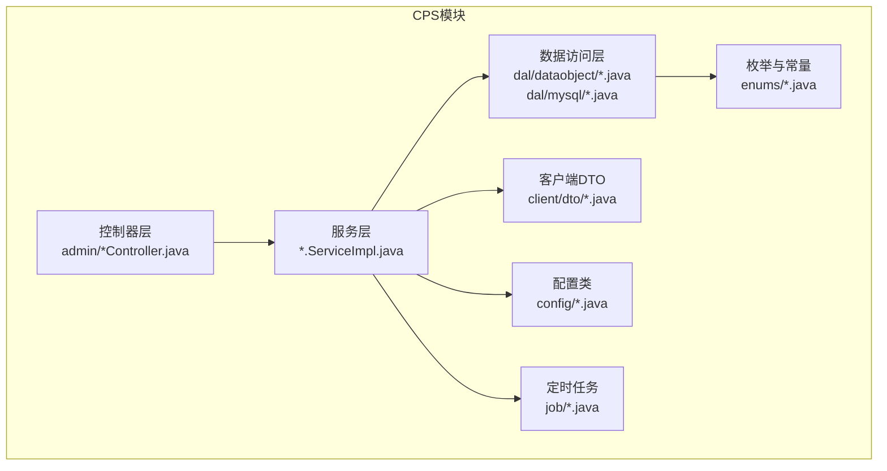
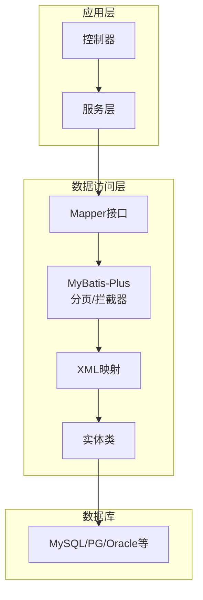
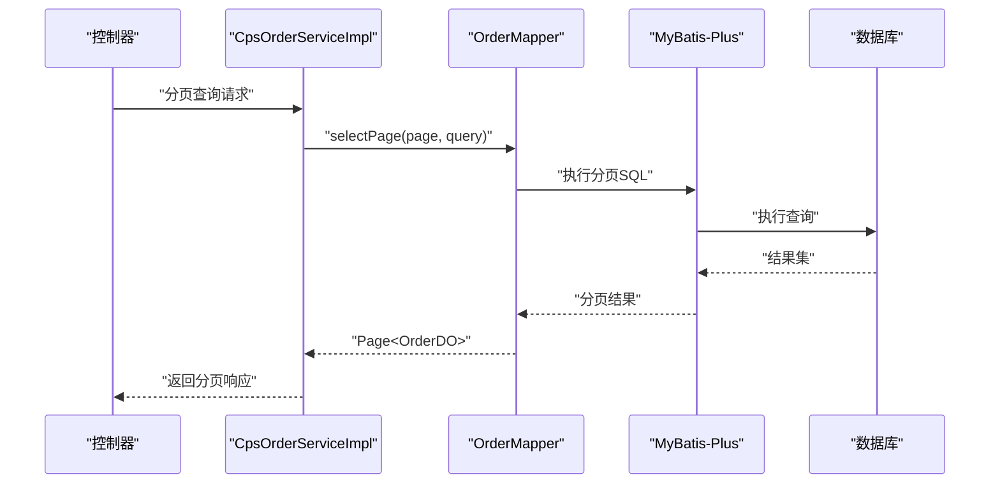
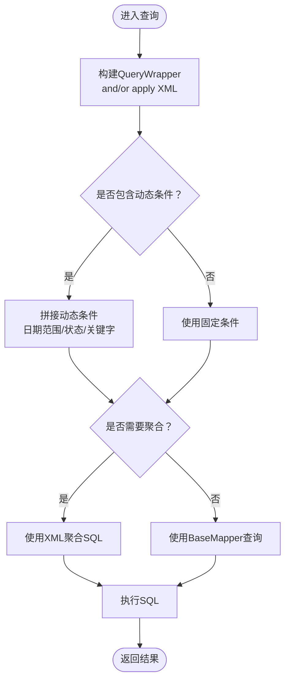
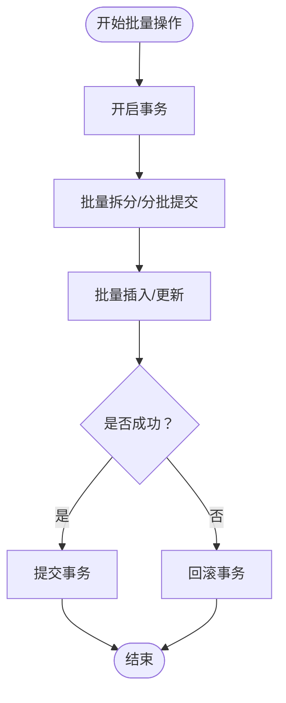
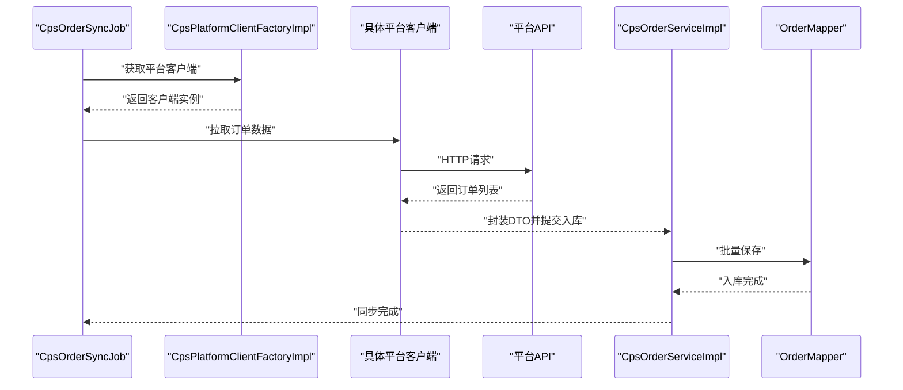
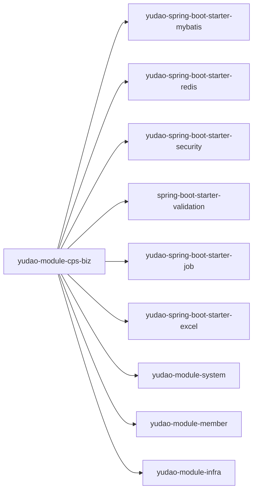

# 数据访问层实现

<cite>
**本文引用的文件**
- [YudaoMybatisAutoConfiguration.java](file://yudao-framework/yudao-spring-boot-starter-mybatis/src/main/java/cn/iocoder/yudao/framework/mybatis/config/YudaoMybatisAutoConfiguration.java)
- [YudaoMybatisAutoConfiguration.java](file://yudao-framework/yudao-spring-boot-starter-mybatis/src/main/resources/META-INF/spring/org.springframework.boot.autoconfigure.AutoConfiguration.imports)
- [pom.xml](file://yudao-module-cps/yudao-module-cps-biz/pom.xml)
- [CpsAdzoneServiceImpl.java](file://yudao-module-cps/yudao-module-cps-biz/src/main/java/cn/zhijian/cps/service/CpsAdzoneServiceImpl.java)
- [CpsOrderServiceImpl.java](file://yudao-module-cps/yudao-module-cps-biz/src/main/java/cn/zhijian/cps/service/CpsOrderServiceImpl.java)
- [CpsPlatformServiceImpl.java](file://yudao-module-cps/yudao-module-cps-biz/src/main/java/cn/zhijian/cps/service/CpsPlatformServiceImpl.java)
- [CpsRebateConfigServiceImpl.java](file://yudao-module-cps/yudao-module-cps-biz/src/main/java/cn/zhijian/cps/service/CpsRebateConfigServiceImpl.java)
- [CpsRebateRecordServiceImpl.java](file://yudao-module-cps/yudao-module-cps-biz/src/main/java/cn/zhijian/cps/service/CpsRebateRecordServiceImpl.java)
- [CpsStatisticsServiceImpl.java](file://yudao-module-cps/yudao-module-cps-biz/src/main/java/cn/zhijian/cps/service/CpsStatisticsServiceImpl.java)
- [CpsWithdrawServiceImpl.java](file://yudao-module-cps/yudao-module-cps-biz/src/main/java/cn/zhijian/cps/service/CpsWithdrawServiceImpl.java)
- [CpsAdzoneService.java](file://yudao-module-cps/yudao-module-cps-biz/src/main/java/cn/zhijian/cps/service/CpsAdzoneService.java)
- [CpsOrderService.java](file://yudao-module-cps/yudao-module-cps-biz/src/main/java/cn/zhijian/cps/service/CpsOrderService.java)
- [CpsPlatformService.java](file://yudao-module-cps/yudao-module-cps-biz/src/main/java/cn/zhijian/cps/service/CpsPlatformService.java)
- [CpsRebateConfigService.java](file://yudao-module-cps/yudao-module-cps-biz/src/main/java/cn/zhijian/cps/service/CpsRebateConfigService.java)
- [CpsRebateRecordService.java](file://yudao-module-cps/yudao-module-cps-biz/src/main/java/cn/zhijian/cps/service/CpsRebateRecordService.java)
- [CpsStatisticsService.java](file://yudao-module-cps/yudao-module-cps-biz/src/main/java/cn/zhijian/cps/service/CpsStatisticsService.java)
- [CpsWithdrawService.java](file://yudao-module-cps/yudao-module-cps-biz/src/main/java/cn/zhijian/cps/service/CpsWithdrawService.java)
- [CpsAdzoneController.java](file://yudao-module-cps/yudao-module-cps-biz/src/main/java/cn/zhijian/cps/controller/admin/CpsAdzoneController.java)
- [CpsOrderController.java](file://yudao-module-cps/yudao-module-cps-biz/src/main/java/cn/zhijian/cps/controller/admin/CpsOrderController.java)
- [CpsPlatformController.java](file://yudao-module-cps/yudao-module-cps-biz/src/main/java/cn/zhijian/cps/controller/admin/CpsPlatformController.java)
- [CpsRebateConfigController.java](file://yudao-module-cps/yudao-module-cps-biz/src/main/java/cn/zhijian/cps/controller/admin/CpsRebateConfigController.java)
- [CpsStatisticsController.java](file://yudao-module-cps/yudao-module-cps-biz/src/main/java/cn/zhijian/cps/controller/admin/CpsStatisticsController.java)
- [CpsWithdrawController.java](file://yudao-module-cps/yudao-module-cps-biz/src/main/java/cn/zhijian/cps/controller/admin/CpsWithdrawController.java)
- [CpsOrderSyncJob.java](file://yudao-module-cps/yudao-module-cps-biz/src/main/java/cn/zhijian/cps/job/CpsOrderSyncJob.java)
- [CpsPlatformClientFactoryImpl.java](file://yudao-module-cps/yudao-module-cps-biz/src/main/java/cn/zhijian/cps/client/CpsPlatformClientFactoryImpl.java)
- [DouyinCpsPlatformClient.java](file://yudao-module-cps/yudao-module-cps-biz/src/main/java/cn/zhijian/cps/client/DouyinCpsPlatformClient.java)
- [JingdongCpsPlatformClient.java](file://yudao-module-cps/yudao-module-cps-biz/src/main/java/cn/zhijian/cps/client/JingdongCpsPlatformClient.java)
- [PinduoduoCpsPlatformClient.java](file://yudao-module-cps/yudao-module-cps-biz/src/main/java/cn/zhijian/cps/client/PinduoduoCpsPlatformClient.java)
- [TaobaoCpsPlatformClient.java](file://yudao-module-cps/yudao-module-cps-biz/src/main/java/cn/zhijian/cps/client/TaobaoCpsPlatformClient.java)
- [CpsApiSignUtil.java](file://yudao-module-cps/yudao-module-cps-biz/src/main/java/cn/zhijian/cps/client/util/CpsApiSignUtil.java)
- [CpsGoodsDetail.java](file://yudao-module-cps/yudao-module-cps-biz/src/main/java/cn/zhijian/cps/client/dto/CpsGoodsDetail.java)
- [CpsGoodsSearchRequest.java](file://yudao-module-cps/yudao-module-cps-biz/src/main/java/cn/zhijian/cps/client/dto/CpsGoodsSearchRequest.java)
- [CpsOrderDTO.java](file://yudao-module-cps/yudao-module-cps-biz/src/main/java/cn/zhijian/cps/client/dto/CpsOrderDTO.java)
- [CpsOrderQueryRequest.java](file://yudao-module-cps/yudao-module-cps-biz/src/main/java/cn/zhijian/cps/client/dto/CpsOrderQueryRequest.java)
- [CpsPromotionLink.java](file://yudao-module-cps/yudao-module-cps-biz/src/main/java/cn/zhijian/cps/client/dto/CpsPromotionLink.java)
- [CpsPromotionLinkRequest.java](file://yudao-module-cps/yudao-module-cps-biz/src/main/java/cn/zhijian/cps/client/dto/CpsPromotionLinkRequest.java)
- [CpsParsedContent.java](file://yudao-module-cps/yudao-module-cps-biz/src/main/java/cn/zhijian/cps/client/dto/CpsParsedContent.java)
- [CpsGoodsDetailRequest.java](file://yudao-module-cps/yudao-module-cps-biz/src/main/java/cn/zhijian/cps/client/dto/CpsGoodsDetailRequest.java)
- [CpsGoodsSearchResult.java](file://yudao-module-cps/yudao-module-cps-biz/src/main/java/cn/zhijian/cps/client/dto/CpsGoodsSearchResult.java)
- [CpsAdzoneTypeEnum.java](file://yudao-module-cps/yudao-module-cps-biz/src/main/java/cn/zhijian/cps/enums/CpsAdzoneTypeEnum.java)
- [CpsOrderStatusEnum.java](file://yudao-module-cps/yudao-module-cps-biz/src/main/java/cn/zhijian/cps/enums/CpsOrderStatusEnum.java)
- [CpsPlatformCodeEnum.java](file://yudao-module-cps/yudao-module-cps-biz/src/main/java/cn/zhijian/cps/enums/CpsPlatformCodeEnum.java)
- [CpsRebateStatusEnum.java](file://yudao-module-cps/yudao-module-cps-biz/src/main/java/cn/zhijian/cps/enums/CpsRebateStatusEnum.java)
- [CpsRebateTypeEnum.java](file://yudao-module-cps/yudao-module-cps-biz/src/main/java/cn/zhijian/cps/enums/CpsRebateTypeEnum.java)
- [CpsWithdrawStatusEnum.java](file://yudao-module-cps/yudao-module-cps-biz/src/main/java/cn/zhijian/cps/enums/CpsWithdrawStatusEnum.java)
- [CpsWithdrawTypeEnum.java](file://yudao-module-cps/yudao-module-cps-biz/src/main/java/cn/zhijian/cps/enums/CpsWithdrawTypeEnum.java)
- [ErrorCodeConstants.java](file://yudao-module-cps/yudao-module-cps-biz/src/main/java/cn/zhijian/cps/enums/ErrorCodeConstants.java)
- [CpsAutoConfiguration.java](file://yudao-module-cps/yudao-module-cps-biz/src/main/java/cn/zhijian/cps/config/CpsAutoConfiguration.java)
- [CpsOrderSyncConfig.java](file://yudao-module-cps/yudao-module-cps-biz/src/main/java/cn/zhijian/cps/config/CpsOrderSyncConfig.java)
- [CpsProperties.java](file://yudao-module-cps/yudao-module-cps-biz/src/main/java/cn/zhijian/cps/config/CpsProperties.java)
- [cps-schema.sql](file://sql/module/cps-schema.sql)
</cite>

## 目录
1. [引言](#引言)
2. [项目结构](#项目结构)
3. [核心组件](#核心组件)
4. [架构总览](#架构总览)
5. [详细组件分析](#详细组件分析)
6. [依赖分析](#依赖分析)
7. [性能考虑](#性能考虑)
8. [故障排查指南](#故障排查指南)
9. [结论](#结论)
10. [附录](#附录)

## 引言
本文件面向AgenticCPS系统的数据访问层，系统性阐述MyBatis-Plus在CPS模块中的落地实践，包括Mapper接口设计模式、XML映射文件编写规范、实体类与数据库表的映射关系；覆盖基础CRUD、复杂查询、批量操作优化、分页查询、条件查询与动态SQL；并说明数据访问层与Service层的交互模式（事务管理、异常处理、数据验证），最后给出最佳实践与性能优化建议。

## 项目结构
CPS模块采用“controller-service-dal”三层结构，数据访问层位于dal目录下，包含dataobject（实体类）与mysql（Mapper接口）两部分。MyBatis-Plus通过自动配置完成分页插件、字段自动填充、主键生成器等基础设施，CPS模块通过依赖yudao-spring-boot-starter-mybatis获得统一能力。

图示来源
- [CpsAdzoneController.java](file://yudao-module-cps/yudao-module-cps-biz/src/main/java/cn/zhijian/cps/controller/admin/CpsAdzoneController.java)
- [CpsAdzoneServiceImpl.java](file://yudao-module-cps/yudao-module-cps-biz/src/main/java/cn/zhijian/cps/service/CpsAdzoneServiceImpl.java)
- [CpsOrderServiceImpl.java](file://yudao-module-cps/yudao-module-cps-biz/src/main/java/cn/zhijian/cps/service/CpsOrderServiceImpl.java)
- [CpsPlatformServiceImpl.java](file://yudao-module-cps/yudao-module-cps-biz/src/main/java/cn/zhijian/cps/service/CpsPlatformServiceImpl.java)
- [CpsRebateConfigServiceImpl.java](file://yudao-module-cps/yudao-module-cps-biz/src/main/java/cn/zhijian/cps/service/CpsRebateConfigServiceImpl.java)
- [CpsRebateRecordServiceImpl.java](file://yudao-module-cps/yudao-module-cps-biz/src/main/java/cn/zhijian/cps/service/CpsRebateRecordServiceImpl.java)
- [CpsStatisticsServiceImpl.java](file://yudao-module-cps/yudao-module-cps-biz/src/main/java/cn/zhijian/cps/service/CpsStatisticsServiceImpl.java)
- [CpsWithdrawServiceImpl.java](file://yudao-module-cps/yudao-module-cps-biz/src/main/java/cn/zhijian/cps/service/CpsWithdrawServiceImpl.java)

章节来源
- [pom.xml:1-122](file://yudao-module-cps/yudao-module-cps-biz/pom.xml#L1-L122)

## 核心组件
- MyBatis-Plus自动配置：提供分页插件、字段自动填充、主键生成器等基础设施，确保CPS模块统一的CRUD与查询能力。
- Mapper接口设计：遵循MyBatis-Plus约定式命名与扩展方法，优先使用IService与BaseMapper提供的通用CRUD，复杂查询通过XML或QueryWrapper实现。
- XML映射文件：仅在必要时编写（如多表关联、复杂聚合），遵循代码生成器模板与团队规范。
- 实体类与表映射：通过注解定义表名、字段映射、自动填充策略，保证与数据库schema一致。
- Service层交互：Service层负责事务边界、异常包装、数据校验与业务编排，DAO层专注数据持久化。

章节来源
- [YudaoMybatisAutoConfiguration.java:23-80](file://yudao-framework/yudao-spring-boot-starter-mybatis/src/main/java/cn/iocoder/yudao/framework/mybatis/config/YudaoMybatisAutoConfiguration.java#L23-L80)
- [YudaoMybatisAutoConfiguration.java](file://yudao-framework/yudao-spring-boot-starter-mybatis/src/main/resources/META-INF/spring/org.springframework.boot.autoconfigure.AutoConfiguration.imports)

## 架构总览
CPS模块数据访问层围绕MyBatis-Plus展开，Service层通过依赖注入获取Mapper实例，执行CRUD与复杂查询；分页查询由MyBatis-Plus分页插件统一处理；动态SQL通过QueryWrapper与XML组合实现；事务管理由Service层声明式事务控制。

图示来源
- [YudaoMybatisAutoConfiguration.java:47-54](file://yudao-framework/yudao-spring-boot-starter-mybatis/src/main/java/cn/iocoder/yudao/framework/mybatis/config/YudaoMybatisAutoConfiguration.java#L47-L54)
- [CpsAdzoneServiceImpl.java](file://yudao-module-cps/yudao-module-cps-biz/src/main/java/cn/zhijian/cps/service/CpsAdzoneServiceImpl.java)
- [CpsOrderServiceImpl.java](file://yudao-module-cps/yudao-module-cps-biz/src/main/java/cn/zhijian/cps/service/CpsOrderServiceImpl.java)

## 详细组件分析

### 组件A：订单数据访问与查询流程
该组件展示Service到Mapper再到分页插件的完整调用链，体现MyBatis-Plus在CPS订单查询中的典型用法。

图示来源
- [CpsOrderController.java](file://yudao-module-cps/yudao-module-cps-biz/src/main/java/cn/zhijian/cps/controller/admin/CpsOrderController.java)
- [CpsOrderServiceImpl.java](file://yudao-module-cps/yudao-module-cps-biz/src/main/java/cn/zhijian/cps/service/CpsOrderServiceImpl.java)
- [YudaoMybatisAutoConfiguration.java:47-54](file://yudao-framework/yudao-spring-boot-starter-mybatis/src/main/java/cn/iocoder/yudao/framework/mybatis/config/YudaoMybatisAutoConfiguration.java#L47-L54)

章节来源
- [CpsOrderController.java](file://yudao-module-cps/yudao-module-cps-biz/src/main/java/cn/zhijian/cps/controller/admin/CpsOrderController.java)
- [CpsOrderServiceImpl.java](file://yudao-module-cps/yudao-module-cps-biz/src/main/java/cn/zhijian/cps/service/CpsOrderServiceImpl.java)

### 组件B：复杂条件查询与动态SQL
该组件展示如何通过QueryWrapper构建复杂条件查询，并结合XML进行多表关联或聚合统计。

图示来源
- [CpsRebateRecordServiceImpl.java](file://yudao-module-cps/yudao-module-cps-biz/src/main/java/cn/zhijian/cps/service/CpsRebateRecordServiceImpl.java)
- [CpsStatisticsServiceImpl.java](file://yudao-module-cps/yudao-module-cps-biz/src/main/java/cn/zhijian/cps/service/CpsStatisticsServiceImpl.java)

章节来源
- [CpsRebateRecordServiceImpl.java](file://yudao-module-cps/yudao-module-cps-biz/src/main/java/cn/zhijian/cps/service/CpsRebateRecordServiceImpl.java)
- [CpsStatisticsServiceImpl.java](file://yudao-module-cps/yudao-module-cps-biz/src/main/java/cn/zhijian/cps/service/CpsStatisticsServiceImpl.java)

### 组件C：批量操作与事务管理
该组件展示批量插入/更新的优化策略与事务边界划分，确保一致性与性能。

图示来源
- [CpsRebateConfigServiceImpl.java](file://yudao-module-cps/yudao-module-cps-biz/src/main/java/cn/zhijian/cps/service/CpsRebateConfigServiceImpl.java)
- [YudaoMybatisAutoConfiguration.java:47-54](file://yudao-framework/yudao-spring-boot-starter-mybatis/src/main/java/cn/iocoder/yudao/framework/mybatis/config/YudaoMybatisAutoConfiguration.java#L47-L54)

章节来源
- [CpsRebateConfigServiceImpl.java](file://yudao-module-cps/yudao-module-cps-biz/src/main/java/cn/zhijian/cps/service/CpsRebateConfigServiceImpl.java)

### 组件D：平台对接与数据同步
该组件展示CPS平台客户端与定时任务的协作，实现订单数据的拉取与入库。

图示来源
- [CpsOrderSyncJob.java](file://yudao-module-cps/yudao-module-cps-biz/src/main/java/cn/zhijian/cps/job/CpsOrderSyncJob.java)
- [CpsPlatformClientFactoryImpl.java](file://yudao-module-cps/yudao-module-cps-biz/src/main/java/cn/zhijian/cps/client/CpsPlatformClientFactoryImpl.java)
- [DouyinCpsPlatformClient.java](file://yudao-module-cps/yudao-module-cps-biz/src/main/java/cn/zhijian/cps/client/DouyinCpsPlatformClient.java)
- [JingdongCpsPlatformClient.java](file://yudao-module-cps/yudao-module-cps-biz/src/main/java/cn/zhijian/cps/client/JingdongCpsPlatformClient.java)
- [PinduoduoCpsPlatformClient.java](file://yudao-module-cps/yudao-module-cps-biz/src/main/java/cn/zhijian/cps/client/PinduoduoCpsPlatformClient.java)
- [TaobaoCpsPlatformClient.java](file://yudao-module-cps/yudao-module-cps-biz/src/main/java/cn/zhijian/cps/client/TaobaoCpsPlatformClient.java)

章节来源
- [CpsOrderSyncJob.java](file://yudao-module-cps/yudao-module-cps-biz/src/main/java/cn/zhijian/cps/job/CpsOrderSyncJob.java)
- [CpsPlatformClientFactoryImpl.java](file://yudao-module-cps/yudao-module-cps-biz/src/main/java/cn/zhijian/cps/client/CpsPlatformClientFactoryImpl.java)

## 依赖分析
CPS模块对MyBatis-Plus与相关组件的依赖如下：

图示来源
- [pom.xml:20-118](file://yudao-module-cps/yudao-module-cps-biz/pom.xml#L20-L118)

章节来源
- [pom.xml:1-122](file://yudao-module-cps/yudao-module-cps-biz/pom.xml#L1-L122)

## 性能考虑
- 查询优化
  - 使用索引覆盖常见查询条件（如订单号、推广位、时间范围、状态），避免全表扫描。
  - 合理使用分页，避免一次性返回大量数据；对高频查询建立复合索引。
  - 对聚合统计使用专用SQL与缓存，减少重复计算。
- 缓存策略
  - 对热点数据（如平台配置、广告位信息）使用Redis缓存，设置合理TTL。
  - 对只读报表类数据采用短期缓存，结合定时刷新。
- 连接池配置
  - 结合业务QPS与数据库规格，调整连接池大小与超时参数，避免连接泄漏。
- 批量操作
  - 批量插入/更新按批次提交，避免单次事务过大；使用MyBatis-Plus的批量方法提升效率。
- 动态SQL
  - 将可复用的片段抽取为SQL片段，减少重复解析；对复杂条件使用参数化查询，避免SQL注入。

## 故障排查指南
- 分页不生效
  - 确认已引入MyBatis-Plus分页插件；检查Service层是否正确传入Page对象。
- 动态SQL报错
  - 核对XML命名空间与Mapper接口路径一致；确认条件标签与参数绑定正确。
- 主键生成异常
  - 检查实体类主键策略与数据库类型匹配；确认IKeyGenerator实现可用。
- 事务未生效
  - 确认Service方法被外部调用触发（Spring代理）；检查异常是否被吞掉导致未回滚。
- 平台同步失败
  - 查看定时任务日志与平台API返回；核对签名与参数校验。

章节来源
- [YudaoMybatisAutoConfiguration.java:47-54](file://yudao-framework/yudao-spring-boot-starter-mybatis/src/main/java/cn/iocoder/yudao/framework/mybatis/config/YudaoMybatisAutoConfiguration.java#L47-L54)
- [CpsOrderSyncJob.java](file://yudao-module-cps/yudao-module-cps-biz/src/main/java/cn/zhijian/cps/job/CpsOrderSyncJob.java)

## 结论
AgenticCPS的数据访问层以MyBatis-Plus为核心，结合统一的自动配置与Service层的事务与校验，实现了稳定高效的CRUD与复杂查询能力。通过合理的索引、缓存与批量策略，可在高并发场景下保持良好性能。建议持续关注动态SQL解析性能与连接池配置，配合监控与日志体系，保障系统长期稳定运行。

## 附录
- 数据库表结构参考：[cps-schema.sql](file://sql/module/cps-schema.sql)
- 枚举与错误码：[CpsAdzoneTypeEnum.java](file://yudao-module-cps/yudao-module-cps-biz/src/main/java/cn/zhijian/cps/enums/CpsAdzoneTypeEnum.java)，[CpsOrderStatusEnum.java](file://yudao-module-cps/yudao-module-cps-biz/src/main/java/cn/zhijian/cps/enums/CpsOrderStatusEnum.java)，[ErrorCodeConstants.java](file://yudao-module-cps/yudao-module-cps-biz/src/main/java/cn/zhijian/cps/enums/ErrorCodeConstants.java)