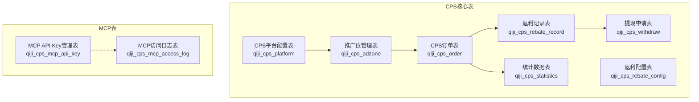
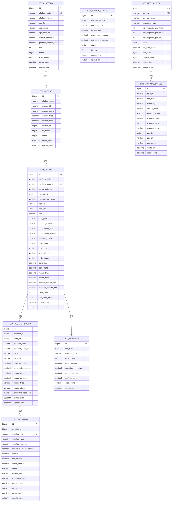
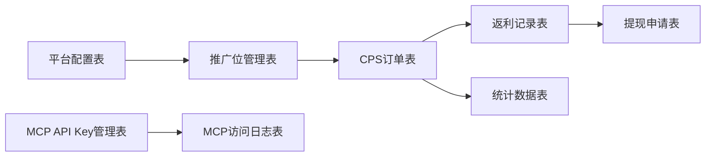

# 核心数据表结构设计

<cite>
**本文档引用的文件**
- [cps-schema.sql](file://sql/module/cps-schema.sql)
- [CpsPlatformDO.java](file://qiji-module-cps/qiji-module-cps-biz/src/main/java/cn/zhijian/cps/dal/dataobject/CpsPlatformDO.java)
- [CpsAdzoneDO.java](file://qiji-module-cps/qiji-module-cps-biz/src/main/java/cn/zhijian/cps/dal/dataobject/CpsAdzoneDO.java)
- [CpsOrderDO.java](file://qiji-module-cps/qiji-module-cps-biz/src/main/java/cn/zhijian/cps/dal/dataobject/CpsOrderDO.java)
- [CpsRebateConfigDO.java](file://qiji-module-cps/qiji-module-cps-biz/src/main/java/cn/zhijian/cps/dal/dataobject/CpsRebateConfigDO.java)
- [CpsRebateRecordDO.java](file://qiji-module-cps/qiji-module-cps-biz/src/main/java/cn/zhijian/cps/dal/dataobject/CpsRebateRecordDO.java)
- [CpsWithdrawDO.java](file://qiji-module-cps/qiji-module-cps-biz/src/main/java/cn/zhijian/cps/dal/dataobject/CpsWithdrawDO.java)
- [CpsStatisticsDO.java](file://qiji-module-cps/qiji-module-cps-biz/src/main/java/cn/zhijian/cps/dal/dataobject/CpsStatisticsDO.java)
- [CpsMcpApiKeyDO.java](file://qiji-module-cps/qiji-module-cps-biz/src/main/java/cn/zhijian/cps/dal/dataobject/CpsMcpApiKeyDO.java)
- [CpsMcpAccessLogDO.java](file://qiji-module-cps/qiji-module-cps-biz/src/main/java/cn/zhijian/cps/dal/dataobject/CpsMcpAccessLogDO.java)
- [CpsOrderStatusEnum.java](file://qiji-module-cps/qiji-module-cps-biz/src/main/java/cn/zhijian/cps/enums/CpsOrderStatusEnum.java)
- [CpsRebateTypeEnum.java](file://qiji-module-cps/qiji-module-cps-biz/src/main/java/cn/zhijian/cps/enums/CpsRebateTypeEnum.java)
- [README.md](file://README.md)
- [CPS系统PRD文档.md](file://docs/CPS系统PRD文档.md)
</cite>

## 目录
1. [简介](#简介)
2. [项目结构](#项目结构)
3. [核心组件](#核心组件)
4. [架构概览](#架构概览)
5. [详细组件分析](#详细组件分析)
6. [依赖分析](#依赖分析)
7. [性能考虑](#性能考虑)
8. [故障排查指南](#故障排查指南)
9. [结论](#结论)

## 简介
本文件面向AgenticCPS系统，提供9张核心业务表的完整数据库表结构设计文档。内容涵盖字段定义、数据类型、约束条件与索引设计，并解释每张表的业务含义与作用。同时给出字段类型选择理由、约束设计思路、索引优化策略，以及表间关系映射，帮助开发与运维人员高效理解与维护系统数据层。

## 项目结构
AgenticCPS系统的数据库表定义集中于模块化SQL脚本中，对应的核心表包括：
- CPS平台配置表：管理各CPS平台的基本信息与认证参数
- 推广位管理表：维护推广位（PID）及其归属关系
- CPS订单表：记录所有订单的详细信息与状态流转
- 返利配置表：定义不同条件下的返利规则
- 返利记录表：跟踪每次返利的执行情况与状态
- 提现申请表：管理会员的提现请求与处理状态
- 统计数据表：提供运营数据统计与聚合
- MCP API Key管理表：控制AI接口访问权限与限流
- MCP访问日志表：记录AI接口调用详情与性能指标

图表来源
- [cps-schema.sql:8-31](file://sql/module/cps-schema.sql#L8-L31)
- [cps-schema.sql:36-55](file://sql/module/cps-schema.sql#L36-L55)
- [cps-schema.sql:60-100](file://sql/module/cps-schema.sql#L60-L100)
- [cps-schema.sql:105-123](file://sql/module/cps-schema.sql#L105-L123)
- [cps-schema.sql:128-157](file://sql/module/cps-schema.sql#L128-L157)
- [cps-schema.sql:162-188](file://sql/module/cps-schema.sql#L162-L188)
- [cps-schema.sql:193-210](file://sql/module/cps-schema.sql#L193-L210)
- [cps-schema.sql:215-236](file://sql/module/cps-schema.sql#L215-L236)
- [cps-schema.sql:241-264](file://sql/module/cps-schema.sql#L241-L264)

章节来源
- [cps-schema.sql:1-265](file://sql/module/cps-schema.sql#L1-L265)
- [README.md:254-273](file://README.md#L254-L273)

## 核心组件
本节对9张核心业务表进行逐项解析，包括字段定义、数据类型、约束与索引设计，并说明其业务职责与典型使用场景。

- CPS平台配置表（qiji_cps_platform）
  - 业务职责：维护各CPS平台的基础信息、认证参数与默认推广位等
  - 关键字段与类型：平台编码（唯一）、平台名称、AppKey/AppSecret、API基础URL、默认推广位ID、服务费率、状态、排序权重、扩展配置等
  - 约束与索引：主键自增；唯一索引覆盖平台编码；支持按状态与排序权重查询
  - 设计要点：平台编码唯一确保跨平台去重；服务费率采用高精度小数类型以保证财务计算精度

- 推广位管理表（qiji_cps_adzone）
  - 业务职责：管理推广位（PID），支持通用、渠道专属、用户专属三种类型
  - 关键字段与类型：平台编码、推广位ID、推广位名称、类型、关联类型与ID、默认标记、状态等
  - 约束与索引：主键自增；索引覆盖平台编码与推广位ID；支持按平台与ID快速定位
  - 设计要点：推广位ID在平台内唯一，便于订单归因与链接生成

- CPS订单表（qiji_cps_order）
  - 业务职责：记录订单全生命周期关键节点与状态，支撑返利计算与结算
  - 关键字段与类型：平台编码与平台订单号、会员信息、商品信息、价格与优惠、佣金与返利金额、推广位ID、外部追踪参数、多阶段时间戳、状态与重试信息等
  - 约束与索引：主键自增；唯一索引覆盖平台订单号；复合索引覆盖会员ID、状态、创建时间、平台编码
  - 设计要点：多时间戳字段支持精细化运营分析；状态字段配合枚举实现强一致性

- 返利配置表（qiji_cps_rebate_config）
  - 业务职责：定义按会员等级与平台维度的返利规则，支持优先级与限额控制
  - 关键字段与类型：会员等级ID、平台编码、返利比例、最大/最小返利金额、状态、优先级等
  - 约束与索引：主键自增；索引覆盖会员等级ID与平台编码
  - 设计要点：NULL值表示无限制，灵活适配全平台或特定条件；优先级决定规则匹配顺序

- 返利记录表（qiji_cps_rebate_record）
  - 业务职责：跟踪每次返利的明细、类型与状态，支持扣回与调整
  - 关键字段与类型：会员ID、订单ID、平台编码与平台订单号、商品信息、订单金额、佣金、返利比例与金额、返利类型与状态、前序返利ID、备注等
  - 约束与索引：主键自增；索引覆盖会员ID、订单ID、平台订单号、返利类型、状态、创建时间
  - 设计要点：返利类型枚举支持入账、扣回与系统调整；前序返利ID形成扣回链路

- 提现申请表（qiji_cps_withdraw）
  - 业务职责：管理会员提现申请的全流程，包括审核、转账与状态反馈
  - 关键字段与类型：会员ID、提现单号、提现类型与账户、金额与手续费、实际到账金额、状态、交易单号与时间、错误信息等
  - 约束与索引：主键自增；唯一索引覆盖提现单号；索引覆盖会员ID、状态、创建时间
  - 设计要点：提现单号唯一避免重复处理；状态字段支持多阶段流程控制

- 统计数据表（qiji_cps_statistics）
  - 业务职责：按日聚合订单数、金额、佣金、返利与利润，支持运营看板
  - 关键字段与类型：统计日期、平台编码（含全平台汇总）、订单数、订单金额、佣金、返利、利润等
  - 约束与索引：主键自增；唯一索引覆盖统计日期与平台编码
  - 设计要点：日期+平台组合唯一确保每日全平台与分平台数据不冲突

- MCP API Key管理表（qiji_cps_mcp_api_key）
  - 业务职责：管理AI接口访问凭证，控制权限级别与限流阈值
  - 关键字段与类型：API Key（唯一）、名称、权限级别（public/member/admin）、限流配置、状态、使用统计与最后使用时间等
  - 约束与索引：主键自增；唯一索引覆盖API Key
  - 设计要点：权限级别与限流配置保障安全与稳定性

- MCP访问日志表（qiji_cps_mcp_access_log）
  - 业务职责：记录AI接口调用详情，包括Tool名称、资源URI、请求参数、响应状态与耗时
  - 关键字段与类型：API Key、Tool名称、资源URI、Prompt名称、请求参数（脱敏）、响应状态、耗时、错误信息、用户ID/IP/User-Agent等
  - 约束与索引：主键自增；索引覆盖API Key、Tool名称、创建时间
  - 设计要点：请求参数脱敏保护隐私；耗时与错误信息便于性能与问题定位

章节来源
- [cps-schema.sql:8-31](file://sql/module/cps-schema.sql#L8-L31)
- [cps-schema.sql:36-55](file://sql/module/cps-schema.sql#L36-L55)
- [cps-schema.sql:60-100](file://sql/module/cps-schema.sql#L60-L100)
- [cps-schema.sql:105-123](file://sql/module/cps-schema.sql#L105-L123)
- [cps-schema.sql:128-157](file://sql/module/cps-schema.sql#L128-L157)
- [cps-schema.sql:162-188](file://sql/module/cps-schema.sql#L162-L188)
- [cps-schema.sql:193-210](file://sql/module/cps-schema.sql#L193-L210)
- [cps-schema.sql:215-236](file://sql/module/cps-schema.sql#L215-L236)
- [cps-schema.sql:241-264](file://sql/module/cps-schema.sql#L241-L264)

## 架构概览
下图展示了9张核心表之间的逻辑关系与数据流向，体现从平台配置、推广位到订单、返利、提现与统计的整体闭环，以及MCP接口的鉴权与审计能力。

图表来源
- [cps-schema.sql:8-31](file://sql/module/cps-schema.sql#L8-L31)
- [cps-schema.sql:36-55](file://sql/module/cps-schema.sql#L36-L55)
- [cps-schema.sql:60-100](file://sql/module/cps-schema.sql#L60-L100)
- [cps-schema.sql:105-123](file://sql/module/cps-schema.sql#L105-L123)
- [cps-schema.sql:128-157](file://sql/module/cps-schema.sql#L128-L157)
- [cps-schema.sql:162-188](file://sql/module/cps-schema.sql#L162-L188)
- [cps-schema.sql:193-210](file://sql/module/cps-schema.sql#L193-L210)
- [cps-schema.sql:215-236](file://sql/module/cps-schema.sql#L215-L236)
- [cps-schema.sql:241-264](file://sql/module/cps-schema.sql#L241-L264)

## 详细组件分析

### 表：CPS平台配置表（qiji_cps_platform）
- 字段设计要点
  - 平台编码：唯一标识，便于跨表关联与去重
  - AppKey/AppSecret：敏感字段，建议加密存储并严格权限控制
  - 默认推广位ID：用于新推广位生成与订单归因
  - 服务费率：采用高精度小数类型，满足财务计算需求
  - 状态与排序：支持启用禁用与展示权重
- 约束与索引
  - 主键自增
  - 唯一索引覆盖平台编码
- 业务意义
  - 作为上游平台接入的唯一入口，统一认证与配置管理

章节来源
- [cps-schema.sql:8-31](file://sql/module/cps-schema.sql#L8-L31)
- [CpsPlatformDO.java:21-81](file://qiji-module-cps/qiji-module-cps-biz/src/main/java/cn/zhijian/cps/dal/dataobject/CpsPlatformDO.java#L21-L81)

### 表：推广位管理表（qiji_cps_adzone）
- 字段设计要点
  - 推广位ID：在平台内唯一，用于链接生成与订单归因
  - 类型字段：区分通用、渠道专属、用户专属，便于精细化运营
  - 关联关系：支持与渠道或用户的绑定，提升推广效果追踪
- 约束与索引
  - 主键自增
  - 索引覆盖平台编码与推广位ID
- 业务意义
  - 为订单归因与收益分配提供基础数据支撑

章节来源
- [cps-schema.sql:36-55](file://sql/module/cps-schema.sql#L36-L55)
- [CpsAdzoneDO.java:19-43](file://qiji-module-cps/qiji-module-cps-biz/src/main/java/cn/zhijian/cps/dal/dataobject/CpsAdzoneDO.java#L19-L43)

### 表：CPS订单表（qiji_cps_order）
- 字段设计要点
  - 订单状态：使用枚举值，确保状态机一致性
  - 价格与返利：采用高精度小数类型，避免累计误差
  - 时间戳：多阶段时间记录，支撑运营分析与对账
- 约束与索引
  - 主键自增
  - 唯一索引覆盖平台订单号
  - 复合索引覆盖会员ID、状态、创建时间、平台编码
- 业务意义
  - 订单是返利计算与结算的核心依据

章节来源
- [cps-schema.sql:60-100](file://sql/module/cps-schema.sql#L60-L100)
- [CpsOrderDO.java:22-80](file://qiji-module-cps/qiji-module-cps-biz/src/main/java/cn/zhijian/cps/dal/dataobject/CpsOrderDO.java#L22-L80)
- [CpsOrderStatusEnum.java:11-30](file://qiji-module-cps/qiji-module-cps-biz/src/main/java/cn/zhijian/cps/enums/CpsOrderStatusEnum.java#L11-L30)

### 表：返利配置表（qiji_cps_rebate_config）
- 字段设计要点
  - 会员等级与平台维度：支持差异化返利策略
  - 限额控制：最大/最小返利金额，防止异常波动
  - 优先级：决定规则匹配顺序
- 约束与索引
  - 主键自增
  - 索引覆盖会员等级ID与平台编码
- 业务意义
  - 为返利计算提供规则基线

章节来源
- [cps-schema.sql:105-123](file://sql/module/cps-schema.sql#L105-L123)
- [CpsRebateConfigDO.java:21-41](file://qiji-module-cps/qiji-module-cps-biz/src/main/java/cn/zhijian/cps/dal/dataobject/CpsRebateConfigDO.java#L21-L41)

### 表：返利记录表（qiji_cps_rebate_record）
- 字段设计要点
  - 返利类型：入账、扣回、调整，支持合规审计
  - 状态字段：待结算、已到账、已扣回
  - 前序返利ID：形成扣回链路，便于追溯
- 约束与索引
  - 主键自增
  - 索引覆盖会员ID、订单ID、平台订单号、类型、状态、创建时间
- 业务意义
  - 详单追踪与财务对账的关键

章节来源
- [cps-schema.sql:128-157](file://sql/module/cps-schema.sql#L128-L157)
- [CpsRebateRecordDO.java:21-55](file://qiji-module-cps/qiji-module-cps-biz/src/main/java/cn/zhijian/cps/dal/dataobject/CpsRebateRecordDO.java#L21-L55)
- [CpsRebateTypeEnum.java:11-20](file://qiji-module-cps/qiji-module-cps-biz/src/main/java/cn/zhijian/cps/enums/CpsRebateTypeEnum.java#L11-L20)

### 表：提现申请表（qiji_cps_withdraw）
- 字段设计要点
  - 提现类型：支持支付宝、微信、银行卡
  - 金额与手续费：分离计算，便于财务处理
  - 状态：覆盖申请、审核、转账、失败与退回
- 约束与索引
  - 主键自增
  - 唯一索引覆盖提现单号
  - 索引覆盖会员ID、状态、创建时间
- 业务意义
  - 会员资金出账的唯一凭证

章节来源
- [cps-schema.sql:162-188](file://sql/module/cps-schema.sql#L162-L188)
- [CpsWithdrawDO.java:22-54](file://qiji-module-cps/qiji-module-cps-biz/src/main/java/cn/zhijian/cps/dal/dataobject/CpsWithdrawDO.java#L22-L54)

### 表：统计数据表（qiji_cps_statistics）
- 字段设计要点
  - 统计维度：按日与平台聚合
  - 指标：订单数、金额、佣金、返利、利润
- 约束与索引
  - 主键自增
  - 唯一索引覆盖统计日期与平台编码
- 业务意义
  - 支撑运营看板与趋势分析

章节来源
- [cps-schema.sql:193-210](file://sql/module/cps-schema.sql#L193-L210)
- [CpsStatisticsDO.java:22-42](file://qiji-module-cps/qiji-module-cps-biz/src/main/java/cn/zhijian/cps/dal/dataobject/CpsStatisticsDO.java#L22-L42)

### 表：MCP API Key管理表（qiji_cps_mcp_api_key）
- 字段设计要点
  - 权限级别：public/member/admin，满足不同场景
  - 限流配置：分钟/小时/天三级限流，保障系统稳定
  - 使用统计：总调用次数与成功次数，便于监控
- 约证与索引
  - 主键自增
  - 唯一索引覆盖API Key
- 业务意义
  - MCP接口安全与治理的核心

章节来源
- [cps-schema.sql:215-236](file://sql/module/cps-schema.sql#L215-L236)
- [CpsMcpApiKeyDO.java:21-49](file://qiji-module-cps/qiji-module-cps-biz/src/main/java/cn/zhijian/cps/dal/dataobject/CpsMcpApiKeyDO.java#L21-L49)
- [CPS系统PRD文档.md:698-737](file://docs/CPS系统PRD文档.md#L698-L737)

### 表：MCP访问日志表（qiji_cps_mcp_access_log）
- 字段设计要点
  - 调用上下文：Tool名称、资源URI、Prompt名称
  - 性能指标：响应状态与耗时
  - 安全审计：请求参数脱敏、用户IP与UA
- 约束与索引
  - 主键自增
  - 索引覆盖API Key、Tool名称、创建时间
- 业务意义
  - MCP调用审计与问题定位的基础

章节来源
- [cps-schema.sql:241-264](file://sql/module/cps-schema.sql#L241-L264)
- [CpsMcpAccessLogDO.java:19-47](file://qiji-module-cps/qiji-module-cps-biz/src/main/java/cn/zhijian/cps/dal/dataobject/CpsMcpAccessLogDO.java#L19-L47)
- [CPS系统PRD文档.md:735-737](file://docs/CPS系统PRD文档.md#L735-L737)

## 依赖分析
- 表间依赖关系
  - 平台配置表与推广位管理表：一对多，推广位归属平台
  - 推广位与订单表：一对多，订单通过推广位ID归因
  - 订单与返利记录表：一对多，订单触发返利记录生成
  - 返利记录与提现申请表：间接关联，提现通常基于返利记录
  - 订单与统计数据表：按日聚合，形成运营报表数据源
  - API Key与访问日志表：一对多，日志记录API Key使用情况
- 约束与一致性
  - 唯一索引确保跨表引用的准确性（平台订单号、提现单号、API Key、平台编码）
  - 状态枚举与类型枚举约束取值范围，减少脏数据风险

图表来源
- [cps-schema.sql:8-31](file://sql/module/cps-schema.sql#L8-L31)
- [cps-schema.sql:36-55](file://sql/module/cps-schema.sql#L36-L55)
- [cps-schema.sql:60-100](file://sql/module/cps-schema.sql#L60-L100)
- [cps-schema.sql:128-157](file://sql/module/cps-schema.sql#L128-L157)
- [cps-schema.sql:162-188](file://sql/module/cps-schema.sql#L162-L188)
- [cps-schema.sql:193-210](file://sql/module/cps-schema.sql#L193-L210)
- [cps-schema.sql:215-236](file://sql/module/cps-schema.sql#L215-L236)
- [cps-schema.sql:241-264](file://sql/module/cps-schema.sql#L241-L264)

## 性能考虑
- 索引策略
  - 订单表：按会员ID、状态、创建时间建立复合索引，支撑高频查询与分页
  - 日志与统计：按时间字段建立索引，便于滚动窗口统计与趋势分析
  - 唯一索引：订单号、提现单号、API Key等关键字段唯一，避免重复与并发冲突
- 数据类型选择
  - 金额与比率采用高精度小数类型，降低财务计算误差
  - 时间戳使用精确时间类型，便于跨时区与审计
- 分区与归档
  - 建议按时间维度对订单与日志表进行分区或归档，控制热数据规模
- 读写分离
  - 统计与日志写入压力较大，可考虑独立实例或异步落盘

## 故障排查指南
- 常见问题定位
  - 订单状态异常：检查订单表状态字段与状态枚举值，核对同步重试次数与错误信息
  - 返利未到账：核对返利记录类型与状态，检查是否存在扣回链路
  - 提现失败：查看提现状态与转账错误信息，核对账户与手续费配置
  - MCP调用异常：查看访问日志响应状态与耗时，结合API Key限流配置排查
- 建议流程
  - 以唯一标识（平台订单号、提现单号、API Key）快速定位记录
  - 通过索引覆盖字段缩小查询范围
  - 结合创建时间与状态索引进行分页与排序

章节来源
- [CpsOrderDO.java:60-77](file://qiji-module-cps/qiji-module-cps-biz/src/main/java/cn/zhijian/cps/dal/dataobject/CpsOrderDO.java#L60-L77)
- [CpsRebateRecordDO.java:45-50](file://qiji-module-cps/qiji-module-cps-biz/src/main/java/cn/zhijian/cps/dal/dataobject/CpsRebateRecordDO.java#L45-L50)
- [CpsWithdrawDO.java:42-51](file://qiji-module-cps/qiji-module-cps-biz/src/main/java/cn/zhijian/cps/dal/dataobject/CpsWithdrawDO.java#L42-L51)
- [CpsMcpAccessLogDO.java:33-37](file://qiji-module-cps/qiji-module-cps-biz/src/main/java/cn/zhijian/cps/dal/dataobject/CpsMcpAccessLogDO.java#L33-L37)

## 结论
本文档系统梳理了AgenticCPS系统的9张核心业务表，明确了字段设计、约束与索引策略，并阐述了表间关系与业务职责。通过合理的数据类型选择、索引优化与状态/类型枚举约束，系统在保证数据一致性的同时，兼顾了性能与可维护性。建议在生产环境中结合业务增长持续优化分区与归档策略，并完善监控告警体系以保障系统稳定运行。