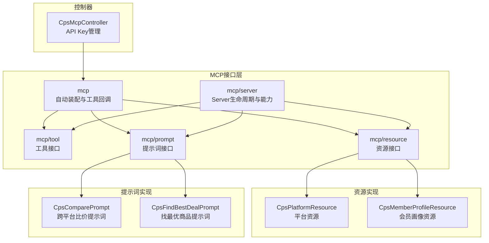
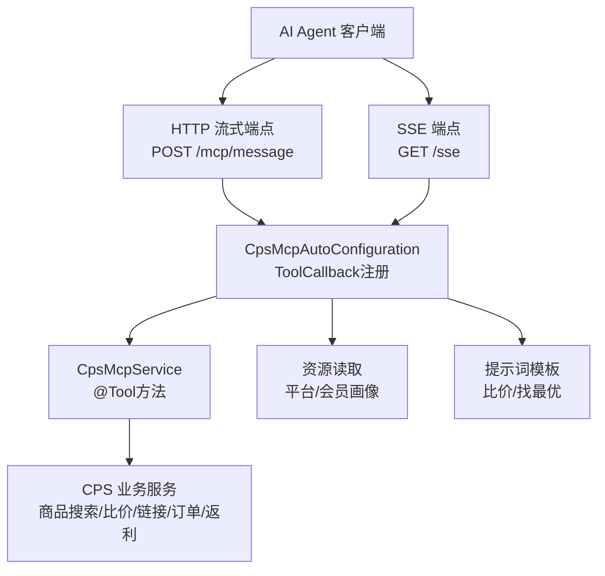
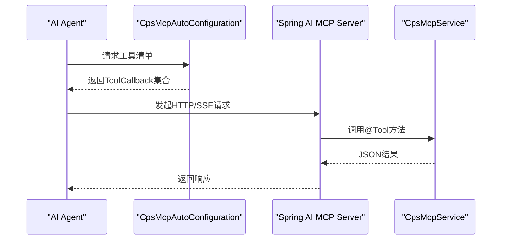
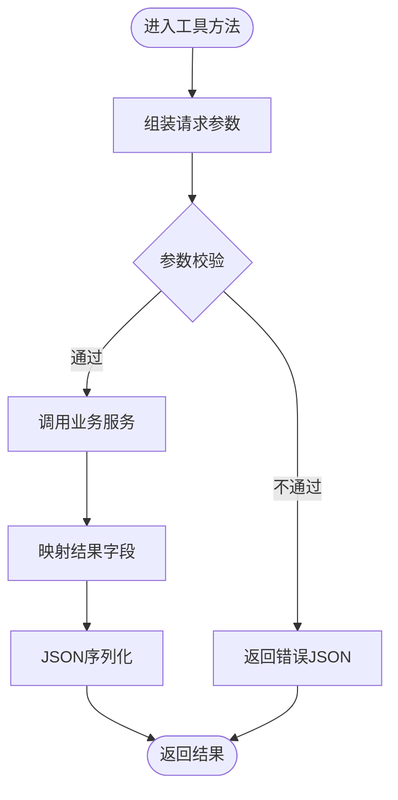
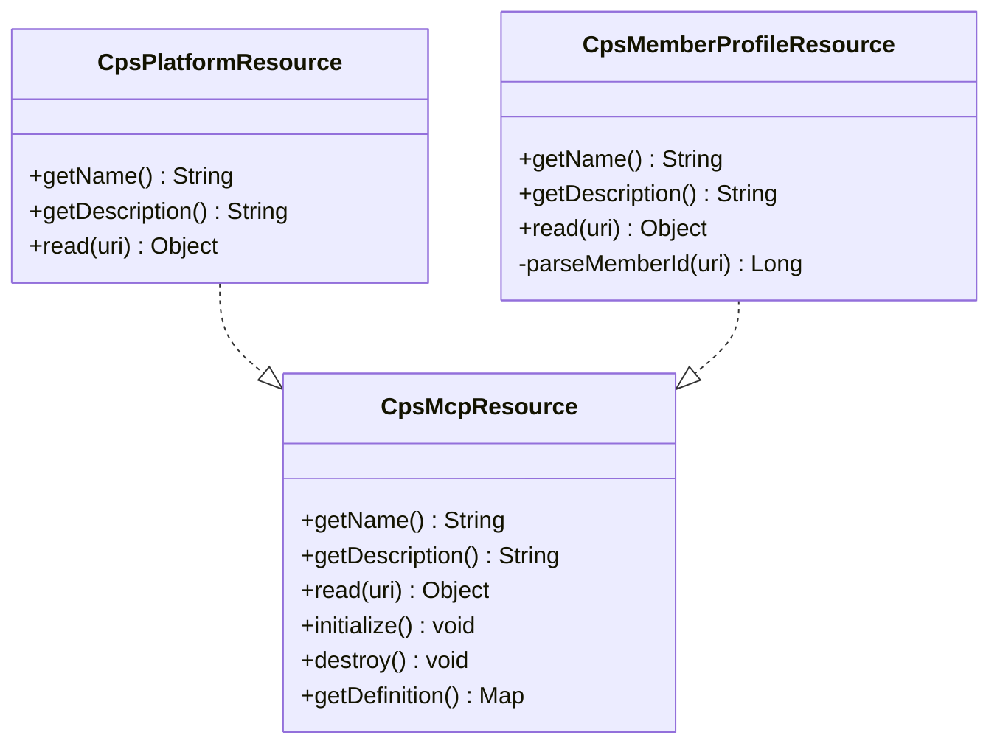
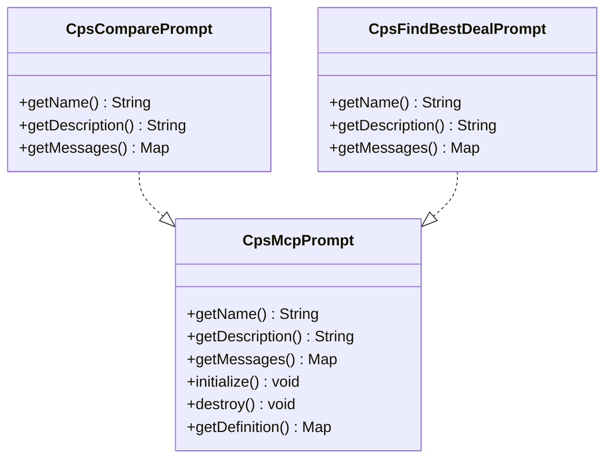
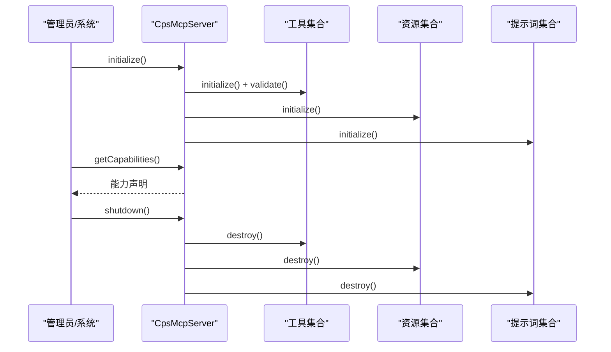
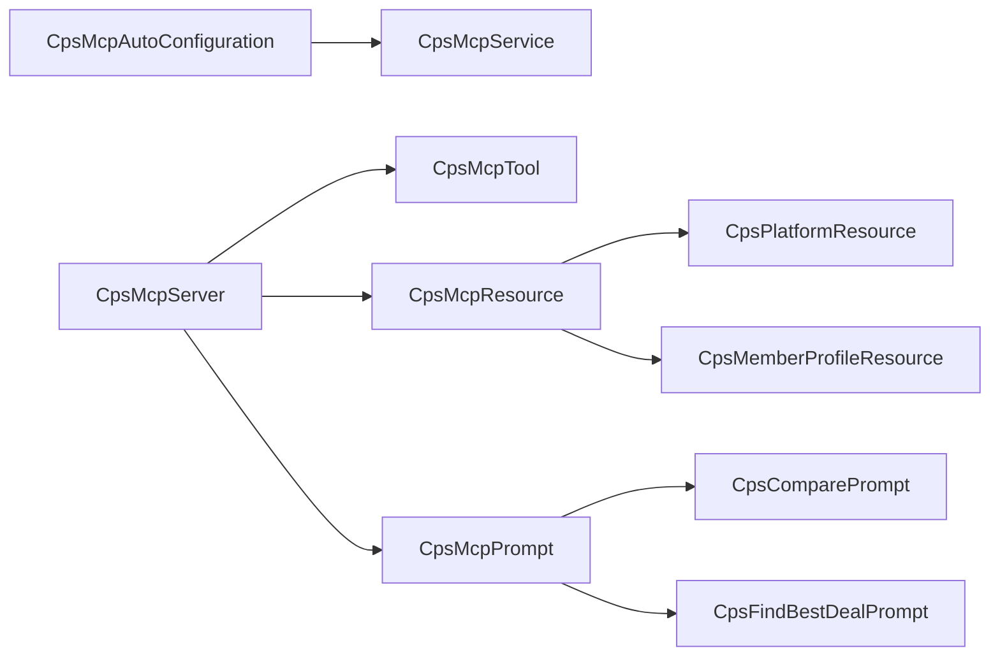

# AI MCP接口层

<cite>
**本文引用的文件**
- [CpsMcpAutoConfiguration.java](file://yudao-module-cps/yudao-module-cps-biz/src/main/java/cn/zhijian/cps/mcp/CpsMcpAutoConfiguration.java)
- [CpsMcpService.java](file://yudao-module-cps/yudao-module-cps-biz/src/main/java/cn/zhijian/cps/mcp/CpsMcpService.java)
- [CpsMcpServer.java](file://yudao-module-cps/yudao-module-cps-biz/src/main/java/cn/zhijian/cps/mcp/server/CpsMcpServer.java)
- [CpsMcpTool.java](file://yudao-module-cps/yudao-module-cps-biz/src/main/java/cn/zhijian/cps/mcp/tool/CpsMcpTool.java)
- [CpsMcpResource.java](file://yudao-module-cps/yudao-module-cps-biz/src/main/java/cn/zhijian/cps/mcp/resource/CpsMcpResource.java)
- [CpsMcpPrompt.java](file://yudao-module-cps/yudao-module-cps-biz/src/main/java/cn/zhijian/cps/mcp/prompt/CpsMcpPrompt.java)
- [CpsPlatformResource.java](file://yudao-module-cps/yudao-module-cps-biz/src/main/java/cn/zhijian/cps/mcp/resource/CpsPlatformResource.java)
- [CpsMemberProfileResource.java](file://yudao-module-cps/yudao-module-cps-biz/src/main/java/cn/zhijian/cps/mcp/resource/CpsMemberProfileResource.java)
- [CpsComparePrompt.java](file://yudao-module-cps/yudao-module-cps-biz/src/main/java/cn/zhijian/cps/mcp/prompt/CpsComparePrompt.java)
- [CpsFindBestDealPrompt.java](file://yudao-module-cps/yudao-module-cps-biz/src/main/java/cn/zhijian/cps/mcp/prompt/CpsFindBestDealPrompt.java)
- [SecurityConfiguration.java](file://yudao-module-ai/src/main/java/cn/iocoder/yudao/module/ai/framework/security/config/SecurityConfiguration.java)
- [CpsMcpController.java](file://yudao-module-cps/yudao-module-cps-biz/src/main/java/cn/zhijian/cps/controller/admin/CpsMcpController.java)
</cite>

## 目录
1. [引言](#引言)
2. [项目结构](#项目结构)
3. [核心组件](#核心组件)
4. [架构总览](#架构总览)
5. [详细组件分析](#详细组件分析)
6. [依赖分析](#依赖分析)
7. [性能考虑](#性能考虑)
8. [故障排查指南](#故障排查指南)
9. [结论](#结论)
10. [附录](#附录)

## 引言
本技术文档面向AI MCP接口层，围绕MCP（Model Context Protocol）协议在AgenticCPS系统中的实现与应用展开，重点覆盖以下方面：
- MCP Server的启动配置与协议能力声明
- MCP工具函数的注册、参数校验、执行流程与结果返回
- MCP资源管理（平台资源、模型资源、配置资源）与访问控制
- MCP提示词工程（模板设计、参数化配置、动态生成）
- MCP接口安全机制（身份认证、权限控制、访问审计、数据加密）
- 使用指南（客户端连接、工具调用、资源访问、错误处理）
- 在AgenticCPS系统中通过MCP协议实现AI Agent的智能服务集成方案

## 项目结构
MCP接口层位于“yudao-module-cps”模块的“biz”子模块中，采用分层与职责分离的设计：
- mcp：MCP核心抽象与自动装配
- mcp/server：MCP Server生命周期与能力声明
- mcp/tool：MCP工具接口
- mcp/resource：MCP资源接口与具体资源实现
- mcp/prompt：MCP提示词接口与具体提示词实现
- controller/admin：MCP API Key管理与访问日志等管理端接口

图表来源
- [CpsMcpAutoConfiguration.java:1-38](file://yudao-module-cps/yudao-module-cps-biz/src/main/java/cn/zhijian/cps/mcp/CpsMcpAutoConfiguration.java#L1-L38)
- [CpsMcpServer.java:1-184](file://yudao-module-cps/yudao-module-cps-biz/src/main/java/cn/zhijian/cps/mcp/server/CpsMcpServer.java#L1-L184)
- [CpsMcpTool.java:1-63](file://yudao-module-cps/yudao-module-cps-biz/src/main/java/cn/zhijian/cps/mcp/tool/CpsMcpTool.java#L1-L63)
- [CpsMcpResource.java:1-52](file://yudao-module-cps/yudao-module-cps-biz/src/main/java/cn/zhijian/cps/mcp/resource/CpsMcpResource.java#L1-L52)
- [CpsMcpPrompt.java:1-53](file://yudao-module-cps/yudao-module-cps-biz/src/main/java/cn/zhijian/cps/mcp/prompt/CpsMcpPrompt.java#L1-L53)
- [CpsPlatformResource.java:1-78](file://yudao-module-cps/yudao-module-cps-biz/src/main/java/cn/zhijian/cps/mcp/resource/CpsPlatformResource.java#L1-L78)
- [CpsMemberProfileResource.java:1-108](file://yudao-module-cps/yudao-module-cps-biz/src/main/java/cn/zhijian/cps/mcp/resource/CpsMemberProfileResource.java#L1-L108)
- [CpsComparePrompt.java:1-68](file://yudao-module-cps/yudao-module-cps-biz/src/main/java/cn/zhijian/cps/mcp/prompt/CpsComparePrompt.java#L1-L68)
- [CpsFindBestDealPrompt.java:1-60](file://yudao-module-cps/yudao-module-cps-biz/src/main/java/cn/zhijian/cps/mcp/prompt/CpsFindBestDealPrompt.java#L1-L60)
- [CpsMcpController.java:30-59](file://yudao-module-cps/yudao-module-cps-biz/src/main/java/cn/zhijian/cps/controller/admin/CpsMcpController.java#L30-L59)

章节来源
- [CpsMcpAutoConfiguration.java:1-38](file://yudao-module-cps/yudao-module-cps-biz/src/main/java/cn/zhijian/cps/mcp/CpsMcpAutoConfiguration.java#L1-L38)
- [CpsMcpServer.java:1-184](file://yudao-module-cps/yudao-module-cps-biz/src/main/java/cn/zhijian/cps/mcp/server/CpsMcpServer.java#L1-L184)

## 核心组件
- 自动装配与工具回调
  - 通过自动配置类将CpsMcpService中的@Tool方法注册为MCP工具回调，供Spring AI MCP Server暴露HTTP/SSE端点。
- MCP工具服务
  - 提供商品搜索、跨平台比价、推广链接生成、订单状态查询、返利汇总等工具方法，统一以JSON字符串返回结果。
- MCP Server
  - 统一管理工具、资源、提示词的生命周期，声明Server能力（tools/resources/prompts），并提供能力查询与调用入口。
- 资源与提示词
  - 定义资源与提示词的通用接口，并提供平台资源、会员画像资源以及跨平台比价、找最优商品等提示词实现。

章节来源
- [CpsMcpAutoConfiguration.java:1-38](file://yudao-module-cps/yudao-module-cps-biz/src/main/java/cn/zhijian/cps/mcp/CpsMcpAutoConfiguration.java#L1-L38)
- [CpsMcpService.java:1-295](file://yudao-module-cps/yudao-module-cps-biz/src/main/java/cn/zhijian/cps/mcp/CpsMcpService.java#L1-L295)
- [CpsMcpServer.java:1-184](file://yudao-module-cps/yudao-module-cps-biz/src/main/java/cn/zhijian/cps/mcp/server/CpsMcpServer.java#L1-L184)
- [CpsMcpTool.java:1-63](file://yudao-module-cps/yudao-module-cps-biz/src/main/java/cn/zhijian/cps/mcp/tool/CpsMcpTool.java#L1-L63)
- [CpsMcpResource.java:1-52](file://yudao-module-cps/yudao-module-cps-biz/src/main/java/cn/zhijian/cps/mcp/resource/CpsMcpResource.java#L1-L52)
- [CpsMcpPrompt.java:1-53](file://yudao-module-cps/yudao-module-cps-biz/src/main/java/cn/zhijian/cps/mcp/prompt/CpsMcpPrompt.java#L1-L53)

## 架构总览
MCP接口层基于Spring AI MCP Server实现，结合AgenticCPS业务能力，形成“工具+资源+提示词”的统一服务面，对外提供HTTP流式与SSE两种接入方式。

图表来源
- [CpsMcpAutoConfiguration.java:10-21](file://yudao-module-cps/yudao-module-cps-biz/src/main/java/cn/zhijian/cps/mcp/CpsMcpAutoConfiguration.java#L10-L21)
- [SecurityConfiguration.java:25-42](file://yudao-module-ai/src/main/java/cn/iocoder/yudao/module/ai/framework/security/config/SecurityConfiguration.java#L25-L42)

## 详细组件分析

### 自动装配与工具回调
- 作用
  - 将CpsMcpService中的@Tool方法封装为ToolCallback，由Spring AI MCP Server自动发现并暴露在默认端点。
- 关键点
  - 端点类型：HTTP流式（POST /mcp/message）与SSE（GET /sse）。
  - 权限放行：通过安全配置类对MCP端点进行放行，便于Agent连接。

图表来源
- [CpsMcpAutoConfiguration.java:22-37](file://yudao-module-cps/yudao-module-cps-biz/src/main/java/cn/zhijian/cps/mcp/CpsMcpAutoConfiguration.java#L22-L37)
- [SecurityConfiguration.java:25-42](file://yudao-module-ai/src/main/java/cn/iocoder/yudao/module/ai/framework/security/config/SecurityConfiguration.java#L25-L42)

章节来源
- [CpsMcpAutoConfiguration.java:1-38](file://yudao-module-cps/yudao-module-cps-biz/src/main/java/cn/zhijian/cps/mcp/CpsMcpAutoConfiguration.java#L1-L38)
- [SecurityConfiguration.java:1-42](file://yudao-module-ai/src/main/java/cn/iocoder/yudao/module/ai/framework/security/config/SecurityConfiguration.java#L1-L42)

### MCP工具函数实现机制
- 工具注册
  - 通过@Tool注解声明工具名称、描述与参数Schema；CpsMcpService统一作为工具回调源。
- 参数校验
  - 使用@ToolParam标记必填与描述；服务内部进行空值与范围校验（如分页大小限制）。
- 执行流程
  - 组装请求参数 → 调用业务服务 → 结果映射 → JSON序列化返回。
- 结果返回
  - 统一以JSON字符串返回，包含总数、列表或错误信息，便于Agent解析。

图表来源
- [CpsMcpService.java:50-104](file://yudao-module-cps/yudao-module-cps-biz/src/main/java/cn/zhijian/cps/mcp/CpsMcpService.java#L50-L104)
- [CpsMcpService.java:106-161](file://yudao-module-cps/yudao-module-cps-biz/src/main/java/cn/zhijian/cps/mcp/CpsMcpService.java#L106-L161)
- [CpsMcpService.java:163-193](file://yudao-module-cps/yudao-module-cps-biz/src/main/java/cn/zhijian/cps/mcp/CpsMcpService.java#L163-L193)
- [CpsMcpService.java:195-238](file://yudao-module-cps/yudao-module-cps-biz/src/main/java/cn/zhijian/cps/mcp/CpsMcpService.java#L195-L238)
- [CpsMcpService.java:240-277](file://yudao-module-cps/yudao-module-cps-biz/src/main/java/cn/zhijian/cps/mcp/CpsMcpService.java#L240-L277)

章节来源
- [CpsMcpService.java:1-295](file://yudao-module-cps/yudao-module-cps-biz/src/main/java/cn/zhijian/cps/mcp/CpsMcpService.java#L1-L295)

### MCP资源管理
- 资源接口
  - CpsMcpResource定义资源名称、描述、读取、初始化与销毁等通用能力。
- 平台资源
  - CpsPlatformResource提供平台列表与状态，支持分页查询并返回JSON。
- 会员画像资源
  - CpsMemberProfileResource根据URI中的memberId解析并返回账户画像信息，包含可用余额、冻结余额、累计返利等。
- 访问控制
  - 资源读取通过URI前缀匹配，支持按路径片段解析参数。

图表来源
- [CpsMcpResource.java:1-52](file://yudao-module-cps/yudao-module-cps-biz/src/main/java/cn/zhijian/cps/mcp/resource/CpsMcpResource.java#L1-L52)
- [CpsPlatformResource.java:1-78](file://yudao-module-cps/yudao-module-cps-biz/src/main/java/cn/zhijian/cps/mcp/resource/CpsPlatformResource.java#L1-L78)
- [CpsMemberProfileResource.java:1-108](file://yudao-module-cps/yudao-module-cps-biz/src/main/java/cn/zhijian/cps/mcp/resource/CpsMemberProfileResource.java#L1-L108)

章节来源
- [CpsMcpResource.java:1-52](file://yudao-module-cps/yudao-module-cps-biz/src/main/java/cn/zhijian/cps/mcp/resource/CpsMcpResource.java#L1-L52)
- [CpsPlatformResource.java:1-78](file://yudao-module-cps/yudao-module-cps-biz/src/main/java/cn/zhijian/cps/mcp/resource/CpsPlatformResource.java#L1-L78)
- [CpsMemberProfileResource.java:1-108](file://yudao-module-cps/yudao-module-cps-biz/src/main/java/cn/zhijian/cps/mcp/resource/CpsMemberProfileResource.java#L1-L108)

### MCP提示词工程
- 提示词接口
  - CpsMcpPrompt定义名称、消息体、初始化与销毁等能力。
- 跨平台比价提示词
  - 设计系统角色指令，引导Agent调用比价工具与链接生成工具，输出结构化表格与推荐理由。
- 找最优商品提示词
  - 针对“最便宜/性价比最高”场景，指导Agent进行跨平台比价与推荐，强调实际到手价与返利。

图表来源
- [CpsMcpPrompt.java:1-53](file://yudao-module-cps/yudao-module-cps-biz/src/main/java/cn/zhijian/cps/mcp/prompt/CpsMcpPrompt.java#L1-L53)
- [CpsComparePrompt.java:1-68](file://yudao-module-cps/yudao-module-cps-biz/src/main/java/cn/zhijian/cps/mcp/prompt/CpsComparePrompt.java#L1-L68)
- [CpsFindBestDealPrompt.java:1-60](file://yudao-module-cps/yudao-module-cps-biz/src/main/java/cn/zhijian/cps/mcp/prompt/CpsFindBestDealPrompt.java#L1-L60)

章节来源
- [CpsMcpPrompt.java:1-53](file://yudao-module-cps/yudao-module-cps-biz/src/main/java/cn/zhijian/cps/mcp/prompt/CpsMcpPrompt.java#L1-L53)
- [CpsComparePrompt.java:1-68](file://yudao-module-cps/yudao-module-cps-biz/src/main/java/cn/zhijian/cps/mcp/prompt/CpsComparePrompt.java#L1-L68)
- [CpsFindBestDealPrompt.java:1-60](file://yudao-module-cps/yudao-module-cps-biz/src/main/java/cn/zhijian/cps/mcp/prompt/CpsFindBestDealPrompt.java#L1-L60)

### MCP Server生命周期与能力声明
- 生命周期
  - 初始化：依次初始化工具、资源、提示词并进行校验；关闭时释放资源。
- 能力声明
  - 声明tools/resources/prompts的能力项与serverInfo，供Agent发现与协商。
- 调用入口
  - 提供工具调用、资源读取、提示词获取等统一入口。

图表来源
- [CpsMcpServer.java:35-82](file://yudao-module-cps/yudao-module-cps-biz/src/main/java/cn/zhijian/cps/mcp/server/CpsMcpServer.java#L35-L82)
- [CpsMcpServer.java:150-175](file://yudao-module-cps/yudao-module-cps-biz/src/main/java/cn/zhijian/cps/mcp/server/CpsMcpServer.java#L150-L175)

章节来源
- [CpsMcpServer.java:1-184](file://yudao-module-cps/yudao-module-cps-biz/src/main/java/cn/zhijian/cps/mcp/server/CpsMcpServer.java#L1-L184)

## 依赖分析
- 组件耦合
  - CpsMcpAutoConfiguration依赖CpsMcpService，将工具回调注入MCP Server。
  - CpsMcpServer聚合工具、资源、提示词，形成统一入口。
  - 资源与提示词实现依赖业务服务（平台、账户等）。
- 外部依赖
  - Spring AI MCP Server（HTTP流式与SSE端点）
  - Spring Security（对MCP端点放行）

图表来源
- [CpsMcpAutoConfiguration.java:32-35](file://yudao-module-cps/yudao-module-cps-biz/src/main/java/cn/zhijian/cps/mcp/CpsMcpAutoConfiguration.java#L32-L35)
- [CpsMcpServer.java:18-33](file://yudao-module-cps/yudao-module-cps-biz/src/main/java/cn/zhijian/cps/mcp/server/CpsMcpServer.java#L18-L33)
- [CpsPlatformResource.java:23-26](file://yudao-module-cps/yudao-module-cps-biz/src/main/java/cn/zhijian/cps/mcp/resource/CpsPlatformResource.java#L23-L26)
- [CpsMemberProfileResource.java:20-23](file://yudao-module-cps/yudao-module-cps-biz/src/main/java/cn/zhijian/cps/mcp/resource/CpsMemberProfileResource.java#L20-L23)
- [CpsComparePrompt.java:14-15](file://yudao-module-cps/yudao-module-cps-biz/src/main/java/cn/zhijian/cps/mcp/prompt/CpsComparePrompt.java#L14-L15)
- [CpsFindBestDealPrompt.java:14-15](file://yudao-module-cps/yudao-module-cps-biz/src/main/java/cn/zhijian/cps/mcp/prompt/CpsFindBestDealPrompt.java#L14-L15)

章节来源
- [CpsMcpAutoConfiguration.java:1-38](file://yudao-module-cps/yudao-module-cps-biz/src/main/java/cn/zhijian/cps/mcp/CpsMcpAutoConfiguration.java#L1-L38)
- [CpsMcpServer.java:1-184](file://yudao-module-cps/yudao-module-cps-biz/src/main/java/cn/zhijian/cps/mcp/server/CpsMcpServer.java#L1-L184)

## 性能考虑
- 工具执行
  - 对外统一返回JSON字符串，避免复杂对象序列化开销；建议在工具内部进行必要的数据裁剪与字段映射。
- 资源读取
  - 平台列表与会员画像均采用分页查询，避免一次性加载大量数据。
- 并行搜索
  - 跨平台比价场景下，建议在业务层实现并行搜索与聚合，减少Agent等待时间。
- 端点选择
  - HTTP流式适合长任务与实时反馈；SSE适合持续推送场景，按需选择以降低延迟。

## 故障排查指南
- 工具调用失败
  - 检查@Tool方法参数是否符合Schema；关注服务内部异常捕获与JSON错误返回。
- 资源读取异常
  - 平台资源与会员画像资源均包含异常处理与JSON错误返回；核对URI格式与参数解析逻辑。
- 端点无法访问
  - 确认Spring Security对MCP端点（/mcp/message、/sse）已放行。
- API Key管理
  - 管理端提供API Key的增删改查接口，确保Agent侧正确配置与轮换。

章节来源
- [CpsMcpService.java:100-104](file://yudao-module-cps/yudao-module-cps-biz/src/main/java/cn/zhijian/cps/mcp/CpsMcpService.java#L100-L104)
- [CpsPlatformResource.java:64-67](file://yudao-module-cps/yudao-module-cps-biz/src/main/java/cn/zhijian/cps/mcp/resource/CpsPlatformResource.java#L64-L67)
- [CpsMemberProfileResource.java:72-75](file://yudao-module-cps/yudao-module-cps-biz/src/main/java/cn/zhijian/cps/mcp/resource/CpsMemberProfileResource.java#L72-L75)
- [SecurityConfiguration.java:25-42](file://yudao-module-ai/src/main/java/cn/iocoder/yudao/module/ai/framework/security/config/SecurityConfiguration.java#L25-L42)
- [CpsMcpController.java:30-59](file://yudao-module-cps/yudao-module-cps-biz/src/main/java/cn/zhijian/cps/controller/admin/CpsMcpController.java#L30-L59)

## 结论
本MCP接口层以Spring AI MCP Server为基础，结合CpsMcpService的@Tool能力、资源与提示词的统一抽象，实现了面向AI Agent的CPS智能服务能力。通过清晰的生命周期管理、能力声明与安全放行策略，既满足Agent的工具调用与资源访问需求，又保障了系统的可维护性与扩展性。建议在生产环境中配合API Key管理、访问审计与监控告警，进一步完善安全与可观测性。

## 附录
- 使用指南（概要）
  - 客户端连接：通过HTTP流式（POST /mcp/message）或SSE（GET /sse）接入。
  - 工具调用：Agent根据能力声明调用对应工具，遵循参数Schema。
  - 资源访问：通过URI读取平台列表与会员画像等只读数据。
  - 错误处理：统一返回JSON错误信息，便于Agent侧解析与重试。
- 集成方案（概要）
  - 在AgenticCPS系统中，将CpsMcpService的@Tool方法作为Agent的原子能力，结合提示词模板实现复杂对话与决策流程；通过资源与API Key管理实现细粒度的访问控制与审计。