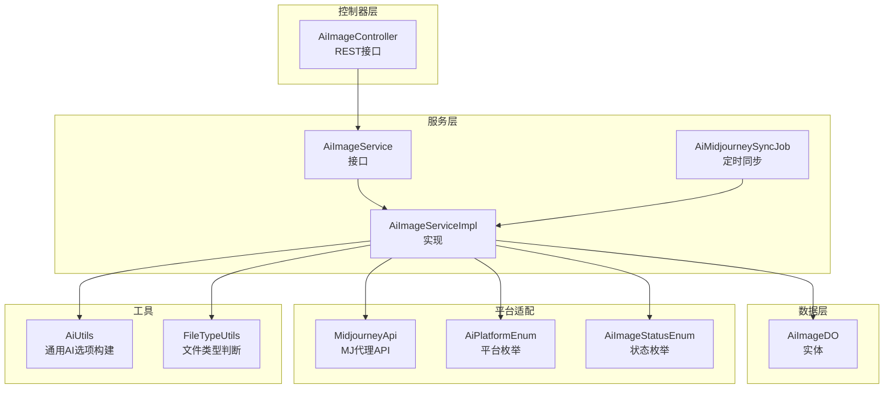
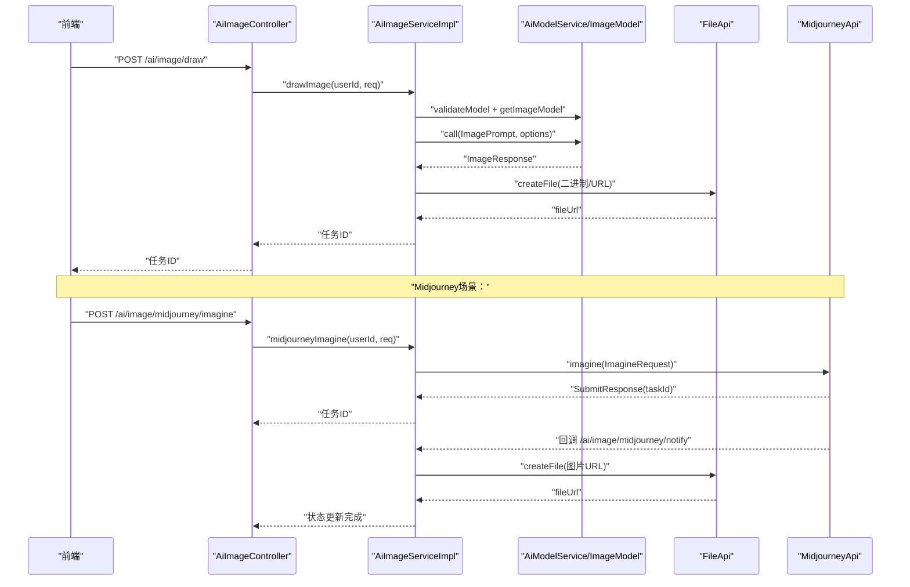
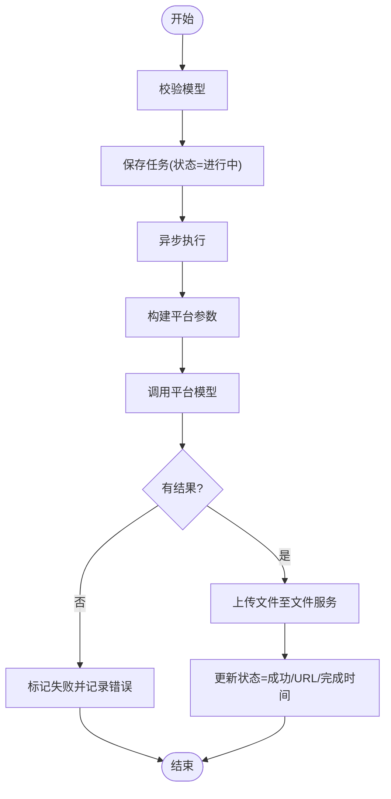
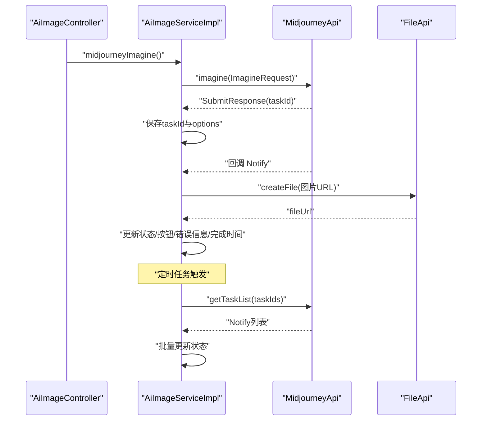
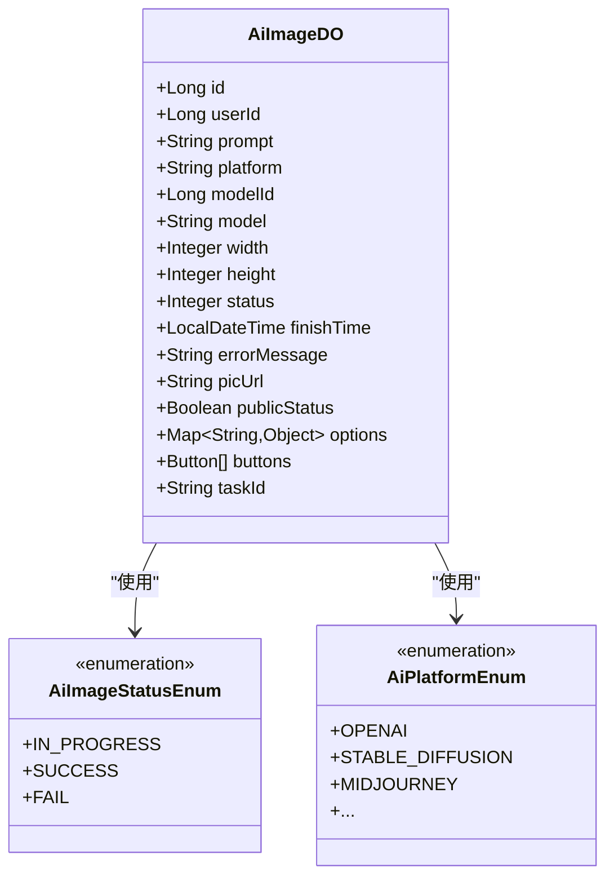
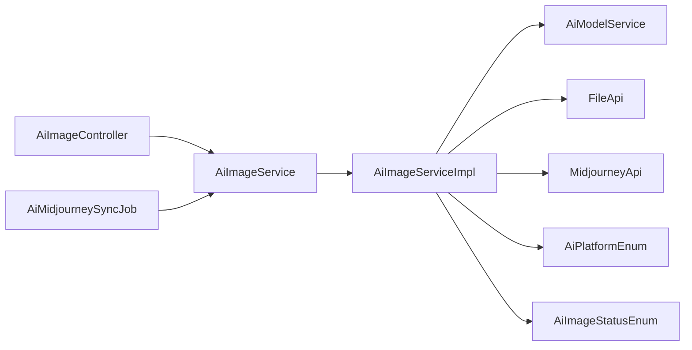

# AI图像生成功能

<cite>
**本文引用的文件**
- [AiImageController.java](file://qiji-module-ai/src/main/java/com.qiji.cps/module/ai/controller/admin/image/AiImageController.java)
- [AiImageService.java](file://qiji-module-ai/src/main/java/com.qiji.cps/module/ai/service/image/AiImageService.java)
- [AiImageServiceImpl.java](file://qiji-module-ai/src/main/java/com.qiji.cps/module/ai/service/image/AiImageServiceImpl.java)
- [AiImageDO.java](file://qiji-module-ai/src/main/java/com.qiji.cps/module/ai/dal/dataobject/image/AiImageDO.java)
- [AiImageStatusEnum.java](file://qiji-module-ai/src/main/java/com.qiji.cps/module/ai/enums/image/AiImageStatusEnum.java)
- [AiPlatformEnum.java](file://qiji-module-ai/src/main/java/com.qiji.cps/module/ai/enums/model/AiPlatformEnum.java)
- [MidjourneyApi.java](file://qiji-module-ai/src/main/java/com.qiji.cps/module/ai/framework/ai/core/model/midjourney/api/MidjourneyApi.java)
- [AiMidjourneySyncJob.java](file://qiji-module-ai/src/main/java/com.qiji.cps/module/ai/job/image/AiMidjourneySyncJob.java)
- [AiUtils.java](file://qiji-module-ai/src/main/java/com.qiji.cps/module/ai/util/AiUtils.java)
- [FileTypeUtils.java](file://qiji-module-ai/src/main/java/com.qiji.cps/module/ai/util/FileTypeUtils.java)
</cite>

## 目录
1. [简介](#简介)
2. [项目结构](#项目结构)
3. [核心组件](#核心组件)
4. [架构总览](#架构总览)
5. [详细组件分析](#详细组件分析)
6. [依赖关系分析](#依赖关系分析)
7. [性能考量](#性能考量)
8. [故障排查指南](#故障排查指南)
9. [结论](#结论)
10. [附录](#附录)

## 简介
本文件面向AI图像生成功能，系统性梳理从接口到实现、从参数配置到任务管理、从质量控制到存储管理的完整方案。重点覆盖与多家AI图像平台的对接能力（OpenAI、Stability AI、通义、文心一言、智谱、硅基流动、Midjourney等），以及Midjourney专属的异步任务推进、回调与二次操作流程。同时提供API接口说明、参数配置清单、最佳实践与排障建议，帮助开发者快速集成与稳定运行。

## 项目结构
AI图像生成功能位于 qiji-module-ai 模块中，采用典型的分层架构：
- 控制器层：对外暴露REST接口，负责参数校验与权限控制
- 服务层：封装业务逻辑，协调模型与文件服务
- 数据访问层：持久化图像任务与状态
- 框架与工具：Midjourney API封装、定时同步作业、通用AI工具与文件类型判断

图表来源
- [AiImageController.java:30-139](file://qiji-module-ai/src/main/java/com.qiji.cps/module/ai/controller/admin/image/AiImageController.java#L30-L139)
- [AiImageService.java:13-126](file://qiji-module-ai/src/main/java/com.qiji.cps/module/ai/service/image/AiImageService.java#L13-L126)
- [AiImageServiceImpl.java:54-376](file://qiji-module-ai/src/main/java/com.qiji.cps/module/ai/service/image/AiImageServiceImpl.java#L54-L376)
- [AiImageDO.java:22-128](file://qiji-module-ai/src/main/java/com.qiji.cps/module/ai/dal/dataobject/image/AiImageDO.java#L22-L128)
- [MidjourneyApi.java:24-352](file://qiji-module-ai/src/main/java/com.qiji.cps/module/ai/framework/ai/core/model/midjourney/api/MidjourneyApi.java#L24-L352)
- [AiMidjourneySyncJob.java:9-29](file://qiji-module-ai/src/main/java/com.qiji.cps/module/ai/job/image/AiMidjourneySyncJob.java#L9-L29)
- [AiUtils.java:26-134](file://qiji-module-ai/src/main/java/com.qiji.cps/module/ai/util/AiUtils.java#L26-L134)
- [FileTypeUtils.java:7-38](file://qiji-module-ai/src/main/java/com.qiji.cps/module/ai/util/FileTypeUtils.java#L7-L38)

章节来源
- [AiImageController.java:30-139](file://qiji-module-ai/src/main/java/com.qiji.cps/module/ai/controller/admin/image/AiImageController.java#L30-L139)
- [AiImageServiceImpl.java:54-376](file://qiji-module-ai/src/main/java/com.qiji.cps/module/ai/service/image/AiImageServiceImpl.java#L54-L376)

## 核心组件
- 控制器：提供“生成图片”“分页查询”“Midjourney专属接口”“管理员管理接口”等REST端点
- 服务实现：统一处理参数构建、平台适配、异步生成、状态更新、文件上传与存储
- 数据对象：持久化图像任务、状态、参数、任务ID、按钮集合等
- 平台枚举：统一管理国内外主流图像平台
- Midjourney API：封装MJ代理的提交、查询、回调与动作
- 定时同步：定时拉取Midjourney任务状态并回写
- 工具类：通用AI选项构建、文件类型判断

章节来源
- [AiImageService.java:13-126](file://qiji-module-ai/src/main/java/com.qiji.cps/module/ai/service/image/AiImageService.java#L13-L126)
- [AiImageServiceImpl.java:54-376](file://qiji-module-ai/src/main/java/com.qiji.cps/module/ai/service/image/AiImageServiceImpl.java#L54-L376)
- [AiImageDO.java:22-128](file://qiji-module-ai/src/main/java/com.qiji.cps/module/ai/dal/dataobject/image/AiImageDO.java#L22-L128)
- [AiPlatformEnum.java:9-73](file://qiji-module-ai/src/main/java/com.qiji.cps/module/ai/enums/model/AiPlatformEnum.java#L9-L73)
- [AiImageStatusEnum.java:6-38](file://qiji-module-ai/src/main/java/com.qiji.cps/module/ai/enums/image/AiImageStatusEnum.java#L6-L38)
- [MidjourneyApi.java:24-352](file://qiji-module-ai/src/main/java/com.qiji.cps/module/ai/framework/ai/core/model/midjourney/api/MidjourneyApi.java#L24-L352)
- [AiMidjourneySyncJob.java:9-29](file://qiji-module-ai/src/main/java/com.qiji.cps/module/ai/job/image/AiMidjourneySyncJob.java#L9-L29)
- [AiUtils.java:26-134](file://qiji-module-ai/src/main/java/com.qiji.cps/module/ai/util/AiUtils.java#L26-L134)
- [FileTypeUtils.java:7-38](file://qiji-module-ai/src/main/java/com.qiji.cps/module/ai/util/FileTypeUtils.java#L7-L38)

## 架构总览
整体流程：前端提交生成请求 → 控制器校验 → 服务层保存任务并异步调用对应平台 → 平台返回结果或Midjourney回调 → 服务层上传文件并更新状态 → 前端轮询或接收回调。

图表来源
- [AiImageController.java:73-110](file://qiji-module-ai/src/main/java/com.qiji.cps/module/ai/controller/admin/image/AiImageController.java#L73-L110)
- [AiImageServiceImpl.java:95-138](file://qiji-module-ai/src/main/java/com.qiji.cps/module/ai/service/image/AiImageServiceImpl.java#L95-L138)
- [MidjourneyApi.java:67-98](file://qiji-module-ai/src/main/java/com.qiji.cps/module/ai/framework/ai/core/model/midjourney/api/MidjourneyApi.java#L67-L98)

## 详细组件分析

### 1) 图像生成接口与控制器
- 通用生成：POST /ai/image/draw，返回任务ID；前端轮询或订阅回调
- Midjourney专属：
  - 提交：POST /ai/image/midjourney/imagine
  - 回调：POST /ai/image/midjourney/notify（无需鉴权）
  - 动作：POST /ai/image/midjourney/action（放大、变体、重试等）
- 管理员接口：分页查询、更新公开状态、删除任务

章节来源
- [AiImageController.java:39-139](file://qiji-module-ai/src/main/java/com.qiji.cps/module/ai/controller/admin/image/AiImageController.java#L39-L139)

### 2) 服务实现与任务管理
- 通用生成流程：
  - 校验模型 → 保存任务（状态=进行中）→ 异步执行 → 构建ImageOptions → 调用ImageModel → 上传文件 → 更新状态/URL/完成时间
- Midjourney专属流程：
  - 提交Imagine → 保存任务（含taskId与options）→ 定时同步或回调更新状态 → 动作操作（Action）→ 新增一条任务记录
- 错误处理：捕获异常并记录错误信息与完成时间，状态置为失败

图表来源
- [AiImageServiceImpl.java:95-138](file://qiji-module-ai/src/main/java/com.qiji.cps/module/ai/service/image/AiImageServiceImpl.java#L95-L138)

章节来源
- [AiImageServiceImpl.java:95-138](file://qiji-module-ai/src/main/java/com.qiji.cps/module/ai/service/image/AiImageServiceImpl.java#L95-L138)
- [AiImageServiceImpl.java:225-259](file://qiji-module-ai/src/main/java/com.qiji.cps/module/ai/service/image/AiImageServiceImpl.java#L225-L259)
- [AiImageServiceImpl.java:261-286](file://qiji-module-ai/src/main/java/com.qiji.cps/module/ai/service/image/AiImageServiceImpl.java#L261-L286)
- [AiImageServiceImpl.java:288-330](file://qiji-module-ai/src/main/java/com.qiji.cps/module/ai/service/image/AiImageServiceImpl.java#L288-L330)
- [AiImageServiceImpl.java:332-364](file://qiji-module-ai/src/main/java/com.qiji.cps/module/ai/service/image/AiImageServiceImpl.java#L332-L364)

### 3) 平台参数配置与适配
- OpenAI：支持宽高、风格、响应格式
- Stability AI：支持宽高、种子、CFG尺度、步数、采样器、风格预设、CLIP引导预设
- 通义（DashScope）：支持宽高
- 文心一言（QianFan）：支持宽高
- 智谱（ZhiPu）：按模型支持
- 硅基流动（SiliconFlow）：支持宽高
- Midjourney：通过MJ代理提交，支持尺寸、版本、参考图等

章节来源
- [AiImageServiceImpl.java:140-181](file://qiji-module-ai/src/main/java/com.qiji.cps/module/ai/service/image/AiImageServiceImpl.java#L140-L181)
- [AiPlatformEnum.java:9-73](file://qiji-module-ai/src/main/java/com.qiji.cps/module/ai/enums/model/AiPlatformEnum.java#L9-L73)

### 4) Midjourney集成与状态同步
- 提交流程：构造ImagineRequest（含state、notifyHook、base64Array），提交后保存taskId与options
- 回调流程：根据notify.id查询任务，转换状态（成功/失败），上传图片并回写按钮、错误信息、完成时间
- 定时同步：扫描进行中的Midjourney任务，批量查询任务列表并更新状态
- 动作流程：根据按钮customId提交Action，新增一条任务记录

图表来源
- [AiImageController.java:89-110](file://qiji-module-ai/src/main/java/com.qiji.cps/module/ai/controller/admin/image/AiImageController.java#L89-L110)
- [AiImageServiceImpl.java:225-259](file://qiji-module-ai/src/main/java/com.qiji.cps/module/ai/service/image/AiImageServiceImpl.java#L225-L259)
- [AiImageServiceImpl.java:288-330](file://qiji-module-ai/src/main/java/com.qiji.cps/module/ai/service/image/AiImageServiceImpl.java#L288-L330)
- [AiMidjourneySyncJob.java:21-26](file://qiji-module-ai/src/main/java/com.qiji.cps/module/ai/job/image/AiMidjourneySyncJob.java#L21-L26)
- [MidjourneyApi.java:67-98](file://qiji-module-ai/src/main/java/com.qiji.cps/module/ai/framework/ai/core/model/midjourney/api/MidjourneyApi.java#L67-L98)

章节来源
- [AiImageServiceImpl.java:225-364](file://qiji-module-ai/src/main/java/com.qiji.cps/module/ai/service/image/AiImageServiceImpl.java#L225-L364)
- [MidjourneyApi.java:24-352](file://qiji-module-ai/src/main/java/com.qiji.cps/module/ai/framework/ai/core/model/midjourney/api/MidjourneyApi.java#L24-L352)
- [AiMidjourneySyncJob.java:9-29](file://qiji-module-ai/src/main/java/com.qiji.cps/module/ai/job/image/AiMidjourneySyncJob.java#L9-L29)

### 5) 数据模型与状态
- AiImageDO：持久化任务ID、用户ID、提示词、平台/模型、宽高、状态、完成时间、错误信息、图片URL、公开状态、options、buttons、taskId
- AiImageStatusEnum：进行中、已完成、已失败
- AiPlatformEnum：统一平台枚举，覆盖国内外主流平台

图表来源
- [AiImageDO.java:22-128](file://qiji-module-ai/src/main/java/com.qiji.cps/module/ai/dal/dataobject/image/AiImageDO.java#L22-L128)
- [AiImageStatusEnum.java:6-38](file://qiji-module-ai/src/main/java/com.qiji.cps/module/ai/enums/image/AiImageStatusEnum.java#L6-L38)
- [AiPlatformEnum.java:9-73](file://qiji-module-ai/src/main/java/com.qiji.cps/module/ai/enums/model/AiPlatformEnum.java#L9-L73)

章节来源
- [AiImageDO.java:22-128](file://qiji-module-ai/src/main/java/com.qiji.cps/module/ai/dal/dataobject/image/AiImageDO.java#L22-L128)
- [AiImageStatusEnum.java:6-38](file://qiji-module-ai/src/main/java/com.qiji.cps/module/ai/enums/image/AiImageStatusEnum.java#L6-L38)
- [AiPlatformEnum.java:9-73](file://qiji-module-ai/src/main/java/com.qiji.cps/module/ai/enums/model/AiPlatformEnum.java#L9-L73)

### 6) 质量控制与合规
- 文件类型判断：通过Tika识别mineType，判断是否为图片类型，辅助内容审核前置过滤
- 错误信息记录：生成失败时记录errorMessage，便于审计与重试
- Midjourney回调：通过failReason回传失败原因，便于定位问题

章节来源
- [FileTypeUtils.java:7-38](file://qiji-module-ai/src/main/java/com.qiji.cps/module/ai/util/FileTypeUtils.java#L7-L38)
- [AiImageServiceImpl.java:132-137](file://qiji-module-ai/src/main/java/com.qiji.cps/module/ai/service/image/AiImageServiceImpl.java#L132-L137)
- [AiImageServiceImpl.java:319-324](file://qiji-module-ai/src/main/java/com.qiji.cps/module/ai/service/image/AiImageServiceImpl.java#L319-L324)

### 7) 存储与访问控制
- 文件上传：统一通过FileApi.createFile上传二进制或URL，返回文件路径
- 访问控制：控制器层对“我的”记录进行用户校验；管理员接口使用权限注解进行授权控制
- 公开状态：支持将任务设置为公开，供公共分页查询

章节来源
- [AiImageServiceImpl.java:123-127](file://qiji-module-ai/src/main/java/com.qiji.cps/module/ai/service/image/AiImageServiceImpl.java#L123-L127)
- [AiImageController.java:53-71](file://qiji-module-ai/src/main/java/com.qiji.cps/module/ai/controller/admin/image/AiImageController.java#L53-L71)
- [AiImageController.java:114-128](file://qiji-module-ai/src/main/java/com.qiji.cps/module/ai/controller/admin/image/AiImageController.java#L114-L128)

### 8) API接口文档
- 通用生成
  - 方法：POST
  - 路径：/ai/image/draw
  - 请求体：AiImageDrawReqVO（包含模型ID、提示词、宽高、平台特定参数）
  - 返回：任务ID（Long）
- Midjourney生成
  - 方法：POST
  - 路径：/ai/image/midjourney/imagine
  - 请求体：AiMidjourneyImagineReqVO（提示词、宽高、版本、参考图URL等）
  - 返回：任务ID（Long）
- Midjourney回调
  - 方法：POST
  - 路径：/ai/image/midjourney/notify
  - 请求体：MidjourneyApi.Notify
  - 返回：true
- Midjourney动作
  - 方法：POST
  - 路径：/ai/image/midjourney/action
  - 请求体：AiMidjourneyActionReqVO（customId、任务ID等）
  - 返回：新任务ID（Long）
- 管理员接口
  - 分页查询：GET /ai/image/page
  - 更新公开状态：PUT /ai/image/update
  - 删除任务：DELETE /ai/image/delete?id={id}

章节来源
- [AiImageController.java:73-139](file://qiji-module-ai/src/main/java/com.qiji.cps/module/ai/controller/admin/image/AiImageController.java#L73-L139)

## 依赖关系分析
- 控制器依赖服务接口，服务实现依赖模型服务、文件服务与Midjourney API
- Midjourney同步作业依赖服务实现进行批量状态同步
- 平台枚举与状态枚举贯穿数据模型与服务逻辑

图表来源
- [AiImageController.java:36-37](file://qiji-module-ai/src/main/java/com.qiji.cps/module/ai/controller/admin/image/AiImageController.java#L36-L37)
- [AiImageServiceImpl.java:63-70](file://qiji-module-ai/src/main/java/com.qiji.cps/module/ai/service/image/AiImageServiceImpl.java#L63-L70)
- [AiMidjourneySyncJob.java:18-19](file://qiji-module-ai/src/main/java/com.qiji.cps/module/ai/job/image/AiMidjourneySyncJob.java#L18-L19)

章节来源
- [AiImageServiceImpl.java:63-70](file://qiji-module-ai/src/main/java/com.qiji.cps/module/ai/service/image/AiImageServiceImpl.java#L63-L70)
- [AiMidjourneySyncJob.java:9-29](file://qiji-module-ai/src/main/java/com.qiji.cps/module/ai/job/image/AiMidjourneySyncJob.java#L9-L29)

## 性能考量
- 异步生成：通过@Async避免阻塞主线程，提升吞吐
- 批量同步：Midjourney定时任务批量查询任务列表，减少多次网络往返
- 参数构建：针对不同平台的ImageOptions按需装配，避免冗余字段
- 文件上传：优先Base64二进制，失败回退URL下载，保证成功率

章节来源
- [AiImageServiceImpl.java:111-138](file://qiji-module-ai/src/main/java/com.qiji.cps/module/ai/service/image/AiImageServiceImpl.java#L111-L138)
- [AiImageServiceImpl.java:261-286](file://qiji-module-ai/src/main/java/com.qiji.cps/module/ai/service/image/AiImageServiceImpl.java#L261-L286)

## 故障排查指南
- 生成失败
  - 检查errorMessage与finishTime，确认异常堆栈
  - 若为Midjourney，检查failReason与回调日志
- Midjourney未回调
  - 确认notifyHook配置正确且可达
  - 检查定时同步任务是否正常执行
- 余额不足
  - Midjourney提交返回描述包含“quota_not_enough”，需充值或切换账号
- 权限问题
  - “我的”记录删除需校验用户ID；管理员接口需具备相应权限

章节来源
- [AiImageServiceImpl.java:132-137](file://qiji-module-ai/src/main/java/com.qiji.cps/module/ai/service/image/AiImageServiceImpl.java#L132-L137)
- [AiImageServiceImpl.java:250-253](file://qiji-module-ai/src/main/java/com.qiji.cps/module/ai/service/image/AiImageServiceImpl.java#L250-L253)
- [AiImageController.java:58-61](file://qiji-module-ai/src/main/java/com.qiji.cps/module/ai/controller/admin/image/AiImageController.java#L58-L61)

## 结论
该AI图像生成功能以清晰的分层设计与平台适配为核心，既支持通用平台（OpenAI、Stability AI、通义、文心、智谱、硅基流动），也深度集成Midjourney的异步任务与回调机制。通过异步生成、定时同步、状态枚举与文件服务统一封装，实现了高可用的任务管理与稳定的图像产出。配合权限控制与质量控制手段，可满足生产环境的集成与运维需求。

## 附录
- 最佳实践
  - 使用任务ID进行轮询或订阅回调，避免阻塞
  - 针对Midjourney，确保notifyHook可达并正确配置
  - 对于失败任务，结合failReason与errorMessage进行重试或人工干预
  - 合理设置宽高与平台特定参数，平衡质量与成本
- 参考实现路径
  - 通用参数构建：[AiImageServiceImpl.java:140-181](file://qiji-module-ai/src/main/java/com.qiji.cps/module/ai/service/image/AiImageServiceImpl.java#L140-L181)
  - Midjourney回调处理：[AiImageServiceImpl.java:288-330](file://qiji-module-ai/src/main/java/com.qiji.cps/module/ai/service/image/AiImageServiceImpl.java#L288-L330)
  - 定时同步任务：[AiMidjourneySyncJob.java:21-26](file://qiji-module-ai/src/main/java/com.qiji.cps/module/ai/job/image/AiMidjourneySyncJob.java#L21-L26)
  - 文件类型判断：[FileTypeUtils.java:23-35](file://qiji-module-ai/src/main/java/com.qiji.cps/module/ai/util/FileTypeUtils.java#L23-L35)