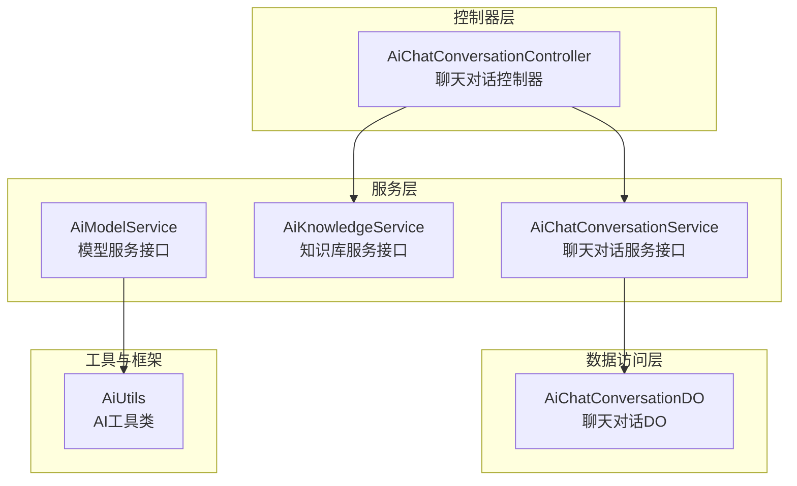
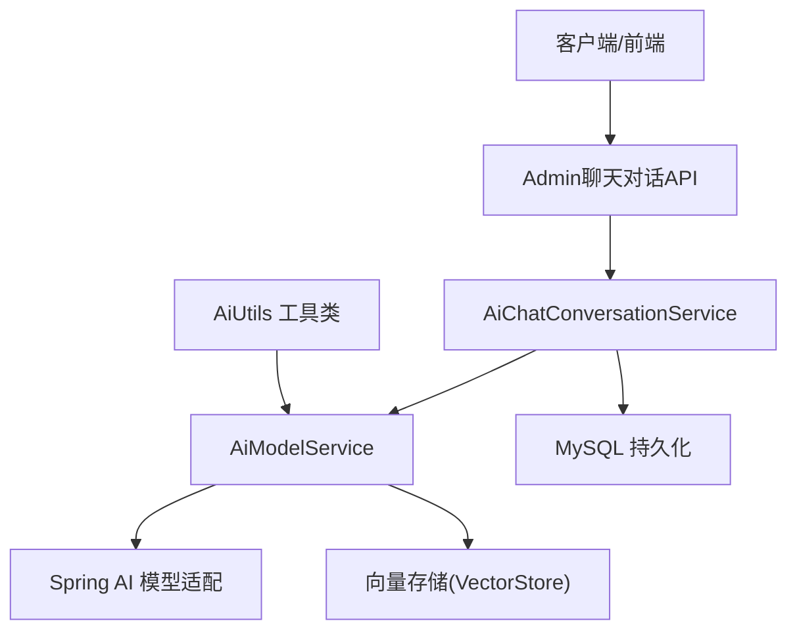
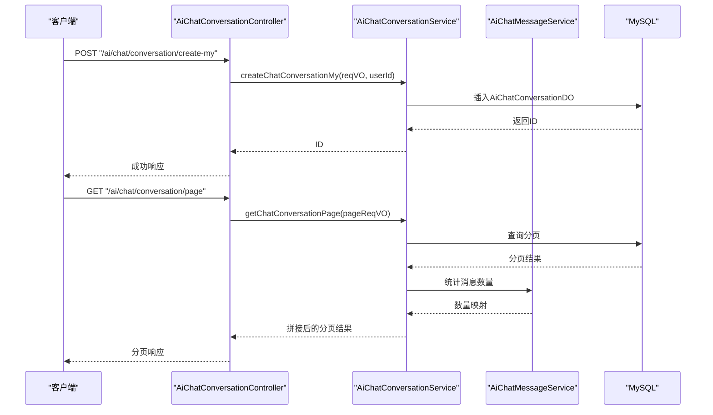
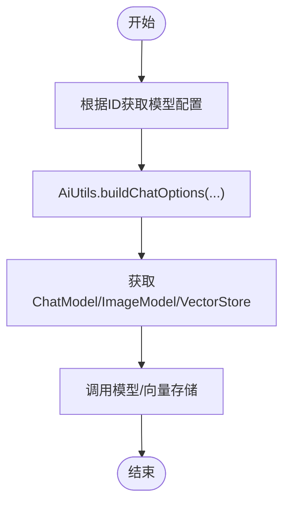
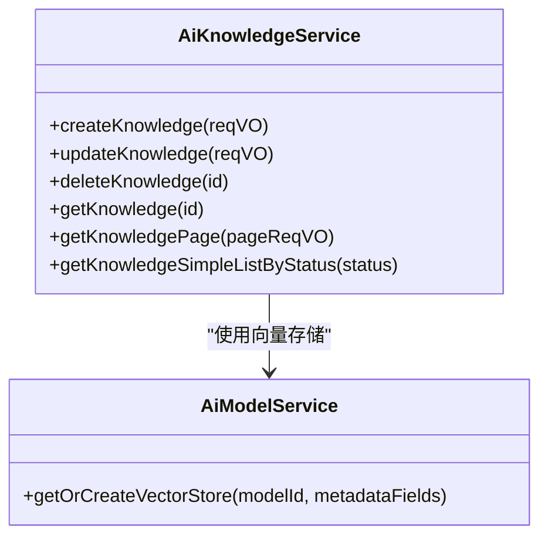
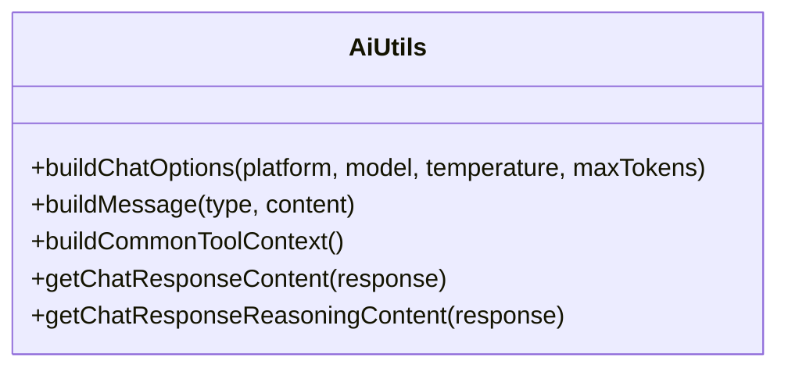
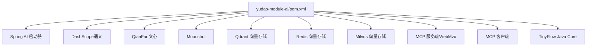

# AI大模型模块

<cite>
**本文引用的文件**
- [yudao-module-ai/pom.xml](file://yudao-module-ai/pom.xml)
- [AiChatConversationController.java](file://yudao-module-ai/src/main/java/cn/iocoder/yudao/module/ai/controller/admin/chat/AiChatConversationController.java)
- [AiChatConversationService.java](file://yudao-module-ai/src/main/java/cn/iocoder/yudao/module/ai/service/chat/AiChatConversationService.java)
- [AiChatConversationDO.java](file://yudao-module-ai/src/main/java/cn/iocoder/yudao/module/ai/dal/dataobject/chat/AiChatConversationDO.java)
- [AiKnowledgeService.java](file://yudao-module-ai/src/main/java/cn/iocoder/yudao/module/ai/service/knowledge/AiKnowledgeService.java)
- [AiModelService.java](file://yudao-module-ai/src/main/java/cn/iocoder/yudao/module/ai/service/model/AiModelService.java)
- [AiUtils.java](file://yudao-module-ai/src/main/java/cn/iocoder/yudao/module/ai/util/AiUtils.java)
</cite>

## 目录
1. [简介](#简介)
2. [项目结构](#项目结构)
3. [核心组件](#核心组件)
4. [架构总览](#架构总览)
5. [详细组件分析](#详细组件分析)
6. [依赖分析](#依赖分析)
7. [性能考虑](#性能考虑)
8. [故障排查指南](#故障排查指南)
9. [结论](#结论)
10. [附录](#附录)

## 简介
本技术文档面向AgenticCPS系统中的AI大模型模块，系统性阐述其在CPS生态中的创新定位与价值。该模块以Spring AI为核心，集成多平台大模型（国内：通义千问、文心一言、讯飞星火、智谱GLM、DeepSeek；国外：OpenAI、Ollama、Midjourney、StableDiffusion、Suno），提供聊天、图像生成、音乐生成、写作、思维导图、知识库管理等AI核心能力，并通过MCP（Model Context Protocol）协议对外暴露Agent接口层，支撑智能导购、商品推荐、营销文案生成等智能化服务。

模块同时提供完善的模型管理机制（配置、版本控制、性能监控）、工具函数（天气查询、目录列表、用户画像查询等）、知识库管理（文档上传、分段处理、向量存储、智能检索）、对话系统（上下文管理、多轮对话、会话持久化）、安全机制（输入过滤、输出审核、访问控制）以及可扩展的插件化设计，便于接入新的AI模型与工具。

## 项目结构
AI模块采用按功能域划分的层次化组织方式，主要包含以下层次：
- 控制器层：Admin端与App端的API控制器，负责请求接入与权限控制
- 服务层：领域服务接口与实现，封装业务逻辑与外部集成
- 数据访问层：DO对象与MySQL映射，承载会话、消息、知识库、模型等实体
- 工具与框架：AI工具类、MCP集成、安全与Web配置等
- 作业调度：图像生成、音乐生成等异步同步任务

**图表来源**
- [AiChatConversationController.java:1-119](file://yudao-module-ai/src/main/java/cn/iocoder/yudao/module/ai/controller/admin/chat/AiChatConversationController.java#L1-L119)
- [AiChatConversationService.java:1-91](file://yudao-module-ai/src/main/java/cn/iocoder/yudao/module/ai/service/chat/AiChatConversationService.java#L1-L91)
- [AiKnowledgeService.java:1-71](file://yudao-module-ai/src/main/java/cn/iocoder/yudao/module/ai/service/knowledge/AiKnowledgeService.java#L1-L71)
- [AiModelService.java:1-144](file://yudao-module-ai/src/main/java/cn/iocoder/yudao/module/ai/service/model/AiModelService.java#L1-L144)
- [AiChatConversationDO.java:1-101](file://yudao-module-ai/src/main/java/cn/iocoder/yudao/module/ai/dal/dataobject/chat/AiChatConversationDO.java#L1-L101)
- [AiUtils.java:1-134](file://yudao-module-ai/src/main/java/cn/iocoder/yudao/module/ai/util/AiUtils.java#L1-L134)

**章节来源**
- [yudao-module-ai/pom.xml:1-265](file://yudao-module-ai/pom.xml#L1-L265)

## 核心组件
- 聊天对话服务：提供会话创建、更新、查询、分页、删除等能力，支持“我的”会话与管理员会话管理，具备上下文配置（温度、最大Token、上下文数量）与角色绑定。
- 知识库服务：提供知识库的创建、更新、删除、查询、分页与状态筛选，支撑文档入库后的检索与应用。
- 模型服务：统一抽象不同平台的大模型接入，提供ChatModel/ImageModel/MidjourneyApi/SunoApi/VectorStore获取，以及TinyFlow LLM Provider注入，便于工作流编排。
- AI工具类：构建ChatOptions、消息体、通用工具上下文（登录用户、租户ID），并提取响应文本与推理内容。
- 控制器：Admin端聊天对话API，提供创建、更新、查询、分页、删除等REST接口，配合权限注解进行访问控制。

**章节来源**
- [AiChatConversationService.java:1-91](file://yudao-module-ai/src/main/java/cn/iocoder/yudao/module/ai/service/chat/AiChatConversationService.java#L1-L91)
- [AiKnowledgeService.java:1-71](file://yudao-module-ai/src/main/java/cn/iocoder/yudao/module/ai/service/knowledge/AiKnowledgeService.java#L1-L71)
- [AiModelService.java:1-144](file://yudao-module-ai/src/main/java/cn/iocoder/yudao/module/ai/service/model/AiModelService.java#L1-L144)
- [AiUtils.java:1-134](file://yudao-module-ai/src/main/java/cn/iocoder/yudao/module/ai/util/AiUtils.java#L1-L134)
- [AiChatConversationController.java:1-119](file://yudao-module-ai/src/main/java/cn/iocoder/yudao/module/ai/controller/admin/chat/AiChatConversationController.java#L1-L119)

## 架构总览
AI模块通过MCP协议对外提供Agent接口层，结合Spring AI对多平台模型的统一封装，形成“控制器—服务—模型适配—向量存储”的完整链路。控制器负责鉴权与入参校验，服务层负责业务编排与外部调用，模型服务负责具体模型与向量存储的获取，工具类提供跨平台选项与消息构造。

**图表来源**
- [AiChatConversationController.java:1-119](file://yudao-module-ai/src/main/java/cn/iocoder/yudao/module/ai/controller/admin/chat/AiChatConversationController.java#L1-L119)
- [AiModelService.java:1-144](file://yudao-module-ai/src/main/java/cn/iocoder/yudao/module/ai/service/model/AiModelService.java#L1-L144)
- [AiUtils.java:1-134](file://yudao-module-ai/src/main/java/cn/iocoder/yudao/module/ai/util/AiUtils.java#L1-L134)

## 详细组件分析

### 组件A：聊天对话系统
- 功能职责
  - 会话生命周期管理：创建、更新、查询、分页、删除
  - 权限隔离：区分“我的”会话与管理员会话
  - 上下文配置：温度、最大Token、上下文数量、角色与模型绑定
  - 与消息服务联动：统计消息数量、拼接关联数据
- 数据模型
  - AiChatConversationDO：包含用户ID、标题、置顶状态、角色ID、模型ID、系统提示词、温度、最大Token、上下文数量等字段
- 控制器接口
  - 创建/更新/查询/删除“我的”会话
  - 管理员分页查询与删除
- 处理流程
  - 控制器接收请求，鉴权后调用服务层
  - 服务层执行业务规则（如“我的”会话仅限本人）
  - 持久化到MySQL，必要时联动消息服务统计

**图表来源**
- [AiChatConversationController.java:1-119](file://yudao-module-ai/src/main/java/cn/iocoder/yudao/module/ai/controller/admin/chat/AiChatConversationController.java#L1-L119)
- [AiChatConversationService.java:1-91](file://yudao-module-ai/src/main/java/cn/iocoder/yudao/module/ai/service/chat/AiChatConversationService.java#L1-L91)

**章节来源**
- [AiChatConversationController.java:1-119](file://yudao-module-ai/src/main/java/cn/iocoder/yudao/module/ai/controller/admin/chat/AiChatConversationController.java#L1-L119)
- [AiChatConversationService.java:1-91](file://yudao-module-ai/src/main/java/cn/iocoder/yudao/module/ai/service/chat/AiChatConversationService.java#L1-L91)
- [AiChatConversationDO.java:1-101](file://yudao-module-ai/src/main/java/cn/iocoder/yudao/module/ai/dal/dataobject/chat/AiChatConversationDO.java#L1-L101)

### 组件B：模型管理与MCP集成
- 功能职责
  - 模型的创建、更新、删除、查询、分页与可用性校验
  - 提供ChatModel、ImageModel、MidjourneyApi、SunoApi、VectorStore实例
  - TinyFlow LLM Provider注入，支持工作流编排
- 技术要点
  - 通过AiUtils构建跨平台ChatOptions，统一温度、最大Token与工具回调
  - 支持多种平台（通义、文心、DeepSeek、智谱、Moonshot、OpenAI、Azure OpenAI、Anthropic、Ollama等）
- 处理流程
  - 服务层根据模型ID获取对应适配器
  - 控制器通过MCP协议对外暴露Agent接口，实现智能导购、推荐、文案生成等

**图表来源**
- [AiModelService.java:1-144](file://yudao-module-ai/src/main/java/cn/iocoder/yudao/module/ai/service/model/AiModelService.java#L1-L144)
- [AiUtils.java:1-134](file://yudao-module-ai/src/main/java/cn/iocoder/yudao/module/ai/util/AiUtils.java#L1-L134)

**章节来源**
- [AiModelService.java:1-144](file://yudao-module-ai/src/main/java/cn/iocoder/yudao/module/ai/service/model/AiModelService.java#L1-L144)
- [AiUtils.java:1-134](file://yudao-module-ai/src/main/java/cn/iocoder/yudao/module/ai/util/AiUtils.java#L1-L134)

### 组件C：知识库管理
- 功能职责
  - 知识库的创建、更新、删除、查询、分页与状态筛选
  - 支持文档上传后的分段策略与向量存储，实现智能检索
- 与模型服务的关系
  - 通过AiModelService提供的VectorStore能力，完成知识入库与检索

**图表来源**
- [AiKnowledgeService.java:1-71](file://yudao-module-ai/src/main/java/cn/iocoder/yudao/module/ai/service/knowledge/AiKnowledgeService.java#L1-L71)
- [AiModelService.java:1-144](file://yudao-module-ai/src/main/java/cn/iocoder/yudao/module/ai/service/model/AiModelService.java#L1-L144)

**章节来源**
- [AiKnowledgeService.java:1-71](file://yudao-module-ai/src/main/java/cn/iocoder/yudao/module/ai/service/knowledge/AiKnowledgeService.java#L1-L71)
- [AiModelService.java:1-144](file://yudao-module-ai/src/main/java/cn/iocoder/yudao/module/ai/service/model/AiModelService.java#L1-L144)

### 组件D：AI工具函数
- 能力概述
  - 构建跨平台ChatOptions（温度、最大Token、工具回调、工具上下文）
  - 构造消息体（用户、助手、系统）
  - 构建通用工具上下文（登录用户、租户ID）
  - 提取响应文本与推理内容（针对特定模型）

**图表来源**
- [AiUtils.java:1-134](file://yudao-module-ai/src/main/java/cn/iocoder/yudao/module/ai/util/AiUtils.java#L1-L134)

**章节来源**
- [AiUtils.java:1-134](file://yudao-module-ai/src/main/java/cn/iocoder/yudao/module/ai/util/AiUtils.java#L1-L134)

## 依赖分析
AI模块通过Maven集中引入Spring AI生态与第三方模型SDK，覆盖多平台模型接入、向量存储、MCP协议、TinyFlow工作流等能力。关键依赖包括：
- Spring AI Starter（OpenAI、Azure OpenAI、Anthropic、DeepSeek、Ollama、Stability AI、Zhipuai、Minimax）
- Alibaba DashScope（通义千问）
- Springaicommunity QianFan、Moonshot
- 向量存储：Qdrant、Redis、Milvus
- MCP服务端与客户端（基于Spring MVC）
- TinyFlow Java核心

**图表来源**
- [yudao-module-ai/pom.xml:1-265](file://yudao-module-ai/pom.xml#L1-L265)

**章节来源**
- [yudao-module-ai/pom.xml:1-265](file://yudao-module-ai/pom.xml#L1-L265)

## 性能考虑
- 模型选择与参数调优：通过温度、最大Token、上下文数量等参数平衡质量与延迟
- 向量存储优化：合理选择Qdrant/Redis/Milvus，结合索引与分片策略提升检索性能
- 异步任务：图像生成、音乐生成等耗时操作建议通过作业调度异步处理
- 连接池与超时：模型调用与向量存储均应配置合理的连接池与超时策略
- 缓存策略：对常用配置与工具上下文进行缓存，减少重复构建开销

## 故障排查指南
- 模型不可用
  - 使用AiModelService.validateModel进行可用性校验
  - 检查平台与模型名称是否匹配，确认ChatOptions构建参数
- 响应为空或异常
  - 使用AiUtils.getChatResponseContent提取文本，检查ChatResponse结构
  - 针对特定模型（如DeepSeek）使用推理内容提取方法
- 权限与上下文
  - 确认登录用户与租户ID上下文是否正确注入
  - 检查控制器上的权限注解与业务逻辑中的用户隔离

**章节来源**
- [AiModelService.java:1-144](file://yudao-module-ai/src/main/java/cn/iocoder/yudao/module/ai/service/model/AiModelService.java#L1-L144)
- [AiUtils.java:1-134](file://yudao-module-ai/src/main/java/cn/iocoder/yudao/module/ai/util/AiUtils.java#L1-L134)

## 结论
AI大模型模块在AgenticCPS中承担“智能中枢”角色，通过统一的模型适配、MCP协议Agent层、知识库与向量存储能力，为智能导购、商品推荐、营销文案生成等场景提供坚实支撑。模块具备良好的扩展性与安全性，可通过插件化设计快速接入新模型与工具，并通过完善的权限与上下文机制保障生产环境的稳定运行。

## 附录

### API接口文档（Admin端聊天对话）
- 创建“我的”聊天对话
  - 方法：POST
  - 路径：/ai/chat/conversation/create-my
  - 权限：登录用户
- 更新“我的”聊天对话
  - 方法：PUT
  - 路径：/ai/chat/conversation/update-my
  - 权限：登录用户
- 获取“我的”聊天对话列表
  - 方法：GET
  - 路径：/ai/chat/conversation/my-list
  - 权限：登录用户
- 获取“我的”聊天对话详情
  - 方法：GET
  - 路径：/ai/chat/conversation/get-my?id={id}
  - 权限：登录用户（仅限本人）
- 删除“我的”聊天对话
  - 方法：DELETE
  - 路径：/ai/chat/conversation/delete-my?id={id}
  - 权限：登录用户
- 删除未置顶的聊天对话
  - 方法：DELETE
  - 路径：/ai/chat/conversation/delete-by-unpinned
  - 权限：登录用户
- 管理员分页查询对话
  - 方法：GET
  - 路径：/ai/chat/conversation/page
  - 权限：ai:chat-conversation:query
- 管理员删除对话
  - 方法：DELETE
  - 路径：/ai/chat/conversation/delete-by-admin?id={id}
  - 权限：ai:chat-conversation:delete

**章节来源**
- [AiChatConversationController.java:1-119](file://yudao-module-ai/src/main/java/cn/iocoder/yudao/module/ai/controller/admin/chat/AiChatConversationController.java#L1-L119)