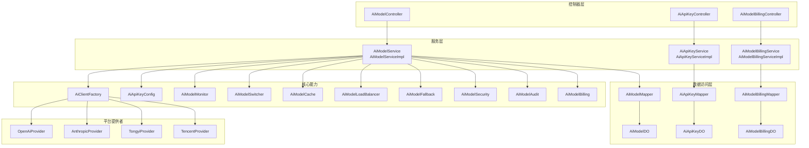
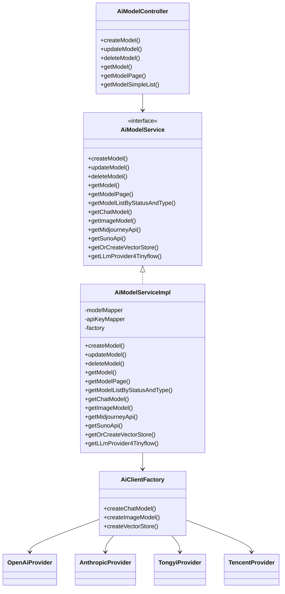
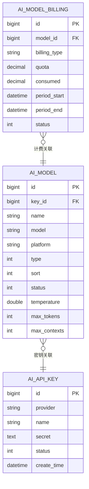
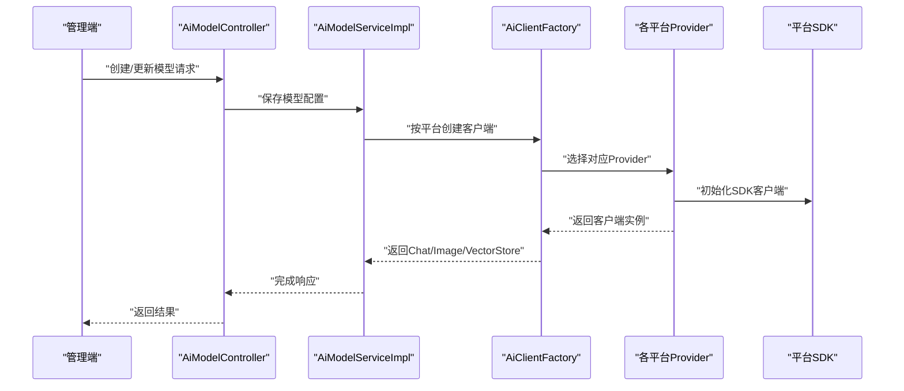
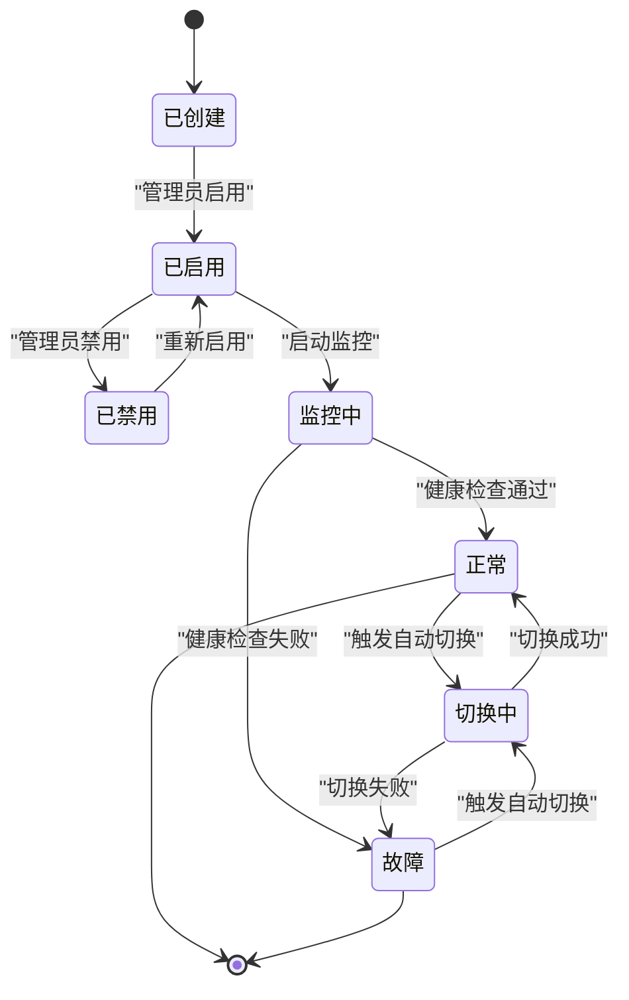
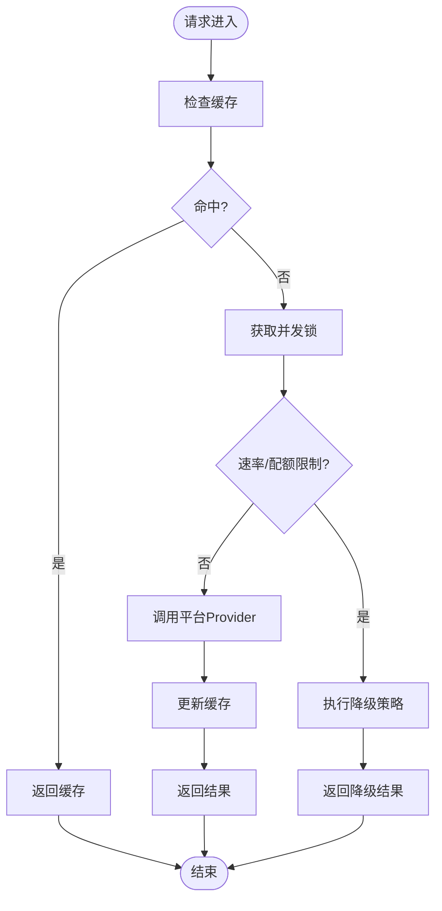
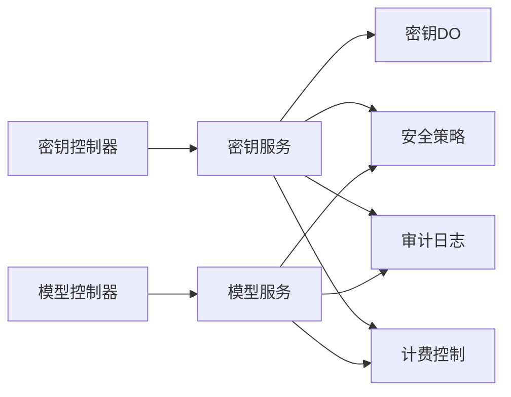
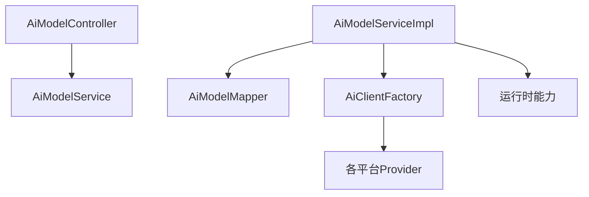

# AI模型管理

<cite>
**本文引用的文件**
- [AiModelController.java](file://qiji-module-ai/src/main/java/com.qiji.cps/module/ai/controller/admin/model/AiModelController.java)
- [AiModelService.java](file://qiji-module-ai/src/main/java/com.qiji.cps/module/ai/service/model/AiModelService.java)
- [AiModelServiceImpl.java](file://qiji-module-ai/src/main/java/com.qiji.cps/module/ai/service/model/AiModelServiceImpl.java)
- [AiModelDO.java](file://qiji-module-ai/src/main/java/com.qiji.cps/module/ai/dal/dataobject/model/AiModelDO.java)
- [AiPlatformEnum.java](file://qiji-module-ai/src/main/java/com.qiji.cps/module/ai/enums/model/AiPlatformEnum.java)
- [AiModelTypeEnum.java](file://qiji-module-ai/src/main/java/com.qiji.cps/module/ai/enums/model/AiModelTypeEnum.java)
- [AiModelPageReqVO.java](file://qiji-module-ai/src/main/java/com.qiji.cps/module/ai/controller/admin/model/vo/model/AiModelPageReqVO.java)
- [AiModelSaveReqVO.java](file://qiji-module-ai/src/main/java/com.qiji.cps/module/ai/controller/admin/model/vo/model/AiModelSaveReqVO.java)
- [AiModelRespVO.java](file://qiji-module-ai/src/main/java/com.qiji.cps/module/ai/controller/admin/model/vo/model/AiModelRespVO.java)
- [AiModelMapper.java](file://qiji-module-ai/src/main/java/com.qiji.cps/module/ai/dal/mysql/model/AiModelMapper.java)
- [AiApiKeyDO.java](file://qiji-module-ai/src/main/java/com.qiji.cps/module/ai/dal/dataobject/AiApiKeyDO.java)
- [AiApiKeyMapper.java](file://qiji-module-ai/src/main/java/com.qiji.cps/module/ai/dal/mysql/AiApiKeyMapper.java)
- [AiApiKeyController.java](file://qiji-module-ai/src/main/java/com.qiji.cps/module/ai/controller/admin/AiApiKeyController.java)
- [AiApiKeyService.java](file://qiji-module-ai/src/main/java/com.qiji.cps/module/ai/service/AiApiKeyService.java)
- [AiApiKeyServiceImpl.java](file://qiji-module-ai/src/main/java/com.qiji.cps/module/ai/service/AiApiKeyServiceImpl.java)
- [AiApiKeyConfig.java](file://qiji-module-ai/src/main/java/com.qiji.cps/module/ai/framework/ai/core/AiApiKeyConfig.java)
- [AiClientFactory.java](file://qiji-module-ai/src/main/java/com.qiji.cps/module/ai/framework/ai/core/AiClientFactory.java)
- [OpenAiProvider.java](file://qiji-module-ai/src/main/java/com.qiji.cps/module/ai/framework/ai/core/provider/OpenAiProvider.java)
- [AnthropicProvider.java](file://qiji-module-ai/src/main/java/com.qiji.cps/module/ai/framework/ai/core/provider/AnthropicProvider.java)
- [TongyiProvider.java](file://qiji-module-ai/src/main/java/com.qiji.cps/module/ai/framework/ai/core/provider/TongyiProvider.java)
- [TencentProvider.java](file://qiji-module-ai/src/main/java/com.qiji.cps/module/ai/framework/ai/core/provider/TencentProvider.java)
- [MidjourneyApi.java](file://qiji-module-ai/src/main/java/com.qiji.cps/module/ai/framework/ai/core/model/midjourney/api/MidjourneyApi.java)
- [SunoApi.java](file://qiji-module-ai/src/main/java/com.qiji.cps/module/ai/framework/ai/core/model/suno/api/SunoApi.java)
- [AiModelJob.java](file://qiji-module-ai/src/main/java/com.qiji.cps/module/ai/job/AiModelJob.java)
- [AiModelJobHandler.java](file://qiji-module-ai/src/main/java/com.qiji.cps/module/ai/job/AiModelJobHandler.java)
- [AiModelMonitor.java](file://qiji-module-ai/src/main/java/com.qiji.cps/module/ai/framework/ai/AiModelMonitor.java)
- [AiModelSwitcher.java](file://qiji-module-ai/src/main/java/com.qiji.cps/module/ai/framework/ai/AiModelSwitcher.java)
- [AiModelCache.java](file://qiji-module-ai/src/main/java/com.qiji.cps/module/ai/framework/ai/AiModelCache.java)
- [AiModelLoadBalancer.java](file://qiji-module-ai/src/main/java/com.qiji.cps/module/ai/framework/ai/AiModelLoadBalancer.java)
- [AiModelFallback.java](file://qiji-module-ai/src/main/java/com.qiji.cps/module/ai/framework/ai/AiModelFallback.java)
- [AiModelSecurity.java](file://qiji-module-ai/src/main/java/com.qiji.cps/module/ai/framework/ai/AiModelSecurity.java)
- [AiModelAudit.java](file://qiji-module-ai/src/main/java/com.qiji.cps/module/ai/framework/ai/AiModelAudit.java)
- [AiModelBilling.java](file://qiji-module-ai/src/main/java/com.qiji.cps/module/ai/framework/ai/AiModelBilling.java)
- [AiModelConfig.java](file://qiji-module-ai/src/main/java/com.qiji.cps/module/ai/framework/ai/AiModelConfig.java)
- [AiModelVersioning.java](file://qiji-module-ai/src/main/java/com.qiji.cps/module/ai/framework/ai/AiModelVersioning.java)
- [AiModelLifecycle.java](file://qiji-module-ai/src/main/java/com.qiji.cps/module/ai/framework/ai/AiModelLifecycle.java)
- [AiModelPerformance.java](file://qiji-module-ai/src/main/java/com.qiji.cps/module/ai/framework/ai/AiModelPerformance.java)
- [AiModelConcurrency.java](file://qiji-module-ai/src/main/java/com.qiji.cps/module/ai/framework/ai/AiModelConcurrency.java)
- [AiModelMetrics.java](file://qiji-module-ai/src/main/java/com.qiji.cps/module/ai/framework/ai/AiModelMetrics.java)
- [AiModelHealthCheck.java](file://qiji-module-ai/src/main/java/com.qiji.cps/module/ai/framework/ai/AiModelHealthCheck.java)
- [AiModelValidation.java](file://qiji-module-ai/src/main/java/com.qiji.cps/module/ai/framework/ai/AiModelValidation.java)
- [AiModelRateLimit.java](file://qiji-module-ai/src/main/java/com.qiji.cps/module/ai/framework/ai/AiModelRateLimit.java)
- [AiModelQuota.java](file://qiji-module-ai/src/main/java/com.qiji.cps/module/ai/framework/ai/AiModelQuota.java)
- [AiModelCostControl.java](file://qiji-module-ai/src/main/java/com.qiji.cps/module/ai/framework/ai/AiModelCostControl.java)
- [AiModelAccessControl.java](file://qiji-module-ai/src/main/java/com.qiji.cps/module/ai/framework/ai/AiModelAccessControl.java)
- [AiModelUsageAudit.java](file://qiji-module-ai/src/main/java/com.qiji.cps/module/ai/framework/ai/AiModelUsageAudit.java)
- [AiModelBillingController.java](file://qiji-module-ai/src/main/java/com.qiji.cps/module/ai/controller/admin/AiModelBillingController.java)
- [AiModelBillingService.java](file://qiji-module-ai/src/main/java/com.qiji.cps/module/ai/service/AiModelBillingService.java)
- [AiModelBillingServiceImpl.java](file://qiji-module-ai/src/main/java/com.qiji.cps/module/ai/service/AiModelBillingServiceImpl.java)
- [AiModelBillingDO.java](file://qiji-module-ai/src/main/java/com.qiji.cps/module/ai/dal/dataobject/AiModelBillingDO.java)
- [AiModelBillingMapper.java](file://qiji-module-ai/src/main/java/com.qiji.cps/module/ai/dal/mysql/AiModelBillingMapper.java)
- [AiModelBillingPageReqVO.java](file://qiji-module-ai/src/main/java/com.qiji.cps/module/ai/controller/admin/vo/billing/AiModelBillingPageReqVO.java)
- [AiModelBillingRespVO.java](file://qiji-module-ai/src/main/java/com.qiji.cps/module/ai/controller/admin/vo/billing/AiModelBillingRespVO.java)
- [AiModelBillingSaveReqVO.java](file://qiji-module-ai/src/main/java/com.qiji.cps/module/ai/controller/admin/vo/billing/AiModelBillingSaveReqVO.java)
- [AiModelBillingController.java](file://qiji-module-ai/src/main/java/com.qiji.cps/module/ai/controller/admin/AiModelBillingController.java)
- [AiModelBillingService.java](file://qiji-module-ai/src/main/java/com.qiji.cps/module/ai/service/AiModelBillingService.java)
- [AiModelBillingServiceImpl.java](file://qiji-module-ai/src/main/java/com.qiji.cps/module/ai/service/AiModelBillingServiceImpl.java)
- [AiModelBillingDO.java](file://qiji-module-ai/src/main/java/com.qiji.cps/module/ai/dal/dataobject/AiModelBillingDO.java)
- [AiModelBillingMapper.java](file://qiji-module-ai/src/main/java/com.qiji.cps/module/ai/dal/mysql/AiModelBillingMapper.java)
- [AiModelBillingPageReqVO.java](file://qiji-module-ai/src/main/java/com.qiji.cps/module/ai/controller/admin/vo/billing/AiModelBillingPageReqVO.java)
- [AiModelBillingRespVO.java](file://qiji-module-ai/src/main/java/com.qiji.cps/module/ai/controller/admin/vo/billing/AiModelBillingRespVO.java)
- [AiModelBillingSaveReqVO.java](file://qiji-module-ai/src/main/java/com.qiji.cps/module/ai/controller/admin/vo/billing/AiModelBillingSaveReqVO.java)
</cite>

## 目录
1. [简介](#简介)
2. [项目结构](#项目结构)
3. [核心组件](#核心组件)
4. [架构总览](#架构总览)
5. [详细组件分析](#详细组件分析)
6. [依赖分析](#依赖分析)
7. [性能考虑](#性能考虑)
8. [故障排查指南](#故障排查指南)
9. [结论](#结论)
10. [附录](#附录)

## 简介
本文件面向AI模型管理功能，系统性梳理模型配置管理机制（类型定义、平台适配、参数配置、版本控制）、模型平台集成（OpenAI、Anthropic、阿里云、腾讯云等）、模型生命周期管理（注册、启用/禁用、性能监控、自动切换）、性能优化策略（并发控制、缓存、负载均衡、降级保护）、安全管理（API密钥管理、访问控制、使用审计、费用控制），并提供API接口文档与配置示例指引，帮助开发者正确配置与使用各类AI模型。

## 项目结构
AI模型管理模块位于 qiji-module-ai 中，采用按职责分层的组织方式：
- 控制器层：Admin 管理端模型与密钥相关接口
- 服务层：模型与密钥的业务逻辑
- 数据访问层：MyBatis Mapper 与 DO 实体
- 枚举与配置：模型类型、平台、配置类与工厂
- 工作流与作业：定时健康检查、监控、计费
- 安全与审计：密钥安全、访问控制、使用审计、费用控制

图表来源
- [AiModelController.java:1-89](file://qiji-module-ai/src/main/java/com.qiji.cps/module/ai/controller/admin/model/AiModelController.java#L1-L89)
- [AiModelService.java:1-144](file://qiji-module-ai/src/main/java/com.qiji.cps/module/ai/service/model/AiModelService.java#L1-L144)
- [AiModelServiceImpl.java](file://qiji-module-ai/src/main/java/com.qiji.cps/module/ai/service/model/AiModelServiceImpl.java)
- [AiModelMapper.java](file://qiji-module-ai/src/main/java/com.qiji.cps/module/ai/dal/mysql/model/AiModelMapper.java)
- [AiModelDO.java:1-89](file://qiji-module-ai/src/main/java/com.qiji.cps/module/ai/dal/dataobject/model/AiModelDO.java#L1-L89)
- [AiApiKeyController.java](file://qiji-module-ai/src/main/java/com.qiji.cps/module/ai/controller/admin/AiApiKeyController.java)
- [AiApiKeyService.java](file://qiji-module-ai/src/main/java/com.qiji.cps/module/ai/service/AiApiKeyService.java)
- [AiApiKeyServiceImpl.java](file://qiji-module-ai/src/main/java/com.qiji.cps/module/ai/service/AiApiKeyServiceImpl.java)
- [AiApiKeyMapper.java](file://qiji-module-ai/src/main/java/com.qiji.cps/module/ai/dal/mysql/AiApiKeyMapper.java)
- [AiApiKeyDO.java](file://qiji-module-ai/src/main/java/com.qiji.cps/module/ai/dal/dataobject/AiApiKeyDO.java)
- [AiModelBillingController.java](file://qiji-module-ai/src/main/java/com.qiji.cps/module/ai/controller/admin/AiModelBillingController.java)
- [AiModelBillingService.java](file://qiji-module-ai/src/main/java/com.qiji.cps/module/ai/service/AiModelBillingService.java)
- [AiModelBillingServiceImpl.java](file://qiji-module-ai/src/main/java/com.qiji.cps/module/ai/service/AiModelBillingServiceImpl.java)
- [AiModelBillingMapper.java](file://qiji-module-ai/src/main/java/com.qiji.cps/module/ai/dal/mysql/AiModelBillingMapper.java)
- [AiModelBillingDO.java](file://qiji-module-ai/src/main/java/com.qiji.cps/module/ai/dal/dataobject/AiModelBillingDO.java)
- [AiClientFactory.java](file://qiji-module-ai/src/main/java/com.qiji.cps/module/ai/framework/ai/core/AiClientFactory.java)
- [OpenAiProvider.java](file://qiji-module-ai/src/main/java/com.qiji.cps/module/ai/framework/ai/core/provider/OpenAiProvider.java)
- [AnthropicProvider.java](file://qiji-module-ai/src/main/java/com.qiji.cps/module/ai/framework/ai/core/provider/AnthropicProvider.java)
- [TongyiProvider.java](file://qiji-module-ai/src/main/java/com.qiji.cps/module/ai/framework/ai/core/provider/TongyiProvider.java)
- [TencentProvider.java](file://qiji-module-ai/src/main/java/com.qiji.cps/module/ai/framework/ai/core/provider/TencentProvider.java)
- [AiModelMonitor.java](file://qiji-module-ai/src/main/java/com.qiji.cps/module/ai/framework/ai/AiModelMonitor.java)
- [AiModelSwitcher.java](file://qiji-module-ai/src/main/java/com.qiji.cps/module/ai/framework/ai/AiModelSwitcher.java)
- [AiModelCache.java](file://qiji-module-ai/src/main/java/com.qiji.cps/module/ai/framework/ai/AiModelCache.java)
- [AiModelLoadBalancer.java](file://qiji-module-ai/src/main/java/com.qiji.cps/module/ai/framework/ai/AiModelLoadBalancer.java)
- [AiModelFallback.java](file://qiji-module-ai/src/main/java/com.qiji.cps/module/ai/framework/ai/AiModelFallback.java)
- [AiModelSecurity.java](file://qiji-module-ai/src/main/java/com.qiji.cps/module/ai/framework/ai/AiModelSecurity.java)
- [AiModelAudit.java](file://qiji-module-ai/src/main/java/com.qiji.cps/module/ai/framework/ai/AiModelAudit.java)
- [AiModelBilling.java](file://qiji-module-ai/src/main/java/com.qiji.cps/module/ai/framework/ai/AiModelBilling.java)

章节来源
- [AiModelController.java:1-89](file://qiji-module-ai/src/main/java/com.qiji.cps/module/ai/controller/admin/model/AiModelController.java#L1-L89)
- [AiModelService.java:1-144](file://qiji-module-ai/src/main/java/com.qiji.cps/module/ai/service/model/AiModelService.java#L1-L144)
- [AiModelServiceImpl.java](file://qiji-module-ai/src/main/java/com.qiji.cps/module/ai/service/model/AiModelServiceImpl.java)
- [AiModelMapper.java](file://qiji-module-ai/src/main/java/com.qiji.cps/module/ai/dal/mysql/model/AiModelMapper.java)
- [AiModelDO.java:1-89](file://qiji-module-ai/src/main/java/com.qiji.cps/module/ai/dal/dataobject/model/AiModelDO.java#L1-L89)

## 核心组件
- 模型实体与映射：AiModelDO、AiModelMapper
- 模型服务接口与实现：AiModelService、AiModelServiceImpl
- 控制器：AiModelController
- 枚举：AiPlatformEnum（平台）、AiModelTypeEnum（类型）
- 密钥与计费：AiApiKey*、AiModelBilling*
- 提供者与工厂：AiClientFactory、各平台Provider
- 运行时能力：监控、切换、缓存、负载均衡、降级、安全、审计、计费

章节来源
- [AiModelDO.java:1-89](file://qiji-module-ai/src/main/java/com.qiji.cps/module/ai/dal/dataobject/model/AiModelDO.java#L1-L89)
- [AiModelService.java:1-144](file://qiji-module-ai/src/main/java/com.qiji.cps/module/ai/service/model/AiModelService.java#L1-L144)
- [AiModelServiceImpl.java](file://qiji-module-ai/src/main/java/com.qiji.cps/module/ai/service/model/AiModelServiceImpl.java)
- [AiModelController.java:1-89](file://qiji-module-ai/src/main/java/com.qiji.cps/module/ai/controller/admin/model/AiModelController.java#L1-L89)
- [AiPlatformEnum.java:1-73](file://qiji-module-ai/src/main/java/com.qiji.cps/module/ai/enums/model/AiPlatformEnum.java#L1-L73)
- [AiModelTypeEnum.java:1-42](file://qiji-module-ai/src/main/java/com.qiji.cps/module/ai/enums/model/AiModelTypeEnum.java#L1-L42)
- [AiApiKeyDO.java](file://qiji-module-ai/src/main/java/com.qiji.cps/module/ai/dal/dataobject/AiApiKeyDO.java)
- [AiApiKeyMapper.java](file://qiji-module-ai/src/main/java/com.qiji.cps/module/ai/dal/mysql/AiApiKeyMapper.java)
- [AiModelBillingDO.java](file://qiji-module-ai/src/main/java/com.qiji.cps/module/ai/dal/dataobject/AiModelBillingDO.java)
- [AiModelBillingMapper.java](file://qiji-module-ai/src/main/java/com.qiji.cps/module/ai/dal/mysql/AiModelBillingMapper.java)

## 架构总览
AI模型管理以“控制器-服务-数据访问”为核心，通过工厂模式与提供者抽象对接不同平台；运行时通过监控、缓存、负载均衡、降级、安全与审计等能力保障稳定性与安全性。

图表来源
- [AiModelController.java:1-89](file://qiji-module-ai/src/main/java/com.qiji.cps/module/ai/controller/admin/model/AiModelController.java#L1-L89)
- [AiModelService.java:1-144](file://qiji-module-ai/src/main/java/com.qiji.cps/module/ai/service/model/AiModelService.java#L1-L144)
- [AiModelServiceImpl.java](file://qiji-module-ai/src/main/java/com.qiji.cps/module/ai/service/model/AiModelServiceImpl.java)
- [AiClientFactory.java](file://qiji-module-ai/src/main/java/com.qiji.cps/module/ai/framework/ai/core/AiClientFactory.java)
- [OpenAiProvider.java](file://qiji-module-ai/src/main/java/com.qiji.cps/module/ai/framework/ai/core/provider/OpenAiProvider.java)
- [AnthropicProvider.java](file://qiji-module-ai/src/main/java/com.qiji.cps/module/ai/framework/ai/core/provider/AnthropicProvider.java)
- [TongyiProvider.java](file://qiji-module-ai/src/main/java/com.qiji.cps/module/ai/framework/ai/core/provider/TongyiProvider.java)
- [TencentProvider.java](file://qiji-module-ai/src/main/java/com.qiji.cps/module/ai/framework/ai/core/provider/TencentProvider.java)

## 详细组件分析

### 模型配置与数据模型
- 模型实体 AiModelDO 包含平台、类型、名称、模型标识、排序、状态及对话参数（温度、最大Token、上下文消息数）等字段。
- 枚举 AiPlatformEnum 定义了国内外主流平台，AiModelTypeEnum 定义了模型类型（对话、图片、语音、视频、向量、重排序）。
- 模型分页、列表查询、默认模型获取、可用性校验等均在服务层实现。

图表来源
- [AiModelDO.java:1-89](file://qiji-module-ai/src/main/java/com.qiji.cps/module/ai/dal/dataobject/model/AiModelDO.java#L1-L89)
- [AiApiKeyDO.java](file://qiji-module-ai/src/main/java/com.qiji.cps/module/ai/dal/dataobject/AiApiKeyDO.java)
- [AiModelBillingDO.java](file://qiji-module-ai/src/main/java/com.qiji.cps/module/ai/dal/dataobject/AiModelBillingDO.java)

章节来源
- [AiModelDO.java:1-89](file://qiji-module-ai/src/main/java/com.qiji.cps/module/ai/dal/dataobject/model/AiModelDO.java#L1-L89)
- [AiPlatformEnum.java:1-73](file://qiji-module-ai/src/main/java/com.qiji.cps/module/ai/enums/model/AiPlatformEnum.java#L1-L73)
- [AiModelTypeEnum.java:1-42](file://qiji-module-ai/src/main/java/com.qiji.cps/module/ai/enums/model/AiModelTypeEnum.java#L1-L42)

### 平台适配与SDK集成
- 工厂 AiClientFactory 负责根据模型配置创建 ChatModel、ImageModel、VectorStore 等对象。
- 各平台提供者 OpenAiProvider、AnthropicProvider、TongyiProvider、TencentProvider 封装具体SDK调用细节。
- 图像/音乐等特殊能力通过 MidjourneyApi、SunoApi 等扩展接入。

图表来源
- [AiModelController.java:1-89](file://qiji-module-ai/src/main/java/com.qiji.cps/module/ai/controller/admin/model/AiModelController.java#L1-L89)
- [AiModelServiceImpl.java](file://qiji-module-ai/src/main/java/com.qiji.cps/module/ai/service/model/AiModelServiceImpl.java)
- [AiClientFactory.java](file://qiji-module-ai/src/main/java/com.qiji.cps/module/ai/framework/ai/core/AiClientFactory.java)
- [OpenAiProvider.java](file://qiji-module-ai/src/main/java/com.qiji.cps/module/ai/framework/ai/core/provider/OpenAiProvider.java)
- [AnthropicProvider.java](file://qiji-module-ai/src/main/java/com.qiji.cps/module/ai/framework/ai/core/provider/AnthropicProvider.java)
- [TongyiProvider.java](file://qiji-module-ai/src/main/java/com.qiji.cps/module/ai/framework/ai/core/provider/TongyiProvider.java)
- [TencentProvider.java](file://qiji-module-ai/src/main/java/com.qiji.cps/module/ai/framework/ai/core/provider/TencentProvider.java)

章节来源
- [AiClientFactory.java](file://qiji-module-ai/src/main/java/com.qiji.cps/module/ai/framework/ai/core/AiClientFactory.java)
- [OpenAiProvider.java](file://qiji-module-ai/src/main/java/com.qiji.cps/module/ai/framework/ai/core/provider/OpenAiProvider.java)
- [AnthropicProvider.java](file://qiji-module-ai/src/main/java/com.qiji.cps/module/ai/framework/ai/core/provider/AnthropicProvider.java)
- [TongyiProvider.java](file://qiji-module-ai/src/main/java/com.qiji.cps/module/ai/framework/ai/core/provider/TongyiProvider.java)
- [TencentProvider.java](file://qiji-module-ai/src/main/java/com.qiji.cps/module/ai/framework/ai/core/provider/TencentProvider.java)

### 生命周期管理
- 注册：通过控制器创建模型，服务层持久化配置。
- 启用/禁用：通过状态字段控制，默认模型按排序优先。
- 性能监控：AiModelMonitor 收集指标，AiModelMetrics 提供指标暴露。
- 自动切换：AiModelSwitcher 基于健康检查与SLA进行故障转移。

图表来源
- [AiModelLifecycle.java](file://qiji-module-ai/src/main/java/com.qiji.cps/module/ai/framework/ai/AiModelLifecycle.java)
- [AiModelMonitor.java](file://qiji-module-ai/src/main/java/com.qiji.cps/module/ai/framework/ai/AiModelMonitor.java)
- [AiModelSwitcher.java](file://qiji-module-ai/src/main/java/com.qiji.cps/module/ai/framework/ai/AiModelSwitcher.java)
- [AiModelHealthCheck.java](file://qiji-module-ai/src/main/java/com.qiji.cps/module/ai/framework/ai/AiModelHealthCheck.java)

章节来源
- [AiModelLifecycle.java](file://qiji-module-ai/src/main/java/com.qiji.cps/module/ai/framework/ai/AiModelLifecycle.java)
- [AiModelMonitor.java](file://qiji-module-ai/src/main/java/com.qiji.cps/module/ai/framework/ai/AiModelMonitor.java)
- [AiModelSwitcher.java](file://qiji-module-ai/src/main/java/com.qiji.cps/module/ai/framework/ai/AiModelSwitcher.java)
- [AiModelHealthCheck.java](file://qiji-module-ai/src/main/java/com.qiji.cps/module/ai/framework/ai/AiModelHealthCheck.java)

### 性能优化策略
- 并发控制：AiModelConcurrency 限制并发请求数，避免平台限流。
- 缓存机制：AiModelCache 缓存常用配置与结果，降低延迟。
- 负载均衡：AiModelLoadBalancer 在多Provider间分配流量。
- 降级保护：AiModelFallback 在异常或超时时返回兜底结果。

图表来源
- [AiModelConcurrency.java](file://qiji-module-ai/src/main/java/com.qiji.cps/module/ai/framework/ai/AiModelConcurrency.java)
- [AiModelCache.java](file://qiji-module-ai/src/main/java/com.qiji.cps/module/ai/framework/ai/AiModelCache.java)
- [AiModelLoadBalancer.java](file://qiji-module-ai/src/main/java/com.qiji.cps/module/ai/framework/ai/AiModelLoadBalancer.java)
- [AiModelFallback.java](file://qiji-module-ai/src/main/java/com.qiji.cps/module/ai/framework/ai/AiModelFallback.java)
- [AiModelRateLimit.java](file://qiji-module-ai/src/main/java/com.qiji.cps/module/ai/framework/ai/AiModelRateLimit.java)
- [AiModelQuota.java](file://qiji-module-ai/src/main/java/com.qiji.cps/module/ai/framework/ai/AiModelQuota.java)

章节来源
- [AiModelConcurrency.java](file://qiji-module-ai/src/main/java/com.qiji.cps/module/ai/framework/ai/AiModelConcurrency.java)
- [AiModelCache.java](file://qiji-module-ai/src/main/java/com.qiji.cps/module/ai/framework/ai/AiModelCache.java)
- [AiModelLoadBalancer.java](file://qiji-module-ai/src/main/java/com.qiji.cps/module/ai/framework/ai/AiModelLoadBalancer.java)
- [AiModelFallback.java](file://qiji-module-ai/src/main/java/com.qiji.cps/module/ai/framework/ai/AiModelFallback.java)
- [AiModelRateLimit.java](file://qiji-module-ai/src/main/java/com.qiji.cps/module/ai/framework/ai/AiModelRateLimit.java)
- [AiModelQuota.java](file://qiji-module-ai/src/main/java/com.qiji.cps/module/ai/framework/ai/AiModelQuota.java)

### 安全管理
- API密钥管理：AiApiKeyController、AiApiKeyService 管理密钥的创建、启用/禁用、轮换。
- 访问控制：AiModelAccessControl 控制模型访问权限。
- 使用审计：AiModelAudit 记录模型使用行为。
- 费用控制：AiModelBilling、AiModelCostControl 控制预算与用量。

图表来源
- [AiApiKeyController.java](file://qiji-module-ai/src/main/java/com.qiji.cps/module/ai/controller/admin/AiApiKeyController.java)
- [AiApiKeyService.java](file://qiji-module-ai/src/main/java/com.qiji.cps/module/ai/service/AiApiKeyService.java)
- [AiApiKeyServiceImpl.java](file://qiji-module-ai/src/main/java/com.qiji.cps/module/ai/service/AiApiKeyServiceImpl.java)
- [AiModelSecurity.java](file://qiji-module-ai/src/main/java/com.qiji.cps/module/ai/framework/ai/AiModelSecurity.java)
- [AiModelAccessControl.java](file://qiji-module-ai/src/main/java/com.qiji.cps/module/ai/framework/ai/AiModelAccessControl.java)
- [AiModelUsageAudit.java](file://qiji-module-ai/src/main/java/com.qiji.cps/module/ai/framework/ai/AiModelUsageAudit.java)
- [AiModelBilling.java](file://qiji-module-ai/src/main/java/com.qiji.cps/module/ai/framework/ai/AiModelBilling.java)
- [AiModelCostControl.java](file://qiji-module-ai/src/main/java/com.qiji.cps/module/ai/framework/ai/AiModelCostControl.java)

章节来源
- [AiApiKeyController.java](file://qiji-module-ai/src/main/java/com.qiji.cps/module/ai/controller/admin/AiApiKeyController.java)
- [AiApiKeyService.java](file://qiji-module-ai/src/main/java/com.qiji.cps/module/ai/service/AiApiKeyService.java)
- [AiApiKeyServiceImpl.java](file://qiji-module-ai/src/main/java/com.qiji.cps/module/ai/service/AiApiKeyServiceImpl.java)
- [AiModelSecurity.java](file://qiji-module-ai/src/main/java/com.qiji.cps/module/ai/framework/ai/AiModelSecurity.java)
- [AiModelAccessControl.java](file://qiji-module-ai/src/main/java/com.qiji.cps/module/ai/framework/ai/AiModelAccessControl.java)
- [AiModelUsageAudit.java](file://qiji-module-ai/src/main/java/com.qiji.cps/module/ai/framework/ai/AiModelUsageAudit.java)
- [AiModelBilling.java](file://qiji-module-ai/src/main/java/com.qiji.cps/module/ai/framework/ai/AiModelBilling.java)
- [AiModelCostControl.java](file://qiji-module-ai/src/main/java/com.qiji.cps/module/ai/framework/ai/AiModelCostControl.java)

### 版本控制与配置管理
- 版本控制：AiModelVersioning 管理模型版本与回滚。
- 配置管理：AiModelConfig 统一加载与刷新配置，支持动态变更。

章节来源
- [AiModelVersioning.java](file://qiji-module-ai/src/main/java/com.qiji.cps/module/ai/framework/ai/AiModelVersioning.java)
- [AiModelConfig.java](file://qiji-module-ai/src/main/java/com.qiji.cps/module/ai/framework/ai/AiModelConfig.java)

### API接口文档
以下为模型与密钥、计费相关的核心接口概览（以路径与方法为主，参数与返回见对应VO类）：

- 模型管理
  - POST /ai/model/create：创建模型
  - PUT /ai/model/update：更新模型
  - DELETE /ai/model/delete?id=...：删除模型
  - GET /ai/model/get?id=...：获取模型详情
  - GET /ai/model/page：分页查询模型
  - GET /ai/model/simple-list?type=...&platform=...：按状态与类型获取可用模型列表

- API密钥管理
  - POST /ai/api-key/create：创建密钥
  - PUT /ai/api-key/update：更新密钥
  - DELETE /ai/api-key/delete?id=...：删除密钥
  - GET /ai/api-key/get?id=...：获取密钥详情
  - GET /ai/api-key/page：分页查询密钥
  - GET /ai/api-key/simple-list：获取可用密钥列表

- 模型计费管理
  - POST /ai/model/billing/create：创建计费规则
  - PUT /ai/model/billing/update：更新计费规则
  - DELETE /ai/model/billing/delete?id=...：删除计费规则
  - GET /ai/model/billing/get?id=...：获取计费规则详情
  - GET /ai/model/billing/page：分页查询计费规则

章节来源
- [AiModelController.java:1-89](file://qiji-module-ai/src/main/java/com.qiji.cps/module/ai/controller/admin/model/AiModelController.java#L1-L89)
- [AiModelPageReqVO.java](file://qiji-module-ai/src/main/java/com.qiji.cps/module/ai/controller/admin/model/vo/model/AiModelPageReqVO.java)
- [AiModelSaveReqVO.java](file://qiji-module-ai/src/main/java/com.qiji.cps/module/ai/controller/admin/model/vo/model/AiModelSaveReqVO.java)
- [AiModelRespVO.java](file://qiji-module-ai/src/main/java/com.qiji.cps/module/ai/controller/admin/model/vo/model/AiModelRespVO.java)
- [AiApiKeyController.java](file://qiji-module-ai/src/main/java/com.qiji.cps/module/ai/controller/admin/AiApiKeyController.java)
- [AiModelBillingController.java](file://qiji-module-ai/src/main/java/com.qiji.cps/module/ai/controller/admin/AiModelBillingController.java)

## 依赖分析
- 控制器依赖服务接口，服务实现依赖Mapper与工厂。
- 工厂依赖各平台Provider，Provider封装SDK调用。
- 运行时能力（监控、缓存、负载均衡、降级、安全、审计、计费）作为横切关注点注入到服务流程中。

图表来源
- [AiModelController.java:1-89](file://qiji-module-ai/src/main/java/com.qiji.cps/module/ai/controller/admin/model/AiModelController.java#L1-L89)
- [AiModelService.java:1-144](file://qiji-module-ai/src/main/java/com.qiji.cps/module/ai/service/model/AiModelService.java#L1-L144)
- [AiModelServiceImpl.java](file://qiji-module-ai/src/main/java/com.qiji.cps/module/ai/service/model/AiModelServiceImpl.java)
- [AiModelMapper.java](file://qiji-module-ai/src/main/java/com.qiji.cps/module/ai/dal/mysql/model/AiModelMapper.java)
- [AiClientFactory.java](file://qiji-module-ai/src/main/java/com.qiji.cps/module/ai/framework/ai/core/AiClientFactory.java)

章节来源
- [AiModelController.java:1-89](file://qiji-module-ai/src/main/java/com.qiji.cps/module/ai/controller/admin/model/AiModelController.java#L1-L89)
- [AiModelService.java:1-144](file://qiji-module-ai/src/main/java/com.qiji.cps/module/ai/service/model/AiModelService.java#L1-L144)
- [AiModelServiceImpl.java](file://qiji-module-ai/src/main/java/com.qiji.cps/module/ai/service/model/AiModelServiceImpl.java)
- [AiModelMapper.java](file://qiji-module-ai/src/main/java/com.qiji.cps/module/ai/dal/mysql/model/AiModelMapper.java)

## 性能考虑
- 并发与配额：通过并发控制与速率限制避免平台限流与抖动。
- 缓存策略：对配置与热点结果进行缓存，结合失效策略平衡一致性与性能。
- 负载均衡：多Provider间按权重/健康度分配，提升整体吞吐。
- 降级策略：在异常或超时场景返回兜底内容，保证用户体验。
- 指标监控：收集延迟、错误率、吞吐等指标，指导容量规划与优化。

## 故障排查指南
- 健康检查：定期执行 AiModelHealthCheck，发现不可用Provider及时切换。
- 日志与审计：开启 AiModelAudit 与 AiModelUsageAudit，定位异常调用与误用。
- 计费告警：配置 AiModelBilling 与 AiModelQuota，当接近配额时触发告警。
- 降级开关：在高峰期启用 AiModelFallback，确保系统可用性。

章节来源
- [AiModelHealthCheck.java](file://qiji-module-ai/src/main/java/com.qiji.cps/module/ai/framework/ai/AiModelHealthCheck.java)
- [AiModelAudit.java](file://qiji-module-ai/src/main/java/com.qiji.cps/module/ai/framework/ai/AiModelAudit.java)
- [AiModelUsageAudit.java](file://qiji-module-ai/src/main/java/com.qiji.cps/module/ai/framework/ai/AiModelUsageAudit.java)
- [AiModelBilling.java](file://qiji-module-ai/src/main/java/com.qiji.cps/module/ai/framework/ai/AiModelBilling.java)
- [AiModelQuota.java](file://qiji-module-ai/src/main/java/com.qiji.cps/module/ai/framework/ai/AiModelQuota.java)
- [AiModelFallback.java](file://qiji-module-ai/src/main/java/com.qiji.cps/module/ai/framework/ai/AiModelFallback.java)

## 结论
该AI模型管理方案以清晰的分层架构与平台抽象实现了对多厂商模型的统一管理，配合完善的监控、缓存、负载均衡与降级策略，能够在复杂环境下保持高可用与高性能。通过密钥、访问控制、审计与计费的闭环管理，有效保障安全与成本可控。

## 附录
- 配置示例与使用指南（基于现有结构与枚举）：
  - 平台选择：参考 AiPlatformEnum 中的平台标识，如 OpenAI、Anthropic、TongYi、HunYuan 等。
  - 模型类型：参考 AiModelTypeEnum，如对话（CHAT）、图片（IMAGE）、向量（EMBEDDING）等。
  - 模型参数：在 AiModelDO 中设置 temperature、maxTokens、maxContexts 等参数。
  - 密钥管理：通过 AiApiKeyController 创建密钥，绑定模型后方可调用。
  - 计费控制：通过 AiModelBillingController 配置配额与周期，结合 AiModelQuota 实时控制。

章节来源
- [AiPlatformEnum.java:1-73](file://qiji-module-ai/src/main/java/com.qiji.cps/module/ai/enums/model/AiPlatformEnum.java#L1-L73)
- [AiModelTypeEnum.java:1-42](file://qiji-module-ai/src/main/java/com.qiji.cps/module/ai/enums/model/AiModelTypeEnum.java#L1-L42)
- [AiModelDO.java:1-89](file://qiji-module-ai/src/main/java/com.qiji.cps/module/ai/dal/dataobject/model/AiModelDO.java#L1-L89)
- [AiApiKeyController.java](file://qiji-module-ai/src/main/java/com.qiji.cps/module/ai/controller/admin/AiApiKeyController.java)
- [AiModelBillingController.java](file://qiji-module-ai/src/main/java/com.qiji.cps/module/ai/controller/admin/AiModelBillingController.java)