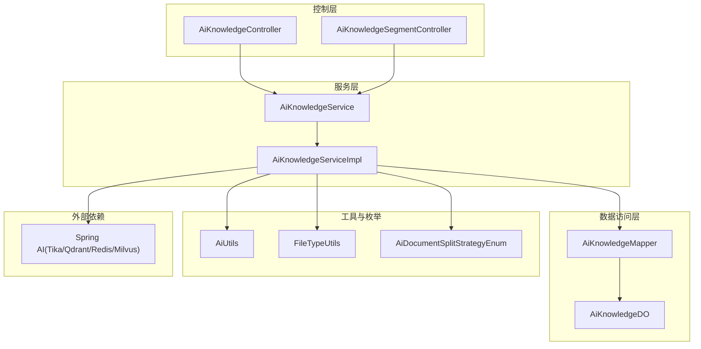
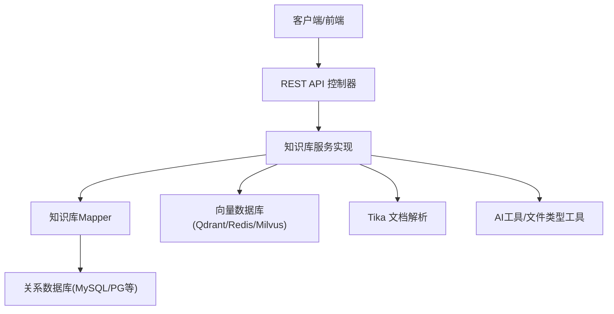
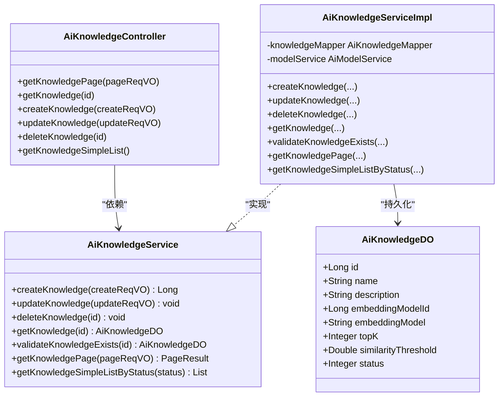
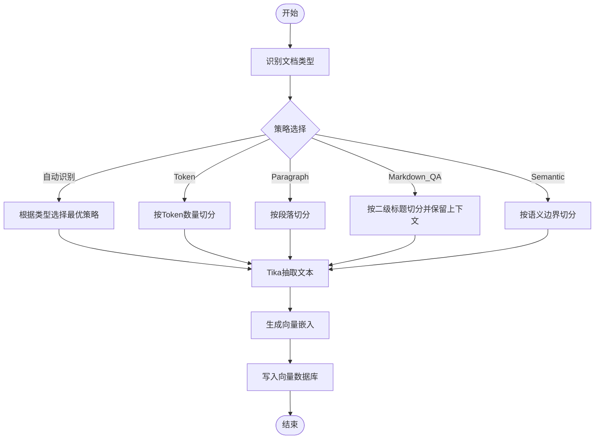
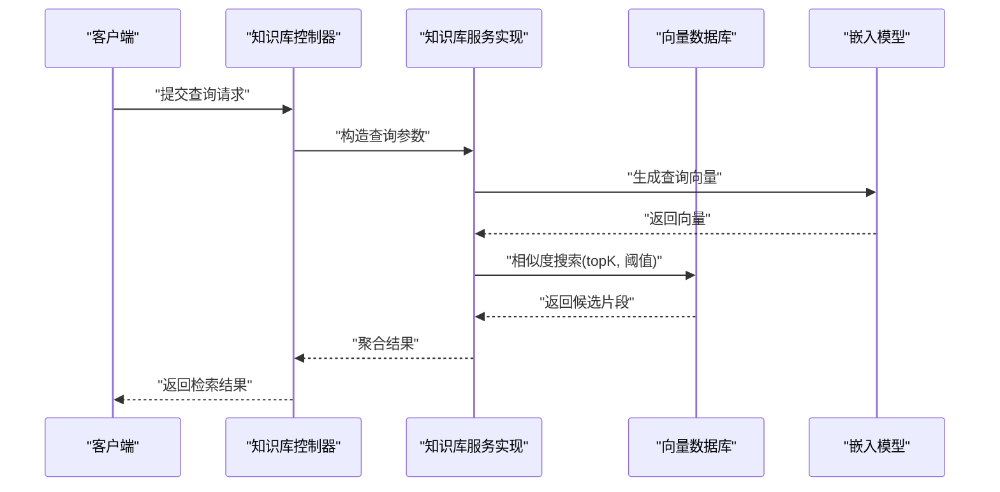
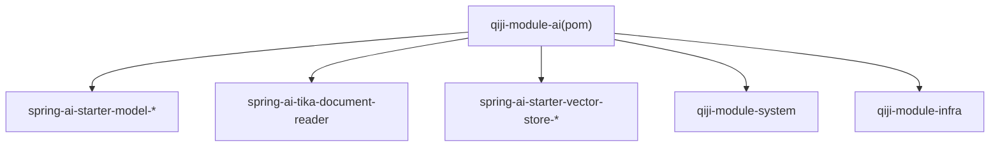

# AI知识库管理

<cite>
**本文引用的文件**
- [AiKnowledgeController.java](file://qiji-module-ai/src/main/java/com.qiji.cps/module/ai/controller/admin/knowledge/AiKnowledgeController.java)
- [AiKnowledgeService.java](file://qiji-module-ai/src/main/java/com.qiji.cps/module/ai/service/knowledge/AiKnowledgeService.java)
- [AiKnowledgeServiceImpl.java](file://qiji-module-ai/src/main/java/com.qiji.cps/module/ai/service/knowledge/AiKnowledgeServiceImpl.java)
- [AiKnowledgeDO.java](file://qiji-module-ai/src/main/java/com.qiji.cps/module/ai/dal/dataobject/knowledge/AiKnowledgeDO.java)
- [AiKnowledgeSegmentController.java](file://qiji-module-ai/src/main/java/com.qiji.cps/module/ai/controller/admin/knowledge/AiKnowledgeSegmentController.java)
- [AiDocumentSplitStrategyEnum.java](file://qiji-module-ai/src/main/java/com.qiji.cps/module/ai/enums/AiDocumentSplitStrategyEnum.java)
- [AiKnowledgeMapper.java](file://qiji-module-ai/src/main/java/com.qiji.cps/module/ai/dal/mysql/knowledge/AiKnowledgeMapper.java)
- [AiUtils.java](file://qiji-module-ai/src/main/java/com.qiji.cps/module/ai/util/AiUtils.java)
- [FileTypeUtils.java](file://qiji-module-ai/src/main/java/com.qiji.cps/module/ai/util/FileTypeUtils.java)
- [pom.xml](file://qiji-module-ai/pom.xml)
</cite>

## 目录
1. [简介](#简介)
2. [项目结构](#项目结构)
3. [核心组件](#核心组件)
4. [架构总览](#架构总览)
5. [详细组件分析](#详细组件分析)
6. [依赖分析](#依赖分析)
7. [性能考虑](#性能考虑)
8. [故障排查指南](#故障排查指南)
9. [结论](#结论)
10. [附录](#附录)

## 简介
本技术文档围绕AI知识库管理功能展开，系统性梳理从“文档上传、内容解析、分段处理、向量化存储”到“检索与查询”的完整链路。重点覆盖以下方面：
- 多格式文档支持与内容提取：PDF、Word、Excel等常见格式的解析与文本抽取。
- 分段策略：自动识别、Token切分、段落切分、Markdown QA切分、语义切分等策略及适用场景。
- 向量数据库集成：基于Spring AI生态的Qdrant、Redis、Milvus等向量存储方案。
- 检索机制：全文检索、语义搜索、混合检索的实现思路与优化方向。
- 管理API：知识库基础信息、分段管理、查询与优化相关的接口定义与使用示例。

## 项目结构
AI知识库模块位于qiji-module-ai中，采用按功能域划分的层次化组织方式：
- controller层：对外暴露REST接口，如知识库管理、分段管理等。
- service层：封装业务逻辑，如知识库CRUD、分段查询、向量化执行等。
- dal层：MyBatis映射，包含数据对象与Mapper接口。
- enums：领域枚举，如分段策略枚举。
- util：工具类，如AI通用工具、文件类型判断等。
- pom.xml：声明Spring AI、向量存储、Tika文档解析等依赖。

图表来源
- [AiKnowledgeController.java:1-85](file://qiji-module-ai/src/main/java/com.qiji.cps/module/ai/controller/admin/knowledge/AiKnowledgeController.java#L1-L85)
- [AiKnowledgeSegmentController.java:1-25](file://qiji-module-ai/src/main/java/com.qiji.cps/module/ai/controller/admin/knowledge/AiKnowledgeSegmentController.java#L1-L25)
- [AiKnowledgeService.java:1-71](file://qiji-module-ai/src/main/java/com.qiji.cps/module/ai/service/knowledge/AiKnowledgeService.java#L1-L71)
- [AiKnowledgeServiceImpl.java:1-36](file://qiji-module-ai/src/main/java/com.qiji.cps/module/ai/service/knowledge/AiKnowledgeServiceImpl.java#L1-L36)
- [AiKnowledgeDO.java:1-65](file://qiji-module-ai/src/main/java/com.qiji.cps/module/ai/dal/dataobject/knowledge/AiKnowledgeDO.java#L1-L65)
- [AiKnowledgeMapper.java](file://qiji-module-ai/src/main/java/com.qiji.cps/module/ai/dal/mysql/knowledge/AiKnowledgeMapper.java)
- [AiUtils.java](file://qiji-module-ai/src/main/java/com.qiji.cps/module/ai/util/AiUtils.java)
- [FileTypeUtils.java](file://qiji-module-ai/src/main/java/com.qiji.cps/module/ai/util/FileTypeUtils.java)
- [AiDocumentSplitStrategyEnum.java:1-54](file://qiji-module-ai/src/main/java/com.qiji.cps/module/ai/enums/AiDocumentSplitStrategyEnum.java#L1-L54)
- [pom.xml:1-265](file://qiji-module-ai/pom.xml#L1-L265)

章节来源
- [AiKnowledgeController.java:1-85](file://qiji-module-ai/src/main/java/com.qiji.cps/module/ai/controller/admin/knowledge/AiKnowledgeController.java#L1-L85)
- [AiKnowledgeService.java:1-71](file://qiji-module-ai/src/main/java/com.qiji.cps/module/ai/service/knowledge/AiKnowledgeService.java#L1-L71)
- [AiKnowledgeServiceImpl.java:1-36](file://qiji-module-ai/src/main/java/com.qiji.cps/module/ai/service/knowledge/AiKnowledgeServiceImpl.java#L1-L36)
- [AiKnowledgeDO.java:1-65](file://qiji-module-ai/src/main/java/com.qiji.cps/module/ai/dal/dataobject/knowledge/AiKnowledgeDO.java#L1-L65)
- [AiDocumentSplitStrategyEnum.java:1-54](file://qiji-module-ai/src/main/java/com.qiji.cps/module/ai/enums/AiDocumentSplitStrategyEnum.java#L1-L54)
- [pom.xml:1-265](file://qiji-module-ai/pom.xml#L1-L265)

## 核心组件
- 控制器
  - 知识库控制器：提供知识库的分页查询、详情获取、创建、更新、删除、简易列表等接口。
  - 分段控制器：提供分段相关的查询、搜索等接口（具体实现由服务层承载）。
- 服务层
  - 知识库服务接口与实现：封装知识库的CRUD、分页查询、状态筛选等。
  - 依赖模型服务：通过模型编号关联向量模型配置。
- 数据对象与映射
  - 知识库DO：包含名称、描述、向量模型编号/标识、topK、相似度阈值、状态等字段。
  - Mapper：持久化操作入口。
- 工具与枚举
  - 分段策略枚举：定义多种分段策略代码与名称。
  - AI工具与文件类型工具：支撑向量化与文件类型识别。

章节来源
- [AiKnowledgeController.java:1-85](file://qiji-module-ai/src/main/java/com.qiji.cps/module/ai/controller/admin/knowledge/AiKnowledgeController.java#L1-L85)
- [AiKnowledgeService.java:1-71](file://qiji-module-ai/src/main/java/com.qiji.cps/module/ai/service/knowledge/AiKnowledgeService.java#L1-L71)
- [AiKnowledgeServiceImpl.java:1-36](file://qiji-module-ai/src/main/java/com.qiji.cps/module/ai/service/knowledge/AiKnowledgeServiceImpl.java#L1-L36)
- [AiKnowledgeDO.java:1-65](file://qiji-module-ai/src/main/java/com.qiji.cps/module/ai/dal/dataobject/knowledge/AiKnowledgeDO.java#L1-L65)
- [AiDocumentSplitStrategyEnum.java:1-54](file://qiji-module-ai/src/main/java/com.qiji.cps/module/ai/enums/AiDocumentSplitStrategyEnum.java#L1-L54)
- [AiUtils.java](file://qiji-module-ai/src/main/java/com.qiji.cps/module/ai/util/AiUtils.java)
- [FileTypeUtils.java](file://qiji-module-ai/src/main/java/com.qiji.cps/module/ai/util/FileTypeUtils.java)

## 架构总览
整体架构遵循“控制层-服务层-数据访问层-外部依赖”的分层设计，结合Spring AI提供的文档解析与向量存储能力，形成从文档到向量的闭环。

图表来源
- [AiKnowledgeController.java:1-85](file://qiji-module-ai/src/main/java/com.qiji.cps/module/ai/controller/admin/knowledge/AiKnowledgeController.java#L1-L85)
- [AiKnowledgeServiceImpl.java:1-36](file://qiji-module-ai/src/main/java/com.qiji.cps/module/ai/service/knowledge/AiKnowledgeServiceImpl.java#L1-L36)
- [AiKnowledgeMapper.java](file://qiji-module-ai/src/main/java/com.qiji.cps/module/ai/dal/mysql/knowledge/AiKnowledgeMapper.java)
- [pom.xml:147-196](file://qiji-module-ai/pom.xml#L147-L196)

## 详细组件分析

### 知识库控制器与服务
- 控制器职责
  - 提供分页查询、详情获取、创建、更新、删除、简易列表等接口。
  - 使用权限注解进行安全控制。
- 服务接口与实现
  - 接口定义标准的CRUD与分页方法。
  - 实现类注入Mapper与模型服务，完成业务编排与异常处理。

图表来源
- [AiKnowledgeController.java:1-85](file://qiji-module-ai/src/main/java/com.qiji.cps/module/ai/controller/admin/knowledge/AiKnowledgeController.java#L1-L85)
- [AiKnowledgeService.java:1-71](file://qiji-module-ai/src/main/java/com.qiji.cps/module/ai/service/knowledge/AiKnowledgeService.java#L1-L71)
- [AiKnowledgeServiceImpl.java:1-36](file://qiji-module-ai/src/main/java/com.qiji.cps/module/ai/service/knowledge/AiKnowledgeServiceImpl.java#L1-L36)
- [AiKnowledgeDO.java:1-65](file://qiji-module-ai/src/main/java/com.qiji.cps/module/ai/dal/dataobject/knowledge/AiKnowledgeDO.java#L1-L65)

章节来源
- [AiKnowledgeController.java:1-85](file://qiji-module-ai/src/main/java/com.qiji.cps/module/ai/controller/admin/knowledge/AiKnowledgeController.java#L1-L85)
- [AiKnowledgeService.java:1-71](file://qiji-module-ai/src/main/java/com.qiji.cps/module/ai/service/knowledge/AiKnowledgeService.java#L1-L71)
- [AiKnowledgeServiceImpl.java:1-36](file://qiji-module-ai/src/main/java/com.qiji.cps/module/ai/service/knowledge/AiKnowledgeServiceImpl.java#L1-L36)
- [AiKnowledgeDO.java:1-65](file://qiji-module-ai/src/main/java/com.qiji.cps/module/ai/dal/dataobject/knowledge/AiKnowledgeDO.java#L1-L65)

### 分段策略与文档处理
- 分段策略枚举
  - 自动识别、Token切分、段落切分、Markdown QA切分、语义切分。
  - 适用于不同文档类型与检索目标，如问答对、长文档、结构化内容等。
- 文档处理与解析
  - 通过Tika文档读取器实现PDF、Word、Excel等格式的文本抽取。
  - 文件类型识别工具辅助判定与路由。

图表来源
- [AiDocumentSplitStrategyEnum.java:1-54](file://qiji-module-ai/src/main/java/com.qiji.cps/module/ai/enums/AiDocumentSplitStrategyEnum.java#L1-L54)
- [FileTypeUtils.java](file://qiji-module-ai/src/main/java/com.qiji.cps/module/ai/util/FileTypeUtils.java)
- [pom.xml:180-196](file://qiji-module-ai/pom.xml#L180-L196)

章节来源
- [AiDocumentSplitStrategyEnum.java:1-54](file://qiji-module-ai/src/main/java/com.qiji.cps/module/ai/enums/AiDocumentSplitStrategyEnum.java#L1-L54)
- [FileTypeUtils.java](file://qiji-module-ai/src/main/java/com.qiji.cps/module/ai/util/FileTypeUtils.java)
- [pom.xml:180-196](file://qiji-module-ai/pom.xml#L180-L196)

### 向量数据库集成与检索
- 向量存储方案
  - Qdrant、Redis、Milvus等通过Spring AI Starter接入。
  - 支持向量索引建立、相似度搜索、查询优化等能力。
- 检索机制
  - 语义搜索：基于嵌入模型与向量相似度。
  - 混合检索：结合关键词与向量结果，提升召回质量。
  - 查询优化：通过topK与相似度阈值控制召回范围与质量。

图表来源
- [AiKnowledgeController.java:1-85](file://qiji-module-ai/src/main/java/com.qiji.cps/module/ai/controller/admin/knowledge/AiKnowledgeController.java#L1-L85)
- [AiKnowledgeServiceImpl.java:1-36](file://qiji-module-ai/src/main/java/com.qiji.cps/module/ai/service/knowledge/AiKnowledgeServiceImpl.java#L1-L36)
- [pom.xml:147-178](file://qiji-module-ai/pom.xml#L147-L178)

章节来源
- [pom.xml:147-178](file://qiji-module-ai/pom.xml#L147-L178)
- [AiKnowledgeServiceImpl.java:1-36](file://qiji-module-ai/src/main/java/com.qiji.cps/module/ai/service/knowledge/AiKnowledgeServiceImpl.java#L1-L36)

### 分段管理与查询
- 分段控制器
  - 提供分段查询、搜索等接口，配合服务层BO进行复杂检索。
- 服务层协作
  - 结合分段策略与向量存储，实现高质量检索。

章节来源
- [AiKnowledgeSegmentController.java:1-25](file://qiji-module-ai/src/main/java/com.qiji.cps/module/ai/controller/admin/knowledge/AiKnowledgeSegmentController.java#L1-L25)

## 依赖分析
- Spring AI生态
  - OpenAI、Azure OpenAI、Anthropic、DeepSeek、Ollama、Stability AI、智谱GLM、Minimax等模型接入。
  - Tika文档读取器用于多格式文档解析。
  - Qdrant、Redis、Milvus向量存储集成。
- 模块依赖
  - 依赖系统与基础设施模块，提供安全、作业调度、Redis、MyBatis等能力。

图表来源
- [pom.xml:1-265](file://qiji-module-ai/pom.xml#L1-L265)

章节来源
- [pom.xml:1-265](file://qiji-module-ai/pom.xml#L1-L265)

## 性能考虑
- 分段策略选择
  - 长文档优先语义切分或段落切分，减少截断；问答对优先Markdown QA切分。
- 向量检索优化
  - 合理设置topK与相似度阈值，平衡召回率与响应速度。
  - 向量索引与批量写入策略，降低写放大。
- 文档解析
  - 对大文件采用流式解析与分批处理，避免内存峰值过高。
- 并发与缓存
  - 对热点查询结果进行缓存，结合Redis实现低延迟检索。

## 故障排查指南
- 常见问题
  - 文档解析失败：检查Tika依赖是否正确引入，确认文件格式受支持。
  - 向量检索异常：核对嵌入模型配置、向量维度与索引一致性。
  - 权限不足：确认控制器上的权限注解与用户角色授权。
- 排查步骤
  - 查看服务层异常抛出与错误码常量。
  - 检查向量数据库连通性与索引状态。
  - 校验分段策略与文件类型匹配度。

章节来源
- [AiKnowledgeService.java:1-71](file://qiji-module-ai/src/main/java/com.qiji.cps/module/ai/service/knowledge/AiKnowledgeService.java#L1-L71)
- [AiKnowledgeServiceImpl.java:1-36](file://qiji-module-ai/src/main/java/com.qiji.cps/module/ai/service/knowledge/AiKnowledgeServiceImpl.java#L1-L36)
- [pom.xml:180-196](file://qiji-module-ai/pom.xml#L180-L196)

## 结论
该AI知识库管理模块以清晰的分层架构为基础，结合Spring AI生态实现了从文档解析、分段策略、向量化存储到检索查询的完整链路。通过灵活的分段策略与多样的向量存储方案，能够满足不同业务场景下的知识管理需求。建议在生产环境中重点关注分段策略适配、向量检索参数调优与向量数据库运维保障。

## 附录

### API接口清单（知识库）
- 获取知识库分页
  - 方法：GET
  - 路径：/ai/knowledge/page
  - 权限：ai:knowledge:query
  - 返回：分页结果（包含知识库列表）
- 获得知识库
  - 方法：GET
  - 路径：/ai/knowledge/get?id={id}
  - 权限：ai:knowledge:query
  - 返回：单个知识库详情
- 创建知识库
  - 方法：POST
  - 路径：/ai/knowledge/create
  - 权限：ai:knowledge:create
  - 返回：新增知识库编号
- 更新知识库
  - 方法：PUT
  - 路径：/ai/knowledge/update
  - 权限：ai:knowledge:update
  - 返回：布尔成功标志
- 删除知识库
  - 方法：DELETE
  - 路径：/ai/knowledge/delete?id={id}
  - 权限：ai:knowledge:delete
  - 返回：布尔成功标志
- 精简列表
  - 方法：GET
  - 路径：/ai/knowledge/simple-list
  - 返回：启用状态的知识库精简列表（id与name）

章节来源
- [AiKnowledgeController.java:1-85](file://qiji-module-ai/src/main/java/com.qiji.cps/module/ai/controller/admin/knowledge/AiKnowledgeController.java#L1-L85)

### 使用示例与最佳实践
- 示例：创建知识库
  - 步骤：准备创建请求体（名称、描述、向量模型编号、topK、相似度阈值、状态），调用创建接口，记录返回的编号。
  - 注意：确保向量模型已配置且可用。
- 示例：分段与检索
  - 步骤：选择合适分段策略，使用Tika解析文档，生成向量并写入向量数据库；查询时设置topK与阈值，结合语义搜索与混合检索提升效果。
- 最佳实践
  - 文档预处理：统一编码、去除噪声、标准化标题层级。
  - 分段策略：根据文档类型与用途动态选择策略，定期评估召回与质量指标。
  - 向量检索：合理设置topK与阈值，结合业务反馈持续优化。