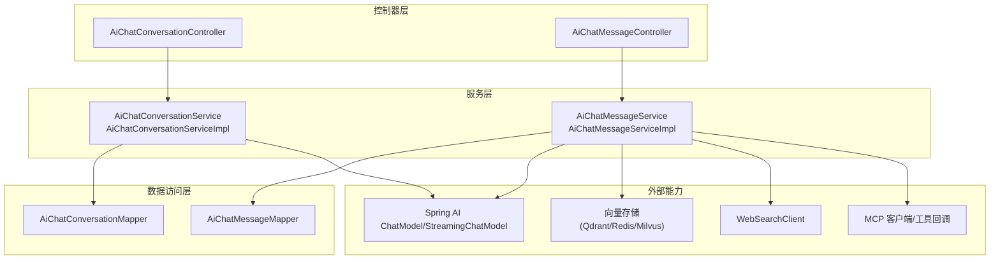
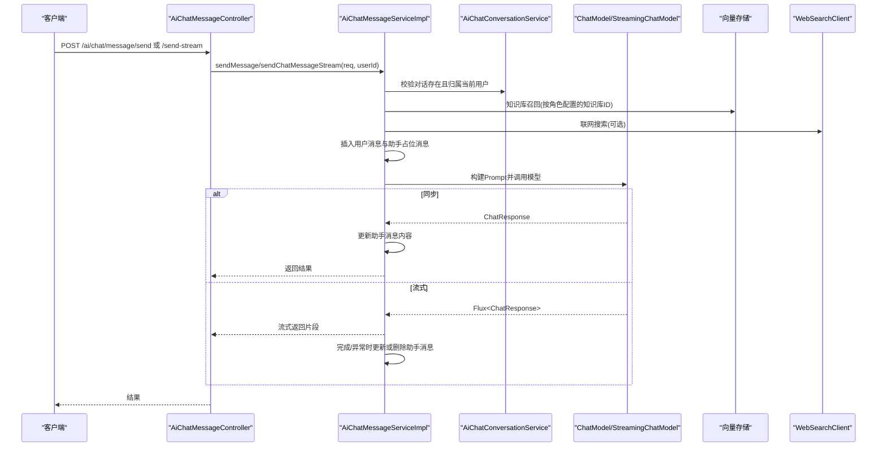
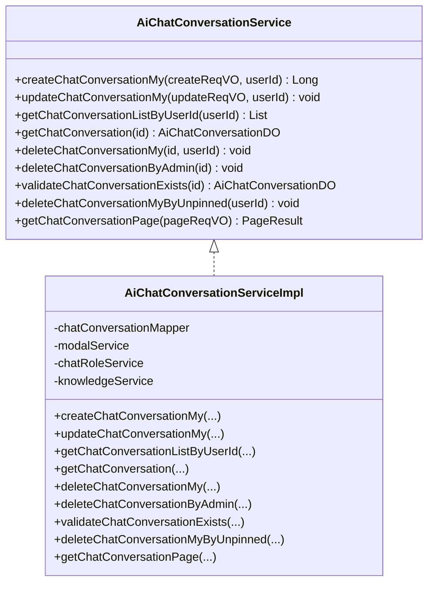
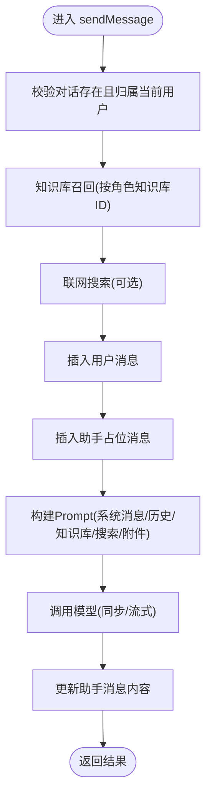
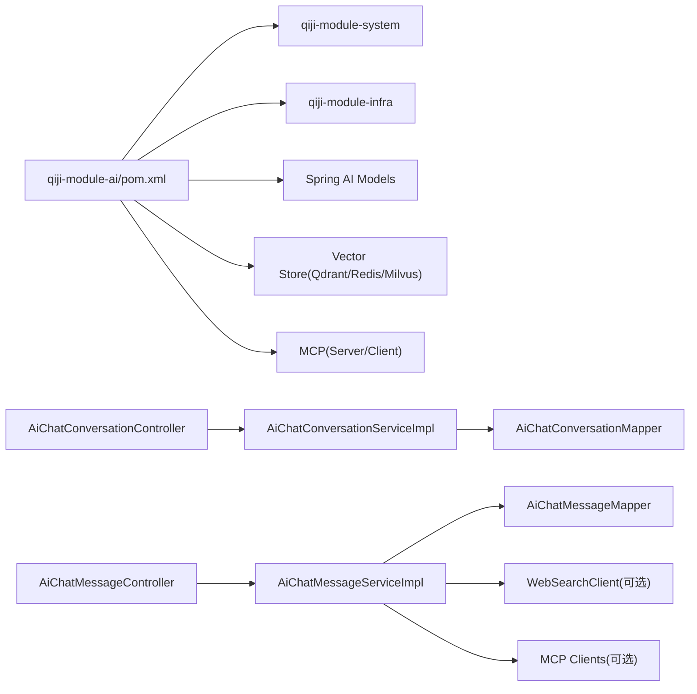

# AI聊天服务

<cite>
**本文引用的文件**
- [AiChatConversationService.java](file://qiji-module-ai/src/main/java/com.qiji.cps/module/ai/service/chat/AiChatConversationService.java)
- [AiChatConversationServiceImpl.java](file://qiji-module-ai/src/main/java/com.qiji.cps/module/ai/service/chat/AiChatConversationServiceImpl.java)
- [AiChatMessageService.java](file://qiji-module-ai/src/main/java/com.qiji.cps/module/ai/service/chat/AiChatMessageService.java)
- [AiChatMessageServiceImpl.java](file://qiji-module-ai/src/main/java/com.qiji.cps/module/ai/service/chat/AiChatMessageServiceImpl.java)
- [AiChatConversationController.java](file://qiji-module-ai/src/main/java/com.qiji.cps/module/ai/controller/admin/chat/AiChatConversationController.java)
- [AiChatMessageController.java](file://qiji-module-ai/src/main/java/com.qiji.cps/module/ai/controller/admin/chat/AiChatMessageController.java)
- [pom.xml](file://qiji-module-ai/pom.xml)
</cite>

## 目录
1. [简介](#简介)
2. [项目结构](#项目结构)
3. [核心组件](#核心组件)
4. [架构总览](#架构总览)
5. [详细组件分析](#详细组件分析)
6. [依赖关系分析](#依赖关系分析)
7. [性能考虑](#性能考虑)
8. [故障排查指南](#故障排查指南)
9. [结论](#结论)
10. [附录](#附录)

## 简介
本文件面向“AI聊天服务”功能，围绕对话管理、消息处理、会话生命周期、角色与权限、性能优化以及RESTful接口进行全面技术说明。读者可据此理解系统如何创建对话、发送消息、查询历史、管理上下文与附件、整合知识库与联网搜索、以及如何通过流式接口提升交互体验。

## 项目结构
AI聊天服务位于 qiji-module-ai 模块中，采用典型的分层架构：
- 控制器层：对外暴露 REST 接口，负责参数接收、鉴权与结果封装
- 服务层：实现业务逻辑，包括对话与消息的增删改查、上下文构建、工具回调、知识库与联网搜索集成
- 数据访问层：基于 MyBatis 的 Mapper 进行数据库操作
- 框架与工具：集成 Spring AI、向量存储、MCP 工具、Web 搜索等能力

图表来源
- [AiChatConversationController.java:32-119](file://qiji-module-ai/src/main/java/com.qiji.cps/module/ai/controller/admin/chat/AiChatConversationController.java#L32-L119)
- [AiChatMessageController.java:42-158](file://qiji-module-ai/src/main/java/com.qiji.cps/module/ai/controller/admin/chat/AiChatMessageController.java#L42-L158)
- [AiChatConversationServiceImpl.java:34-174](file://qiji-module-ai/src/main/java/com.qiji.cps/module/ai/service/chat/AiChatConversationServiceImpl.java#L34-L174)
- [AiChatMessageServiceImpl.java:74-571](file://qiji-module-ai/src/main/java/com.qiji.cps/module/ai/service/chat/AiChatMessageServiceImpl.java#L74-L571)

章节来源
- [AiChatConversationController.java:32-119](file://qiji-module-ai/src/main/java/com.qiji.cps/module/ai/controller/admin/chat/AiChatConversationController.java#L32-L119)
- [AiChatMessageController.java:42-158](file://qiji-module-ai/src/main/java/com.qiji.cps/module/ai/controller/admin/chat/AiChatMessageController.java#L42-L158)
- [AiChatConversationServiceImpl.java:34-174](file://qiji-module-ai/src/main/java/com.qiji.cps/module/ai/service/chat/AiChatConversationServiceImpl.java#L34-L174)
- [AiChatMessageServiceImpl.java:74-571](file://qiji-module-ai/src/main/java/com.qiji.cps/module/ai/service/chat/AiChatMessageServiceImpl.java#L74-L571)

## 核心组件
- 对话服务：负责创建、更新、查询、删除对话，支持置顶时间维护与默认模型校验
- 消息服务：负责消息发送（同步/流式）、历史消息查询、消息删除、上下文裁剪、附件与知识库/联网搜索拼接
- 控制器：提供 REST 接口，完成鉴权、参数校验与结果封装

章节来源
- [AiChatConversationService.java:12-91](file://qiji-module-ai/src/main/java/com.qiji.cps/module/ai/service/chat/AiChatConversationService.java#L12-L91)
- [AiChatMessageService.java:15-88](file://qiji-module-ai/src/main/java/com.qiji.cps/module/ai/service/chat/AiChatMessageService.java#L15-L88)

## 架构总览
系统通过控制器接收请求，调用服务层完成业务处理，服务层再与模型、向量存储、Web 搜索、MCP 工具等外部能力协作，最终持久化到数据库。

图表来源
- [AiChatMessageController.java:59-69](file://qiji-module-ai/src/main/java/com.qiji.cps/module/ai/controller/admin/chat/AiChatMessageController.java#L59-L69)
- [AiChatMessageServiceImpl.java:140-303](file://qiji-module-ai/src/main/java/com.qiji.cps/module/ai/service/chat/AiChatMessageServiceImpl.java#L140-L303)
- [AiChatConversationServiceImpl.java:54-109](file://qiji-module-ai/src/main/java/com.qiji.cps/module/ai/service/chat/AiChatConversationServiceImpl.java#L54-L109)

## 详细组件分析

### 对话管理组件
- 功能要点
  - 创建对话：根据角色或默认模型初始化对话，填充温度、最大上下文、最大令牌等参数
  - 更新对话：支持模型切换、置顶与置顶时间更新、知识库校验
  - 查询与分页：支持按用户查询、管理员分页查询
  - 删除：支持用户删除自己的对话、管理员删除、未置顶批量清理
  - 校验：严格校验对话归属与存在性

图表来源
- [AiChatConversationService.java:12-91](file://qiji-module-ai/src/main/java/com.qiji.cps/module/ai/service/chat/AiChatConversationService.java#L12-L91)
- [AiChatConversationServiceImpl.java:34-174](file://qiji-module-ai/src/main/java/com.qiji.cps/module/ai/service/chat/AiChatConversationServiceImpl.java#L34-L174)

章节来源
- [AiChatConversationService.java:12-91](file://qiji-module-ai/src/main/java/com.qiji.cps/module/ai/service/chat/AiChatConversationService.java#L12-L91)
- [AiChatConversationServiceImpl.java:54-171](file://qiji-module-ai/src/main/java/com.qiji.cps/module/ai/service/chat/AiChatConversationServiceImpl.java#L54-L171)

### 消息处理组件
- 功能要点
  - 同步发送：插入用户消息与助手占位消息，调用模型生成回复，更新助手消息内容
  - 流式发送：构建流式响应，边生成边返回，完成后更新内容，异常/取消时回退处理
  - 上下文管理：按最大上下文对历史消息进行裁剪，保证模型输入长度合理
  - 附件处理：支持图片(Base64)与非图片文本读取，拼装为 UserMessage
  - 知识库与联网搜索：将检索到的内容以特定标记拼接到用户消息中
  - 工具与MCP：根据角色绑定的工具或MCP客户端动态注入工具回调
  - 删除与分页：支持按消息、按对话、管理员删除，以及分页查询与拼接角色名

图表来源
- [AiChatMessageServiceImpl.java:140-194](file://qiji-module-ai/src/main/java/com.qiji.cps/module/ai/service/chat/AiChatMessageServiceImpl.java#L140-L194)

章节来源
- [AiChatMessageService.java:15-88](file://qiji-module-ai/src/main/java/com.qiji.cps/module/ai/service/chat/AiChatMessageService.java#L15-L88)
- [AiChatMessageServiceImpl.java:140-571](file://qiji-module-ai/src/main/java/com.qiji.cps/module/ai/service/chat/AiChatMessageServiceImpl.java#L140-L571)

### 角色与权限管理
- 角色维度
  - 角色绑定知识库ID集合，用于消息发送时的知识库召回
  - 角色可绑定工具ID或MCP客户端名称，用于动态注入工具回调
  - 角色可配置系统消息，作为对话的系统提示词
- 权限控制
  - 对话与消息的查询/删除均校验归属用户，防止越权
  - 管理员接口需要相应权限

章节来源
- [AiChatMessageServiceImpl.java:305-323](file://qiji-module-ai/src/main/java/com.qiji.cps/module/ai/service/chat/AiChatMessageServiceImpl.java#L305-L323)
- [AiChatMessageServiceImpl.java:390-425](file://qiji-module-ai/src/main/java/com.qiji.cps/module/ai/service/chat/AiChatMessageServiceImpl.java#L390-L425)
- [AiChatConversationController.java:91-116](file://qiji-module-ai/src/main/java/com.qiji.cps/module/ai/controller/admin/chat/AiChatConversationController.java#L91-L116)
- [AiChatMessageController.java:130-155](file://qiji-module-ai/src/main/java/com.qiji.cps/module/ai/controller/admin/chat/AiChatMessageController.java#L130-L155)

## 依赖关系分析
- 模块依赖
  - qiji-module-ai 依赖 qiji-module-system 与 qiji-module-infra 提供安全、多租户、作业、Redis、MyBatis 等基础能力
  - Spring AI Starter 集成多种平台模型（OpenAI、Azure、Anthropic、DeepSeek、Ollama、Stability AI、Zhipu、Minimax）
  - 向量存储支持 Qdrant、Redis、Milvus
  - MCP 支持服务端与客户端，用于工具扩展
- 组件耦合
  - 控制器依赖服务接口，服务实现依赖 Mapper 与领域服务（模型、知识库、角色、工具）
  - 消息服务与外部能力解耦，通过可选注入方式启用 Web 搜索与 MCP

图表来源
- [pom.xml:28-261](file://qiji-module-ai/pom.xml#L28-L261)

章节来源
- [pom.xml:28-261](file://qiji-module-ai/pom.xml#L28-L261)

## 性能考虑
- 消息缓存与上下文裁剪
  - 通过 maxContexts 限制历史消息组数，避免上下文过长导致延迟与成本上升
- 流式响应
  - 使用流式模型接口，边生成边返回，显著降低首字节延迟
- 租户隔离与异步更新
  - 流式场景在完成/异常/取消时异步更新助手消息，避免阻塞响应
- 附件处理
  - 图片转 Base64，非图片读取文本内容，减少二次 IO
- 可选能力
  - Web 搜索与 MCP 客户端按配置可关闭，避免不必要的调用开销

章节来源
- [AiChatMessageServiceImpl.java:437-465](file://qiji-module-ai/src/main/java/com.qiji.cps/module/ai/service/chat/AiChatMessageServiceImpl.java#L437-L465)
- [AiChatMessageServiceImpl.java:196-303](file://qiji-module-ai/src/main/java/com.qiji.cps/module/ai/service/chat/AiChatMessageServiceImpl.java#L196-L303)
- [AiChatMessageServiceImpl.java:467-501](file://qiji-module-ai/src/main/java/com.qiji.cps/module/ai/service/chat/AiChatMessageServiceImpl.java#L467-L501)

## 故障排查指南
- 对话不存在或越权
  - 现象：删除/查询返回失败
  - 排查：确认对话归属用户、接口是否传入正确 id
- 模型参数缺失
  - 现象：创建对话时报模型参数错误
  - 排查：检查默认聊天模型是否配置温度、最大令牌、最大上下文
- 流式异常/取消
  - 现象：前端长时间无响应或出现错误
  - 排查：查看服务端日志，确认异常/取消回调是否正确更新或删除助手消息
- 知识库/搜索未生效
  - 现象：消息未携带参考内容
  - 排查：确认角色是否配置知识库ID、Web 搜索开关是否开启

章节来源
- [AiChatConversationServiceImpl.java:143-149](file://qiji-module-ai/src/main/java/com.qiji.cps/module/ai/service/chat/AiChatConversationServiceImpl.java#L143-L149)
- [AiChatMessageServiceImpl.java:271-302](file://qiji-module-ai/src/main/java/com.qiji.cps/module/ai/service/chat/AiChatMessageServiceImpl.java#L271-L302)
- [AiChatMessageServiceImpl.java:305-323](file://qiji-module-ai/src/main/java/com.qiji.cps/module/ai/service/chat/AiChatMessageServiceImpl.java#L305-L323)

## 结论
AI聊天服务通过清晰的分层设计与可插拔的外部能力，实现了从对话创建、消息发送、历史查询到上下文与附件管理的完整闭环。结合流式响应、上下文裁剪与可选工具/搜索能力，系统在易用性与性能上取得良好平衡。建议在生产环境中合理配置模型参数、上下文长度与可选能力开关，以获得更优的用户体验与资源利用率。

## 附录

### API 接口文档

- 对话管理
  - POST /ai/chat/conversation/create-my
    - 请求体：AiChatConversationCreateMyReqVO
    - 认证：登录用户
    - 返回：对话编号
  - PUT /ai/chat/conversation/update-my
    - 请求体：AiChatConversationUpdateMyReqVO
    - 认证：登录用户
    - 返回：true
  - GET /ai/chat/conversation/my-list
    - 认证：登录用户
    - 返回：对话列表
  - GET /ai/chat/conversation/get-my
    - 查询参数：id(Long)
    - 认证：登录用户
    - 返回：单个对话（若非本人则为空）
  - DELETE /ai/chat/conversation/delete-my
    - 查询参数：id(Long)
    - 认证：登录用户
    - 返回：true
  - DELETE /ai/chat/conversation/delete-by-unpinned
    - 认证：登录用户
    - 返回：true
  - GET /ai/chat/conversation/page
    - 查询参数：AiChatConversationPageReqVO
    - 权限：ai:chat-conversation:query
    - 返回：对话分页（含消息数量）

- 消息管理
  - POST /ai/chat/message/send
    - 请求体：AiChatMessageSendReqVO
    - 认证：登录用户
    - 返回：AiChatMessageSendRespVO（一次性返回）
  - POST /ai/chat/message/send-stream
    - 请求体：AiChatMessageSendReqVO
    - 认证：登录用户
    - 返回：SSE 流式 AiChatMessageSendRespVO 片段
  - GET /ai/chat/message/list-by-conversation-id
    - 查询参数：conversationId(Long)
    - 认证：登录用户
    - 返回：消息列表（含知识库段落信息）
  - DELETE /ai/chat/message/delete
    - 查询参数：id(Long)
    - 认证：登录用户
    - 返回：true
  - DELETE /ai/chat/message/delete-by-conversation-id
    - 查询参数：conversationId(Long)
    - 认证：登录用户
    - 返回：true
  - GET /ai/chat/message/page
    - 查询参数：AiChatMessagePageReqVO
    - 权限：ai:chat-conversation:query
    - 返回：消息分页（含角色名）

章节来源
- [AiChatConversationController.java:43-116](file://qiji-module-ai/src/main/java/com.qiji.cps/module/ai/controller/admin/chat/AiChatConversationController.java#L43-L116)
- [AiChatMessageController.java:59-155](file://qiji-module-ai/src/main/java/com.qiji.cps/module/ai/controller/admin/chat/AiChatMessageController.java#L59-L155)