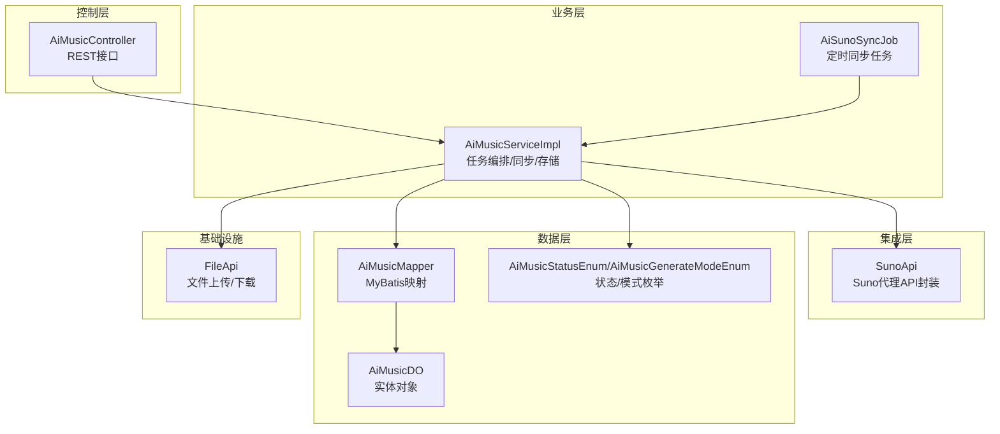
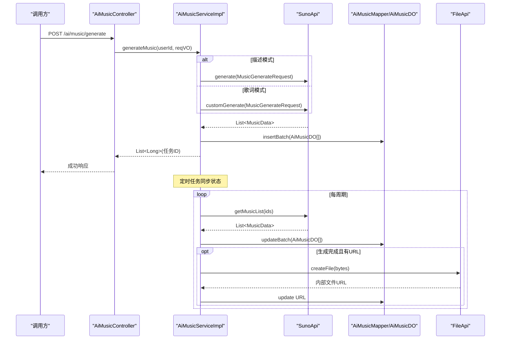
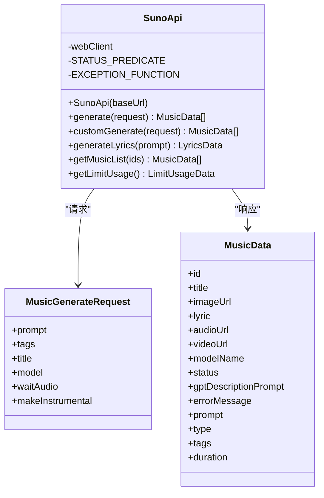
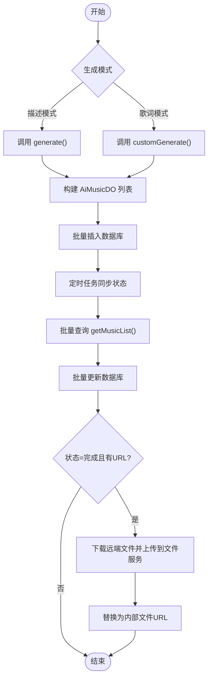
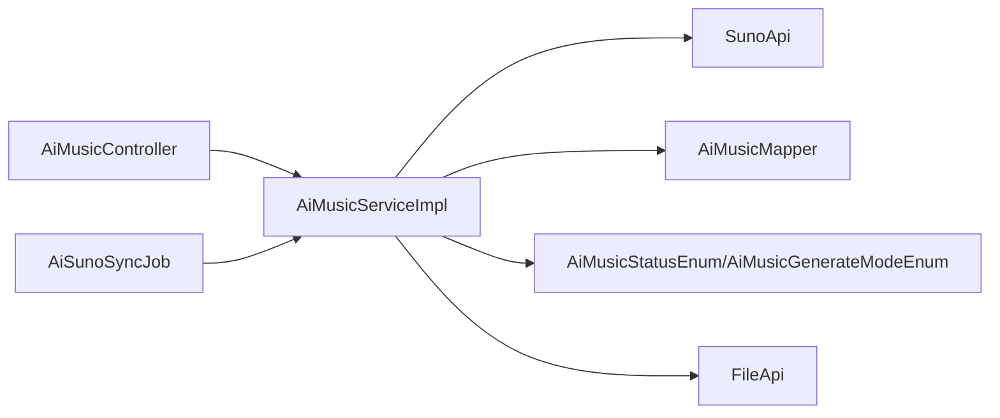

# AI音乐生成功能

<cite>
**本文引用的文件**   
- [SunoApi.java](file://qiji-module-ai/src/main/java/com.qiji.cps/module/ai/framework/ai/core/model/suno/api/SunoApi.java)
- [AiMusicServiceImpl.java](file://qiji-module-ai/src/main/java/com.qiji.cps/module/ai/service/music/AiMusicServiceImpl.java)
- [AiMusicController.java](file://qiji-module-ai/src/main/java/com.qiji.cps/module/ai/controller/admin/music/AiMusicController.java)
- [AiSunoGenerateReqVO.java](file://qiji-module-ai/src/main/java/com.qiji.cps/module/ai/controller/admin/music/vo/AiSunoGenerateReqVO.java)
- [AiMusicRespVO.java](file://qiji-module-ai/src/main/java/com.qiji.cps/module/ai/controller/admin/music/vo/AiMusicRespVO.java)
- [AiMusicDO.java](file://qiji-module-ai/src/main/java/com.qiji.cps/module/ai/dal/dataobject/music/AiMusicDO.java)
- [AiMusicGenerateModeEnum.java](file://qiji-module-ai/src/main/java/com.qiji.cps/module/ai/enums/music/AiMusicGenerateModeEnum.java)
- [AiMusicStatusEnum.java](file://qiji-module-ai/src/main/java/com.qiji.cps/module/ai/enums/music/AiMusicStatusEnum.java)
- [AiSunoSyncJob.java](file://qiji-module-ai/src/main/java/com.qiji.cps/module/ai/job/music/AiSunoSyncJob.java)
- [ai_music表结构.sql](file://sql/module/ai-2025-08-29.sql)
- [SunoApiTests.java](file://qiji-module-ai/src/test/java/com.qiji.cps/module/ai/framework/ai/core/model/music/SunoApiTests.java)
</cite>

## 目录
1. [简介](#简介)
2. [项目结构](#项目结构)
3. [核心组件](#核心组件)
4. [架构总览](#架构总览)
5. [详细组件分析](#详细组件分析)
6. [依赖关系分析](#依赖关系分析)
7. [性能考量](#性能考量)
8. [故障排查指南](#故障排查指南)
9. [结论](#结论)
10. [附录](#附录)

## 简介
本功能基于Suno代理服务实现AI音乐生成功能，支持两种生成模式：描述模式（根据文本描述生成音乐）与歌词模式（根据歌词与风格生成音乐）。系统提供任务提交、状态同步、本地化存储、权限控制与分页查询等能力，并通过定时任务定期拉取Suno任务状态，确保任务进度与结果的准确性。

## 项目结构
围绕AI音乐生成功能的关键模块如下：
- 控制层：对外暴露REST接口，负责参数校验与权限控制
- 业务层：封装Suno API调用、任务状态同步、文件下载与入库
- 数据访问层：持久化音乐任务与元数据
- 枚举与VO：统一状态与参数定义
- 定时任务：周期性同步Suno任务状态

图表来源
- [AiMusicController.java:23-99](file://qiji-module-ai/src/main/java/com.qiji.cps/module/ai/controller/admin/music/AiMusicController.java#L23-L99)
- [AiMusicServiceImpl.java:34-219](file://qiji-module-ai/src/main/java/com.qiji.cps/module/ai/service/music/AiMusicServiceImpl.java#L34-L219)
- [SunoApi.java:20-201](file://qiji-module-ai/src/main/java/com.qiji.cps/module/ai/framework/ai/core/model/suno/api/SunoApi.java#L20-L201)
- [AiMusicDO.java:16-120](file://qiji-module-ai/src/main/java/com.qiji.cps/module/ai/dal/dataobject/music/AiMusicDO.java#L16-L120)
- [AiMusicStatusEnum.java:9-40](file://qiji-module-ai/src/main/java/com.qiji.cps/module/ai/enums/music/AiMusicStatusEnum.java#L9-L40)
- [AiMusicGenerateModeEnum.java:9-38](file://qiji-module-ai/src/main/java/com.qiji.cps/module/ai/enums/music/AiMusicGenerateModeEnum.java#L9-L38)
- [AiSunoSyncJob.java:10-29](file://qiji-module-ai/src/main/java/com.qiji.cps/module/ai/job/music/AiSunoSyncJob.java#L10-L29)

章节来源
- [AiMusicController.java:23-99](file://qiji-module-ai/src/main/java/com.qiji.cps/module/ai/controller/admin/music/AiMusicController.java#L23-L99)
- [AiMusicServiceImpl.java:34-219](file://qiji-module-ai/src/main/java/com.qiji.cps/module/ai/service/music/AiMusicServiceImpl.java#L34-L219)
- [SunoApi.java:20-201](file://qiji-module-ai/src/main/java/com.qiji.cps/module/ai/framework/ai/core/model/suno/api/SunoApi.java#L20-L201)
- [AiMusicDO.java:16-120](file://qiji-module-ai/src/main/java/com.qiji.cps/module/ai/dal/dataobject/music/AiMusicDO.java#L16-L120)
- [AiMusicStatusEnum.java:9-40](file://qiji-module-ai/src/main/java/com.qiji.cps/module/ai/enums/music/AiMusicStatusEnum.java#L9-L40)
- [AiMusicGenerateModeEnum.java:9-38](file://qiji-module-ai/src/main/java/com.qiji.cps/module/ai/enums/music/AiMusicGenerateModeEnum.java#L9-L38)
- [AiSunoSyncJob.java:10-29](file://qiji-module-ai/src/main/java/com.qiji.cps/module/ai/job/music/AiSunoSyncJob.java#L10-L29)

## 核心组件
- SunoApi：封装Suno代理的HTTP接口，包括普通生成、歌词生成、歌词生成、批量查询与配额查询
- AiMusicServiceImpl：业务编排核心，负责参数转换、调用Suno、入库、文件下载、状态同步
- AiMusicController：对外接口，提供生成、分页查询、更新、删除等能力
- AiMusicDO/AiMusicRespVO/AiSunoGenerateReqVO：数据模型与接口参数/响应模型
- AiMusicStatusEnum/AiMusicGenerateModeEnum：状态与生成模式枚举
- AiSunoSyncJob：定时任务，周期性同步Suno任务状态

章节来源
- [SunoApi.java:20-201](file://qiji-module-ai/src/main/java/com.qiji.cps/module/ai/framework/ai/core/model/suno/api/SunoApi.java#L20-L201)
- [AiMusicServiceImpl.java:34-219](file://qiji-module-ai/src/main/java/com.qiji.cps/module/ai/service/music/AiMusicServiceImpl.java#L34-L219)
- [AiMusicController.java:23-99](file://qiji-module-ai/src/main/java/com.qiji.cps/module/ai/controller/admin/music/AiMusicController.java#L23-L99)
- [AiMusicDO.java:16-120](file://qiji-module-ai/src/main/java/com.qiji.cps/module/ai/dal/dataobject/music/AiMusicDO.java#L16-L120)
- [AiMusicRespVO.java:9-70](file://qiji-module-ai/src/main/java/com.qiji.cps/module/ai/controller/admin/music/vo/AiMusicRespVO.java#L9-L70)
- [AiSunoGenerateReqVO.java:11-57](file://qiji-module-ai/src/main/java/com.qiji.cps/module/ai/controller/admin/music/vo/AiSunoGenerateReqVO.java#L11-L57)
- [AiMusicStatusEnum.java:9-40](file://qiji-module-ai/src/main/java/com.qiji.cps/module/ai/enums/music/AiMusicStatusEnum.java#L9-L40)
- [AiMusicGenerateModeEnum.java:9-38](file://qiji-module-ai/src/main/java/com.qiji.cps/module/ai/enums/music/AiMusicGenerateModeEnum.java#L9-L38)
- [AiSunoSyncJob.java:10-29](file://qiji-module-ai/src/main/java/com.qiji.cps/module/ai/job/music/AiSunoSyncJob.java#L10-L29)

## 架构总览
系统采用“控制器-服务-数据访问-外部API”的分层架构，结合定时任务实现异步状态同步。生成流程分为描述模式与歌词模式两类；状态流转由Suno代理返回的状态驱动，业务层将其映射为内部状态枚举。

图表来源
- [AiMusicController.java:38-42](file://qiji-module-ai/src/main/java/com.qiji.cps/module/ai/controller/admin/music/AiMusicController.java#L38-L42)
- [AiMusicServiceImpl.java:52-105](file://qiji-module-ai/src/main/java/com.qiji.cps/module/ai/service/music/AiMusicServiceImpl.java#L52-L105)
- [SunoApi.java:49-101](file://qiji-module-ai/src/main/java/com.qiji.cps/module/ai/framework/ai/core/model/suno/api/SunoApi.java#L49-L101)
- [AiMusicDO.java:16-120](file://qiji-module-ai/src/main/java/com.qiji.cps/module/ai/dal/dataobject/music/AiMusicDO.java#L16-L120)

## 详细组件分析

### SunoApi 组件
- 功能职责
  - 封装Suno代理的REST接口：生成、歌词生成、批量查询、配额查询
  - 使用WebClient发起HTTP请求，统一异常处理与日志输出
  - 提供MusicGenerateRequest/MusicData/LyricsData/LimitUsageData等数据结构
- 关键点
  - 通过构造函数注入基础URL与默认JSON头
  - 使用响应状态判断与自定义异常函数，便于定位失败原因
  - 支持多种请求体与查询参数组合

图表来源
- [SunoApi.java:20-201](file://qiji-module-ai/src/main/java/com.qiji.cps/module/ai/framework/ai/core/model/suno/api/SunoApi.java#L20-L201)

章节来源
- [SunoApi.java:20-201](file://qiji-module-ai/src/main/java/com.qiji.cps/module/ai/framework/ai/core/model/suno/api/SunoApi.java#L20-L201)

### AiMusicServiceImpl 组件
- 功能职责
  - 生成任务：根据生成模式构建请求并调用SunoApi，入库并返回任务ID
  - 同步任务：按状态筛选进行中的任务，分批调用批量查询接口，更新状态与文件URL
  - 文件下载：生成完成后将远端URL下载并上传至内部文件服务，替换为内部URL
  - 权限校验与更新：提供更新公开状态、更新标题、删除记录等能力
- 关键点
  - 生成模式映射：描述模式/歌词模式分别对应不同API
  - 状态映射：complete/error/streaming/in_progress映射为内部状态
  - 批量分片：为避免GET参数过长，按固定大小分批处理

图表来源
- [AiMusicServiceImpl.java:52-105](file://qiji-module-ai/src/main/java/com.qiji.cps/module/ai/service/music/AiMusicServiceImpl.java#L52-L105)
- [SunoApi.java:81-92](file://qiji-module-ai/src/main/java/com.qiji.cps/module/ai/framework/ai/core/model/suno/api/SunoApi.java#L81-L92)

章节来源
- [AiMusicServiceImpl.java:34-219](file://qiji-module-ai/src/main/java/com.qiji.cps/module/ai/service/music/AiMusicServiceImpl.java#L34-L219)

### AiMusicController 组件
- 功能职责
  - 生成音乐：接收AiSunoGenerateReqVO，调用服务层生成并返回任务ID列表
  - 查询与分页：提供管理员与个人维度的分页查询
  - 更新与删除：支持更新公开状态、标题，删除记录
- 关键点
  - 使用登录用户ID绑定生成任务归属
  - 权限注解保护管理接口

章节来源
- [AiMusicController.java:23-99](file://qiji-module-ai/src/main/java/com.qiji.cps/module/ai/controller/admin/music/AiMusicController.java#L23-L99)
- [AiSunoGenerateReqVO.java:11-57](file://qiji-module-ai/src/main/java/com.qiji.cps/module/ai/controller/admin/music/vo/AiSunoGenerateReqVO.java#L11-L57)
- [AiMusicRespVO.java:9-70](file://qiji-module-ai/src/main/java/com.qiji.cps/module/ai/controller/admin/music/vo/AiMusicRespVO.java#L9-L70)

### 数据模型与参数
- AiMusicDO：持久化音乐任务的字段，包括标题、歌词、图片/音频/视频URL、状态、生成模式、描述词、平台、模型、标签、时长、公开状态、任务ID、错误信息等
- AiMusicRespVO/AiSunoGenerateReqVO：接口参数与响应模型，涵盖平台、生成模式、提示词、是否纯音乐、模型、风格标签、标题等
- AiMusicStatusEnum/AiMusicGenerateModeEnum：状态与生成模式枚举，保证一致性

章节来源
- [AiMusicDO.java:16-120](file://qiji-module-ai/src/main/java/com.qiji.cps/module/ai/dal/dataobject/music/AiMusicDO.java#L16-L120)
- [AiMusicRespVO.java:9-70](file://qiji-module-ai/src/main/java/com.qiji.cps/module/ai/controller/admin/music/vo/AiMusicRespVO.java#L9-L70)
- [AiSunoGenerateReqVO.java:11-57](file://qiji-module-ai/src/main/java/com.qiji.cps/module/ai/controller/admin/music/vo/AiSunoGenerateReqVO.java#L11-L57)
- [AiMusicStatusEnum.java:9-40](file://qiji-module-ai/src/main/java/com.qiji.cps/module/ai/enums/music/AiMusicStatusEnum.java#L9-L40)
- [AiMusicGenerateModeEnum.java:9-38](file://qiji-module-ai/src/main/java/com.qiji.cps/module/ai/enums/music/AiMusicGenerateModeEnum.java#L9-L38)

### 定时任务同步
- AiSunoSyncJob：执行字符串参数，调用AiMusicService.syncMusic()，统计同步数量并记录日志
- 同步逻辑：查询进行中任务，分批调用批量查询接口，更新状态与文件URL

章节来源
- [AiSunoSyncJob.java:10-29](file://qiji-module-ai/src/main/java/com.qiji.cps/module/ai/job/music/AiSunoSyncJob.java#L10-L29)
- [AiMusicServiceImpl.java:82-105](file://qiji-module-ai/src/main/java/com.qiji.cps/module/ai/service/music/AiMusicServiceImpl.java#L82-L105)

## 依赖关系分析
- 控制器依赖服务层
- 服务层依赖SunoApi与文件服务
- 服务层依赖数据访问层与枚举
- 定时任务依赖服务层

图表来源
- [AiMusicController.java:23-99](file://qiji-module-ai/src/main/java/com.qiji.cps/module/ai/controller/admin/music/AiMusicController.java#L23-L99)
- [AiMusicServiceImpl.java:34-219](file://qiji-module-ai/src/main/java/com.qiji.cps/module/ai/service/music/AiMusicServiceImpl.java#L34-L219)
- [SunoApi.java:20-201](file://qiji-module-ai/src/main/java/com.qiji.cps/module/ai/framework/ai/core/model/suno/api/SunoApi.java#L20-L201)
- [AiMusicDO.java:16-120](file://qiji-module-ai/src/main/java/com.qiji.cps/module/ai/dal/dataobject/music/AiMusicDO.java#L16-L120)
- [AiMusicStatusEnum.java:9-40](file://qiji-module-ai/src/main/java/com.qiji.cps/module/ai/enums/music/AiMusicStatusEnum.java#L9-L40)
- [AiMusicGenerateModeEnum.java:9-38](file://qiji-module-ai/src/main/java/com.qiji.cps/module/ai/enums/music/AiMusicGenerateModeEnum.java#L9-L38)
- [AiSunoSyncJob.java:10-29](file://qiji-module-ai/src/main/java/com.qiji.cps/module/ai/job/music/AiSunoSyncJob.java#L10-L29)

## 性能考量
- 批量分片：同步阶段按固定大小分批处理，避免URL过长导致的请求失败
- 异步化：生成任务与状态同步异步进行，提升吞吐
- 文件下载：仅在任务完成后下载并上传，减少无效IO
- 状态映射：将外部状态映射为内部状态，便于缓存与查询优化

## 故障排查指南
- 调用失败日志：SunoApi在非2xx状态时会记录请求方法、地址、参数与响应体，便于快速定位问题
- 任务未完成：确认生成模式与参数是否正确；检查Suno代理可用性与配额
- 文件下载失败：查看服务日志中的异常堆栈；确认文件服务可用性与网络连通性
- 权限问题：确认接口权限与登录用户ID绑定逻辑

章节来源
- [SunoApi.java:34-40](file://qiji-module-ai/src/main/java/com.qiji.cps/module/ai/framework/ai/core/model/suno/api/SunoApi.java#L34-L40)
- [AiMusicServiceImpl.java:191-202](file://qiji-module-ai/src/main/java/com.qiji.cps/module/ai/service/music/AiMusicServiceImpl.java#L191-L202)

## 结论
该AI音乐生成功能以清晰的分层架构实现了与Suno代理的对接，覆盖了任务提交、状态同步、文件存储与权限控制等关键环节。通过枚举与VO统一参数与状态，配合定时任务保障任务进度的准确性，满足在CPS系统中嵌入音乐生成功能的需求。

## 附录

### API接口文档
- 生成音乐
  - 方法：POST
  - 路径：/ai/music/generate
  - 请求体：AiSunoGenerateReqVO
  - 返回：任务ID列表
  - 权限：登录用户
- 获取我的音乐分页
  - 方法：GET
  - 路径：/ai/music/my-page
  - 查询：AiMusicPageReqVO
  - 返回：分页结果（AiMusicRespVO）
  - 权限：登录用户
- 获取我的音乐详情
  - 方法：GET
  - 路径：/ai/music/get-my
  - 查询：id
  - 返回：AiMusicRespVO或null
  - 权限：登录用户
- 更新我的音乐（标题）
  - 方法：POST
  - 路径：/ai/music/update-my
  - 请求体：AiMusicUpdateMyReqVO
  - 返回：true/false
  - 权限：登录用户
- 删除我的音乐记录
  - 方法：DELETE
  - 路径：/ai/music/delete-my
  - 查询：id
  - 返回：true/false
  - 权限：登录用户
- 管理员：获取音乐分页
  - 方法：GET
  - 路径：/ai/music/page
  - 查询：AiMusicPageReqVO
  - 返回：分页结果（AiMusicRespVO）
  - 权限：ai:music:query
- 管理员：更新音乐（公开状态）
  - 方法：PUT
  - 路径：/ai/music/update
  - 请求体：AiMusicUpdateReqVO
  - 返回：true/false
  - 权限：ai:music:update
- 管理员：删除音乐
  - 方法：DELETE
  - 路径：/ai/music/delete
  - 查询：id
  - 返回：true/false
  - 权限：ai:music:delete

章节来源
- [AiMusicController.java:23-99](file://qiji-module-ai/src/main/java/com.qiji.cps/module/ai/controller/admin/music/AiMusicController.java#L23-L99)
- [AiSunoGenerateReqVO.java:11-57](file://qiji-module-ai/src/main/java/com.qiji.cps/module/ai/controller/admin/music/vo/AiSunoGenerateReqVO.java#L11-L57)
- [AiMusicRespVO.java:9-70](file://qiji-module-ai/src/main/java/com.qiji.cps/module/ai/controller/admin/music/vo/AiMusicRespVO.java#L9-L70)

### 参数配置说明
- 生成模式
  - 描述模式：prompt + model + makeInstrumental
  - 歌词模式：prompt + model + tags + title
- 关键参数
  - 平台：Suno
  - 模型：如chirp-v3.5
  - 风格标签：如["pop","jazz","punk"]
  - 标题：歌曲名称
  - 是否纯音乐：makeInstrumental
- 状态与生命周期
  - 状态：进行中/已完成/已失败
  - 生命周期：提交任务 → 状态轮询 → 完成后文件下载 → 更新数据库

章节来源
- [AiMusicGenerateModeEnum.java:9-38](file://qiji-module-ai/src/main/java/com.qiji.cps/module/ai/enums/music/AiMusicGenerateModeEnum.java#L9-L38)
- [AiMusicStatusEnum.java:9-40](file://qiji-module-ai/src/main/java/com.qiji.cps/module/ai/enums/music/AiMusicStatusEnum.java#L9-L40)
- [AiMusicServiceImpl.java:52-105](file://qiji-module-ai/src/main/java/com.qiji.cps/module/ai/service/music/AiMusicServiceImpl.java#L52-L105)

### 数据模型与存储
- 表结构要点
  - 字段：userId/title/lyric/imageUrl/audioUrl/videoUrl/status/generateMode/description/platform/model/tags/duration/publicStatus/taskId/errorMessage/createTime/updateTime等
  - 存储：ai_music表
- 文件存储策略
  - 生成完成后下载远端URL并上传至文件服务，替换为内部URL
  - 仅在状态为“已完成”时执行下载

章节来源
- [ai_music表结构.sql:367-385](file://sql/module/ai-2025-08-29.sql#L367-L385)
- [AiMusicDO.java:16-120](file://qiji-module-ai/src/main/java/com.qiji.cps/module/ai/dal/dataobject/music/AiMusicDO.java#L16-L120)
- [AiMusicServiceImpl.java:166-202](file://qiji-module-ai/src/main/java/com.qiji.cps/module/ai/service/music/AiMusicServiceImpl.java#L166-L202)

### 集成示例与最佳实践
- 在CPS系统中嵌入音乐生成功能
  - 通过管理后台接口提交生成请求（AiSunoGenerateReqVO）
  - 使用定时任务同步状态，无需轮询Suno接口
  - 通过分页查询获取生成结果，支持按用户维度隔离
- 最佳实践
  - 合理设置风格标签与模型，提升生成质量
  - 关注配额限制，避免超出限制导致失败
  - 对于大批次任务，利用分批查询与批量更新降低压力

章节来源
- [AiMusicController.java:23-99](file://qiji-module-ai/src/main/java/com.qiji.cps/module/ai/controller/admin/music/AiMusicController.java#L23-L99)
- [AiMusicServiceImpl.java:82-105](file://qiji-module-ai/src/main/java/com.qiji.cps/module/ai/service/music/AiMusicServiceImpl.java#L82-L105)
- [SunoApiTests.java:10-84](file://qiji-module-ai/src/test/java/com.qiji.cps/module/ai/framework/ai/core/model/music/SunoApiTests.java#L10-L84)