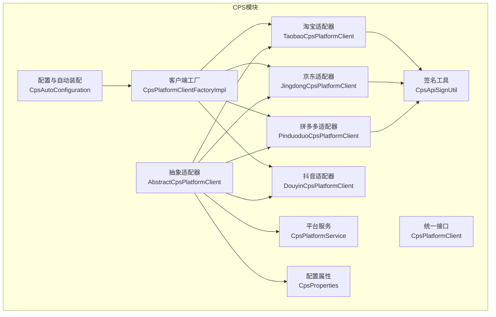
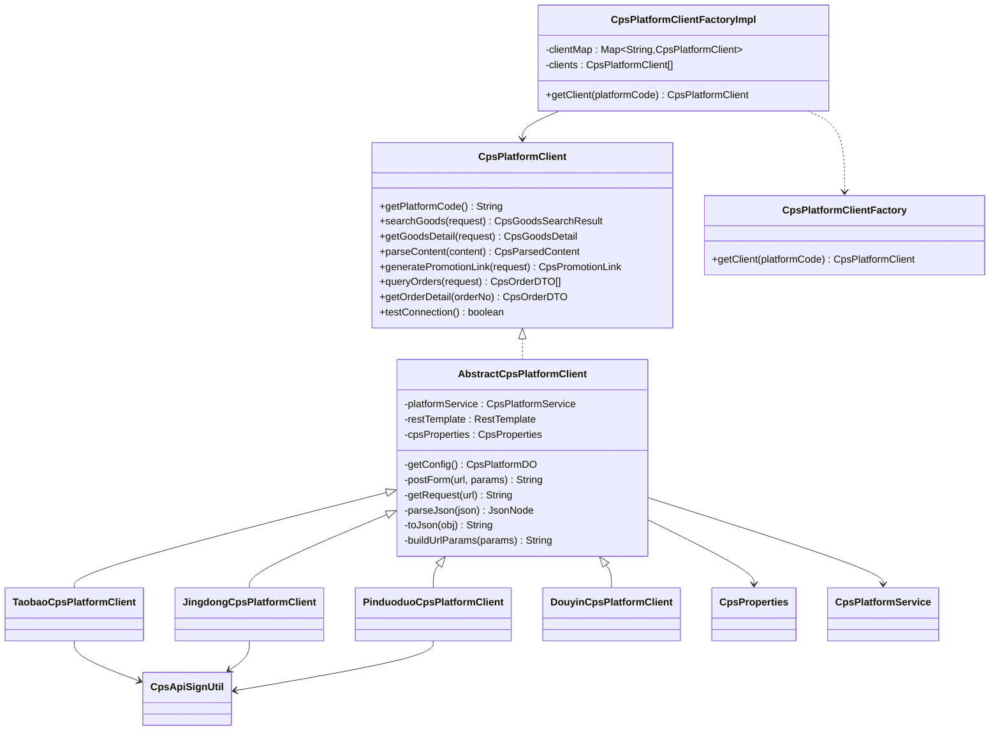
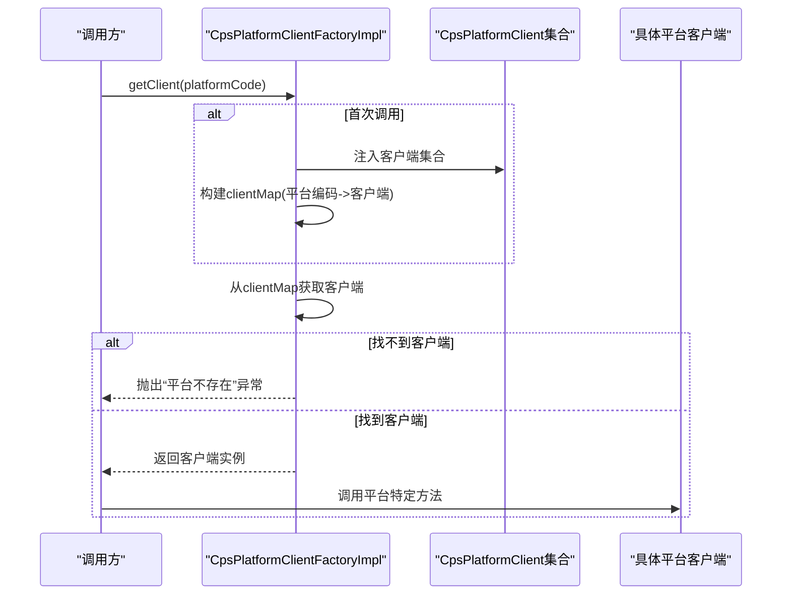
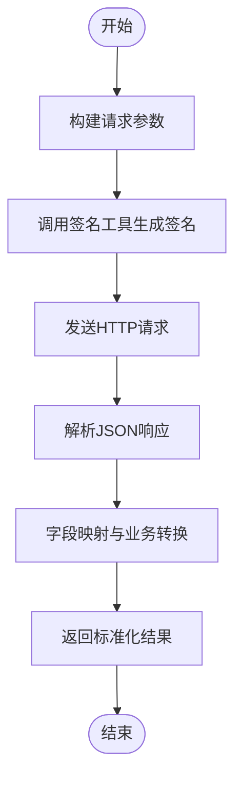
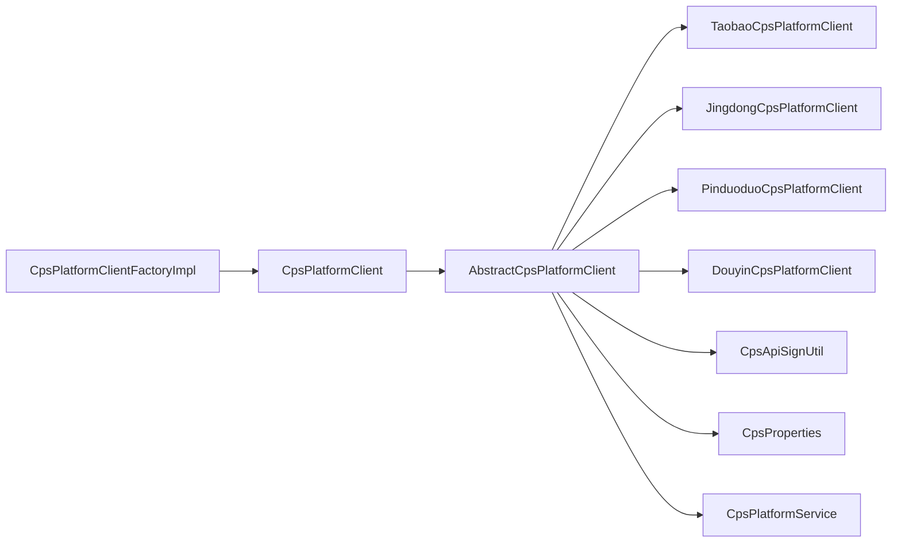

# CPS平台接入与适配

<cite>
**本文档引用的文件**
- [AbstractCpsPlatformClient.java](file://yudao-module-cps/yudao-module-cps-biz/src/main/java/cn/zhijian/cps/client/AbstractCpsPlatformClient.java)
- [CpsPlatformClient.java](file://yudao-module-cps/yudao-module-cps-biz/src/main/java/cn/zhijian/cps/client/CpsPlatformClient.java)
- [CpsPlatformClientFactory.java](file://yudao-module-cps/yudao-module-cps-biz/src/main/java/cn/zhijian/cps/service/CpsPlatformClientFactory.java)
- [CpsPlatformClientFactoryImpl.java](file://yudao-module-cps/yudao-module-cps-biz/src/main/java/cn/zhijian/cps/service/CpsPlatformClientFactoryImpl.java)
- [CpsAutoConfiguration.java](file://yudao-module-cps/yudao-module-cps-biz/src/main/java/cn/zhijian/cps/config/CpsAutoConfiguration.java)
- [TaobaoCpsPlatformClient.java](file://yudao-module-cps/yudao-module-cps-biz/src/main/java/cn/zhijian/cps/client/TaobaoCpsPlatformClient.java)
- [JingdongCpsPlatformClient.java](file://yudao-module-cps/yudao-module-cps-biz/src/main/java/cn/zhijian/cps/client/JingdongCpsPlatformClient.java)
- [PinduoduoCpsPlatformClient.java](file://yudao-module-cps/yudao-module-cps-biz/src/main/java/cn/zhijian/cps/client/PinduoduoCpsPlatformClient.java)
- [CpsApiSignUtil.java](file://yudao-module-cps/yudao-module-cps-biz/src/main/java/cn/zhijian/cps/client/util/CpsApiSignUtil.java)
- [CpsProperties.java](file://yudao-module-cps/yudao-module-cps-biz/src/main/java/cn/zhijian/cps/config/CpsProperties.java)
- [DouyinCpsPlatformClient.java](file://yudao-module-cps/yudao-module-cps-biz/src/main/java/cn/zhijian/cps/client/DouyinCpsPlatformClient.java)
- [CpsPlatformDO.java](file://yudao-module-cps/yudao-module-cps-biz/src/main/java/cn/zhijian/cps/dal/dataobject/CpsPlatformDO.java)
- [CpsPlatformService.java](file://yudao-module-cps/yudao-module-cps-biz/src/main/java/cn/zhijian/cps/service/CpsPlatformService.java)
- [CpsPlatformServiceImpl.java](file://yudao-module-cps/yudao-module-cps-biz/src/main/java/cn/zhijian/cps/service/CpsPlatformServiceImpl.java)
</cite>

## 目录
1. [简介](#简介)
2. [项目结构](#项目结构)
3. [核心组件](#核心组件)
4. [架构总览](#架构总览)
5. [详细组件分析](#详细组件分析)
6. [依赖关系分析](#依赖关系分析)
7. [性能考虑](#性能考虑)
8. [故障排查指南](#故障排查指南)
9. [结论](#结论)
10. [附录](#附录)

## 简介
本技术文档围绕多平台CPS（联盟营销）接入与适配能力进行系统化梳理，重点阐述以下方面：
- 工厂模式的CPS平台客户端工厂设计与实现
- 适配器模式在淘宝、京东、拼多多、抖音等主流平台的落地
- 抽象接口设计、具体平台实现类的开发规范
- API签名验证机制、请求参数封装与响应数据解析
- 平台配置管理、API密钥管理、请求限流控制
- 新平台接入流程、调试方法与性能优化策略

## 项目结构
CPS模块位于 yudao-module-cps/yudao-module-cps-biz 下，采用“接口 + 抽象基类 + 多平台适配器 + 工厂 + 自动装配”的分层组织方式：
- client：统一接口与各平台适配器实现
- service：业务服务与客户端工厂
- config：自动装配与线程池配置
- util：签名工具
- dal/enums/controller/convert/job/mcp/service：配套的数据模型、枚举、控制器、转换器、定时任务、提示词与业务服务

图表来源
- [CpsAutoConfiguration.java:1-55](file://yudao-module-cps/yudao-module-cps-biz/src/main/java/cn/zhijian/cps/config/CpsAutoConfiguration.java#L1-L55)
- [CpsPlatformClientFactoryImpl.java:1-43](file://yudao-module-cps/yudao-module-cps-biz/src/main/java/cn/zhijian/cps/service/CpsPlatformClientFactoryImpl.java#L1-L43)
- [AbstractCpsPlatformClient.java:1-144](file://yudao-module-cps/yudao-module-cps-biz/src/main/java/cn/zhijian/cps/client/AbstractCpsPlatformClient.java#L1-L144)
- [CpsPlatformClient.java:1-67](file://yudao-module-cps/yudao-module-cps-biz/src/main/java/cn/zhijian/cps/client/CpsPlatformClient.java#L1-L67)
- [TaobaoCpsPlatformClient.java:1-468](file://yudao-module-cps/yudao-module-cps-biz/src/main/java/cn/zhijian/cps/client/TaobaoCpsPlatformClient.java#L1-L468)
- [JingdongCpsPlatformClient.java:1-503](file://yudao-module-cps/yudao-module-cps-biz/src/main/java/cn/zhijian/cps/client/JingdongCpsPlatformClient.java#L1-L503)
- [PinduoduoCpsPlatformClient.java:1-469](file://yudao-module-cps/yudao-module-cps-biz/src/main/java/cn/zhijian/cps/client/PinduoduoCpsPlatformClient.java#L1-L469)
- [CpsApiSignUtil.java](file://yudao-module-cps/yudao-module-cps-biz/src/main/java/cn/zhijian/cps/client/util/CpsApiSignUtil.java)
- [CpsProperties.java](file://yudao-module-cps/yudao-module-cps-biz/src/main/java/cn/zhijian/cps/config/CpsProperties.java)
- [CpsPlatformService.java](file://yudao-module-cps/yudao-module-cps-biz/src/main/java/cn/zhijian/cps/service/CpsPlatformService.java)

章节来源
- [CpsAutoConfiguration.java:1-55](file://yudao-module-cps/yudao-module-cps-biz/src/main/java/cn/zhijian/cps/config/CpsAutoConfiguration.java#L1-L55)
- [CpsPlatformClientFactoryImpl.java:1-43](file://yudao-module-cps/yudao-module-cps-biz/src/main/java/cn/zhijian/cps/service/CpsPlatformClientFactoryImpl.java#L1-L43)

## 核心组件
- 统一接口 CpsPlatformClient：定义平台统一能力，包括关键词搜索、详情查询、内容解析、推广链接生成、订单增量查询与连通性测试。
- 抽象适配器 AbstractCpsPlatformClient：封装HTTP调用、JSON解析、URL参数构建、RestTemplate使用、平台配置获取等通用逻辑。
- 平台适配器：淘宝、京东、拼多多、抖音等具体实现，各自对接平台API协议与签名规则。
- 客户端工厂 CpsPlatformClientFactory/Impl：基于Spring注入的客户端集合，按平台编码懒加载缓存并提供获取。
- 自动装配 CpsAutoConfiguration：提供专用RestTemplate与搜索线程池，统一超时与并发策略。

章节来源
- [CpsPlatformClient.java:1-67](file://yudao-module-cps/yudao-module-cps-biz/src/main/java/cn/zhijian/cps/client/CpsPlatformClient.java#L1-L67)
- [AbstractCpsPlatformClient.java:1-144](file://yudao-module-cps/yudao-module-cps-biz/src/main/java/cn/zhijian/cps/client/AbstractCpsPlatformClient.java#L1-L144)
- [CpsPlatformClientFactory.java:1-19](file://yudao-module-cps/yudao-module-cps-biz/src/main/java/cn/zhijian/cps/service/CpsPlatformClientFactory.java#L1-L19)
- [CpsPlatformClientFactoryImpl.java:1-43](file://yudao-module-cps/yudao-module-cps-biz/src/main/java/cn/zhijian/cps/service/CpsPlatformClientFactoryImpl.java#L1-L43)
- [CpsAutoConfiguration.java:1-55](file://yudao-module-cps/yudao-module-cps-biz/src/main/java/cn/zhijian/cps/config/CpsAutoConfiguration.java#L1-L55)

## 架构总览
下图展示CPS平台接入的整体架构：客户端工厂根据平台编码选择对应适配器；适配器通过抽象基类统一发起HTTP请求；签名工具负责不同平台的签名算法；配置属性提供平台密钥与默认参数；平台服务负责读取数据库中的平台配置。

图表来源
- [CpsPlatformClient.java:1-67](file://yudao-module-cps/yudao-module-cps-biz/src/main/java/cn/zhijian/cps/client/CpsPlatformClient.java#L1-L67)
- [AbstractCpsPlatformClient.java:1-144](file://yudao-module-cps/yudao-module-cps-biz/src/main/java/cn/zhijian/cps/client/AbstractCpsPlatformClient.java#L1-L144)
- [CpsPlatformClientFactory.java:1-19](file://yudao-module-cps/yudao-module-cps-biz/src/main/java/cn/zhijian/cps/service/CpsPlatformClientFactory.java#L1-L19)
- [CpsPlatformClientFactoryImpl.java:1-43](file://yudao-module-cps/yudao-module-cps-biz/src/main/java/cn/zhijian/cps/service/CpsPlatformClientFactoryImpl.java#L1-L43)
- [TaobaoCpsPlatformClient.java:1-468](file://yudao-module-cps/yudao-module-cps-biz/src/main/java/cn/zhijian/cps/client/TaobaoCpsPlatformClient.java#L1-L468)
- [JingdongCpsPlatformClient.java:1-503](file://yudao-module-cps/yudao-module-cps-biz/src/main/java/cn/zhijian/cps/client/JingdongCpsPlatformClient.java#L1-L503)
- [PinduoduoCpsPlatformClient.java:1-469](file://yudao-module-cps/yudao-module-cps-biz/src/main/java/cn/zhijian/cps/client/PinduoduoCpsPlatformClient.java#L1-L469)
- [CpsApiSignUtil.java](file://yudao-module-cps/yudao-module-cps-biz/src/main/java/cn/zhijian/cps/client/util/CpsApiSignUtil.java)
- [CpsProperties.java](file://yudao-module-cps/yudao-module-cps-biz/src/main/java/cn/zhijian/cps/config/CpsProperties.java)
- [CpsPlatformService.java](file://yudao-module-cps/yudao-module-cps-biz/src/main/java/cn/zhijian/cps/service/CpsPlatformService.java)

## 详细组件分析

### 工厂模式：CpsPlatformClientFactory
- 设计要点
  - 接口定义按平台编码获取客户端
  - 实现类懒加载：首次使用时扫描所有CpsPlatformClient实现，按平台编码放入ConcurrentHashMap
  - 未匹配时抛出“平台不存在”异常，便于上层明确错误
- 使用场景
  - 控制器或业务层通过工厂获取指定平台客户端，避免硬编码平台类型
- 性能与扩展性
  - ConcurrentHashMap保证并发安全
  - 通过Spring注入客户端集合，天然支持新增平台无需修改工厂代码

图表来源
- [CpsPlatformClientFactoryImpl.java:27-40](file://yudao-module-cps/yudao-module-cps-biz/src/main/java/cn/zhijian/cps/service/CpsPlatformClientFactoryImpl.java#L27-L40)
- [CpsPlatformClientFactory.java:8-18](file://yudao-module-cps/yudao-module-cps-biz/src/main/java/cn/zhijian/cps/service/CpsPlatformClientFactory.java#L8-L18)

章节来源
- [CpsPlatformClientFactory.java:1-19](file://yudao-module-cps/yudao-module-cps-biz/src/main/java/cn/zhijian/cps/service/CpsPlatformClientFactory.java#L1-L19)
- [CpsPlatformClientFactoryImpl.java:1-43](file://yudao-module-cps/yudao-module-cps-biz/src/main/java/cn/zhijian/cps/service/CpsPlatformClientFactoryImpl.java#L1-L43)

### 抽象适配器：AbstractCpsPlatformClient
- 统一封装
  - HTTP调用：postForm（表单）、getRequest（GET）
  - JSON处理：parseJson、toJson
  - URL参数拼接：buildUrlParams
  - 配置获取：getConfig（从平台服务按平台编码读取配置）
  - RestTemplate：通过cpsRestTemplate Bean复用OkHttp3客户端工厂
- 作用
  - 降低重复代码，统一异常日志与状态码判断
  - 为各平台适配器提供一致的基础设施

章节来源
- [AbstractCpsPlatformClient.java:1-144](file://yudao-module-cps/yudao-module-cps-biz/src/main/java/cn/zhijian/cps/client/AbstractCpsPlatformClient.java#L1-L144)

### 平台适配器：淘宝、京东、拼多多、抖音
- 淘宝（TaobaoCpsPlatformClient）
  - 协议：TOP（淘宝联盟）
  - 关键能力：关键词搜索、详情查询、淘口令解析、推广链接生成、订单增量查询、连通性测试
  - 签名：CpsApiSignUtil.signTaobao
  - 特殊处理：淘口令解析、URL中商品ID提取、佣金计算、状态映射
- 京东（JingdongCpsPlatformClient）
  - 协议：JOS（京东联盟）
  - 关键能力：关键词搜索、详情查询、短链解析（u.jd.com）、推广链接生成、订单增量查询、连通性测试
  - 签名：CpsApiSignUtil.signJingdong
  - 特殊处理：短链重定向解析、排序字段映射、佣金计算
- 拼多多（PinduoduoCpsPlatformClient）
  - 协议：Pop（多多进宝）
  - 关键能力：关键词搜索、详情查询、短链解析（p.pinduoduo.com/yangkeduo.com）、推广链接生成、订单增量查询、连通性测试
  - 签名：CpsApiSignUtil.signPinduoduo
  - 特殊处理：价格单位分->元、佣金率千分比、状态映射
- 抖音（DouyinCpsPlatformClient）
  - 协议：平台自定义（当前文件存在，具体实现以实际为准）
  - 关键能力：与统一接口对齐，按平台要求实现搜索、详情、解析、推广、订单与连通性测试

图表来源
- [TaobaoCpsPlatformClient.java:32-95](file://yudao-module-cps/yudao-module-cps-biz/src/main/java/cn/zhijian/cps/client/TaobaoCpsPlatformClient.java#L32-L95)
- [JingdongCpsPlatformClient.java:32-100](file://yudao-module-cps/yudao-module-cps-biz/src/main/java/cn/zhijian/cps/client/JingdongCpsPlatformClient.java#L32-L100)
- [PinduoduoCpsPlatformClient.java:30-93](file://yudao-module-cps/yudao-module-cps-biz/src/main/java/cn/zhijian/cps/client/PinduoduoCpsPlatformClient.java#L30-L93)

章节来源
- [TaobaoCpsPlatformClient.java:1-468](file://yudao-module-cps/yudao-module-cps-biz/src/main/java/cn/zhijian/cps/client/TaobaoCpsPlatformClient.java#L1-L468)
- [JingdongCpsPlatformClient.java:1-503](file://yudao-module-cps/yudao-module-cps-biz/src/main/java/cn/zhijian/cps/client/JingdongCpsPlatformClient.java#L1-L503)
- [PinduoduoCpsPlatformClient.java:1-469](file://yudao-module-cps/yudao-module-cps-biz/src/main/java/cn/zhijian/cps/client/PinduoduoCpsPlatformClient.java#L1-L469)
- [DouyinCpsPlatformClient.java](file://yudao-module-cps/yudao-module-cps-biz/src/main/java/cn/zhijian/cps/client/DouyinCpsPlatformClient.java)

### API签名验证机制
- 淘宝：signTaobao（基于TOP协议的MD5签名）
- 京东：signJingdong（基于JOS协议的MD5签名）
- 拼多多：signPinduoduo（基于Pop协议的MD5签名）
- 签名参数通常包含：method/app_key/timestamp/format/v/sign_method/param_json（京东）或type/client_id/timestamp/data_type（拼多多），以及业务参数与平台密钥

章节来源
- [CpsApiSignUtil.java](file://yudao-module-cps/yudao-module-cps-biz/src/main/java/cn/zhijian/cps/client/util/CpsApiSignUtil.java)

### 请求参数封装与响应数据解析
- 参数封装
  - 通用参数：method/app_key/timestamp/format/v/sign_method/type/client_id/timestamp/data_type
  - 业务参数：关键词、页码、页大小、价格区间、排序、广告位ID、PID等
  - 表单提交：postForm统一处理Content-Type为application/x-www-form-urlencoded
- 响应解析
  - parseJson统一异常捕获
  - 各平台节点路径差异：如淘宝的tbk_dg_material_optional_response、京东的jd_union_open_goods_query_response、拼多多的goods_search_response
  - 字段映射：价格、佣金、销量、状态、时间等统一到CpsGoodsDetail/CpsOrderDTO/CpsParsedContent

章节来源
- [AbstractCpsPlatformClient.java:54-141](file://yudao-module-cps/yudao-module-cps-biz/src/main/java/cn/zhijian/cps/client/AbstractCpsPlatformClient.java#L54-L141)
- [TaobaoCpsPlatformClient.java:70-95](file://yudao-module-cps/yudao-module-cps-biz/src/main/java/cn/zhijian/cps/client/TaobaoCpsPlatformClient.java#L70-L95)
- [JingdongCpsPlatformClient.java:70-100](file://yudao-module-cps/yudao-module-cps-biz/src/main/java/cn/zhijian/cps/client/JingdongCpsPlatformClient.java#L70-L100)
- [PinduoduoCpsPlatformClient.java:68-93](file://yudao-module-cps/yudao-module-cps-biz/src/main/java/cn/zhijian/cps/client/PinduoduoCpsPlatformClient.java#L68-L93)

### 平台配置管理与API密钥管理
- 配置属性 CpsProperties：包含各平台的AppKey/AppSecret/ClientId/ClientSecret、默认广告位ID/PID、API地址等
- 平台服务 CpsPlatformService：按平台编码从数据库读取CpsPlatformDO配置，供适配器使用
- 配置读取：getConfig在抽象适配器中统一调用，确保各平台共享同一配置来源

章节来源
- [CpsProperties.java](file://yudao-module-cps/yudao-module-cps-biz/src/main/java/cn/zhijian/cps/config/CpsProperties.java)
- [CpsPlatformDO.java](file://yudao-module-cps/yudao-module-cps-biz/src/main/java/cn/zhijian/cps/dal/dataobject/CpsPlatformDO.java)
- [CpsPlatformService.java](file://yudao-module-cps/yudao-module-cps-biz/src/main/java/cn/zhijian/cps/service/CpsPlatformService.java)
- [CpsPlatformServiceImpl.java](file://yudao-module-cps/yudao-module-cps-biz/src/main/java/cn/zhijian/cps/service/CpsPlatformServiceImpl.java)
- [AbstractCpsPlatformClient.java:43-45](file://yudao-module-cps/yudao-module-cps-biz/src/main/java/cn/zhijian/cps/client/AbstractCpsPlatformClient.java#L43-L45)

### 请求限流控制
- RestTemplate超时：连接10秒、读写30秒，减少慢请求阻塞
- 搜索线程池：核心4/最大8/队列100/存活60秒，前缀cps-search-，支持异步并行搜索
- 建议
  - 平台侧限流：遵循各平台QPS限制，必要时增加退避与重试
  - 业务侧限流：对高频接口增加令牌桶或漏桶策略
  - 监控告警：对429/5xx与超时进行告警

章节来源
- [CpsAutoConfiguration.java:24-52](file://yudao-module-cps/yudao-module-cps-biz/src/main/java/cn/zhijian/cps/config/CpsAutoConfiguration.java#L24-L52)

## 依赖关系分析
- 组件耦合
  - 适配器依赖抽象基类（低耦合高内聚）
  - 工厂依赖Spring注入的客户端集合，无硬编码平台类型
  - 抽象基类依赖平台服务与配置属性，形成清晰的依赖链
- 外部依赖
  - OkHttp3客户端工厂用于RestTemplate
  - Jackson用于JSON解析
  - Spring注解驱动（@Component/@Service/@Resource）

图表来源
- [CpsPlatformClientFactoryImpl.java:24-40](file://yudao-module-cps/yudao-module-cps-biz/src/main/java/cn/zhijian/cps/service/CpsPlatformClientFactoryImpl.java#L24-L40)
- [AbstractCpsPlatformClient.java:26-38](file://yudao-module-cps/yudao-module-cps-biz/src/main/java/cn/zhijian/cps/client/AbstractCpsPlatformClient.java#L26-L38)
- [CpsPlatformClient.java:11-66](file://yudao-module-cps/yudao-module-cps-biz/src/main/java/cn/zhijian/cps/client/CpsPlatformClient.java#L11-L66)

章节来源
- [CpsPlatformClientFactoryImpl.java:1-43](file://yudao-module-cps/yudao-module-cps-biz/src/main/java/cn/zhijian/cps/service/CpsPlatformClientFactoryImpl.java#L1-L43)
- [AbstractCpsPlatformClient.java:1-144](file://yudao-module-cps/yudao-module-cps-biz/src/main/java/cn/zhijian/cps/client/AbstractCpsPlatformClient.java#L1-L144)

## 性能考虑
- 线程池并行搜索：利用cpsSearchExecutor提升多平台聚合查询吞吐
- 连接池与超时：OkHttp3客户端工厂与RestTemplate超时设置，避免长时间阻塞
- JSON解析与序列化：统一Jackson ObjectMapper，减少重复创建
- 价格与佣金计算：BigDecimal运算保持精度，避免浮点误差
- 日志与监控：统一异常日志记录，建议结合链路追踪与指标监控

## 故障排查指南
- 连通性测试
  - 各平台实现均提供testConnection，优先调用基础可用接口（如淘宝time_get、京东goods.query、拼多多goods.search）
- 常见问题定位
  - 签名错误：核对参数顺序、编码与平台密钥
  - 参数缺失：检查method/app_key/timestamp/sign_method等通用参数
  - 响应解析失败：确认平台响应节点路径与JSON结构
  - 平台不存在：检查客户端工厂是否正确注册该平台客户端
- 日志与告警
  - 关注postForm/getRequest的异常日志与状态码
  - 对429/5xx与超时进行告警与熔断

章节来源
- [TaobaoCpsPlatformClient.java:278-301](file://yudao-module-cps/yudao-module-cps-biz/src/main/java/cn/zhijian/cps/client/TaobaoCpsPlatformClient.java#L278-L301)
- [JingdongCpsPlatformClient.java:273-290](file://yudao-module-cps/yudao-module-cps-biz/src/main/java/cn/zhijian/cps/client/JingdongCpsPlatformClient.java#L273-L290)
- [PinduoduoCpsPlatformClient.java:258-279](file://yudao-module-cps/yudao-module-cps-biz/src/main/java/cn/zhijian/cps/client/PinduoduoCpsPlatformClient.java#L258-L279)
- [AbstractCpsPlatformClient.java:54-96](file://yudao-module-cps/yudao-module-cps-biz/src/main/java/cn/zhijian/cps/client/AbstractCpsPlatformClient.java#L54-L96)

## 结论
本CPS平台接入方案通过“统一接口 + 抽象适配器 + 工厂 + 自动装配”的架构，实现了对淘宝、京东、拼多多、抖音等多平台的快速适配与扩展。工厂模式确保了平台扩展的零侵入式，适配器模式屏蔽了各平台API差异，签名工具与配置管理保障了安全性与可维护性。配合线程池与超时策略，整体具备良好的性能与稳定性。后续接入新平台仅需实现统一接口并完成参数封装与解析映射即可。

## 附录

### 新平台接入步骤（最佳实践）
- 创建平台适配器类
  - 实现CpsPlatformClient接口
  - 继承AbstractCpsPlatformClient，复用HTTP与JSON处理
  - 在构造函数中声明平台编码getPlatformCode
- 实现关键方法
  - searchGoods：构建参数、签名、请求、解析、映射
  - getGoodsDetail：同上
  - parseContent：URL/口令解析，提取itemId
  - generatePromotionLink：生成推广链接与口令
  - queryOrders/getOrderDetail：增量查询与详情过滤
  - testConnection：基础连通性测试
- 签名与配置
  - 使用CpsApiSignUtil对应签名方法
  - 在CpsProperties中添加平台配置项
  - 在数据库中维护CpsPlatformDO配置
- 注册与测试
  - 通过Spring自动装配注册客户端
  - 使用工厂getClient(platformCode)进行单元测试
  - 调用testConnection验证连通性

章节来源
- [CpsPlatformClient.java:11-66](file://yudao-module-cps/yudao-module-cps-biz/src/main/java/cn/zhijian/cps/client/CpsPlatformClient.java#L11-L66)
- [AbstractCpsPlatformClient.java:26-141](file://yudao-module-cps/yudao-module-cps-biz/src/main/java/cn/zhijian/cps/client/AbstractCpsPlatformClient.java#L26-L141)
- [CpsPlatformClientFactoryImpl.java:27-40](file://yudao-module-cps/yudao-module-cps-biz/src/main/java/cn/zhijian/cps/service/CpsPlatformClientFactoryImpl.java#L27-L40)
- [CpsApiSignUtil.java](file://yudao-module-cps/yudao-module-cps-biz/src/main/java/cn/zhijian/cps/client/util/CpsApiSignUtil.java)
- [CpsProperties.java](file://yudao-module-cps/yudao-module-cps-biz/src/main/java/cn/zhijian/cps/config/CpsProperties.java)
- [CpsPlatformDO.java](file://yudao-module-cps/yudao-module-cps-biz/src/main/java/cn/zhijian/cps/dal/dataobject/CpsPlatformDO.java)