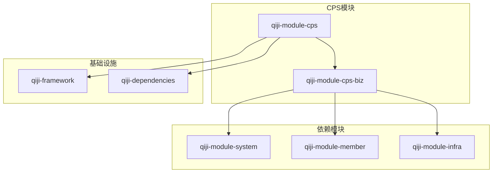
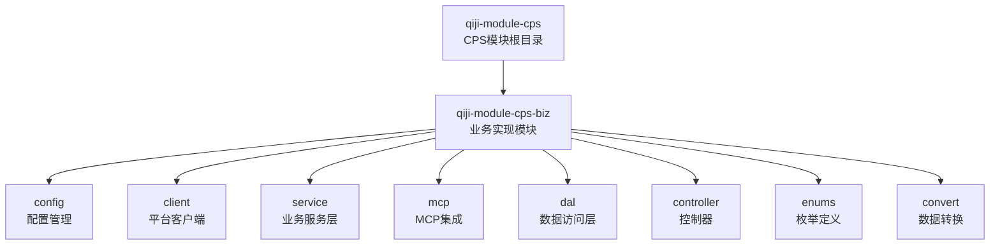
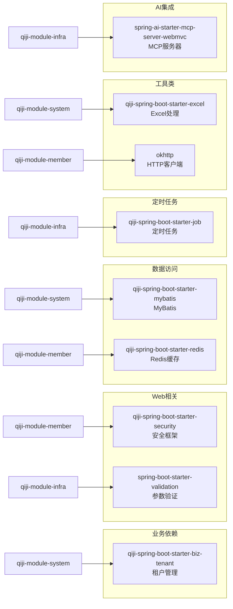
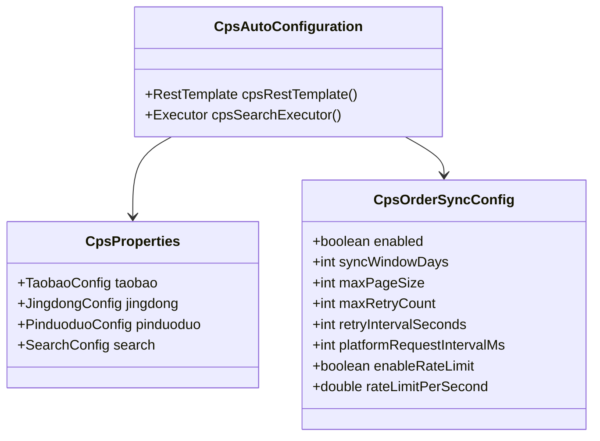
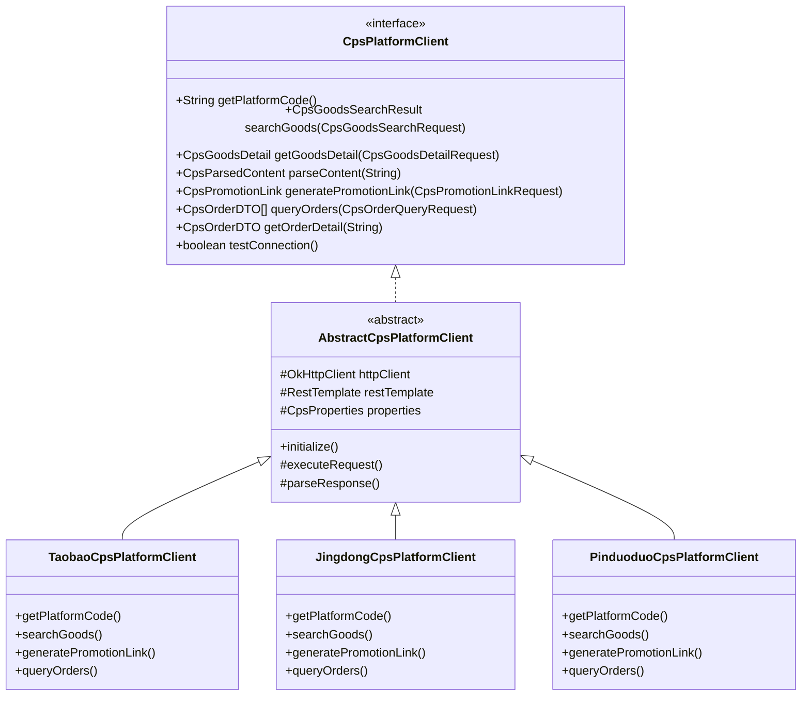
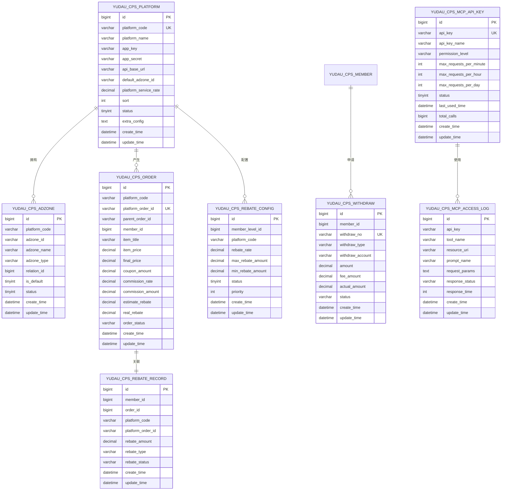
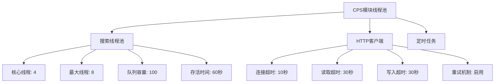
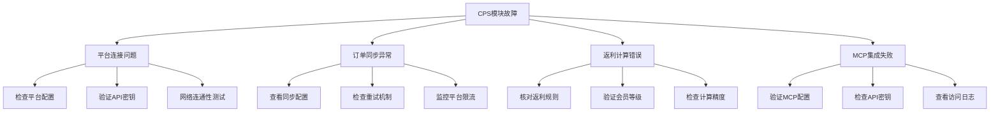

# CPS模块库依赖说明

<cite>
**本文档引用的文件**
- [pom.xml](file://pom.xml)
- [qiji-module-cps/pom.xml](file://qiji-module-cps/pom.xml)
- [qiji-module-cps-biz/pom.xml](file://qiji-module-cps/qiji-module-cps-biz/pom.xml)
- [CpsAutoConfiguration.java](file://qiji-module-cps/qiji-module-cps-biz/src/main/java/cn/zhijian/cps/config/CpsAutoConfiguration.java)
- [CpsProperties.java](file://qiji-module-cps/qiji-module-cps-biz/src/main/java/cn/zhijian/cps/config/CpsProperties.java)
- [CpsOrderSyncConfig.java](file://qiji-module-cps/qiji-module-cps-biz/src/main/java/cn/zhijian/cps/config/CpsOrderSyncConfig.java)
- [CpsPlatformClient.java](file://qiji-module-cps/qiji-module-cps-biz/src/main/java/cn/zhijian/cps/client/CpsPlatformClient.java)
- [CpsMcpService.java](file://qiji-module-cps/qiji-module-cps-biz/src/main/java/cn/zhijian/cps/mcp/CpsMcpService.java)
- [cps-schema.sql](file://sql/module/cps-schema.sql)
</cite>

## 目录
1. [项目概述](#项目概述)
2. [模块架构](#模块架构)
3. [核心依赖分析](#核心依赖分析)
4. [配置管理](#配置管理)
5. [平台集成](#平台集成)
6. [MCP服务集成](#mcp服务集成)
7. [数据库设计](#数据库设计)
8. [性能优化建议](#性能优化建议)
9. [故障排查指南](#故障排查指南)
10. [总结](#总结)

## 项目概述

CPS模块是基于RuoYi-Vue-Pro企业级开发框架构建的CPS联盟返利系统。该模块提供了多平台CPS联盟接入、商品搜索比价、返利管理、提现等功能，支持淘宝、京东、拼多多等多个主流电商平台的统一管理。

该项目采用Spring Boot 3.5.9 + Maven的现代化技术栈，通过模块化设计实现了高度的可扩展性和可维护性。

## 模块架构

### 整体架构图



**图表来源**
- [pom.xml:10-25](file://pom.xml#L10-L25)
- [qiji-module-cps/pom.xml:20-22](file://qiji-module-cps/pom.xml#L20-L22)

### 模块层次结构



**图表来源**
- [qiji-module-cps/pom.xml:1](file://qiji-module-cps/pom.xml#L1-L25)

**章节来源**
- [pom.xml:10-25](file://pom.xml#L10-L25)
- [qiji-module-cps/pom.xml:20-22](file://qiji-module-cps/pom.xml#L20-L22)

## 核心依赖分析

### Maven依赖结构

CPS模块的依赖管理遵循企业级最佳实践，主要依赖包括：



**图表来源**
- [qiji-module-cps-biz/pom.xml:21-84](file://qiji-module-cps/qiji-module-cps-biz/pom.xml#L21-L84)

### 关键依赖特性

1. **租户管理集成**：通过`qiji-spring-boot-starter-biz-tenant`实现多租户支持
2. **安全框架**：集成Spring Security进行权限控制
3. **数据持久化**：MyBatis + Redis提供高性能的数据访问
4. **定时任务**：支持订单同步、返利结算等异步任务
5. **HTTP通信**：OkHttp提供高效的HTTP客户端
6. **AI集成**：Spring AI MCP Server支持智能代理集成

**章节来源**
- [qiji-module-cps-biz/pom.xml:20-139](file://qiji-module-cps/qiji-module-cps-biz/pom.xml#L20-L139)

## 配置管理

### 自动配置类

CPS模块通过`CpsAutoConfiguration`提供自动配置功能：



**图表来源**
- [CpsAutoConfiguration.java:17-54](file://qiji-module-cps/qiji-module-cps-biz/src/main/java/cn/zhijian/cps/config/CpsAutoConfiguration.java#L17-L54)
- [CpsProperties.java:11-114](file://qiji-module-cps/qiji-module-cps-biz/src/main/java/cn/zhijian/cps/config/CpsProperties.java#L11-L114)
- [CpsOrderSyncConfig.java:11-59](file://qiji-module-cps/qiji-module-cps-biz/src/main/java/cn/zhijian/cps/config/CpsOrderSyncConfig.java#L11-L59)

### 配置属性详解

#### 平台配置属性

| 配置项 | 类型 | 默认值 | 描述 |
|--------|------|--------|------|
| qiji.cps.taobao.appKey | String | - | 淘宝联盟AppKey |
| qiji.cps.taobao.appSecret | String | - | 淘宝联盟AppSecret |
| qiji.cps.jingdong.appKey | String | - | 京东联盟AppKey |
| qiji.cps.jingdong.appSecret | String | - | 京东联盟AppSecret |
| qiji.cps.pinduoduo.clientId | String | - | 拼多多联盟ClientId |
| qiji.cps.pinduoduo.clientSecret | String | - | 拼多多联盟ClientSecret |

#### 搜索配置属性

| 配置项 | 类型 | 默认值 | 描述 |
|--------|------|--------|------|
| qiji.cps.search.parallelTimeout | Integer | 5秒 | 并行搜索超时时间 |
| qiji.cps.search.defaultPageSize | Integer | 20条 | 默认每页条数 |

#### 订单同步配置属性

| 配置项 | 类型 | 默认值 | 描述 |
|--------|------|--------|------|
| qiji.cps.order-sync.enabled | Boolean | true | 是否启用订单同步 |
| qiji.cps.order-sync.syncWindowDays | Integer | 7天 | 同步时间窗口 |
| qiji.cps.order-sync.maxPageSize | Integer | 100 | 单次同步最大订单数 |
| qiji.cps.order-sync.rateLimitPerSecond | Double | 10.0 | 平台限流每秒请求数 |

**章节来源**
- [CpsProperties.java:11-114](file://qiji-module-cps/qiji-module-cps-biz/src/main/java/cn/zhijian/cps/config/CpsProperties.java#L11-L114)
- [CpsOrderSyncConfig.java:11-59](file://qiji-module-cps/qiji-module-cps-biz/src/main/java/cn/zhijian/cps/config/CpsOrderSyncConfig.java#L11-L59)

## 平台集成

### 平台客户端接口

CPS模块实现了统一的平台客户端接口，支持多平台接入：



**图表来源**
- [CpsPlatformClient.java:11-66](file://qiji-module-cps/qiji-module-cps-biz/src/main/java/cn/zhijian/cps/client/CpsPlatformClient.java#L11-L66)

### 平台特性对比

| 功能特性 | 淘宝联盟 | 京东联盟 | 拼多多联盟 |
|----------|----------|----------|------------|
| 商品搜索 | ✅ 支持 | ✅ 支持 | ✅ 支持 |
| 推广链接生成 | ✅ 支持 | ✅ 支持 | ✅ 支持 |
| 订单同步 | ✅ 支持 | ✅ 支持 | ✅ 支持 |
| 返利结算 | ✅ 支持 | ✅ 支持 | ✅ 支持 |
| 价格比价 | ✅ 支持 | ✅ 支持 | ✅ 支持 |
| 限流控制 | ✅ 支持 | ✅ 支持 | ✅ 支持 |

**章节来源**
- [CpsPlatformClient.java:11-66](file://qiji-module-cps/qiji-module-cps-biz/src/main/java/cn/zhijian/cps/client/CpsPlatformClient.java#L11-L66)

## MCP服务集成

### AI工具服务架构

CPS模块通过`CpsMcpService`将业务能力暴露给AI代理：

```mermaid
sequenceDiagram
participant Agent as AI代理
participant Service as CpsMcpService
participant Goods as CpsGoodsSearchService
participant Link as CpsPromotionLinkService
participant Order as CpsOrderService
participant Account as CpsRebateAccountService
Agent->>Service : 调用商品搜索工具
Service->>Goods : searchAll(keyword)
Goods-->>Service : 商品列表
Service-->>Agent : JSON格式结果
Agent->>Service : 调用生成链接工具
Service->>Link : generateByItemId(platform, item, member)
Link-->>Service : 推广链接
Service-->>Agent : 链接信息
Agent->>Service : 查询订单状态
Service->>Order : getOrderPage(memberId)
Order-->>Service : 订单列表
Service-->>Agent : 订单状态
```

**图表来源**
- [CpsMcpService.java:50-104](file://qiji-module-cps/qiji-module-cps-biz/src/main/java/cn/zhijian/cps/mcp/CpsMcpService.java#L50-L104)
- [CpsMcpService.java:163-193](file://qiji-module-cps/qiji-module-cps-biz/src/main/java/cn/zhijian/cps/mcp/CpsMcpService.java#L163-L193)
- [CpsMcpService.java:195-238](file://qiji-module-cps/qiji-module-cps-biz/src/main/java/cn/zhijian/cps/mcp/CpsMcpService.java#L195-L238)

### MCP工具功能

| 工具名称 | 功能描述 | 使用场景 |
|----------|----------|----------|
| cps_search_goods | 多平台商品搜索 | 用户询问"哪里有XX商品" |
| cps_compare_prices | 跨平台价格比较 | 用户询问"哪个平台更便宜" |
| cps_generate_link | 生成推广链接 | 用户需要分享商品链接 |
| cps_get_order_status | 查询订单状态 | 用户询问"我的订单怎么样了" |
| cps_rebate_summary | 返利账户汇总 | 用户询问"我赚了多少钱" |

**章节来源**
- [CpsMcpService.java:50-277](file://qiji-module-cps/qiji-module-cps-biz/src/main/java/cn/zhijian/cps/mcp/CpsMcpService.java#L50-L277)

## 数据库设计

### 数据库表结构

CPS模块采用分阶段设计思路，包含基础表结构和扩展表：



**图表来源**
- [cps-schema.sql:14-270](file://sql/module/cps-schema.sql#L14-L270)

### 表设计特点

1. **平台配置表**：集中管理各平台的认证信息和配置参数
2. **推广位管理**：支持多层级推广位管理和用户归因
3. **订单跟踪**：完整记录订单生命周期和返利状态
4. **返利管理**：支持多种返利类型和状态管理
5. **提现管理**：提供完整的提现流程和状态跟踪
6. **统计分析**：按日维度统计各平台的运营数据
7. **MCP集成**：支持AI代理的API密钥管理和访问日志

**章节来源**
- [cps-schema.sql:1-271](file://sql/module/cps-schema.sql#L1-L271)

## 性能优化建议

### 线程池配置

CPS模块为不同场景配置了专门的线程池：



**图表来源**
- [CpsAutoConfiguration.java:40-52](file://qiji-module-cps/qiji-module-cps-biz/src/main/java/cn/zhijian/cps/config/CpsAutoConfiguration.java#L40-L52)

### 优化策略

1. **并发控制**：通过线程池限制并发量，避免平台限流
2. **缓存策略**：利用Redis缓存热门商品信息和平台配置
3. **批量处理**：订单同步采用批量处理减少API调用次数
4. **异步处理**：返利结算和统计分析采用异步任务处理
5. **连接池管理**：合理配置HTTP客户端连接池参数

## 故障排查指南

### 常见问题诊断



### 排查步骤

1. **平台连接检查**：使用`testConnection()`方法验证平台连通性
2. **配置验证**：检查`application.yaml`中的CPS配置项
3. **日志分析**：查看系统日志中的错误信息和堆栈跟踪
4. **数据库检查**：验证相关表的数据完整性和索引状态
5. **网络诊断**：测试与各平台API的网络连通性

**章节来源**
- [CpsPlatformClient.java:62-66](file://qiji-module-cps/qiji-module-cps-biz/src/main/java/cn/zhijian/cps/client/CpsPlatformClient.java#L62-L66)

## 总结

CPS模块库是一个功能完整、架构清晰的企业级CPS联盟返利系统。通过模块化设计和标准化的依赖管理，实现了以下核心价值：

### 技术优势

1. **模块化架构**：清晰的模块划分便于维护和扩展
2. **多平台支持**：统一接口适配多个主流电商平台
3. **AI集成**：通过MCP协议实现智能代理集成
4. **性能优化**：合理的线程池配置和缓存策略
5. **监控完善**：完整的日志记录和访问统计

### 应用价值

1. **业务灵活性**：支持多平台、多模式的CPS运营
2. **技术先进性**：采用Spring AI等前沿技术栈
3. **运维友好性**：完善的配置管理和故障排查机制
4. **扩展性强**：模块化设计便于功能扩展和定制

该模块为构建现代化的CPS返利生态系统提供了坚实的技术基础，适合在企业级环境中部署和使用。