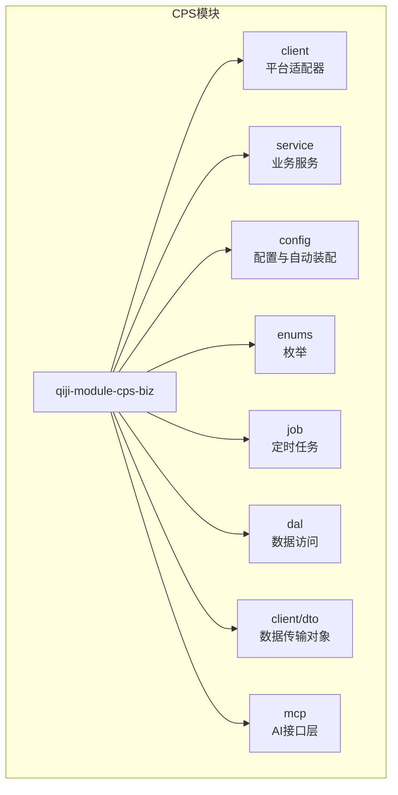
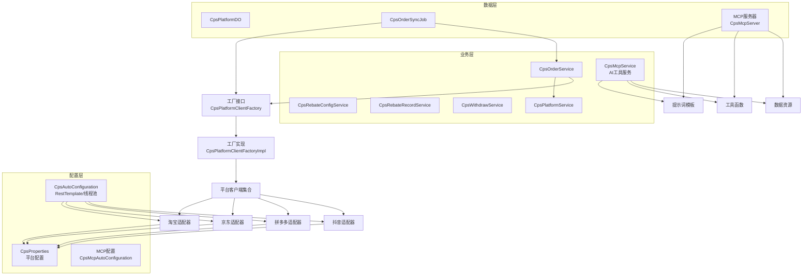
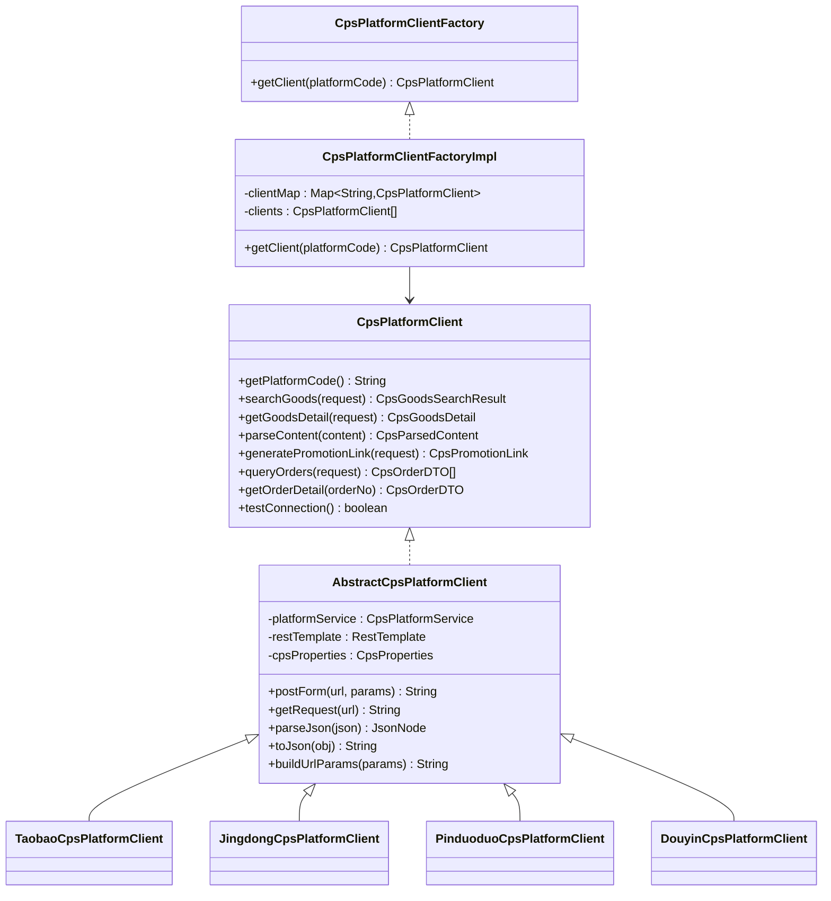
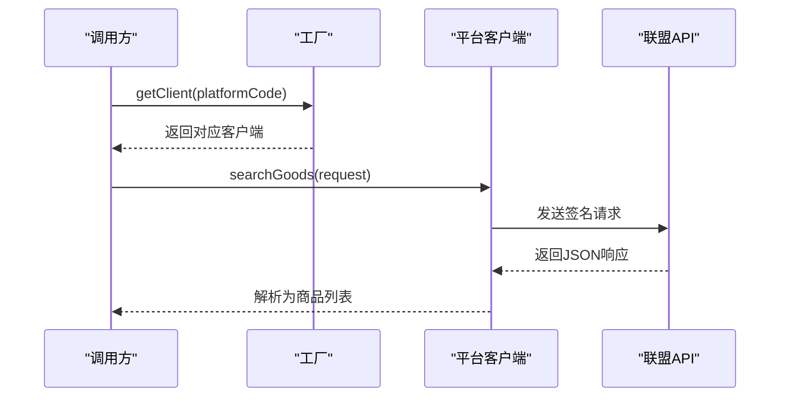
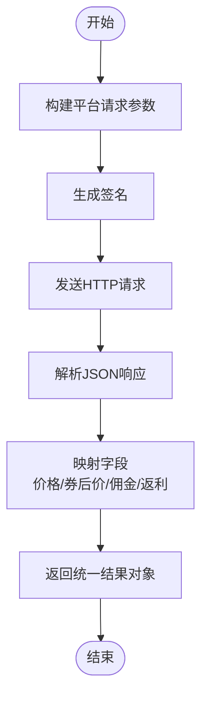
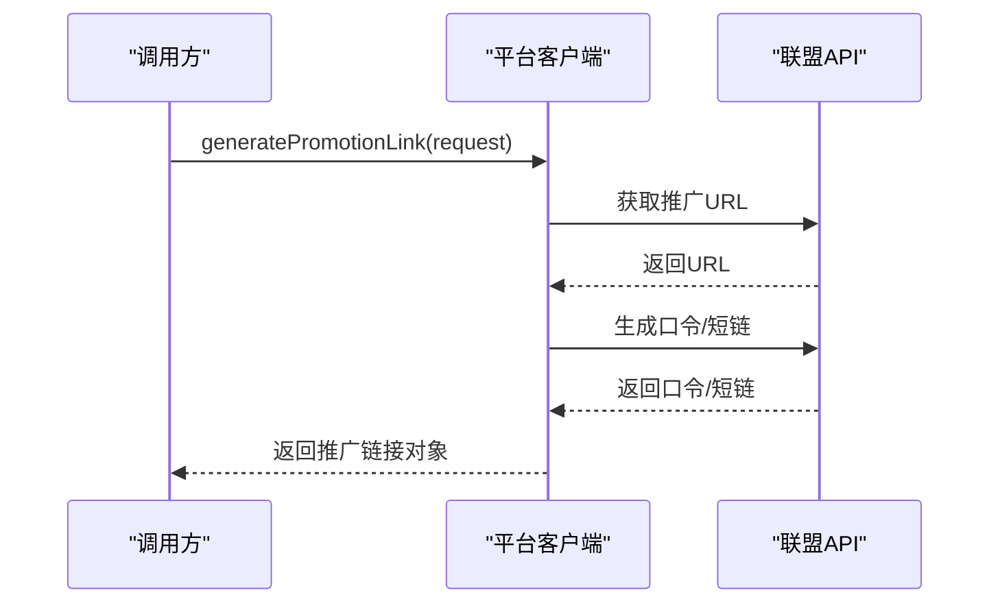
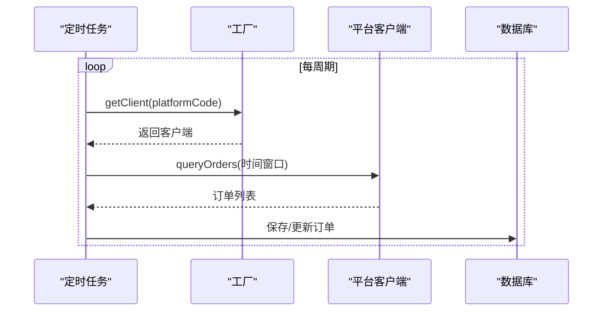
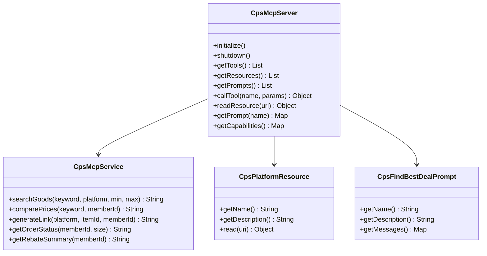
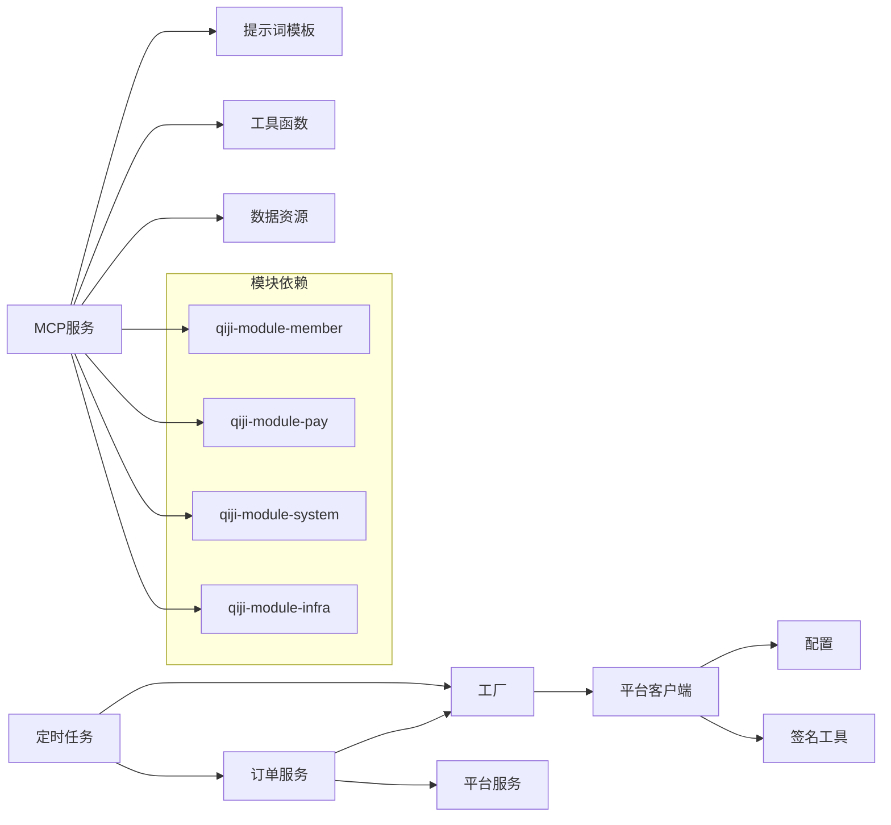

# CPS联盟返利模块

<cite>
**本文引用的文件**
- [qiji-module-cps/pom.xml](file://qiji-module-cps/pom.xml)
- [qiji-module-cps/qiji-module-cps-biz/pom.xml](file://qiji-module-cps/qiji-module-cps-biz/pom.xml)
- [qiji-module-cps/PHASE4_COMPLETION_SUMMARY.md](file://qiji-module-cps/PHASE4_COMPLETION_SUMMARY.md)
- [docs/CPS系统PRD文档.md](file://docs/CPS系统PRD文档.md)
- [docs/CPS系统需求文档.md](file://docs/CPS系统需求文档.md)
- [qiji-module-cps/qiji-module-cps-biz/src/main/java/cn/zhijian/cps/client/CpsPlatformClient.java](file://qiji-module-cps/qiji-module-cps-biz/src/main/java/cn/zhijian/cps/client/CpsPlatformClient.java)
- [qiji-module-cps/qiji-module-cps-biz/src/main/java/cn/zhijian/cps/client/AbstractCpsPlatformClient.java](file://qiji-module-cps/qiji-module-cps-biz/src/main/java/cn/zhijian/cps/client/AbstractCpsPlatformClient.java)
- [qiji-module-cps/qiji-module-cps-biz/src/main/java/cn/zhijian/cps/client/DouyinCpsPlatformClient.java](file://qiji-module-cps/qiji-module-cps-biz/src/main/java/cn/zhijian/cps/client/DouyinCpsPlatformClient.java)
- [qiji-module-cps/qiji-module-cps-biz/src/main/java/cn/zhijian/cps/client/TaobaoCpsPlatformClient.java](file://qiji-module-cps/qiji-module-cps-biz/src/main/java/cn/zhijian/cps/client/TaobaoCpsPlatformClient.java)
- [qiji-module-cps/qiji-module-cps-biz/src/main/java/cn/zhijian/cps/client/JingdongCpsPlatformClient.java](file://qiji-module-cps/qiji-module-cps-biz/src/main/java/cn/zhijian/cps/client/JingdongCpsPlatformClient.java)
- [qiji-module-cps/qiji-module-cps-biz/src/main/java/cn/zhijian/cps/client/PinduoduoCpsPlatformClient.java](file://qiji-module-cps/qiji-module-cps-biz/src/main/java/cn/zhijian/cps/client/PinduoduoCpsPlatformClient.java)
- [qiji-module-cps/qiji-module-cps-biz/src/main/java/cn/zhijian/cps/service/CpsPlatformClientFactory.java](file://qiji-module-cps/qiji-module-cps-biz/src/main/java/cn/zhijian/cps/service/CpsPlatformClientFactory.java)
- [qiji-module-cps/qiji-module-cps-biz/src/main/java/cn/zhijian/cps/service/CpsPlatformClientFactoryImpl.java](file://qiji-module-cps/qiji-module-cps-biz/src/main/java/cn/zhijian/cps/service/CpsPlatformClientFactoryImpl.java)
- [qiji-module-cps/qiji-module-cps-biz/src/main/java/cn/zhijian/cps/config/CpsAutoConfiguration.java](file://qiji-module-cps/qiji-module-cps-biz/src/main/java/cn/zhijian/cps/config/CpsAutoConfiguration.java)
- [qiji-module-cps/qiji-module-cps-biz/src/main/java/cn/zhijian/cps/config/CpsProperties.java](file://qiji-module-cps/qiji-module-cps-biz/src/main/java/cn/zhijian/cps/config/CpsProperties.java)
- [qiji-module-cps/qiji-module-cps-biz/src/main/java/cn/zhijian/cps/enums/CpsPlatformCodeEnum.java](file://qiji-module-cps/qiji-module-cps-biz/src/main/java/cn/zhijian/cps/enums/CpsPlatformCodeEnum.java)
- [qiji-module-cps/qiji-module-cps-biz/src/main/java/cn/zhijian/cps/enums/CpsOrderStatusEnum.java](file://qiji-module-cps/qiji-module-cps-biz/src/main/java/cn/zhijian/cps/enums/CpsOrderStatusEnum.java)
- [qiji-module-cps/qiji-module-cps-biz/src/main/java/cn/zhijian/cps/enums/CpsRebateStatusEnum.java](file://qiji-module-cps/qiji-module-cps-biz/src/main/java/cn/zhijian/cps/enums/CpsRebateStatusEnum.java)
- [qiji-module-cps/qiji-module-cps-biz/src/main/java/cn/zhijian/cps/enums/CpsRebateTypeEnum.java](file://qiji-module-cps/qiji-module-cps-biz/src/main/java/cn/zhijian/cps/enums/CpsRebateTypeEnum.java)
- [qiji-module-cps/qiji-module-cps-biz/src/main/java/cn/zhijian/cps/enums/CpsWithdrawStatusEnum.java](file://qiji-module-cps/qiji-module-cps-biz/src/main/java/cn/zhijian/cps/enums/CpsWithdrawStatusEnum.java)
- [qiji-module-cps/qiji-module-cps-biz/src/main/java/cn/zhijian/cps/enums/CpsWithdrawTypeEnum.java](file://qiji-module-cps/qiji-module-cps-biz/src/main/java/cn/zhijian/cps/enums/CpsWithdrawTypeEnum.java)
- [qiji-module-cps/qiji-module-cps-biz/src/main/java/cn/zhijian/cps/dal/dataobject/CpsPlatformDO.java](file://qiji-module-cps/qiji-module-cps-biz/src/main/java/cn/zhijian/cps/dal/dataobject/CpsPlatformDO.java)
- [qiji-module-cps/qiji-module-cps-biz/src/main/java/cn/zhijian/cps/service/CpsPlatformService.java](file://qiji-module-cps/qiji-module-cps-biz/src/main/java/cn/zhijian/cps/service/CpsPlatformService.java)
- [qiji-module-cps/qiji-module-cps-biz/src/main/java/cn/zhijian/cps/service/CpsPlatformServiceImpl.java](file://qiji-module-cps/qiji-module-cps-biz/src/main/java/cn/zhijian/cps/service/CpsPlatformServiceImpl.java)
- [qiji-module-cps/qiji-module-cps-biz/src/main/java/cn/zhijian/cps/service/CpsOrderService.java](file://qiji-module-cps/qiji-module-cps-biz/src/main/java/cn/zhijian/cps/service/CpsOrderService.java)
- [qiji-module-cps/qiji-module-cps-biz/src/main/java/cn/zhijian/cps/service/CpsOrderServiceImpl.java](file://qiji-module-cps/qiji-module-cps-biz/src/main/java/cn/zhijian/cps/service/CpsOrderServiceImpl.java)
- [qiji-module-cps/qiji-module-cps-biz/src/main/java/cn/zhijian/cps/service/CpsRebateConfigService.java](file://qiji-module-cps/qiji-module-cps-biz/src/main/java/cn/zhijian/cps/service/CpsRebateConfigService.java)
- [qiji-module-cps/qiji-module-cps-biz/src/main/java/cn/zhijian/cps/service/CpsRebateConfigServiceImpl.java](file://qiji-module-cps/qiji-module-cps-biz/src/main/java/cn/zhijian/cps/service/CpsRebateConfigServiceImpl.java)
- [qiji-module-cps/qiji-module-cps-biz/src/main/java/cn/zhijian/cps/service/CpsRebateRecordService.java](file://qiji-module-cps/qiji-module-cps-biz/src/main/java/cn/zhijian/cps/service/CpsRebateRecordService.java)
- [qiji-module-cps/qiji-module-cps-biz/src/main/java/cn/zhijian/cps/service/CpsRebateRecordServiceImpl.java](file://qiji-module-cps/qiji-module-cps-biz/src/main/java/cn/zhijian/cps/service/CpsRebateRecordServiceImpl.java)
- [qiji-module-cps/qiji-module-cps-biz/src/main/java/cn/zhijian/cps/service/CpsWithdrawService.java](file://qiji-module-cps/qiji-module-cps-biz/src/main/java/cn/zhijian/cps/service/CpsWithdrawService.java)
- [qiji-module-cps/qiji-module-cps-biz/src/main/java/cn/zhijian/cps/service/CpsWithdrawServiceImpl.java](file://qiji-module-cps/qiji-module-cps-biz/src/main/java/cn/zhijian/cps/service/CpsWithdrawServiceImpl.java)
- [qiji-module-cps/qiji-module-cps-biz/src/main/java/cn/zhijian/cps/job/CpsOrderSyncJob.java](file://qiji-module-cps/qiji-module-cps-biz/src/main/java/cn/zhijian/cps/job/CpsOrderSyncJob.java)
- [qiji-module-cps/qiji-module-cps-biz/src/main/java/cn/zhijian/cps/mcp/server/CpsMcpServer.java](file://qiji-module-cps/qiji-module-cps-biz/src/main/java/cn/zhijian/cps/mcp/server/CpsMcpServer.java)
- [qiji-module-cps/qiji-module-cps-biz/src/main/java/cn/zhijian/cps/mcp/tool/CpsSearchGoodsTool.java](file://qiji-module-cps/qiji-module-cps-biz/src/main/java/cn/zhijian/cps/mcp/tool/CpsSearchGoodsTool.java)
- [qiji-module-cps/qiji-module-cps-biz/src/main/java/cn/zhijian/cps/mcp/resource/CpsPlatformResource.java](file://qiji-module-cps/qiji-module-cps-biz/src/main/java/cn/zhijian/cps/mcp/resource/CpsPlatformResource.java)
- [qiji-module-cps/qiji-module-cps-biz/src/main/java/cn/zhijian/cps/mcp/prompt/CpsFindBestDealPrompt.java](file://qiji-module-cps/qiji-module-cps-biz/src/main/java/cn/zhijian/cps/mcp/prompt/CpsFindBestDealPrompt.java)
- [qiji-module-cps/qiji-module-cps-biz/src/main/java/cn/zhijian/cps/mcp/CpsMcpService.java](file://qiji-module-cps/qiji-module-cps-biz/src/main/java/cn/zhijian/cps/mcp/CpsMcpService.java)
- [qiji-module-cps/qiji-module-cps-biz/src/main/java/cn/zhijian/cps/client/util/CpsApiSignUtil.java](file://qiji-module-cps/qiji-module-cps-biz/src/main/java/cn/zhijian/cps/client/util/CpsApiSignUtil.java)
- [qiji-module-cps/qiji-module-cps-biz/src/main/java/cn/zhijian/cps/client/dto/CpsGoodsSearchRequest.java](file://qiji-module-cps/qiji-module-cps-biz/src/main/java/cn/zhijian/cps/client/dto/CpsGoodsSearchRequest.java)
- [qiji-module-cps/qiji-module-cps-biz/src/main/java/cn/zhijian/cps/client/dto/CpsGoodsSearchResult.java](file://qiji-module-cps/qiji-module-cps-biz/src/main/java/cn/zhijian/cps/client/dto/CpsGoodsSearchResult.java)
- [qiji-module-cps/qiji-module-cps-biz/src/main/java/cn/zhijian/cps/client/dto/CpsGoodsDetail.java](file://qiji-module-cps/qiji-module-cps-biz/src/main/java/cn/zhijian/cps/client/dto/CpsGoodsDetail.java)
- [qiji-module-cps/qiji-module-cps-biz/src/main/java/cn/zhijian/cps/client/dto/CpsPromotionLink.java](file://qiji-module-cps/qiji-module-cps-biz/src/main/java/cn/zhijian/cps/client/dto/CpsPromotionLink.java)
- [qiji-module-cps/qiji-module-cps-biz/src/main/java/cn/zhijian/cps/client/dto/CpsOrderDTO.java](file://qiji-module-cps/qiji-module-cps-biz/src/main/java/cn/zhijian/cps/client/dto/CpsOrderDTO.java)
- [qiji-module-cps/qiji-module-cps-biz/src/main/java/cn/zhijian/cps/client/dto/CpsParsedContent.java](file://qiji-module-cps/qiji-module-cps-biz/src/main/java/cn/zhijian/cps/client/dto/CpsParsedContent.java)
- [qiji-module-cps/qiji-module-cps-biz/src/main/resources/sql/cps-schema.sql](file://qiji-module-cps/qiji-module-cps-biz/src/main/resources/sql/cps-schema.sql)
</cite>

## 更新摘要
**所做更改**
- 新增CPS系统PRD文档和需求文档的技术规格说明
- 更新CPS模块库依赖关系分析，包含MCP AI接口层支持
- 完善会员返利账户和提现功能的技术实现细节
- 增加CPS平台适配器扩展支持（抖音联盟）
- 更新MCP（Model Context Protocol）AI接口层架构说明

## 目录
1. [简介](#简介)
2. [项目结构](#项目结构)
3. [核心组件](#核心组件)
4. [架构总览](#架构总览)
5. [详细组件分析](#详细组件分析)
6. [依赖关系分析](#依赖关系分析)
7. [性能考量](#性能考量)
8. [故障排查指南](#故障排查指南)
9. [结论](#结论)
10. [附录](#附录)

## 简介
本模块为"CPS联盟返利系统"，提供多平台CPS接入能力，覆盖商品搜索与比价、推广链接生成、订单全链路追踪与结算、返利配置与提现管理等核心能力。系统采用适配器模式对接淘宝、京东、拼多多、抖音等主流平台，并通过工厂模式实现平台客户端的动态选择与懒加载；同时内置定时任务进行订单增量同步，保障数据一致性。新增的MCP（Model Context Protocol）AI接口层支持AI Agent通过标准化协议调用CPS业务能力，实现智能化购物助手服务。

**更新** 基于最新的CPS系统PRD文档和需求文档，系统现已支持多平台CPS接入、AI智能助手、会员返利账户管理、提现全流程等功能模块。

## 项目结构
CPS模块位于 qiji-module-cps 下，包含一个业务子模块 qiji-module-cps-biz，核心代码集中在 cn.zhijian.cps 包下，按职责划分为 client（平台适配）、service（业务服务）、controller（接口控制器）、config（配置）、enums（枚举）、job（定时任务）、dal（数据访问）、mcp（AI接口层）等层次。

**图表来源**
- [qiji-module-cps/pom.xml:20-22](file://qiji-module-cps/pom.xml#L20-L22)
- [qiji-module-cps/qiji-module-cps-biz/pom.xml:10-18](file://qiji-module-cps/qiji-module-cps-biz/pom.xml#L10-L18)

**章节来源**
- [qiji-module-cps/pom.xml:20-22](file://qiji-module-cps/pom.xml#L20-L22)
- [qiji-module-cps/qiji-module-cps-biz/pom.xml:10-18](file://qiji-module-cps/qiji-module-cps-biz/pom.xml#L10-L18)

## 核心组件
- 平台适配器接口与抽象基类：定义统一的平台能力契约与通用HTTP/签名/解析逻辑。
- 多平台适配器实现：分别对接淘宝、京东、拼多多、抖音平台，封装其API差异。
- 工厂模式：根据平台编码动态获取对应客户端实例，支持懒加载与异常处理。
- 自动装配与配置：提供RestTemplate与线程池等基础设施。
- 业务服务：订单同步、返利配置、返利记录、提现、统计等。
- 定时任务：周期性拉取平台订单增量，驱动返利结算流程。
- 数据模型与枚举：平台、订单状态、返利状态、提现状态等。
- **新增** MCP AI接口层：基于Model Context Protocol标准，提供AI Agent调用的标准化接口。

**更新** 新增MCP AI接口层支持，包含服务器管理、工具函数、资源访问和提示词模板等功能。

**章节来源**
- [qiji-module-cps/qiji-module-cps-biz/src/main/java/cn/zhijian/cps/client/CpsPlatformClient.java:1-67](file://qiji-module-cps/qiji-module-cps-biz/src/main/java/cn/zhijian/cps/client/CpsPlatformClient.java#L1-L67)
- [qiji-module-cps/qiji-module-cps-biz/src/main/java/cn/zhijian/cps/client/AbstractCpsPlatformClient.java:1-144](file://qiji-module-cps/qiji-module-cps-biz/src/main/java/cn/zhijian/cps/client/AbstractCpsPlatformClient.java#L1-L144)
- [qiji-module-cps/qiji-module-cps-biz/src/main/java/cn/zhijian/cps/mcp/server/CpsMcpServer.java:1-184](file://qiji-module-cps/qiji-module-cps-biz/src/main/java/cn/zhijian/cps/mcp/server/CpsMcpServer.java#L1-L184)

## 架构总览
系统采用"接口 + 抽象基类 + 多实现 + 工厂"的架构，统一对外暴露CPS能力，内部通过平台客户端适配不同联盟API。配置中心提供各平台的AppKey/AppSecret/默认广告位等参数，业务服务负责编排与持久化，定时任务负责增量同步。**新增** MCP AI接口层基于Spring AI框架，提供标准化的AI Agent调用接口。

**图表来源**
- [qiji-module-cps/qiji-module-cps-biz/src/main/java/cn/zhijian/cps/service/CpsPlatformClientFactory.java:1-19](file://qiji-module-cps/qiji-module-cps-biz/src/main/java/cn/zhijian/cps/service/CpsPlatformClientFactory.java#L1-L19)
- [qiji-module-cps/qiji-module-cps-biz/src/main/java/cn/zhijian/cps/service/CpsPlatformClientFactoryImpl.java:1-43](file://qiji-module-cps/qiji-module-cps-biz/src/main/java/cn/zhijian/cps/service/CpsPlatformClientFactoryImpl.java#L1-L43)
- [qiji-module-cps/qiji-module-cps-biz/src/main/java/cn/zhijian/cps/config/CpsAutoConfiguration.java:1-55](file://qiji-module-cps/qiji-module-cps-biz/src/main/java/cn/zhijian/cps/config/CpsAutoConfiguration.java#L1-L55)
- [qiji-module-cps/qiji-module-cps-biz/src/main/java/cn/zhijian/cps/mcp/server/CpsMcpServer.java:12-82](file://qiji-module-cps/qiji-module-cps-biz/src/main/java/cn/zhijian/cps/mcp/server/CpsMcpServer.java#L12-L82)

## 详细组件分析

### 工厂模式与平台客户端
- 设计思想：通过工厂接口屏蔽具体平台差异，客户端实现统一接口，便于扩展新平台。
- 懒加载策略：首次使用时扫描容器中的所有CpsPlatformClient实现，按平台编码缓存，避免重复初始化。
- 异常处理：当请求不存在的平台编码时，抛出"平台不存在"错误码。

**图表来源**
- [qiji-module-cps/qiji-module-cps-biz/src/main/java/cn/zhijian/cps/client/CpsPlatformClient.java:1-67](file://qiji-module-cps/qiji-module-cps-biz/src/main/java/cn/zhijian/cps/client/CpsPlatformClient.java#L1-L67)
- [qiji-module-cps/qiji-module-cps-biz/src/main/java/cn/zhijian/cps/client/AbstractCpsPlatformClient.java:1-144](file://qiji-module-cps/qiji-module-cps-biz/src/main/java/cn/zhijian/cps/client/AbstractCpsPlatformClient.java#L1-L144)
- [qiji-module-cps/qiji-module-cps-biz/src/main/java/cn/zhijian/cps/service/CpsPlatformClientFactory.java:1-19](file://qiji-module-cps/qiji-module-cps-biz/src/main/java/cn/zhijian/cps/service/CpsPlatformClientFactory.java#L1-L19)
- [qiji-module-cps/qiji-module-cps-biz/src/main/java/cn/zhijian/cps/service/CpsPlatformClientFactoryImpl.java:1-43](file://qiji-module-cps/qiji-module-cps-biz/src/main/java/cn/zhijian/cps/service/CpsPlatformClientFactoryImpl.java#L1-L43)
- [qiji-module-cps/qiji-module-cps-biz/src/main/java/cn/zhijian/cps/client/TaobaoCpsPlatformClient.java:1-468](file://qiji-module-cps/qiji-module-cps-biz/src/main/java/cn/zhijian/cps/client/TaobaoCpsPlatformClient.java#L1-L468)
- [qiji-module-cps/qiji-module-cps-biz/src/main/java/cn/zhijian/cps/client/JingdongCpsPlatformClient.java:1-503](file://qiji-module-cps/qiji-module-cps-biz/src/main/java/cn/zhijian/cps/client/JingdongCpsPlatformClient.java#L1-L503)
- [qiji-module-cps/qiji-module-cps-biz/src/main/java/cn/zhijian/cps/client/PinduoduoCpsPlatformClient.java:1-469](file://qiji-module-cps/qiji-module-cps-biz/src/main/java/cn/zhijian/cps/client/PinduoduoCpsPlatformClient.java#L1-L469)
- [qiji-module-cps/qiji-module-cps-biz/src/main/java/cn/zhijian/cps/client/DouyinCpsPlatformClient.java:1-469](file://qiji-module-cps/qiji-module-cps-biz/src/main/java/cn/zhijian/cps/client/DouyinCpsPlatformClient.java#L1-L469)

**章节来源**
- [qiji-module-cps/qiji-module-cps-biz/src/main/java/cn/zhijian/cps/service/CpsPlatformClientFactoryImpl.java:1-43](file://qiji-module-cps/qiji-module-cps-biz/src/main/java/cn/zhijian/cps/service/CpsPlatformClientFactoryImpl.java#L1-L43)
- [qiji-module-cps/qiji-module-cps-biz/src/main/java/cn/zhijian/cps/client/AbstractCpsPlatformClient.java:1-144](file://qiji-module-cps/qiji-module-cps-biz/src/main/java/cn/zhijian/cps/client/AbstractCpsPlatformClient.java#L1-L144)

### 多平台CPS接入技术
- 淘宝联盟：基于TOP协议，支持关键词搜索、商品详情、淘口令解析、推广链接生成、订单增量查询。
- 京东联盟：基于JOS协议，支持关键词搜索、推广商品详情、短链解析、推广链接生成、订单增量查询。
- 拼多多联盟：基于PDD Pop协议，支持关键词搜索、商品详情、短链解析、推广链接生成、订单增量查询。
- **新增** 抖店联盟：基于抖音联盟API，支持商品搜索、推广链接生成、订单同步等核心功能。

**图表来源**
- [qiji-module-cps/qiji-module-cps-biz/src/main/java/cn/zhijian/cps/service/CpsPlatformClientFactory.java:1-19](file://qiji-module-cps/qiji-module-cps-biz/src/main/java/cn/zhijian/cps/service/CpsPlatformClientFactory.java#L1-L19)
- [qiji-module-cps/qiji-module-cps-biz/src/main/java/cn/zhijian/cps/client/TaobaoCpsPlatformClient.java:32-95](file://qiji-module-cps/qiji-module-cps-biz/src/main/java/cn/zhijian/cps/client/TaobaoCpsPlatformClient.java#L32-L95)
- [qiji-module-cps/qiji-module-cps-biz/src/main/java/cn/zhijian/cps/client/JingdongCpsPlatformClient.java:32-100](file://qiji-module-cps/qiji-module-cps-biz/src/main/java/cn/zhijian/cps/client/JingdongCpsPlatformClient.java#L32-L100)
- [qiji-module-cps/qiji-module-cps-biz/src/main/java/cn/zhijian/cps/client/PinduoduoCpsPlatformClient.java:30-93](file://qiji-module-cps/qiji-module-cps-biz/src/main/java/cn/zhijian/cps/client/PinduoduoCpsPlatformClient.java#L30-L93)

**章节来源**
- [qiji-module-cps/qiji-module-cps-biz/src/main/java/cn/zhijian/cps/client/TaobaoCpsPlatformClient.java:1-468](file://qiji-module-cps/qiji-module-cps-biz/src/main/java/cn/zhijian/cps/client/TaobaoCpsPlatformClient.java#L1-L468)
- [qiji-module-cps/qiji-module-cps-biz/src/main/java/cn/zhijian/cps/client/JingdongCpsPlatformClient.java:1-503](file://qiji-module-cps/qiji-module-cps-biz/src/main/java/cn/zhijian/cps/client/JingdongCpsPlatformClient.java#L1-L503)
- [qiji-module-cps/qiji-module-cps-biz/src/main/java/cn/zhijian/cps/client/PinduoduoCpsPlatformClient.java:1-469](file://qiji-module-cps/qiji-module-cps-biz/src/main/java/cn/zhijian/cps/client/PinduoduoCpsPlatformClient.java#L1-L469)
- [qiji-module-cps/qiji-module-cps-biz/src/main/java/cn/zhijian/cps/client/DouyinCpsPlatformClient.java:1-469](file://qiji-module-cps/qiji-module-cps-biz/src/main/java/cn/zhijian/cps/client/DouyinCpsPlatformClient.java#L1-L469)

### 商品搜索与比价算法
- 统一搜索入口：各平台实现 searchGoods，返回统一的商品列表与总数。
- 价格与佣金处理：在解析阶段计算券后价、佣金率与预估返利金额，便于前端展示与比价。
- 排序策略：平台侧排序字段映射至统一的 sortType，如销量、价格、佣金等。

**图表来源**
- [qiji-module-cps/qiji-module-cps-biz/src/main/java/cn/zhijian/cps/client/TaobaoCpsPlatformClient.java:32-95](file://qiji-module-cps/qiji-module-cps-biz/src/main/java/cn/zhijian/cps/client/TaobaoCpsPlatformClient.java#L32-L95)
- [qiji-module-cps/qiji-module-cps-biz/src/main/java/cn/zhijian/cps/client/JingdongCpsPlatformClient.java:32-100](file://qiji-module-cps/qiji-module-cps-biz/src/main/java/cn/zhijian/cps/client/JingdongCpsPlatformClient.java#L32-L100)
- [qiji-module-cps/qiji-module-cps-biz/src/main/java/cn/zhijian/cps/client/PinduoduoCpsPlatformClient.java:30-93](file://qiji-module-cps/qiji-module-cps-biz/src/main/java/cn/zhijian/cps/client/PinduoduoCpsPlatformClient.java#L30-L93)

**章节来源**
- [qiji-module-cps/qiji-module-cps-biz/src/main/java/cn/zhijian/cps/client/TaobaoCpsPlatformClient.java:320-351](file://qiji-module-cps/qiji-module-cps-biz/src/main/java/cn/zhijian/cps/client/TaobaoCpsPlatformClient.java#L320-L351)
- [qiji-module-cps/qiji-module-cps-biz/src/main/java/cn/zhijian/cps/client/JingdongCpsPlatformClient.java:318-364](file://qiji-module-cps/qiji-module-cps-biz/src/main/java/cn/zhijian/cps/client/JingdongCpsPlatformClient.java#L318-L364)
- [qiji-module-cps/qiji-module-cps-biz/src/main/java/cn/zhijian/cps/client/PinduoduoCpsPlatformClient.java:298-337](file://qiji-module-cps/qiji-module-cps-biz/src/main/java/cn/zhijian/cps/client/PinduoduoCpsPlatformClient.java#L298-L337)

### 推广链接生成机制
- 生成流程：先获取物料/推广URL，再生成淘口令/短链等营销素材。
- 归因参数：支持外部自定义参数透传，便于渠道追踪与结算对账。

**图表来源**
- [qiji-module-cps/qiji-module-cps-biz/src/main/java/cn/zhijian/cps/client/TaobaoCpsPlatformClient.java:173-217](file://qiji-module-cps/qiji-module-cps-biz/src/main/java/cn/zhijian/cps/client/TaobaoCpsPlatformClient.java#L173-L217)
- [qiji-module-cps/qiji-module-cps-biz/src/main/java/cn/zhijian/cps/client/JingdongCpsPlatformClient.java:173-206](file://qiji-module-cps/qiji-module-cps-biz/src/main/java/cn/zhijian/cps/client/JingdongCpsPlatformClient.java#L173-L206)
- [qiji-module-cps/qiji-module-cps-biz/src/main/java/cn/zhijian/cps/client/PinduoduoCpsPlatformClient.java:164-197](file://qiji-module-cps/qiji-module-cps-biz/src/main/java/cn/zhijian/cps/client/PinduoduoCpsPlatformClient.java#L164-L197)

**章节来源**
- [qiji-module-cps/qiji-module-cps-biz/src/main/java/cn/zhijian/cps/client/TaobaoCpsPlatformClient.java:173-217](file://qiji-module-cps/qiji-module-cps-biz/src/main/java/cn/zhijian/cps/client/TaobaoCpsPlatformClient.java#L173-L217)
- [qiji-module-cps/qiji-module-cps-biz/src/main/java/cn/zhijian/cps/client/JingdongCpsPlatformClient.java:173-206](file://qiji-module-cps/qiji-module-cps-biz/src/main/java/cn/zhijian/cps/client/JingdongCpsPlatformClient.java#L173-L206)
- [qiji-module-cps/qiji-module-cps-biz/src/main/java/cn/zhijian/cps/client/PinduoduoCpsPlatformClient.java:164-197](file://qiji-module-cps/qiji-module-cps-biz/src/main/java/cn/zhijian/cps/client/PinduoduoCpsPlatformClient.java#L164-L197)

### 订单全链路追踪系统
- 增量查询：按更新时间窗口查询平台订单，避免全量拉取。
- 状态映射：将平台订单状态映射为统一的内部状态，便于业务流转。
- 结算触发：订单进入"已结算"状态后，触发返利记录与财务处理。

**图表来源**
- [qiji-module-cps/qiji-module-cps-biz/src/main/java/cn/zhijian/cps/job/CpsOrderSyncJob.java](file://qiji-module-cps/qiji-module-cps-biz/src/main/java/cn/zhijian/cps/job/CpsOrderSyncJob.java)
- [qiji-module-cps/qiji-module-cps-biz/src/main/java/cn/zhijian/cps/service/CpsPlatformClientFactory.java:1-19](file://qiji-module-cps/qiji-module-cps-biz/src/main/java/cn/zhijian/cps/service/CpsPlatformClientFactory.java#L1-L19)
- [qiji-module-cps/qiji-module-cps-biz/src/main/java/cn/zhijian/cps/client/TaobaoCpsPlatformClient.java:220-258](file://qiji-module-cps/qiji-module-cps-biz/src/main/java/cn/zhijian/cps/client/TaobaoCpsPlatformClient.java#L220-L258)
- [qiji-module-cps/qiji-module-cps-biz/src/main/java/cn/zhijian/cps/client/JingdongCpsPlatformClient.java:209-254](file://qiji-module-cps/qiji-module-cps-biz/src/main/java/cn/zhijian/cps/client/JingdongCpsPlatformClient.java#L209-L254)
- [qiji-module-cps/qiji-module-cps-biz/src/main/java/cn/zhijian/cps/client/PinduoduoCpsPlatformClient.java:200-239](file://qiji-module-cps/qiji-module-cps-biz/src/main/java/cn/zhijian/cps/client/PinduoduoCpsPlatformClient.java#L200-L239)

**章节来源**
- [qiji-module-cps/qiji-module-cps-biz/src/main/java/cn/zhijian/cps/job/CpsOrderSyncJob.java](file://qiji-module-cps/qiji-module-cps-biz/src/main/java/cn/zhijian/cps/job/CpsOrderSyncJob.java)
- [qiji-module-cps/qiji-module-cps-biz/src/main/java/cn/zhijian/cps/client/TaobaoCpsPlatformClient.java:220-275](file://qiji-module-cps/qiji-module-cps-biz/src/main/java/cn/zhijian/cps/client/TaobaoCpsPlatformClient.java#L220-L275)
- [qiji-module-cps/qiji-module-cps-biz/src/main/java/cn/zhijian/cps/client/JingdongCpsPlatformClient.java:209-270](file://qiji-module-cps/qiji-module-cps-biz/src/main/java/cn/zhijian/cps/client/JingdongCpsPlatformClient.java#L209-L270)
- [qiji-module-cps/qiji-module-cps-biz/src/main/java/cn/zhijian/cps/client/PinduoduoCpsPlatformClient.java:200-255](file://qiji-module-cps/qiji-module-cps-biz/src/main/java/cn/zhijian/cps/client/PinduoduoCpsPlatformClient.java#L200-L255)

### 返利配置规则与计算逻辑
- 配置服务：维护平台返利比例、最低返利阈值、生效时间等规则。
- 计算逻辑：以券后价 × 返利比例 = 预估返利，结合订单状态推进结算。
- 状态管理：区分待结算、已结算、已提现等状态，确保资金流闭环。

**更新** 新增返利类型枚举，支持返利入账、返利扣回、系统调整等不同类型记录。

**章节来源**
- [qiji-module-cps/qiji-module-cps-biz/src/main/java/cn/zhijian/cps/service/CpsRebateConfigService.java](file://qiji-module-cps/qiji-module-cps-biz/src/main/java/cn/zhijian/cps/service/CpsRebateConfigService.java)
- [qiji-module-cps/qiji-module-cps-biz/src/main/java/cn/zhijian/cps/service/CpsRebateConfigServiceImpl.java](file://qiji-module-cps/qiji-module-cps-biz/src/main/java/cn/zhijian/cps/service/CpsRebateConfigServiceImpl.java)
- [qiji-module-cps/qiji-module-cps-biz/src/main/java/cn/zhijian/cps/enums/CpsRebateStatusEnum.java](file://qiji-module-cps/qiji-module-cps-biz/src/main/java/cn/zhijian/cps/enums/CpsRebateStatusEnum.java)
- [qiji-module-cps/qiji-module-cps-biz/src/main/java/cn/zhijian/cps/enums/CpsRebateTypeEnum.java:1-21](file://qiji-module-cps/qiji-module-cps-biz/src/main/java/cn/zhijian/cps/enums/CpsRebateTypeEnum.java#L1-L21)

### 提现管理
- 提现申请：校验账户、金额、手续费与可用余额。
- 状态流转：提交 → 审核中 → 成功/失败，异步通知平台打款结果。
- 对账与风控：与平台对账单比对，异常订单人工介入。

**更新** 基于Phase 4完成总结，提现功能已完善账户管理、审核流程、打款处理等核心能力。

**章节来源**
- [qiji-module-cps/qiji-module-cps-biz/src/main/java/cn/zhijian/cps/service/CpsWithdrawService.java](file://qiji-module-cps/qiji-module-cps-biz/src/main/java/cn/zhijian/cps/service/CpsWithdrawService.java)
- [qiji-module-cps/qiji-module-cps-biz/src/main/java/cn/zhijian/cps/service/CpsWithdrawServiceImpl.java](file://qiji-module-cps/qiji-module-cps-biz/src/main/java/cn/zhijian/cps/service/CpsWithdrawServiceImpl.java)
- [qiji-module-cps/qiji-module-cps-biz/src/main/java/cn/zhijian/cps/enums/CpsWithdrawStatusEnum.java](file://qiji-module-cps/qiji-module-cps-biz/src/main/java/cn/zhijian/cps/enums/CpsWithdrawStatusEnum.java)
- [qiji-module-cps/PHASE4_COMPLETION_SUMMARY.md:1-316](file://qiji-module-cps/PHASE4_COMPLETION_SUMMARY.md#L1-L316)

### 数据模型与状态枚举
- 平台配置：CpsPlatformDO 存储各平台AppKey/Secret/默认广告位等。
- 订单状态：CpsOrderStatusEnum 统一映射各平台状态。
- 返利与提现：CpsRebateStatusEnum、CpsWithdrawStatusEnum 管理生命周期。
- **新增** 返利类型：CpsRebateTypeEnum 支持不同类型返利记录。

**章节来源**
- [qiji-module-cps/qiji-module-cps-biz/src/main/java/cn/zhijian/cps/dal/dataobject/CpsPlatformDO.java](file://qiji-module-cps/qiji-module-cps-biz/src/main/java/cn/zhijian/cps/dal/dataobject/CpsPlatformDO.java)
- [qiji-module-cps/qiji-module-cps-biz/src/main/java/cn/zhijian/cps/enums/CpsOrderStatusEnum.java](file://qiji-module-cps/qiji-module-cps-biz/src/main/java/cn/zhijian/cps/enums/CpsOrderStatusEnum.java)
- [qiji-module-cps/qiji-module-cps-biz/src/main/java/cn/zhijian/cps/enums/CpsRebateStatusEnum.java](file://qiji-module-cps/qiji-module-cps-biz/src/main/java/cn/zhijian/cps/enums/CpsRebateStatusEnum.java)
- [qiji-module-cps/qiji-module-cps-biz/src/main/java/cn/zhijian/cps/enums/CpsWithdrawStatusEnum.java](file://qiji-module-cps/qiji-module-cps-biz/src/main/java/cn/zhijian/cps/enums/CpsWithdrawStatusEnum.java)
- [qiji-module-cps/qiji-module-cps-biz/src/main/java/cn/zhijian/cps/enums/CpsRebateTypeEnum.java:1-21](file://qiji-module-cps/qiji-module-cps-biz/src/main/java/cn/zhijian/cps/enums/CpsRebateTypeEnum.java#L1-L21)

### MCP AI接口层
**新增** 基于Model Context Protocol标准的AI接口层，提供标准化的AI Agent调用接口。

- **MCP服务器管理**：CpsMcpServer负责生命周期管理，包括工具、资源、提示词的初始化和销毁。
- **工具函数**：CpsMcpService提供AI可调用的业务工具，如商品搜索、比价、链接生成、订单查询、返利汇总等。
- **资源访问**：CpsPlatformResource提供平台列表等只读数据资源。
- **提示词模板**：CpsFindBestDealPrompt等预设交互模板，指导AI Agent的对话行为。

**图表来源**
- [qiji-module-cps/qiji-module-cps-biz/src/main/java/cn/zhijian/cps/mcp/server/CpsMcpServer.java:12-183](file://qiji-module-cps/qiji-module-cps-biz/src/main/java/cn/zhijian/cps/mcp/server/CpsMcpServer.java#L12-L183)
- [qiji-module-cps/qiji-module-cps-biz/src/main/java/cn/zhijian/cps/mcp/CpsMcpService.java:27-295](file://qiji-module-cps/qiji-module-cps-biz/src/main/java/cn/zhijian/cps/mcp/CpsMcpService.java#L27-L295)
- [qiji-module-cps/qiji-module-cps-biz/src/main/java/cn/zhijian/cps/mcp/resource/CpsPlatformResource.java:17-78](file://qiji-module-cps/qiji-module-cps-biz/src/main/java/cn/zhijian/cps/mcp/resource/CpsPlatformResource.java#L17-L78)
- [qiji-module-cps/qiji-module-cps-biz/src/main/java/cn/zhijian/cps/mcp/prompt/CpsFindBestDealPrompt.java:10-60](file://qiji-module-cps/qiji-module-cps-biz/src/main/java/cn/zhijian/cps/mcp/prompt/CpsFindBestDealPrompt.java#L10-L60)

**章节来源**
- [qiji-module-cps/qiji-module-cps-biz/src/main/java/cn/zhijian/cps/mcp/server/CpsMcpServer.java:1-184](file://qiji-module-cps/qiji-module-cps-biz/src/main/java/cn/zhijian/cps/mcp/server/CpsMcpServer.java#L1-L184)
- [qiji-module-cps/qiji-module-cps-biz/src/main/java/cn/zhijian/cps/mcp/CpsMcpService.java:1-295](file://qiji-module-cps/qiji-module-cps-biz/src/main/java/cn/zhijian/cps/mcp/CpsMcpService.java#L1-L295)
- [qiji-module-cps/qiji-module-cps-biz/src/main/java/cn/zhijian/cps/mcp/resource/CpsPlatformResource.java:1-78](file://qiji-module-cps/qiji-module-cps-biz/src/main/java/cn/zhijian/cps/mcp/resource/CpsPlatformResource.java#L1-L78)
- [qiji-module-cps/qiji-module-cps-biz/src/main/java/cn/zhijian/cps/mcp/prompt/CpsFindBestDealPrompt.java:1-60](file://qiji-module-cps/qiji-module-cps-biz/src/main/java/cn/zhijian/cps/mcp/prompt/CpsFindBestDealPrompt.java#L1-L60)

## 依赖关系分析
- 组件耦合：业务服务依赖工厂与平台服务；定时任务依赖工厂与订单服务；平台客户端依赖配置与签名工具。
- 外部依赖：OkHttp3、Jackson、Spring RestTemplate、Quartz定时任务、**新增** Spring AI MCP Server。
- 循环依赖：未见直接循环依赖，各层职责清晰。
- **新增** 模块依赖：复用 qiji-module-member、qiji-module-pay、qiji-module-system、qiji-module-infra 等模块。

**图表来源**
- [qiji-module-cps/qiji-module-cps-biz/src/main/java/cn/zhijian/cps/service/CpsPlatformClientFactoryImpl.java:20-43](file://qiji-module-cps/qiji-module-cps-biz/src/main/java/cn/zhijian/cps/service/CpsPlatformClientFactoryImpl.java#L20-L43)
- [qiji-module-cps/qiji-module-cps-biz/src/main/java/cn/zhijian/cps/config/CpsAutoConfiguration.java:24-52](file://qiji-module-cps/qiji-module-cps-biz/src/main/java/cn/zhijian/cps/config/CpsAutoConfiguration.java#L24-L52)
- [qiji-module-cps/qiji-module-cps-biz/src/main/java/cn/zhijian/cps/client/util/CpsApiSignUtil.java](file://qiji-module-cps/qiji-module-cps-biz/src/main/java/cn/zhijian/cps/client/util/CpsApiSignUtil.java)
- [qiji-module-cps/qiji-module-cps-biz/pom.xml:21-38](file://qiji-module-cps/qiji-module-cps-biz/pom.xml#L21-L38)

**章节来源**
- [qiji-module-cps/qiji-module-cps-biz/src/main/java/cn/zhijian/cps/config/CpsAutoConfiguration.java:1-55](file://qiji-module-cps/qiji-module-cps-biz/src/main/java/cn/zhijian/cps/config/CpsAutoConfiguration.java#L1-L55)
- [qiji-module-cps/qiji-module-cps-biz/pom.xml:20-139](file://qiji-module-cps/qiji-module-cps-biz/pom.xml#L20-L139)

## 性能考量
- 并发搜索：提供 cpsSearchExecutor 线程池，支持多平台并行搜索，提升响应速度。
- HTTP客户端：使用 OkHttp3 客户端，设置连接/读写超时与重试策略，增强稳定性。
- 缓存与懒加载：工厂按需加载平台客户端，减少启动开销。
- 分页与增量：搜索与订单查询均支持分页与增量窗口，降低网络与存储压力。
- **新增** MCP性能优化：工具函数支持异步执行，资源访问支持缓存机制。

**章节来源**
- [qiji-module-cps/qiji-module-cps-biz/src/main/java/cn/zhijian/cps/config/CpsAutoConfiguration.java:40-52](file://qiji-module-cps/qiji-module-cps-biz/src/main/java/cn/zhijian/cps/config/CpsAutoConfiguration.java#L40-L52)
- [qiji-module-cps/qiji-module-cps-biz/src/main/java/cn/zhijian/cps/service/CpsPlatformClientFactoryImpl.java:28-40](file://qiji-module-cps/qiji-module-cps-biz/src/main/java/cn/zhijian/cps/service/CpsPlatformClientFactoryImpl.java#L28-L40)

## 故障排查指南
- 平台连通性测试：各平台客户端提供 testConnection 方法，优先调用基础时间/查询接口验证网络与签名。
- 日志定位：HTTP状态码非2xx、JSON解析异常、签名失败等均有明确日志输出。
- 常见问题：
  - 签名参数缺失或顺序错误：检查 buildCommonParams 与 sign 工具方法。
  - URL解析失败：确认正则匹配与短链解析逻辑。
  - 订单状态不一致：核对状态映射与时间字段格式。
- **新增** MCP故障排查：检查工具函数参数验证、资源访问权限、提示词模板配置等。

**章节来源**
- [qiji-module-cps/qiji-module-cps-biz/src/main/java/cn/zhijian/cps/client/TaobaoCpsPlatformClient.java:278-301](file://qiji-module-cps/qiji-module-cps-biz/src/main/java/cn/zhijian/cps/client/TaobaoCpsPlatformClient.java#L278-L301)
- [qiji-module-cps/qiji-module-cps-biz/src/main/java/cn/zhijian/cps/client/JingdongCpsPlatformClient.java:273-290](file://qiji-module-cps/qiji-module-cps-biz/src/main/java/cn/zhijian/cps/client/JingdongCpsPlatformClient.java#L273-L290)
- [qiji-module-cps/qiji-module-cps-biz/src/main/java/cn/zhijian/cps/client/PinduoduoCpsPlatformClient.java:258-279](file://qiji-module-cps/qiji-module-cps-biz/src/main/java/cn/zhijian/cps/client/PinduoduoCpsPlatformClient.java#L258-L279)

## 结论
本模块通过"接口 + 抽象基类 + 多实现 + 工厂"的架构，实现了对淘宝、京东、拼多多、抖音等多平台CPS的统一接入与扩展。配合订单增量同步、返利配置与提现管理，形成从商品搜索、链接生成到订单结算的完整闭环。**新增的MCP AI接口层**进一步增强了系统的智能化服务能力，支持AI Agent通过标准化协议调用CPS业务能力。建议在生产环境完善监控与告警、加强签名与参数校验、持续优化并发与缓存策略，同时考虑AI接口的性能优化和安全控制。

## 附录
- 数据库脚本：包含平台、订单、返利、提现等核心表结构。
- 配置项：平台AppKey/Secret、默认广告位、PID、API地址等。
- API接口：商品搜索、详情、链接生成、订单查询、连通性测试等。
- **新增** MCP接口：AI工具调用、资源访问、提示词模板等标准化接口。

**章节来源**
- [qiji-module-cps/qiji-module-cps-biz/src/main/resources/sql/cps-schema.sql](file://qiji-module-cps/qiji-module-cps-biz/src/main/resources/sql/cps-schema.sql)
- [docs/CPS系统PRD文档.md:1-1099](file://docs/CPS系统PRD文档.md#L1-L1099)
- [docs/CPS系统需求文档.md:1-2089](file://docs/CPS系统需求文档.md#L1-L2089)
- [qiji-module-cps/PHASE4_COMPLETION_SUMMARY.md:1-316](file://qiji-module-cps/PHASE4_COMPLETION_SUMMARY.md#L1-L316)