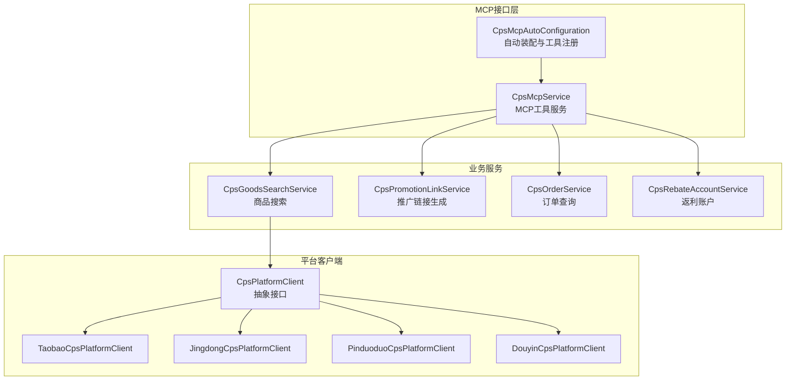
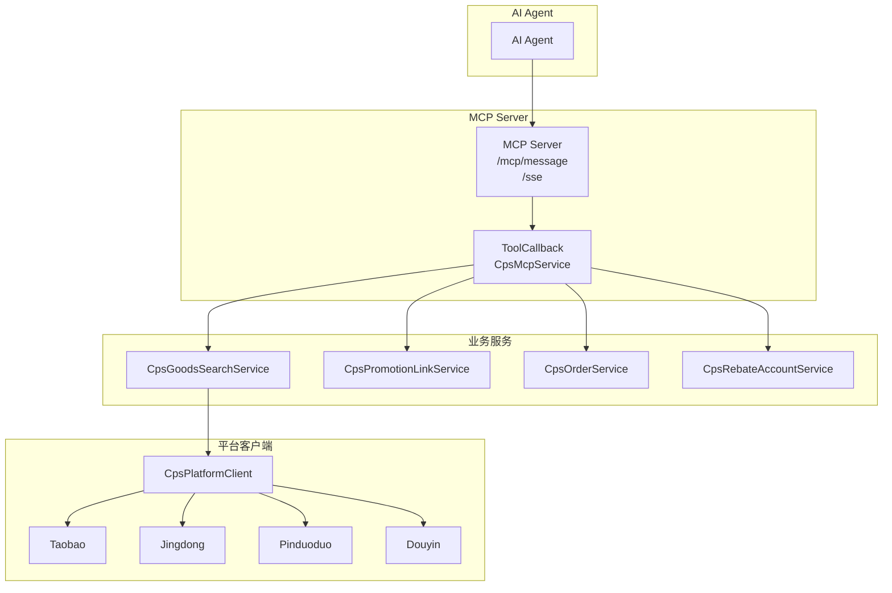
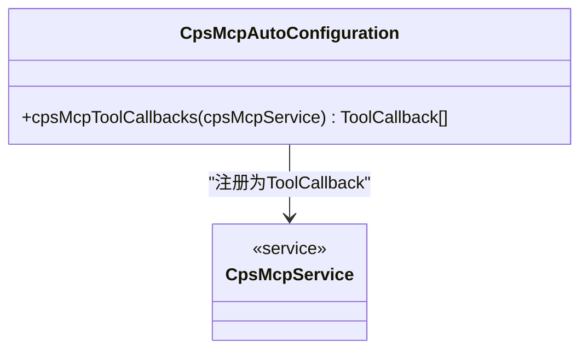
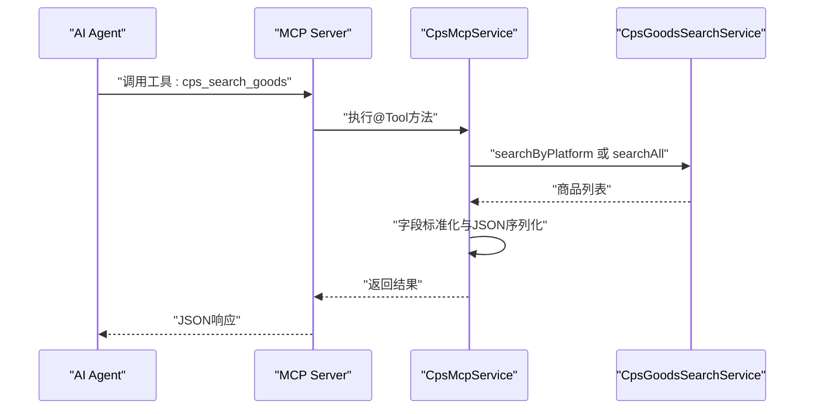
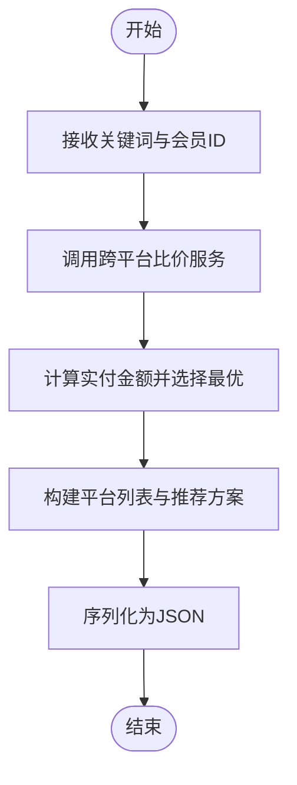
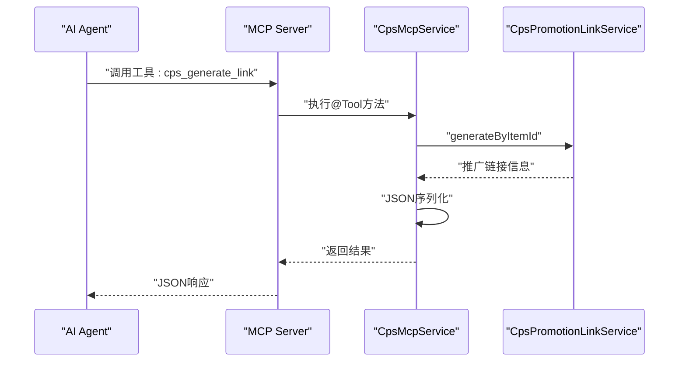
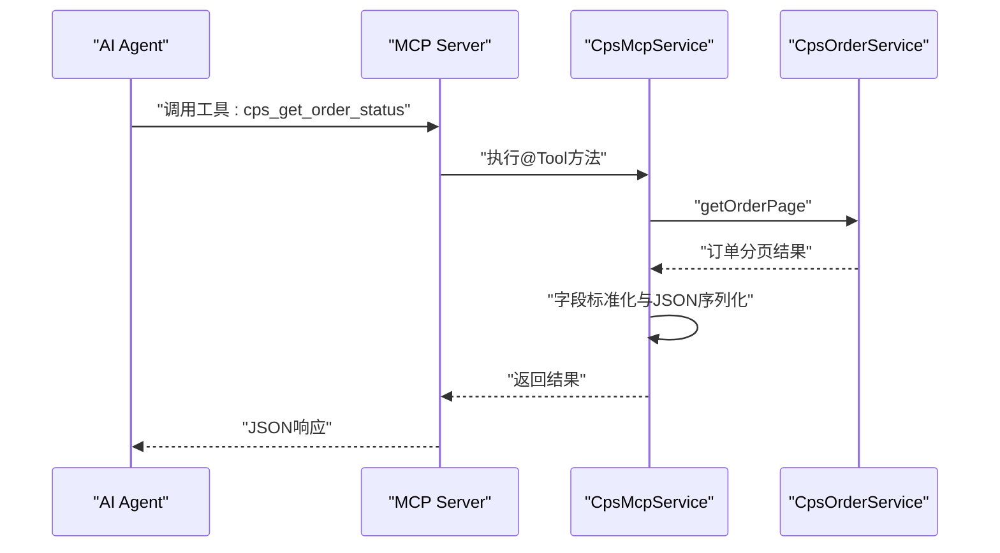
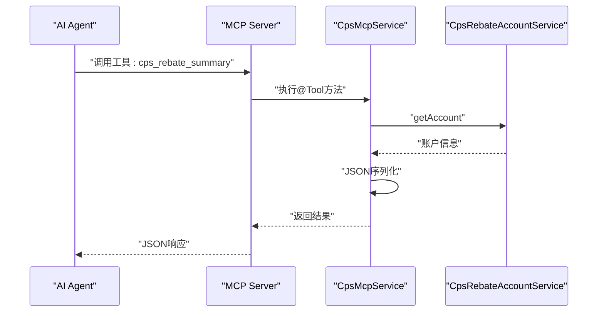
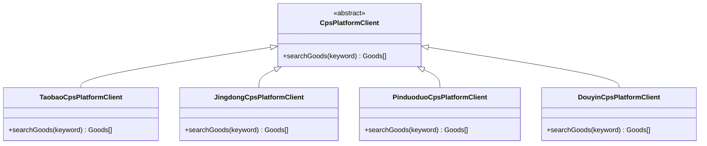
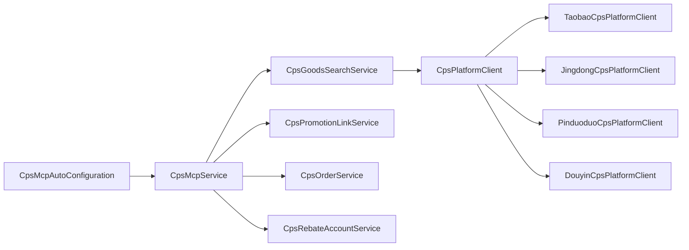

# MCP AI接口层

<cite>
**本文引用的文件**
- [CpsMcpAutoConfiguration.java](file://qiji-module-cps/qiji-module-cps-biz/src/main/java/cn/zhijian/cps/mcp/CpsMcpAutoConfiguration.java)
- [CpsMcpService.java](file://qiji-module-cps/qiji-module-cps-biz/src/main/java/cn/zhijian/cps/mcp/CpsMcpService.java)
- [CpsGoodsSearchService.java](file://qiji-module-cps/qiji-module-cps-biz/src/main/java/cn/zhijian/cps/service/goods/CpsGoodsSearchService.java)
- [CpsPromotionLinkService.java](file://qiji-module-cps/qiji-module-cps-biz/src/main/java/cn/zhijian/cps/service/link/CpsPromotionLinkService.java)
- [CpsOrderService.java](file://qiji-module-cps/qiji-module-cps-biz/src/main/java/cn/zhijian/cps/service/order/CpsOrderService.java)
- [CpsRebateAccountService.java](file://qiji-module-cps/qiji-module-cps-biz/src/main/java/cn/zhijian/cps/service/account/CpsRebateAccountService.java)
- [CpsPlatformClient.java](file://qiji-module-cps/qiji-module-cps-biz/src/main/java/cn/zhijian/cps/client/CpsPlatformClient.java)
- [TaobaoCpsPlatformClient.java](file://qiji-module-cps/qiji-module-cps-biz/src/main/java/cn/zhijian/cps/client/TaobaoCpsPlatformClient.java)
- [JingdongCpsPlatformClient.java](file://qiji-module-cps/qiji-module-cps-biz/src/main/java/cn/zhijian/cps/client/JingdongCpsPlatformClient.java)
- [PinduoduoCpsPlatformClient.java](file://qiji-module-cps/qiji-module-cps-biz/src/main/java/cn/zhijian/cps/client/PinduoduoCpsPlatformClient.java)
- [DouyinCpsPlatformClient.java](file://qiji-module-cps/qiji-module-cps-biz/src/main/java/cn/zhijian/cps/client/DouyinCpsPlatformClient.java)
- [CpsMcpApiKeyServiceImplTest.java](file://qiji-module-cps/qiji-module-cps-biz/src/test/java/cn/zhijian/cps/service/CpsMcpApiKeyServiceImplTest.java)
</cite>

## 目录
1. [引言](#引言)
2. [项目结构](#项目结构)
3. [核心组件](#核心组件)
4. [架构总览](#架构总览)
5. [详细组件分析](#详细组件分析)
6. [依赖关系分析](#依赖关系分析)
7. [性能考虑](#性能考虑)
8. [故障排查指南](#故障排查指南)
9. [结论](#结论)
10. [附录](#附录)

## 引言
本文件面向AgenticCPS系统的MCP（Model Context Protocol）AI接口层，系统性阐述基于MCP协议的AI接口实现架构与集成实践。重点覆盖以下方面：
- MCP Server的配置与启动机制
- Tools工具函数的设计与实现（商品搜索、多平台比价、推广链接生成、订单查询、返利汇总）
- 资源管理与平台适配（平台客户端抽象与多平台接入）
- AI Agent与CPS服务的交互模式、消息传递机制与状态管理策略
- 开发指南与集成示例，帮助快速构建AI增强型CPS系统

## 项目结构
MCP接口层位于CPS业务模块中，采用“自动装配 + 工具回调”的方式，将业务能力以MCP Tools的形式暴露给AI Agent。关键目录与文件如下：
- 自动装配与工具注册：CpsMcpAutoConfiguration.java
- MCP工具服务：CpsMcpService.java
- 平台客户端抽象与实现：CpsPlatformClient.java、TaobaoCpsPlatformClient.java、JingdongCpsPlatformClient.java、PinduoduoCpsPlatformClient.java、DouyinCpsPlatformClient.java
- 业务服务依赖：CpsGoodsSearchService.java、CpsPromotionLinkService.java、CpsOrderService.java、CpsRebateAccountService.java
- 测试用例：CpsMcpApiKeyServiceImplTest.java

图表来源
- [CpsMcpAutoConfiguration.java:1-38](file://qiji-module-cps/qiji-module-cps-biz/src/main/java/cn/zhijian/cps/mcp/CpsMcpAutoConfiguration.java#L1-L38)
- [CpsMcpService.java:1-295](file://qiji-module-cps/qiji-module-cps-biz/src/main/java/cn/zhijian/cps/mcp/CpsMcpService.java#L1-L295)
- [CpsGoodsSearchService.java](file://qiji-module-cps/qiji-module-cps-biz/src/main/java/cn/zhijian/cps/service/goods/CpsGoodsSearchService.java)
- [CpsPromotionLinkService.java](file://qiji-module-cps/qiji-module-cps-biz/src/main/java/cn/zhijian/cps/service/link/CpsPromotionLinkService.java)
- [CpsOrderService.java](file://qiji-module-cps/qiji-module-cps-biz/src/main/java/cn/zhijian/cps/service/order/CpsOrderService.java)
- [CpsRebateAccountService.java](file://qiji-module-cps/qiji-module-cps-biz/src/main/java/cn/zhijian/cps/service/account/CpsRebateAccountService.java)
- [CpsPlatformClient.java](file://qiji-module-cps/qiji-module-cps-biz/src/main/java/cn/zhijian/cps/client/CpsPlatformClient.java)
- [TaobaoCpsPlatformClient.java](file://qiji-module-cps/qiji-module-cps-biz/src/main/java/cn/zhijian/cps/client/TaobaoCpsPlatformClient.java)
- [JingdongCpsPlatformClient.java](file://qiji-module-cps/qiji-module-cps-biz/src/main/java/cn/zhijian/cps/client/JingdongCpsPlatformClient.java)
- [PinduoduoCpsPlatformClient.java](file://qiji-module-cps/qiji-module-cps-biz/src/main/java/cn/zhijian/cps/client/PinduoduoCpsPlatformClient.java)
- [DouyinCpsPlatformClient.java](file://qiji-module-cps/qiji-module-cps-biz/src/main/java/cn/zhijian/cps/client/DouyinCpsPlatformClient.java)

章节来源
- [CpsMcpAutoConfiguration.java:1-38](file://qiji-module-cps/qiji-module-cps-biz/src/main/java/cn/zhijian/cps/mcp/CpsMcpAutoConfiguration.java#L1-L38)
- [CpsMcpService.java:1-295](file://qiji-module-cps/qiji-module-cps-biz/src/main/java/cn/zhijian/cps/mcp/CpsMcpService.java#L1-L295)

## 核心组件
- 自动装配与工具注册：通过CpsMcpAutoConfiguration将CpsMcpService中的@Tool方法统一注册为MCP工具回调，供Spring AI MCP Server自动发现与暴露。
- MCP工具服务：CpsMcpService封装五大核心工具，分别对应商品搜索、多平台比价、推广链接生成、订单查询、返利汇总，统一输出JSON格式结果。
- 平台客户端：CpsPlatformClient定义平台抽象，具体实现包括淘宝、京东、拼多多、抖音等，负责对接各平台API并返回标准化的商品信息。

章节来源
- [CpsMcpAutoConfiguration.java:22-35](file://qiji-module-cps/qiji-module-cps-biz/src/main/java/cn/zhijian/cps/mcp/CpsMcpAutoConfiguration.java#L22-L35)
- [CpsMcpService.java:31-48](file://qiji-module-cps/qiji-module-cps-biz/src/main/java/cn/zhijian/cps/mcp/CpsMcpService.java#L31-L48)
- [CpsPlatformClient.java](file://qiji-module-cps/qiji-module-cps-biz/src/main/java/cn/zhijian/cps/client/CpsPlatformClient.java)

## 架构总览
MCP接口层采用“工具回调 + 平台适配 + 业务服务”的分层架构：
- 工具回调层：将业务方法标注为@Tool，统一由Spring AI MCP Server暴露HTTP/SSE端点
- 业务服务层：封装商品搜索、推广链接、订单与返利等核心业务逻辑
- 平台适配层：抽象平台客户端，屏蔽多平台差异，统一返回标准化数据

图表来源
- [CpsMcpAutoConfiguration.java:17-20](file://qiji-module-cps/qiji-module-cps-biz/src/main/java/cn/zhijian/cps/mcp/CpsMcpAutoConfiguration.java#L17-L20)
- [CpsMcpService.java:50-104](file://qiji-module-cps/qiji-module-cps-biz/src/main/java/cn/zhijian/cps/mcp/CpsMcpService.java#L50-L104)
- [CpsPlatformClient.java](file://qiji-module-cps/qiji-module-cps-biz/src/main/java/cn/zhijian/cps/client/CpsPlatformClient.java)

## 详细组件分析

### 组件一：MCP自动装配与工具注册
- 职责：将CpsMcpService中的@Tool方法注册为ToolCallback，供Spring AI MCP Server自动发现
- 关键点：
  - 使用ToolCallbacks.from将服务实例转换为回调集合
  - Spring AI的MCP Starter会自动暴露HTTP与SSE端点
  - 端点示例：POST /mcp/message、GET /sse

图表来源
- [CpsMcpAutoConfiguration.java:32-35](file://qiji-module-cps/qiji-module-cps-biz/src/main/java/cn/zhijian/cps/mcp/CpsMcpAutoConfiguration.java#L32-L35)
- [CpsMcpService.java:31-33](file://qiji-module-cps/qiji-module-cps-biz/src/main/java/cn/zhijian/cps/mcp/CpsMcpService.java#L31-L33)

章节来源
- [CpsMcpAutoConfiguration.java:22-35](file://qiji-module-cps/qiji-module-cps-biz/src/main/java/cn/zhijian/cps/mcp/CpsMcpAutoConfiguration.java#L22-L35)

### 组件二：商品搜索工具（cps_search_goods）
- 功能：根据关键词在单平台或多平台搜索商品，返回商品列表与预估返利信息
- 输入参数：关键词、平台编码（可选）、价格区间（可选）
- 输出：JSON对象，包含总数与商品数组
- 处理流程：
  - 构造搜索请求，设置分页与价格过滤
  - 单平台搜索或全平台并行搜索
  - 标准化字段映射，空值转为空字符串或零值
  - 异常捕获并返回错误信息

图表来源
- [CpsMcpService.java:50-104](file://qiji-module-cps/qiji-module-cps-biz/src/main/java/cn/zhijian/cps/mcp/CpsMcpService.java#L50-L104)
- [CpsGoodsSearchService.java](file://qiji-module-cps/qiji-module-cps-biz/src/main/java/cn/zhijian/cps/service/goods/CpsGoodsSearchService.java)

章节来源
- [CpsMcpService.java:50-104](file://qiji-module-cps/qiji-module-cps-biz/src/main/java/cn/zhijian/cps/mcp/CpsMcpService.java#L50-L104)

### 组件三：多平台比价工具（cps_compare_prices）
- 功能：跨平台并行比价，返回各平台价格对比与最优推荐
- 输入参数：关键词、会员ID（可选）
- 输出：JSON对象，包含平台列表与推荐方案
- 处理流程：
  - 调用商品搜索服务进行跨平台比价
  - 计算实付金额（finalPrice - estimateRebate），选择最优
  - 标准化字段映射，包含推荐理由

图表来源
- [CpsMcpService.java:106-161](file://qiji-module-cps/qiji-module-cps-biz/src/main/java/cn/zhijian/cps/mcp/CpsMcpService.java#L106-L161)

章节来源
- [CpsMcpService.java:106-161](file://qiji-module-cps/qiji-module-cps-biz/src/main/java/cn/zhijian/cps/mcp/CpsMcpService.java#L106-L161)

### 组件四：推广链接生成工具（cps_generate_link）
- 功能：根据商品ID与平台编码生成带会员归因参数的推广链接或口令
- 输入参数：平台编码、商品ID、会员ID
- 输出：JSON对象，包含成功标志与推广信息
- 处理流程：
  - 调用推广链接服务生成链接
  - 返回短链、口令、二维码等信息
  - 异常时返回错误信息

图表来源
- [CpsMcpService.java:163-193](file://qiji-module-cps/qiji-module-cps-biz/src/main/java/cn/zhijian/cps/mcp/CpsMcpService.java#L163-L193)
- [CpsPromotionLinkService.java](file://qiji-module-cps/qiji-module-cps-biz/src/main/java/cn/zhijian/cps/service/link/CpsPromotionLinkService.java)

章节来源
- [CpsMcpService.java:163-193](file://qiji-module-cps/qiji-module-cps-biz/src/main/java/cn/zhijian/cps/mcp/CpsMcpService.java#L163-L193)

### 组件五：订单查询工具（cps_get_order_status）
- 功能：查询指定会员的CPS订单列表及每笔订单的返利进度
- 输入参数：会员ID、返回条数（可选）
- 输出：JSON对象，包含总数、分页大小与订单数组
- 处理流程：
  - 构造分页请求，限制最大条数
  - 调用订单服务查询分页数据
  - 标准化字段映射，包含状态与返利信息

图表来源
- [CpsMcpService.java:195-238](file://qiji-module-cps/qiji-module-cps-biz/src/main/java/cn/zhijian/cps/mcp/CpsMcpService.java#L195-L238)
- [CpsOrderService.java](file://qiji-module-cps/qiji-module-cps-biz/src/main/java/cn/zhijian/cps/service/order/CpsOrderService.java)

章节来源
- [CpsMcpService.java:195-238](file://qiji-module-cps/qiji-module-cps-biz/src/main/java/cn/zhijian/cps/mcp/CpsMcpService.java#L195-L238)

### 组件六：返利汇总工具（cps_rebate_summary）
- 功能：获取指定会员的返利账户汇总信息（可用余额、冻结金额、累计返利、已提现）
- 输入参数：会员ID
- 输出：JSON对象，包含账户各项余额与状态
- 处理流程：
  - 调用返利账户服务获取账户信息
  - 不存在时返回默认值与提示信息
  - 正常时序列化返回

图表来源
- [CpsMcpService.java:240-277](file://qiji-module-cps/qiji-module-cps-biz/src/main/java/cn/zhijian/cps/mcp/CpsMcpService.java#L240-L277)
- [CpsRebateAccountService.java](file://qiji-module-cps/qiji-module-cps-biz/src/main/java/cn/zhijian/cps/service/account/CpsRebateAccountService.java)

章节来源
- [CpsMcpService.java:240-277](file://qiji-module-cps/qiji-module-cps-biz/src/main/java/cn/zhijian/cps/mcp/CpsMcpService.java#L240-L277)

### 组件七：平台客户端与资源适配
- 抽象接口：CpsPlatformClient定义平台通用能力
- 具体实现：TaobaoCpsPlatformClient、JingdongCpsPlatformClient、PinduoduoCpsPlatformClient、DouyinCpsPlatformClient
- 资源组织：通过平台枚举与配置管理不同平台的API密钥、域名与接口规范
- 处理机制：统一返回标准化的商品信息，供商品搜索服务使用

图表来源
- [CpsPlatformClient.java](file://qiji-module-cps/qiji-module-cps-biz/src/main/java/cn/zhijian/cps/client/CpsPlatformClient.java)
- [TaobaoCpsPlatformClient.java](file://qiji-module-cps/qiji-module-cps-biz/src/main/java/cn/zhijian/cps/client/TaobaoCpsPlatformClient.java)
- [JingdongCpsPlatformClient.java](file://qiji-module-cps/qiji-module-cps-biz/src/main/java/cn/zhijian/cps/client/JingdongCpsPlatformClient.java)
- [PinduoduoCpsPlatformClient.java](file://qiji-module-cps/qiji-module-cps-biz/src/main/java/cn/zhijian/cps/client/PinduoduoCpsPlatformClient.java)
- [DouyinCpsPlatformClient.java](file://qiji-module-cps/qiji-module-cps-biz/src/main/java/cn/zhijian/cps/client/DouyinCpsPlatformClient.java)

章节来源
- [CpsPlatformClient.java](file://qiji-module-cps/qiji-module-cps-biz/src/main/java/cn/zhijian/cps/client/CpsPlatformClient.java)
- [TaobaoCpsPlatformClient.java](file://qiji-module-cps/qiji-module-cps-biz/src/main/java/cn/zhijian/cps/client/TaobaoCpsPlatformClient.java)
- [JingdongCpsPlatformClient.java](file://qiji-module-cps/qiji-module-cps-biz/src/main/java/cn/zhijian/cps/client/JingdongCpsPlatformClient.java)
- [PinduoduoCpsPlatformClient.java](file://qiji-module-cps/qiji-module-cps-biz/src/main/java/cn/zhijian/cps/client/PinduoduoCpsPlatformClient.java)
- [DouyinCpsPlatformClient.java](file://qiji-module-cps/qiji-module-cps-biz/src/main/java/cn/zhijian/cps/client/DouyinCpsPlatformClient.java)

## 依赖关系分析
- 组件耦合：
  - CpsMcpAutoConfiguration仅依赖CpsMcpService，低耦合高内聚
  - CpsMcpService依赖四个业务服务，形成清晰的职责边界
  - 平台客户端通过抽象接口与业务服务解耦
- 外部依赖：
  - Spring AI MCP Starter自动发现ToolCallback并暴露端点
  - ObjectMapper用于JSON序列化
- 循环依赖：未见循环依赖迹象

图表来源
- [CpsMcpAutoConfiguration.java:32-35](file://qiji-module-cps/qiji-module-cps-biz/src/main/java/cn/zhijian/cps/mcp/CpsMcpAutoConfiguration.java#L32-L35)
- [CpsMcpService.java:35-48](file://qiji-module-cps/qiji-module-cps-biz/src/main/java/cn/zhijian/cps/mcp/CpsMcpService.java#L35-L48)
- [CpsPlatformClient.java](file://qiji-module-cps/qiji-module-cps-biz/src/main/java/cn/zhijian/cps/client/CpsPlatformClient.java)

章节来源
- [CpsMcpAutoConfiguration.java:22-35](file://qiji-module-cps/qiji-module-cps-biz/src/main/java/cn/zhijian/cps/mcp/CpsMcpAutoConfiguration.java#L22-L35)
- [CpsMcpService.java:31-48](file://qiji-module-cps/qiji-module-cps-biz/src/main/java/cn/zhijian/cps/mcp/CpsMcpService.java#L31-L48)

## 性能考虑
- 并行搜索：全平台搜索采用并行策略，缩短响应时间
- 分页控制：订单查询默认返回10条，最大20条，避免过大数据量
- 字段标准化：统一空值处理，减少前端解析成本
- 序列化异常兜底：JSON序列化失败时返回错误提示，保证稳定性

## 故障排查指南
- 工具注册失败：确认CpsMcpAutoConfiguration已生效，ToolCallback Bean被Spring AI MCP Server发现
- 工具调用异常：检查CpsMcpService中各工具方法的日志与异常处理逻辑
- 平台接口问题：核对平台客户端配置与API密钥，确保网络连通性
- 订单/返利查询异常：检查业务服务依赖是否正常，数据库连接与权限

章节来源
- [CpsMcpService.java:100-103](file://qiji-module-cps/qiji-module-cps-biz/src/main/java/cn/zhijian/cps/mcp/CpsMcpService.java#L100-L103)
- [CpsMcpService.java:158-160](file://qiji-module-cps/qiji-module-cps-biz/src/main/java/cn/zhijian/cps/mcp/CpsMcpService.java#L158-L160)
- [CpsMcpService.java:190-192](file://qiji-module-cps/qiji-module-cps-biz/src/main/java/cn/zhijian/cps/mcp/CpsMcpService.java#L190-L192)
- [CpsMcpService.java:235-237](file://qiji-module-cps/qiji-module-cps-biz/src/main/java/cn/zhijian/cps/mcp/CpsMcpService.java#L235-L237)
- [CpsMcpService.java:274-276](file://qiji-module-cps/qiji-module-cps-biz/src/main/java/cn/zhijian/cps/mcp/CpsMcpService.java#L274-L276)
- [CpsMcpApiKeyServiceImplTest.java](file://qiji-module-cps/qiji-module-cps-biz/src/test/java/cn/zhijian/cps/service/CpsMcpApiKeyServiceImplTest.java)

## 结论
MCP AI接口层通过“自动装配 + 工具回调 + 平台适配”的架构设计，将CPS核心业务能力以标准化工具形式暴露给AI Agent，实现了商品搜索、比价、推广链接生成、订单查询与返利汇总等关键功能。该设计具备良好的扩展性与稳定性，便于在多平台环境下快速集成与迭代。

## 附录
- 开发指南与集成示例
  - 启动MCP Server：确保引入Spring AI MCP Starter依赖，自动装配生效后即可在默认端点接收工具调用
  - 添加新工具：在CpsMcpService中新增@Tool方法，遵循参数注解与返回JSON的约定
  - 扩展平台：实现CpsPlatformClient接口，注入到商品搜索服务中
  - 测试验证：参考CpsMcpApiKeyServiceImplTest编写单元测试，覆盖工具调用与异常场景