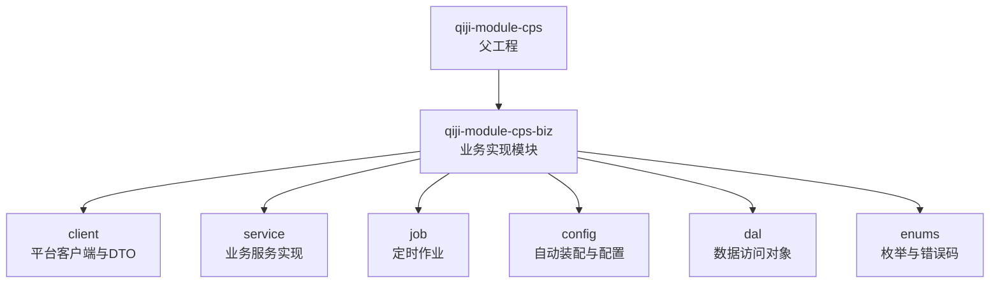
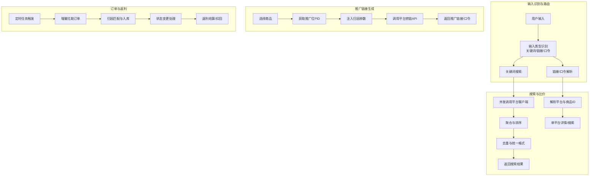
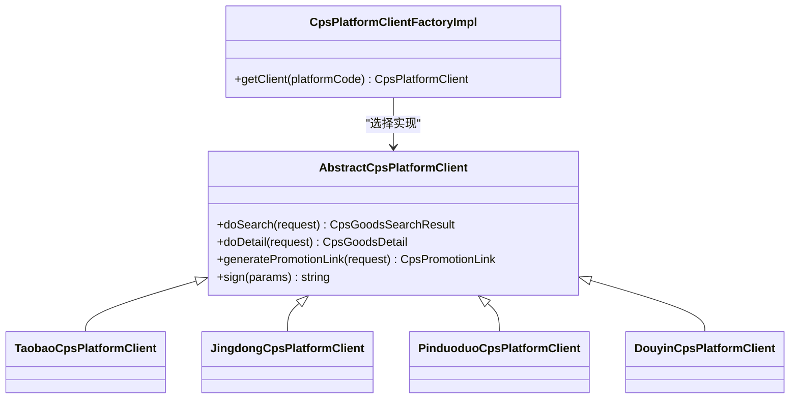
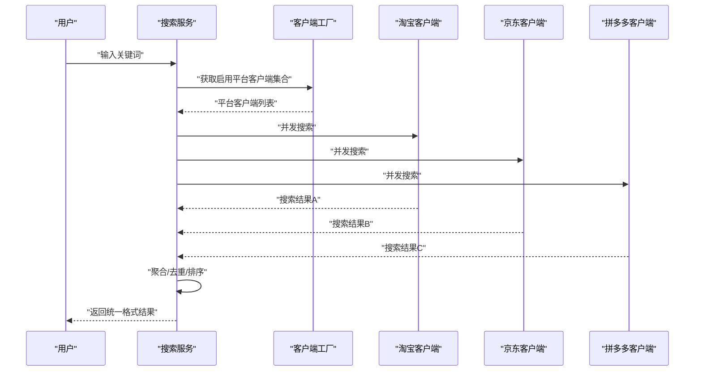
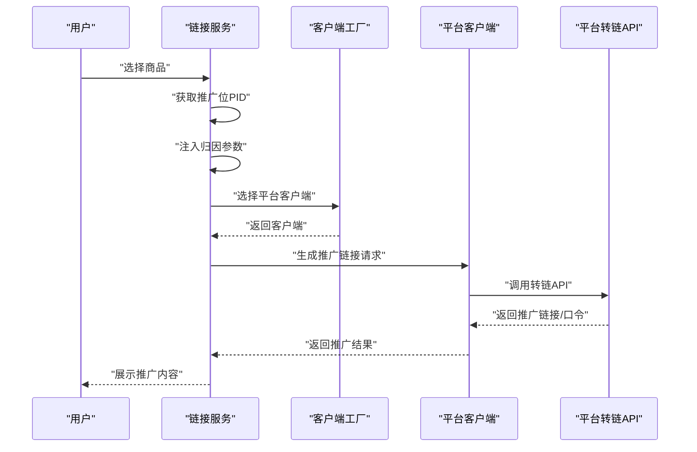
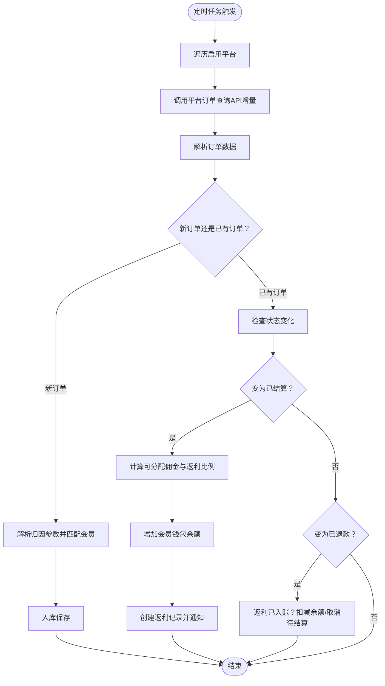
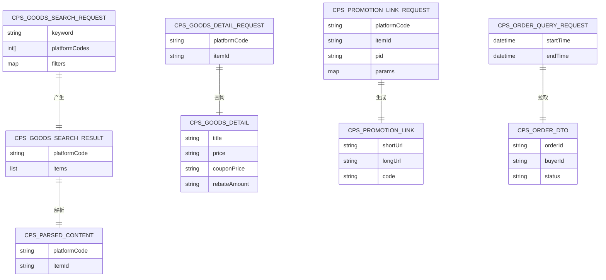
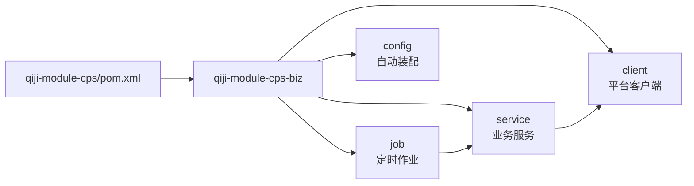

# 商品搜索与比价

<cite>
**本文引用的文件**
- [CPS系统PRD文档.md](file://docs/CPS系统PRD文档.md)
- [qiji-module-cps/pom.xml](file://qiji-module-cps/pom.xml)
- [AbstractCpsPlatformClient.java](file://qiji-module-cps/qiji-module-cps-biz/src/main/java/cn/zhijian/cps/client/AbstractCpsPlatformClient.java)
- [CpsPlatformClient.java](file://qiji-module-cps/qiji-module-cps-biz/src/main/java/cn/zhijian/cps/client/CpsPlatformClient.java)
- [TaobaoCpsPlatformClient.java](file://qiji-module-cps/qiji-module-cps-biz/src/main/java/cn/zhijian/cps/client/TaobaoCpsPlatformClient.java)
- [JingdongCpsPlatformClient.java](file://qiji-module-cps/qiji-module-cps-biz/src/main/java/cn/zhijian/cps/client/JingdongCpsPlatformClient.java)
- [PinduoduoCpsPlatformClient.java](file://qiji-module-cps/qiji-module-cps-biz/src/main/java/cn/zhijian/cps/client/PinduoduoCpsPlatformClient.java)
- [DouyinCpsPlatformClient.java](file://qiji-module-cps/qiji-module-cps-biz/src/main/java/cn/zhijian/cps/client/DouyinCpsPlatformClient.java)
- [CpsPlatformClientFactoryImpl.java](file://qiji-module-cps/qiji-module-cps-biz/src/main/java/cn/zhijian/cps/service/CpsPlatformClientFactoryImpl.java)
- [CpsGoodsSearchRequest.java](file://qiji-module-cps/qiji-module-cps-biz/src/main/java/cn/zhijian/cps/client/dto/CpsGoodsSearchRequest.java)
- [CpsGoodsSearchResult.java](file://qiji-module-cps/qiji-module-cps-biz/src/main/java/cn/zhijian/cps/client/dto/CpsGoodsSearchResult.java)
- [CpsGoodsDetailRequest.java](file://qiji-module-cps/qiji-module-cps-biz/src/main/java/cn/zhijian/cps/client/dto/CpsGoodsDetailRequest.java)
- [CpsGoodsDetail.java](file://qiji-module-cps/qiji-module-cps-biz/src/main/java/cn/zhijian/cps/client/dto/CpsGoodsDetail.java)
- [CpsPromotionLinkRequest.java](file://qiji-module-cps/qiji-module-cps-biz/src/main/java/cn/zhijian/cps/client/dto/CpsPromotionLinkRequest.java)
- [CpsPromotionLink.java](file://qiji-module-cps/qiji-module-cps-biz/src/main/java/cn/zhijian/cps/client/dto/CpsPromotionLink.java)
- [CpsParsedContent.java](file://qiji-module-cps/qiji-module-cps-biz/src/main/java/cn/zhijian/cps/client/dto/CpsParsedContent.java)
- [CpsOrderQueryRequest.java](file://qiji-module-cps/qiji-module-cps-biz/src/main/java/cn/zhijian/cps/client/dto/CpsOrderQueryRequest.java)
- [CpsOrderDTO.java](file://qiji-module-cps/qiji-module-cps-biz/src/main/java/cn/zhijian/cps/client/dto/CpsOrderDTO.java)
- [CpsApiSignUtil.java](file://qiji-module-cps/qiji-module-cps-biz/src/main/java/cn/zhijian/cps/client/util/CpsApiSignUtil.java)
- [CpsAutoConfiguration.java](file://qiji-module-cps/qiji-module-cps-biz/src/main/java/cn/zhijian/cps/config/CpsAutoConfiguration.java)
- [CpsOrderSyncJob.java](file://qiji-module-cps/qiji-module-cps-biz/src/main/java/cn/zhijian/cps/job/CpsOrderSyncJob.java)
- [CpsOrderStatusSyncJob.java](file://qiji-module-cps/qiji-module-cps-biz/src/main/java/cn/zhijian/cps/job/CpsOrderStatusSyncJob.java)
- [CpsRebateSettleJob.java](file://qiji-module-cps/qiji-module-cps-biz/src/main/java/cn/zhijian/cps/job/CpsRebateSettleJob.java)
- [CpsPlatformServiceImpl.java](file://qiji-module-cps/qiji-module-cps-biz/src/main/java/cn/zhijian/cps/service/CpsPlatformServiceImpl.java)
- [CpsOrderServiceImpl.java](file://qiji-module-cps/qiji-module-cps-biz/src/main/java/cn/zhijian/cps/service/CpsOrderServiceImpl.java)
- [CpsRebateConfigServiceImpl.java](file://qiji-module-cps/qiji-module-cps-biz/src/main/java/cn/zhijian/cps/service/CpsRebateConfigServiceImpl.java)
- [CpsRebateRecordServiceImpl.java](file://qiji-module-cps/qiji-module-cps-biz/src/main/java/cn/zhijian/cps/service/CpsRebateRecordServiceImpl.java)
- [CpsAdzoneServiceImpl.java](file://qiji-module-cps/qiji-module-cps-biz/src/main/java/cn/zhijian/cps/service/CpsAdzoneServiceImpl.java)
- [CpsWithdrawServiceImpl.java](file://qiji-module-cps/qiji-module-cps-biz/src/main/java/cn/zhijian/cps/service/CpsWithdrawServiceImpl.java)
- [CpsStatisticsServiceImpl.java](file://qiji-module-cps/qiji-module-cps-biz/src/main/java/cn/zhijian/cps/service/CpsStatisticsServiceImpl.java)
</cite>

## 目录
1. [简介](#简介)
2. [项目结构](#项目结构)
3. [核心组件](#核心组件)
4. [架构总览](#架构总览)
5. [详细组件分析](#详细组件分析)
6. [依赖关系分析](#依赖关系分析)
7. [性能考虑](#性能考虑)
8. [故障排查指南](#故障排查指南)
9. [结论](#结论)
10. [附录](#附录)

## 简介
本技术文档围绕商品搜索与比价功能展开，系统基于多平台CPS联盟（淘宝、京东、拼多多、抖音）能力，提供关键词搜索、链接/口令解析、商品信息提取、跨平台比价、推广链接生成、订单同步与返利结算等完整闭环。本文从系统架构、核心组件、数据流、排序与去重策略、缓存策略、API使用示例与性能优化等方面进行深入说明，帮助开发者理解并扩展该功能。

## 项目结构
CPS模块采用分层与模块化组织，核心位于 qiji-module-cps/qiji-module-cps-biz，包含客户端适配层、服务层、作业调度、配置与枚举等。模块父工程 qiji-module-cps 聚合子模块，便于统一构建与发布。

**图表来源**
- [qiji-module-cps/pom.xml:1-25](file://qiji-module-cps/pom.xml#L1-L25)

**章节来源**
- [qiji-module-cps/pom.xml:1-25](file://qiji-module-cps/pom.xml#L1-L25)

## 核心组件
- 平台客户端适配层：抽象平台客户端与各平台实现（淘宝、京东、拼多多、抖音），统一请求签名、参数构造与响应解析。
- 业务服务层：商品搜索、商品详情、推广链接生成、订单同步与结算、返利配置与记录、提现、统计等。
- 作业调度层：定时同步订单、订单状态同步、返利结算。
- 配置与工具：自动装配、平台配置、API签名工具等。

**章节来源**
- [AbstractCpsPlatformClient.java](file://qiji-module-cps/qiji-module-cps-biz/src/main/java/cn/zhijian/cps/client/AbstractCpsPlatformClient.java)
- [CpsPlatformClientFactoryImpl.java](file://qiji-module-cps/qiji-module-cps-biz/src/main/java/cn/zhijian/cps/service/CpsPlatformClientFactoryImpl.java)
- [CpsAutoConfiguration.java](file://qiji-module-cps/qiji-module-cps-biz/src/main/java/cn/zhijian/cps/config/CpsAutoConfiguration.java)

## 架构总览
系统采用“平台客户端适配 + 业务服务编排 + 定时任务驱动”的架构。输入内容经识别后，按关键词、链接/口令分别走不同路径；关键词搜索并发调用各平台客户端，聚合结果后按策略排序与去重；推广链接生成注入归因参数并调用平台转链API；订单定时同步与结算驱动返利入账。

**图表来源**
- [CpsPlatformClientFactoryImpl.java](file://qiji-module-cps/qiji-module-cps-biz/src/main/java/cn/zhijian/cps/service/CpsPlatformClientFactoryImpl.java)
- [CpsOrderSyncJob.java](file://qiji-module-cps/qiji-module-cps-biz/src/main/java/cn/zhijian/cps/job/CpsOrderSyncJob.java)
- [CpsOrderStatusSyncJob.java](file://qiji-module-cps/qiji-module-cps-biz/src/main/java/cn/zhijian/cps/job/CpsOrderStatusSyncJob.java)
- [CpsRebateSettleJob.java](file://qiji-module-cps/qiji-module-cps-biz/src/main/java/cn/zhijian/cps/job/CpsRebateSettleJob.java)

## 详细组件分析

### 平台客户端与工厂
- 抽象平台客户端定义统一接口，封装签名、参数构造、请求与响应解析。
- 各平台客户端实现差异化参数与返回字段映射。
- 客户端工厂根据平台编码选择对应实现，支持扩展新平台。

**图表来源**
- [AbstractCpsPlatformClient.java](file://qiji-module-cps/qiji-module-cps-biz/src/main/java/cn/zhijian/cps/client/AbstractCpsPlatformClient.java)
- [TaobaoCpsPlatformClient.java](file://qiji-module-cps/qiji-module-cps-biz/src/main/java/cn/zhijian/cps/client/TaobaoCpsPlatformClient.java)
- [JingdongCpsPlatformClient.java](file://qiji-module-cps/qiji-module-cps-biz/src/main/java/cn/zhijian/cps/client/JingdongCpsPlatformClient.java)
- [PinduoduoCpsPlatformClient.java](file://qiji-module-cps/qiji-module-cps-biz/src/main/java/cn/zhijian/cps/client/PinduoduoCpsPlatformClient.java)
- [DouyinCpsPlatformClient.java](file://qiji-module-cps/qiji-module-cps-biz/src/main/java/cn/zhijian/cps/client/DouyinCpsPlatformClient.java)
- [CpsPlatformClientFactoryImpl.java](file://qiji-module-cps/qiji-module-cps-biz/src/main/java/cn/zhijian/cps/service/CpsPlatformClientFactoryImpl.java)

**章节来源**
- [AbstractCpsPlatformClient.java](file://qiji-module-cps/qiji-module-cps-biz/src/main/java/cn/zhijian/cps/client/AbstractCpsPlatformClient.java)
- [CpsPlatformClientFactoryImpl.java](file://qiji-module-cps/qiji-module-cps-biz/src/main/java/cn/zhijian/cps/service/CpsPlatformClientFactoryImpl.java)

### 商品搜索与比价
- 关键词搜索：识别输入类型后，对启用平台并发调用搜索接口，聚合结果并按策略排序与去重。
- 链接/口令解析：识别平台与商品ID，调用单平台详情或搜索接口。
- 比价：同一关键词并发查询多平台，计算实付（券后价 - 预估返利），按排序模式展示最优方案。

**图表来源**
- [CpsPlatformClientFactoryImpl.java](file://qiji-module-cps/qiji-module-cps-biz/src/main/java/cn/zhijian/cps/service/CpsPlatformClientFactoryImpl.java)
- [CpsGoodsSearchRequest.java](file://qiji-module-cps/qiji-module-cps-biz/src/main/java/cn/zhijian/cps/client/dto/CpsGoodsSearchRequest.java)
- [CpsGoodsSearchResult.java](file://qiji-module-cps/qiji-module-cps-biz/src/main/java/cn/zhijian/cps/client/dto/CpsGoodsSearchResult.java)

**章节来源**
- [CpsGoodsSearchRequest.java](file://qiji-module-cps/qiji-module-cps-biz/src/main/java/cn/zhijian/cps/client/dto/CpsGoodsSearchRequest.java)
- [CpsGoodsSearchResult.java](file://qiji-module-cps/qiji-module-cps-biz/src/main/java/cn/zhijian/cps/client/dto/CpsGoodsSearchResult.java)

### 推广链接生成
- 获取会员推广位（PID），注入平台归因参数（如淘宝adzone_id+external_info、京东subUnionId、拼多多custom_parameters），调用平台转链API，返回推广链接与口令（若适用）。

**图表来源**
- [CpsPromotionLinkRequest.java](file://qiji-module-cps/qiji-module-cps-biz/src/main/java/cn/zhijian/cps/client/dto/CpsPromotionLinkRequest.java)
- [CpsPromotionLink.java](file://qiji-module-cps/qiji-module-cps-biz/src/main/java/cn/zhijian/cps/client/dto/CpsPromotionLink.java)
- [CpsPlatformClientFactoryImpl.java](file://qiji-module-cps/qiji-module-cps-biz/src/main/java/cn/zhijian/cps/service/CpsPlatformClientFactoryImpl.java)

**章节来源**
- [CpsPromotionLinkRequest.java](file://qiji-module-cps/qiji-module-cps-biz/src/main/java/cn/zhijian/cps/client/dto/CpsPromotionLinkRequest.java)
- [CpsPromotionLink.java](file://qiji-module-cps/qiji-module-cps-biz/src/main/java/cn/zhijian/cps/client/dto/CpsPromotionLink.java)

### 订单同步与返利结算
- 定时任务每5分钟触发，遍历启用平台，增量拉取订单，解析归因参数匹配会员，处理状态变更（结算/退款），计算返利并入账，记录返利明细与通知。

**图表来源**
- [CpsOrderSyncJob.java](file://qiji-module-cps/qiji-module-cps-biz/src/main/java/cn/zhijian/cps/job/CpsOrderSyncJob.java)
- [CpsOrderStatusSyncJob.java](file://qiji-module-cps/qiji-module-cps-biz/src/main/java/cn/zhijian/cps/job/CpsOrderStatusSyncJob.java)
- [CpsRebateSettleJob.java](file://qiji-module-cps/qiji-module-cps-biz/src/main/java/cn/zhijian/cps/job/CpsRebateSettleJob.java)
- [CpsOrderQueryRequest.java](file://qiji-module-cps/qiji-module-cps-biz/src/main/java/cn/zhijian/cps/client/dto/CpsOrderQueryRequest.java)
- [CpsOrderDTO.java](file://qiji-module-cps/qiji-module-cps-biz/src/main/java/cn/zhijian/cps/client/dto/CpsOrderDTO.java)

**章节来源**
- [CpsOrderQueryRequest.java](file://qiji-module-cps/qiji-module-cps-biz/src/main/java/cn/zhijian/cps/client/dto/CpsOrderQueryRequest.java)
- [CpsOrderDTO.java](file://qiji-module-cps/qiji-module-cps-biz/src/main/java/cn/zhijian/cps/client/dto/CpsOrderDTO.java)

### DTO与数据模型
- 搜索请求/结果、详情请求/结果、推广链接请求/结果、订单查询/订单DTO、解析内容DTO等，支撑搜索、详情、转链、订单等核心流程。

**图表来源**
- [CpsGoodsSearchRequest.java](file://qiji-module-cps/qiji-module-cps-biz/src/main/java/cn/zhijian/cps/client/dto/CpsGoodsSearchRequest.java)
- [CpsGoodsSearchResult.java](file://qiji-module-cps/qiji-module-cps-biz/src/main/java/cn/zhijian/cps/client/dto/CpsGoodsSearchResult.java)
- [CpsGoodsDetailRequest.java](file://qiji-module-cps/qiji-module-cps-biz/src/main/java/cn/zhijian/cps/client/dto/CpsGoodsDetailRequest.java)
- [CpsGoodsDetail.java](file://qiji-module-cps/qiji-module-cps-biz/src/main/java/cn/zhijian/cps/client/dto/CpsGoodsDetail.java)
- [CpsPromotionLinkRequest.java](file://qiji-module-cps/qiji-module-cps-biz/src/main/java/cn/zhijian/cps/client/dto/CpsPromotionLinkRequest.java)
- [CpsPromotionLink.java](file://qiji-module-cps/qiji-module-cps-biz/src/main/java/cn/zhijian/cps/client/dto/CpsPromotionLink.java)
- [CpsOrderQueryRequest.java](file://qiji-module-cps/qiji-module-cps-biz/src/main/java/cn/zhijian/cps/client/dto/CpsOrderQueryRequest.java)
- [CpsOrderDTO.java](file://qiji-module-cps/qiji-module-cps-biz/src/main/java/cn/zhijian/cps/client/dto/CpsOrderDTO.java)
- [CpsParsedContent.java](file://qiji-module-cps/qiji-module-cps-biz/src/main/java/cn/zhijian/cps/client/dto/CpsParsedContent.java)

**章节来源**
- [CpsGoodsDetail.java](file://qiji-module-cps/qiji-module-cps-biz/src/main/java/cn/zhijian/cps/client/dto/CpsGoodsDetail.java)
- [CpsParsedContent.java](file://qiji-module-cps/qiji-module-cps-biz/src/main/java/cn/zhijian/cps/client/dto/CpsParsedContent.java)

### API使用示例与最佳实践
- 商品搜索API：传入关键词与可选筛选条件，系统并发调用启用平台，聚合后返回统一格式结果。
- 推广链接API：传入平台编码、商品ID、推广位PID与归因参数，返回短链/长链/口令等。
- 比价API：传入关键词，系统并发查询多平台，返回对比表格与推荐。

最佳实践要点：
- 输入识别：优先判定URL/口令，再走关键词搜索，减少无效并发。
- 并发策略：对启用平台并发调用，设置合理超时与重试，避免阻塞。
- 排序策略：默认按“实付最低”（券后价 - 预估返利），支持价格/销量/返利排序。
- 去重机制：按平台+商品ID去重，保留最优价格与返利。
- 缓存策略：对热门关键词与商品详情设置短期缓存，降低平台压力。
- 错误处理：平台超时显示“暂时无法查询”，全部失败提示“未找到相关商品”。

**章节来源**
- [CpsGoodsSearchRequest.java](file://qiji-module-cps/qiji-module-cps-biz/src/main/java/cn/zhijian/cps/client/dto/CpsGoodsSearchRequest.java)
- [CpsPromotionLinkRequest.java](file://qiji-module-cps/qiji-module-cps-biz/src/main/java/cn/zhijian/cps/client/dto/CpsPromotionLinkRequest.java)
- [CpsAutoConfiguration.java](file://qiji-module-cps/qiji-module-cps-biz/src/main/java/cn/zhijian/cps/config/CpsAutoConfiguration.java)

## 依赖关系分析
- 模块依赖：父工程聚合子模块，子模块内部通过client/service/job/config等层次解耦。
- 平台客户端依赖：通过工厂模式按平台编码选择实现，新增平台只需实现抽象客户端并注册。
- 服务依赖：业务服务依赖客户端工厂与配置，作业依赖服务层与平台配置。

**图表来源**
- [qiji-module-cps/pom.xml:1-25](file://qiji-module-cps/pom.xml#L1-L25)

**章节来源**
- [qiji-module-cps/pom.xml:1-25](file://qiji-module-cps/pom.xml#L1-L25)

## 性能考虑
- 并发与超时：关键词搜索对启用平台并发调用，设置平台侧超时与整体超时，避免雪崩。
- 排序与去重：在聚合阶段完成去重与排序，减少前端重复处理。
- 缓存：对热门搜索与商品详情设置短期缓存，降低平台API压力。
- 限流与熔断：对平台API调用进行限流与熔断保护，异常时快速失败。
- 数据库：订单同步采用增量查询与批量入库，索引覆盖查询字段，减少锁竞争。

## 故障排查指南
- 平台连通性：通过平台配置中的“连通测试”验证AppKey/Secret与API地址。
- 订单未归因：检查订单归因参数注入是否正确，核对PID与平台要求。
- 返利未入账：核查平台结算状态、返利比例配置与结算延迟设置。
- 转链失败：确认PID有效性、归因参数格式与平台限额。
- 日志与监控：通过MCP访问日志与作业执行日志定位问题。

**章节来源**
- [CpsAutoConfiguration.java](file://qiji-module-cps/qiji-module-cps-biz/src/main/java/cn/zhijian/cps/config/CpsAutoConfiguration.java)

## 结论
本系统通过平台客户端适配与业务服务编排，实现了多平台商品搜索与比价、推广链接生成、订单同步与返利结算的完整闭环。依托并发搜索、统一排序与去重、缓存与限流等策略，兼顾性能与稳定性。建议在扩展新平台与优化排序策略时，遵循现有抽象与工厂模式，确保一致性与可维护性。

## 附录
- API签名工具：用于平台请求签名，保障调用安全。
- 平台配置：包含AppKey/Secret、API地址、默认推广位、平台费率等。
- 作业配置：定时任务间隔、并发度、重试策略等。

**章节来源**
- [CpsApiSignUtil.java](file://qiji-module-cps/qiji-module-cps-biz/src/main/java/cn/zhijian/cps/client/util/CpsApiSignUtil.java)
- [CpsAutoConfiguration.java](file://qiji-module-cps/qiji-module-cps-biz/src/main/java/cn/zhijian/cps/config/CpsAutoConfiguration.java)