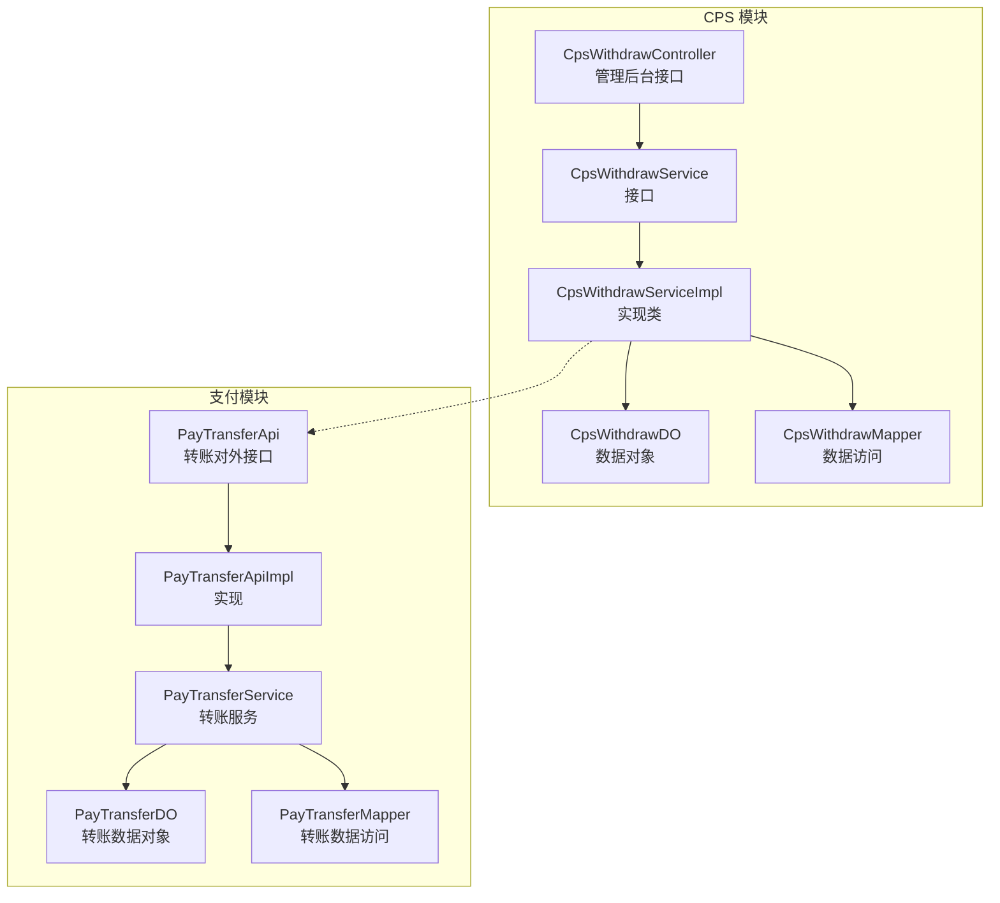
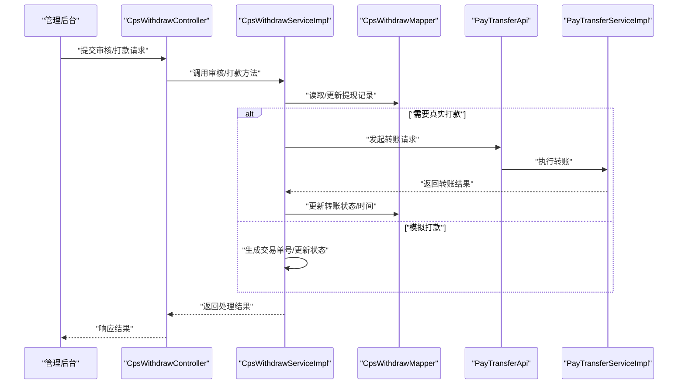
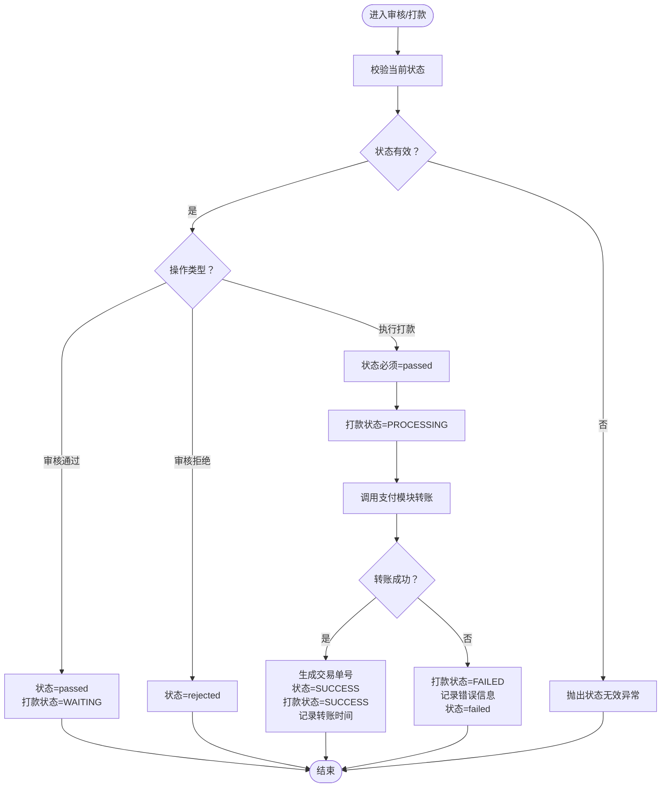
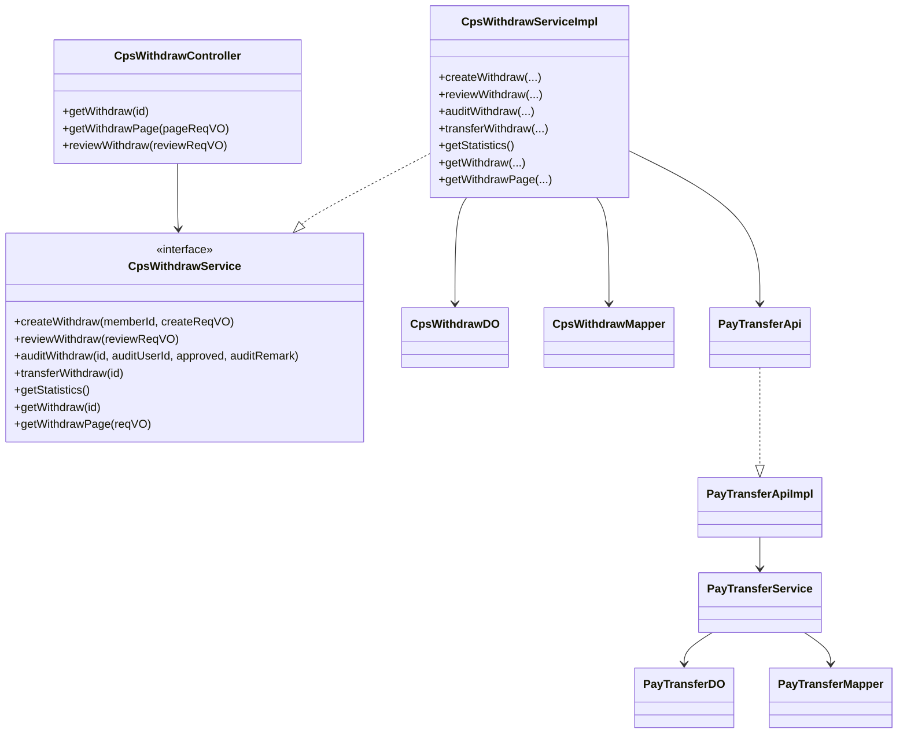

# 提现管理

<cite>
**本文引用的文件**
- [CpsWithdrawController.java](file://yudao-module-cps/yudao-module-cps-biz/src/main/java/cn/zhijian/cps/controller/admin/CpsWithdrawController.java)
- [CpsWithdrawService.java](file://yudao-module-cps/yudao-module-cps-biz/src/main/java/cn/zhijian/cps/service/CpsWithdrawService.java)
- [CpsWithdrawServiceImpl.java](file://yudao-module-cps/yudao-module-cps-biz/src/main/java/cn/zhijian/cps/service/CpsWithdrawServiceImpl.java)
- [CpsWithdrawDO.java](file://yudao-module-cps/yudao-module-cps-biz/src/main/java/cn/zhijian/cps/dal/dataobject/CpsWithdrawDO.java)
- [CpsWithdrawMapper.java](file://yudao-module-cps/yudao-module-cps-biz/src/main/java/cn/zhijian/cps/dal/mysql/CpsWithdrawMapper.java)
- [CpsWithdrawPageReqVO.java](file://yudao-module-cps/yudao-module-cps-biz/src/main/java/cn/zhijian/cps/controller/admin/vo/withdraw/CpsWithdrawPageReqVO.java)
- [CpsWithdrawRespVO.java](file://yudao-module-cps/yudao-module-cps-biz/src/main/java/cn/zhijian/cps/controller/admin/vo/withdraw/CpsWithdrawRespVO.java)
- [CpsWithdrawReviewReqVO.java](file://yudao-module-cps/yudao-module-cps-biz/src/main/java/cn/zhijian/cps/controller/admin/vo/withdraw/CpsWithdrawReviewReqVO.java)
- [CpsWithdrawAuditReqVO.java](file://yudao-module-cps/yudao-module-cps-biz/src/main/java/cn/zhijian/cps/controller/admin/vo/withdraw/CpsWithdrawAuditReqVO.java)
- [CpsWithdrawStatusEnum.java](file://yudao-module-cps/yudao-module-cps-biz/src/main/java/cn/zhijian/cps/enums/CpsWithdrawStatusEnum.java)
- [CpsWithdrawTypeEnum.java](file://yudao-module-cps/yudao-module-cps-biz/src/main/java/cn/zhijian/cps/enums/CpsWithdrawTypeEnum.java)
- [CpsWithdrawStatisticsRespVO.java](file://yudao-module-cps/yudao-module-cps-biz/src/main/java/cn/zhijian/cps/controller/admin/vo/withdraw/CpsWithdrawStatisticsRespVO.java)
- [AppCpsWithdrawCreateReqVO.java](file://yudao-module-cps/yudao-module-cps-biz/src/main/java/cn/zhijian/cps/controller/app/vo/AppCpsWithdrawCreateReqVO.java)
- [PayTransferApi.java](file://yudao-module-pay/src/main/java/cn/iocoder/yudao/module/pay/api/transfer/PayTransferApi.java)
- [PayTransferApiImpl.java](file://yudao-module-pay/src/main/java/cn/iocoder/yudao/module/pay/api/transfer/PayTransferApiImpl.java)
- [PayTransferCreateReqDTO.java](file://yudao-module-pay/src/main/java/cn/iocoder/yudao/module/pay/api/transfer/dto/PayTransferCreateReqDTO.java)
- [PayTransferCreateRespDTO.java](file://yudao-module-pay/src/main/java/cn/iocoder/yudao/module/pay/api/transfer/dto/PayTransferCreateRespDTO.java)
- [PayTransferRespDTO.java](file://yudao-module-pay/src/main/java/cn/iocoder/yudao/module/pay/api/transfer/dto/PayTransferRespDTO.java)
- [PayTransferController.java](file://yudao-module-pay/src/main/java/cn/iocoder/yudao/module/pay/controller/admin/transfer/PayTransferController.java)
- [PayTransferCreateRespVO.java](file://yudao-module-pay/src/main/java/cn/iocoder/yudao/module/pay/controller/admin/transfer/vo/PayTransferCreateRespVO.java)
- [PayTransferPageReqVO.java](file://yudao-module-pay/src/main/java/cn/iocoder/yudao/module/pay/controller/admin/transfer/vo/PayTransferPageReqVO.java)
- [PayTransferRespVO.java](file://yudao-module-pay/src/main/java/cn/iocoder/yudao/module/pay/controller/admin/transfer/vo/PayTransferRespVO.java)
- [PayTransferDO.java](file://yudao-module-pay/src/main/java/cn/iocoder/yudao/module/pay/dal/dataobject/transfer/PayTransferDO.java)
- [PayTransferMapper.java](file://yudao-module-pay/src/main/java/cn/iocoder/yudao/module/pay/dal/mysql/transfer/PayTransferMapper.java)
- [PayTransferStatusEnum.java](file://yudao-module-pay/src/main/java/cn/iocoder/yudao/module/pay/enums/transfer/PayTransferStatusEnum.java)
- [PayTransferUnifiedReqDTO.java](file://yudao-module-pay/src/main/java/cn/iocoder/yudao/module/pay/framework/pay/core/client/dto/transfer/PayTransferUnifiedReqDTO.java)
- [PayTransferRespDTO.java](file://yudao-module-pay/src/main/java/cn/iocoder/yudao/module/pay/framework/pay/core/client/dto/transfer/PayTransferRespDTO.java)
- [PayTransferSyncJob.java](file://yudao-module-pay/src/main/java/cn/iocoder/yudao/module/pay/job/transfer/PayTransferSyncJob.java)
- [PayTransferService.java](file://yudao-module-pay/src/main/java/cn/iocoder/yudao/module/pay/service/transfer/PayTransferService.java)
- [PayTransferServiceImpl.java](file://yudao-module-pay/src/main/java/cn/iocoder/yudao/module/pay/service/transfer/PayTransferServiceImpl.java)
</cite>

## 目录
1. [简介](#简介)
2. [项目结构](#项目结构)
3. [核心组件](#核心组件)
4. [架构总览](#架构总览)
5. [详细组件分析](#详细组件分析)
6. [依赖分析](#依赖分析)
7. [性能考虑](#性能考虑)
8. [故障排查指南](#故障排查指南)
9. [结论](#结论)
10. [附录](#附录)

## 简介
本技术文档围绕 CPS 提现系统展开，覆盖提现申请、审核流程、打款处理、状态跟踪等核心环节，并结合支付模块的转账能力，给出完整的实现路径与最佳实践。文档同时梳理提现配置的关键参数（如最低提现额度、手续费、到账时间限制等），并阐述状态流转规则、安全保障机制（敏感信息处理、操作日志、风控策略）、运维监控与异常处理策略，帮助开发者构建安全可靠的提现管理体系。

## 项目结构
CPS 提现系统主要位于 yudao-module-cps 的 cps-biz 子模块中，采用“控制层-服务层-数据访问层”的分层设计；与支付模块（yudao-module-pay）通过转账接口进行打通，实现真正的打款能力。

图表来源
- [CpsWithdrawController.java:1-57](file://yudao-module-cps/yudao-module-cps-biz/src/main/java/cn/zhijian/cps/controller/admin/CpsWithdrawController.java#L1-L57)
- [CpsWithdrawService.java:1-44](file://yudao-module-cps/yudao-module-cps-biz/src/main/java/cn/zhijian/cps/service/CpsWithdrawService.java#L1-L44)
- [CpsWithdrawServiceImpl.java:1-152](file://yudao-module-cps/yudao-module-cps-biz/src/main/java/cn/zhijian/cps/service/CpsWithdrawServiceImpl.java#L1-L152)
- [CpsWithdrawDO.java:1-60](file://yudao-module-cps/yudao-module-cps-biz/src/main/java/cn/zhijian/cps/dal/dataobject/CpsWithdrawDO.java#L1-L60)
- [CpsWithdrawMapper.java](file://yudao-module-cps/yudao-module-cps-biz/src/main/java/cn/zhijian/cps/dal/mysql/CpsWithdrawMapper.java)
- [PayTransferApi.java](file://yudao-module-pay/src/main/java/cn/iocoder/yudao/module/pay/api/transfer/PayTransferApi.java)
- [PayTransferApiImpl.java](file://yudao-module-pay/src/main/java/cn/iocoder/yudao/module/pay/api/transfer/PayTransferApiImpl.java)
- [PayTransferService.java](file://yudao-module-pay/src/main/java/cn/iocoder/yudao/module/pay/service/transfer/PayTransferService.java)
- [PayTransferDO.java](file://yudao-module-pay/src/main/java/cn/iocoder/yudao/module/pay/dal/dataobject/transfer/PayTransferDO.java)
- [PayTransferMapper.java](file://yudao-module-pay/src/main/java/cn/iocoder/yudao/module/pay/dal/mysql/transfer/PayTransferMapper.java)

章节来源
- [CpsWithdrawController.java:1-57](file://yudao-module-cps/yudao-module-cps-biz/src/main/java/cn/zhijian/cps/controller/admin/CpsWithdrawController.java#L1-L57)
- [CpsWithdrawService.java:1-44](file://yudao-module-cps/yudao-module-cps-biz/src/main/java/cn/zhijian/cps/service/CpsWithdrawService.java#L1-L44)
- [CpsWithdrawServiceImpl.java:1-152](file://yudao-module-cps/yudao-module-cps-biz/src/main/java/cn/zhijian/cps/service/CpsWithdrawServiceImpl.java#L1-L152)
- [CpsWithdrawDO.java:1-60](file://yudao-module-cps/yudao-module-cps-biz/src/main/java/cn/zhijian/cps/dal/dataobject/CpsWithdrawDO.java#L1-L60)
- [CpsWithdrawMapper.java](file://yudao-module-cps/yudao-module-cps-biz/src/main/java/cn/zhijian/cps/dal/mysql/CpsWithdrawMapper.java)
- [PayTransferApi.java](file://yudao-module-pay/src/main/java/cn/iocoder/yudao/module/pay/api/transfer/PayTransferApi.java)
- [PayTransferApiImpl.java](file://yudao-module-pay/src/main/java/cn/iocoder/yudao/module/pay/api/transfer/PayTransferApiImpl.java)
- [PayTransferService.java](file://yudao-module-pay/src/main/java/cn/iocoder/yudao/module/pay/service/transfer/PayTransferService.java)
- [PayTransferDO.java](file://yudao-module-pay/src/main/java/cn/iocoder/yudao/module/pay/dal/dataobject/transfer/PayTransferDO.java)
- [PayTransferMapper.java](file://yudao-module-pay/src/main/java/cn/iocoder/yudao/module/pay/dal/mysql/transfer/PayTransferMapper.java)

## 核心组件
- 控制器层：提供管理后台的提现查询、分页、审核接口，负责参数校验与权限控制。
- 服务层：封装业务逻辑，包括提现创建、审核、打款、统计与分页查询。
- 数据访问层：基于 MyBatis-Plus 访问数据库，提供分页、条件查询与更新。
- 数据模型：定义提现申请的数据结构，包含金额、手续费、状态、转账信息等字段。
- 支付对接：通过转账 API 将 CPS 提现与支付模块打通，完成真实打款。

章节来源
- [CpsWithdrawController.java:1-57](file://yudao-module-cps/yudao-module-cps-biz/src/main/java/cn/zhijian/cps/controller/admin/CpsWithdrawController.java#L1-L57)
- [CpsWithdrawService.java:1-44](file://yudao-module-cps/yudao-module-cps-biz/src/main/java/cn/zhijian/cps/service/CpsWithdrawService.java#L1-L44)
- [CpsWithdrawServiceImpl.java:1-152](file://yudao-module-cps/yudao-module-cps-biz/src/main/java/cn/zhijian/cps/service/CpsWithdrawServiceImpl.java#L1-L152)
- [CpsWithdrawDO.java:1-60](file://yudao-module-cps/yudao-module-cps-biz/src/main/java/cn/zhijian/cps/dal/dataobject/CpsWithdrawDO.java#L1-L60)

## 架构总览
CPS 提现系统遵循“接口-服务-数据访问-存储”的分层架构，配合支付模块的转账能力，形成从“申请-审核-打款-同步”的闭环。

图表来源
- [CpsWithdrawController.java:1-57](file://yudao-module-cps/yudao-module-cps-biz/src/main/java/cn/zhijian/cps/controller/admin/CpsWithdrawController.java#L1-L57)
- [CpsWithdrawServiceImpl.java:1-152](file://yudao-module-cps/yudao-module-cps-biz/src/main/java/cn/zhijian/cps/service/CpsWithdrawServiceImpl.java#L1-L152)
- [PayTransferApi.java](file://yudao-module-pay/src/main/java/cn/iocoder/yudao/module/pay/api/transfer/PayTransferApi.java)
- [PayTransferApiImpl.java](file://yudao-module-pay/src/main/java/cn/iocoder/yudao/module/pay/api/transfer/PayTransferApiImpl.java)
- [PayTransferService.java](file://yudao-module-pay/src/main/java/cn/iocoder/yudao/module/pay/service/transfer/PayTransferService.java)
- [PayTransferServiceImpl.java](file://yudao-module-pay/src/main/java/cn/iocoder/yudao/module/pay/service/transfer/PayTransferServiceImpl.java)

## 详细组件分析

### 控制器层：CpsWithdrawController
- 功能职责
  - 查询单条提现详情
  - 分页查询提现列表
  - 审核提现申请
- 权限与校验
  - 使用注解进行权限校验
  - 请求参数使用 VO 进行校验与格式化
- 返回值
  - 统一返回 CommonResult 包装
  - 列表分页使用 PageResult 包装

章节来源
- [CpsWithdrawController.java:1-57](file://yudao-module-cps/yudao-module-cps-biz/src/main/java/cn/zhijian/cps/controller/admin/CpsWithdrawController.java#L1-L57)
- [CpsWithdrawPageReqVO.java:1-31](file://yudao-module-cps/yudao-module-cps-biz/src/main/java/cn/zhijian/cps/controller/admin/vo/withdraw/CpsWithdrawPageReqVO.java#L1-L31)
- [CpsWithdrawRespVO.java:1-56](file://yudao-module-cps/yudao-module-cps-biz/src/main/java/cn/zhijian/cps/controller/admin/vo/withdraw/CpsWithdrawRespVO.java#L1-L56)
- [CpsWithdrawReviewReqVO.java:1-24](file://yudao-module-cps/yudao-module-cps-biz/src/main/java/cn/zhijian/cps/controller/admin/vo/withdraw/CpsWithdrawReviewReqVO.java#L1-L24)

### 服务层：CpsWithdrawService 与 CpsWithdrawServiceImpl
- 提现创建
  - 生成唯一提现单号
  - 初始化状态为“created”
  - 默认手续费为 0，实际到账=申请金额
- 审核流程
  - 校验状态是否允许变更
  - 审核通过：状态置为“passed”，打款状态置为“WAITING”
  - 审核拒绝：状态置为“rejected”
- 打款处理
  - 校验状态必须为“passed”
  - 更新打款状态为“PROCESSING”
  - 调用支付模块执行转账（当前为模拟，后续接入 PayTransferApi）
  - 打款成功：生成交易单号、更新转账状态与时间、状态置为“SUCCESS”
  - 打款失败：记录错误信息、状态置为“failed”
- 统计与分页
  - 提供统计视图数据
  - 基于 PageParam 的分页查询

图表来源
- [CpsWithdrawServiceImpl.java:1-152](file://yudao-module-cps/yudao-module-cps-biz/src/main/java/cn/zhijian/cps/service/CpsWithdrawServiceImpl.java#L1-L152)

章节来源
- [CpsWithdrawService.java:1-44](file://yudao-module-cps/yudao-module-cps-biz/src/main/java/cn/zhijian/cps/service/CpsWithdrawService.java#L1-L44)
- [CpsWithdrawServiceImpl.java:1-152](file://yudao-module-cps/yudao-module-cps-biz/src/main/java/cn/zhijian/cps/service/CpsWithdrawServiceImpl.java#L1-L152)

### 数据模型：CpsWithdrawDO
- 字段说明
  - 基础信息：会员ID、提现单号、提现类型、账户信息、金额、手续费、实际到账
  - 审核信息：状态、审核备注、审核人ID、审核时间
  - 打款信息：转账单号、打款状态、转账时间、错误信息
- 关系映射
  - 映射到 yudao_cps_withdraw 表，使用序列生成主键

章节来源
- [CpsWithdrawDO.java:1-60](file://yudao-module-cps/yudao-module-cps-biz/src/main/java/cn/zhijian/cps/dal/dataobject/CpsWithdrawDO.java#L1-L60)

### 支付对接：PayTransferApi 与 PayTransferServiceImpl
- 能力范围
  - 创建转账订单
  - 查询转账状态
  - 同步转账状态（定时任务）
- 与 CPS 提现的集成
  - 在打款阶段调用 PayTransferApi 发起转账
  - 支付模块返回结果后，CPS 侧更新转账状态与时间

章节来源
- [PayTransferApi.java](file://yudao-module-pay/src/main/java/cn/iocoder/yudao/module/pay/api/transfer/PayTransferApi.java)
- [PayTransferApiImpl.java](file://yudao-module-pay/src/main/java/cn/iocoder/yudao/module/pay/api/transfer/PayTransferApiImpl.java)
- [PayTransferService.java](file://yudao-module-pay/src/main/java/cn/iocoder/yudao/module/pay/service/transfer/PayTransferService.java)
- [PayTransferServiceImpl.java](file://yudao-module-pay/src/main/java/cn/iocoder/yudao/module/pay/service/transfer/PayTransferServiceImpl.java)
- [PayTransferDO.java](file://yudao-module-pay/src/main/java/cn/iocoder/yudao/module/pay/dal/dataobject/transfer/PayTransferDO.java)
- [PayTransferMapper.java](file://yudao-module-pay/src/main/java/cn/iocoder/yudao/module/pay/dal/mysql/transfer/PayTransferMapper.java)
- [PayTransferStatusEnum.java](file://yudao-module-pay/src/main/java/cn/iocoder/yudao/module/pay/enums/transfer/PayTransferStatusEnum.java)
- [PayTransferUnifiedReqDTO.java](file://yudao-module-pay/src/main/java/cn/iocoder/yudao/module/pay/framework/pay/core/client/dto/transfer/PayTransferUnifiedReqDTO.java)
- [PayTransferRespDTO.java](file://yudao-module-pay/src/main/java/cn/iocoder/yudao/module/pay/framework/pay/core/client/dto/transfer/PayTransferRespDTO.java)
- [PayTransferSyncJob.java](file://yudao-module-pay/src/main/java/cn/iocoder/yudao/module/pay/job/transfer/PayTransferSyncJob.java)

### 状态枚举与类型
- 提现状态枚举：用于规范状态值与业务含义
- 提现类型枚举：用于区分提现渠道（如支付宝、微信、银行卡）

章节来源
- [CpsWithdrawStatusEnum.java](file://yudao-module-cps/yudao-module-cps-biz/src/main/java/cn/zhijian/cps/enums/CpsWithdrawStatusEnum.java)
- [CpsWithdrawTypeEnum.java](file://yudao-module-cps/yudao-module-cps-biz/src/main/java/cn/zhijian/cps/enums/CpsWithdrawTypeEnum.java)

### 数据传输对象与请求参数
- 分页查询参数：支持按会员ID、状态、创建时间区间查询
- 响应对象：包含提现详情、手续费、实际到账、转账信息等
- 审核请求：支持审核结果与备注
- 审核请求（旧版）：兼容字段与校验

章节来源
- [CpsWithdrawPageReqVO.java:1-31](file://yudao-module-cps/yudao-module-cps-biz/src/main/java/cn/zhijian/cps/controller/admin/vo/withdraw/CpsWithdrawPageReqVO.java#L1-L31)
- [CpsWithdrawRespVO.java:1-56](file://yudao-module-cps/yudao-module-cps-biz/src/main/java/cn/zhijian/cps/controller/admin/vo/withdraw/CpsWithdrawRespVO.java#L1-L56)
- [CpsWithdrawReviewReqVO.java:1-24](file://yudao-module-cps/yudao-module-cps-biz/src/main/java/cn/zhijian/cps/controller/admin/vo/withdraw/CpsWithdrawReviewReqVO.java#L1-L24)
- [CpsWithdrawAuditReqVO.java:1-24](file://yudao-module-cps/yudao-module-cps-biz/src/main/java/cn/zhijian/cps/controller/admin/vo/withdraw/CpsWithdrawAuditReqVO.java#L1-L24)
- [CpsWithdrawStatisticsRespVO.java](file://yudao-module-cps/yudao-module-cps-biz/src/main/java/cn/zhijian/cps/controller/admin/vo/withdraw/CpsWithdrawStatisticsRespVO.java)

## 依赖分析
- 控制器依赖服务接口，服务实现依赖数据访问层与支付接口
- 支付模块提供转账能力，CPS 侧在打款阶段调用
- 数据模型统一映射到数据库表，保证字段一致性

图表来源
- [CpsWithdrawController.java:1-57](file://yudao-module-cps/yudao-module-cps-biz/src/main/java/cn/zhijian/cps/controller/admin/CpsWithdrawController.java#L1-L57)
- [CpsWithdrawService.java:1-44](file://yudao-module-cps/yudao-module-cps-biz/src/main/java/cn/zhijian/cps/service/CpsWithdrawService.java#L1-L44)
- [CpsWithdrawServiceImpl.java:1-152](file://yudao-module-cps/yudao-module-cps-biz/src/main/java/cn/zhijian/cps/service/CpsWithdrawServiceImpl.java#L1-L152)
- [CpsWithdrawDO.java:1-60](file://yudao-module-cps/yudao-module-cps-biz/src/main/java/cn/zhijian/cps/dal/dataobject/CpsWithdrawDO.java#L1-L60)
- [CpsWithdrawMapper.java](file://yudao-module-cps/yudao-module-cps-biz/src/main/java/cn/zhijian/cps/dal/mysql/CpsWithdrawMapper.java)
- [PayTransferApi.java](file://yudao-module-pay/src/main/java/cn/iocoder/yudao/module/pay/api/transfer/PayTransferApi.java)
- [PayTransferApiImpl.java](file://yudao-module-pay/src/main/java/cn/iocoder/yudao/module/pay/api/transfer/PayTransferApiImpl.java)
- [PayTransferService.java](file://yudao-module-pay/src/main/java/cn/iocoder/yudao/module/pay/service/transfer/PayTransferService.java)
- [PayTransferDO.java](file://yudao-module-pay/src/main/java/cn/iocoder/yudao/module/pay/dal/dataobject/transfer/PayTransferDO.java)
- [PayTransferMapper.java](file://yudao-module-pay/src/main/java/cn/iocoder/yudao/module/pay/dal/mysql/transfer/PayTransferMapper.java)

## 性能考虑
- 分页查询
  - 使用 PageParam 进行分页，避免一次性加载大量数据
  - 建议对常用查询字段建立索引（如会员ID、状态、创建时间）
- 事务边界
  - 审核与打款均使用事务，确保状态变更原子性
- 异步同步
  - 支付模块提供定时同步任务，建议合理配置调度周期，降低实时轮询压力
- 缓存策略
  - 对高频查询（如统计）可引入缓存，定期刷新

## 故障排查指南
- 常见问题
  - 状态无效：当提现状态不在允许范围内进行审核或打款时会抛出异常
  - 提现不存在：根据ID查询不到记录时抛出异常
  - 打款失败：捕获异常并记录错误信息，状态置为 failed
- 日志定位
  - 审核与打款均有日志输出，便于回溯
- 排查步骤
  - 确认提现状态是否符合预期
  - 检查支付模块转账接口返回与错误信息
  - 核对数据库记录与交易单号

章节来源
- [CpsWithdrawServiceImpl.java:1-152](file://yudao-module-cps/yudao-module-cps-biz/src/main/java/cn/zhijian/cps/service/CpsWithdrawServiceImpl.java#L1-L152)

## 结论
CPS 提现系统以清晰的分层设计实现了从申请到打款的全流程管理，并通过支付模块的转账能力完成真实资金划转。系统具备完善的异常处理与日志记录，配合状态机与事务控制，能够满足高可靠性的提现场景需求。后续可进一步完善配置化参数（最低提现额度、手续费、到账时间限制）与风控策略，提升系统的灵活性与安全性。

## 附录

### 提现配置参数（建议）
- 最低提现额度：可在创建时校验，低于阈值则拒绝
- 手续费计算：支持固定费用或比例费用，当前实现默认为 0
- 到账时间限制：可配置打款超时时间，超时自动标记失败并通知

### 提现状态管理（业务规则）
- created：已创建
- reviewing：复核中（预留）
- passed：审核通过（等待打款）
- rejected：审核拒绝
- SUCCESS：打款成功
- failed：打款失败

章节来源
- [CpsWithdrawStatusEnum.java](file://yudao-module-cps/yudao-module-cps-biz/src/main/java/cn/zhijian/cps/enums/CpsWithdrawStatusEnum.java)
- [CpsWithdrawServiceImpl.java:1-152](file://yudao-module-cps/yudao-module-cps-biz/src/main/java/cn/zhijian/cps/service/CpsWithdrawServiceImpl.java#L1-L152)

### 安全保障机制（建议）
- 敏感信息加密：账户名、账户号等在存储前进行加密
- 操作日志：记录提现创建、审核、打款等关键动作
- 风控策略：限额、频次、IP/设备校验、黑名单拦截等

### 运维监控方案（建议）
- 监控指标：提现笔数、金额、成功率、失败率、平均耗时
- 告警策略：打款失败、超时未同步、异常激增
- 定时任务：同步支付模块转账状态，修复异常状态