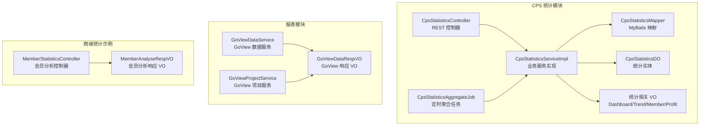
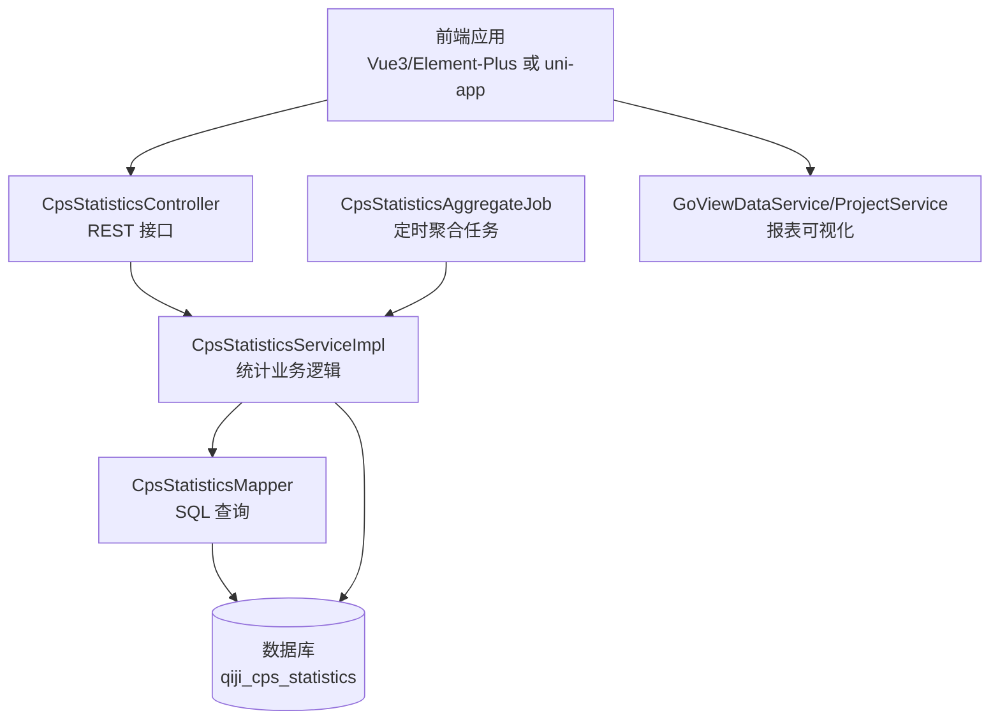
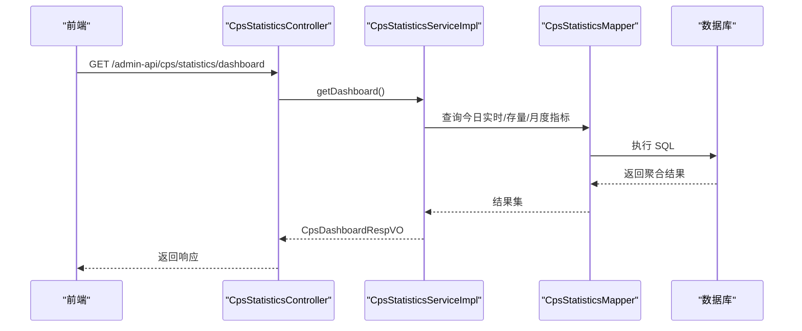
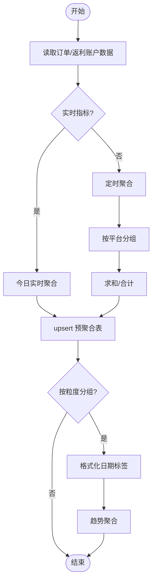
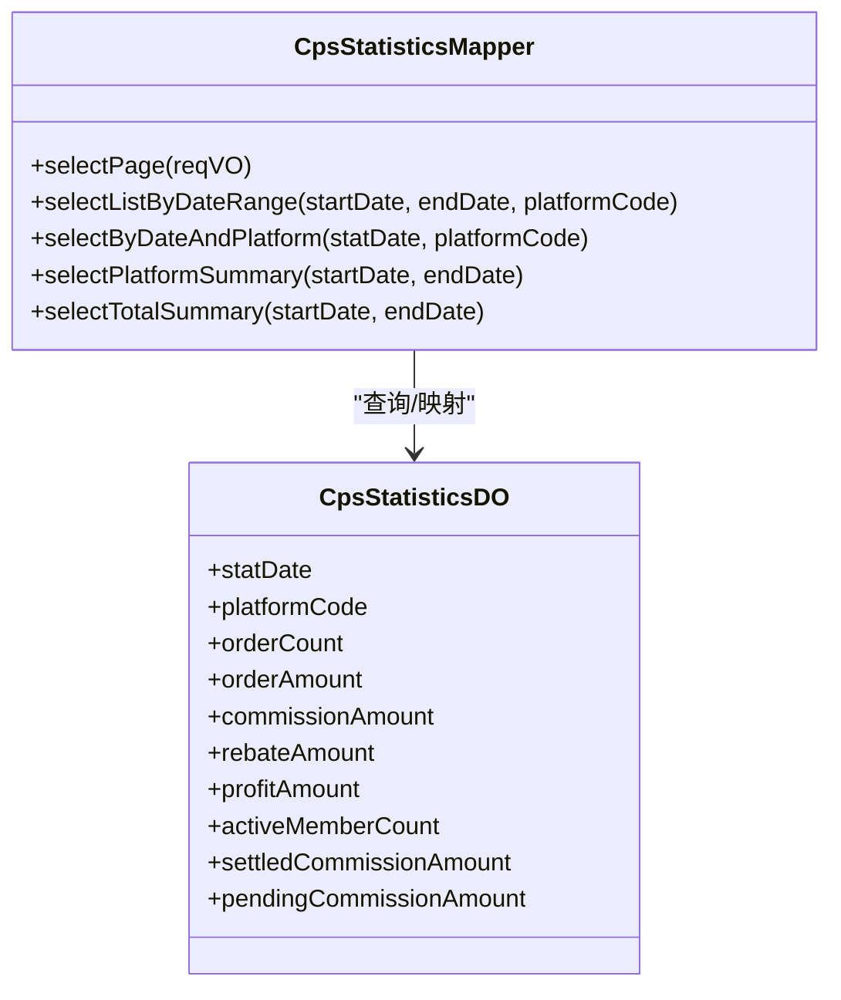
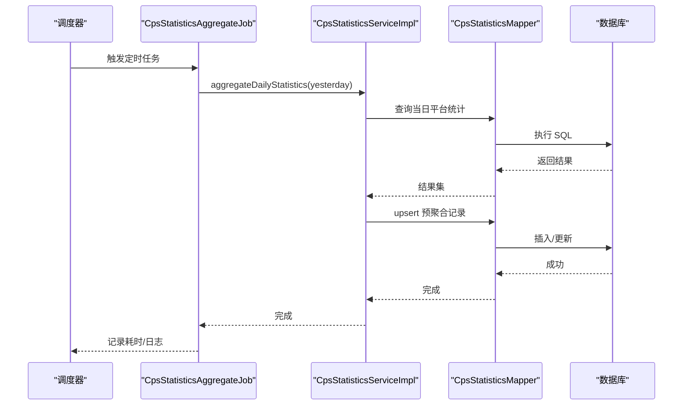
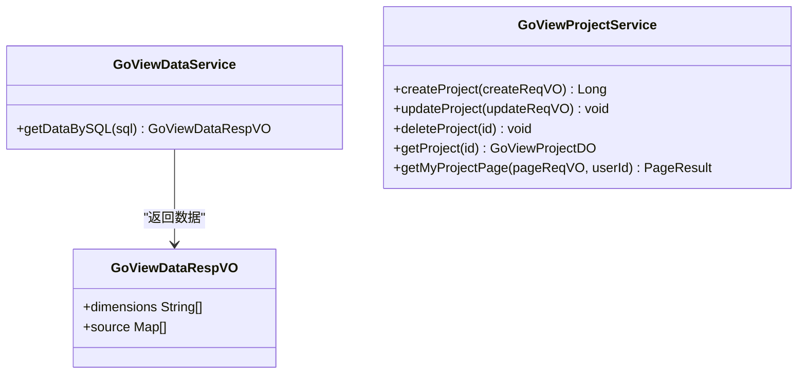
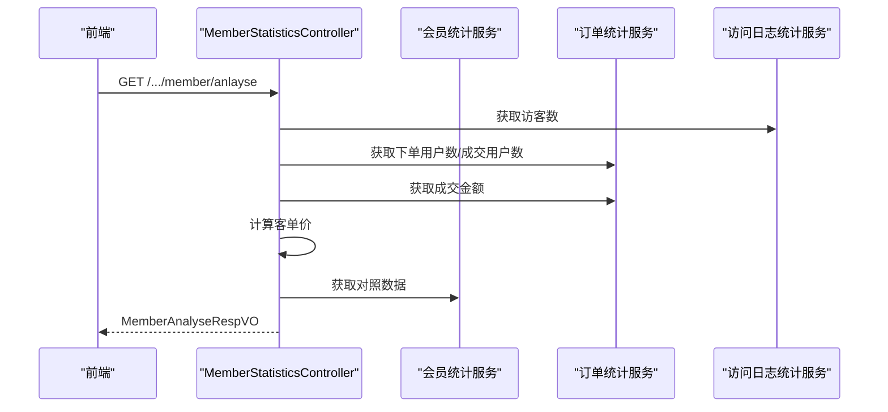
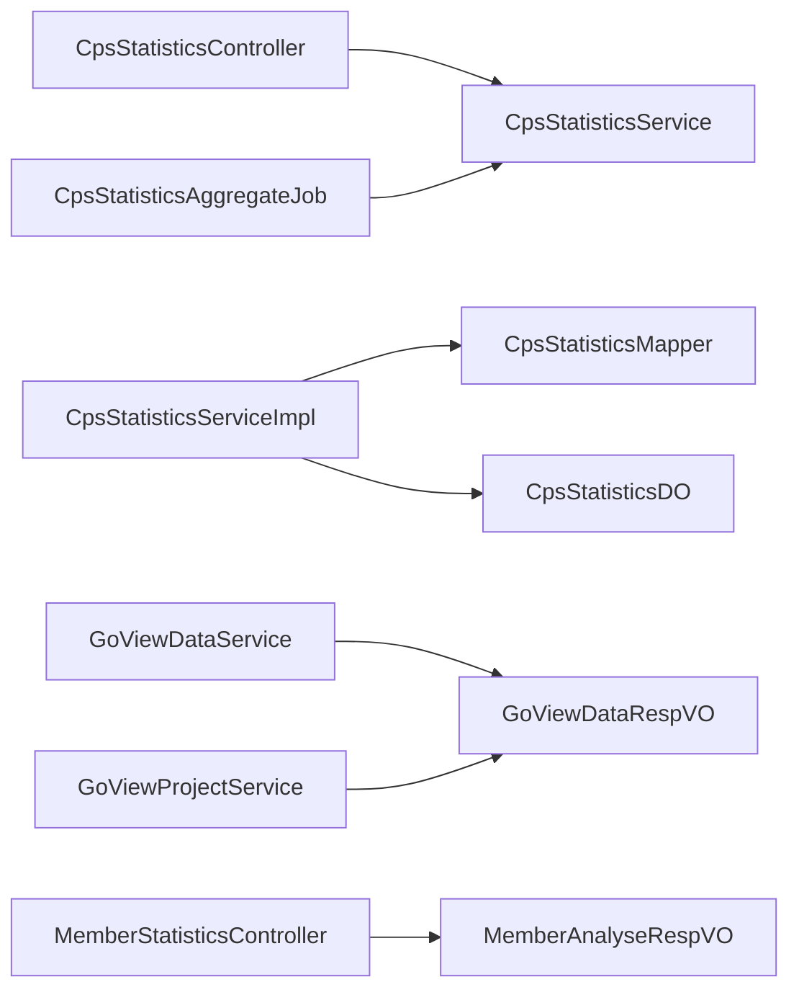

# 统计分析与报表

<cite>
**本文引用的文件**
- [CpsStatisticsController.java](file://qiji-module-cps/qiji-module-cps-biz/src/main/java/cn/zhijian/cps/controller/admin/CpsStatisticsController.java)
- [CpsStatisticsService.java](file://qiji-module-cps/qiji-module-cps-biz/src/main/java/cn/zhijian/cps/service/CpsStatisticsService.java)
- [CpsStatisticsServiceImpl.java](file://qiji-module-cps/qiji-module-cps-biz/src/main/java/cn/zhijian/cps/service/CpsStatisticsServiceImpl.java)
- [CpsStatisticsMapper.java](file://qiji-module-cps/qiji-module-cps-biz/src/main/java/cn/zhijian/cps/dal/mysql/CpsStatisticsMapper.java)
- [CpsStatisticsAggregateJob.java](file://qiji-module-cps/qiji-module-cps-biz/src/main/java/cn/zhijian/cps/job/CpsStatisticsAggregateJob.java)
- [CpsStatisticsRespVO.java](file://qiji-module-cps/qiji-module-cps-biz/src/main/java/cn/zhijian/cps/controller/admin/vo/statistics/CpsStatisticsRespVO.java)
- [CpsDashboardRespVO.java](file://qiji-module-cps/qiji-module-cps-biz/src/main/java/cn/zhijian/cps/controller/admin/vo/statistics/CpsDashboardRespVO.java)
- [CpsStatisticsTrendRespVO.java](file://qiji-module-cps/qiji-module-cps-biz/src/main/java/cn/zhijian/cps/controller/admin/vo/statistics/CpsStatisticsTrendRespVO.java)
- [CpsMemberStatisticsRespVO.java](file://qiji-module-cps/qiji-module-cps-biz/src/main/java/cn/zhijian/cps/controller/admin/vo/statistics/CpsMemberStatisticsRespVO.java)
- [CpsProfitReportRespVO.java](file://qiji-module-cps/qiji-module-cps-biz/src/main/java/cn/zhijian/cps/controller/admin/vo/statistics/CpsProfitReportRespVO.java)
- [CpsStatisticsDO.java](file://qiji-module-cps/qiji-module-cps-biz/src/main/java/cn/zhijian/cps/dal/dataobject/CpsStatisticsDO.java)
- [GoViewDataRespVO.java](file://qiji-module-report/src/main/java/com.qiji.cps/module/report/controller/admin/goview/vo/data/GoViewDataRespVO.java)
- [GoViewDataService.java](file://qiji-module-report/src/main/java/com.qiji.cps/module/report/service/goview/GoViewDataService.java)
- [GoViewProjectService.java](file://qiji-module-report/src/main/java/com.qiji.cps/module/report/service/goview/GoViewProjectService.java)
- [MemberAnalyseRespVO.java](file://qiji-module-mall/qiji-module-statistics/src/main/java/com.qiji.cps/module/statistics/controller/admin/member/vo/MemberAnalyseRespVO.java)
- [MemberStatisticsController.java](file://qiji-module-mall/qiji-module-statistics/src/main/java/com.qiji.cps/module/statistics/controller/admin/member/MemberStatisticsController.java)
- [README.md](file://README.md)
</cite>

## 目录
1. [简介](#简介)
2. [项目结构](#项目结构)
3. [核心组件](#核心组件)
4. [架构总览](#架构总览)
5. [详细组件分析](#详细组件分析)
6. [依赖关系分析](#依赖关系分析)
7. [性能考量](#性能考量)
8. [故障排查指南](#故障排查指南)
9. [结论](#结论)
10. [附录](#附录)

## 简介
本技术文档聚焦于统计分析与报表功能，围绕 CPS 系统的运营数据统计、财务数据分析、用户行为分析等核心模块，系统阐述统计数据的采集与计算机制（实时统计、定时汇总、数据聚合），各类报表的设计与实现（销售报表、利润分析、平台对比、趋势分析），以及统计数据的可视化展示方案与性能优化策略。文档旨在帮助开发者快速理解并扩展统计分析能力，构建稳定、高效、可维护的数据分析与决策支持系统。

## 项目结构
统计分析与报表功能主要分布在以下模块中：
- 统计分析核心：CPS 统计模块（控制器、服务、持久层、定时任务、VO）
- 报表与可视化：报表模块（GoView 数据与项目服务）
- 商城统计示例：会员分析示例（控制器与 VO）

**图表来源**
- [CpsStatisticsController.java:1-75](file://qiji-module-cps/qiji-module-cps-biz/src/main/java/cn/zhijian/cps/controller/admin/CpsStatisticsController.java#L1-75)
- [CpsStatisticsServiceImpl.java:1-382](file://qiji-module-cps/qiji-module-cps-biz/src/main/java/cn/zhijian/cps/service/CpsStatisticsServiceImpl.java#L1-382)
- [CpsStatisticsMapper.java:1-96](file://qiji-module-cps/qiji-module-cps-biz/src/main/java/cn/zhijian/cps/dal/mysql/CpsStatisticsMapper.java#L1-96)
- [CpsStatisticsAggregateJob.java:1-64](file://qiji-module-cps/qiji-module-cps-biz/src/main/java/cn/zhijian/cps/job/CpsStatisticsAggregateJob.java#L1-64)
- [CpsStatisticsDO.java](file://qiji-module-cps/qiji-module-cps-biz/src/main/java/cn/zhijian/cps/dal/dataobject/CpsStatisticsDO.java)
- [CpsDashboardRespVO.java](file://qiji-module-cps/qiji-module-cps-biz/src/main/java/cn/zhijian/cps/controller/admin/vo/statistics/CpsDashboardRespVO.java)
- [CpsStatisticsTrendRespVO.java](file://qiji-module-cps/qiji-module-cps-biz/src/main/java/cn/zhijian/cps/controller/admin/vo/statistics/CpsStatisticsTrendRespVO.java)
- [CpsMemberStatisticsRespVO.java](file://qiji-module-cps/qiji-module-cps-biz/src/main/java/cn/zhijian/cps/controller/admin/vo/statistics/CpsMemberStatisticsRespVO.java)
- [CpsProfitReportRespVO.java](file://qiji-module-cps/qiji-module-cps-biz/src/main/java/cn/zhijian/cps/controller/admin/vo/statistics/CpsProfitReportRespVO.java)
- [GoViewDataService.java:1-21](file://qiji-module-report/src/main/java/com.qiji.cps/module/report/service/goview/GoViewDataService.java#L1-21)
- [GoViewProjectService.java:1-58](file://qiji-module-report/src/main/java/com.qiji.cps/module/report/service/goview/GoViewProjectService.java#L1-58)
- [GoViewDataRespVO.java:1-19](file://qiji-module-report/src/main/java/com.qiji.cps/module/report/controller/admin/goview/vo/data/GoViewDataRespVO.java#L1-19)
- [MemberStatisticsController.java:55-76](file://qiji-module-mall/qiji-module-statistics/src/main/java/com.qiji.cps/module/statistics/controller/admin/member/MemberStatisticsController.java#L55-76)
- [MemberAnalyseRespVO.java:1-26](file://qiji-module-mall/qiji-module-statistics/src/main/java/com.qiji.cps/module/statistics/controller/admin/member/vo/MemberAnalyseRespVO.java#L1-26)

**章节来源**
- [README.md:15-36](file://README.md#L15-L36)

## 核心组件
- 统计控制器：提供运营看板、趋势、会员统计、收益报表等接口，负责请求参数接收与响应封装。
- 统计服务：实现运营看板实时聚合、趋势按粒度分组、会员统计、收益报表聚合、每日统计聚合等核心逻辑。
- 统计映射：提供分页、按日期范围查询、按平台分组汇总、全平台汇总等 SQL 查询能力。
- 定时任务：每日凌晨聚合前一日统计数据，写入预聚合表，支持手动补跑。
- 统计 VO：定义 Dashboard、趋势、会员、利润报表等响应结构。
- 报表服务：提供 GoView 数据查询与项目管理能力，支撑可视化展示。
- 商城统计示例：会员分析示例，演示访客、下单、成交、客单价与对照数据的组合。

**章节来源**
- [CpsStatisticsController.java:21-75](file://qiji-module-cps/qiji-module-cps-biz/src/main/java/cn/zhijian/cps/controller/admin/CpsStatisticsController.java#L21-L75)
- [CpsStatisticsService.java:10-55](file://qiji-module-cps/qiji-module-cps-biz/src/main/java/cn/zhijian/cps/service/CpsStatisticsService.java#L10-L55)
- [CpsStatisticsServiceImpl.java:21-382](file://qiji-module-cps/qiji-module-cps-biz/src/main/java/cn/zhijian/cps/service/CpsStatisticsServiceImpl.java#L21-L382)
- [CpsStatisticsMapper.java:17-96](file://qiji-module-cps/qiji-module-cps-biz/src/main/java/cn/zhijian/cps/dal/mysql/CpsStatisticsMapper.java#L17-L96)
- [CpsStatisticsAggregateJob.java:11-64](file://qiji-module-cps/qiji-module-cps-biz/src/main/java/cn/zhijian/cps/job/CpsStatisticsAggregateJob.java#L11-L64)
- [CpsDashboardRespVO.java](file://qiji-module-cps/qiji-module-cps-biz/src/main/java/cn/zhijian/cps/controller/admin/vo/statistics/CpsDashboardRespVO.java)
- [CpsStatisticsTrendRespVO.java](file://qiji-module-cps/qiji-module-cps-biz/src/main/java/cn/zhijian/cps/controller/admin/vo/statistics/CpsStatisticsTrendRespVO.java)
- [CpsMemberStatisticsRespVO.java](file://qiji-module-cps/qiji-module-cps-biz/src/main/java/cn/zhijian/cps/controller/admin/vo/statistics/CpsMemberStatisticsRespVO.java)
- [CpsProfitReportRespVO.java](file://qiji-module-cps/qiji-module-cps-biz/src/main/java/cn/zhijian/cps/controller/admin/vo/statistics/CpsProfitReportRespVO.java)
- [GoViewDataService.java:10-21](file://qiji-module-report/src/main/java/com.qiji.cps/module/report/service/goview/GoViewDataService.java#L10-L21)
- [GoViewProjectService.java:16-58](file://qiji-module-report/src/main/java/com.qiji.cps/module/report/service/goview/GoViewProjectService.java#L16-L58)
- [MemberStatisticsController.java:55-76](file://qiji-module-mall/qiji-module-statistics/src/main/java/com.qiji.cps/module/statistics/controller/admin/member/MemberStatisticsController.java#L55-76)
- [MemberAnalyseRespVO.java:1-26](file://qiji-module-mall/qiji-module-statistics/src/main/java/com.qiji.cps/module/statistics/controller/admin/member/vo/MemberAnalyseRespVO.java#L1-26)

## 架构总览
统计分析与报表的整体架构由“接口层 → 业务层 → 数据层 → 可视化层”构成，结合定时任务进行离线聚合，以提升查询性能与稳定性。

**图表来源**
- [CpsStatisticsController.java:21-75](file://qiji-module-cps/qiji-module-cps-biz/src/main/java/cn/zhijian/cps/controller/admin/CpsStatisticsController.java#L21-L75)
- [CpsStatisticsServiceImpl.java:21-382](file://qiji-module-cps/qiji-module-cps-biz/src/main/java/cn/zhijian/cps/service/CpsStatisticsServiceImpl.java#L21-L382)
- [CpsStatisticsMapper.java:17-96](file://qiji-module-cps/qiji-module-cps-biz/src/main/java/cn/zhijian/cps/dal/mysql/CpsStatisticsMapper.java#L17-L96)
- [CpsStatisticsAggregateJob.java:11-64](file://qiji-module-cps/qiji-module-cps-biz/src/main/java/cn/zhijian/cps/job/CpsStatisticsAggregateJob.java#L11-L64)
- [GoViewDataService.java:10-21](file://qiji-module-report/src/main/java/com.qiji.cps/module/report/service/goview/GoViewDataService.java#L10-L21)
- [GoViewProjectService.java:16-58](file://qiji-module-report/src/main/java/com.qiji.cps/module/report/service/goview/GoViewProjectService.java#L16-L58)

## 详细组件分析

### 统计控制器与接口
- 运营看板接口：返回今日实时订单、金额、佣金、返利、存量佣金、总利润、活跃会员数等核心指标。
- 趋势接口：按日/周/月粒度返回订单量、金额、佣金、返利、利润趋势。
- 会员统计接口：返回总会员数、今日新增、7/30日活跃、有余额会员数及 TOP10 返利会员排行。
- 收益报表接口：按平台分组展示佣金收入、返利支出、净利润、利润率，并支持日期范围与平台筛选。

**图表来源**
- [CpsStatisticsController.java:42-48](file://qiji-module-cps/qiji-module-cps-biz/src/main/java/cn/zhijian/cps/controller/admin/CpsStatisticsController.java#L42-L48)
- [CpsStatisticsServiceImpl.java:52-90](file://qiji-module-cps/qiji-module-cps-biz/src/main/java/cn/zhijian/cps/service/CpsStatisticsServiceImpl.java#L52-L90)
- [CpsStatisticsMapper.java:27-32](file://qiji-module-cps/qiji-module-cps-biz/src/main/java/cn/zhijian/cps/dal/mysql/CpsStatisticsMapper.java#L27-L32)

**章节来源**
- [CpsStatisticsController.java:42-72](file://qiji-module-cps/qiji-module-cps-biz/src/main/java/cn/zhijian/cps/controller/admin/CpsStatisticsController.java#L42-L72)

### 统计服务与计算策略
- 实时统计：从订单表实时聚合今日订单数、金额、佣金、返利等指标，保证看板数据即时性。
- 定时汇总：每日凌晨聚合前一日各平台的订单数、金额、佣金、返利、利润、活跃会员数，写入预聚合表，提升趋势与报表查询性能。
- 数据聚合：按平台分组汇总，支持“全平台”汇总记录；按日/周/月粒度格式化日期标签，进行分组聚合。
- 比率计算：统一采用固定精度的小数除法计算利润率等比率，避免除零与精度问题。
- 空值处理：对空值进行兜底为 0 或 0.00，确保前端渲染稳定。

**图表来源**
- [CpsStatisticsServiceImpl.java:92-124](file://qiji-module-cps/qiji-module-cps-biz/src/main/java/cn/zhijian/cps/service/CpsStatisticsServiceImpl.java#L92-L124)
- [CpsStatisticsServiceImpl.java:221-268](file://qiji-module-cps/qiji-module-cps-biz/src/main/java/cn/zhijian/cps/service/CpsStatisticsServiceImpl.java#L221-L268)
- [CpsStatisticsServiceImpl.java:310-324](file://qiji-module-cps/qiji-module-cps-biz/src/main/java/cn/zhijian/cps/service/CpsStatisticsServiceImpl.java#L310-L324)

**章节来源**
- [CpsStatisticsServiceImpl.java:52-90](file://qiji-module-cps/qiji-module-cps-biz/src/main/java/cn/zhijian/cps/service/CpsStatisticsServiceImpl.java#L52-L90)
- [CpsStatisticsServiceImpl.java:92-124](file://qiji-module-cps/qiji-module-cps-biz/src/main/java/cn/zhijian/cps/service/CpsStatisticsServiceImpl.java#L92-L124)
- [CpsStatisticsServiceImpl.java:126-156](file://qiji-module-cps/qiji-module-cps-biz/src/main/java/cn/zhijian/cps/service/CpsStatisticsServiceImpl.java#L126-L156)
- [CpsStatisticsServiceImpl.java:158-219](file://qiji-module-cps/qiji-module-cps-biz/src/main/java/cn/zhijian/cps/service/CpsStatisticsServiceImpl.java#L158-L219)
- [CpsStatisticsServiceImpl.java:221-268](file://qiji-module-cps/qiji-module-cps-biz/src/main/java/cn/zhijian/cps/service/CpsStatisticsServiceImpl.java#L221-L268)

### 统计映射与查询
- 分页与范围查询：支持按平台与日期范围查询统计记录，按日期倒序排列。
- 按平台分组汇总：按平台分组统计订单数、金额、佣金、返利、利润，支持过滤与排序。
- 全平台汇总：按日期范围统计全平台的订单与利润汇总。
- upsert 判定：按日期与平台唯一键查询是否存在记录，决定插入或更新。

**图表来源**
- [CpsStatisticsMapper.java:17-96](file://qiji-module-cps/qiji-module-cps-biz/src/main/java/cn/zhijian/cps/dal/mysql/CpsStatisticsMapper.java#L17-L96)
- [CpsStatisticsDO.java](file://qiji-module-cps/qiji-module-cps-biz/src/main/java/cn/zhijian/cps/dal/dataobject/CpsStatisticsDO.java)

**章节来源**
- [CpsStatisticsMapper.java:20-96](file://qiji-module-cps/qiji-module-cps-biz/src/main/java/cn/zhijian/cps/dal/mysql/CpsStatisticsMapper.java#L20-L96)

### 定时聚合任务
- 执行时机：默认每日凌晨 2:30 执行，支持通过配置项覆盖。
- 聚合内容：按平台统计订单数、金额、佣金、返利、利润、活跃会员数，并写入预聚合表。
- upsert 策略：按日期与平台唯一键进行更新或插入，支持重跑补数。
- 异常处理：捕获异常并记录错误日志，保证任务稳定性。

**图表来源**
- [CpsStatisticsAggregateJob.java:25-42](file://qiji-module-cps/qiji-module-cps-biz/src/main/java/cn/zhijian/cps/job/CpsStatisticsAggregateJob.java#L25-L42)
- [CpsStatisticsServiceImpl.java:221-268](file://qiji-module-cps/qiji-module-cps-biz/src/main/java/cn/zhijian/cps/service/CpsStatisticsServiceImpl.java#L221-L268)
- [CpsStatisticsMapper.java:34-41](file://qiji-module-cps/qiji-module-cps-biz/src/main/java/cn/zhijian/cps/dal/mysql/CpsStatisticsMapper.java#L34-L41)

**章节来源**
- [CpsStatisticsAggregateJob.java:11-64](file://qiji-module-cps/qiji-module-cps-biz/src/main/java/cn/zhijian/cps/job/CpsStatisticsAggregateJob.java#L11-L64)

### 报表与可视化
- GoView 数据服务：支持通过 SQL 查询返回 GoView 所需的维度与明细数据结构。
- GoView 项目服务：提供项目创建、更新、删除、查询等能力，支撑报表项目的生命周期管理。
- 响应结构：GoViewDataRespVO 包含维度列表与明细数据列表，便于前端可视化组件渲染。

**图表来源**
- [GoViewDataService.java:10-21](file://qiji-module-report/src/main/java/com.qiji.cps/module/report/service/goview/GoViewDataService.java#L10-L21)
- [GoViewProjectService.java:16-58](file://qiji-module-report/src/main/java/com.qiji.cps/module/report/service/goview/GoViewProjectService.java#L16-L58)
- [GoViewDataRespVO.java:11-19](file://qiji-module-report/src/main/java/com.qiji.cps/module/report/controller/admin/goview/vo/data/GoViewDataRespVO.java#L11-L19)

**章节来源**
- [GoViewDataService.java:10-21](file://qiji-module-report/src/main/java/com.qiji.cps/module/report/service/goview/GoViewDataService.java#L10-L21)
- [GoViewProjectService.java:16-58](file://qiji-module-report/src/main/java/com.qiji.cps/module/report/service/goview/GoViewProjectService.java#L16-L58)
- [GoViewDataRespVO.java:11-19](file://qiji-module-report/src/main/java/com.qiji.cps/module/report/controller/admin/goview/vo/data/GoViewDataRespVO.java#L11-L19)

### 商城统计示例（会员分析）
- 会员分析控制器：组合访客数、下单用户数、成交用户数、客单价与对照数据，形成完整的会员分析视图。
- 响应 VO：包含访客数量、下单用户数量、成交用户数量、客单价与对照数据结构。

**图表来源**
- [MemberStatisticsController.java:55-76](file://qiji-module-mall/qiji-module-statistics/src/main/java/com.qiji.cps/module/statistics/controller/admin/member/MemberStatisticsController.java#L55-76)
- [MemberAnalyseRespVO.java:9-26](file://qiji-module-mall/qiji-module-statistics/src/main/java/com.qiji.cps/module/statistics/controller/admin/member/vo/MemberAnalyseRespVO.java#L9-L26)

**章节来源**
- [MemberStatisticsController.java:55-76](file://qiji-module-mall/qiji-module-statistics/src/main/java/com.qiji.cps/module/statistics/controller/admin/member/MemberStatisticsController.java#L55-76)
- [MemberAnalyseRespVO.java:1-26](file://qiji-module-mall/qiji-module-statistics/src/main/java/com.qiji.cps/module/statistics/controller/admin/member/vo/MemberAnalyseRespVO.java#L1-26)

## 依赖关系分析
- 控制器依赖服务接口，服务实现依赖映射与实体，定时任务依赖服务接口。
- 报表服务独立于统计服务，通过 SQL 查询与 GoView 响应结构对接前端可视化组件。
- 商城统计示例与 CPS 统计模块解耦，体现“多模块共享统计能力”的架构思想。

**图表来源**
- [CpsStatisticsController.java:21-75](file://qiji-module-cps/qiji-module-cps-biz/src/main/java/cn/zhijian/cps/controller/admin/CpsStatisticsController.java#L21-L75)
- [CpsStatisticsService.java:10-55](file://qiji-module-cps/qiji-module-cps-biz/src/main/java/cn/zhijian/cps/service/CpsStatisticsService.java#L10-L55)
- [CpsStatisticsServiceImpl.java:21-382](file://qiji-module-cps/qiji-module-cps-biz/src/main/java/cn/zhijian/cps/service/CpsStatisticsServiceImpl.java#L21-L382)
- [CpsStatisticsMapper.java:17-96](file://qiji-module-cps/qiji-module-cps-biz/src/main/java/cn/zhijian/cps/dal/mysql/CpsStatisticsMapper.java#L17-L96)
- [CpsStatisticsAggregateJob.java:11-64](file://qiji-module-cps/qiji-module-cps-biz/src/main/java/cn/zhijian/cps/job/CpsStatisticsAggregateJob.java#L11-L64)
- [GoViewDataService.java:10-21](file://qiji-module-report/src/main/java/com.qiji.cps/module/report/service/goview/GoViewDataService.java#L10-L21)
- [GoViewProjectService.java:16-58](file://qiji-module-report/src/main/java/com.qiji.cps/module/report/service/goview/GoViewProjectService.java#L16-L58)
- [MemberStatisticsController.java:55-76](file://qiji-module-mall/qiji-module-statistics/src/main/java/com.qiji.cps/module/statistics/controller/admin/member/MemberStatisticsController.java#L55-76)

**章节来源**
- [CpsStatisticsController.java:21-75](file://qiji-module-cps/qiji-module-cps-biz/src/main/java/cn/zhijian/cps/controller/admin/CpsStatisticsController.java#L21-L75)
- [CpsStatisticsService.java:10-55](file://qiji-module-cps/qiji-module-cps-biz/src/main/java/cn/zhijian/cps/service/CpsStatisticsService.java#L10-L55)
- [CpsStatisticsServiceImpl.java:21-382](file://qiji-module-cps/qiji-module-cps-biz/src/main/java/cn/zhijian/cps/service/CpsStatisticsServiceImpl.java#L21-L382)
- [CpsStatisticsMapper.java:17-96](file://qiji-module-cps/qiji-module-cps-biz/src/main/java/cn/zhijian/cps/dal/mysql/CpsStatisticsMapper.java#L17-L96)
- [CpsStatisticsAggregateJob.java:11-64](file://qiji-module-cps/qiji-module-cps-biz/src/main/java/cn/zhijian/cps/job/CpsStatisticsAggregateJob.java#L11-L64)
- [GoViewDataService.java:10-21](file://qiji-module-report/src/main/java/com.qiji.cps/module/report/service/goview/GoViewDataService.java#L10-L21)
- [GoViewProjectService.java:16-58](file://qiji-module-report/src/main/java/com.qiji.cps/module/report/service/goview/GoViewProjectService.java#L16-L58)
- [MemberStatisticsController.java:55-76](file://qiji-module-mall/qiji-module-statistics/src/main/java/com.qiji.cps/module/statistics/controller/admin/member/MemberStatisticsController.java#L55-76)

## 性能考量
- 预聚合表：将高频查询的数据预先按日/周/月聚合到 qiji_cps_statistics 表，显著降低趋势与报表查询的计算成本。
- upsert 策略：按日期与平台唯一键进行更新或插入，避免重复计算，支持重跑补数。
- 粒度分组：在服务层按日/周/月格式化日期标签并进行分组聚合，减少前端复杂处理。
- 空值与精度：统一空值兜底与小数除法精度，避免查询与渲染异常。
- 定时任务：在业务低峰期执行聚合任务，减少对在线业务的影响。

[本节为通用性能建议，不直接分析具体文件]

## 故障排查指南
- 看板指标为空：检查订单表与返利账户表的实时聚合查询是否正常，确认空值兜底逻辑生效。
- 趋势数据缺失：确认定时聚合任务是否成功执行，检查预聚合表中对应日期与平台的数据是否存在。
- 比率计算异常：确认分母非零判断与精度设置，避免除零与精度丢失。
- 定时任务失败：查看任务日志中的异常堆栈，定位 SQL 执行或 upsert 逻辑问题。
- 手动补跑：通过定时任务的手动触发方法补跑指定日期的统计聚合，验证数据修复效果。

**章节来源**
- [CpsStatisticsServiceImpl.java:351-382](file://qiji-module-cps/qiji-module-cps-biz/src/main/java/cn/zhijian/cps/service/CpsStatisticsServiceImpl.java#L351-L382)
- [CpsStatisticsAggregateJob.java:49-64](file://qiji-module-cps/qiji-module-cps-biz/src/main/java/cn/zhijian/cps/job/CpsStatisticsAggregateJob.java#L49-L64)

## 结论
本统计分析与报表体系通过“实时统计 + 定时聚合 + 预聚合表 + 可视化服务”的组合，实现了运营看板、趋势分析、会员统计与收益报表的高效支撑。服务层统一处理空值、精度与分组聚合，定时任务保障数据完整性与一致性，报表服务为前端可视化提供标准化数据结构。该架构具备良好的扩展性与可维护性，适合在多模块场景下复用与演进。

[本节为总结性内容，不直接分析具体文件]

## 附录
- 常用报表模板
  - 销售报表：订单数、订单金额、订单均价、转化率等。
  - 利润分析：佣金收入、返利支出、净利润、利润率。
  - 平台对比：按平台分组的订单、金额、利润对比。
  - 趋势分析：日/周/月粒度的趋势变化与同比环比。
- 可视化建议
  - 图表组件：折线图（趋势）、柱状图（对比）、饼图（占比）、卡片（关键指标）。
  - 数据格式化：金额统一货币格式、百分比保留两位小数、日期标签本地化。
  - 交互体验：支持时间范围切换、平台筛选、导出 Excel、钻取到明细。

[本节为通用实践建议，不直接分析具体文件]