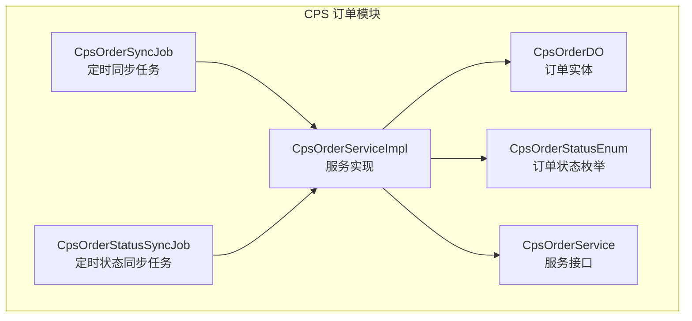
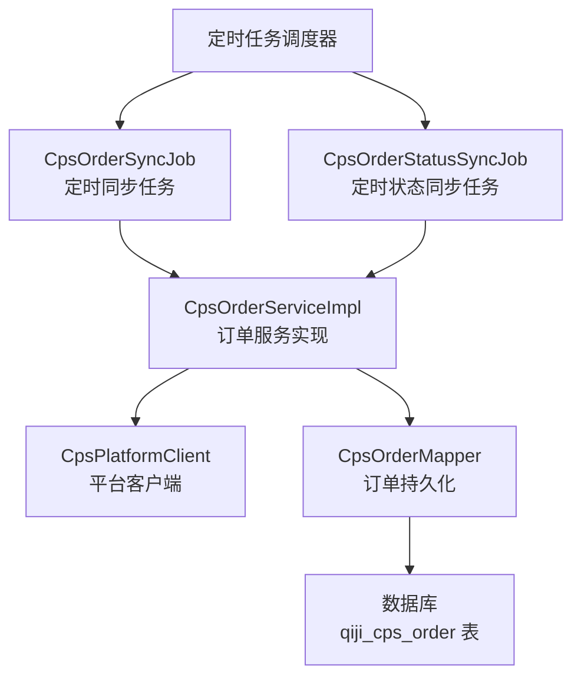
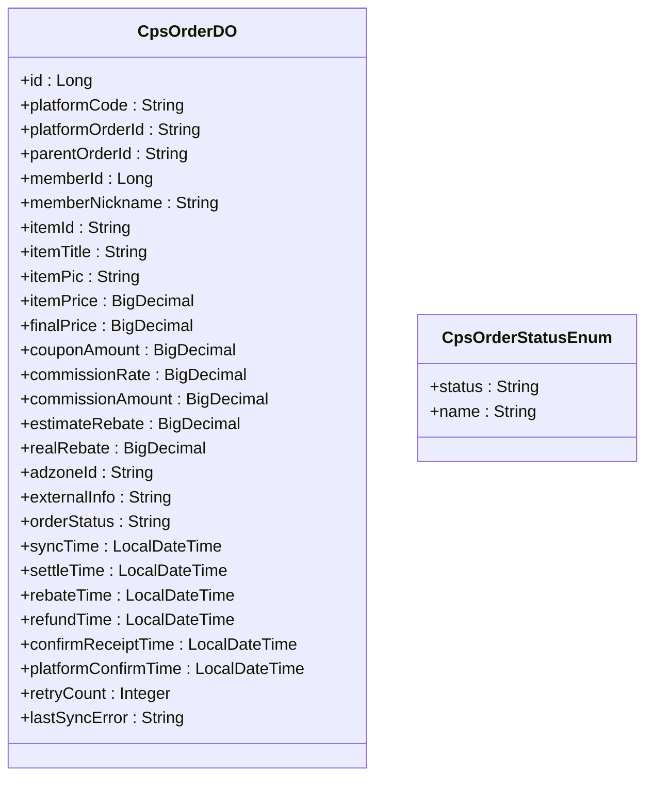
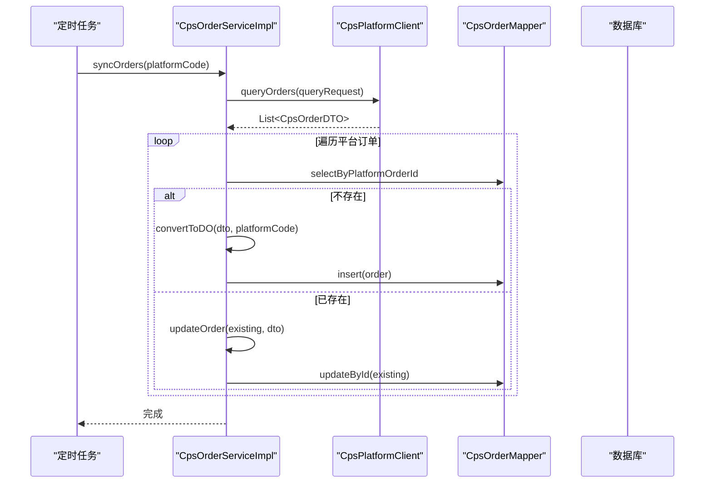
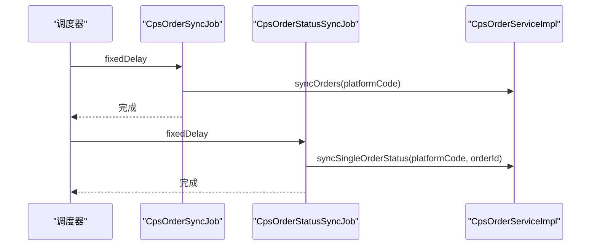
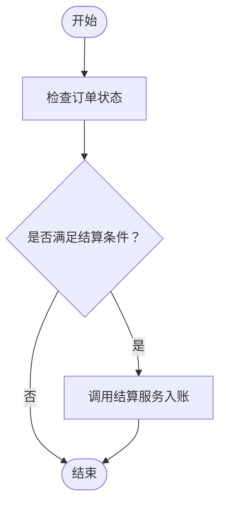
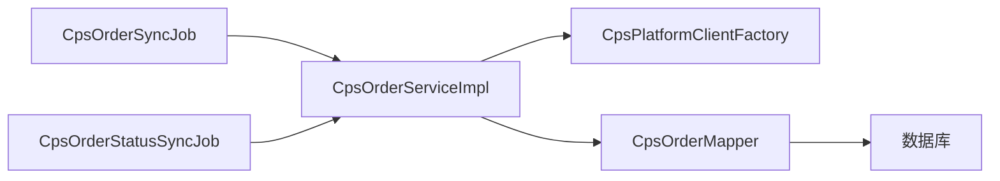

# 订单管理与追踪

<cite>
**本文引用的文件**
- [CpsOrderDO.java](file://qiji-module-cps/qiji-module-cps-biz/src/main/java/cn/zhijian/cps/dal/dataobject/CpsOrderDO.java)
- [CpsOrderStatusEnum.java](file://qiji-module-cps/qiji-module-cps-biz/src/main/java/cn/zhijian/cps/enums/CpsOrderStatusEnum.java)
- [CpsOrderService.java](file://qiji-module-cps/qiji-module-cps-biz/src/main/java/cn/zhijian/cps/service/CpsOrderService.java)
- [CpsOrderServiceImpl.java](file://qiji-module-cps/qiji-module-cps-biz/src/main/java/cn/zhijian/cps/service/CpsOrderServiceImpl.java)
- [CpsOrderSyncJob.java](file://qiji-module-cps/qiji-module-cps-biz/src/main/java/cn/zhijian/cps/job/CpsOrderSyncJob.java)
- [CpsOrderStatusSyncJob.java](file://qiji-module-cps/qiji-module-cps-biz/src/main/java/cn/zhijian/cps/job/CpsOrderStatusSyncJob.java)
</cite>

## 目录
1. [简介](#简介)
2. [项目结构](#项目结构)
3. [核心组件](#核心组件)
4. [架构总览](#架构总览)
5. [详细组件分析](#详细组件分析)
6. [依赖分析](#依赖分析)
7. [性能考虑](#性能考虑)
8. [故障排查指南](#故障排查指南)
9. [结论](#结论)
10. [附录](#附录)

## 简介
本技术文档围绕订单管理与追踪功能展开，聚焦于CPS订单全生命周期管理的实现架构，涵盖订单状态流转、订单同步机制、异常处理策略、定时任务调度、数据一致性保障以及性能优化建议。文档以CPS模块为核心，结合订单实体、服务层、定时任务与配置项，系统性阐述从订单创建、状态更新到结算入账的完整流程。

## 项目结构
CPS订单相关代码主要位于 qiji-module-cps/qiji-module-cps-biz 模块中，采用按职责分层的组织方式：
- dal：数据访问对象与数据库映射
- service：业务服务接口与实现
- job：定时任务
- enums：领域枚举
- client：第三方平台客户端抽象与实现
- config：配置类
- mcp：多模态提示词与资源
- controller：对外接口（此处不展开）

下图展示与订单管理直接相关的模块与文件关系：

图表来源
- [CpsOrderDO.java:1-80](file://qiji-module-cps/qiji-module-cps-biz/src/main/java/cn/zhijian/cps/dal/dataobject/CpsOrderDO.java#L1-L80)
- [CpsOrderStatusEnum.java:1-31](file://qiji-module-cps/qiji-module-cps-biz/src/main/java/cn/zhijian/cps/enums/CpsOrderStatusEnum.java#L1-L31)
- [CpsOrderService.java:1-23](file://qiji-module-cps/qiji-module-cps-biz/src/main/java/cn/zhijian/cps/service/CpsOrderService.java#L1-L23)
- [CpsOrderServiceImpl.java:1-235](file://qiji-module-cps/qiji-module-cps-biz/src/main/java/cn/zhijian/cps/service/CpsOrderServiceImpl.java#L1-L235)
- [CpsOrderSyncJob.java:1-67](file://qiji-module-cps/qiji-module-cps-biz/src/main/java/cn/zhijian/cps/job/CpsOrderSyncJob.java#L1-L67)
- [CpsOrderStatusSyncJob.java:1-110](file://qiji-module-cps/qiji-module-cps-biz/src/main/java/cn/zhijian/cps/job/CpsOrderStatusSyncJob.java#L1-L110)

章节来源
- [CpsOrderDO.java:1-80](file://qiji-module-cps/qiji-module-cps-biz/src/main/java/cn/zhijian/cps/dal/dataobject/CpsOrderDO.java#L1-L80)
- [CpsOrderStatusEnum.java:1-31](file://qiji-module-cps/qiji-module-cps-biz/src/main/java/cn/zhijian/cps/enums/CpsOrderStatusEnum.java#L1-L31)
- [CpsOrderService.java:1-23](file://qiji-module-cps/qiji-module-cps-biz/src/main/java/cn/zhijian/cps/service/CpsOrderService.java#L1-L23)
- [CpsOrderServiceImpl.java:1-235](file://qiji-module-cps/qiji-module-cps-biz/src/main/java/cn/zhijian/cps/service/CpsOrderServiceImpl.java#L1-L235)
- [CpsOrderSyncJob.java:1-67](file://qiji-module-cps/qiji-module-cps-biz/src/main/java/cn/zhijian/cps/job/CpsOrderSyncJob.java#L1-L67)
- [CpsOrderStatusSyncJob.java:1-110](file://qiji-module-cps/qiji-module-cps-biz/src/main/java/cn/zhijian/cps/job/CpsOrderStatusSyncJob.java#L1-L110)

## 核心组件
- 订单实体：封装订单基础信息、价格、佣金、推广位、外部追踪参数、状态与时间戳等字段，支持分页查询与持久化。
- 订单状态枚举：定义订单生命周期关键状态，如已下单、已付款、已收货、已结算、已到账、已退款、已失效。
- 订单服务接口与实现：负责订单分页查询、批量同步、单笔状态同步、归因处理与幂等写入。
- 定时任务：周期性拉取平台订单并增量更新；周期性对近期订单进行状态回查与结算判断。

章节来源
- [CpsOrderDO.java:12-79](file://qiji-module-cps/qiji-module-cps-biz/src/main/java/cn/zhijian/cps/dal/dataobject/CpsOrderDO.java#L12-L79)
- [CpsOrderStatusEnum.java:11-19](file://qiji-module-cps/qiji-module-cps-biz/src/main/java/cn/zhijian/cps/enums/CpsOrderStatusEnum.java#L11-L19)
- [CpsOrderService.java:10-22](file://qiji-module-cps/qiji-module-cps-biz/src/main/java/cn/zhijian/cps/service/CpsOrderService.java#L10-L22)
- [CpsOrderServiceImpl.java:43-147](file://qiji-module-cps/qiji-module-cps-biz/src/main/java/cn/zhijian/cps/service/CpsOrderServiceImpl.java#L43-L147)

## 架构总览
下图展示订单管理与追踪的整体架构：定时任务驱动同步，服务层对接第三方平台客户端，持久化层承载订单数据，状态同步任务负责回查与结算。

图表来源
- [CpsOrderSyncJob.java:31-64](file://qiji-module-cps/qiji-module-cps-biz/src/main/java/cn/zhijian/cps/job/CpsOrderSyncJob.java#L31-L64)
- [CpsOrderStatusSyncJob.java:40-92](file://qiji-module-cps/qiji-module-cps-biz/src/main/java/cn/zhijian/cps/job/CpsOrderStatusSyncJob.java#L40-L92)
- [CpsOrderServiceImpl.java:58-147](file://qiji-module-cps/qiji-module-cps-biz/src/main/java/cn/zhijian/cps/service/CpsOrderServiceImpl.java#L58-L147)
- [CpsOrderDO.java:15-79](file://qiji-module-cps/qiji-module-cps-biz/src/main/java/cn/zhijian/cps/dal/dataobject/CpsOrderDO.java#L15-L79)

## 详细组件分析

### 订单实体与状态模型
- 实体字段覆盖平台编码、平台订单号、父订单号、会员信息、商品信息、价格与券后价、佣金与返利、推广位、外部追踪参数、订单状态与多个关键时间点、重试计数与错误信息等。
- 状态枚举定义了订单生命周期的关键节点，便于在服务层与定时任务中进行状态判断与流转控制。

图表来源
- [CpsOrderDO.java:22-79](file://qiji-module-cps/qiji-module-cps-biz/src/main/java/cn/zhijian/cps/dal/dataobject/CpsOrderDO.java#L22-L79)
- [CpsOrderStatusEnum.java:11-29](file://qiji-module-cps/qiji-module-cps-biz/src/main/java/cn/zhijian/cps/enums/CpsOrderStatusEnum.java#L11-L29)

章节来源
- [CpsOrderDO.java:12-79](file://qiji-module-cps/qiji-module-cps-biz/src/main/java/cn/zhijian/cps/dal/dataobject/CpsOrderDO.java#L12-L79)
- [CpsOrderStatusEnum.java:11-29](file://qiji-module-cps/qiji-module-cps-biz/src/main/java/cn/zhijian/cps/enums/CpsOrderStatusEnum.java#L11-L29)

### 订单服务：创建、更新与一致性
- 分页查询：通过分页请求对象获取订单列表，支持排序与筛选。
- 批量同步：按配置的时间窗口与分页大小从平台拉取订单，逐条进行幂等写入与归因处理；新增与更新均保留关键归因信息，避免覆盖。
- 单笔状态同步：根据平台订单号精确查询并更新本地订单状态，清除上次同步错误信息。
- 事务与幂等：使用事务确保批量写入的一致性；通过“按平台订单号去重”实现幂等，避免重复写入。

图表来源
- [CpsOrderServiceImpl.java:58-147](file://qiji-module-cps/qiji-module-cps-biz/src/main/java/cn/zhijian/cps/service/CpsOrderServiceImpl.java#L58-L147)

章节来源
- [CpsOrderService.java:10-22](file://qiji-module-cps/qiji-module-cps-biz/src/main/java/cn/zhijian/cps/service/CpsOrderService.java#L10-L22)
- [CpsOrderServiceImpl.java:43-147](file://qiji-module-cps/qiji-module-cps-biz/src/main/java/cn/zhijian/cps/service/CpsOrderServiceImpl.java#L43-L147)

### 定时任务：批量同步与状态回查
- 订单批量同步任务：周期性遍历所有平台，按配置的固定延迟执行；平台间可设置间隔以规避限流。
- 订单状态同步任务：周期性查询近7天内已同步但未结算的订单，逐一回查状态并触发结算逻辑。

图表来源
- [CpsOrderSyncJob.java:31-64](file://qiji-module-cps/qiji-module-cps-biz/src/main/java/cn/zhijian/cps/job/CpsOrderSyncJob.java#L31-L64)
- [CpsOrderStatusSyncJob.java:40-92](file://qiji-module-cps/qiji-module-cps-biz/src/main/java/cn/zhijian/cps/job/CpsOrderStatusSyncJob.java#L40-L92)

章节来源
- [CpsOrderSyncJob.java:27-64](file://qiji-module-cps/qiji-module-cps-biz/src/main/java/cn/zhijian/cps/job/CpsOrderSyncJob.java#L27-L64)
- [CpsOrderStatusSyncJob.java:36-92](file://qiji-module-cps/qiji-module-cps-biz/src/main/java/cn/zhijian/cps/job/CpsOrderStatusSyncJob.java#L36-L92)

### 状态流转与结算判定
- 状态枚举定义了从下单到结算、退款、失效的完整链路。
- 状态同步任务在回查时，依据“已确认收货且未入账返利”或“平台已结算但未入账返利”的条件触发结算。

图表来源
- [CpsOrderStatusEnum.java:11-19](file://qiji-module-cps/qiji-module-cps-biz/src/main/java/cn/zhijian/cps/enums/CpsOrderStatusEnum.java#L11-L19)
- [CpsOrderStatusSyncJob.java:94-107](file://qiji-module-cps/qiji-module-cps-biz/src/main/java/cn/zhijian/cps/job/CpsOrderStatusSyncJob.java#L94-L107)

章节来源
- [CpsOrderStatusEnum.java:11-19](file://qiji-module-cps/qiji-module-cps-biz/src/main/java/cn/zhijian/cps/enums/CpsOrderStatusEnum.java#L11-L19)
- [CpsOrderStatusSyncJob.java:94-107](file://qiji-module-cps/qiji-module-cps-biz/src/main/java/cn/zhijian/cps/job/CpsOrderStatusSyncJob.java#L94-L107)

## 依赖分析
- 组件耦合：服务实现依赖平台客户端工厂、持久化映射与配置；定时任务依赖服务接口。
- 外部依赖：第三方平台客户端接口抽象，具体实现由工厂按平台编码选择。
- 循环依赖：当前结构未见循环依赖，职责清晰。

图表来源
- [CpsOrderSyncJob.java:21-25](file://qiji-module-cps/qiji-module-cps-biz/src/main/java/cn/zhijian/cps/job/CpsOrderSyncJob.java#L21-L25)
- [CpsOrderStatusSyncJob.java:24-34](file://qiji-module-cps/qiji-module-cps-biz/src/main/java/cn/zhijian/cps/job/CpsOrderStatusSyncJob.java#L24-L34)
- [CpsOrderServiceImpl.java:31-41](file://qiji-module-cps/qiji-module-cps-biz/src/main/java/cn/zhijian/cps/service/CpsOrderServiceImpl.java#L31-L41)

章节来源
- [CpsOrderServiceImpl.java:31-41](file://qiji-module-cps/qiji-module-cps-biz/src/main/java/cn/zhijian/cps/service/CpsOrderServiceImpl.java#L31-L41)
- [CpsOrderSyncJob.java:21-25](file://qiji-module-cps/qiji-module-cps-biz/src/main/java/cn/zhijian/cps/job/CpsOrderSyncJob.java#L21-L25)
- [CpsOrderStatusSyncJob.java:24-34](file://qiji-module-cps/qiji-module-cps-biz/src/main/java/cn/zhijian/cps/job/CpsOrderStatusSyncJob.java#L24-L34)

## 性能考虑
- 分页与限流：批量同步采用分页拉取与平台请求间隔，降低平台限流风险与瞬时压力。
- 增量更新：状态同步任务仅针对近期已同步订单回查，减少无效IO。
- 幂等写入：按平台订单号去重，避免重复写入与状态抖动。
- 事务边界：批量写入置于事务中，确保一致性与可回滚。
- 索引建议：基于平台订单号、同步时间、状态等常用查询字段建立索引，提升查询与回查效率（具体索引需结合实际SQL与访问模式设计）。
- 缓存策略：对热点平台配置与状态枚举可做缓存，减少重复解析成本（概念性建议，非现有实现）。

## 故障排查指南
- 同步失败日志：批量同步与单笔状态同步均记录错误日志，定位平台接口异常、网络超时或参数问题。
- 错误清理：成功更新订单后清除上次同步错误信息，便于后续排查。
- 重试策略：当前实现未内置自动重试，可在异常捕获处增加指数退避与最大重试次数控制（概念性建议，非现有实现）。
- 平台限流：启用平台请求间隔，避免触发平台限流导致失败率上升。

章节来源
- [CpsOrderServiceImpl.java:143-146](file://qiji-module-cps/qiji-module-cps-biz/src/main/java/cn/zhijian/cps/service/CpsOrderServiceImpl.java#L143-L146)
- [CpsOrderServiceImpl.java:228-232](file://qiji-module-cps/qiji-module-cps-biz/src/main/java/cn/zhijian/cps/service/CpsOrderServiceImpl.java#L228-L232)
- [CpsOrderServiceImpl.java:193-194](file://qiji-module-cps/qiji-module-cps-biz/src/main/java/cn/zhijian/cps/service/CpsOrderServiceImpl.java#L193-L194)

## 结论
该订单管理与追踪体系以清晰的分层与职责划分实现了CPS订单的全生命周期管理：通过定时任务驱动的批量同步与状态回查，结合幂等写入与事务保障，有效提升了数据一致性与稳定性。配合状态枚举与结算判定逻辑，能够准确识别并完成返利入账。建议在现有基础上进一步完善重试与限流策略、索引优化与监控告警，持续提升系统的可靠性与性能。

## 附录
- 订单表结构要点：包含平台标识、订单号、会员与商品信息、价格与返利、推广位、外部追踪参数、状态与多时间戳、重试与错误信息等字段。
- 状态枚举：已下单、已付款、已收货、已结算、已到账、已退款、已失效，支撑状态流转与结算判定。
- 定时任务配置：可通过固定延迟参数调整同步频率；平台间间隔可按需开启以规避限流。