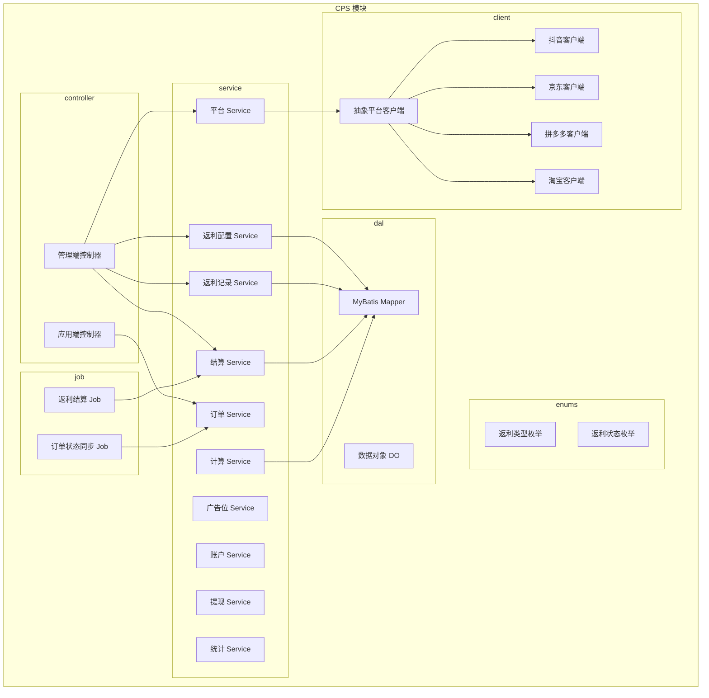
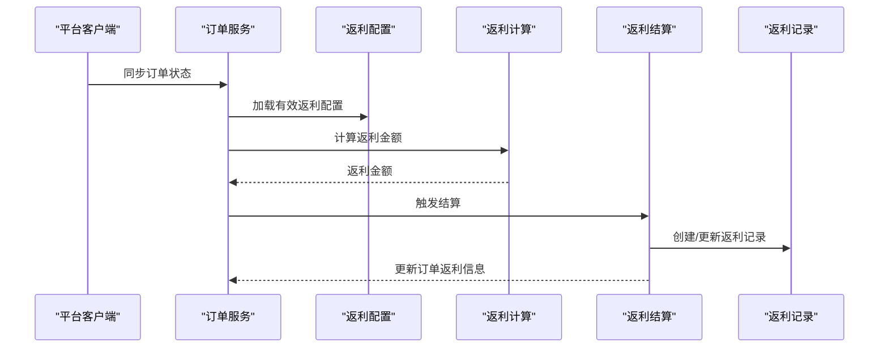
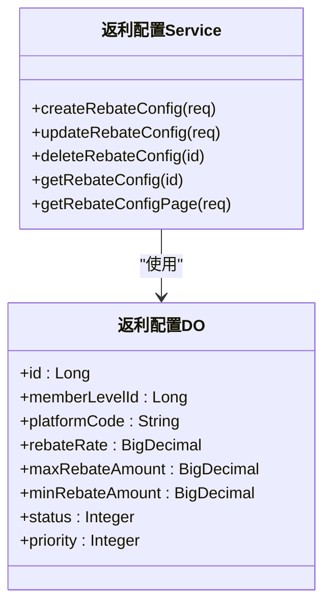
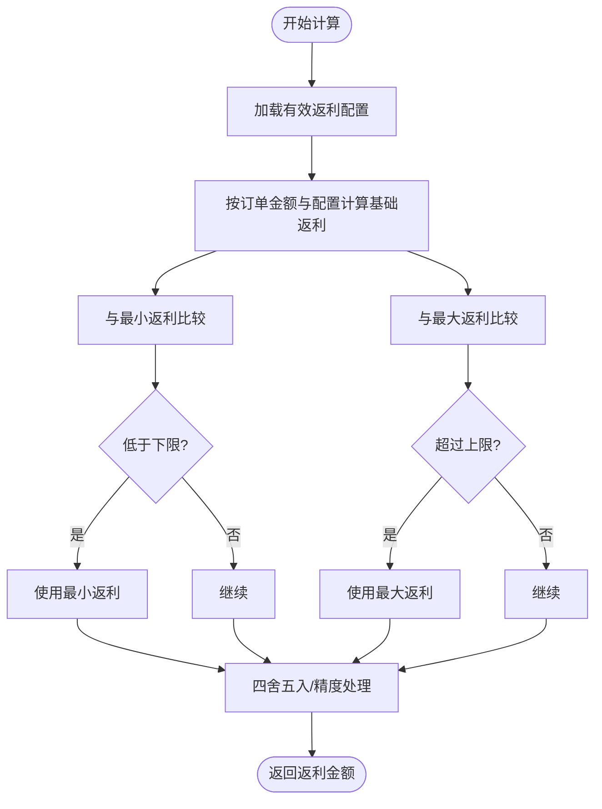
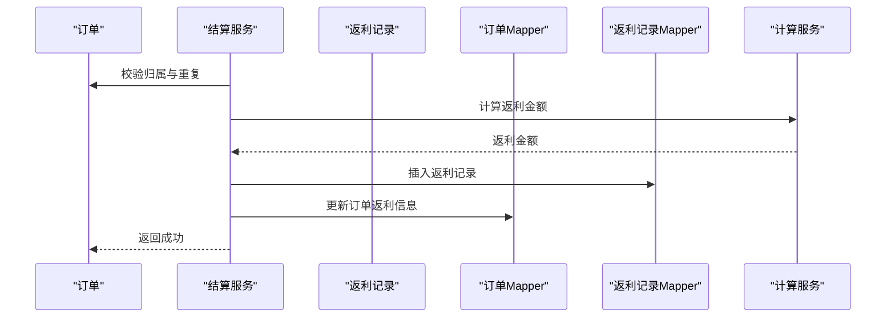
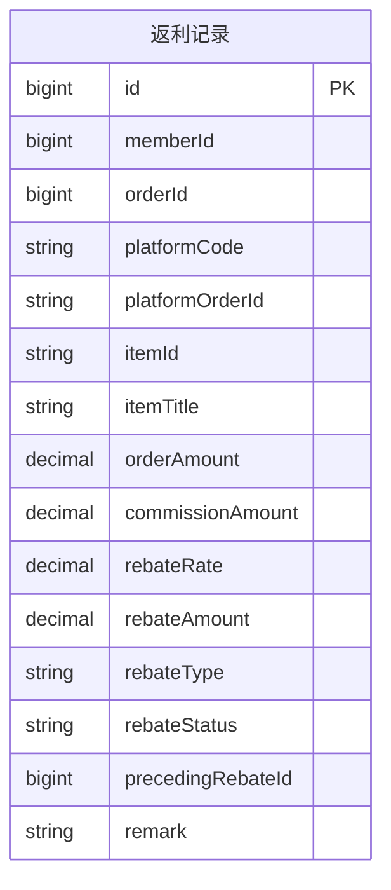
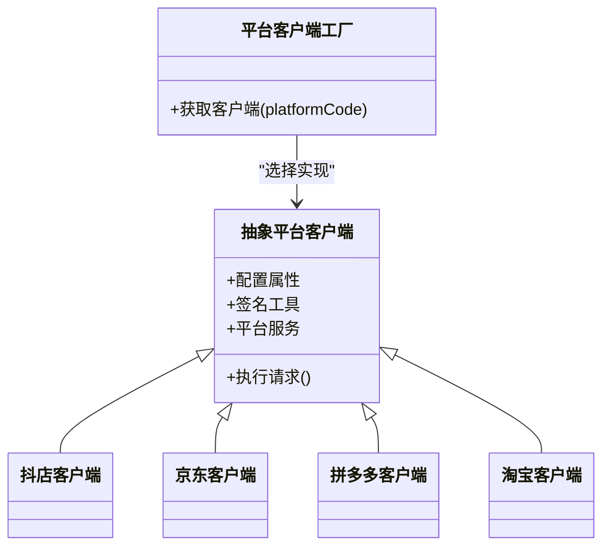
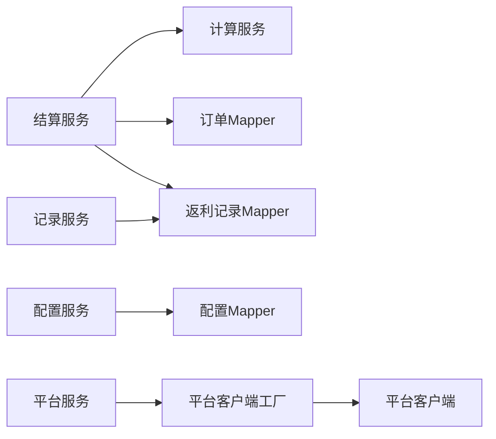

# 返利配置与结算

<cite>
**本文引用的文件**
- [CpsRebateConfigService.java](file://yudao-module-cps/yudao-module-cps-biz/src/main/java/cn/zhijian/cps/service/CpsRebateConfigService.java)
- [CpsRebateConfigServiceImpl.java](file://yudao-module-cps/yudao-module-cps-biz/src/main/java/cn/zhijian/cps/service/CpsRebateConfigServiceImpl.java)
- [CpsRebateRecordService.java](file://yudao-module-cps/yudao-module-cps-biz/src/main/java/cn/zhijian/cps/service/CpsRebateRecordService.java)
- [CpsRebateRecordServiceImpl.java](file://yudao-module-cps/yudao-module-cps-biz/src/main/java/cn/zhijian/cps/service/CpsRebateRecordServiceImpl.java)
- [CpsRebateSettleService.java](file://yudao-module-cps/yudao-module-cps-biz/src/main/java/cn/zhijian/cps/service/commission/CpsRebateSettleService.java)
- [CpsRebateSettleServiceImpl.java](file://yudao-module-cps/yudao-module-cps-biz/src/main/java/cn/zhijian/cps/service/commission/CpsRebateSettleServiceImpl.java)
- [CpsCommissionCalcService.java](file://yudao-module-cps/yudao-module-cps-biz/src/main/java/cn/zhijian/cps/service/commission/CpsCommissionCalcService.java)
- [CpsRebateConfigDO.java](file://yudao-module-cps/yudao-module-cps-biz/src/main/java/cn/zhijian/cps/dal/dataobject/CpsRebateConfigDO.java)
- [CpsRebateRecordDO.java](file://yudao-module-cps/yudao-module-cps-biz/src/main/java/cn/zhijian/cps/dal/dataobject/CpsRebateRecordDO.java)
- [CpsRebateTypeEnum.java](file://yudao-module-cps/yudao-module-cps-biz/src/main/java/cn/zhijian/cps/enums/CpsRebateTypeEnum.java)
- [CpsRebateStatusEnum.java](file://yudao-module-cps/yudao-module-cps-biz/src/main/java/cn/zhijian/cps/enums/CpsRebateStatusEnum.java)
- [CpsOrderDO.java](file://yudao-module-cps/yudao-module-cps-biz/src/main/java/cn/zhijian/cps/dal/dataobject/CpsOrderDO.java)
- [CpsOrderMapper.java](file://yudao-module-cps/yudao-module-cps-biz/src/main/java/cn/zhijian/cps/dal/mysql/CpsOrderMapper.java)
- [CpsRebateRecordMapper.java](file://yudao-module-cps/yudao-module-cps-biz/src/main/java/cn/zhijian/cps/dal/mysql/CpsRebateRecordMapper.java)
- [CpsRebateConfigMapper.java](file://yudao-module-cps/yudao-module-cps-biz/src/main/java/cn/zhijian/cps/dal/mysql/CpsRebateConfigMapper.java)
- [CpsOrderStatusSyncJob.java](file://yudao-module-cps/yudao-module-cps-biz/src/main/java/cn/zhijian/cps/job/CpsOrderStatusSyncJob.java)
- [CpsRebateSettleJob.java](file://yudao-module-cps/yudao-module-cps-biz/src/main/java/cn/zhijian/cps/job/CpsRebateSettleJob.java)
- [CpsPlatformClient.java](file://yudao-module-cps/yudao-module-cps-biz/src/main/java/cn/zhijian/cps/client/CpsPlatformClient.java)
- [DouyinCpsPlatformClient.java](file://yudao-module-cps/yudao-module-cps-biz/src/main/java/cn/zhijian/cps/client/DouyinCpsPlatformClient.java)
- [JingdongCpsPlatformClient.java](file://yudao-module-cps/yudao-module-cps-biz/src/main/java/cn/zhijian/cps/client/JingdongCpsPlatformClient.java)
- [PinduoduoCpsPlatformClient.java](file://yudao-module-cps/yudao-module-cps-biz/src/main/java/cn/zhijian/cps/client/PinduoduoCpsPlatformClient.java)
- [TaobaoCpsPlatformClient.java](file://yudao-module-cps/yudao-module-cps-biz/src/main/java/cn/zhijian/cps/client/TaobaoCpsPlatformClient.java)
- [AbstractCpsPlatformClient.java](file://yudao-module-cps/yudao-module-cps-biz/src/main/java/cn/zhijian/cps/client/AbstractCpsPlatformClient.java)
- [CpsPlatformService.java](file://yudao-module-cps/yudao-module-cps-biz/src/main/java/cn/zhijian/cps/service/CpsPlatformService.java)
- [CpsPlatformServiceImpl.java](file://yudao-module-cps/yudao-module-cps-biz/src/main/java/cn/zhijian/cps/service/CpsPlatformServiceImpl.java)
- [CpsPlatformClientFactory.java](file://yudao-module-cps/yudao-module-cps-biz/src/main/java/cn/zhijian/cps/service/CpsPlatformClientFactory.java)
- [CpsPlatformClientFactoryImpl.java](file://yudao-module-cps/yudao-module-cps-biz/src/main/java/cn/zhijian/cps/service/CpsPlatformClientFactoryImpl.java)
- [CpsStatisticsService.java](file://yudao-module-cps/yudao-module-cps-biz/src/main/java/cn/zhijian/cps/service/CpsStatisticsService.java)
- [CpsStatisticsServiceImpl.java](file://yudao-module-cps/yudao-module-cps-biz/src/main/java/cn/zhijian/cps/service/CpsStatisticsServiceImpl.java)
- [CpsAdzoneService.java](file://yudao-module-cps/yudao-module-cps-biz/src/main/java/cn/zhijian/cps/service/CpsAdzoneService.java)
- [CpsAdzoneServiceImpl.java](file://yudao-module-cps/yudao-module-cps-biz/src/main/java/cn/zhijian/cps/service/CpsAdzoneServiceImpl.java)
- [CpsOrderService.java](file://yudao-module-cps/yudao-module-cps-biz/src/main/java/cn/zhijian/cps/service/CpsOrderService.java)
- [CpsOrderServiceImpl.java](file://yudao-module-cps/yudao-module-cps-biz/src/main/java/cn/zhijian/cps/service/CpsOrderServiceImpl.java)
- [CpsRebateAccountService.java](file://yudao-module-cps/yudao-module-cps-biz/src/main/java/cn/zhijian/cps/service/CpsRebateAccountService.java)
- [CpsRebateAccountServiceImpl.java](file://yudao-module-cps/yudao-module-cps-biz/src/main/java/cn/zhijian/cps/service/CpsRebateAccountServiceImpl.java)
- [CpsWithdrawService.java](file://yudao-module-cps/yudao-module-cps-biz/src/main/java/cn/zhijian/cps/service/CpsWithdrawService.java)
- [CpsWithdrawServiceImpl.java](file://yudao-module-cps/yudao-module-cps-biz/src/main/java/cn/zhijian/cps/service/CpsWithdrawServiceImpl.java)
</cite>

## 目录
1. [引言](#引言)
2. [项目结构](#项目结构)
3. [核心组件](#核心组件)
4. [架构总览](#架构总览)
5. [详细组件分析](#详细组件分析)
6. [依赖关系分析](#依赖关系分析)
7. [性能考量](#性能考量)
8. [故障排查指南](#故障排查指南)
9. [结论](#结论)
10. [附录](#附录)

## 引言
本技术文档围绕CPS返利系统展开，系统以“返利配置—返利计算—返利结算”为主线，覆盖平台级、商品级、用户级等多维配置策略，以及返利记录的数据模型与对账机制。文档同时提供扩展方案与性能优化建议，帮助开发者构建灵活高效的返利管理体系。

## 项目结构
CPS模块位于 yudao-module-cps/yudao-module-cps-biz 下，采用按职责分层的组织方式：
- controller 层：对外暴露管理端与应用端接口
- service 层：业务编排与领域服务（含 commission 子包下的结算与计算）
- dal 层：数据对象与持久化映射（dataobject、mysql）
- enums 枚举：状态、类型等常量定义
- job 定时任务：订单同步、结算任务等
- client 平台客户端：对接各平台（抖音、京东、拼多多、淘宝等）

图示来源
- [CpsRebateConfigService.java:1-23](file://yudao-module-cps/yudao-module-cps-biz/src/main/java/cn/zhijian/cps/service/CpsRebateConfigService.java#L1-L23)
- [CpsRebateRecordService.java:1-39](file://yudao-module-cps/yudao-module-cps-biz/src/main/java/cn/zhijian/cps/service/CpsRebateRecordService.java#L1-L39)
- [CpsRebateSettleService.java:1-35](file://yudao-module-cps/yudao-module-cps-biz/src/main/java/cn/zhijian/cps/service/commission/CpsRebateSettleService.java#L1-L35)
- [CpsCommissionCalcService.java:1-38](file://yudao-module-cps/yudao-module-cps-biz/src/main/java/cn/zhijian/cps/service/commission/CpsCommissionCalcService.java#L1-L38)
- [CpsPlatformService.java](file://yudao-module-cps/yudao-module-cps-biz/src/main/java/cn/zhijian/cps/service/CpsPlatformService.java)
- [CpsOrderService.java](file://yudao-module-cps/yudao-module-cps-biz/src/main/java/cn/zhijian/cps/service/CpsOrderService.java)
- [CpsAdzoneService.java](file://yudao-module-cps/yudao-module-cps-biz/src/main/java/cn/zhijian/cps/service/CpsAdzoneService.java)
- [CpsRebateAccountService.java](file://yudao-module-cps/yudao-module-cps-biz/src/main/java/cn/zhijian/cps/service/CpsRebateAccountService.java)
- [CpsWithdrawService.java](file://yudao-module-cps/yudao-module-cps-biz/src/main/java/cn/zhijian/cps/service/CpsWithdrawService.java)
- [CpsStatisticsService.java](file://yudao-module-cps/yudao-module-cps-biz/src/main/java/cn/zhijian/cps/service/CpsStatisticsService.java)
- [CpsOrderStatusSyncJob.java](file://yudao-module-cps/yudao-module-cps-biz/src/main/java/cn/zhijian/cps/job/CpsOrderStatusSyncJob.java)
- [CpsRebateSettleJob.java](file://yudao-module-cps/yudao-module-cps-biz/src/main/java/cn/zhijian/cps/job/CpsRebateSettleJob.java)
- [AbstractCpsPlatformClient.java](file://yudao-module-cps/yudao-module-cps-biz/src/main/java/cn/zhijian/cps/client/AbstractCpsPlatformClient.java)
- [DouyinCpsPlatformClient.java](file://yudao-module-cps/yudao-module-cps-biz/src/main/java/cn/zhijian/cps/client/DouyinCpsPlatformClient.java)
- [JingdongCpsPlatformClient.java](file://yudao-module-cps/yudao-module-cps-biz/src/main/java/cn/zhijian/cps/client/JingdongCpsPlatformClient.java)
- [PinduoduoCpsPlatformClient.java](file://yudao-module-cps/yudao-module-cps-biz/src/main/java/cn/zhijian/cps/client/PinduoduoCpsPlatformClient.java)
- [TaobaoCpsPlatformClient.java](file://yudao-module-cps/yudao-module-cps-biz/src/main/java/cn/zhijian/cps/client/TaobaoCpsPlatformClient.java)

章节来源
- [CpsRebateConfigService.java:1-23](file://yudao-module-cps/yudao-module-cps-biz/src/main/java/cn/zhijian/cps/service/CpsRebateConfigService.java#L1-L23)
- [CpsRebateRecordService.java:1-39](file://yudao-module-cps/yudao-module-cps-biz/src/main/java/cn/zhijian/cps/service/CpsRebateRecordService.java#L1-L39)
- [CpsRebateSettleService.java:1-35](file://yudao-module-cps/yudao-module-cps-biz/src/main/java/cn/zhijian/cps/service/commission/CpsRebateSettleService.java#L1-L35)
- [CpsCommissionCalcService.java:1-38](file://yudao-module-cps/yudao-module-cps-biz/src/main/java/cn/zhijian/cps/service/commission/CpsCommissionCalcService.java#L1-L38)

## 核心组件
- 返利配置服务：负责返利配置的增删改查与分页查询，支撑多维配置策略（平台、商品、用户）。
- 返利记录服务：负责返利记录的查询、分页与按会员维度检索。
- 结算服务：负责单笔/批量订单返利结算与退款返利扣回，维护返利状态流转。
- 计算服务：负责根据订单与配置计算返利金额，支持按会员等级差异化计算。
- 平台客户端：对接各平台（抖音、京东、拼多多、淘宝），统一抽象与工厂化管理。
- 订单与统计：订单状态同步、返利结算定时任务、平台与广告位管理、账户与提现、统计报表。

章节来源
- [CpsRebateConfigServiceImpl.java:1-67](file://yudao-module-cps/yudao-module-cps-biz/src/main/java/cn/zhijian/cps/service/CpsRebateConfigServiceImpl.java#L1-L67)
- [CpsRebateRecordServiceImpl.java:1-39](file://yudao-module-cps/yudao-module-cps-biz/src/main/java/cn/zhijian/cps/service/CpsRebateRecordServiceImpl.java#L1-L39)
- [CpsRebateSettleServiceImpl.java:1-188](file://yudao-module-cps/yudao-module-cps-biz/src/main/java/cn/zhijian/cps/service/commission/CpsRebateSettleServiceImpl.java#L1-L188)
- [CpsCommissionCalcService.java:1-38](file://yudao-module-cps/yudao-module-cps-biz/src/main/java/cn/zhijian/cps/service/commission/CpsCommissionCalcService.java#L1-L38)
- [CpsPlatformClientFactoryImpl.java](file://yudao-module-cps/yudao-module-cps-biz/src/main/java/cn/zhijian/cps/service/CpsPlatformClientFactoryImpl.java)
- [CpsOrderStatusSyncJob.java](file://yudao-module-cps/yudao-module-cps-biz/src/main/java/cn/zhijian/cps/job/CpsOrderStatusSyncJob.java)
- [CpsRebateSettleJob.java](file://yudao-module-cps/yudao-module-cps-biz/src/main/java/cn/zhijian/cps/job/CpsRebateSettleJob.java)

## 架构总览
CPS返利系统采用“配置驱动 + 订单驱动”的双轮架构：
- 配置驱动：通过返利配置（平台/商品/用户）与计算服务，确定每笔订单的返利规则与金额。
- 订单驱动：通过订单状态同步与结算任务，将预估返利转化为实际入账或扣回，形成闭环。

图示来源
- [CpsOrderStatusSyncJob.java](file://yudao-module-cps/yudao-module-cps-biz/src/main/java/cn/zhijian/cps/job/CpsOrderStatusSyncJob.java)
- [CpsRebateSettleJob.java](file://yudao-module-cps/yudao-module-cps-biz/src/main/java/cn/zhijian/cps/job/CpsRebateSettleJob.java)
- [CpsRebateSettleServiceImpl.java:35-98](file://yudao-module-cps/yudao-module-cps-biz/src/main/java/cn/zhijian/cps/service/commission/CpsRebateSettleServiceImpl.java#L35-L98)
- [CpsCommissionCalcService.java:11-37](file://yudao-module-cps/yudao-module-cps-biz/src/main/java/cn/zhijian/cps/service/commission/CpsCommissionCalcService.java#L11-L37)

## 详细组件分析

### 返利配置与层级结构
- 配置对象包含平台维度、会员等级维度、返利比例、上下限金额、优先级与状态等字段，支持平台级与用户级配置组合。
- 支持多条配置叠加与优先级排序，最终生效配置由系统在计算阶段择优选择。
- 提供标准的增删改查与分页能力，便于后台管理与审计。

图示来源
- [CpsRebateConfigDO.java:11-41](file://yudao-module-cps/yudao-module-cps-biz/src/main/java/cn/zhijian/cps/dal/dataobject/CpsRebateConfigDO.java#L11-L41)
- [CpsRebateConfigService.java:8-23](file://yudao-module-cps/yudao-module-cps-biz/src/main/java/cn/zhijian/cps/service/CpsRebateConfigService.java#L8-L23)
- [CpsRebateConfigServiceImpl.java:16-67](file://yudao-module-cps/yudao-module-cps-biz/src/main/java/cn/zhijian/cps/service/CpsRebateConfigServiceImpl.java#L16-L67)

章节来源
- [CpsRebateConfigDO.java:11-41](file://yudao-module-cps/yudao-module-cps-biz/src/main/java/cn/zhijian/cps/dal/dataobject/CpsRebateConfigDO.java#L11-L41)
- [CpsRebateConfigService.java:8-23](file://yudao-module-cps/yudao-module-cps-biz/src/main/java/cn/zhijian/cps/service/CpsRebateConfigService.java#L8-L23)
- [CpsRebateConfigServiceImpl.java:16-67](file://yudao-module-cps/yudao-module-cps-biz/src/main/java/cn/zhijian/cps/service/CpsRebateConfigServiceImpl.java#L16-L67)

### 返利计算逻辑
- 计算接口支持两种模式：通用计算与按会员等级计算；批量计算用于提升效率。
- 计算结果需结合配置的上下限与优先级，确保合规与公平。
- 计算服务与结算服务解耦，便于独立演进与测试。

图示来源
- [CpsCommissionCalcService.java:11-37](file://yudao-module-cps/yudao-module-cps-biz/src/main/java/cn/zhijian/cps/service/commission/CpsCommissionCalcService.java#L11-L37)
- [CpsRebateConfigDO.java:25-38](file://yudao-module-cps/yudao-module-cps-biz/src/main/java/cn/zhijian/cps/dal/dataobject/CpsRebateConfigDO.java#L25-L38)

章节来源
- [CpsCommissionCalcService.java:11-37](file://yudao-module-cps/yudao-module-cps-biz/src/main/java/cn/zhijian/cps/service/commission/CpsCommissionCalcService.java#L11-L37)

### 返利结算流程
- 单笔结算：检查订单归属、是否存在返利记录、调用计算服务、创建返利记录、更新订单返利信息。
- 批量结算：遍历订单逐条结算，统计成功/失败数量。
- 退款扣回：查找原返利记录，创建负向返利记录（扣回），更新原记录状态与订单状态。
- 状态流转：pending → received（入账）→ refunded（扣回）。

图示来源
- [CpsRebateSettleServiceImpl.java:35-98](file://yudao-module-cps/yudao-module-cps-biz/src/main/java/cn/zhijian/cps/service/commission/CpsRebateSettleServiceImpl.java#L35-L98)
- [CpsRebateRecordMapper.java](file://yudao-module-cps/yudao-module-cps-biz/src/main/java/cn/zhijian/cps/dal/mysql/CpsRebateRecordMapper.java)
- [CpsOrderMapper.java](file://yudao-module-cps/yudao-module-cps-biz/src/main/java/cn/zhijian/cps/dal/mysql/CpsOrderMapper.java)

章节来源
- [CpsRebateSettleServiceImpl.java:35-98](file://yudao-module-cps/yudao-module-cps-biz/src/main/java/cn/zhijian/cps/service/commission/CpsRebateSettleServiceImpl.java#L35-L98)
- [CpsRebateSettleService.java:11-35](file://yudao-module-cps/yudao-module-cps-biz/src/main/java/cn/zhijian/cps/service/commission/CpsRebateSettleService.java#L11-L35)

### 返利记录与对账机制
- 记录模型包含会员ID、订单ID、平台编码、商品信息、订单金额、佣金、返利比例与金额、类型与状态、前序返利ID、备注等字段。
- 类型区分：返利入账、返利扣回、系统调整；状态区分：待结算、已到账、已扣回。
- 对账思路：以订单维度核对返利记录，退款场景通过负向记录与前序ID关联，保证可追溯性。

图示来源
- [CpsRebateRecordDO.java:11-55](file://yudao-module-cps/yudao-module-cps-biz/src/main/java/cn/zhijian/cps/dal/dataobject/CpsRebateRecordDO.java#L11-L55)
- [CpsRebateTypeEnum.java:6-21](file://yudao-module-cps/yudao-module-cps-biz/src/main/java/cn/zhijian/cps/enums/CpsRebateTypeEnum.java#L6-L21)
- [CpsRebateStatusEnum.java:6-21](file://yudao-module-cps/yudao-module-cps-biz/src/main/java/cn/zhijian/cps/enums/CpsRebateStatusEnum.java#L6-L21)

章节来源
- [CpsRebateRecordDO.java:11-55](file://yudao-module-cps/yudao-module-cps-biz/src/main/java/cn/zhijian/cps/dal/dataobject/CpsRebateRecordDO.java#L11-L55)
- [CpsRebateTypeEnum.java:6-21](file://yudao-module-cps/yudao-module-cps-biz/src/main/java/cn/zhijian/cps/enums/CpsRebateTypeEnum.java#L6-L21)
- [CpsRebateStatusEnum.java:6-21](file://yudao-module-cps/yudao-module-cps-biz/src/main/java/cn/zhijian/cps/enums/CpsRebateStatusEnum.java#L6-L21)

### 平台对接与扩展
- 抽象平台客户端封装签名、配置与请求模板，具体平台客户端（抖音、京东、拼多多、淘宝）按各自规范实现。
- 平台客户端工厂负责按平台编码选择对应客户端，便于扩展新平台。

图示来源
- [AbstractCpsPlatformClient.java](file://yudao-module-cps/yudao-module-cps-biz/src/main/java/cn/zhijian/cps/client/AbstractCpsPlatformClient.java)
- [DouyinCpsPlatformClient.java](file://yudao-module-cps/yudao-module-cps-biz/src/main/java/cn/zhijian/cps/client/DouyinCpsPlatformClient.java)
- [JingdongCpsPlatformClient.java](file://yudao-module-cps/yudao-module-cps-biz/src/main/java/cn/zhijian/cps/client/JingdongCpsPlatformClient.java)
- [PinduoduoCpsPlatformClient.java](file://yudao-module-cps/yudao-module-cps-biz/src/main/java/cn/zhijian/cps/client/PinduoduoCpsPlatformClient.java)
- [TaobaoCpsPlatformClient.java](file://yudao-module-cps/yudao-module-cps-biz/src/main/java/cn/zhijian/cps/client/TaobaoCpsPlatformClient.java)
- [CpsPlatformClientFactoryImpl.java](file://yudao-module-cps/yudao-module-cps-biz/src/main/java/cn/zhijian/cps/service/CpsPlatformClientFactoryImpl.java)

章节来源
- [AbstractCpsPlatformClient.java](file://yudao-module-cps/yudao-module-cps-biz/src/main/java/cn/zhijian/cps/client/AbstractCpsPlatformClient.java)
- [CpsPlatformClientFactoryImpl.java](file://yudao-module-cps/yudao-module-cps-biz/src/main/java/cn/zhijian/cps/service/CpsPlatformClientFactoryImpl.java)

### 订单与统计
- 订单服务负责订单生命周期管理，配合定时任务进行状态同步与结算。
- 统计服务提供运营视角的汇总与分析，辅助决策与风控。

章节来源
- [CpsOrderServiceImpl.java](file://yudao-module-cps/yudao-module-cps-biz/src/main/java/cn/zhijian/cps/service/CpsOrderServiceImpl.java)
- [CpsStatisticsServiceImpl.java](file://yudao-module-cps/yudao-module-cps-biz/src/main/java/cn/zhijian/cps/service/CpsStatisticsServiceImpl.java)

## 依赖关系分析
- 结算服务依赖计算服务、订单Mapper与返利记录Mapper，确保事务一致性与数据完整性。
- 配置服务与记录服务依赖各自的Mapper，遵循DAO层职责分离。
- 平台客户端通过工厂与平台服务协作，避免硬编码平台差异。

图示来源
- [CpsRebateSettleServiceImpl.java:26-33](file://yudao-module-cps/yudao-module-cps-biz/src/main/java/cn/zhijian/cps/service/commission/CpsRebateSettleServiceImpl.java#L26-L33)
- [CpsRebateConfigServiceImpl.java:23-24](file://yudao-module-cps/yudao-module-cps-biz/src/main/java/cn/zhijian/cps/service/CpsRebateConfigServiceImpl.java#L23-L24)
- [CpsRebateRecordServiceImpl.java:20-21](file://yudao-module-cps/yudao-module-cps-biz/src/main/java/cn/zhijian/cps/service/CpsRebateRecordServiceImpl.java#L20-L21)
- [CpsPlatformClientFactoryImpl.java](file://yudao-module-cps/yudao-module-cps-biz/src/main/java/cn/zhijian/cps/service/CpsPlatformClientFactoryImpl.java)

章节来源
- [CpsRebateSettleServiceImpl.java:26-33](file://yudao-module-cps/yudao-module-cps-biz/src/main/java/cn/zhijian/cps/service/commission/CpsRebateSettleServiceImpl.java#L26-L33)
- [CpsRebateConfigServiceImpl.java:23-24](file://yudao-module-cps/yudao-module-cps-biz/src/main/java/cn/zhijian/cps/service/CpsRebateConfigServiceImpl.java#L23-L24)
- [CpsRebateRecordServiceImpl.java:20-21](file://yudao-module-cps/yudao-module-cps-biz/src/main/java/cn/zhijian/cps/service/CpsRebateRecordServiceImpl.java#L20-L21)
- [CpsPlatformClientFactoryImpl.java](file://yudao-module-cps/yudao-module-cps-biz/src/main/java/cn/zhijian/cps/service/CpsPlatformClientFactoryImpl.java)

## 性能考量
- 批量处理：批量结算与批量计算可显著降低数据库往返与事务开销，建议按批次大小与资源占用动态调整。
- 缓存策略：对热点配置与广告位信息进行缓存，减少频繁查询；注意缓存失效与一致性。
- 分页与索引：对返利记录按会员ID、订单ID、时间范围建立合适索引，优化查询性能。
- 异步化：对非关键路径（如通知、对账）采用消息队列异步处理，降低主流程阻塞风险。
- 幂等设计：结算与扣回操作需具备幂等性，避免重复入账或重复扣回。

## 故障排查指南
- 结算失败：检查订单归属（会员ID）、是否已存在返利记录、计算异常日志，定位具体环节。
- 退款扣回：确认原返利记录存在且状态未被重复扣回，核对负向记录与前序ID。
- 配置不生效：核对配置状态、优先级与平台/用户维度匹配情况。
- 平台对接：查看平台客户端签名与配置项，确认请求参数与返回解析。

章节来源
- [CpsRebateSettleServiceImpl.java:42-55](file://yudao-module-cps/yudao-module-cps-biz/src/main/java/cn/zhijian/cps/service/commission/CpsRebateSettleServiceImpl.java#L42-L55)
- [CpsRebateSettleServiceImpl.java:127-141](file://yudao-module-cps/yudao-module-cps-biz/src/main/java/cn/zhijian/cps/service/commission/CpsRebateSettleServiceImpl.java#L127-L141)

## 结论
该CPS返利系统以清晰的分层与职责划分，实现了从配置到结算的完整闭环。通过配置驱动与订单驱动相结合，系统具备良好的扩展性与稳定性。建议在生产环境中进一步完善钱包集成、对账自动化与监控告警体系，持续提升系统的可观测性与可靠性。

## 附录
- 关键实体与字段参考：返利配置、返利记录、订单、平台客户端、工厂与枚举。
- 扩展建议：新增平台客户端时，遵循抽象客户端规范；新增计算规则时，保持计算服务接口稳定与兼容。