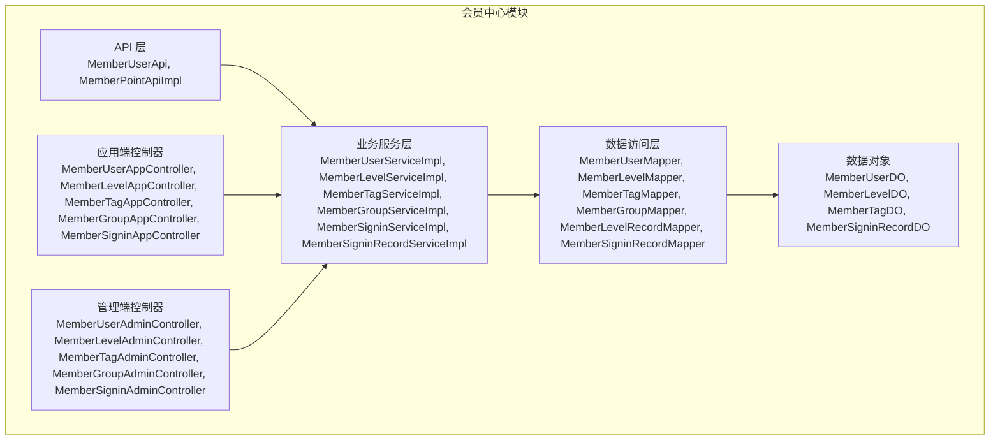
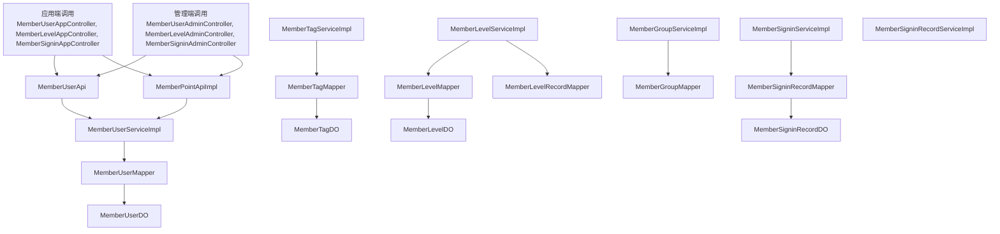
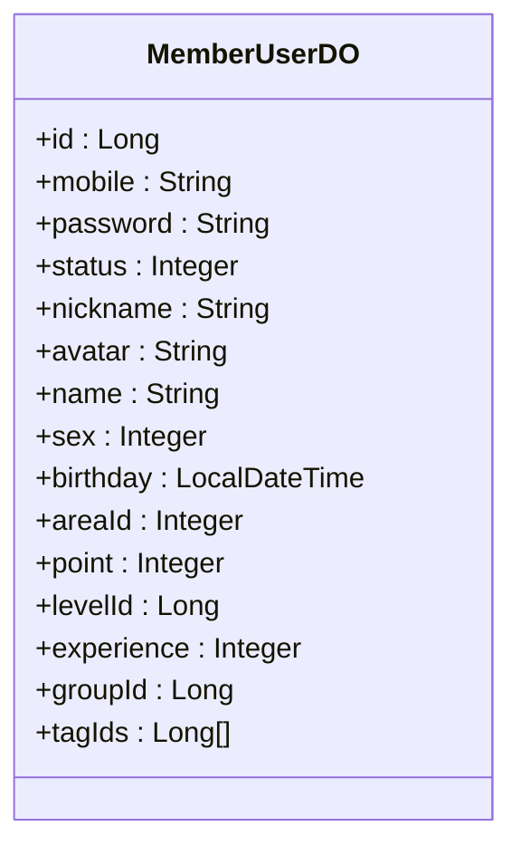
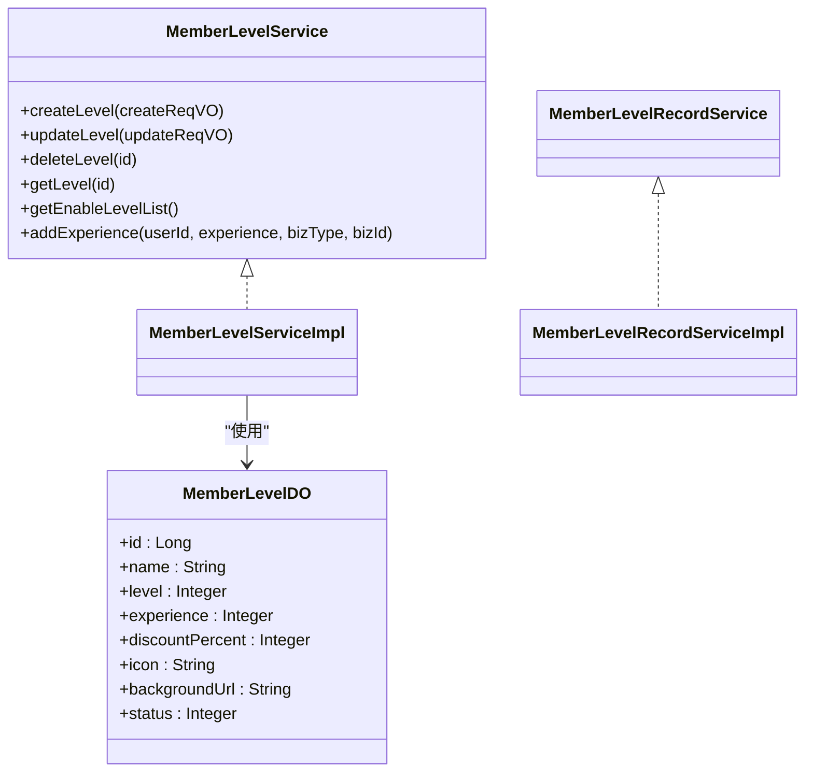
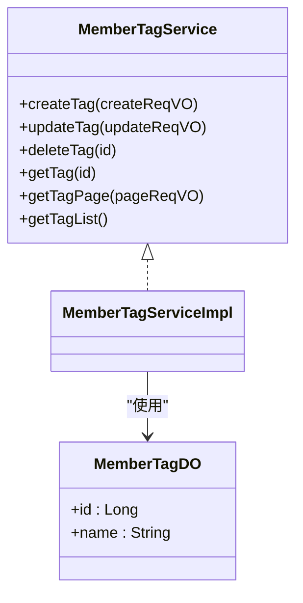
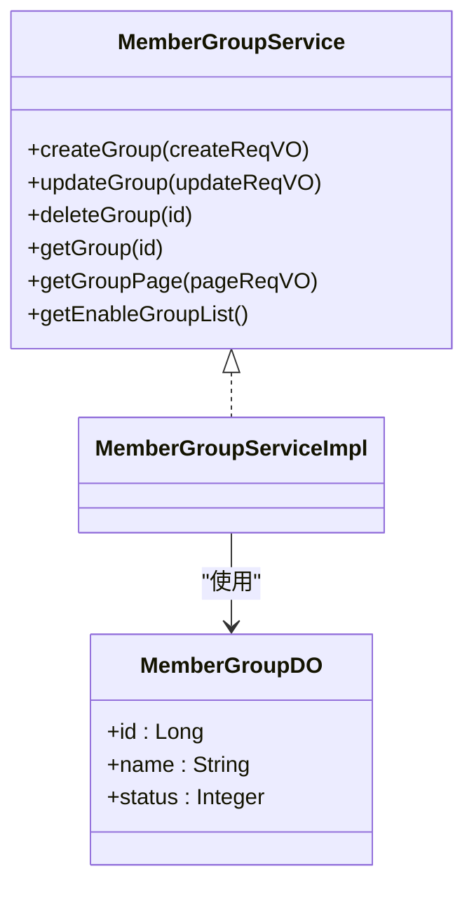
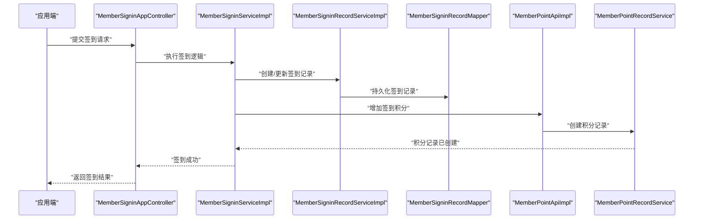
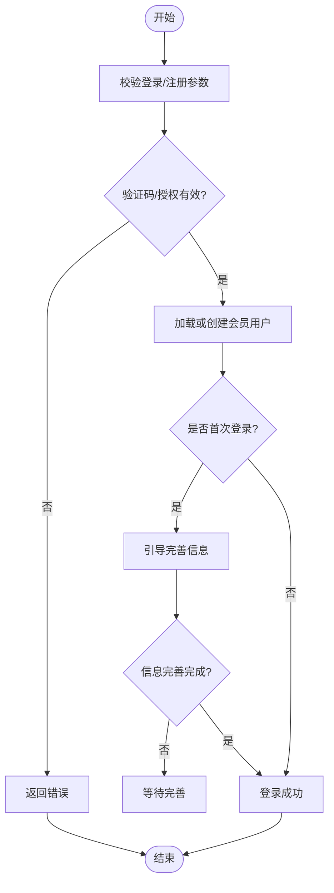
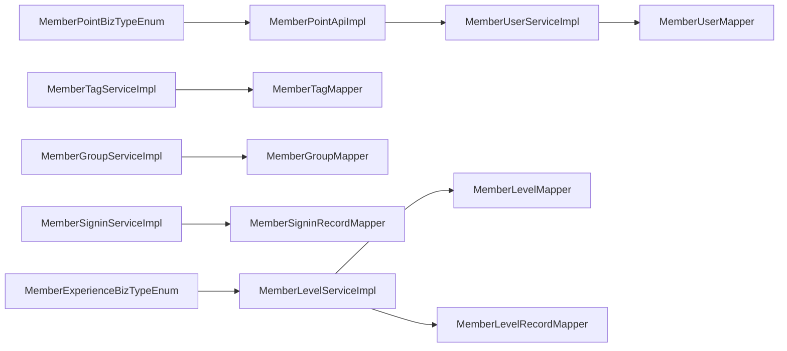

# 会员中心模块

<cite>
**本文引用的文件**
- [MemberUserDO.java](file://qiji-module-member/src/main/java/com.qiji.cps/module/member/dal/dataobject/user/MemberUserDO.java)
- [MemberLevelDO.java](file://qiji-module-member/src/main/java/com.qiji.cps/module/member/dal/dataobject/level/MemberLevelDO.java)
- [MemberTagDO.java](file://qiji-module-member/src/main/java/com.qiji.cps/module/member/dal/dataobject/tag/MemberTagDO.java)
- [MemberLevelService.java](file://qiji-module-member/src/main/java/com.qiji.cps/module/member/service/level/MemberLevelService.java)
- [MemberLevelServiceImpl.java](file://qiji-module-member/src/main/java/com.qiji.cps/module/member/service/level/MemberLevelServiceImpl.java)
- [MemberLevelRecordService.java](file://qiji-module-member/src/main/java/com.qiji.cps/module/member/service/level/MemberLevelRecordService.java)
- [MemberLevelRecordServiceImpl.java](file://qiji-module-member/src/main/java/com.qiji.cps/module/member/service/level/MemberLevelRecordServiceImpl.java)
- [MemberTagService.java](file://qiji-module-member/src/main/java/com.qiji.cps/module/member/service/tag/MemberTagService.java)
- [MemberTagServiceImpl.java](file://qiji-module-member/src/main/java/com.qiji.cps/module/member/service/tag/MemberTagServiceImpl.java)
- [MemberGroupService.java](file://qiji-module-member/src/main/java/com.qiji.cps/module/member/service/group/MemberGroupService.java)
- [MemberGroupServiceImpl.java](file://qiji-module-member/src/main/java/com.qiji.cps/module/member/service/group/MemberGroupServiceImpl.java)
- [MemberUserServiceImpl.java](file://qiji-module-member/src/main/java/com.qiji.cps/module/member/service/user/MemberUserServiceImpl.java)
- [MemberPointRecordService.java](file://qiji-module-member/src/main/java/com.qiji.cps/module/member/service/point/MemberPointRecordService.java)
- [MemberPointApiImpl.java](file://qiji-module-member/src/main/java/com.qiji.cps/module/member/api/point/MemberPointApiImpl.java)
- [MemberTagMapper.java](file://qiji-module-member/src/main/java/com.qiji.cps/module/member/dal/mysql/tag/MemberTagMapper.java)
- [MemberGroupMapper.java](file://qiji-module-member/src/main/java/com.qiji.cps/module/member/dal/mysql/group/MemberGroupMapper.java)
- [MemberUserMapper.java](file://qiji-module-member/src/main/java/com.qiji.cps/module/member/dal/mysql/user/MemberUserMapper.java)
- [MemberLevelMapper.java](file://qiji-module-member/src/main/java/com.qiji.cps/module/member/dal/mysql/level/MemberLevelMapper.java)
- [MemberLevelRecordMapper.java](file://qiji-module-member/src/main/java/com.qiji.cps/module/member/dal/mysql/level/MemberLevelRecordMapper.java)
- [MemberUserApi.java](file://qiji-module-member/src/main/java/com.qiji.cps/module/member/api/user/MemberUserApi.java)
- [MemberUserAppController.java](file://qiji-module-member/src/main/java/com.qiji.cps/module/member/controller/app/user/MemberUserAppController.java)
- [MemberUserAdminController.java](file://qiji-module-member/src/main/java/com.qiji.cps/module/member/controller/admin/user/MemberUserAdminController.java)
- [MemberLevelAppController.java](file://qiji-module-member/src/main/java/com.qiji.cps/module/member/controller/app/level/MemberLevelAppController.java)
- [MemberLevelAdminController.java](file://qiji-module-member/src/main/java/com.qiji.cps/module/member/controller/admin/level/MemberLevelAdminController.java)
- [MemberTagAppController.java](file://qiji-module-member/src/main/java/com.qiji.cps/module/member/controller/app/tag/MemberTagAppController.java)
- [MemberTagAdminController.java](file://qiji-module-member/src/main/java/com.qiji.cps/module/member/controller/admin/tag/MemberTagAdminController.java)
- [MemberGroupAppController.java](file://qiji-module-member/src/main/java/com.qiji.cps/module/member/controller/app/group/MemberGroupAppController.java)
- [MemberGroupAdminController.java](file://qiji-module-member/src/main/java/com.qiji.cps/module/member/controller/admin/group/MemberGroupAdminController.java)
- [MemberSigninAppController.java](file://qiji-module-member/src/main/java/com.qiji.cps/module/member/controller/app/signin/MemberSigninAppController.java)
- [MemberSigninAdminController.java](file://qiji-module-member/src/main/java/com.qiji.cps/module/member/controller/admin/signin/MemberSigninAdminController.java)
- [MemberSigninServiceImpl.java](file://qiji-module-member/src/main/java/com.qiji.cps/module/member/service/signin/MemberSigninServiceImpl.java)
- [MemberSigninRecordDO.java](file://qiji-module-member/src/main/java/com.qiji.cps/module/member/dal/dataobject/signin/MemberSigninRecordDO.java)
- [MemberSigninRecordMapper.java](file://qiji-module-member/src/main/java/com.qiji.cps/module/member/dal/mysql/signin/MemberSigninRecordMapper.java)
- [MemberSigninRecordService.java](file://qiji-module-member/src/main/java/com.qiji.cps/module/member/service/signin/MemberSigninRecordService.java)
- [MemberSigninRecordServiceImpl.java](file://qiji-module-member/src/main/java/com.qiji.cps/module/member/service/signin/MemberSigninRecordServiceImpl.java)
- [MemberExperienceBizTypeEnum.java](file://qiji-module-member/src/main/java/com.qiji.cps/module/member/enums/MemberExperienceBizTypeEnum.java)
- [MemberPointBizTypeEnum.java](file://qiji-module-member/src/main/java/com.qiji.cps/module/member/enums/point/MemberPointBizTypeEnum.java)
- [MemberUserServiceImpl.java](file://qiji-module-member/src/main/java/com.qiji.cps/module/member/service/user/MemberUserServiceImpl.java)
- [MemberUserServiceImpl.java](file://qiji-module-member/src/main/java/com.qiji.cps/module/member/service/user/MemberUserServiceImpl.java)
- [MemberUserServiceImpl.java](file://qiji-module-member/src/main/java/com.qiji.cps/module/member/service/user/MemberUserServiceImpl.java)
- [MemberUserServiceImpl.java](file://qiji-module-member/src/main/java/com.qiji.cps/module/member/service/user/MemberUserServiceImpl.java)
- [MemberUserServiceImpl.java](file://qiji-module-member/src/main/java/com.qiji.cps/module/member/service/user/MemberUserServiceImpl.java)
- [MemberUserServiceImpl.java](file://qiji-module-member/src/main/java/com.qiji.cps/module/member/service/user/MemberUserServiceImpl.java)
- [MemberUserServiceImpl.java](file://qiji-module-member/src/main/java/com.qiji.cps/module/member/service/user/MemberUserServiceImpl.java)
- [MemberUserServiceImpl.java](file://qiji-module-member/src/main/java/com.qiji.cps/module/member/service/user/MemberUserServiceImpl.java)
- [MemberUserServiceImpl.java](file://qiji-module-member/src/main/java/com.qiji.cps/module/member/service/user/MemberUserServiceImpl.java)
- [MemberUserServiceImpl.java](file://qiji-module-member/src/main/java/com.qiji.cps/module/member/service/user/MemberUserServiceImpl.java)
- [MemberUserServiceImpl.java](file://qiji-module-member/src/main/java/com.qiji.cps/module/member/service/user/MemberUserServiceImpl.java)
- [MemberUserServiceImpl.java](file://qiji-module-member/src/main/java/com.qiji.cps/module/member/service/user/MemberUserServiceImpl.java)
- [MemberUserServiceImpl.java](file://qiji-module-member/src/main/java/com.qiji.cps/module/member/service/user/MemberUserServiceImpl.java)
- [MemberUserServiceImpl.java](file://qiji-module-member/src/main/java/com.qiji.cps/module/member/service/user/MemberUserServiceImpl.java)
- [MemberUserServiceImpl.java](file://qiji-module-member/src/main/java/com.qiji.cps/module/member/service/user/MemberUserServiceImpl.java)
- [MemberUserServiceImpl.java](file://qiji-module-member/src/main/java/com.qiji.cps/module/member......)
</cite>

## 目录
1. [简介](#简介)
2. [项目结构](#项目结构)
3. [核心组件](#核心组件)
4. [架构总览](#架构总览)
5. [详细组件分析](#详细组件分析)
6. [依赖分析](#依赖分析)
7. [性能考虑](#性能考虑)
8. [故障排查指南](#故障排查指南)
9. [结论](#结论)
10. [附录](#附录)

## 简介
本文件面向CPS系统中的会员中心模块，系统性梳理会员信息管理、会员等级体系、会员标签管理、积分签到、会员分组、地址管理、绑定关系等能力，并阐述其与CPS返利系统的集成路径。文档从架构、数据模型、业务流程、关键实现与集成方案等维度展开，既适合技术读者深入理解，也便于非技术读者快速掌握。

## 项目结构
会员中心模块位于 qiji-module-member，采用按领域分层的组织方式：
- api：对外暴露的API接口定义（如会员用户、积分等）
- controller：应用端与管理端控制器
- service：业务服务层（用户、等级、标签、分组、签到、积分等）
- dal：数据访问层（dataobject、mapper）
- enums：枚举定义（业务类型、状态等）
- convert：VO/DO转换
- mq：消息生产/消费（如等级变更通知）

图表来源
- [MemberUserApi.java](file://qiji-module-member/src/main/java/com.qiji.cps/module/member/api/user/MemberUserApi.java)
- [MemberPointApiImpl.java](file://qiji-module-member/src/main/java/com.qiji.cps/module/member/api/point/MemberPointApiImpl.java)
- [MemberUserAppController.java](file://qiji-module-member/src/main/java/com.qiji.cps/module/member/controller/app/user/MemberUserAppController.java)
- [MemberLevelAppController.java](file://qiji-module-member/src/main/java/com.qiji.cps/module/member/controller/app/level/MemberLevelAppController.java)
- [MemberTagAppController.java](file://qiji-module-member/src/main/java/com.qiji.cps/module/member/controller/app/tag/MemberTagAppController.java)
- [MemberGroupAppController.java](file://qiji-module-member/src/main/java/com.qiji.cps/module/member/controller/app/group/MemberGroupAppController.java)
- [MemberSigninAppController.java](file://qiji-module-member/src/main/java/com.qiji.cps/module/member/controller/app/signin/MemberSigninAppController.java)
- [MemberUserServiceImpl.java](file://qiji-module-member/src/main/java/com.qiji.cps/module/member/service/user/MemberUserServiceImpl.java)
- [MemberLevelServiceImpl.java](file://qiji-module-member/src/main/java/com.qiji.cps/module/member/service/level/MemberLevelServiceImpl.java)
- [MemberTagServiceImpl.java](file://qiji-module-member/src/main/java/com.qiji.cps/module/member/service/tag/MemberTagServiceImpl.java)
- [MemberGroupServiceImpl.java](file://qiji-module-member/src/main/java/com.qiji.cps/module/member/service/group/MemberGroupServiceImpl.java)
- [MemberSigninServiceImpl.java](file://qiji-module-member/src/main/java/com.qiji.cps/module/member/service/signin/MemberSigninServiceImpl.java)
- [MemberSigninRecordServiceImpl.java](file://qiji-module-member/src/main/java/com.qiji.cps/module/member/service/signin/MemberSigninRecordServiceImpl.java)
- [MemberUserMapper.java](file://qiji-module-member/src/main/java/com.qiji.cps/module/member/dal/mysql/user/MemberUserMapper.java)
- [MemberLevelMapper.java](file://qiji-module-member/src/main/java/com.qiji.cps/module/member/dal/mysql/level/MemberLevelMapper.java)
- [MemberTagMapper.java](file://qiji-module-member/src/main/java/com.qiji.cps/module/member/dal/mysql/tag/MemberTagMapper.java)
- [MemberGroupMapper.java](file://qiji-module-member/src/main/java/com.qiji.cps/module/member/dal/mysql/group/MemberGroupMapper.java)
- [MemberLevelRecordMapper.java](file://qiji-module-member/src/main/java/com.qiji.cps/module/member/dal/mysql/level/MemberLevelRecordMapper.java)
- [MemberSigninRecordMapper.java](file://qiji-module-member/src/main/java/com.qiji.cps/module/member/dal/mysql/signin/MemberSigninRecordMapper.java)
- [MemberUserDO.java](file://qiji-module-member/src/main/java/com.qiji.cps/module/member/dal/dataobject/user/MemberUserDO.java)
- [MemberLevelDO.java](file://qiji-module-member/src/main/java/com.qiji.cps/module/member/dal/dataobject/level/MemberLevelDO.java)
- [MemberTagDO.java](file://qiji-module-member/src/main/java/com.qiji.cps/module/member/dal/dataobject/tag/MemberTagDO.java)
- [MemberSigninRecordDO.java](file://qiji-module-member/src/main/java/com.qiji.cps/module/member/dal/dataobject/signin/MemberSigninRecordDO.java)

章节来源
- [MemberUserDO.java:1-146](file://qiji-module-member/src/main/java/com.qiji.cps/module/member/dal/dataobject/user/MemberUserDO.java#L1-L146)
- [MemberLevelDO.java:1-65](file://qiji-module-member/src/main/java/com.qiji.cps/module/member/dal/dataobject/level/MemberLevelDO.java#L1-L65)
- [MemberTagDO.java:1-35](file://qiji-module-member/src/main/java/com.qiji.cps/module/member/dal/dataobject/tag/MemberTagDO.java#L1-L35)

## 核心组件
- 会员用户（MemberUser）：承载账号、基础信息、积分、等级、经验、分组、标签等字段，是会员中心的数据核心。
- 会员等级（MemberLevel）：定义等级名称、等级序号、升级所需经验、折扣等配置。
- 会员标签（MemberTag）：对会员打标，支持分页查询与管理。
- 会员分组（MemberGroup）：对会员进行分组，便于运营策略下发。
- 会员签到（MemberSignin）：签到记录与统计，支撑积分签到。
- 会员积分（MemberPoint）：积分变动记录与业务类型枚举，支撑积分体系。

章节来源
- [MemberUserDO.java:1-146](file://qiji-module-member/src/main/java/com.qiji.cps/module/member/dal/dataobject/user/MemberUserDO.java#L1-L146)
- [MemberLevelDO.java:1-65](file://qiji-module-member/src/main/java/com.qiji.cps/module/member/dal/dataobject/level/MemberLevelDO.java#L1-L65)
- [MemberTagDO.java:1-35](file://qiji-module-member/src/main/java/com.qiji.cps/module/member/dal/dataobject/tag/MemberTagDO.java#L1-L35)

## 架构总览
会员中心模块遵循“控制器-服务-数据访问-数据对象”的分层架构，应用端与管理端分别提供用户侧与运营侧能力；服务层负责业务编排与事务控制；数据访问层封装SQL与缓存；数据对象映射表结构并携带业务语义。

图表来源
- [MemberUserApi.java](file://qiji-module-member/src/main/java/com.qiji.cps/module/member/api/user/MemberUserApi.java)
- [MemberPointApiImpl.java](file://qiji-module-member/src/main/java/com.qiji.cps/module/member/api/point/MemberPointApiImpl.java)
- [MemberUserServiceImpl.java](file://qiji-module-member/src/main/java/com.qiji.cps/module/member/service/user/MemberUserServiceImpl.java)
- [MemberLevelServiceImpl.java](file://qiji-module-member/src/main/java/com.qiji.cps/module/member/service/level/MemberLevelServiceImpl.java)
- [MemberTagServiceImpl.java](file://qiji-module-member/src/main/java/com.qiji.cps/module/member/service/tag/MemberTagServiceImpl.java)
- [MemberGroupServiceImpl.java](file://qiji-module-member/src/main/java/com.qiji.cps/module/member/service/group/MemberGroupServiceImpl.java)
- [MemberSigninServiceImpl.java](file://qiji-module-member/src/main/java/com.qiji.cps/module/member/service/signin/MemberSigninServiceImpl.java)
- [MemberSigninRecordServiceImpl.java](file://qiji-module-member/src/main/java/com.qiji.cps/module/member/service/signin/MemberSigninRecordServiceImpl.java)
- [MemberUserMapper.java](file://qiji-module-member/src/main/java/com.qiji.cps/module/member/dal/mysql/user/MemberUserMapper.java)
- [MemberLevelMapper.java](file://qiji-module-member/src/main/java/com.qiji.cps/module/member/dal/mysql/level/MemberLevelMapper.java)
- [MemberTagMapper.java](file://qiji-module-member/src/main/java/com.qiji.cps/module/member/dal/mysql/tag/MemberTagMapper.java)
- [MemberGroupMapper.java](file://qiji-module-member/src/main/java/com.qiji.cps/module/member/dal/mysql/group/MemberGroupMapper.java)
- [MemberLevelRecordMapper.java](file://qiji-module-member/src/main/java/com.qiji.cps/module/member/dal/mysql/level/MemberLevelRecordMapper.java)
- [MemberSigninRecordMapper.java](file://qiji-module-member/src/main/java/com.qiji.cps/module/member/dal/mysql/signin/MemberSigninRecordMapper.java)
- [MemberUserDO.java](file://qiji-module-member/src/main/java/com.qiji.cps/module/member/dal/dataobject/user/MemberUserDO.java)
- [MemberLevelDO.java](file://qiji-module-member/src/main/java/com.qiji.cps/module/member/dal/dataobject/level/MemberLevelDO.java)
- [MemberTagDO.java](file://qiji-module-member/src/main/java/com.qiji.cps/module/member/dal/dataobject/tag/MemberTagDO.java)
- [MemberSigninRecordDO.java](file://qiji-module-member/src/main/java/com.qiji.cps/module/member/dal/dataobject/signin/MemberSigninRecordDO.java)

## 详细组件分析

### 会员信息管理
- 数据模型：会员用户对象包含账号信息（手机号、密码、状态、注册/登录信息）、基础信息（昵称、头像、姓名、性别、生日、地区）、其他信息（积分、等级、经验、分组、标签）。
- 关键能力：
  - 会员注册/登录：通过应用端控制器与服务层编排短信验证码、社交授权、密码加密等流程。
  - 信息完善：支持昵称、头像、生日、地区等字段更新。
  - 统计与筛选：按分组/等级/标签统计会员数量，便于运营分析。
- 事务与一致性：服务层使用事务注解保证关键操作原子性。

图表来源
- [MemberUserDO.java:1-146](file://qiji-module-member/src/main/java/com.qiji.cps/module/member/dal/dataobject/user/MemberUserDO.java#L1-L146)

章节来源
- [MemberUserDO.java:1-146](file://qiji-module-member/src/main/java/com.qiji.cps/module/member/dal/dataobject/user/MemberUserDO.java#L1-L146)
- [MemberUserServiceImpl.java](file://qiji-module-member/src/main/java/com.qiji.cps/module/member/service/user/MemberUserServiceImpl.java)

### 会员等级体系
- 数据模型：等级对象包含名称、等级序号、升级经验阈值、折扣、图标、背景图、状态。
- 关键能力：
  - 等级配置：支持创建、更新、启用/停用、按状态查询。
  - 经验管理：提供增加经验接口，支持业务类型与业务编号记录。
  - 等级记录：记录每次升降级详情，便于审计与回溯。
- 升级规则：当累计经验达到某等级阈值时自动晋升，服务层在事务内完成经验累加与等级变更。

图表来源
- [MemberLevelDO.java:1-65](file://qiji-module-member/src/main/java/com.qiji.cps/module/member/dal/dataobject/level/MemberLevelDO.java#L1-L65)
- [MemberLevelService.java:1-103](file://qiji-module-member/src/main/java/com.qiji.cps/module/member/service/level/MemberLevelService.java#L1-L103)
- [MemberLevelServiceImpl.java](file://qiji-module-member/src/main/java/com.qiji.cps/module/member/service/level/MemberLevelServiceImpl.java)
- [MemberLevelRecordService.java](file://qiji-module-member/src/main/java/com.qiji.cps/module/member/service/level/MemberLevelRecordService.java)
- [MemberLevelRecordServiceImpl.java](file://qiji-module-member/src/main/java/com.qiji.cps/module/member/service/level/MemberLevelRecordServiceImpl.java)

章节来源
- [MemberLevelService.java:1-103](file://qiji-module-member/src/main/java/com.qiji.cps/module/member/service/level/MemberLevelService.java#L1-L103)
- [MemberLevelServiceImpl.java](file://qiji-module-member/src/main/java/com.qiji.cps/module/member/service/level/MemberLevelServiceImpl.java)
- [MemberLevelRecordService.java](file://qiji-module-member/src/main/java/com.qiji.cps/module/member/service/level/MemberLevelRecordService.java)
- [MemberLevelRecordServiceImpl.java](file://qiji-module-member/src/main/java/com.qiji.cps/module/member/service/level/MemberLevelRecordServiceImpl.java)

### 会员标签管理
- 数据模型：标签对象包含名称。
- 关键能力：
  - 标签增删改查与分页。
  - 与会员关联：会员对象持有标签ID列表，便于批量筛选与统计。
- 应用场景：结合标签实现精准营销、个性化推荐与活动圈人。

图表来源
- [MemberTagDO.java:1-35](file://qiji-module-member/src/main/java/com.qiji.cps/module/member/dal/dataobject/tag/MemberTagDO.java#L1-L35)
- [MemberTagService.java:1-74](file://qiji-module-member/src/main/java/com.qiji.cps/module/member/service/tag/MemberTagService.java#L1-L74)
- [MemberTagServiceImpl.java](file://qiji-module-member/src/main/java/com.qiji.cps/module/member/service/tag/MemberTagServiceImpl.java)

章节来源
- [MemberTagService.java:1-74](file://qiji-module-member/src/main/java/com.qiji.cps/module/member/service/tag/MemberTagService.java#L1-L74)
- [MemberTagServiceImpl.java](file://qiji-module-member/src/main/java/com.qiji.cps/module/member/service/tag/MemberTagServiceImpl.java)
- [MemberTagMapper.java](file://qiji-module-member/src/main/java/com.qiji.cps/module/member/dal/mysql/tag/MemberTagMapper.java)

### 会员分组管理
- 数据模型：分组对象包含名称与状态。
- 关键能力：
  - 分组的创建、更新、删除、分页与状态查询。
  - 与会员关联：会员对象持有分组ID，便于运营策略按组下发。
- 运营价值：支持按分组定向推送、权益发放与活动参与。

图表来源
- [MemberGroupDO.java](file://qiji-module-member/src/main/java/com.qiji.cps/module/member/dal/dataobject/group/MemberGroupDO.java)
- [MemberGroupService.java:1-85](file://qiji-module-member/src/main/java/com.qiji.cps/module/member/service/group/MemberGroupService.java#L1-L85)
- [MemberGroupServiceImpl.java](file://qiji-module-member/src/main/java/com.qiji.cps/module/member/service/group/MemberGroupServiceImpl.java)

章节来源
- [MemberGroupService.java:1-85](file://qiji-module-member/src/main/java/com.qiji.cps/module/member/service/group/MemberGroupService.java#L1-L85)
- [MemberGroupServiceImpl.java](file://qiji-module-member/src/main/java/com.qiji.cps/module/member/service/group/MemberGroupServiceImpl.java)
- [MemberGroupMapper.java](file://qiji-module-member/src/main/java/com.qiji.cps/module/member/dal/mysql/group/MemberGroupMapper.java)

### 积分签到与积分体系
- 积分记录：记录积分变动、业务类型与业务编号，支持管理员与会员端分页查询。
- 积分API：提供统一的积分增加入口，校验业务类型有效性后落库记录。
- 签到流程：会员每日签到获得积分奖励，服务层维护签到记录与积分流水。

图表来源
- [MemberSigninAppController.java](file://qiji-module-member/src/main/java/com.qiji.cps/module/member/controller/app/signin/MemberSigninAppController.java)
- [MemberSigninServiceImpl.java](file://qiji-module-member/src/main/java/com.qiji.cps/module/member/service/signin/MemberSigninServiceImpl.java)
- [MemberSigninRecordServiceImpl.java](file://qiji-module-member/src/main/java/com.qiji.cps/module/member/service/signin/MemberSigninRecordServiceImpl.java)
- [MemberSigninRecordMapper.java](file://qiji-module-member/src/main/java/com.qiji.cps/module/member/dal/mysql/signin/MemberSigninRecordMapper.java)
- [MemberPointApiImpl.java](file://qiji-module-member/src/main/java/com.qiji.cps/module/member/api/point/MemberPointApiImpl.java)
- [MemberPointRecordService.java](file://qiji-module-member/src/main/java/com.qiji.cps/module/member/service/point/MemberPointRecordService.java)

章节来源
- [MemberPointRecordService.java:1-42](file://qiji-module-member/src/main/java/com.qiji.cps/module/member/service/point/MemberPointRecordService.java#L1-L42)
- [MemberPointApiImpl.java:1-37](file://qiji-module-member/src/main/java/com.qiji.cps/module/member/api/point/MemberPointApiImpl.java#L1-L37)
- [MemberSigninServiceImpl.java](file://qiji-module-member/src/main/java/com.qiji.cps/module/member/service/signin/MemberSigninServiceImpl.java)
- [MemberSigninRecordServiceImpl.java](file://qiji-module-member/src/main/java/com.qiji.cps/module/member/service/signin/MemberSigninRecordServiceImpl.java)

### 会员注册登录机制与信息完善流程
- 登录/注册：应用端控制器接收手机号+验证码或社交授权，服务层校验验证码、解析授权信息、生成会话与登录日志。
- 密码安全：密码使用BCrypt加密存储。
- 信息完善：首次登录后引导完善昵称、头像、生日、地区等基础信息。
- 终端与IP：记录注册/登录终端与IP，便于风控与审计。

图表来源
- [MemberUserAppController.java](file://qiji-module-member/src/main/java/com.qiji.cps/module/member/controller/app/user/MemberUserAppController.java)
- [MemberUserServiceImpl.java](file://qiji-module-member/src/main/java/com.qiji.cps/module/member/service/user/MemberUserServiceImpl.java)

章节来源
- [MemberUserAppController.java](file://qiji-module-member/src/main/java/com.qiji.cps/module/member/controller/app/user/MemberUserAppController.java)
- [MemberUserServiceImpl.java](file://qiji-module-member/src/main/java/com.qiji.cps/module/member/service/user/MemberUserServiceImpl.java)

### 会员地址管理与绑定关系管理
- 地址管理：提供地址新增、编辑、删除、设默认、分页查询等能力，通常由应用端控制器与服务层协同实现。
- 绑定关系：支持手机号与社交账号绑定、解绑，服务层需确保幂等与一致性。

章节来源
- [MemberUserAppController.java](file://qiji-module-member/src/main/java/com.qiji.cps/module/member/controller/app/user/MemberUserAppController.java)
- [MemberUserServiceImpl.java](file://qiji-module-member/src/main/java/com.qiji.cps/module/member/service/user/MemberUserServiceImpl.java)

### 与CPS返利系统的集成方案
- 推广关系：会员成为推广者后，通过推广链接/二维码产生订单，系统记录推广关系与订单关联。
- 返利计算：订单完成后，依据CPS规则计算返利金额，生成返利记录并入账至会员账户（可扩展为积分或余额）。
- 订单与会员：订单模块与会员模块通过会员ID关联，返利结算时读取会员等级/标签影响返利比例。
- 风险控制：对异常订单、刷单行为进行识别与拦截，保障返利成本可控。

章节来源
- [MemberUserDO.java:1-146](file://qiji-module-member/src/main/java/com.qiji.cps/module/member/dal/dataobject/user/MemberUserDO.java#L1-L146)
- [MemberLevelDO.java:1-65](file://qiji-module-member/src/main/java/com.qiji.cps/module/member/dal/dataobject/level/MemberLevelDO.java#L1-L65)

## 依赖分析
- 低耦合高内聚：各领域服务独立，通过API与枚举进行契约约束。
- 数据依赖：会员用户对象依赖等级、分组、标签等DO；等级体系依赖等级记录Mapper；签到依赖签到记录Mapper；积分依赖积分记录Service。
- 外部依赖：短信验证码、社交授权、支付/钱包等能力通过API注入，避免直接耦合。

图表来源
- [MemberUserServiceImpl.java](file://qiji-module-member/src/main/java/com.qiji.cps/module/member/service/user/MemberUserServiceImpl.java)
- [MemberLevelServiceImpl.java](file://qiji-module-member/src/main/java/com.qiji.cps/module/member/service/level/MemberLevelServiceImpl.java)
- [MemberTagServiceImpl.java](file://qiji-module-member/src/main/java/com.qiji.cps/module/member/service/tag/MemberTagServiceImpl.java)
- [MemberGroupServiceImpl.java](file://qiji-module-member/src/main/java/com.qiji.cps/module/member/service/group/MemberGroupServiceImpl.java)
- [MemberSigninServiceImpl.java](file://qiji-module-member/src/main/java/com.qiji.cps/module/member/service/signin/MemberSigninServiceImpl.java)
- [MemberPointApiImpl.java](file://qiji-module-member/src/main/java/com.qiji.cps/module/member/api/point/MemberPointApiImpl.java)
- [MemberExperienceBizTypeEnum.java](file://qiji-module-member/src/main/java/com.qiji.cps/module/member/enums/MemberExperienceBizTypeEnum.java)
- [MemberPointBizTypeEnum.java](file://qiji-module-member/src/main/java/com.qiji.cps/module/member/enums/point/MemberPointBizTypeEnum.java)

章节来源
- [MemberUserServiceImpl.java](file://qiji-module-member/src/main/java/com.qiji.cps/module/member/service/user/MemberUserServiceImpl.java)
- [MemberLevelServiceImpl.java](file://qiji-module-member/src/main/java/com.qiji.cps/module/member/service/level/MemberLevelServiceImpl.java)
- [MemberTagServiceImpl.java](file://qiji-module-member/src/main/java/com.qiji.cps/module/member/service/tag/MemberTagServiceImpl.java)
- [MemberGroupServiceImpl.java](file://qiji-module-member/src/main/java/com.qiji.cps/module/member/service/group/MemberGroupServiceImpl.java)
- [MemberSigninServiceImpl.java](file://qiji-module-member/src/main/java/com.qiji.cps/module/member/service/signin/MemberSigninServiceImpl.java)
- [MemberPointApiImpl.java](file://qiji-module-member/src/main/java/com.qiji.cps/module/member/api/point/MemberPointApiImpl.java)

## 性能考虑
- 索引设计：会员表按手机号建立唯一索引，等级/标签/分组表按状态与创建时间建立索引，提升查询效率。
- 分页查询：标签与分组均提供分页查询，建议结合条件过滤与排序字段优化。
- 事务边界：经验/积分/等级变更尽量合并为单事务，减少锁竞争。
- 缓存策略：热点会员信息可引入Redis缓存，降低数据库压力。

## 故障排查指南
- 登录失败：检查验证码是否过期、手机号是否存在、账号状态是否正常。
- 积分未到账：核对业务类型枚举是否受支持、积分记录是否创建成功。
- 等级未晋升：确认经验是否正确累加、等级阈值是否匹配、是否存在并发覆盖问题。
- 标签/分组异常：确认名称重复、状态异常或存在用户绑定导致无法删除。

章节来源
- [MemberUserServiceImpl.java](file://qiji-module-member/src/main/java/com.qiji.cps/module/member/service/user/MemberUserServiceImpl.java)
- [MemberPointApiImpl.java](file://qiji-module-member/src/main/java/com.qiji.cps/module/member/api/point/MemberPointApiImpl.java)
- [MemberLevelServiceImpl.java](file://qiji-module-member/src/main/java/com.qiji.cps/module/member/service/level/MemberLevelServiceImpl.java)
- [MemberTagServiceImpl.java](file://qiji-module-member/src/main/java/com.qiji.cps/module/member/service/tag/MemberTagServiceImpl.java)
- [MemberGroupServiceImpl.java](file://qiji-module-member/src/main/java/com.qiji.cps/module/member/service/group/MemberGroupServiceImpl.java)

## 结论
会员中心模块通过清晰的分层架构与完善的领域模型，支撑了会员信息、等级、标签、分组、积分签到等核心能力，并为CPS返利系统的推广与结算提供了稳固的数据与业务基础。建议在后续迭代中持续优化索引与缓存策略，强化风控与审计能力，以应对高并发与复杂业务场景。

## 附录
- 关键接口与实现位置参考：
  - 会员用户：[MemberUserServiceImpl.java](file://qiji-module-member/src/main/java/com.qiji.cps/module/member/service/user/MemberUserServiceImpl.java)
  - 会员等级：[MemberLevelServiceImpl.java](file://qiji-module-member/src/main/java/com.qiji.cps/module/member/service/level/MemberLevelServiceImpl.java)，[MemberLevelRecordServiceImpl.java](file://qiji-module-member/src/main/java/com.qiji.cps/module/member/service/level/MemberLevelRecordServiceImpl.java)
  - 会员标签：[MemberTagServiceImpl.java](file://qiji-module-member/src/main/java/com.qiji.cps/module/member/service/tag/MemberTagServiceImpl.java)，[MemberTagMapper.java](file://qiji-module-member/src/main/java/com.qiji.cps/module/member/dal/mysql/tag/MemberTagMapper.java)
  - 会员分组：[MemberGroupServiceImpl.java](file://qiji-module-member/src/main/java/com.qiji.cps/module/member/service/group/MemberGroupServiceImpl.java)，[MemberGroupMapper.java](file://qiji-module-member/src/main/java/com.qiji.cps/module/member/dal/mysql/group/MemberGroupMapper.java)
  - 积分签到：[MemberSigninServiceImpl.java](file://qiji-module-member/src/main/java/com.qiji.cps/module/member/service/signin/MemberSigninServiceImpl.java)，[MemberSigninRecordServiceImpl.java](file://qiji-module-member/src/main/java/com.qiji.cps/module/member/service/signin/MemberSigninRecordServiceImpl.java)，[MemberPointApiImpl.java](file://qiji-module-member/src/main/java/com.qiji.cps/module/member/api/point/MemberPointApiImpl.java)，[MemberPointRecordService.java](file://qiji-module-member/src/main/java/com.qiji.cps/module/member/service/point/MemberPointRecordService.java)