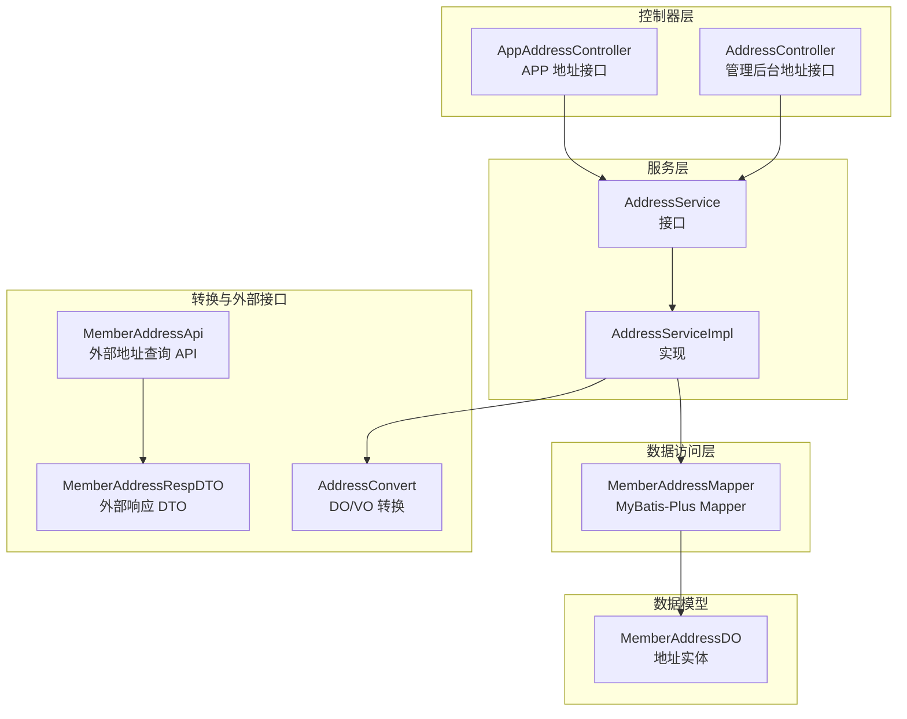
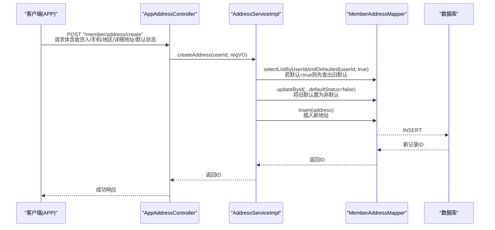
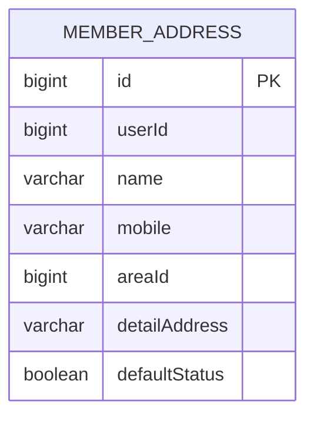
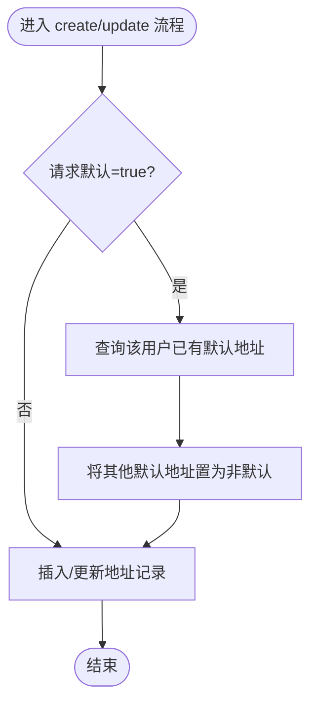
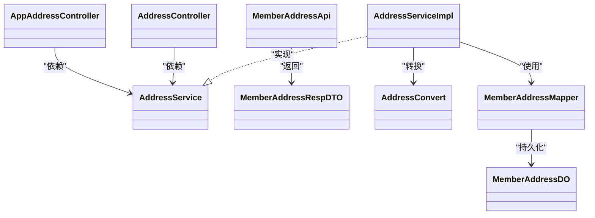
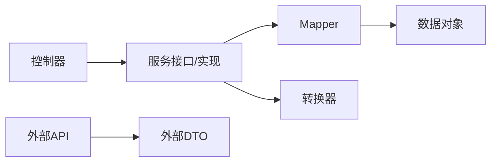

# 会员地址管理

<cite>
**本文引用的文件**
- [MemberAddressDO.java](file://qiji-module-member/src/main/java/com.qiji.cps/module/member/dal/dataobject/address/MemberAddressDO.java)
- [MemberAddressApi.java](file://qiji-module-member/src/main/java/com.qiji.cps/module/member/api/address/MemberAddressApi.java)
- [MemberAddressRespDTO.java](file://qiji-module-member/src/main/java/com.qiji.cps/module/member/api/address/dto/MemberAddressRespDTO.java)
- [AddressController.java](file://qiji-module-member/src/main/java/com.qiji.cps/module/member/controller/admin/address/AddressController.java)
- [AppAddressController.java](file://qiji-module-member/src/main/java/com.qiji.cps/module/member/controller/app/address/AppAddressController.java)
- [AddressService.java](file://qiji-module-member/src/main/java/com.qiji.cps/module/member/service/address/AddressService.java)
- [AddressServiceImpl.java](file://qiji-module-member/src/main/java/com.qiji.cps/module/member/service/address/AddressServiceImpl.java)
- [AddressConvert.java](file://qiji-module-member/src/main/java/com.qiji.cps/module/member/convert/address/AddressConvert.java)
- [MemberAddressMapper.java](file://qiji-module-member/src/main/java/com.qiji.cps/module/member/dal/mysql/address/MemberAddressMapper.java)
- [MemberAddressServiceImplTest.java](file://qiji-module-member/src/test/java/com.qiji.cps/module/member/service/address/MemberAddressServiceImplTest.java)
</cite>

## 目录
1. [简介](#简介)
2. [项目结构](#项目结构)
3. [核心组件](#核心组件)
4. [架构总览](#架构总览)
5. [详细组件分析](#详细组件分析)
6. [依赖分析](#依赖分析)
7. [性能考虑](#性能考虑)
8. [故障排查指南](#故障排查指南)
9. [结论](#结论)
10. [附录：API 接口文档](#附录api-接口文档)

## 简介
本技术文档围绕会员地址管理功能展开，覆盖收货地址的新增、编辑、删除、列表查询与默认地址设置等核心能力。文档从数据模型、服务层实现、控制器接口到与订单结算流程的集成方式进行系统化梳理，并提供可视化图示帮助理解。

## 项目结构
会员地址管理位于 qiji-module-member 模块中，采用典型的分层架构：
- 控制器层：对外暴露管理后台与 APP 的地址接口
- 服务层：封装业务逻辑，包括默认地址唯一性约束与自动更新
- 数据访问层：基于 MyBatis-Plus 的 Mapper 进行 CRUD
- 数据对象：定义地址表结构及字段含义
- DTO/VO：接口参数与响应体的类型定义
- 转换器：VO/DTO 与 DO 的映射

图表来源
- [AppAddressController.java:1-76](file://qiji-module-member/src/main/java/com.qiji.cps/module/member/controller/app/address/AppAddressController.java#L1-L76)
- [AddressController.java:1-42](file://qiji-module-member/src/main/java/com.qiji.cps/module/member/controller/admin/address/AddressController.java#L1-L42)
- [AddressService.java:1-68](file://qiji-module-member/src/main/java/com.qiji.cps/module/member/service/address/AddressService.java#L1-L68)
- [AddressServiceImpl.java:1-98](file://qiji-module-member/src/main/java/com.qiji.cps/module/member/service/address/AddressServiceImpl.java#L1-L98)
- [MemberAddressMapper.java](file://qiji-module-member/src/main/java/com.qiji.cps/module/member/dal/mysql/address/MemberAddressMapper.java)
- [MemberAddressDO.java:1-57](file://qiji-module-member/src/main/java/com.qiji.cps/module/member/dal/dataobject/address/MemberAddressDO.java#L1-L57)
- [AddressConvert.java](file://qiji-module-member/src/main/java/com.qiji.cps/module/member/convert/address/AddressConvert.java)
- [MemberAddressApi.java:1-30](file://qiji-module-member/src/main/java/com.qiji.cps/module/member/api/address/MemberAddressApi.java#L1-L30)
- [MemberAddressRespDTO.java:1-43](file://qiji-module-member/src/main/java/com.qiji.cps/module/member/api/address/dto/MemberAddressRespDTO.java#L1-L43)

章节来源
- [AppAddressController.java:1-76](file://qiji-module-member/src/main/java/com.qiji.cps/module/member/controller/app/address/AppAddressController.java#L1-L76)
- [AddressController.java:1-42](file://qiji-module-member/src/main/java/com.qiji.cps/module/member/controller/admin/address/AddressController.java#L1-L42)
- [AddressService.java:1-68](file://qiji-module-member/src/main/java/com.qiji.cps/module/member/service/address/AddressService.java#L1-L68)
- [AddressServiceImpl.java:1-98](file://qiji-module-member/src/main/java/com.qiji.cps/module/member/service/address/AddressServiceImpl.java#L1-L98)
- [MemberAddressDO.java:1-57](file://qiji-module-member/src/main/java/com.qiji.cps/module/member/dal/dataobject/address/MemberAddressDO.java#L1-L57)

## 核心组件
- 数据模型 MemberAddressDO：定义地址表字段，包含用户标识、收货人、手机号、地区编号、详细地址、默认状态等
- 服务接口 AddressService 与实现 AddressServiceImpl：负责地址的新增、更新、删除、查询与默认地址获取；实现默认地址唯一性约束与自动更新
- 控制器 AppAddressController 与 AddressController：分别面向 APP 与管理后台，提供地址 CRUD 与默认地址查询接口
- 转换器 AddressConvert：完成 VO/DTO 与 DO 的映射
- 外部 API MemberAddressApi 与 DTO MemberAddressRespDTO：供其他模块或场景查询用户默认地址

章节来源
- [MemberAddressDO.java:1-57](file://qiji-module-member/src/main/java/com.qiji.cps/module/member/dal/dataobject/address/MemberAddressDO.java#L1-L57)
- [AddressService.java:1-68](file://qiji-module-member/src/main/java/com.qiji.cps/module/member/service/address/AddressService.java#L1-L68)
- [AddressServiceImpl.java:1-98](file://qiji-module-member/src/main/java/com.qiji.cps/module/member/service/address/AddressServiceImpl.java#L1-L98)
- [AppAddressController.java:1-76](file://qiji-module-member/src/main/java/com.qiji.cps/module/member/controller/app/address/AppAddressController.java#L1-L76)
- [AddressController.java:1-42](file://qiji-module-member/src/main/java/com.qiji.cps/module/member/controller/admin/address/AddressController.java#L1-L42)
- [AddressConvert.java](file://qiji-module-member/src/main/java/com.qiji.cps/module/member/convert/address/AddressConvert.java)
- [MemberAddressApi.java:1-30](file://qiji-module-member/src/main/java/com.qiji.cps/module/member/api/address/MemberAddressApi.java#L1-L30)
- [MemberAddressRespDTO.java:1-43](file://qiji-module-member/src/main/java/com.qiji.cps/module/member/api/address/dto/MemberAddressRespDTO.java#L1-L43)

## 架构总览
下图展示了地址管理的端到端调用链路与职责分工：

图表来源
- [AppAddressController.java:32-36](file://qiji-module-member/src/main/java/com.qiji.cps/module/member/controller/app/address/AppAddressController.java#L32-L36)
- [AddressServiceImpl.java:31-46](file://qiji-module-member/src/main/java/com.qiji.cps/module/member/service/address/AddressServiceImpl.java#L31-L46)
- [MemberAddressMapper.java](file://qiji-module-member/src/main/java/com.qiji.cps/module/member/dal/mysql/address/MemberAddressMapper.java)

## 详细组件分析

### 数据模型与表结构
- 表名：member_address
- 字段要点：
  - id：主键
  - userId：用户标识
  - name：收货人姓名
  - mobile：手机号
  - areaId：地区编号
  - detailAddress：详细地址
  - defaultStatus：是否默认（true 表示默认）
- 关系与约束：
  - defaultStatus 在同一用户维度应保持唯一性（通过服务层保证）
  - userId 作为用户隔离维度，避免跨用户数据混淆

图表来源
- [MemberAddressDO.java:14-56](file://qiji-module-member/src/main/java/com.qiji.cps/module/member/dal/dataobject/address/MemberAddressDO.java#L14-L56)

章节来源
- [MemberAddressDO.java:1-57](file://qiji-module-member/src/main/java/com.qiji.cps/module/member/dal/dataobject/address/MemberAddressDO.java#L1-L57)

### 服务层默认地址唯一性与自动更新逻辑
- 新增默认地址：若请求默认=true，则先查询该用户已存在的默认地址并将其 defaultStatus 置为 false，再插入新地址
- 更新默认地址：若请求默认=true且目标地址不是当前地址，则将同用户下的其他默认地址置为非默认，再更新目标地址
- 查询默认地址：按 userId + defaultStatus=true 查询第一条记录
- 查询列表：支持按 userId 查询全部地址，或按 userId+defaultStatus 过滤

图表来源
- [AddressServiceImpl.java:31-64](file://qiji-module-member/src/main/java/com.qiji.cps/module/member/service/address/AddressServiceImpl.java#L31-L64)

章节来源
- [AddressServiceImpl.java:31-95](file://qiji-module-member/src/main/java/com.qiji.cps/module/member/service/address/AddressServiceImpl.java#L31-L95)

### 控制器接口与权限控制
- APP 接口
  - POST /member/address/create：创建地址
  - PUT /member/address/update：更新地址
  - DELETE /member/address/delete?id=...：删除地址
  - GET /member/address/get?id=...：获取单条地址
  - GET /member/address/get-default：获取默认地址
  - GET /member/address/list：获取地址列表
- 管理后台接口
  - GET /member/address/list?userId=...：获取指定用户地址列表（需权限）

章节来源
- [AppAddressController.java:32-73](file://qiji-module-member/src/main/java/com.qiji.cps/module/member/controller/app/address/AppAddressController.java#L32-L73)
- [AddressController.java:32-39](file://qiji-module-member/src/main/java/com.qiji.cps/module/member/controller/admin/address/AddressController.java#L32-L39)

### 外部 API 与 DTO
- MemberAddressApi：提供根据 id 获取地址、根据 userId 获取默认地址的能力
- MemberAddressRespDTO：对外返回的地址响应结构

章节来源
- [MemberAddressApi.java:10-27](file://qiji-module-member/src/main/java/com.qiji.cps/module/member/api/address/MemberAddressApi.java#L10-L27)
- [MemberAddressRespDTO.java:10-40](file://qiji-module-member/src/main/java/com.qiji.cps/module/member/api/address/dto/MemberAddressRespDTO.java#L10-L40)

### 类关系与依赖

图表来源
- [AppAddressController.java:27-30](file://qiji-module-member/src/main/java/com.qiji.cps/module/member/controller/app/address/AppAddressController.java#L27-L30)
- [AddressController.java:29-30](file://qiji-module-member/src/main/java/com.qiji.cps/module/member/controller/admin/address/AddressController.java#L29-L30)
- [AddressService.java:15-67](file://qiji-module-member/src/main/java/com.qiji.cps/module/member/service/address/AddressService.java#L15-L67)
- [AddressServiceImpl.java:24-29](file://qiji-module-member/src/main/java/com.qiji.cps/module/member/service/address/AddressServiceImpl.java#L24-L29)
- [MemberAddressApi.java:10-27](file://qiji-module-member/src/main/java/com.qiji.cps/module/member/api/address/MemberAddressApi.java#L10-L27)
- [MemberAddressRespDTO.java:10-40](file://qiji-module-member/src/main/java/com.qiji.cps/module/member/api/address/dto/MemberAddressRespDTO.java#L10-L40)
- [AddressConvert.java](file://qiji-module-member/src/main/java/com.qiji.cps/module/member/convert/address/AddressConvert.java)
- [MemberAddressMapper.java](file://qiji-module-member/src/main/java/com.qiji.cps/module/member/dal/mysql/address/MemberAddressMapper.java)
- [MemberAddressDO.java:22-56](file://qiji-module-member/src/main/java/com.qiji.cps/module/member/dal/dataobject/address/MemberAddressDO.java#L22-L56)

## 依赖分析
- 控制器依赖服务接口，服务实现依赖 Mapper 与转换器
- 服务层通过 Mapper 提供的条件查询实现默认地址唯一性约束
- 外部 API 与 DTO 为跨模块或跨场景提供只读查询能力

图表来源
- [AddressService.java:1-68](file://qiji-module-member/src/main/java/com.qiji.cps/module/member/service/address/AddressService.java#L1-L68)
- [AddressServiceImpl.java:1-98](file://qiji-module-member/src/main/java/com.qiji.cps/module/member/service/address/AddressServiceImpl.java#L1-L98)
- [MemberAddressMapper.java](file://qiji-module-member/src/main/java/com.qiji.cps/module/member/dal/mysql/address/MemberAddressMapper.java)
- [AddressConvert.java](file://qiji-module-member/src/main/java/com.qiji.cps/module/member/convert/address/AddressConvert.java)
- [MemberAddressApi.java:1-30](file://qiji-module-member/src/main/java/com.qiji.cps/module/member/api/address/MemberAddressApi.java#L1-L30)
- [MemberAddressRespDTO.java:1-43](file://qiji-module-member/src/main/java/com.qiji.cps/module/member/api/address/dto/MemberAddressRespDTO.java#L1-L43)

## 性能考虑
- 默认地址变更涉及两次写操作（查询+更新），建议在数据库层面增加索引以优化查询效率
- 建议对 userId 与 defaultStatus 组合建立索引，提升按用户筛选默认地址的性能
- 列表查询与单条查询均依赖 Mapper 条件查询，确保 SQL 层面的索引命中

## 故障排查指南
- 地址不存在：当执行更新/删除/查询单条时，若地址不存在会抛出“地址不存在”的异常
- 默认地址冲突：新增/更新默认地址时，如未正确处理旧默认地址，可能导致重复默认地址
- 权限问题：管理后台接口需要相应权限，否则会返回无权限错误

章节来源
- [AddressServiceImpl.java:74-79](file://qiji-module-member/src/main/java/com.qiji.cps/module/member/service/address/AddressServiceImpl.java#L74-L79)
- [AddressController.java:35-35](file://qiji-module-member/src/main/java/com.qiji.cps/module/member/controller/admin/address/AddressController.java#L35-L35)

## 结论
会员地址管理通过清晰的分层设计实现了地址的完整生命周期管理，重点在于默认地址的唯一性约束与自动更新机制。结合外部 API 与 DTO，系统既满足内部业务需求，也为其他模块提供了稳定的地址查询能力。

## 附录：API 接口文档

- APP 地址接口
  - 创建地址
    - 方法：POST
    - 路径：/member/address/create
    - 请求体：包含收货人、手机号、地区编号、详细地址、默认状态等字段
    - 响应：地址编号
  - 更新地址
    - 方法：PUT
    - 路径：/member/address/update
    - 请求体：包含地址编号与待更新字段
    - 响应：布尔成功标志
  - 删除地址
    - 方法：DELETE
    - 路径：/member/address/delete
    - 查询参数：id（地址编号）
    - 响应：布尔成功标志
  - 获取单条地址
    - 方法：GET
    - 路径：/member/address/get
    - 查询参数：id（地址编号）
    - 响应：地址详情
  - 获取默认地址
    - 方法：GET
    - 路径：/member/address/get-default
    - 响应：默认地址详情
  - 获取地址列表
    - 方法：GET
    - 路径：/member/address/list
    - 响应：地址列表

- 管理后台地址接口
  - 获取用户地址列表
    - 方法：GET
    - 路径：/member/address/list
    - 查询参数：userId（用户编号）
    - 响应：地址列表
    - 权限：需要 member:user:query

章节来源
- [AppAddressController.java:32-73](file://qiji-module-member/src/main/java/com.qiji.cps/module/member/controller/app/address/AppAddressController.java#L32-L73)
- [AddressController.java:32-39](file://qiji-module-member/src/main/java/com.qiji.cps/module/member/controller/admin/address/AddressController.java#L32-L39)