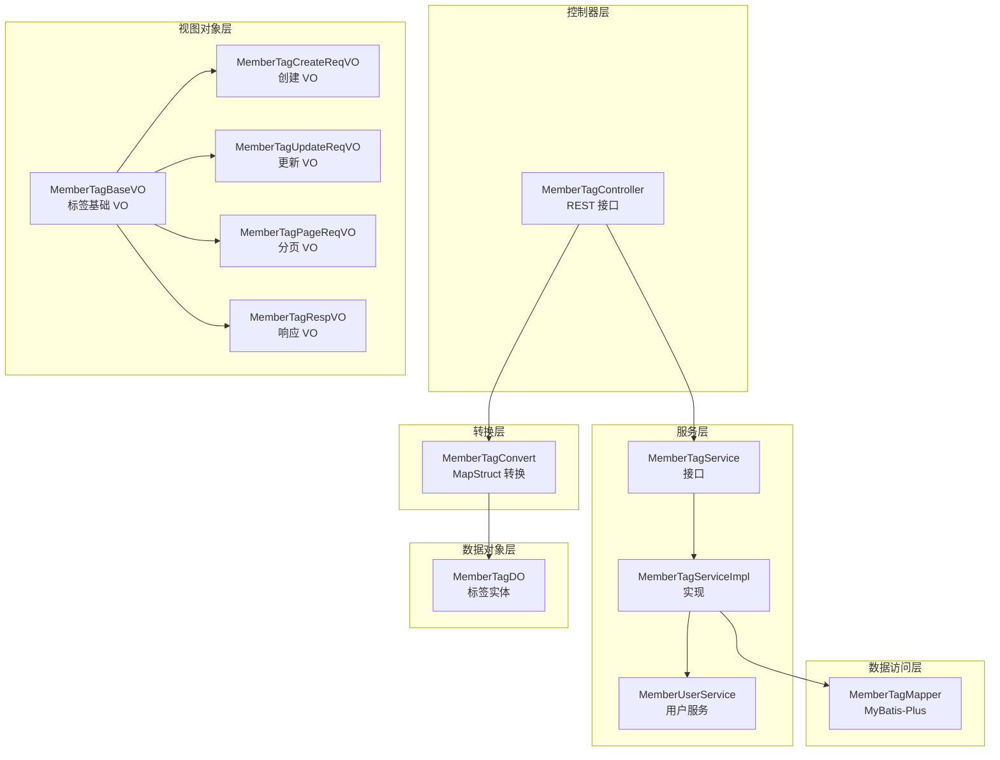
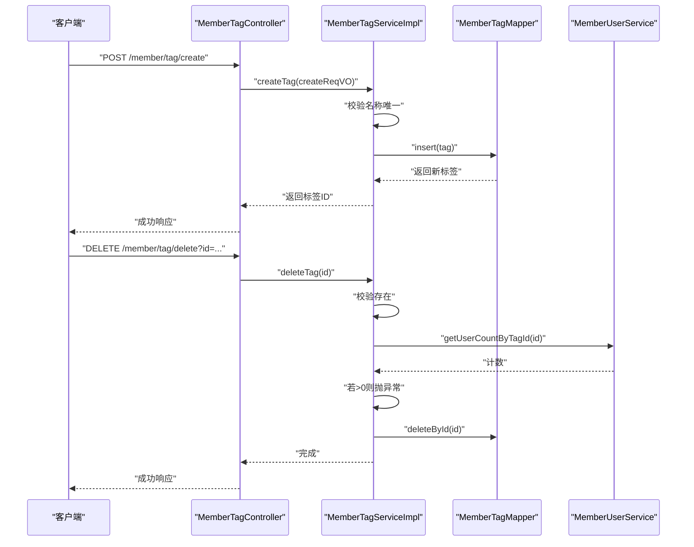
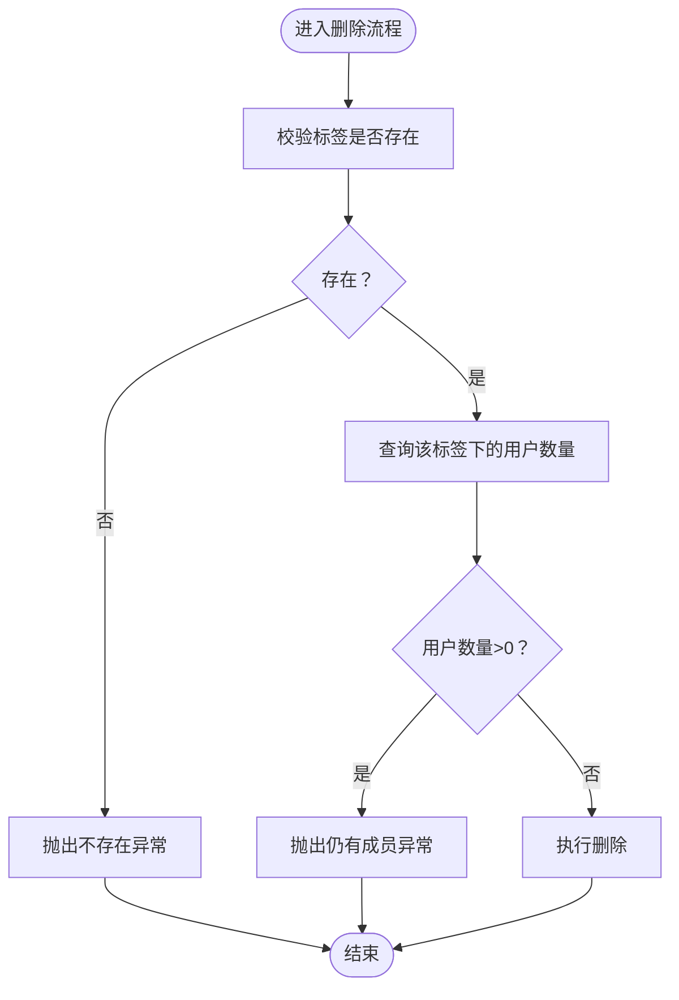
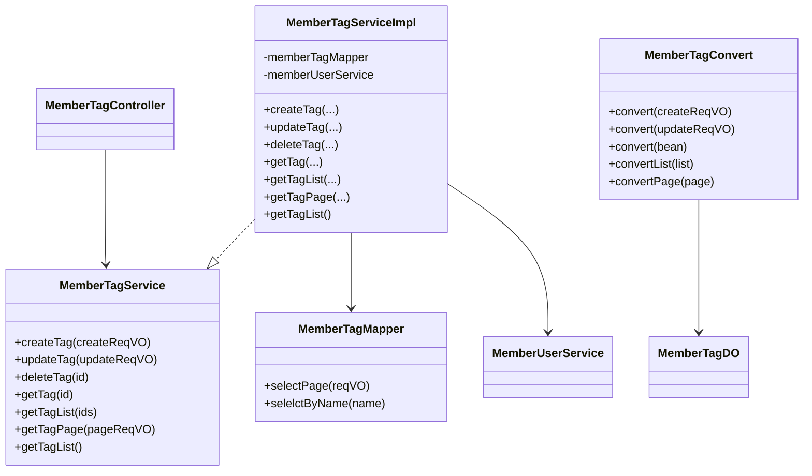
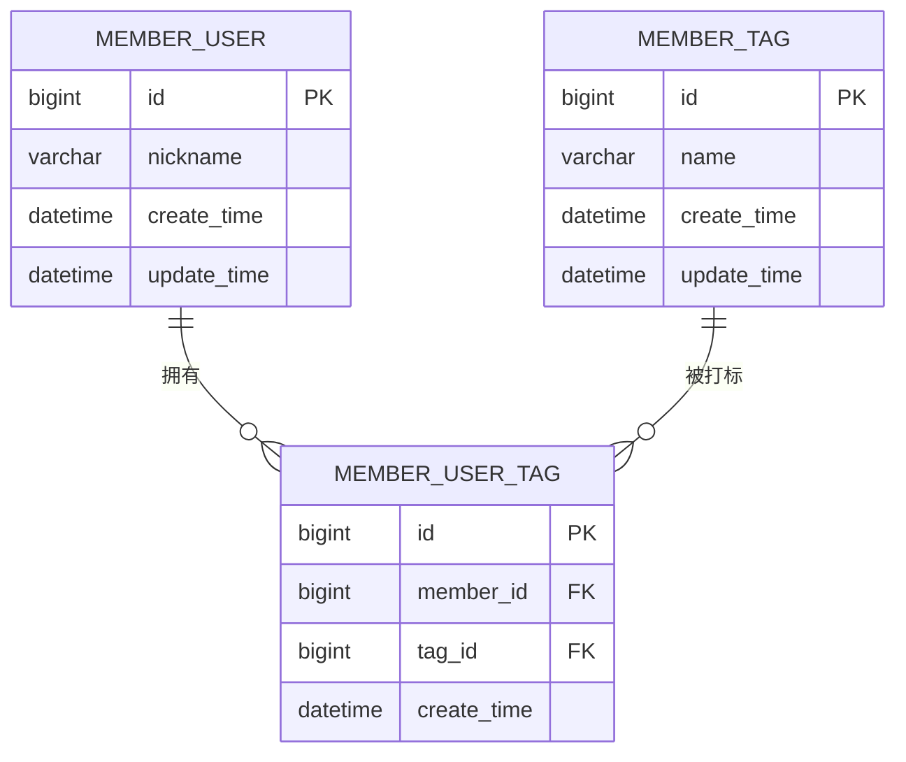

# 会员标签管理

<cite>
**本文引用的文件**
- [MemberTagController.java](file://yudao-module-member/src/main/java/cn/iocoder/yudao/module/member/controller/admin/tag/MemberTagController.java)
- [MemberTagService.java](file://yudao-module-member/src/main/java/cn/iocoder/yudao/module/member/service/tag/MemberTagService.java)
- [MemberTagServiceImpl.java](file://yudao-module-member/src/main/java/cn/iocoder/yudao/module/member/service/tag/MemberTagServiceImpl.java)
- [MemberTagMapper.java](file://yudao-module-member/src/main/java/cn/iocoder/yudao/module/member/dal/mysql/tag/MemberTagMapper.java)
- [MemberTagDO.java](file://yudao-module-member/src/main/java/cn/iocoder/yudao/module/member/dal/dataobject/tag/MemberTagDO.java)
- [MemberTagBaseVO.java](file://yudao-module-member/src/main/java/cn/iocoder/yudao/module/member/controller/admin/tag/vo/MemberTagBaseVO.java)
- [MemberTagCreateReqVO.java](file://yudao-module-member/src/main/java/cn/iocoder/yudao/module/member/controller/admin/tag/vo/MemberTagCreateReqVO.java)
- [MemberTagUpdateReqVO.java](file://yudao-module-member/src/main/java/cn/iocoder/yudao/module/member/controller/admin/tag/vo/MemberTagUpdateReqVO.java)
- [MemberTagPageReqVO.java](file://yudao-module-member/src/main/java/cn/iocoder/yudao/module/member/controller/admin/tag/vo/MemberTagPageReqVO.java)
- [MemberTagRespVO.java](file://yudao-module-member/src/main/java/cn/iocoder/yudao/module/member/controller/admin/tag/vo/MemberTagRespVO.java)
- [MemberTagConvert.java](file://yudao-module-member/src/main/java/cn/iocoder/yudao/module/member/convert/tag/MemberTagConvert.java)
- [MemberTagServiceImplTest.java](file://yudao-module-member/src/test/java/cn/iocoder/yudao/module/member/service/tag/MemberTagServiceImplTest.java)
- [MemberUserService.java](file://yudao-module-member/src/main/java/cn/iocoder/yudao/module/member/service/user/MemberUserService.java)
</cite>

## 目录
1. [简介](#简介)
2. [项目结构](#项目结构)
3. [核心组件](#核心组件)
4. [架构总览](#架构总览)
5. [详细组件分析](#详细组件分析)
6. [依赖分析](#依赖分析)
7. [性能考虑](#性能考虑)
8. [故障排查指南](#故障排查指南)
9. [结论](#结论)
10. [附录：数据模型与应用场景](#附录数据模型与应用场景)

## 简介
本技术文档围绕会员标签管理功能展开，系统性介绍标签分类、标签创建与管理、标签分配机制、统计分析以及与营销活动的结合方式。当前代码库实现了基础的“会员标签”能力，支持标签的增删改查、名称唯一性校验、删除前的“是否存在成员”校验等核心流程；同时预留了与“会员用户”服务交互以支撑后续标签分配与统计分析的扩展。

## 项目结构
会员标签相关代码位于会员模块中，采用典型的分层架构：
- 控制器层：提供 REST API，负责请求接入与权限控制
- 服务层：封装业务逻辑，执行校验与调用持久层
- 数据访问层：基于 MyBatis-Plus 提供通用 Mapper 能力
- 数据对象层：定义实体与表结构映射
- 视图对象层：DTO/VO，用于接口参数与响应体
- 转换层：MapStruct 将 VO 与 DO 进行转换

图表来源
- [MemberTagController.java:30-94](file://yudao-module-member/src/main/java/cn/iocoder/yudao/module/member/controller/admin/tag/MemberTagController.java#L30-L94)
- [MemberTagService.java:18-73](file://yudao-module-member/src/main/java/cn/iocoder/yudao/module/member/service/tag/MemberTagService.java#L18-L73)
- [MemberTagServiceImpl.java:31-125](file://yudao-module-member/src/main/java/cn/iocoder/yudao/module/member/service/tag/MemberTagServiceImpl.java#L31-L125)
- [MemberTagMapper.java:16-28](file://yudao-module-member/src/main/java/cn/iocoder/yudao/module/member/dal/mysql/tag/MemberTagMapper.java#L16-L28)
- [MemberTagDO.java:22-34](file://yudao-module-member/src/main/java/cn/iocoder/yudao/module/member/dal/dataobject/tag/MemberTagDO.java#L22-L34)
- [MemberTagBaseVO.java:13-19](file://yudao-module-member/src/main/java/cn/iocoder/yudao/module/member/controller/admin/tag/vo/MemberTagBaseVO.java#L13-L19)
- [MemberTagCreateReqVO.java:12-14](file://yudao-module-member/src/main/java/cn/iocoder/yudao/module/member/controller/admin/tag/vo/MemberTagCreateReqVO.java#L12-L14)
- [MemberTagUpdateReqVO.java:14-20](file://yudao-module-member/src/main/java/cn/iocoder/yudao/module/member/controller/admin/tag/vo/MemberTagUpdateReqVO.java#L14-L20)
- [MemberTagPageReqVO.java:18-27](file://yudao-module-member/src/main/java/cn/iocoder/yudao/module/member/controller/admin/tag/vo/MemberTagPageReqVO.java#L18-L27)
- [MemberTagRespVO.java:14-22](file://yudao-module-member/src/main/java/cn/iocoder/yudao/module/member/controller/admin/tag/vo/MemberTagRespVO.java#L14-L22)
- [MemberTagConvert.java:18-33](file://yudao-module-member/src/main/java/cn/iocoder/yudao/module/member/convert/tag/MemberTagConvert.java#L18-L33)

章节来源
- [MemberTagController.java:30-94](file://yudao-module-member/src/main/java/cn/iocoder/yudao/module/member/controller/admin/tag/MemberTagController.java#L30-L94)
- [MemberTagServiceImpl.java:31-125](file://yudao-module-member/src/main/java/cn/iocoder/yudao/module/member/service/tag/MemberTagServiceImpl.java#L31-L125)

## 核心组件
- 控制器：提供创建、更新、删除、查询、分页等接口，使用注解进行权限控制与参数校验
- 服务：实现标签创建、更新、删除、查询、分页等业务逻辑，包含名称唯一性校验与“是否存在成员”的删除前置校验
- 数据访问：提供分页查询、按名查询等基础能力
- 数据对象：定义标签实体，映射到 member_tag 表
- 视图对象：定义创建、更新、分页、响应等 VO
- 转换器：统一进行 VO 与 DO 的转换

章节来源
- [MemberTagService.java:18-73](file://yudao-module-member/src/main/java/cn/iocoder/yudao/module/member/service/tag/MemberTagService.java#L18-L73)
- [MemberTagServiceImpl.java:39-123](file://yudao-module-member/src/main/java/cn/iocoder/yudao/module/member/service/tag/MemberTagServiceImpl.java#L39-L123)
- [MemberTagMapper.java:18-27](file://yudao-module-member/src/main/java/cn/iocoder/yudao/module/member/dal/mysql/tag/MemberTagMapper.java#L18-L27)
- [MemberTagDO.java:22-34](file://yudao-module-member/src/main/java/cn/iocoder/yudao/module/member/dal/dataobject/tag/MemberTagDO.java#L22-L34)
- [MemberTagConvert.java:23-32](file://yudao-module-member/src/main/java/cn/iocoder/yudao/module/member/convert/tag/MemberTagConvert.java#L23-L32)

## 架构总览
从调用链看，控制器接收请求，调用服务层，服务层操作 Mapper 并与用户服务交互，最终返回 VO 结果。整体遵循“接口-实现-数据访问-实体-转换”的分层设计。

图表来源
- [MemberTagController.java:35-56](file://yudao-module-member/src/main/java/cn/iocoder/yudao/module/member/controller/admin/tag/MemberTagController.java#L35-L56)
- [MemberTagServiceImpl.java:40-100](file://yudao-module-member/src/main/java/cn/iocoder/yudao/module/member/service/tag/MemberTagServiceImpl.java#L40-L100)
- [MemberTagMapper.java:18-27](file://yudao-module-member/src/main/java/cn/iocoder/yudao/module/member/dal/mysql/tag/MemberTagMapper.java#L18-L27)
- [MemberUserService.java](file://yudao-module-member/src/main/java/cn/iocoder/yudao/module/member/service/user/MemberUserService.java)

## 详细组件分析

### 控制器层：MemberTagController
- 提供创建、更新、删除、详情、列表、分页等接口
- 使用权限注解进行安全控制
- 统一返回 CommonResult 包装结果
- 响应体使用 MemberTagRespVO

章节来源
- [MemberTagController.java:35-92](file://yudao-module-member/src/main/java/cn/iocoder/yudao/module/member/controller/admin/tag/MemberTagController.java#L35-L92)

### 服务层：MemberTagService 与 MemberTagServiceImpl
- 创建：校验名称唯一后插入
- 更新：校验存在与名称唯一后更新
- 删除：校验存在与“是否存在成员”，若存在成员则拒绝删除
- 查询：支持按 ID、ID 列表、分页、全部列表

图表来源
- [MemberTagServiceImpl.java:62-100](file://yudao-module-member/src/main/java/cn/iocoder/yudao/module/member/service/tag/MemberTagServiceImpl.java#L62-L100)

章节来源
- [MemberTagService.java:26-71](file://yudao-module-member/src/main/java/cn/iocoder/yudao/module/member/service/tag/MemberTagService.java#L26-L71)
- [MemberTagServiceImpl.java:39-123](file://yudao-module-member/src/main/java/cn/iocoder/yudao/module/member/service/tag/MemberTagServiceImpl.java#L39-L123)

### 数据访问层：MemberTagMapper
- 提供分页查询（按名称模糊、创建时间区间、降序）
- 提供按名称查询唯一记录

章节来源
- [MemberTagMapper.java:18-27](file://yudao-module-member/src/main/java/cn/iocoder/yudao/module/member/dal/mysql/tag/MemberTagMapper.java#L18-L27)

### 数据对象层：MemberTagDO
- 映射 member_tag 表，包含 id、name 字段
- 继承 BaseDO，具备通用审计字段

章节来源
- [MemberTagDO.java:22-34](file://yudao-module-member/src/main/java/cn/iocoder/yudao/module/member/dal/dataobject/tag/MemberTagDO.java#L22-L34)

### 视图对象层：MemberTagBaseVO 及其子类
- MemberTagBaseVO：定义标签名称字段及校验
- MemberTagCreateReqVO：继承 BaseVO，用于创建
- MemberTagUpdateReqVO：继承 BaseVO，并增加 id 字段
- MemberTagPageReqVO：分页查询参数（名称、创建时间区间）
- MemberTagRespVO：响应体，包含 id、createTime

章节来源
- [MemberTagBaseVO.java:13-19](file://yudao-module-member/src/main/java/cn/iocoder/yudao/module/member/controller/admin/tag/vo/MemberTagBaseVO.java#L13-L19)
- [MemberTagCreateReqVO.java:12-14](file://yudao-module-member/src/main/java/cn/iocoder/yudao/module/member/controller/admin/tag/vo/MemberTagCreateReqVO.java#L12-L14)
- [MemberTagUpdateReqVO.java:14-20](file://yudao-module-member/src/main/java/cn/iocoder/yudao/module/member/controller/admin/tag/vo/MemberTagUpdateReqVO.java#L14-L20)
- [MemberTagPageReqVO.java:18-27](file://yudao-module-member/src/main/java/cn/iocoder/yudao/module/member/controller/admin/tag/vo/MemberTagPageReqVO.java#L18-L27)
- [MemberTagRespVO.java:14-22](file://yudao-module-member/src/main/java/cn/iocoder/yudao/module/member/controller/admin/tag/vo/MemberTagRespVO.java#L14-L22)

### 转换层：MemberTagConvert
- 提供创建/更新 VO 到 DO 的转换
- 提供 DO 到 RespVO 的转换
- 提供列表与分页的批量转换

章节来源
- [MemberTagConvert.java:23-32](file://yudao-module-member/src/main/java/cn/iocoder/yudao/module/member/convert/tag/MemberTagConvert.java#L23-L32)

### 测试样例：MemberTagServiceImplTest
- 展示了创建、分页、列表、删除等典型用例
- 使用随机数据与断言工具验证行为

章节来源
- [MemberTagServiceImplTest.java:1-21](file://yudao-module-member/src/test/java/cn/iocoder/yudao/module/member/service/tag/MemberTagServiceImplTest.java#L1-L21)

## 依赖分析
- 控制器依赖服务接口
- 服务实现依赖 Mapper 与用户服务
- Mapper 继承通用基类，提供分页与条件查询能力
- 转换器独立于业务逻辑，便于维护

图表来源
- [MemberTagController.java:32-33](file://yudao-module-member/src/main/java/cn/iocoder/yudao/module/member/controller/admin/tag/MemberTagController.java#L32-L33)
- [MemberTagService.java:18-73](file://yudao-module-member/src/main/java/cn/iocoder/yudao/module/member/service/tag/MemberTagService.java#L18-L73)
- [MemberTagServiceImpl.java:33-37](file://yudao-module-member/src/main/java/cn/iocoder/yudao/module/member/service/tag/MemberTagServiceImpl.java#L33-L37)
- [MemberTagMapper.java:16-27](file://yudao-module-member/src/main/java/cn/iocoder/yudao/module/member/dal/mysql/tag/MemberTagMapper.java#L16-L27)
- [MemberTagDO.java:22-34](file://yudao-module-member/src/main/java/cn/iocoder/yudao/module/member/dal/dataobject/tag/MemberTagDO.java#L22-L34)
- [MemberTagConvert.java:18-33](file://yudao-module-member/src/main/java/cn/iocoder/yudao/module/member/convert/tag/MemberTagConvert.java#L18-L33)
- [MemberUserService.java](file://yudao-module-member/src/main/java/cn/iocoder/yudao/module/member/service/user/MemberUserService.java)

## 性能考虑
- 分页查询默认按 ID 倒序，有利于热点数据的快速定位
- 名称唯一性校验通过按名查询实现，建议在数据库层面建立唯一索引以减少重复校验开销
- 删除前的成员计数查询可在高并发场景下引入缓存或延迟检查策略，避免竞争条件
- 转换层使用 MapStruct，编译期生成映射代码，运行时性能稳定

## 故障排查指南
- 标签名冲突：创建/更新时若名称已存在会抛出异常，需调整名称
- 删除失败：当标签下仍有成员时会拒绝删除，需先清理成员关联再删除
- 查询不到数据：确认分页参数与名称过滤条件是否正确

章节来源
- [MemberTagServiceImpl.java:77-100](file://yudao-module-member/src/main/java/cn/iocoder/yudao/module/member/service/tag/MemberTagServiceImpl.java#L77-L100)
- [MemberTagMapper.java:18-27](file://yudao-module-member/src/main/java/cn/iocoder/yudao/module/member/dal/mysql/tag/MemberTagMapper.java#L18-L27)

## 结论
当前会员标签系统提供了完整的标签生命周期管理能力，具备良好的扩展性。后续可在以下方向演进：
- 引入标签分类体系（基础/行为/偏好等），并扩展标签属性（颜色、描述、类型等）
- 引入标签分配机制（手动/自动/条件触发），并与用户服务打通
- 增加标签统计分析（分布、效果评估）与营销活动联动（精准推送、活动筛选）

## 附录：数据模型与应用场景

### 数据模型设计
- 标签表：member_tag
  - 字段：id（主键）、name（标签名称）、create_time、update_time（继承 BaseDO）
- 成员标签关系表（建议新增）
  - 字段：id、member_id、tag_id、create_time
  - 约束：member_id+tag_id 唯一索引，便于快速查询成员标签集合与标签成员集合

说明
- 当前仓库仅提供标签实体与基础 CRUD 能力，上述关系表为后续扩展建议

### 标签分类体系（设计建议）
- 基础标签：性别、年龄、城市等静态属性
- 行为标签：浏览、加购、下单、支付等行为事件
- 偏好标签：品类偏好、价格敏感度、促销偏好等偏好特征
- 类型扩展：在 MemberTagDO 中增加 type 字段，并在 MemberTagMapper/Service 中增加类型过滤与校验

### 标签创建与管理（属性建议）
- 标签名称：必填且唯一
- 标签描述：用于说明用途与定义
- 标签颜色：用于前端展示区分
- 标签类型：用于分类检索与统计
- 状态开关：启用/停用，用于控制是否参与计算与下发

### 标签分配机制（设计建议）
- 手动分配：管理员在用户详情页直接打标
- 自动分配：基于规则引擎或定时任务，根据行为/偏好自动打标
- 条件触发：满足阈值（如消费金额、频次、时长）后自动打标
- 关系表：记录分配时间、分配来源（手动/自动）、规则标识等

### 标签统计分析（设计建议）
- 标签分布：各标签成员数量、占比、趋势
- 标签效果：不同标签群体的转化率、客单价、复购率等指标
- 导出与报表：支持按标签维度导出用户画像与行为分析

### 营销活动结合（设计建议）
- 活动筛选：按标签筛选目标人群
- 精准推送：根据标签组合定向推送消息/优惠券
- 个性化推荐：标签作为特征输入到推荐系统
- 效果评估：对比不同标签群体的活动效果，优化标签体系与规则