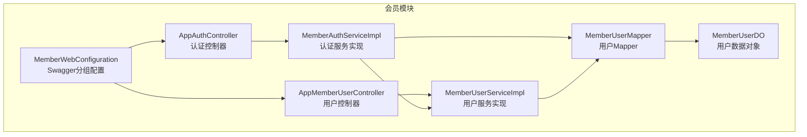
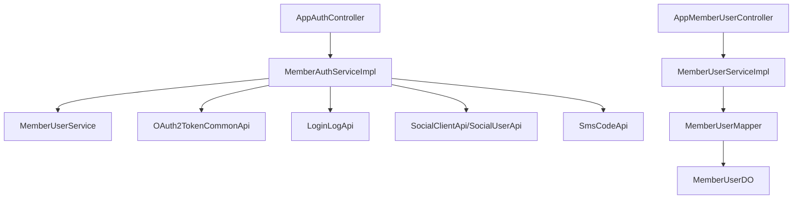
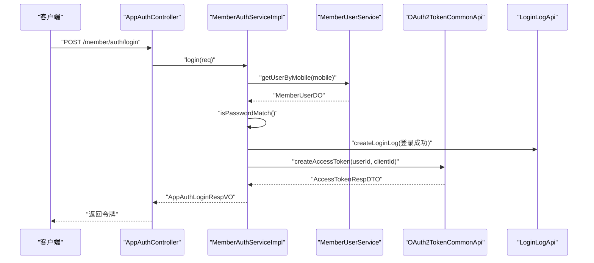
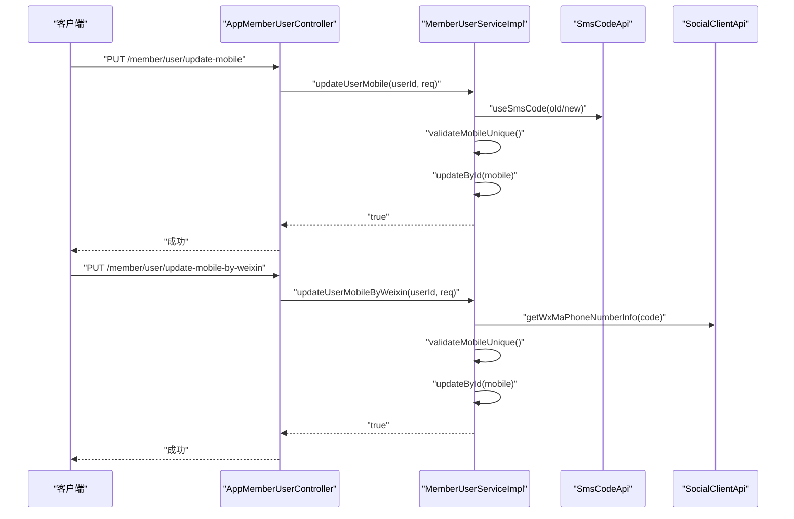
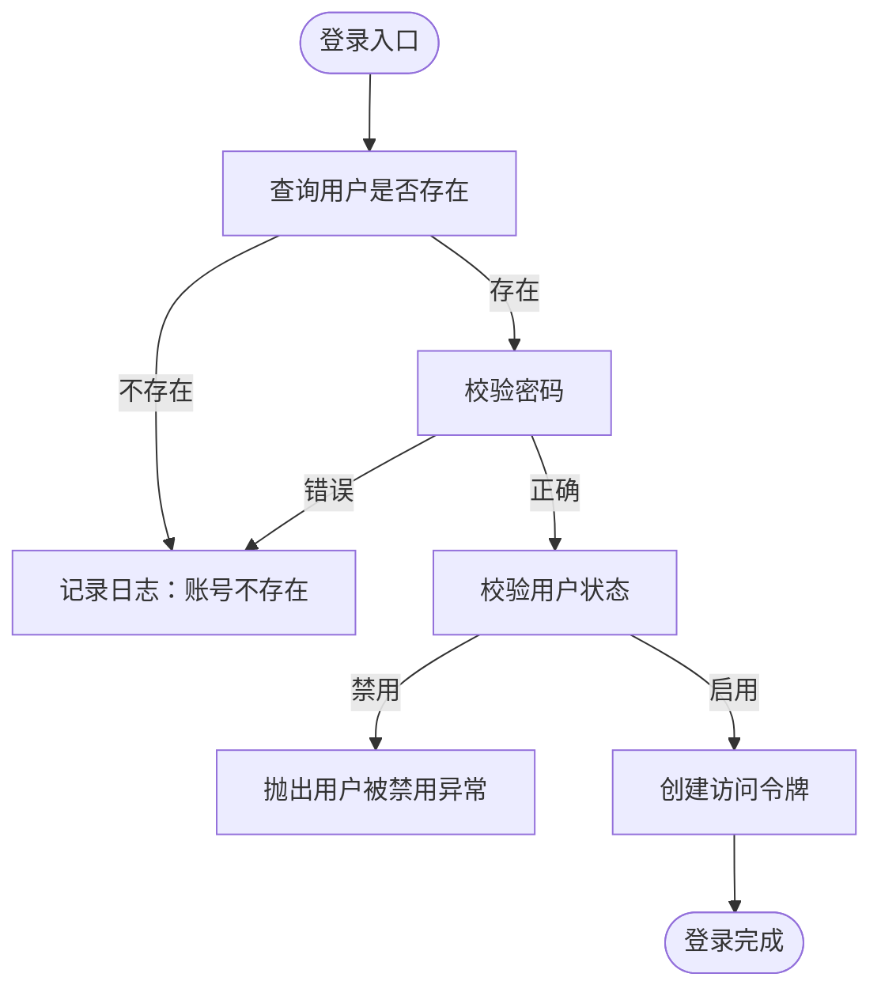
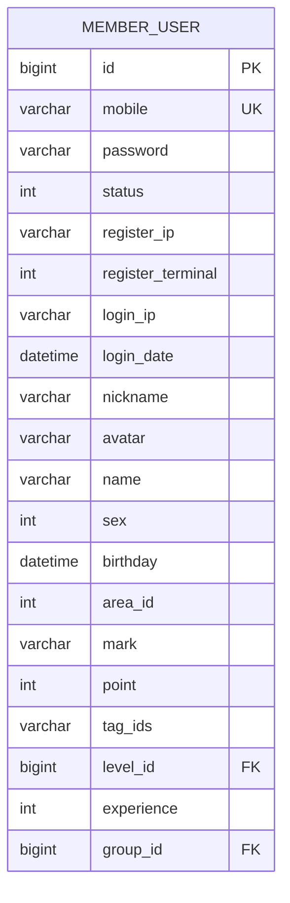
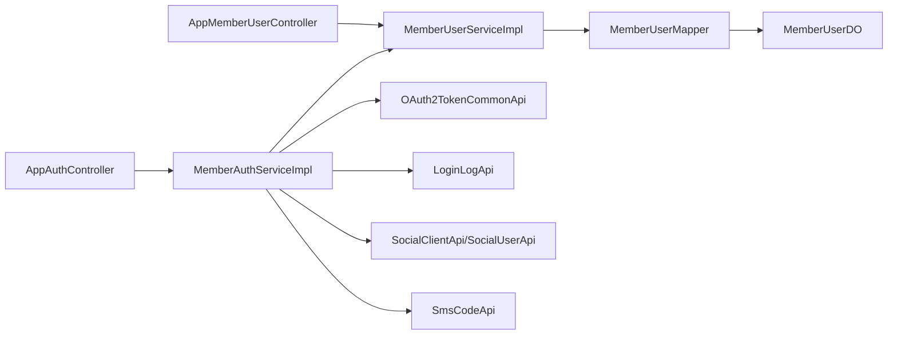

# 会员用户管理

<cite>
**本文引用的文件**
- [AppAuthController.java](file://yudao-module-member/src/main/java/cn/iocoder/yudao/module/member/controller/app/auth/AppAuthController.java)
- [MemberAuthServiceImpl.java](file://yudao-module-member/src/main/java/cn/iocoder/yudao/module/member/service/auth/MemberAuthServiceImpl.java)
- [MemberUserServiceImpl.java](file://yudao-module-member/src/main/java/cn/iocoder/yudao/module/member/service/user/MemberUserServiceImpl.java)
- [MemberUserMapper.java](file://yudao-module-member/src/main/java/cn/iocoder/yudao/module/member/dal/mysql/user/MemberUserMapper.java)
- [MemberUserDO.java](file://yudao-module-member/src/main/java/cn/iocoder/yudao/module/member/dal/dataobject/user/MemberUserDO.java)
- [AppMemberUserController.java](file://yudao-module-member/src/main/java/cn/iocoder/yudao/module/member/controller/app/user/AppMemberUserController.java)
- [MemberWebConfiguration.java](file://yudao-module-member/src/main/java/cn/iocoder/yudao/module/member/framework/web/config/MemberWebConfiguration.java)
- [member-2024-01-18.sql](file://sql/module/member-2024-01-18.sql)
</cite>

## 目录
1. [简介](#简介)
2. [项目结构](#项目结构)
3. [核心组件](#核心组件)
4. [架构总览](#架构总览)
5. [详细组件分析](#详细组件分析)
6. [依赖分析](#依赖分析)
7. [性能考虑](#性能考虑)
8. [故障排查指南](#故障排查指南)
9. [结论](#结论)
10. [附录](#附录)

## 简介
本技术文档围绕会员用户管理功能展开，覆盖以下方面：
- 会员基本信息管理：昵称、头像、性别、生日、所在地、备注等基础信息维护。
- 注册与登录机制：手机号+密码登录、手机验证码登录、社交授权登录、微信小程序一键登录、JWT/OAuth2 令牌管理与刷新。
- 会员状态管理：正常、冻结、注销等状态切换逻辑与限制。
- 会员信息完善：修改基本信息、头像上传、实名认证（预留）、修改手机号（含微信授权）、修改/重置密码。
- 数据模型设计：用户表结构、字段含义、索引与约束。
- API 接口文档与调用示例：RESTful 接口定义、请求参数、响应结构与典型流程。

## 项目结构
会员用户管理位于 yudao-module-member 模块中，采用典型的分层架构：
- controller 层：对外暴露 RESTful 接口，负责请求接收、鉴权与结果封装。
- service 层：业务逻辑编排，协调用户、认证、短信、社交、日志、OAuth2 等能力。
- dal 层：MyBatis 映射，提供数据访问与聚合查询。
- 数据对象：MemberUserDO 描述用户实体，包含账号、基础信息、积分/等级/标签等。
- 配置：Swagger 分组配置，统一暴露 member 模块接口。

图表来源
- [AppAuthController.java:1-136](file://yudao-module-member/src/main/java/cn/iocoder/yudao/module/member/controller/app/auth/AppAuthController.java#L1-L136)
- [AppMemberUserController.java:1-78](file://yudao-module-member/src/main/java/cn/iocoder/yudao/module/member/controller/app/user/AppMemberUserController.java#L1-L78)
- [MemberAuthServiceImpl.java:1-286](file://yudao-module-member/src/main/java/cn/iocoder/yudao/module/member/service/auth/MemberAuthServiceImpl.java#L1-L286)
- [MemberUserServiceImpl.java:1-318](file://yudao-module-member/src/main/java/cn/iocoder/yudao/module/member/service/user/MemberUserServiceImpl.java#L1-L318)
- [MemberUserMapper.java:1-97](file://yudao-module-member/src/main/java/cn/iocoder/yudao/module/member/dal/mysql/user/MemberUserMapper.java#L1-L97)
- [MemberUserDO.java:1-146](file://yudao-module-member/src/main/java/cn/iocoder/yudao/module/member/dal/dataobject/user/MemberUserDO.java#L1-L146)
- [MemberWebConfiguration.java:1-24](file://yudao-module-member/src/main/java/cn/iocoder/yudao/module/member/framework/web/config/MemberWebConfiguration.java#L1-L24)

章节来源
- [AppAuthController.java:1-136](file://yudao-module-member/src/main/java/cn/iocoder/yudao/module/member/controller/app/auth/AppAuthController.java#L1-L136)
- [AppMemberUserController.java:1-78](file://yudao-module-member/src/main/java/cn/iocoder/yudao/module/member/controller/app/user/AppMemberUserController.java#L1-L78)
- [MemberAuthServiceImpl.java:1-286](file://yudao-module-member/src/main/java/cn/iocoder/yudao/module/member/service/auth/MemberAuthServiceImpl.java#L1-L286)
- [MemberUserServiceImpl.java:1-318](file://yudao-module-member/src/main/java/cn/iocoder/yudao/module/member/service/user/MemberUserServiceImpl.java#L1-L318)
- [MemberUserMapper.java:1-97](file://yudao-module-member/src/main/java/cn/iocoder/yudao/module/member/dal/mysql/user/MemberUserMapper.java#L1-L97)
- [MemberUserDO.java:1-146](file://yudao-module-member/src/main/java/cn/iocoder/yudao/module/member/dal/dataobject/user/MemberUserDO.java#L1-L146)
- [MemberWebConfiguration.java:1-24](file://yudao-module-member/src/main/java/cn/iocoder/yudao/module/member/framework/web/config/MemberWebConfiguration.java#L1-L24)

## 核心组件
- 认证控制器 AppAuthController：提供登录、登出、刷新令牌、短信验证码发送/校验、社交授权跳转、微信小程序一键登录、微信 JS-SDK 签名等接口。
- 认证服务 MemberAuthServiceImpl：实现账号密码登录、短信验证码登录、社交授权登录、微信小程序一键登录、令牌创建/刷新/删除、登录/登出日志记录。
- 用户控制器 AppMemberUserController：提供获取/更新用户信息、修改手机号（含微信授权）、修改/重置密码等接口。
- 用户服务 MemberUserServiceImpl：实现用户创建（按需）、手机号唯一性校验、密码加密与匹配、登录信息更新、等级/经验/积分/标签统计等。
- 用户 Mapper MemberUserMapper：提供按手机号查询、分页查询、标签集合查询、积分增减等数据访问方法。
- 用户数据对象 MemberUserDO：定义用户表字段、索引与关联关系，涵盖账号、基础信息、积分/等级/标签、注册/登录信息等。

章节来源
- [AppAuthController.java:1-136](file://yudao-module-member/src/main/java/cn/iocoder/yudao/module/member/controller/app/auth/AppAuthController.java#L1-L136)
- [MemberAuthServiceImpl.java:1-286](file://yudao-module-member/src/main/java/cn/iocoder/yudao/module/member/service/auth/MemberAuthServiceImpl.java#L1-L286)
- [AppMemberUserController.java:1-78](file://yudao-module-member/src/main/java/cn/iocoder/yudao/module/member/controller/app/user/AppMemberUserController.java#L1-L78)
- [MemberUserServiceImpl.java:1-318](file://yudao-module-member/src/main/java/cn/iocoder/yudao/module/member/service/user/MemberUserServiceImpl.java#L1-L318)
- [MemberUserMapper.java:1-97](file://yudao-module-member/src/main/java/cn/iocoder/yudao/module/member/dal/mysql/user/MemberUserMapper.java#L1-L97)
- [MemberUserDO.java:1-146](file://yudao-module-member/src/main/java/cn/iocoder/yudao/module/member/dal/dataobject/user/MemberUserDO.java#L1-L146)

## 架构总览
会员用户管理采用“控制器-服务-数据访问-数据对象”的分层设计，并通过外部能力集成实现完整闭环：
- 认证链路：AppAuthController → MemberAuthServiceImpl → MemberUserService（按需创建/查询）→ OAuth2TokenCommonApi（令牌创建/刷新/删除）→ LoginLogApi（登录/登出日志）。
- 用户链路：AppMemberUserController → MemberUserServiceImpl → MemberUserMapper → MemberUserDO。
- 社交/短信：MemberAuthServiceImpl 调用 System 模块的 SocialClientApi/SocialUserApi/SmsCodeApi 完成授权、绑定与短信校验。

图表来源
- [AppAuthController.java:1-136](file://yudao-module-member/src/main/java/cn/iocoder/yudao/module/member/controller/app/auth/AppAuthController.java#L1-L136)
- [MemberAuthServiceImpl.java:1-286](file://yudao-module-member/src/main/java/cn/iocoder/yudao/module/member/service/auth/MemberAuthServiceImpl.java#L1-L286)
- [MemberUserServiceImpl.java:1-318](file://yudao-module-member/src/main/java/cn/iocoder/yudao/module/member/service/user/MemberUserServiceImpl.java#L1-L318)
- [MemberUserMapper.java:1-97](file://yudao-module-member/src/main/java/cn/iocoder/yudao/module/member/dal/mysql/user/MemberUserMapper.java#L1-L97)
- [MemberUserDO.java:1-146](file://yudao-module-member/src/main/java/cn/iocoder/yudao/module/member/dal/dataobject/user/MemberUserDO.java#L1-L146)

## 详细组件分析

### 认证与登录机制
- 手机号+密码登录：校验账号存在与密码正确性，检查状态是否启用，创建访问令牌并记录登录日志。
- 手机验证码登录：校验验证码有效性，按需创建用户，检查状态，创建访问令牌并记录日志。
- 社交登录：根据授权码获取社交用户信息，若已绑定则直接登录，否则创建用户并绑定，再创建访问令牌。
- 微信小程序一键登录：通过 phoneCode 获取手机号，按需创建用户并绑定社交用户，创建访问令牌。
- 刷新令牌：基于 refresh_token 刷新访问令牌。
- 登出：删除访问令牌并记录登出日志。
- 微信 JS-SDK 签名：生成前端初始化所需签名。

图表来源
- [AppAuthController.java:45-50](file://yudao-module-member/src/main/java/cn/iocoder/yudao/module/member/controller/app/auth/AppAuthController.java#L45-L50)
- [MemberAuthServiceImpl.java:63-77](file://yudao-module-member/src/main/java/cn/iocoder/yudao/module/member/service/auth/MemberAuthServiceImpl.java#L63-L77)
- [MemberUserServiceImpl.java:67-70](file://yudao-module-member/src/main/java/cn/iocoder/yudao/module/member/service/user/MemberUserServiceImpl.java#L67-L70)

章节来源
- [AppAuthController.java:45-133](file://yudao-module-member/src/main/java/cn/iocoder/yudao/module/member/controller/app/auth/AppAuthController.java#L45-L133)
- [MemberAuthServiceImpl.java:63-170](file://yudao-module-member/src/main/java/cn/iocoder/yudao/module/member/service/auth/MemberAuthServiceImpl.java#L63-L170)

### 会员信息完善与修改
- 获取基本信息：结合等级信息返回用户详情。
- 修改基本信息：昵称、头像、性别、生日、所在地、备注等。
- 修改手机号：
  - 传统短信验证码方式：校验旧/新验证码，更新手机号。
  - 微信授权方式：通过 phoneCode 获取手机号并校验唯一性后更新。
- 修改密码：使用验证码校验后更新加密密码。
- 重置密码：针对忘记密码场景，校验手机号存在后使用验证码重置。

图表来源
- [AppMemberUserController.java:49-61](file://yudao-module-member/src/main/java/cn/iocoder/yudao/module/member/controller/app/user/AppMemberUserController.java#L49-L61)
- [MemberUserServiceImpl.java:150-182](file://yudao-module-member/src/main/java/cn/iocoder/yudao/module/member/service/user/MemberUserServiceImpl.java#L150-L182)

章节来源
- [AppMemberUserController.java:34-76](file://yudao-module-member/src/main/java/cn/iocoder/yudao/module/member/controller/app/user/AppMemberUserController.java#L34-L76)
- [MemberUserServiceImpl.java:143-209](file://yudao-module-member/src/main/java/cn/iocoder/yudao/module/member/service/user/MemberUserServiceImpl.java#L143-L209)

### 会员状态管理
- 正常：默认启用，允许登录与业务操作。
- 冻结：当用户状态为禁用时，登录将被拒绝并记录相应日志。
- 注销：当前实现未见显式注销接口，通常通过业务策略或管理员操作实现。

图表来源
- [MemberAuthServiceImpl.java:172-190](file://yudao-module-member/src/main/java/cn/iocoder/yudao/module/member/service/auth/MemberAuthServiceImpl.java#L172-L190)

章节来源
- [MemberAuthServiceImpl.java:172-190](file://yudao-module-member/src/main/java/cn/iocoder/yudao/module/member/service/auth/MemberAuthServiceImpl.java#L172-L190)

### 数据模型设计
用户表结构与字段说明（部分关键字段）：
- 账号信息：id、mobile（唯一索引）、password（加密存储）、status、registerIp/registerTerminal、loginIp/loginDate。
- 基础信息：nickname、avatar、name、sex、birthday、areaId、mark。
- 其它信息：point、tagIds（逗号分隔的标签ID列表）、levelId、experience、groupId。
- 索引与约束：uk_mobile 索引基于 mobile 字段；密码使用 BCrypt 加密；状态枚举来自通用状态枚举。

图表来源
- [MemberUserDO.java:21-146](file://yudao-module-member/src/main/java/cn/iocoder/yudao/module/member/dal/dataobject/user/MemberUserDO.java#L21-L146)
- [member-2024-01-18.sql](file://sql/module/member-2024-01-18.sql)

章节来源
- [MemberUserDO.java:21-146](file://yudao-module-member/src/main/java/cn/iocoder/yudao/module/member/dal/dataobject/user/MemberUserDO.java#L21-L146)
- [member-2024-01-18.sql](file://sql/module/member-2024-01-18.sql)

## 依赖分析
- 控制器依赖服务：AppAuthController 与 AppMemberUserController 分别注入 MemberAuthService 与 MemberUserService。
- 服务间依赖：MemberAuthServiceImpl 依赖 MemberUserService、SmsCodeApi、SocialUserApi、SocialClientApi、OAuth2TokenCommonApi、LoginLogApi。
- 数据访问依赖：MemberUserServiceImpl 依赖 MemberUserMapper 与 SmsCodeApi、SocialClientApi。
- 外部能力：OAuth2 令牌、登录日志、短信验证码、社交授权与微信小程序能力由系统模块提供。

图表来源
- [AppAuthController.java:1-136](file://yudao-module-member/src/main/java/cn/iocoder/yudao/module/member/controller/app/auth/AppAuthController.java#L1-L136)
- [AppMemberUserController.java:1-78](file://yudao-module-member/src/main/java/cn/iocoder/yudao/module/member/controller/app/user/AppMemberUserController.java#L1-L78)
- [MemberAuthServiceImpl.java:1-286](file://yudao-module-member/src/main/java/cn/iocoder/yudao/module/member/service/auth/MemberAuthServiceImpl.java#L1-L286)
- [MemberUserServiceImpl.java:1-318](file://yudao-module-member/src/main/java/cn/iocoder/yudao/module/member/service/user/MemberUserServiceImpl.java#L1-L318)
- [MemberUserMapper.java:1-97](file://yudao-module-member/src/main/java/cn/iocoder/yudao/module/member/dal/mysql/user/MemberUserMapper.java#L1-L97)
- [MemberUserDO.java:1-146](file://yudao-module-member/src/main/java/cn/iocoder/yudao/module/member/dal/dataobject/user/MemberUserDO.java#L1-L146)

章节来源
- [MemberAuthServiceImpl.java:1-286](file://yudao-module-member/src/main/java/cn/iocoder/yudao/module/member/service/auth/MemberAuthServiceImpl.java#L1-L286)
- [MemberUserServiceImpl.java:1-318](file://yudao-module-member/src/main/java/cn/iocoder/yudao/module/member/service/user/MemberUserServiceImpl.java#L1-L318)

## 性能考虑
- 登录校验：密码校验使用 BCrypt，建议在高并发场景下缓存热点用户的基础信息（如昵称、头像），降低数据库压力。
- 令牌创建：OAuth2 令牌创建与刷新应结合 Redis 缓存与合理的过期策略，避免频繁持久化。
- 短信验证码：发送与校验应配合限流与去重，防止刷量与重复使用。
- 分页查询：用户分页查询支持多条件过滤，建议对高频查询建立合适索引（如 mobile、levelId、groupId、tag_ids）。
- 积分增减：使用 SQL 直接累加/扣减，避免读取-计算-回写模式，减少锁竞争。

## 故障排查指南
- 登录失败（账号不存在/密码错误）：检查手机号是否正确、密码是否加密匹配、用户状态是否启用。
- 登录被禁用：确认用户状态为启用，查看登录日志记录。
- 短信验证码问题：核对场景（登录/修改手机/重置密码/修改密码）、验证码是否过期、手机号是否已被占用（修改手机场景）。
- 微信授权失败：确认 phoneCode 是否有效、手机号是否唯一、微信授权回调配置是否正确。
- 令牌刷新失败：确认 refresh_token 是否有效、客户端ID是否匹配。
- 登出无效：确认传入的 token 是否正确、是否已过期或被删除。

章节来源
- [MemberAuthServiceImpl.java:221-251](file://yudao-module-member/src/main/java/cn/iocoder/yudao/module/member/service/auth/MemberAuthServiceImpl.java#L221-L251)
- [MemberUserServiceImpl.java:150-182](file://yudao-module-member/src/main/java/cn/iocoder/yudao/module/member/service/user/MemberUserServiceImpl.java#L150-L182)

## 结论
会员用户管理模块通过清晰的分层设计与完善的外部能力集成，实现了从注册、登录、信息维护到状态管理的完整闭环。认证与用户服务职责明确，数据模型简洁且扩展性强。建议在生产环境中进一步完善注销流程、优化高频查询索引与缓存策略，并加强安全防护与监控告警。

## 附录

### API 接口文档（摘要）
- 认证相关
  - POST /member/auth/login：手机号+密码登录
  - POST /member/auth/logout：登出（基于请求头中的令牌）
  - POST /member/auth/refresh-token：刷新访问令牌
  - POST /member/auth/sms-login：手机+验证码登录
  - POST /member/auth/send-sms-code：发送验证码（支持修改手机/重置密码/修改密码等场景）
  - POST /member/auth/validate-sms-code：校验验证码
  - GET /member/auth/social-auth-redirect：社交授权跳转地址
  - POST /member/auth/social-login：社交快捷登录
  - POST /member/auth/weixin-mini-app-login：微信小程序一键登录
  - POST /member/auth/create-weixin-jsapi-signature：生成微信 JS-SDK 签名

- 用户信息相关
  - GET /member/user/get：获取当前用户基本信息（含等级）
  - PUT /member/user/update：修改基本信息
  - PUT /member/user/update-mobile：修改手机号（短信验证码）
  - PUT /member/user/update-mobile-by-weixin：基于微信授权修改手机号
  - PUT /member/user/update-password：修改密码（短信验证码）
  - PUT /member/user/reset-password：重置密码（短信验证码）

章节来源
- [AppAuthController.java:45-133](file://yudao-module-member/src/main/java/cn/iocoder/yudao/module/member/controller/app/auth/AppAuthController.java#L45-L133)
- [AppMemberUserController.java:34-76](file://yudao-module-member/src/main/java/cn/iocoder/yudao/module/member/controller/app/user/AppMemberUserController.java#L34-L76)