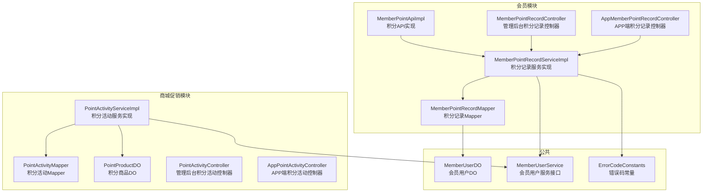
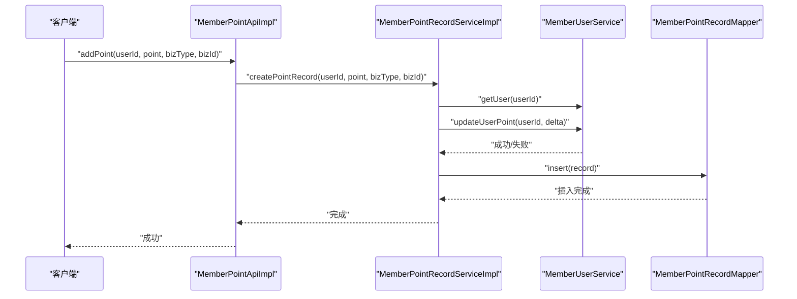
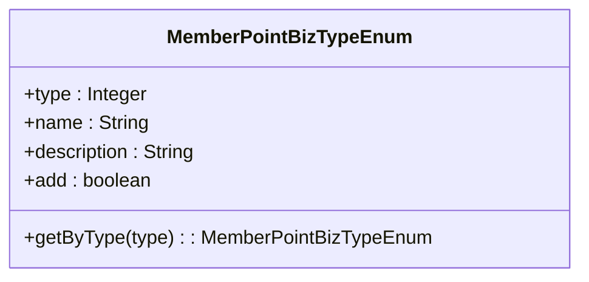
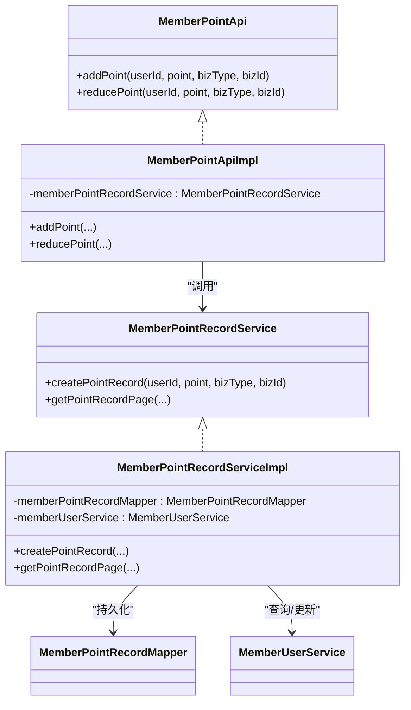
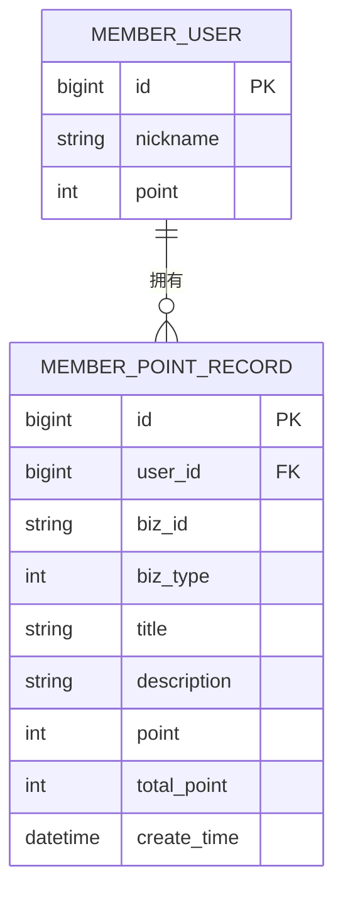
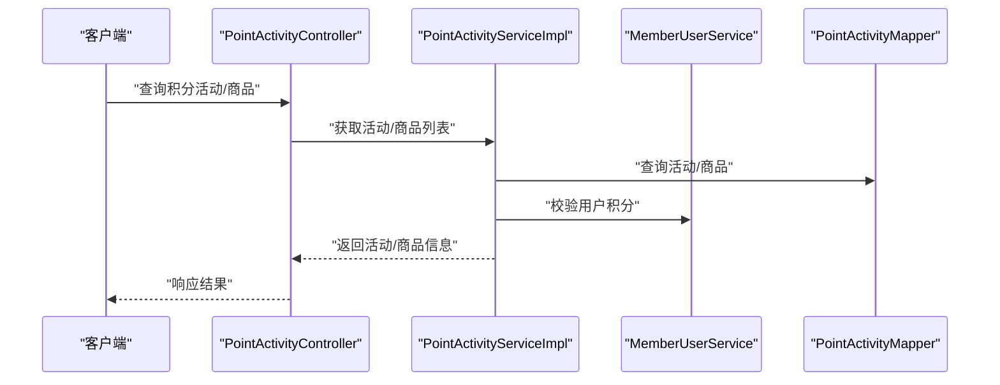
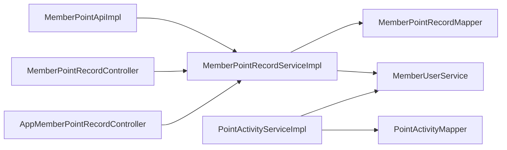

# 会员积分系统

<cite>
**本文引用的文件列表**
- [MemberPointRecordDO.java](file://qiji-module-member/src/main/java/com.qiji.cps/module/member/dal/dataobject/point/MemberPointRecordDO.java)
- [MemberPointBizTypeEnum.java](file://qiji-module-member/src/main/java/com.qiji.cps/module/member/enums/point/MemberPointBizTypeEnum.java)
- [MemberPointApi.java](file://qiji-module-member/src/main/java/com.qiji.cps/module/member/api/point/MemberPointApi.java)
- [MemberPointApiImpl.java](file://qiji-module-member/src/main/java/com.qiji.cps/module/member/api/point/MemberPointApiImpl.java)
- [MemberPointRecordService.java](file://qiji-module-member/src/main/java/com.qiji.cps/module/member/service/point/MemberPointRecordService.java)
- [MemberPointRecordServiceImpl.java](file://qiji-module-member/src/main/java/com.qiji.cps/module/member/service/point/MemberPointRecordServiceImpl.java)
- [MemberPointRecordMapper.java](file://qiji-module-member/src/main/java/com.qiji.cps/module/member/dal/mysql/point/MemberPointRecordMapper.java)
- [MemberPointRecordController.java](file://qiji-module-member/src/main/java/com.qiji.cps/module/member/controller/admin/point/MemberPointRecordController.java)
- [AppMemberPointRecordController.java](file://qiji-module-member/src/main/java/com.qiji.cps/module/member/controller/app/point/AppMemberPointRecordController.java)
- [PointActivityDO.java](file://qiji-module-mall/qiji-module-promotion/src/main/java/com.qiji.cps/module/promotion/dal/dataobject/point/PointActivityDO.java)
- [PointProductDO.java](file://qiji-module-mall/qiji-module-promotion/src/main/java/com.qiji.cps/module/promotion/dal/dataobject/point/PointProductDO.java)
- [PointActivityService.java](file://qiji-module-mall/qiji-module-promotion/src/main/java/com.qiji.cps/module/promotion/service/point/PointActivityService.java)
- [PointActivityServiceImpl.java](file://qiji-module-mall/qiji-module-promotion/src/main/java/com.qiji.cps/module/promotion/service/point/PointActivityServiceImpl.java)
- [PointActivityController.java](file://qiji-module-mall/qiji-module-promotion/src/main/java/com.qiji.cps/module/promotion/controller/admin/point/PointActivityController.java)
- [AppPointActivityController.java](file://qiji-module-mall/qiji-module-promotion/src/main/java/com.qiji.cps/module/promotion/controller/app/point/AppPointActivityController.java)
- [PointActivityApi.java](file://qiji-module-mall/qiji-module-promotion/src/main/java/com.qiji.cps/module/promotion/api/point/PointActivityApi.java)
- [PointActivityApiImpl.java](file://qiji-module-mall/qiji-module-promotion/src/main/java/com.qiji.cps/module/promotion/api/point/PointActivityApiImpl.java)
- [MemberUserDO.java](file://qiji-module-member/src/main/java/com.qiji.cps/module/member/dal/dataobject/user/MemberUserDO.java)
- [MemberUserService.java](file://qiji-module-member/src/main/java/com.qiji.cps/module/member/service/user/MemberUserService.java)
- [ErrorCodeConstants.java](file://qiji-module-member/src/main/java/com.qiji.cps/module/member/enums/ErrorCodeConstants.java)
- [ErrorCodeConstantsPromotion.java](file://qiji-module-mall/qiji-module-promotion/src/main/java/com.qiji.cps/module/promotion/enums/ErrorCodeConstants.java)
</cite>

## 目录
1. [简介](#简介)
2. [项目结构](#项目结构)
3. [核心组件](#核心组件)
4. [架构总览](#架构总览)
5. [详细组件分析](#详细组件分析)
6. [依赖关系分析](#依赖关系分析)
7. [性能考量](#性能考量)
8. [故障排查指南](#故障排查指南)
9. [结论](#结论)
10. [附录](#附录)

## 简介
本技术文档围绕会员积分系统展开，系统覆盖积分获取、积分消费、积分记录与审计、以及与促销活动（如积分商品、积分活动）的协同。文档从代码级视角解析系统设计与实现，帮助开发者与产品人员快速理解并扩展功能。

## 项目结构
会员积分系统主要分布在以下模块：
- 会员模块：负责积分账户、积分记录、积分业务类型定义、API与服务实现、控制器与数据访问层。
- 商城促销模块：负责积分活动与积分商品，支撑积分抵扣、积分兑换等消费场景。
- 公共框架：提供基础能力（分页、MyBatis 封装、异常码等），被上述模块复用。

图表来源
- [MemberPointApiImpl.java:1-50](file://qiji-module-member/src/main/java/com.qiji.cps/module/member/api/point/MemberPointApiImpl.java#L1-L50)
- [MemberPointRecordServiceImpl.java:1-97](file://qiji-module-member/src/main/java/com.qiji.cps/module/member/service/point/MemberPointRecordServiceImpl.java#L1-L97)
- [MemberPointRecordMapper.java:1-43](file://qiji-module-member/src/main/java/com.qiji.cps/module/member/dal/mysql/point/MemberPointRecordMapper.java#L1-L43)
- [MemberPointRecordController.java:1-57](file://qiji-module-member/src/main/java/com.qiji.cps/module/member/controller/admin/point/MemberPointRecordController.java#L1-L57)
- [AppMemberPointRecordController.java](file://qiji-module-member/src/main/java/com.qiji.cps/module/member/controller/app/point/AppMemberPointRecordController.java)
- [PointActivityServiceImpl.java](file://qiji-module-mall/qiji-module-promotion/src/main/java/com.qiji.cps/module/promotion/service/point/PointActivityServiceImpl.java)
- [PointActivityMapper.java](file://qiji-module-mall/qiji-module-promotion/src/main/java/com.qiji.cps/module/promotion/dal/mysql/point/PointActivityMapper.java)
- [PointProductDO.java](file://qiji-module-mall/qiji-module-promotion/src/main/java/com.qiji.cps/module/promotion/dal/dataobject/point/PointProductDO.java)
- [PointActivityController.java](file://qiji-module-mall/qiji-module-promotion/src/main/java/com.qiji.cps/module/promotion/controller/admin/point/PointActivityController.java)
- [AppPointActivityController.java](file://qiji-module-mall/qiji-module-promotion/src/main/java/com.qiji.cps/module/promotion/controller/app/point/AppPointActivityController.java)
- [MemberUserDO.java](file://qiji-module-member/src/main/java/com.qiji.cps/module/member/dal/dataobject/user/MemberUserDO.java)
- [MemberUserService.java](file://qiji-module-member/src/main/java/com.qiji.cps/module/member/service/user/MemberUserService.java)
- [ErrorCodeConstants.java](file://qiji-module-member/src/main/java/com.qiji.cps/module/member/enums/ErrorCodeConstants.java)

章节来源
- [MemberPointRecordController.java:1-57](file://qiji-module-member/src/main/java/com.qiji.cps/module/member/controller/admin/point/MemberPointRecordController.java#L1-L57)
- [AppMemberPointRecordController.java](file://qiji-module-member/src/main/java/com.qiji.cps/module/member/controller/app/point/AppMemberPointRecordController.java)
- [PointActivityController.java](file://qiji-module-mall/qiji-module-promotion/src/main/java/com.qiji.cps/module/promotion/controller/admin/point/PointActivityController.java)
- [AppPointActivityController.java](file://qiji-module-mall/qiji-module-promotion/src/main/java/com.qiji.cps/module/promotion/controller/app/point/AppPointActivityController.java)

## 核心组件
- 业务类型枚举：定义积分业务类型（签到、订单抵扣/奖励、管理员调整等），并标注“是否增加积分”，用于统一处理积分增减与描述生成。
- 积分API：对外暴露增加/减少积分的能力，参数包含用户ID、积分数量、业务类型、业务编号。
- 积分记录服务：负责校验余额、更新用户积分、创建积分记录，事务性保证一致性。
- 积分记录Mapper：提供分页查询、按条件过滤（用户、业务类型、标题、时间范围等）。
- 控制器：管理后台与APP端分别提供积分记录分页查询与详情展示。
- 促销模块：提供积分活动与积分商品，支撑积分抵扣、积分兑换等消费场景。

章节来源
- [MemberPointBizTypeEnum.java:1-59](file://qiji-module-member/src/main/java/com.qiji.cps/module/member/enums/point/MemberPointBizTypeEnum.java#L1-L59)
- [MemberPointApi.java:1-37](file://qiji-module-member/src/main/java/com.qiji.cps/module/member/api/point/MemberPointApi.java#L1-L37)
- [MemberPointApiImpl.java:1-50](file://qiji-module-member/src/main/java/com.qiji.cps/module/member/api/point/MemberPointApiImpl.java#L1-L50)
- [MemberPointRecordService.java:1-43](file://qiji-module-member/src/main/java/com.qiji.cps/module/member/service/point/MemberPointRecordService.java#L1-L43)
- [MemberPointRecordServiceImpl.java:1-97](file://qiji-module-member/src/main/java/com.qiji.cps/module/member/service/point/MemberPointRecordServiceImpl.java#L1-L97)
- [MemberPointRecordMapper.java:1-43](file://qiji-module-member/src/main/java/com.qiji.cps/module/member/dal/mysql/point/MemberPointRecordMapper.java#L1-L43)
- [MemberPointRecordController.java:1-57](file://qiji-module-member/src/main/java/com.qiji.cps/module/member/controller/admin/point/MemberPointRecordController.java#L1-L57)
- [AppMemberPointRecordController.java](file://qiji-module-member/src/main/java/com.qiji.cps/module/member/controller/app/point/AppMemberPointRecordController.java)

## 架构总览
系统采用分层架构：
- 表现层：控制器负责接收请求、调用服务、返回结果。
- 服务层：封装业务流程（余额校验、积分更新、记录创建）。
- 数据访问层：基于 MyBatis 封装进行分页与条件查询。
- 错误码：集中定义错误码，便于统一处理与国际化。

图表来源
- [MemberPointApiImpl.java:27-47](file://qiji-module-member/src/main/java/com.qiji.cps/module/member/api/point/MemberPointApiImpl.java#L27-L47)
- [MemberPointRecordServiceImpl.java:67-94](file://qiji-module-member/src/main/java/com.qiji.cps/module/member/service/point/MemberPointRecordServiceImpl.java#L67-L94)
- [MemberPointRecordMapper.java:31-40](file://qiji-module-member/src/main/java/com.qiji.cps/module/member/dal/mysql/point/MemberPointRecordMapper.java#L31-L40)
- [MemberUserService.java](file://qiji-module-member/src/main/java/com.qiji.cps/module/member/service/user/MemberUserService.java)

## 详细组件分析

### 组件一：积分业务类型与获取规则
- 业务类型枚举定义了多种积分来源与去向，例如签到、管理员调整、订单抵扣与奖励等，并通过布尔字段标识该类型是否为“增加积分”。
- 获取规则由上层业务决定（如订单支付后赠送积分、签到奖励等），系统通过统一的业务类型与描述模板，确保记录一致可审计。

图表来源
- [MemberPointBizTypeEnum.java:17-58](file://qiji-module-member/src/main/java/com.qiji.cps/module/member/enums/point/MemberPointBizTypeEnum.java#L17-L58)

章节来源
- [MemberPointBizTypeEnum.java:1-59](file://qiji-module-member/src/main/java/com.qiji.cps/module/member/enums/point/MemberPointBizTypeEnum.java#L1-L59)

### 组件二：积分API与服务实现
- API 层负责参数校验与业务类型解析，随后委托服务层执行。
- 服务层在事务中完成余额校验、用户积分更新与积分记录创建，确保一致性。
- 若余额不足或更新失败，抛出对应错误码，避免脏数据。

图表来源
- [MemberPointApi.java:12-36](file://qiji-module-member/src/main/java/com.qiji.cps/module/member/api/point/MemberPointApi.java#L12-L36)
- [MemberPointApiImpl.java:22-47](file://qiji-module-member/src/main/java/com.qiji.cps/module/member/api/point/MemberPointApiImpl.java#L22-L47)
- [MemberPointRecordService.java:14-42](file://qiji-module-member/src/main/java/com.qiji.cps/module/member/service/point/MemberPointRecordService.java#L14-L42)
- [MemberPointRecordServiceImpl.java:37-96](file://qiji-module-member/src/main/java/com.qiji.cps/module/member/service/point/MemberPointRecordServiceImpl.java#L37-L96)

章节来源
- [MemberPointApi.java:1-37](file://qiji-module-member/src/main/java/com.qiji.cps/module/member/api/point/MemberPointApi.java#L1-L37)
- [MemberPointApiImpl.java:1-50](file://qiji-module-member/src/main/java/com.qiji.cps/module/member/api/point/MemberPointApiImpl.java#L1-L50)
- [MemberPointRecordService.java:1-43](file://qiji-module-member/src/main/java/com.qiji.cps/module/member/service/point/MemberPointRecordService.java#L1-L43)
- [MemberPointRecordServiceImpl.java:1-97](file://qiji-module-member/src/main/java/com.qiji.cps/module/member/service/point/MemberPointRecordServiceImpl.java#L1-L97)

### 组件三：积分记录与查询
- 记录实体包含用户ID、业务编号、业务类型、标题、描述、变动积分与变动后总积分等字段。
- 提供管理后台与APP端分页查询接口，支持按用户、业务类型、标题、时间范围等筛选。
- 查询时可按昵称反查用户ID集合，提升跨表关联查询效率。

图表来源
- [MemberUserDO.java](file://qiji-module-member/src/main/java/com.qiji.cps/module/member/dal/dataobject/user/MemberUserDO.java)
- [MemberPointRecordDO.java:23-69](file://qiji-module-member/src/main/java/com.qiji.cps/module/member/dal/dataobject/point/MemberPointRecordDO.java#L23-L69)

章节来源
- [MemberPointRecordDO.java:1-70](file://qiji-module-member/src/main/java/com.qiji.cps/module/member/dal/dataobject/point/MemberPointRecordDO.java#L1-L70)
- [MemberPointRecordMapper.java:22-40](file://qiji-module-member/src/main/java/com.qiji.cps/module/member/dal/mysql/point/MemberPointRecordMapper.java#L22-L40)
- [MemberPointRecordController.java:40-54](file://qiji-module-member/src/main/java/com.qiji.cps/module/member/controller/admin/point/MemberPointRecordController.java#L40-L54)

### 组件四：积分消费与促销活动
- 积分活动与积分商品：支持积分抵扣、积分兑换等消费场景，活动与商品由促销模块维护。
- 控制器提供管理后台与APP端入口，结合用户服务与活动服务实现完整的消费流程。

图表来源
- [PointActivityController.java](file://qiji-module-mall/qiji-module-promotion/src/main/java/com.qiji.cps/module/promotion/controller/admin/point/PointActivityController.java)
- [AppPointActivityController.java](file://qiji-module-mall/qiji-module-promotion/src/main/java/com.qiji.cps/module/promotion/controller/app/point/AppPointActivityController.java)
- [PointActivityServiceImpl.java](file://qiji-module-mall/qiji-module-promotion/src/main/java/com.qiji.cps/module/promotion/service/point/PointActivityServiceImpl.java)
- [PointActivityMapper.java](file://qiji-module-mall/qiji-module-promotion/src/main/java/com.qiji.cps/module/promotion/dal/mysql/point/PointActivityMapper.java)
- [MemberUserService.java](file://qiji-module-member/src/main/java/com.qiji.cps/module/member/service/user/MemberUserService.java)

章节来源
- [PointActivityDO.java](file://qiji-module-mall/qiji-module-promotion/src/main/java/com.qiji.cps/module/promotion/dal/dataobject/point/PointActivityDO.java)
- [PointProductDO.java](file://qiji-module-mall/qiji-module-promotion/src/main/java/com.qiji.cps/module/promotion/dal/dataobject/point/PointProductDO.java)
- [PointActivityService.java](file://qiji-module-mall/qiji-module-promotion/src/main/java/com.qiji.cps/module/promotion/service/point/PointActivityService.java)
- [PointActivityServiceImpl.java:1-200](file://qiji-module-mall/qiji-module-promotion/src/main/java/com.qiji.cps/module/promotion/service/point/PointActivityServiceImpl.java#L1-L200)
- [PointActivityController.java](file://qiji-module-mall/qiji-module-promotion/src/main/java/com.qiji.cps/module/promotion/controller/admin/point/PointActivityController.java)
- [AppPointActivityController.java](file://qiji-module-mall/qiji-module-promotion/src/main/java/com.qiji.cps/module/promotion/controller/app/point/AppPointActivityController.java)

### 组件五：积分转账与赠送（概念性说明）
- 当前仓库未提供“会员间转账”或“推广奖励”的具体实现。若需扩展，建议：
  - 新增转账/赠送业务类型枚举项与对应的业务规则。
  - 在服务层新增转账/赠送流程，包含余额校验、双端更新与两条记录创建。
  - 在控制器层提供相应接口，并完善权限与审计日志。

[本节为概念性内容，不直接分析具体文件，故无章节来源]

## 依赖关系分析
- 低耦合高内聚：积分API仅依赖服务接口；服务实现依赖Mapper与用户服务，职责清晰。
- 事务边界：积分记录创建在服务层开启事务，确保余额更新与记录插入原子性。
- 查询优化：根据昵称查询用户ID集合后再分页查询，避免跨表复杂关联导致的性能问题。
- 错误码集中：通过错误码常量统一处理余额不足等异常情况。

图表来源
- [MemberPointApiImpl.java:22-47](file://qiji-module-member/src/main/java/com.qiji.cps/module/member/api/point/MemberPointApiImpl.java#L22-L47)
- [MemberPointRecordServiceImpl.java:37-96](file://qiji-module-member/src/main/java/com.qiji.cps/module/member/service/point/MemberPointRecordServiceImpl.java#L37-L96)
- [MemberPointRecordMapper.java:19-42](file://qiji-module-member/src/main/java/com.qiji.cps/module/member/dal/mysql/point/MemberPointRecordMapper.java#L19-L42)
- [MemberPointRecordController.java:32-54](file://qiji-module-member/src/main/java/com.qiji.cps/module/member/controller/admin/point/MemberPointRecordController.java#L32-L54)
- [AppMemberPointRecordController.java](file://qiji-module-member/src/main/java/com.qiji.cps/module/member/controller/app/point/AppMemberPointRecordController.java)
- [PointActivityServiceImpl.java](file://qiji-module-mall/qiji-module-promotion/src/main/java/com.qiji.cps/module/promotion/service/point/PointActivityServiceImpl.java)
- [PointActivityMapper.java](file://qiji-module-mall/qiji-module-promotion/src/main/java/com.qiji.cps/module/promotion/dal/mysql/point/PointActivityMapper.java)

章节来源
- [MemberPointRecordServiceImpl.java:67-94](file://qiji-module-member/src/main/java/com.qiji.cps/module/member/service/point/MemberPointRecordServiceImpl.java#L67-L94)
- [MemberPointRecordMapper.java:22-40](file://qiji-module-member/src/main/java/com.qiji.cps/module/member/dal/mysql/point/MemberPointRecordMapper.java#L22-L40)
- [MemberPointRecordController.java:40-54](file://qiji-module-member/src/main/java/com.qiji.cps/module/member/controller/admin/point/MemberPointRecordController.java#L40-L54)
- [AppMemberPointRecordController.java](file://qiji-module-member/src/main/java/com.qiji.cps/module/member/controller/app/point/AppMemberPointRecordController.java)

## 性能考量
- 分页查询：Mapper 已内置按用户、业务类型、标题、时间范围等条件的分页查询，建议在高频查询场景下配合索引优化。
- 余额校验：在事务内先校验再更新，避免并发场景下的超扣风险。
- 缓存策略：用户积分可考虑缓存热点数据，降低数据库压力；更新时采用分布式锁或版本号控制。
- 日志与审计：记录关键操作（如余额不足、更新失败）便于定位性能瓶颈与异常原因。

[本节为通用指导，不直接分析具体文件，故无章节来源]

## 故障排查指南
- 余额不足：当尝试减少积分导致余额小于0时，服务层会记录错误日志并抛出对应错误码，前端应提示用户积分不足。
- 业务类型不支持：当传入的业务类型不在枚举范围内，API层会记录错误并忽略处理，需检查上游业务类型配置。
- 更新失败：用户积分更新失败时抛出异常，需检查数据库状态与事务配置。

章节来源
- [MemberPointRecordServiceImpl.java:76-86](file://qiji-module-member/src/main/java/com.qiji.cps/module/member/service/point/MemberPointRecordServiceImpl.java#L76-L86)
- [MemberPointApiImpl.java:30-35](file://qiji-module-member/src/main/java/com.qiji.cps/module/member/api/point/MemberPointApiImpl.java#L30-L35)
- [ErrorCodeConstants.java](file://qiji-module-member/src/main/java/com.qiji.cps/module/member/enums/ErrorCodeConstants.java)

## 结论
会员积分系统以“业务类型统一、事务一致性、可审计记录”为核心设计原则，通过清晰的分层与职责划分，实现了积分获取、消费与记录管理的完整闭环。当前系统已覆盖签到、订单抵扣/奖励、管理员调整等主流场景；若需扩展转账、推广奖励等新功能，可在现有架构基础上平滑演进。

## 附录

### 数据模型设计要点
- 积分账户：用户表包含积分字段，作为余额的唯一来源。
- 积分记录：记录每次积分变动的业务上下文（用户、业务类型、标题、描述、变动值、剩余值）。
- 业务类型：统一枚举管理，确保不同来源/去向的积分具备一致的描述与规则。

章节来源
- [MemberUserDO.java](file://qiji-module-member/src/main/java/com.qiji.cps/module/member/dal/dataobject/user/MemberUserDO.java)
- [MemberPointRecordDO.java:23-69](file://qiji-module-member/src/main/java/com.qiji.cps/module/member/dal/dataobject/point/MemberPointRecordDO.java#L23-L69)
- [MemberPointBizTypeEnum.java:17-58](file://qiji-module-member/src/main/java/com.qiji.cps/module/member/enums/point/MemberPointBizTypeEnum.java#L17-L58)

### 积分系统在CPS返利中的应用（概念性说明）
- 返利计算与积分联动：可将返利金额按比例折算为积分，发放至会员账户；消费时允许积分抵扣，形成“返利=积分”的闭环。
- 最佳实践：
  - 明确返利转积分的换算规则与生效时间。
  - 在订单结算阶段统一校验积分余额与抵扣上限。
  - 对返利积分设置有效期与到期提醒，避免长期沉淀。
  - 完善审计日志，确保每笔返利与积分变动可追溯。

[本节为概念性内容，不直接分析具体文件，故无章节来源]