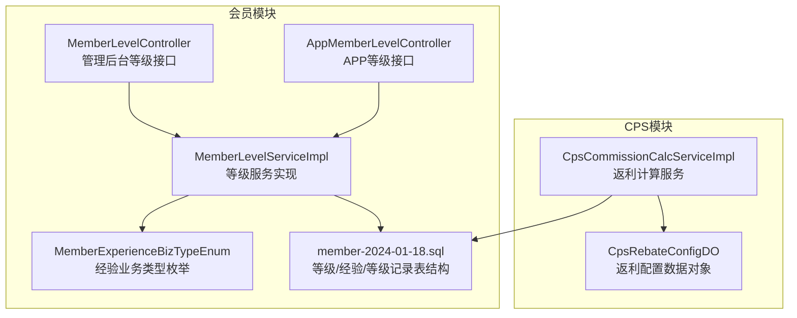
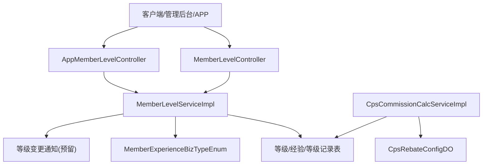
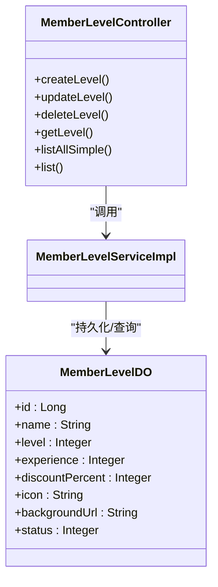
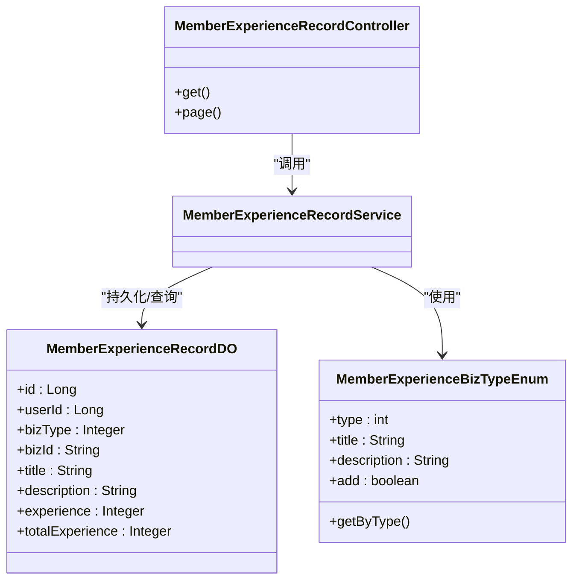
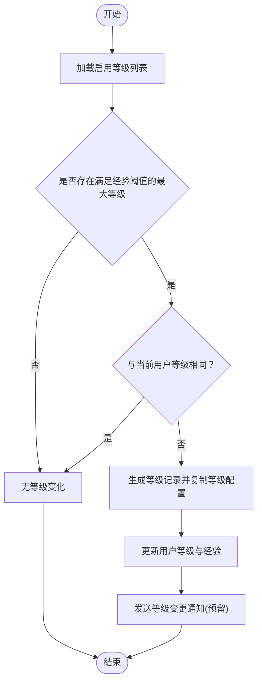
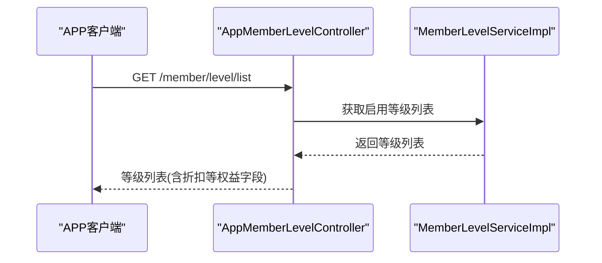
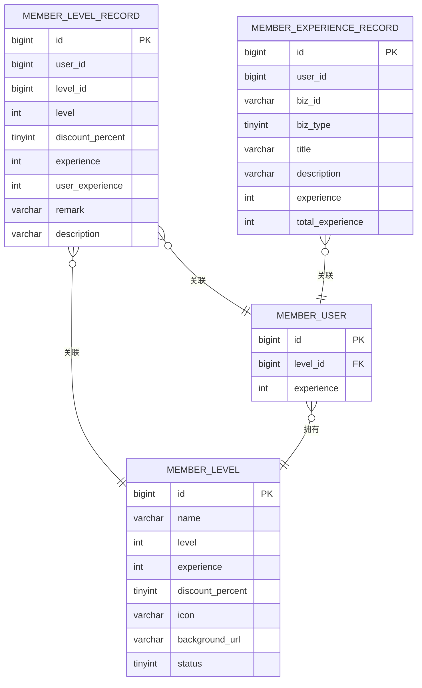
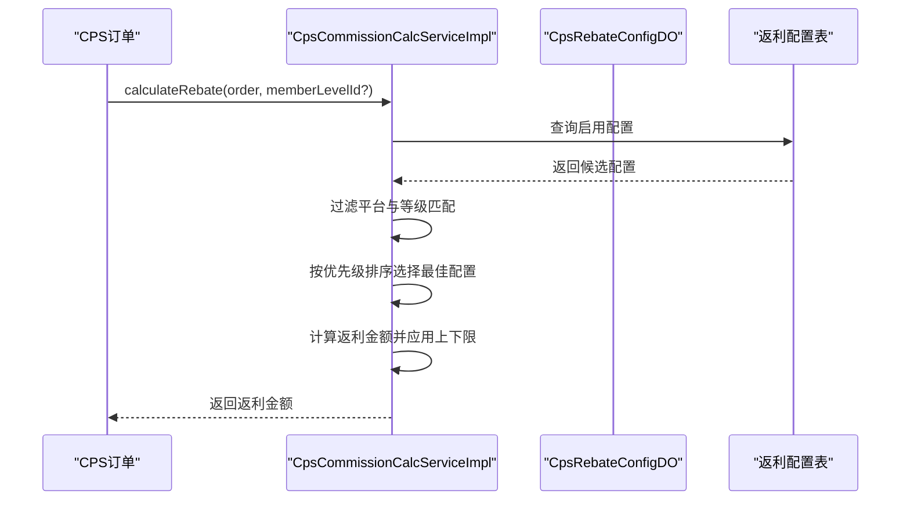
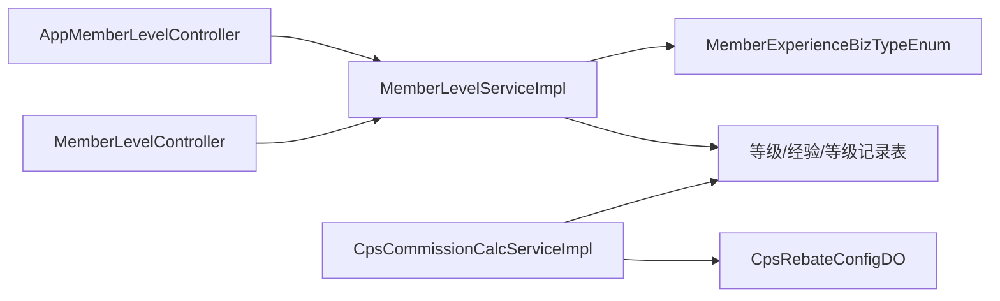

# 会员等级体系

<cite>
**本文引用的文件**
- [MemberLevelServiceImpl.java](file://qiji-module-member/src/main/java/com.qiji.cps/module/member/service/level/MemberLevelServiceImpl.java)
- [MemberLevelDO.java](file://qiji-module-member/src/main/java/com.qiji.cps/module/member/dal/dataobject/level/MemberLevelDO.java)
- [MemberLevelRecordDO.java](file://qiji-module-member/src/main/java/com.qiji.cps/module/member/dal/dataobject/level/MemberLevelRecordDO.java)
- [MemberExperienceRecordDO.java](file://qiji-module-member/src/main/java/com.qiji.cps/module/member/dal/dataobject/level/MemberExperienceRecordDO.java)
- [MemberExperienceBizTypeEnum.java](file://qiji-module-member/src/main/java/com.qiji.cps/module/member/enums/MemberExperienceBizTypeEnum.java)
- [MemberLevelController.java](file://qiji-module-member/src/main/java/com.qiji.cps/module/member/controller/admin/level/MemberLevelController.java)
- [MemberExperienceRecordController.java](file://qiji-module-member/src/main/java/com.qiji.cps/module/member/controller/admin/level/MemberExperienceRecordController.java)
- [AppMemberLevelController.java](file://qiji-module-member/src/main/java/com.qiji.cps/module/member/controller/app/level/AppMemberLevelController.java)
- [member-2024-01-18.sql](file://sql/module/member-2024-01-18.sql)
- [CpsCommissionCalcServiceImpl.java](file://qiji-module-cps/qiji-module-cps-biz/src/main/java/cn/zhijian/cps/service/commission/CpsCommissionCalcServiceImpl.java)
- [CpsRebateConfigDO.java](file://qiji-module-cps/qiji-module-cps-biz/src/main/java/cn/zhijian/cps/dal/dataobject/CpsRebateConfigDO.java)
</cite>

## 目录
1. [简介](#简介)
2. [项目结构](#项目结构)
3. [核心组件](#核心组件)
4. [架构总览](#架构总览)
5. [详细组件分析](#详细组件分析)
6. [依赖分析](#依赖分析)
7. [性能考虑](#性能考虑)
8. [故障排查指南](#故障排查指南)
9. [结论](#结论)
10. [附录](#附录)

## 简介
本技术文档围绕会员等级体系进行系统化梳理，覆盖等级配置、经验值管理、等级晋升规则、等级权益、等级记录审计以及在CPS返利场景中的应用。文档从代码层面解析模块职责、数据模型、处理流程与扩展点，并提供可视化图表帮助理解。

## 项目结构
会员等级体系主要分布在会员模块与CPS模块：
- 会员模块负责等级配置、经验值获取、等级晋升与记录审计
- CPS模块基于会员等级进行返利配置的差异化计算

**图表来源**
- [MemberLevelServiceImpl.java:1-299](file://qiji-module-member/src/main/java/com.qiji.cps/module/member/service/level/MemberLevelServiceImpl.java#L1-L299)
- [MemberLevelController.java:1-81](file://qiji-module-member/src/main/java/com.qiji.cps/module/member/controller/admin/level/MemberLevelController.java#L1-L81)
- [AppMemberLevelController.java:1-39](file://qiji-module-member/src/main/java/com.qiji.cps/module/member/controller/app/level/AppMemberLevelController.java#L1-L39)
- [MemberExperienceBizTypeEnum.java:1-52](file://qiji-module-member/src/main/java/com.qiji.cps/module/member/enums/MemberExperienceBizTypeEnum.java#L1-L52)
- [member-2024-01-18.sql:76-182](file://sql/module/member-2024-01-18.sql#L76-L182)
- [CpsCommissionCalcServiceImpl.java:1-170](file://qiji-module-cps/qiji-module-cps-biz/src/main/java/cn/zhijian/cps/service/commission/CpsCommissionCalcServiceImpl.java#L1-L170)
- [CpsRebateConfigDO.java:1-41](file://qiji-module-cps/qiji-module-cps-biz/src/main/java/cn/zhijian/cps/dal/dataobject/CpsRebateConfigDO.java#L1-L41)

**章节来源**
- [MemberLevelServiceImpl.java:1-299](file://qiji-module-member/src/main/java/com.qiji.cps/module/member/service/level/MemberLevelServiceImpl.java#L1-L299)
- [member-2024-01-18.sql:76-182](file://sql/module/member-2024-01-18.sql#L76-L182)

## 核心组件
- 等级服务实现：负责等级配置校验、管理员调整等级、经验值变动与等级晋升计算、等级记录与经验记录生成、用户等级更新通知等
- 等级数据对象：等级配置、等级记录、经验记录
- 经验业务类型枚举：定义经验值来源与增减规则
- 控制器：管理后台与APP端的等级查询接口
- CPS返利计算：基于会员等级与平台维度的返利配置匹配与计算

**章节来源**
- [MemberLevelServiceImpl.java:1-299](file://qiji-module-member/src/main/java/com.qiji.cps/module/member/service/level/MemberLevelServiceImpl.java#L1-L299)
- [MemberLevelDO.java:1-65](file://qiji-module-member/src/main/java/com.qiji.cps/module/member/dal/dataobject/level/MemberLevelDO.java#L1-L65)
- [MemberLevelRecordDO.java:1-72](file://qiji-module-member/src/main/java/com.qiji.cps/module/member/dal/dataobject/level/MemberLevelRecordDO.java#L1-L72)
- [MemberExperienceRecordDO.java:1-64](file://qiji-module-member/src/main/java/com.qiji.cps/module/member/dal/dataobject/level/MemberExperienceRecordDO.java#L1-L64)
- [MemberExperienceBizTypeEnum.java:1-52](file://qiji-module-member/src/main/java/com.qiji.cps/module/member/enums/MemberExperienceBizTypeEnum.java#L1-L52)
- [MemberLevelController.java:1-81](file://qiji-module-member/src/main/java/com.qiji.cps/module/member/controller/admin/level/MemberLevelController.java#L1-L81)
- [AppMemberLevelController.java:1-39](file://qiji-module-member/src/main/java/com.qiji.cps/module/member/controller/app/level/AppMemberLevelController.java#L1-L39)
- [CpsCommissionCalcServiceImpl.java:1-170](file://qiji-module-cps/qiji-module-cps-biz/src/main/java/cn/zhijian/cps/service/commission/CpsCommissionCalcServiceImpl.java#L1-L170)

## 架构总览
会员等级体系采用“服务层 + 数据对象 + 控制器 + 数据库表”的分层架构，结合CPS模块的返利配置实现差异化返利策略。

**图表来源**
- [MemberLevelController.java:1-81](file://qiji-module-member/src/main/java/com.qiji.cps/module/member/controller/admin/level/MemberLevelController.java#L1-L81)
- [AppMemberLevelController.java:1-39](file://qiji-module-member/src/main/java/com.qiji.cps/module/member/controller/app/level/AppMemberLevelController.java#L1-L39)
- [MemberLevelServiceImpl.java:1-299](file://qiji-module-member/src/main/java/com.qiji.cps/module/member/service/level/MemberLevelServiceImpl.java#L1-L299)
- [MemberExperienceBizTypeEnum.java:1-52](file://qiji-module-member/src/main/java/com.qiji.cps/module/member/enums/MemberExperienceBizTypeEnum.java#L1-L52)
- [member-2024-01-18.sql:76-182](file://sql/module/member-2024-01-18.sql#L76-L182)
- [CpsCommissionCalcServiceImpl.java:1-170](file://qiji-module-cps/qiji-module-cps-biz/src/main/java/cn/zhijian/cps/service/commission/CpsCommissionCalcServiceImpl.java#L1-L170)
- [CpsRebateConfigDO.java:1-41](file://qiji-module-cps/qiji-module-cps-biz/src/main/java/cn/zhijian/cps/dal/dataobject/CpsRebateConfigDO.java#L1-L41)

## 详细组件分析

### 等级配置与管理
- 等级配置字段：名称、等级序号、升级所需经验、折扣百分比、图标、背景图、状态
- 管理接口：创建、更新、删除、查询、获取启用等级列表
- 校验规则：名称唯一、等级序号唯一、升级经验必须在相邻等级区间内

**图表来源**
- [MemberLevelDO.java:1-65](file://qiji-module-member/src/main/java/com.qiji.cps/module/member/dal/dataobject/level/MemberLevelDO.java#L1-L65)
- [MemberLevelController.java:1-81](file://qiji-module-member/src/main/java/com.qiji.cps/module/member/controller/admin/level/MemberLevelController.java#L1-L81)

**章节来源**
- [MemberLevelDO.java:1-65](file://qiji-module-member/src/main/java/com.qiji.cps/module/member/dal/dataobject/level/MemberLevelDO.java#L1-L65)
- [MemberLevelController.java:1-81](file://qiji-module-member/src/main/java/com.qiji.cps/module/member/controller/admin/level/MemberLevelController.java#L1-L81)

### 经验值管理与来源
- 经验业务类型：管理员调整、邀新奖励、签到奖励、抽奖奖励、下单奖励、下单奖励取消/退款
- 经验记录字段：用户、业务类型、业务编号、标题、描述、经验变动、累计经验
- 增减规则：业务类型决定是否加经验；当非加经验业务传入正值时自动转为负值

**图表来源**
- [MemberExperienceBizTypeEnum.java:1-52](file://qiji-module-member/src/main/java/com.qiji.cps/module/member/enums/MemberExperienceBizTypeEnum.java#L1-L52)
- [MemberExperienceRecordDO.java:1-64](file://qiji-module-member/src/main/java/com.qiji.cps/module/member/dal/dataobject/level/MemberExperienceRecordDO.java#L1-L64)
- [MemberExperienceRecordController.java:1-53](file://qiji-module-member/src/main/java/com.qiji.cps/module/member/controller/admin/level/MemberExperienceRecordController.java#L1-L53)

**章节来源**
- [MemberExperienceBizTypeEnum.java:1-52](file://qiji-module-member/src/main/java/com.qiji.cps/module/member/enums/MemberExperienceBizTypeEnum.java#L1-L52)
- [MemberExperienceRecordDO.java:1-64](file://qiji-module-member/src/main/java/com.qiji.cps/module/member/dal/dataobject/level/MemberExperienceRecordDO.java#L1-L64)
- [MemberExperienceRecordController.java:1-53](file://qiji-module-member/src/main/java/com.qiji.cps/module/member/controller/admin/level/MemberExperienceRecordController.java#L1-L53)

### 等级晋升算法
- 计算逻辑：按启用等级列表，取满足“当前经验 ≥ 等级所需经验”的最大等级；若未变化则不晋升
- 等级记录：当晋升发生时，记录等级变更、复制等级配置字段、计算经验变动与用户累计经验
- 用户更新：同步更新用户表的等级编号与经验值

**图表来源**
- [MemberLevelServiceImpl.java:263-292](file://qiji-module-member/src/main/java/com.qiji.cps/module/member/service/level/MemberLevelServiceImpl.java#L263-L292)

**章节来源**
- [MemberLevelServiceImpl.java:230-261](file://qiji-module-member/src/main/java/com.qiji.cps/module/member/service/level/MemberLevelServiceImpl.java#L230-L261)

### 等级权益与APP展示
- APP端等级列表：仅返回启用状态的等级，供前端展示
- 折扣权益：等级配置包含折扣百分比，可用于商品价格计算或会员价展示

**图表来源**
- [AppMemberLevelController.java:1-39](file://qiji-module-member/src/main/java/com.qiji.cps/module/member/controller/app/level/AppMemberLevelController.java#L1-L39)

**章节来源**
- [AppMemberLevelController.java:1-39](file://qiji-module-member/src/main/java/com.qiji.cps/module/member/controller/app/level/AppMemberLevelController.java#L1-L39)
- [MemberLevelDO.java:1-65](file://qiji-module-member/src/main/java/com.qiji.cps/module/member/dal/dataobject/level/MemberLevelDO.java#L1-L65)

### 等级记录与审计
- 等级记录表：记录每次等级变更的用户、等级、折扣、经验变动、累计经验、备注与描述
- 经验记录表：记录每次经验变动的用户、业务类型、业务编号、标题、描述、经验与累计经验
- 管理后台接口：支持分页查询与详情查看

**图表来源**
- [member-2024-01-18.sql:76-182](file://sql/module/member-2024-01-18.sql#L76-L182)

**章节来源**
- [MemberLevelRecordDO.java:1-72](file://qiji-module-member/src/main/java/com.qiji.cps/module/member/dal/dataobject/level/MemberLevelRecordDO.java#L1-L72)
- [MemberExperienceRecordDO.java:1-64](file://qiji-module-member/src/main/java/com.qiji.cps/module/member/dal/dataobject/level/MemberExperienceRecordDO.java#L1-L64)
- [MemberExperienceRecordController.java:1-53](file://qiji-module-member/src/main/java/com.qiji.cps/module/member/controller/admin/level/MemberExperienceRecordController.java#L1-L53)

### 在CPS返利中的应用
- 返利配置维度：会员等级 + 平台组合配置（优先级最高）、仅会员等级配置、仅平台配置、默认配置（优先级最低）
- 计算公式：返利金额 = 订单金额 × 返利比例；受最大/最小返利限制
- 服务实现：根据平台编码与会员等级ID匹配最优配置，计算并返回返利金额

**图表来源**
- [CpsCommissionCalcServiceImpl.java:89-124](file://qiji-module-cps/qiji-module-cps-biz/src/main/java/cn/zhijian/cps/service/commission/CpsCommissionCalcServiceImpl.java#L89-L124)
- [CpsRebateConfigDO.java:1-41](file://qiji-module-cps/qiji-module-cps-biz/src/main/java/cn/zhijian/cps/dal/dataobject/CpsRebateConfigDO.java#L1-L41)

**章节来源**
- [CpsCommissionCalcServiceImpl.java:1-170](file://qiji-module-cps/qiji-module-cps-biz/src/main/java/cn/zhijian/cps/service/commission/CpsCommissionCalcServiceImpl.java#L1-L170)
- [CpsRebateConfigDO.java:1-41](file://qiji-module-cps/qiji-module-cps-biz/src/main/java/cn/zhijian/cps/dal/dataobject/CpsRebateConfigDO.java#L1-L41)

## 依赖分析
- 服务层依赖：等级服务实现依赖等级映射、等级记录服务、经验记录服务、用户服务
- 控制器依赖：管理后台控制器依赖等级服务；APP控制器依赖等级服务
- 数据层依赖：等级/经验/等级记录表结构定义字段与索引
- 外部模块依赖：CPS返利计算依赖返利配置数据对象与平台服务

**图表来源**
- [MemberLevelController.java:1-81](file://qiji-module-member/src/main/java/com.qiji.cps/module/member/controller/admin/level/MemberLevelController.java#L1-L81)
- [AppMemberLevelController.java:1-39](file://qiji-module-member/src/main/java/com.qiji.cps/module/member/controller/app/level/AppMemberLevelController.java#L1-L39)
- [MemberLevelServiceImpl.java:1-299](file://qiji-module-member/src/main/java/com.qiji.cps/module/member/service/level/MemberLevelServiceImpl.java#L1-L299)
- [MemberExperienceBizTypeEnum.java:1-52](file://qiji-module-member/src/main/java/com.qiji.cps/module/member/enums/MemberExperienceBizTypeEnum.java#L1-L52)
- [member-2024-01-18.sql:76-182](file://sql/module/member-2024-01-18.sql#L76-L182)
- [CpsCommissionCalcServiceImpl.java:1-170](file://qiji-module-cps/qiji-module-cps-biz/src/main/java/cn/zhijian/cps/service/commission/CpsCommissionCalcServiceImpl.java#L1-L170)
- [CpsRebateConfigDO.java:1-41](file://qiji-module-cps/qiji-module-cps-biz/src/main/java/cn/zhijian/cps/dal/dataobject/CpsRebateConfigDO.java#L1-L41)

**章节来源**
- [MemberLevelServiceImpl.java:1-299](file://qiji-module-member/src/main/java/com.qiji.cps/module/member/service/level/MemberLevelServiceImpl.java#L1-L299)
- [member-2024-01-18.sql:76-182](file://sql/module/member-2024-01-18.sql#L76-L182)

## 性能考虑
- 等级查询与排序：启用等级列表按等级序号取最大满足条件的等级，建议对等级与经验字段建立索引以提升筛选效率
- 经验记录分页：经验记录表已建立用户与业务类型的复合索引，适合按用户与业务类型分页查询
- 返利配置匹配：按优先级过滤与排序，建议在配置表上维护状态与平台/等级字段的索引，减少扫描范围
- 事务边界：等级调整与经验记录、用户更新在同一事务内，避免数据不一致

[本节为通用指导，无需特定文件引用]

## 故障排查指南
- 等级配置冲突：当新增或更新等级时，若名称或等级序号重复，或升级经验不在相邻等级区间内，将抛出相应异常
- 用户仍持有等级：删除等级前需确保无用户绑定该等级，否则会提示仍有用户
- 经验值异常：经验变动时自动防止负值；非加经验业务传入正值会被转为负值
- 返利配置缺失：未匹配到任何配置时，将回退至平台佣金作为返利

**章节来源**
- [MemberLevelServiceImpl.java:88-160](file://qiji-module-member/src/main/java/com.qiji.cps/module/member/service/level/MemberLevelServiceImpl.java#L88-L160)
- [MemberLevelServiceImpl.java:230-261](file://qiji-module-member/src/main/java/com.qiji.cps/module/member/service/level/MemberLevelServiceImpl.java#L230-L261)
- [CpsCommissionCalcServiceImpl.java:48-52](file://qiji-module-cps/qiji-module-cps-biz/src/main/java/cn/zhijian/cps/service/commission/CpsCommissionCalcServiceImpl.java#L48-L52)

## 结论
会员等级体系通过清晰的等级配置、严格的校验规则、完善的经验证明与等级晋升算法，实现了可审计、可扩展的会员等级管理。结合CPS模块的多维返利配置，能够灵活地为不同等级会员提供差异化返利权益，支撑业务增长与用户留存。

[本节为总结性内容，无需特定文件引用]

## 附录
- 数据模型字段说明与索引建议详见数据库脚本与数据对象定义
- 返利配置优先级与计算细节详见CPS返利计算实现

**章节来源**
- [member-2024-01-18.sql:76-182](file://sql/module/member-2024-01-18.sql#L76-L182)
- [CpsCommissionCalcServiceImpl.java:89-124](file://qiji-module-cps/qiji-module-cps-biz/src/main/java/cn/zhijian/cps/service/commission/CpsCommissionCalcServiceImpl.java#L89-L124)