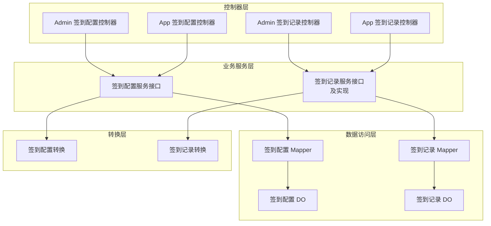
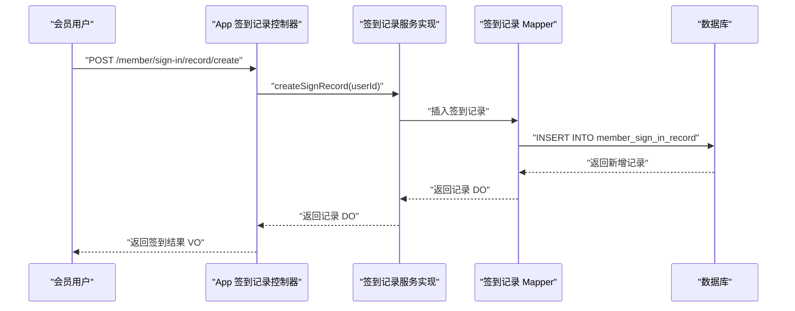
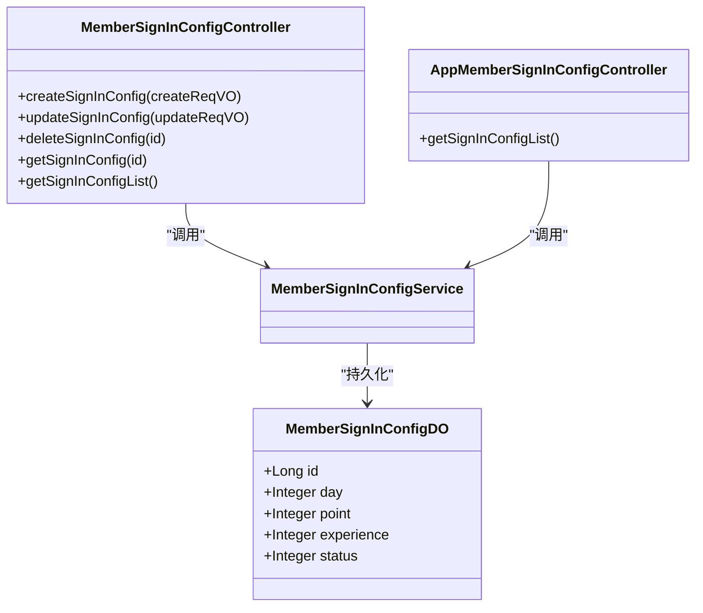
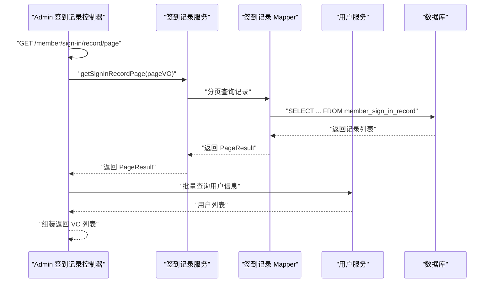
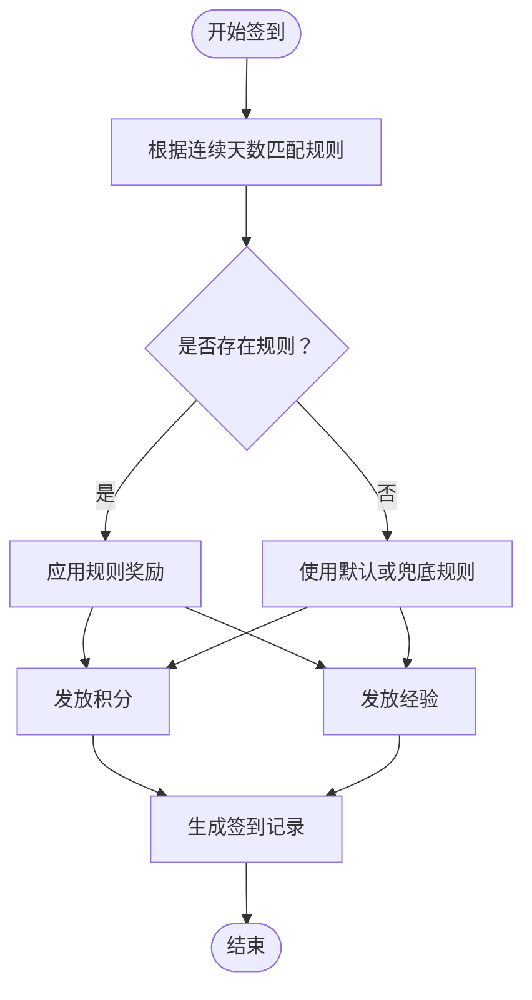
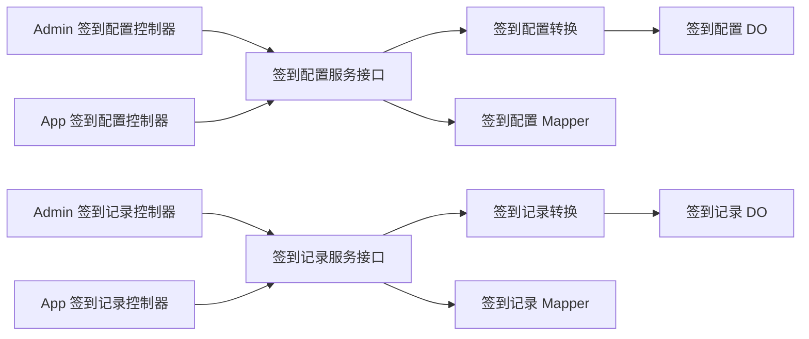
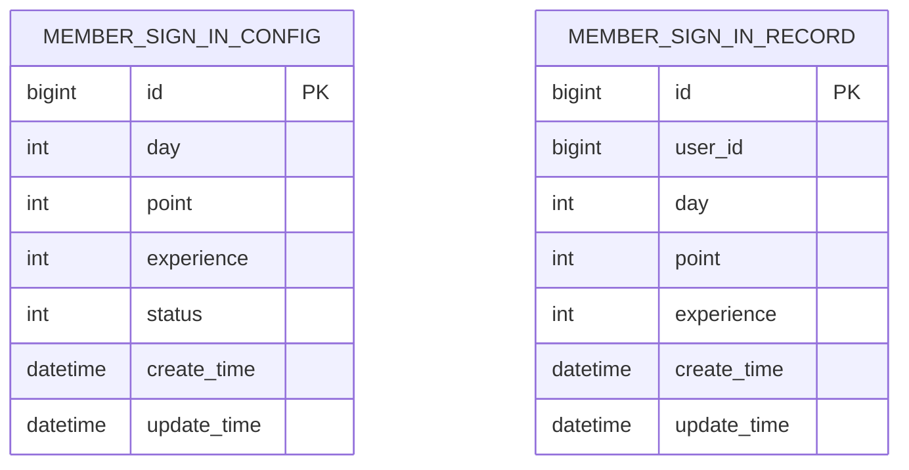

# 会员签到系统

<cite>
**本文引用的文件**
- [MemberSignInConfigService.java](file://qiji-module-member/src/main/java/com.qiji.cps/module/member/service/signin/MemberSignInConfigService.java)
- [MemberSignInRecordService.java](file://qiji-module-member/src/main/java/com.qiji.cps/module/member/service/signin/MemberSignInRecordService.java)
- [MemberSignInRecordServiceImpl.java](file://qiji-module-member/src/main/java/com.qiji.cps/module/member/service/signin/MemberSignInRecordServiceImpl.java)
- [MemberSignInConfigDO.java](file://qiji-module-member/src/main/java/com.qiji.cps/module/member/dal/dataobject/signin/MemberSignInConfigDO.java)
- [MemberSignInRecordDO.java](file://qiji-module-member/src/main/java/com.qiji.cps/module/member/dal/dataobject/signin/MemberSignInRecordDO.java)
- [MemberSignInConfigController.java](file://qiji-module-member/src/main/java/com.qiji.cps/module/member/controller/admin/signin/MemberSignInConfigController.java)
- [MemberSignInRecordController.java](file://qiji-module-member/src/main/java/com.qiji.cps/module/member/controller/admin/signin/MemberSignInRecordController.java)
- [AppMemberSignInConfigController.java](file://qiji-module-member/src/main/java/com.qiji.cps/module/member/controller/app/signin/AppMemberSignInConfigController.java)
- [AppMemberSignInRecordController.java](file://qiji-module-member/src/main/java/com.qiji.cps/module/member/controller/app/signin/AppMemberSignInRecordController.java)
- [MemberSignInConfigConvert.java](file://qiji-module-member/src/main/java/com.qiji.cps/module/member/convert/signin/MemberSignInConfigConvert.java)
- [MemberSignInRecordConvert.java](file://qiji-module-member/src/main/java/com.qiji.cps/module/member/convert/signin/MemberSignInRecordConvert.java)
- [MemberSignInRecordPageReqVO.java](file://qiji-module-member/src/main/java/com.qiji.cps/module/member/controller/admin/signin/vo/record/MemberSignInRecordPageReqVO.java)
- [MemberSignInRecordRespVO.java](file://qiji-module-member/src/main/java/com.qiji.cps/module/member/controller/admin/signin/vo/record/MemberSignInRecordRespVO.java)
- [MemberSignInConfigCreateReqVO.java](file://qiji-module-member/src/main/java/com.qiji.cps/module/member/controller/admin/signin/vo/config/MemberSignInConfigCreateReqVO.java)
- [MemberSignInConfigUpdateReqVO.java](file://qiji-module-member/src/main/java/com.qiji.cps/module/member/controller/admin/signin/vo/config/MemberSignInConfigUpdateReqVO.java)
- [MemberSignInConfigRespVO.java](file://qiji-module-member/src/main/java/com.qiji.cps/module/member/controller/admin/signin/vo/config/MemberSignInConfigRespVO.java)
- [AppMemberSignInConfigRespVO.java](file://qiji-module-member/src/main/java/com.qiji.cps/module/member/controller/app/signin/vo/config/AppMemberSignInConfigRespVO.java)
- [AppMemberSignInRecordRespVO.java](file://qiji-module-member/src/main/java/com.qiji.cps/module/member/controller/app/signin/vo/record/AppMemberSignInRecordRespVO.java)
- [AppMemberSignInRecordSummaryRespVO.java](file://qiji-module-member/src/main/java/com.qiji.cps/module/member/controller/app/signin/vo/record/AppMemberSignInRecordSummaryRespVO.java)
- [CommonStatusEnum.java](file://qiji-framework/qiji-common/src/main/java/com.qiji.cps/framework/common/enums/CommonStatusEnum.java)
- [BaseDO.java](file://qiji-framework/qiji-common/src/main/java/com.qiji.cps/framework/mybatis/core/dataobject/BaseDO.java)
- [CommonResult.java](file://qiji-framework/qiji-common/src/main/java/com.qiji.cps/framework/common/pojo/CommonResult.java)
- [PageResult.java](file://qiji-framework/qiji-common/src/main/java/com.qiji.cps/framework/common/pojo/PageResult.java)
- [PageParam.java](file://qiji-framework/qiji-common/src/main/java/com.qiji.cps/framework/common/pojo/PageParam.java)
- [SecurityFrameworkUtils.java](file://qiji-framework/qiji-spring-boot-starter-security/src/main/java/com.qiji.cps/framework/security/core/util/SecurityFrameworkUtils.java)
- [ErrorCodeConstants.java](file://qiji-module-member/src/main/java/com.qiji.cps/module/member/enums/ErrorCodeConstants.java)
</cite>

## 目录
1. [简介](#简介)
2. [项目结构](#项目结构)
3. [核心组件](#核心组件)
4. [架构总览](#架构总览)
5. [详细组件分析](#详细组件分析)
6. [依赖关系分析](#依赖关系分析)
7. [性能考虑](#性能考虑)
8. [故障排查指南](#故障排查指南)
9. [结论](#结论)
10. [附录](#附录)

## 简介
本技术文档围绕会员签到系统展开，系统提供签到配置、签到记录、连续签到奖励等核心能力，并支持管理员后台与移动端 App 双端使用。系统通过“签到规则配置”定义每日签到奖励（积分、经验），通过“签到记录”追踪用户签到状态与历史，结合“个人签到统计”帮助运营分析用户活跃度。文档将从架构、数据模型、接口设计、流程控制、异常处理与性能优化等方面进行深入说明。

## 项目结构
签到系统位于 qiji-module-member 模块中，采用典型的分层架构：
- 控制器层：Admin 后台与 App 两端分别提供签到规则与签到记录的接口
- 业务服务层：签到配置与签到记录的服务接口与实现
- 数据访问层：MyBatis Mapper 与 DO 数据对象
- 转换层：MapStruct VO/DO 转换
- VO 层：请求与响应参数对象
- 枚举与通用基类：状态枚举、分页与返回封装、基础 DO 字段

图表来源
- [MemberSignInConfigController.java:25-75](file://qiji-module-member/src/main/java/com.qiji.cps/module/member/controller/admin/signin/MemberSignInConfigController.java#L25-L75)
- [MemberSignInRecordController.java:29-56](file://qiji-module-member/src/main/java/com.qiji.cps/module/member/controller/admin/signin/MemberSignInRecordController.java#L29-L56)
- [AppMemberSignInConfigController.java:24-40](file://qiji-module-member/src/main/java/com.qiji.cps/module/member/controller/app/signin/AppMemberSignInConfigController.java#L24-L40)
- [AppMemberSignInRecordController.java:25-53](file://qiji-module-member/src/main/java/com.qiji.cps/module/member/controller/app/signin/AppMemberSignInRecordController.java#L25-L53)
- [MemberSignInConfigService.java:15-62](file://qiji-module-member/src/main/java/com.qiji.cps/module/member/service/signin/MemberSignInConfigService.java#L15-L62)
- [MemberSignInRecordService.java:14-50](file://qiji-module-member/src/main/java/com.qiji.cps/module/member/service/signin/MemberSignInRecordService.java#L14-L50)
- [MemberSignInRecordServiceImpl.java](file://qiji-module-member/src/main/java/com.qiji.cps/module/member/service/signin/MemberSignInRecordServiceImpl.java)
- [MemberSignInConfigDO.java:23-50](file://qiji-module-member/src/main/java/com.qiji.cps/module/member/dal/dataobject/signin/MemberSignInConfigDO.java#L23-L50)
- [MemberSignInRecordDO.java:22-46](file://qiji-module-member/src/main/java/com.qiji.cps/module/member/dal/dataobject/signin/MemberSignInRecordDO.java#L22-L46)
- [MemberSignInConfigConvert.java:18-33](file://qiji-module-member/src/main/java/com.qiji.cps/module/member/convert/signin/MemberSignInConfigConvert.java#L18-L33)
- [MemberSignInRecordConvert.java](file://qiji-module-member/src/main/java/com.qiji.cps/module/member/convert/signin/MemberSignInRecordConvert.java)

章节来源
- [MemberSignInConfigController.java:25-75](file://qiji-module-member/src/main/java/com.qiji.cps/module/member/controller/admin/signin/MemberSignInConfigController.java#L25-L75)
- [MemberSignInRecordController.java:29-56](file://qiji-module-member/src/main/java/com.qiji.cps/module/member/controller/admin/signin/MemberSignInRecordController.java#L29-L56)
- [AppMemberSignInConfigController.java:24-40](file://qiji-module-member/src/main/java/com.qiji.cps/module/member/controller/app/signin/AppMemberSignInConfigController.java#L24-L40)
- [AppMemberSignInRecordController.java:25-53](file://qiji-module-member/src/main/java/com.qiji.cps/module/member/controller/app/signin/AppMemberSignInRecordController.java#L25-L53)

## 核心组件
- 签到配置服务接口：提供创建、更新、删除、查询签到规则的能力，支持按状态筛选
- 签到记录服务接口与实现：提供管理员与会员维度的签到记录分页查询、个人签到统计、执行签到并生成记录
- 数据对象：签到配置 DO 与签到记录 DO，承载规则与记录的数据字段
- 控制器：Admin 与 App 两端控制器，暴露 REST 接口，完成鉴权、参数校验与结果封装
- 转换器：MapStruct 将 DO 与 VO 进行双向转换，保证接口层与持久层解耦

章节来源
- [MemberSignInConfigService.java:15-62](file://qiji-module-member/src/main/java/com.qiji.cps/module/member/service/signin/MemberSignInConfigService.java#L15-L62)
- [MemberSignInRecordService.java:14-50](file://qiji-module-member/src/main/java/com.qiji.cps/module/member/service/signin/MemberSignInRecordService.java#L14-L50)
- [MemberSignInRecordServiceImpl.java](file://qiji-module-member/src/main/java/com.qiji.cps/module/member/service/signin/MemberSignInRecordServiceImpl.java)
- [MemberSignInConfigDO.java:23-50](file://qiji-module-member/src/main/java/com.qiji.cps/module/member/dal/dataobject/signin/MemberSignInConfigDO.java#L23-L50)
- [MemberSignInRecordDO.java:22-46](file://qiji-module-member/src/main/java/com.qiji.cps/module/member/dal/dataobject/signin/MemberSignInRecordDO.java#L22-L46)
- [MemberSignInConfigController.java:25-75](file://qiji-module-member/src/main/java/com.qiji.cps/module/member/controller/admin/signin/MemberSignInConfigController.java#L25-L75)
- [AppMemberSignInRecordController.java:25-53](file://qiji-module-member/src/main/java/com.qiji.cps/module/member/controller/app/signin/AppMemberSignInRecordController.java#L25-L53)

## 架构总览
系统采用前后端分离的分层架构，Admin 端负责签到规则配置与签到记录审计，App 端面向会员提供签到与统计查询。服务层通过 Mapper 访问数据库，转换层负责 VO/DO 的映射，控制器层统一处理权限与返回格式。

图表来源
- [AppMemberSignInRecordController.java:38-43](file://qiji-module-member/src/main/java/com.qiji.cps/module/member/controller/app/signin/AppMemberSignInRecordController.java#L38-L43)
- [MemberSignInRecordServiceImpl.java](file://qiji-module-member/src/main/java/com.qiji.cps/module/member/service/signin/MemberSignInRecordServiceImpl.java)
- [MemberSignInRecordDO.java:22-46](file://qiji-module-member/src/main/java/com.qiji.cps/module/member/dal/dataobject/signin/MemberSignInRecordDO.java#L22-L46)

## 详细组件分析

### 签到配置管理
- 功能职责
  - Admin 端提供签到规则的创建、更新、删除、单条查询与列表查询
  - App 端提供启用状态下的签到规则列表查询
- 关键字段
  - 规则主键、签到第 X 天、奖励积分、奖励经验、状态
- 权限控制
  - Admin 端接口均标注对应权限位，确保最小授权
- 接口示例
  - Admin 创建规则：POST /member/sign-in/config/create
  - Admin 查询规则列表：GET /member/sign-in/config/list
  - App 查询启用规则：GET /member/sign-in/config/list

图表来源
- [MemberSignInConfigDO.java:23-50](file://qiji-module-member/src/main/java/com.qiji.cps/module/member/dal/dataobject/signin/MemberSignInConfigDO.java#L23-L50)
- [MemberSignInConfigController.java:33-72](file://qiji-module-member/src/main/java/com.qiji.cps/module/member/controller/admin/signin/MemberSignInConfigController.java#L33-L72)
- [AppMemberSignInConfigController.java:31-37](file://qiji-module-member/src/main/java/com.qiji.cps/module/member/controller/app/signin/AppMemberSignInConfigController.java#L31-L37)

章节来源
- [MemberSignInConfigController.java:33-72](file://qiji-module-member/src/main/java/com.qiji.cps/module/member/controller/admin/signin/MemberSignInConfigController.java#L33-L72)
- [AppMemberSignInConfigController.java:31-37](file://qiji-module-member/src/main/java/com.qiji.cps/module/member/controller/app/signin/AppMemberSignInConfigController.java#L31-L37)
- [MemberSignInConfigDO.java:23-50](file://qiji-module-member/src/main/java/com.qiji.cps/module/member/dal/dataobject/signin/MemberSignInConfigDO.java#L23-L50)
- [MemberSignInConfigCreateReqVO.java](file://qiji-module-member/src/main/java/com.qiji.cps/module/member/controller/admin/signin/vo/config/MemberSignInConfigCreateReqVO.java)
- [MemberSignInConfigUpdateReqVO.java](file://qiji-module-member/src/main/java/com.qiji.cps/module/member/controller/admin/signin/vo/config/MemberSignInConfigUpdateReqVO.java)
- [MemberSignInConfigRespVO.java](file://qiji-module-member/src/main/java/com.qiji.cps/module/member/controller/admin/signin/vo/config/MemberSignInConfigRespVO.java)
- [AppMemberSignInConfigRespVO.java](file://qiji-module-member/src/main/java/com.qiji.cps/module/member/controller/app/signin/vo/config/AppMemberSignInConfigRespVO.java)
- [MemberSignInConfigConvert.java:23-31](file://qiji-module-member/src/main/java/com.qiji.cps/module/member/convert/signin/MemberSignInConfigConvert.java#L23-L31)

### 签到记录与统计
- 功能职责
  - App 端：执行签到、获取个人签到统计、分页查询签到历史
  - Admin 端：分页查询所有签到记录，并关联用户信息返回
- 关键字段
  - 记录主键、用户标识、第 N 天签到、本次签到积分、本次签到经验
- 统计维度
  - 个人签到统计（如总次数、连续天数等）由 App 端统计视图返回

图表来源
- [MemberSignInRecordController.java:40-54](file://qiji-module-member/src/main/java/com.qiji.cps/module/member/controller/admin/signin/MemberSignInRecordController.java#L40-L54)
- [MemberSignInRecordServiceImpl.java](file://qiji-module-member/src/main/java/com.qiji.cps/module/member/service/signin/MemberSignInRecordServiceImpl.java)
- [MemberSignInRecordDO.java:22-46](file://qiji-module-member/src/main/java/com.qiji.cps/module/member/dal/dataobject/signin/MemberSignInRecordDO.java#L22-L46)

章节来源
- [MemberSignInRecordController.java:40-54](file://qiji-module-member/src/main/java/com.qiji.cps/module/member/controller/admin/signin/MemberSignInRecordController.java#L40-L54)
- [AppMemberSignInRecordController.java:32-50](file://qiji-module-member/src/main/java/com.qiji.cps/module/member/controller/app/signin/AppMemberSignInRecordController.java#L32-L50)
- [MemberSignInRecordDO.java:22-46](file://qiji-module-member/src/main/java/com.qiji.cps/module/member/dal/dataobject/signin/MemberSignInRecordDO.java#L22-L46)
- [MemberSignInRecordPageReqVO.java](file://qiji-module-member/src/main/java/com.qiji.cps/module/member/controller/admin/signin/vo/record/MemberSignInRecordPageReqVO.java)
- [MemberSignInRecordRespVO.java](file://qiji-module-member/src/main/java/com.qiji.cps/module/member/controller/admin/signin/vo/record/MemberSignInRecordRespVO.java)
- [AppMemberSignInRecordRespVO.java](file://qiji-module-member/src/main/java/com.qiji.cps/module/member/controller/app/signin/vo/record/AppMemberSignInRecordRespVO.java)
- [AppMemberSignInRecordSummaryRespVO.java](file://qiji-module-member/src/main/java/com.qiji.cps/module/member/controller/app/signin/vo/record/AppMemberSignInRecordSummaryRespVO.java)
- [MemberSignInRecordConvert.java](file://qiji-module-member/src/main/java/com.qiji.cps/module/member/convert/signin/MemberSignInRecordConvert.java)

### 连续签到奖励机制
- 设计思路
  - 以“签到第 X 天”的规则作为阶梯依据，每天发放固定积分与经验
  - 支持多档奖励配置，形成阶梯式激励
  - 通过状态字段控制规则生效与否
- 实现要点
  - 规则由 Admin 端维护，App 端仅展示启用状态的规则
  - 签到时根据当前连续天数匹配对应规则，发放相应奖励

图表来源
- [MemberSignInConfigDO.java:32-41](file://qiji-module-member/src/main/java/com.qiji.cps/module/member/dal/dataobject/signin/MemberSignInConfigDO.java#L32-L41)
- [MemberSignInRecordDO.java:34-44](file://qiji-module-member/src/main/java/com.qiji.cps/module/member/dal/dataobject/signin/MemberSignInRecordDO.java#L34-L44)

章节来源
- [MemberSignInConfigDO.java:32-41](file://qiji-module-member/src/main/java/com.qiji.cps/module/member/dal/dataobject/signin/MemberSignInConfigDO.java#L32-L41)
- [MemberSignInRecordDO.java:34-44](file://qiji-module-member/src/main/java/com.qiji.cps/module/member/dal/dataobject/signin/MemberSignInRecordDO.java#L34-L44)

### 签到异常处理与补签/撤销
- 补签机制
  - 当前未覆盖补签逻辑；若需支持，可在服务层增加补签校验与风控策略，并扩展记录表字段以区分“正常签到/补签”
- 签到撤销
  - 当前未覆盖撤销逻辑；若需支持，应在服务层增加撤销校验（如时间窗口、是否已产生流水等），并回滚相应积分/经验
- 统计口径
  - 统计应区分“有效签到天数”与“累计签到天数”，避免补签影响连续天数统计

说明：以上为基于现有代码的现状分析与建议，具体实现需评估业务需求与风控策略。

## 依赖关系分析
- 控制器依赖服务接口，服务接口依赖 Mapper 与 DO
- 转换器贯穿于控制器与服务层之间，承担 VO/DO 映射职责
- 枚举与通用封装类被广泛复用，保证一致性与可维护性

图表来源
- [MemberSignInConfigController.java:25-75](file://qiji-module-member/src/main/java/com.qiji.cps/module/member/controller/admin/signin/MemberSignInConfigController.java#L25-L75)
- [MemberSignInRecordController.java:29-56](file://qiji-module-member/src/main/java/com.qiji.cps/module/member/controller/admin/signin/MemberSignInRecordController.java#L29-L56)
- [AppMemberSignInConfigController.java:24-40](file://qiji-module-member/src/main/java/com.qiji.cps/module/member/controller/app/signin/AppMemberSignInConfigController.java#L24-L40)
- [AppMemberSignInRecordController.java:25-53](file://qiji-module-member/src/main/java/com.qiji.cps/module/member/controller/app/signin/AppMemberSignInRecordController.java#L25-L53)
- [MemberSignInConfigConvert.java:18-33](file://qiji-module-member/src/main/java/com.qiji.cps/module/member/convert/signin/MemberSignInConfigConvert.java#L18-L33)
- [MemberSignInRecordConvert.java](file://qiji-module-member/src/main/java/com.qiji.cps/module/member/convert/signin/MemberSignInRecordConvert.java)
- [MemberSignInConfigDO.java:23-50](file://qiji-module-member/src/main/java/com.qiji.cps/module/member/dal/dataobject/signin/MemberSignInConfigDO.java#L23-L50)
- [MemberSignInRecordDO.java:22-46](file://qiji-module-member/src/main/java/com.qiji.cps/module/member/dal/dataobject/signin/MemberSignInRecordDO.java#L22-L46)

章节来源
- [CommonStatusEnum.java](file://qiji-framework/qiji-common/src/main/java/com.qiji.cps/framework/common/enums/CommonStatusEnum.java)
- [BaseDO.java](file://qiji-framework/qiji-common/src/main/java/com.qiji.cps/framework/mybatis/core/dataobject/BaseDO.java)
- [CommonResult.java](file://qiji-framework/qiji-common/src/main/java/com.qiji.cps/framework/common/pojo/CommonResult.java)
- [PageResult.java](file://qiji-framework/qiji-common/src/main/java/com.qiji.cps/framework/common/pojo/PageResult.java)
- [PageParam.java](file://qiji-framework/qiji-common/src/main/java/com.qiji.cps/framework/common/pojo/PageParam.java)
- [SecurityFrameworkUtils.java](file://qiji-framework/qiji-spring-boot-starter-security/src/main/java/com.qiji.cps/framework/security/core/util/SecurityFrameworkUtils.java)

## 性能考虑
- 分页查询
  - Admin 端分页查询记录时，建议对用户 ID、签到日期等常用过滤字段建立索引，避免全表扫描
- 连续天数计算
  - 若未来引入复杂连续统计，建议在服务层缓存用户最近签到序列，减少重复扫描
- 写入幂等
  - 签到写入应具备幂等保护（如按日期去重），避免重复签到导致的重复奖励
- 缓存策略
  - 规则列表可短期缓存，结合状态变更失效策略，降低数据库压力

## 故障排查指南
- 常见问题
  - 签到失败：检查登录态、用户状态、规则状态与时间窗口
  - 统计异常：核对连续天数算法、补签与撤销的影响范围
  - 权限不足：确认控制器上的权限注解与用户角色授权
- 排查步骤
  - 查看控制器返回的统一结果封装，定位错误码与描述
  - 核对服务层日志与数据库记录，确认签到流程是否完整
  - 结合错误码常量定位具体异常场景

章节来源
- [CommonResult.java](file://qiji-framework/qiji-common/src/main/java/com.qiji.cps/framework/common/pojo/CommonResult.java)
- [ErrorCodeConstants.java](file://qiji-module-member/src/main/java/com.qiji.cps/module/member/enums/ErrorCodeConstants.java)

## 结论
会员签到系统通过清晰的分层设计与规范的接口约束，实现了规则配置、签到执行、记录统计与审计查询的完整闭环。现有实现聚焦于阶梯奖励与基础统计，后续可按需扩展补签、撤销与更复杂的连续奖励策略，同时完善性能与风控措施，持续提升用户活跃度与粘性。

## 附录

### 数据模型设计
- 签到配置表（member_sign_in_config）
  - 字段：id、day、point、experience、status、createTime、updateTime
  - 说明：day 为签到第 X 天，point/experience 为该天奖励值，status 控制规则生效
- 签到记录表（member_sign_in_record）
  - 字段：id、userId、day、point、experience、createTime、updateTime
  - 说明：day 表示本次签到为第 N 天，point/experience 为本次奖励值

图表来源
- [MemberSignInConfigDO.java:23-50](file://qiji-module-member/src/main/java/com.qiji.cps/module/member/dal/dataobject/signin/MemberSignInConfigDO.java#L23-L50)
- [MemberSignInRecordDO.java:22-46](file://qiji-module-member/src/main/java/com.qiji.cps/module/member/dal/dataobject/signin/MemberSignInRecordDO.java#L22-L46)

### API 接口清单
- Admin 端
  - 创建签到规则：POST /member/sign-in/config/create
  - 更新签到规则：PUT /member/sign-in/config/update
  - 删除签到规则：DELETE /member/sign-in/config/delete?id=...
  - 获取签到规则：GET /member/sign-in/config/get?id=...
  - 获取签到规则列表：GET /member/sign-in/config/list
  - 获取签到记录分页：GET /member/sign-in/record/page
- App 端
  - 获取签到规则列表（启用）：GET /member/sign-in/config/list
  - 获取个人签到统计：GET /member/sign-in/record/get-summary
  - 执行签到：POST /member/sign-in/record/create
  - 获取签到记录分页：GET /member/sign-in/record/page

章节来源
- [MemberSignInConfigController.java:33-72](file://qiji-module-member/src/main/java/com.qiji.cps/module/member/controller/admin/signin/MemberSignInConfigController.java#L33-L72)
- [MemberSignInRecordController.java:40-54](file://qiji-module-member/src/main/java/com.qiji.cps/module/member/controller/admin/signin/MemberSignInRecordController.java#L40-L54)
- [AppMemberSignInConfigController.java:31-37](file://qiji-module-member/src/main/java/com.qiji.cps/module/member/controller/app/signin/AppMemberSignInConfigController.java#L31-L37)
- [AppMemberSignInRecordController.java:32-50](file://qiji-module-member/src/main/java/com.qiji.cps/module/member/controller/app/signin/AppMemberSignInRecordController.java#L32-L50)