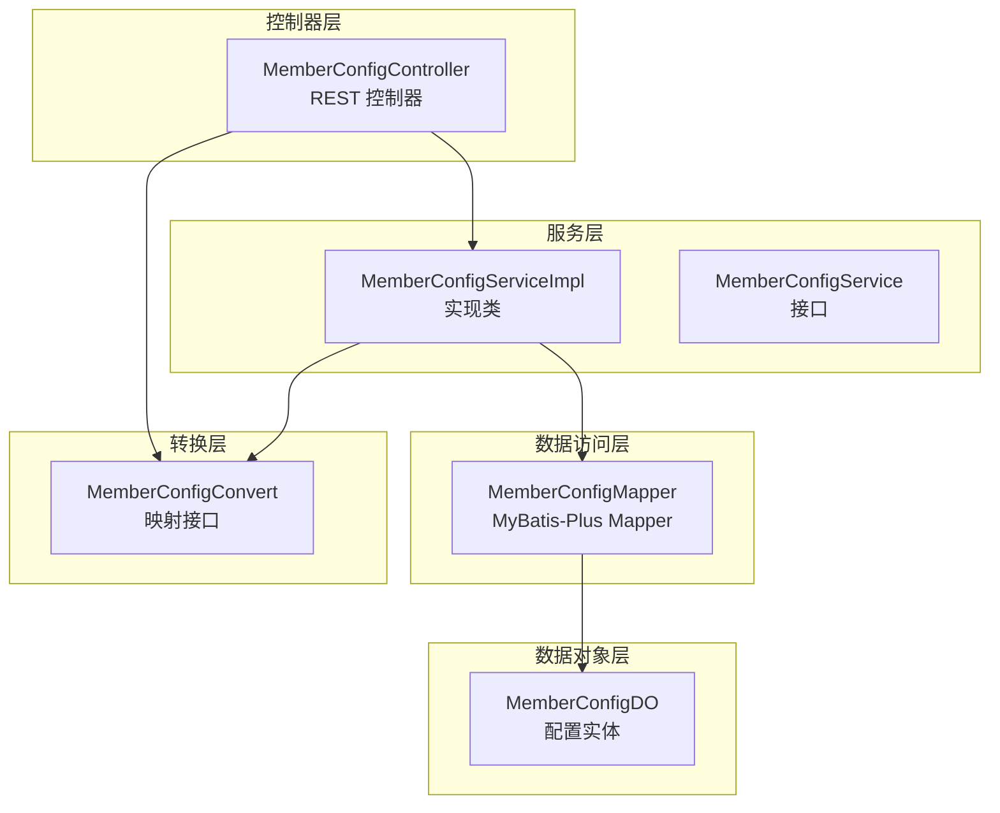
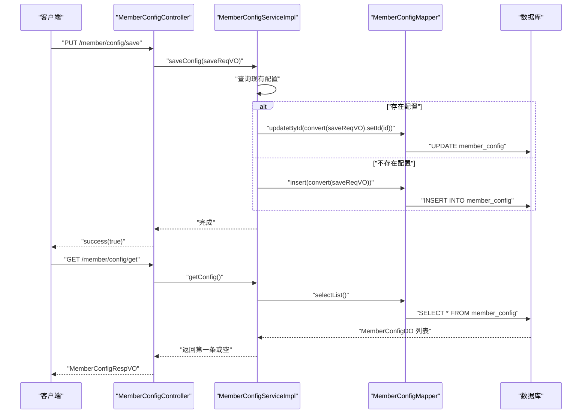
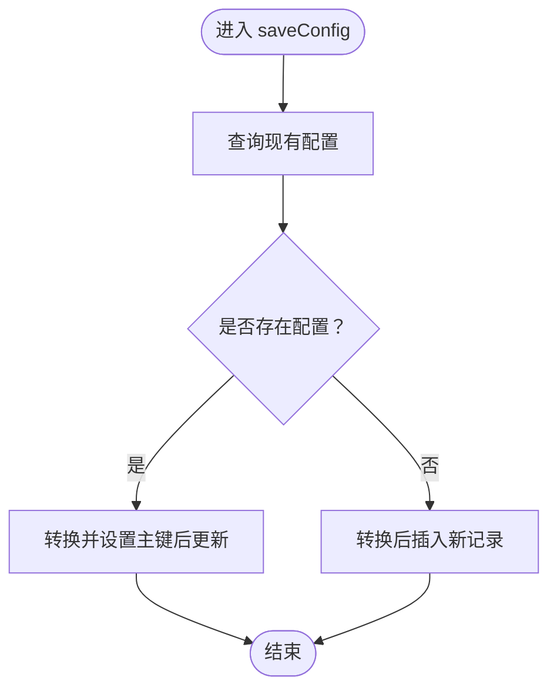
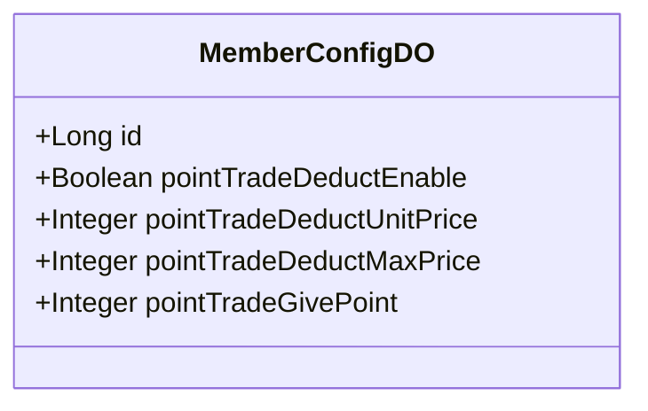
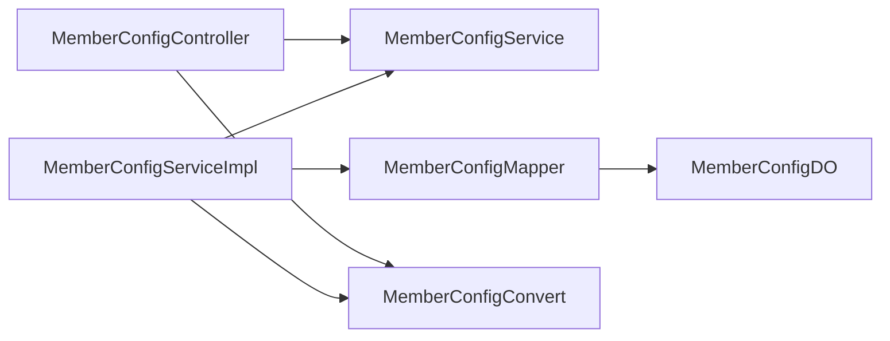

# 会员配置管理

<cite>
**本文引用的文件**
- [MemberConfigService.java](file://qiji-module-member/src/main/java/com.qiji.cps/module/member/service/config/MemberConfigService.java)
- [MemberConfigServiceImpl.java](file://qiji-module-member/src/main/java/com.qiji.cps/module/member/service/config/MemberConfigServiceImpl.java)
- [MemberConfigController.java](file://qiji-module-member/src/main/java/com.qiji.cps/module/member/controller/admin/config/MemberConfigController.java)
- [MemberConfigDO.java](file://qiji-module-member/src/main/java/com.qiji.cps/module/member/dal/dataobject/config/MemberConfigDO.java)
- [MemberConfigMapper.java](file://qiji-module-member/src/main/java/com.qiji.cps/module/member/dal/mysql/config/MemberConfigMapper.java)
- [MemberConfigConvert.java](file://qiji-module-member/src/main/java/com.qiji.cps/module/member/convert/config/MemberConfigConvert.java)
- [MemberConfigSaveReqVO.java](file://qiji-module-member/src/main/java/com.qiji.cps/module/member/controller/admin/config/vo/MemberConfigSaveReqVO.java)
- [MemberConfigBaseVO.java](file://qiji-module-member/src/main/java/com.qiji.cps/module/member/controller/admin/config/vo/MemberConfigBaseVO.java)
- [ruoyi-vue-pro.sql](file://sql/mysql/ruoyi-vue-pro.sql)
- [member-2024-01-18.sql](file://sql/module/member-2024-01-18.sql)
</cite>

## 目录
1. [简介](#简介)
2. [项目结构](#项目结构)
3. [核心组件](#核心组件)
4. [架构总览](#架构总览)
5. [详细组件分析](#详细组件分析)
6. [依赖分析](#依赖分析)
7. [性能考量](#性能考量)
8. [故障排查指南](#故障排查指南)
9. [结论](#结论)
10. [附录](#附录)

## 简介
本技术文档围绕会员配置管理功能展开，系统化阐述会员配置的系统级配置、业务参数配置与个性化设置的管理能力，并结合现有代码实现，给出数据模型、接口定义、调用流程、依赖关系与最佳实践建议。当前仓库中已实现“会员配置”模块，主要覆盖积分相关配置（积分抵扣开关、抵扣单价、抵扣上限、充值赠送积分比例），并提供统一的配置保存与查询接口。

## 项目结构
会员配置管理位于 qiji-module-member 模块中，采用典型的分层架构：
- 控制器层：对外暴露 REST API，负责鉴权与请求转发
- 服务层：封装业务逻辑，协调持久化与转换
- 数据访问层：基于 MyBatis-Plus 的 Mapper 接口
- 数据对象层：配置实体映射数据库表
- 转换层：VO/DTO 与 DO 的映射

图表来源
- [MemberConfigController.java:1-46](file://qiji-module-member/src/main/java/com.qiji.cps/module/member/controller/admin/config/MemberConfigController.java#L1-L46)
- [MemberConfigServiceImpl.java:1-45](file://qiji-module-member/src/main/java/com.qiji.cps/module/member/service/config/MemberConfigServiceImpl.java#L1-L45)
- [MemberConfigMapper.java:1-15](file://qiji-module-member/src/main/java/com.qiji.cps/module/member/dal/mysql/config/MemberConfigMapper.java#L1-L15)
- [MemberConfigDO.java:1-49](file://qiji-module-member/src/main/java/com.qiji.cps/module/member/dal/dataobject/config/MemberConfigDO.java#L1-L49)
- [MemberConfigConvert.java:1-26](file://qiji-module-member/src/main/java/com.qiji.cps/module/member/convert/config/MemberConfigConvert.java#L1-L26)

章节来源
- [MemberConfigController.java:1-46](file://qiji-module-member/src/main/java/com.qiji.cps/module/member/controller/admin/config/MemberConfigController.java#L1-L46)
- [MemberConfigServiceImpl.java:1-45](file://qiji-module-member/src/main/java/com.qiji.cps/module/member/service/config/MemberConfigServiceImpl.java#L1-L45)
- [MemberConfigMapper.java:1-15](file://qiji-module-member/src/main/java/com.qiji.cps/module/member/dal/mysql/config/MemberConfigMapper.java#L1-L15)
- [MemberConfigDO.java:1-49](file://qiji-module-member/src/main/java/com.qiji.cps/module/member/dal/dataobject/config/MemberConfigDO.java#L1-L49)
- [MemberConfigConvert.java:1-26](file://qiji-module-member/src/main/java/com.qiji.cps/module/member/convert/config/MemberConfigConvert.java#L1-L26)

## 核心组件
- 会员配置控制器：提供保存与查询两个接口，分别对应 PUT /member/config/save 与 GET /member/config/get
- 会员配置服务：封装保存与查询逻辑，支持存在即更新、不存在即插入
- 会员配置 Mapper：基于通用基类，提供配置记录的增删改查能力
- 会员配置实体：映射 member_config 表，包含积分抵扣相关字段
- 会员配置转换器：负责 VO/DTO 与 DO 的相互转换

章节来源
- [MemberConfigController.java:20-44](file://qiji-module-member/src/main/java/com.qiji.cps/module/member/controller/admin/config/MemberConfigController.java#L20-L44)
- [MemberConfigService.java:13-29](file://qiji-module-member/src/main/java/com.qiji.cps/module/member/service/config/MemberConfigService.java#L13-L29)
- [MemberConfigServiceImpl.java:26-42](file://qiji-module-member/src/main/java/com.qiji.cps/module/member/service/config/MemberConfigServiceImpl.java#L26-L42)
- [MemberConfigMapper.java:12-14](file://qiji-module-member/src/main/java/com.qiji.cps/module/member/dal/mysql/config/MemberConfigMapper.java#L12-L14)
- [MemberConfigDO.java:22-48](file://qiji-module-member/src/main/java/com.qiji.cps/module/member/dal/dataobject/config/MemberConfigDO.java#L22-L48)
- [MemberConfigConvert.java:15-25](file://qiji-module-member/src/main/java/com.qiji.cps/module/member/convert/config/MemberConfigConvert.java#L15-L25)

## 架构总览
下图展示了从客户端到数据库的完整调用链路，以及权限控制与数据转换的关键节点。

图表来源
- [MemberConfigController.java:29-43](file://qiji-module-member/src/main/java/com.qiji.cps/module/member/controller/admin/config/MemberConfigController.java#L29-L43)
- [MemberConfigServiceImpl.java:26-42](file://qiji-module-member/src/main/java/com.qiji.cps/module/member/service/config/MemberConfigServiceImpl.java#L26-L42)
- [MemberConfigMapper.java:12-14](file://qiji-module-member/src/main/java/com.qiji.cps/module/member/dal/mysql/config/MemberConfigMapper.java#L12-L14)

## 详细组件分析

### 控制器层：MemberConfigController
- 权限注解：使用 @PreAuthorize 控制访问权限，保存需 member:config:save，查询需 member:config:query
- 接口职责：
  - 保存配置：PUT /member/config/save，接收 MemberConfigSaveReqVO，调用服务层保存
  - 查询配置：GET /member/config/get，返回 MemberConfigRespVO 包装后的配置

章节来源
- [MemberConfigController.java:29-43](file://qiji-module-member/src/main/java/com.qiji.cps/module/member/controller/admin/config/MemberConfigController.java#L29-L43)

### 服务层：MemberConfigServiceImpl
- 保存逻辑：
  - 先查询现有配置；若存在则按主键更新，否则新增
  - 使用 MemberConfigConvert 进行 VO/DO 转换，并设置主键以执行更新
- 查询逻辑：
  - 返回配置列表中的第一条作为当前配置；若为空则表示未初始化

图表来源
- [MemberConfigServiceImpl.java:26-36](file://qiji-module-member/src/main/java/com.qiji.cps/module/member/service/config/MemberConfigServiceImpl.java#L26-L36)

章节来源
- [MemberConfigServiceImpl.java:26-42](file://qiji-module-member/src/main/java/com.qiji.cps/module/member/service/config/MemberConfigServiceImpl.java#L26-L42)

### 数据访问层：MemberConfigMapper
- 继承通用基类 BaseMapperX，提供标准 CRUD 能力
- 作用：将服务层的 DO 映射到数据库表 member_config

章节来源
- [MemberConfigMapper.java:12-14](file://qiji-module-member/src/main/java/com.qiji.cps/module/member/dal/mysql/config/MemberConfigMapper.java#L12-L14)

### 数据对象层：MemberConfigDO
- 表映射：member_config
- 字段说明（节选）：
  - id：自增主键
  - pointTradeDeductEnable：积分抵扣开关
  - pointTradeDeductUnitPrice：积分抵扣单价（单位：分）
  - pointTradeDeductMaxPrice：积分抵扣最大值（单位：分）
  - pointTradeGivePoint：每消费一元赠送积分数

图表来源
- [MemberConfigDO.java:22-48](file://qiji-module-member/src/main/java/com.qiji.cps/module/member/dal/dataobject/config/MemberConfigDO.java#L22-L48)

章节来源
- [MemberConfigDO.java:14-48](file://qiji-module-member/src/main/java/com.qiji.cps/module/member/dal/dataobject/config/MemberConfigDO.java#L14-L48)

### 转换层：MemberConfigConvert
- 提供 VO/DTO 与 DO 的双向转换方法
- 用于控制器与服务层之间的数据格式适配

章节来源
- [MemberConfigConvert.java:15-25](file://qiji-module-member/src/main/java/com.qiji.cps/module/member/convert/config/MemberConfigConvert.java#L15-L25)

### 请求体与基础 VO
- MemberConfigSaveReqVO：继承 MemberConfigBaseVO，作为保存接口的请求体
- MemberConfigBaseVO：定义配置字段的基础结构（具体字段定义见相应 VO 文件）

章节来源
- [MemberConfigSaveReqVO.java:12-13](file://qiji-module-member/src/main/java/com.qiji.cps/module/member/controller/admin/config/vo/MemberConfigSaveReqVO.java#L12-L13)
- [MemberConfigBaseVO.java](file://qiji-module-member/src/main/java/com.qiji.cps/module/member/controller/admin/config/vo/MemberConfigBaseVO.java)

## 依赖分析
- 控制器依赖服务接口，服务实现依赖 Mapper 与转换器
- Mapper 依赖 MyBatis-Plus 基类，最终访问数据库
- 配置实体映射 member_config 表

图表来源
- [MemberConfigController.java:24-27](file://qiji-module-member/src/main/java/com.qiji.cps/module/member/controller/admin/config/MemberConfigController.java#L24-L27)
- [MemberConfigServiceImpl.java:21-24](file://qiji-module-member/src/main/java/com.qiji.cps/module/member/service/config/MemberConfigServiceImpl.java#L21-L24)
- [MemberConfigMapper.java:12-14](file://qiji-module-member/src/main/java/com.qiji.cps/module/member/dal/mysql/config/MemberConfigMapper.java#L12-L14)
- [MemberConfigDO.java:22-48](file://qiji-module-member/src/main/java/com.qiji.cps/module/member/dal/dataobject/config/MemberConfigDO.java#L22-L48)
- [MemberConfigConvert.java:15-25](file://qiji-module-member/src/main/java/com.qiji.cps/module/member/convert/config/MemberConfigConvert.java#L15-L25)

章节来源
- [MemberConfigController.java:24-27](file://qiji-module-member/src/main/java/com.qiji.cps/module/member/controller/admin/config/MemberConfigController.java#L24-L27)
- [MemberConfigServiceImpl.java:21-24](file://qiji-module-member/src/main/java/com.qiji.cps/module/member/service/config/MemberConfigServiceImpl.java#L21-L24)
- [MemberConfigMapper.java:12-14](file://qiji-module-member/src/main/java/com.qiji.cps/module/member/dal/mysql/config/MemberConfigMapper.java#L12-L14)
- [MemberConfigDO.java:22-48](file://qiji-module-member/src/main/java/com.qiji.cps/module/member/dal/dataobject/config/MemberConfigDO.java#L22-L48)
- [MemberConfigConvert.java:15-25](file://qiji-module-member/src/main/java/com.qiji.cps/module/member/convert/config/MemberConfigConvert.java#L15-L25)

## 性能考量
- 单条配置读取：查询列表后取首条，复杂度 O(n)（n 为配置条数）。由于仅一条配置，实际开销极低
- 写入路径：存在即更新，不存在即插入，避免重复主键冲突
- 建议优化：
  - 若未来扩展多租户或多配置集，可在 Mapper 层增加条件查询，减少全表扫描
  - 在高并发场景下，可引入缓存层（如 Redis）暂存配置，降低数据库压力

## 故障排查指南
- 权限不足
  - 现象：接口返回 403
  - 排查：确认用户是否具备 member:config:save 或 member:config:query 权限
- 配置未初始化
  - 现象：查询返回空或默认值
  - 排查：先调用保存接口写入初始配置，再进行查询
- 数据库异常
  - 现象：保存失败或查询异常
  - 排查：检查 member_config 表是否存在、字段类型是否匹配、索引与约束是否正确

章节来源
- [MemberConfigController.java:31-39](file://qiji-module-member/src/main/java/com.qiji.cps/module/member/controller/admin/config/MemberConfigController.java#L31-L39)
- [MemberConfigServiceImpl.java:38-42](file://qiji-module-member/src/main/java/com.qiji.cps/module/member/service/config/MemberConfigServiceImpl.java#L38-L42)
- [MemberConfigMapper.java:12-14](file://qiji-module-member/src/main/java/com.qiji.cps/module/member/dal/mysql/config/MemberConfigMapper.java#L12-L14)

## 结论
会员配置管理模块以简洁的单表设计实现了积分抵扣与充值送积分等关键业务参数的集中管理，配合统一的保存与查询接口，满足了运营侧快速调整策略的需求。后续可在此基础上扩展更多配置项（如注册开关、登录方式、实名认证要求、签到规则、消息推送偏好、界面主题、语言设置等），并通过缓存与版本化机制提升可用性与安全性。

## 附录

### 数据模型设计
- 表名：member_config
- 主键：id（自增）
- 关键字段（节选）：
  - pointTradeDeductEnable：布尔型，控制是否启用积分抵扣
  - pointTradeDeductUnitPrice：整型，积分抵扣单价（单位：分）
  - pointTradeDeductMaxPrice：整型，积分抵扣最大值（单位：分）
  - pointTradeGivePoint：整型，每消费一元赠送积分数
- 设计考虑：
  - 字段命名清晰，便于理解业务含义
  - 采用整型存储金额相关字段，避免浮点误差
  - 通过唯一约束与业务逻辑保证只有一条有效配置

章节来源
- [MemberConfigDO.java:14-48](file://qiji-module-member/src/main/java/com.qiji.cps/module/member/dal/dataobject/config/MemberConfigDO.java#L14-L48)

### API 接口文档
- 保存会员配置
  - 方法：PUT
  - 路径：/member/config/save
  - 权限：member:config:save
  - 请求体：MemberConfigSaveReqVO
  - 返回：CommonResult<Boolean>，成功时为 true
- 获取会员配置
  - 方法：GET
  - 路径：/member/config/get
  - 权限：member:config:query
  - 返回：CommonResult<MemberConfigRespVO>

章节来源
- [MemberConfigController.java:29-43](file://qiji-module-member/src/main/java/com.qiji.cps/module/member/controller/admin/config/MemberConfigController.java#L29-L43)

### 配置管理最佳实践
- 命名规范
  - 字段采用语义化英文命名，如 pointTradeDeductEnable、pointTradeGivePoint
- 变更流程
  - 建议在灰度环境中先验证配置效果，再全量发布
- 备份与恢复
  - 定期导出 member_config 表数据，确保配置可回滚
- 版本与灰度
  - 当前实现未内置版本与灰度字段，后续可在表中增加 version、status、effect_scope 等字段，以支持版本化与灰度发布

章节来源
- [MemberConfigServiceImpl.java:26-36](file://qiji-module-member/src/main/java/com.qiji.cps/module/member/service/config/MemberConfigServiceImpl.java#L26-L36)
- [MemberConfigMapper.java:12-14](file://qiji-module-member/src/main/java/com.qiji.cps/module/member/dal/mysql/config/MemberConfigMapper.java#L12-L14)

### 数据库脚本参考
- 初始化脚本位置：
  - [ruoyi-vue-pro.sql](file://sql/mysql/ruoyi-vue-pro.sql)
  - [member-2024-01-18.sql](file://sql/module/member-2024-01-18.sql)

章节来源
- [ruoyi-vue-pro.sql](file://sql/mysql/ruoyi-vue-pro.sql)
- [member-2024-01-18.sql](file://sql/module/member-2024-01-18.sql)