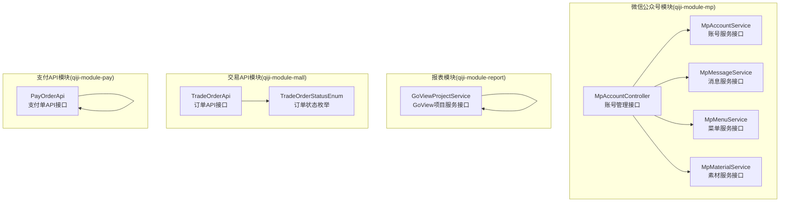
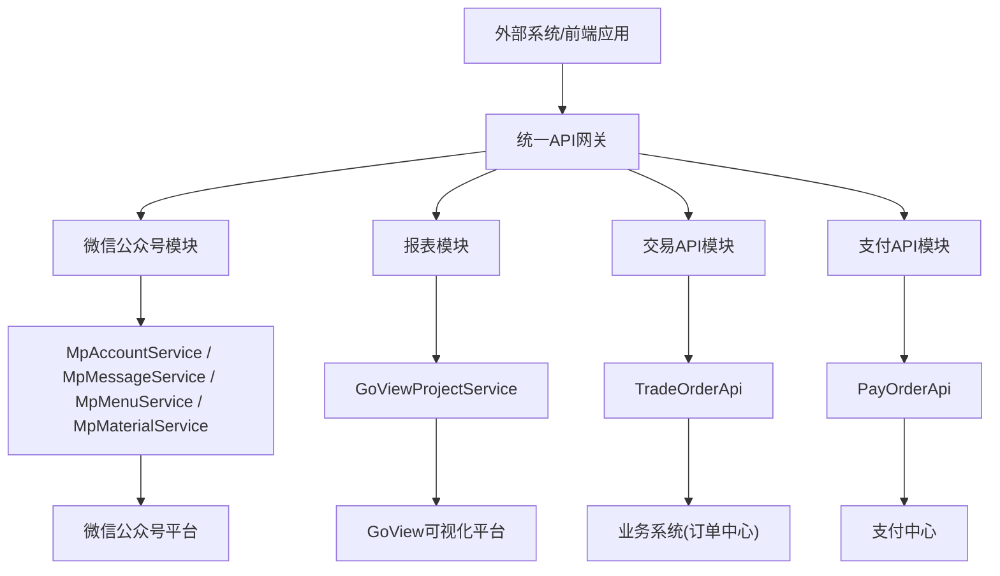
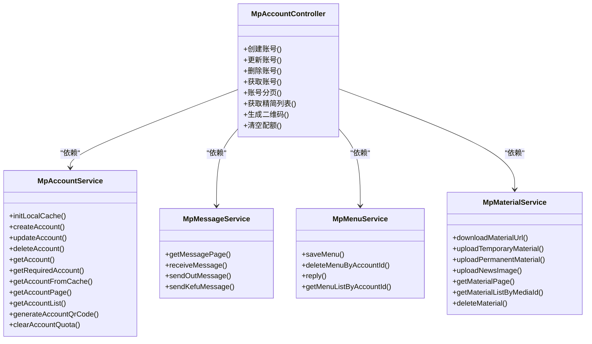
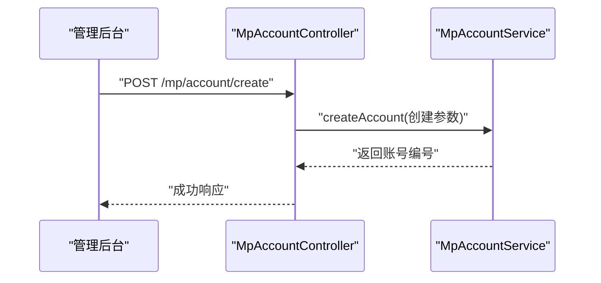
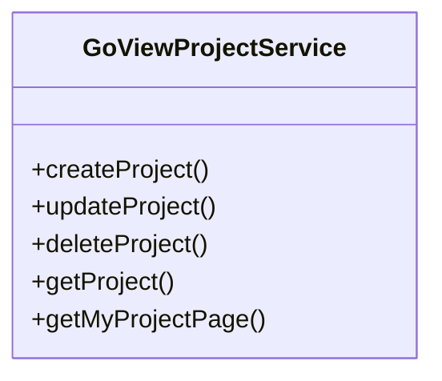
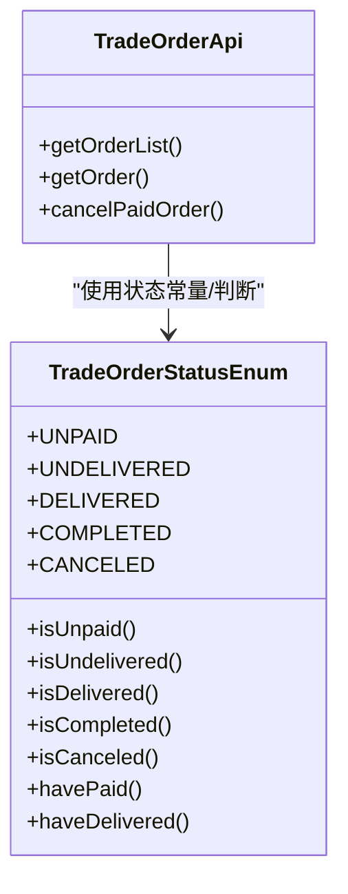
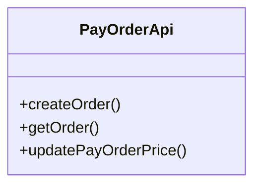
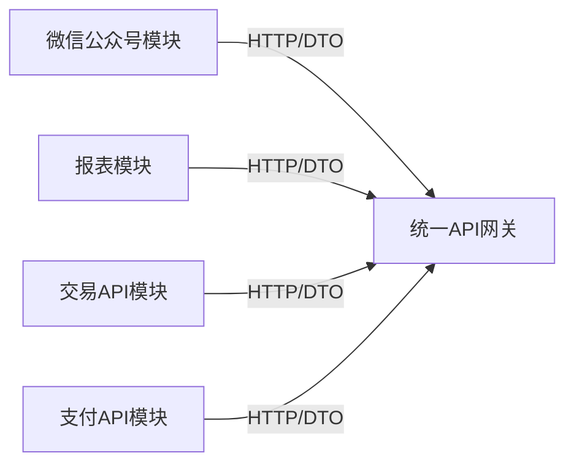

# 其他业务模块

<cite>
**本文引用的文件**
- [MpAccountController.java](file://qiji-module-mp/src/main/java/com.qiji.cps/module/mp/controller/admin/account/MpAccountController.java)
- [MpAccountService.java](file://qiji-module-mp/src/main/java/com.qiji.cps/module/mp/service/account/MpAccountService.java)
- [MpMessageService.java](file://qiji-module-mp/src/main/java/com.qiji.cps/module/mp/service/message/MpMessageService.java)
- [MpMenuService.java](file://qiji-module-mp/src/main/java/com.qiji.cps/module/mp/service/menu/MpMenuService.java)
- [MpMaterialService.java](file://qiji-module-mp/src/main/java/com.qiji.cps/module/mp/service/material/MpMaterialService.java)
- [GoViewProjectService.java](file://qiji-module-report/src/main/java/com.qiji.cps/module/report/service/goview/GoViewProjectService.java)
- [PayOrderApi.java](file://qiji-module-pay/src/main/java/com.qiji.cps/module/pay/api/order/PayOrderApi.java)
- [TradeOrderApi.java](file://qiji-module-mall/qiji-module-trade-api/src/main/java/com.qiji.cps/module/trade/api/order/TradeOrderApi.java)
- [TradeOrderStatusEnum.java](file://qiji-module-mall/qiji-module-trade-api/src/main/java/com.qiji.cps/module/trade/enums/order/TradeOrderStatusEnum.java)
</cite>

## 目录
1. [引言](#引言)
2. [项目结构](#项目结构)
3. [核心组件](#核心组件)
4. [架构总览](#架构总览)
5. [详细组件分析](#详细组件分析)
6. [依赖分析](#依赖分析)
7. [性能考虑](#性能考虑)
8. [故障排查指南](#故障排查指南)
9. [结论](#结论)
10. [附录](#附录)

## 引言
本文件面向AgenticCPS系统中的“其他业务模块”，重点覆盖以下三类功能：
- 微信公众号模块：提供公众号账号管理、粉丝互动、消息推送、菜单配置、素材管理等能力，支撑多公众号统一接入与运营。
- 报表模块：提供基于GoView的项目管理与可视化能力，支持运营人员构建数据看板与大屏展示。
- 交易API模块：提供标准化的订单与支付相关接口，便于外部系统集成与跨模块协同。

这些模块通过清晰的接口定义与统一的数据模型，实现了模块化解耦与能力复用，并在系统内以“API + DTO”的方式与上层业务进行对接。

## 项目结构
围绕“其他业务模块”的代码组织采用按模块划分的方式，每个模块包含Controller、Service、DAL、枚举与转换层，遵循高内聚、低耦合的设计原则。微信公众号模块位于qiji-module-mp，报表模块位于qiji-module-report，交易API模块位于qiji-module-mall下的qiji-module-trade-api，支付API模块位于qiji-module-pay。

图示来源
- [MpAccountController.java:22-98](file://qiji-module-mp/src/main/java/com.qiji.cps/module/mp/controller/admin/account/MpAccountController.java#L22-L98)
- [MpAccountService.java:20-110](file://qiji-module-mp/src/main/java/com.qiji.cps/module/mp/service/account/MpAccountService.java#L20-L110)
- [MpMessageService.java:19-59](file://qiji-module-mp/src/main/java/com.qiji.cps/module/mp/service/message/MpMessageService.java#L19-L59)
- [MpMenuService.java:15-49](file://qiji-module-mp/src/main/java/com.qiji.cps/module/mp/service/menu/MpMenuService.java#L15-L49)
- [MpMaterialService.java:21-84](file://qiji-module-mp/src/main/java/com.qiji.cps/module/mp/service/material/MpMaterialService.java#L21-L84)
- [GoViewProjectService.java:16-57](file://qiji-module-report/src/main/java/com.qiji.cps/module/report/service/goview/GoViewProjectService.java#L16-L57)
- [TradeOrderApi.java:13-40](file://qiji-module-mall/qiji-module-trade-api/src/main/java/com.qiji.cps/module/trade/api/order/TradeOrderApi.java#L13-L40)
- [TradeOrderStatusEnum.java:18-116](file://qiji-module-mall/qiji-module-trade-api/src/main/java/com.qiji.cps/module/trade/enums/order/TradeOrderStatusEnum.java#L18-L116)
- [PayOrderApi.java:14-40](file://qiji-module-pay/src/main/java/com.qiji.cps/module/pay/api/order/PayOrderApi.java#L14-L40)

章节来源
- [MpAccountController.java:22-98](file://qiji-module-mp/src/main/java/com.qiji.cps/module/mp/controller/admin/account/MpAccountController.java#L22-L98)
- [GoViewProjectService.java:16-57](file://qiji-module-report/src/main/java/com.qiji.cps/module/report/service/goview/GoViewProjectService.java#L16-L57)
- [TradeOrderApi.java:13-40](file://qiji-module-mall/qiji-module-trade-api/src/main/java/com.qiji.cps/module/trade/api/order/TradeOrderApi.java#L13-L40)
- [PayOrderApi.java:14-40](file://qiji-module-pay/src/main/java/com.qiji.cps/module/pay/api/order/PayOrderApi.java#L14-L40)

## 核心组件
- 微信公众号账号管理：提供账号的增删改查、分页查询、二维码生成、配额清空等能力，控制器通过权限注解保护接口，服务层定义标准契约。
- 微信公众号消息与菜单：提供消息接收、自动回复、客服消息发送、菜单保存与查询等能力，支撑粉丝互动与内容分发。
- 微信公众号素材管理：提供临时/永久素材上传、图文图片上传、素材下载URL生成、素材分页查询与删除等能力，支撑内容资产的统一管理。
- 报表模块（GoView）：提供项目创建、更新、删除、查询与分页能力，支撑运营看板与大屏可视化。
- 交易API（订单）：提供订单列表/单个查询、取消支付订单等接口，配合状态枚举实现状态机判断。
- 支付API（支付单）：提供支付单创建、查询与价格更新等接口，支撑外部系统发起支付与对账。

章节来源
- [MpAccountController.java:31-96](file://qiji-module-mp/src/main/java/com.qiji.cps/module/mp/controller/admin/account/MpAccountController.java#L31-L96)
- [MpMessageService.java:29-57](file://qiji-module-mp/src/main/java/com.qiji.cps/module/mp/service/message/MpMessageService.java#L29-L57)
- [MpMenuService.java:17-47](file://qiji-module-mp/src/main/java/com.qiji.cps/module/mp/service/menu/MpMenuService.java#L17-L47)
- [MpMaterialService.java:23-82](file://qiji-module-mp/src/main/java/com.qiji.cps/module/mp/service/material/MpMaterialService.java#L23-L82)
- [GoViewProjectService.java:18-55](file://qiji-module-report/src/main/java/com.qiji.cps/module/report/service/goview/GoViewProjectService.java#L18-L55)
- [TradeOrderApi.java:15-38](file://qiji-module-mall/qiji-module-trade-api/src/main/java/com.qiji.cps/module/trade/api/order/TradeOrderApi.java#L15-L38)
- [PayOrderApi.java:16-38](file://qiji-module-pay/src/main/java/com.qiji.cps/module/pay/api/order/PayOrderApi.java#L16-L38)

## 架构总览
下图展示了“其他业务模块”在系统中的位置与交互关系。微信公众号模块负责与微信生态对接；报表模块提供可视化能力；交易与支付API模块为外部系统提供统一的下单与支付能力。

图示来源
- [MpAccountService.java:20-110](file://qiji-module-mp/src/main/java/com.qiji.cps/module/mp/service/account/MpAccountService.java#L20-L110)
- [MpMessageService.java:19-59](file://qiji-module-mp/src/main/java/com.qiji.cps/module/mp/service/message/MpMessageService.java#L19-L59)
- [MpMenuService.java:15-49](file://qiji-module-mp/src/main/java/com.qiji.cps/module/mp/service/menu/MpMenuService.java#L15-L49)
- [MpMaterialService.java:21-84](file://qiji-module-mp/src/main/java/com.qiji.cps/module/mp/service/material/MpMaterialService.java#L21-L84)
- [GoViewProjectService.java:16-57](file://qiji-module-report/src/main/java/com.qiji.cps/module/report/service/goview/GoViewProjectService.java#L16-L57)
- [TradeOrderApi.java:13-40](file://qiji-module-mall/qiji-module-trade-api/src/main/java/com.qiji.cps/module/trade/api/order/TradeOrderApi.java#L13-L40)
- [PayOrderApi.java:14-40](file://qiji-module-pay/src/main/java/com.qiji.cps/module/pay/api/order/PayOrderApi.java#L14-L40)

## 详细组件分析

### 微信公众号模块
该模块围绕“账号、消息、菜单、素材”四大能力展开，采用Controller-Service分层，接口职责清晰，便于扩展与维护。

图示来源
- [MpAccountController.java:26-98](file://qiji-module-mp/src/main/java/com.qiji.cps/module/mp/controller/admin/account/MpAccountController.java#L26-L98)
- [MpAccountService.java:20-110](file://qiji-module-mp/src/main/java/com.qiji.cps/module/mp/service/account/MpAccountService.java#L20-L110)
- [MpMessageService.java:19-59](file://qiji-module-mp/src/main/java/com.qiji.cps/module/mp/service/message/MpMessageService.java#L19-L59)
- [MpMenuService.java:15-49](file://qiji-module-mp/src/main/java/com.qiji.cps/module/mp/service/menu/MpMenuService.java#L15-L49)
- [MpMaterialService.java:21-84](file://qiji-module-mp/src/main/java/com.qiji.cps/module/mp/service/material/MpMaterialService.java#L21-L84)

#### 功能特性与流程
- 账号管理：提供账号的创建、更新、删除、分页查询与二维码生成，支持清空配额以重置调用限制。
- 粉丝互动：接收粉丝消息并生成回复消息对象，支持客服消息真实发送。
- 消息推送：通过消息服务生成回复消息对象，供后续发送或记录。
- 菜单配置：保存与删除菜单，根据粉丝点击事件返回对应消息。
- 素材管理：支持临时/永久素材上传、图文图片上传、素材URL生成、分页查询与删除。

图示来源
- [MpAccountController.java:31-36](file://qiji-module-mp/src/main/java/com.qiji.cps/module/mp/controller/admin/account/MpAccountController.java#L31-L36)
- [MpAccountService.java:33-33](file://qiji-module-mp/src/main/java/com.qiji.cps/module/mp/service/account/MpAccountService.java#L33-L33)

章节来源
- [MpAccountController.java:31-96](file://qiji-module-mp/src/main/java/com.qiji.cps/module/mp/controller/admin/account/MpAccountController.java#L31-L96)
- [MpAccountService.java:20-110](file://qiji-module-mp/src/main/java/com.qiji.cps/module/mp/service/account/MpAccountService.java#L20-L110)
- [MpMessageService.java:19-59](file://qiji-module-mp/src/main/java/com.qiji.cps/module/mp/service/message/MpMessageService.java#L19-L59)
- [MpMenuService.java:15-49](file://qiji-module-mp/src/main/java/com.qiji.cps/module/mp/service/menu/MpMenuService.java#L15-L49)
- [MpMaterialService.java:21-84](file://qiji-module-mp/src/main/java/com.qiji.cps/module/mp/service/material/MpMaterialService.java#L21-L84)

### 报表模块（GoView）
该模块提供GoView项目的创建、更新、删除、查询与分页能力，便于运营人员构建数据看板与大屏可视化。

图示来源
- [GoViewProjectService.java:16-57](file://qiji-module-report/src/main/java/com.qiji.cps/module/report/service/goview/GoViewProjectService.java#L16-L57)

章节来源
- [GoViewProjectService.java:16-57](file://qiji-module-report/src/main/java/com.qiji.cps/module/report/service/goview/GoViewProjectService.java#L16-L57)

### 交易API模块
交易API模块提供标准化的订单查询与取消支付订单能力，配合订单状态枚举实现状态判断。

图示来源
- [TradeOrderApi.java:13-40](file://qiji-module-mall/qiji-module-trade-api/src/main/java/com.qiji.cps/module/trade/api/order/TradeOrderApi.java#L13-L40)
- [TradeOrderStatusEnum.java:18-116](file://qiji-module-mall/qiji-module-trade-api/src/main/java/com.qiji.cps/module/trade/enums/order/TradeOrderStatusEnum.java#L18-L116)

章节来源
- [TradeOrderApi.java:13-40](file://qiji-module-mall/qiji-module-trade-api/src/main/java/com.qiji.cps/module/trade/api/order/TradeOrderApi.java#L13-L40)
- [TradeOrderStatusEnum.java:18-116](file://qiji-module-mall/qiji-module-trade-api/src/main/java/com.qiji.cps/module/trade/enums/order/TradeOrderStatusEnum.java#L18-L116)

### 交易API模块（支付）
支付API模块提供支付单创建、查询与价格更新能力，支持外部系统发起支付与对账。

图示来源
- [PayOrderApi.java:14-40](file://qiji-module-pay/src/main/java/com.qiji.cps/module/pay/api/order/PayOrderApi.java#L14-L40)

章节来源
- [PayOrderApi.java:14-40](file://qiji-module-pay/src/main/java/com.qiji.cps/module/pay/api/order/PayOrderApi.java#L14-L40)

## 依赖分析
- 模块内聚：各模块内部均采用Controller-Service分层，接口职责明确，降低耦合度。
- 外部依赖：微信公众号模块依赖微信SDK（WxJava），报表模块依赖GoView平台，交易与支付模块依赖各自领域模型与枚举。
- 统一接口：模块间通过API接口与DTO进行交互，避免直接耦合具体实现细节。

图示来源
- [MpAccountController.java:22-98](file://qiji-module-mp/src/main/java/com.qiji.cps/module/mp/controller/admin/account/MpAccountController.java#L22-L98)
- [GoViewProjectService.java:16-57](file://qiji-module-report/src/main/java/com.qiji.cps/module/report/service/goview/GoViewProjectService.java#L16-L57)
- [TradeOrderApi.java:13-40](file://qiji-module-mall/qiji-module-trade-api/src/main/java/com.qiji.cps/module/trade/api/order/TradeOrderApi.java#L13-L40)
- [PayOrderApi.java:14-40](file://qiji-module-pay/src/main/java/com.qiji.cps/module/pay/api/order/PayOrderApi.java#L14-L40)

## 性能考虑
- 缓存策略：账号服务提供本地缓存初始化方法，建议结合分布式缓存减少重复查询开销。
- 分页查询：账号、消息、素材均提供分页接口，建议合理设置分页大小与排序字段，避免大数据量扫描。
- 素材上传：临时素材适合高频短链路使用，永久素材适合长期复用，需结合业务场景选择合适类型。
- 状态判断：订单状态枚举提供便捷的状态判断方法，建议在业务处理中优先使用，减少重复比较逻辑。

## 故障排查指南
- 权限不足：接口带有权限注解，若出现403，请确认当前用户是否具备相应权限。
- 账号不存在：账号服务提供“必需账号”方法，若账号不存在会抛出业务异常，需检查入参与数据库状态。
- 配额限制：公众号存在接口调用频次限制，可通过清空配额接口重置，但需谨慎使用。
- 状态不一致：订单状态枚举提供多种判断方法，排查问题时可先确认当前状态是否符合预期。

章节来源
- [MpAccountController.java:31-96](file://qiji-module-mp/src/main/java/com.qiji.cps/module/mp/controller/admin/account/MpAccountController.java#L31-L96)
- [MpAccountService.java:55-69](file://qiji-module-mp/src/main/java/com.qiji.cps/module/mp/service/account/MpAccountService.java#L55-L69)
- [TradeOrderStatusEnum.java:45-114](file://qiji-module-mall/qiji-module-trade-api/src/main/java/com.qiji.cps/module/trade/enums/order/TradeOrderStatusEnum.java#L45-L114)

## 结论
微信公众号模块、报表模块与交易/支付API模块共同构成了AgenticCPS系统对外服务能力的重要组成部分。通过清晰的接口定义、稳定的DTO契约与模块化的架构设计，这些模块实现了功能解耦与能力复用，能够有效支撑多公众号运营、数据可视化与外部系统集成需求。

## 附录
- 配置建议
  - 微信公众号：在账号管理中完成AppId/AppSecret配置，并定期检查配额与二维码有效性。
  - 报表模块：在GoView平台创建项目后，确保访问权限与数据源配置正确。
  - 交易/支付：在调用前校验订单状态与支付参数，必要时使用状态枚举辅助判断。
- 使用示例（路径指引）
  - 创建公众号账号：[MpAccountController.java:31-36](file://qiji-module-mp/src/main/java/com.qiji.cps/module/mp/controller/admin/account/MpAccountController.java#L31-L36)
  - 发送客服消息：[MpMessageService.java:50-57](file://qiji-module-mp/src/main/java/com.qiji.cps/module/mp/service/message/MpMessageService.java#L50-L57)
  - 保存菜单：[MpMenuService.java:17-22](file://qiji-module-mp/src/main/java/com.qiji.cps/module/mp/service/menu/MpMenuService.java#L17-L22)
  - 上传素材：[MpMaterialService.java:36-51](file://qiji-module-mp/src/main/java/com.qiji.cps/module/mp/service/material/MpMaterialService.java#L36-L51)
  - 创建GoView项目：[GoViewProjectService.java:18-24](file://qiji-module-report/src/main/java/com.qiji.cps/module/report/service/goview/GoViewProjectService.java#L18-L24)
  - 查询订单：[TradeOrderApi.java:21-29](file://qiji-module-mall/qiji-module-trade-api/src/main/java/com.qiji.cps/module/trade/api/order/TradeOrderApi.java#L21-L29)
  - 创建支付单：[PayOrderApi.java:16-22](file://qiji-module-pay/src/main/java/com.qiji.cps/module/pay/api/order/PayOrderApi.java#L16-L22)