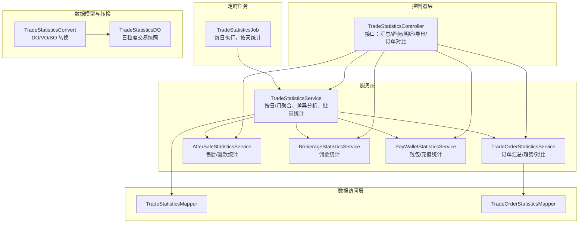
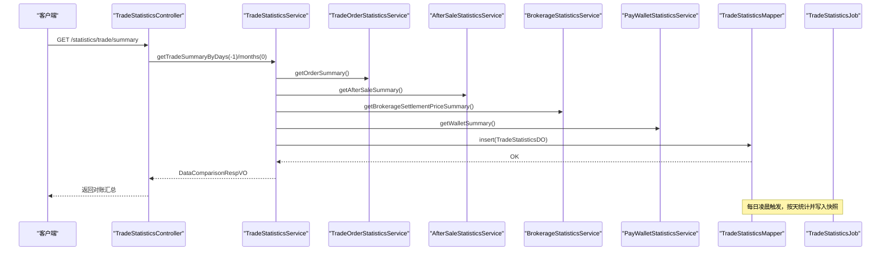
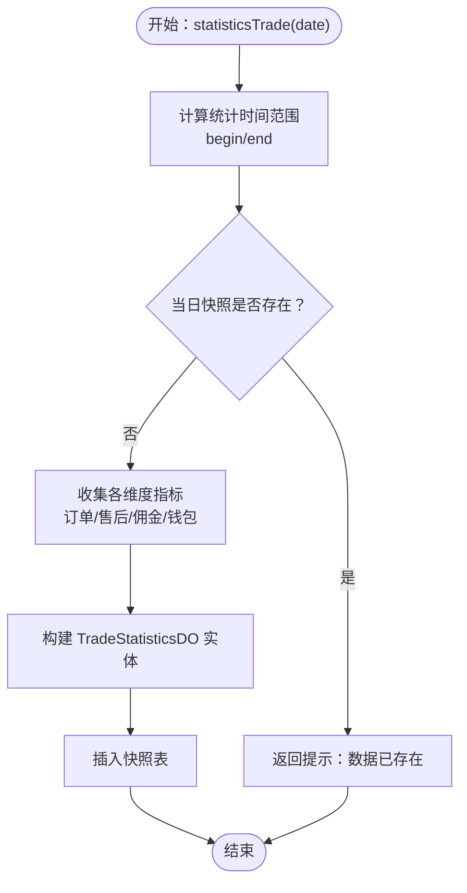
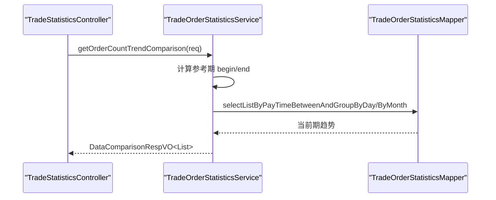
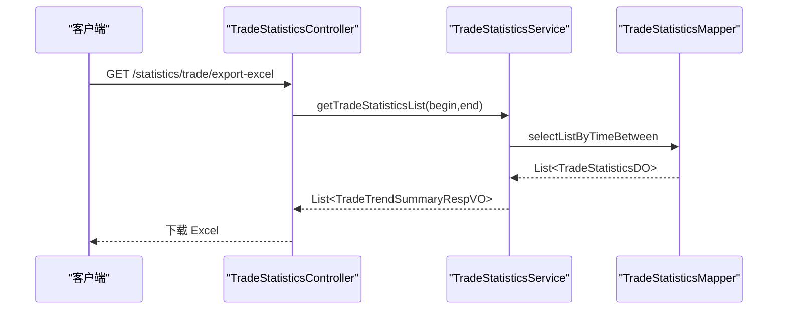
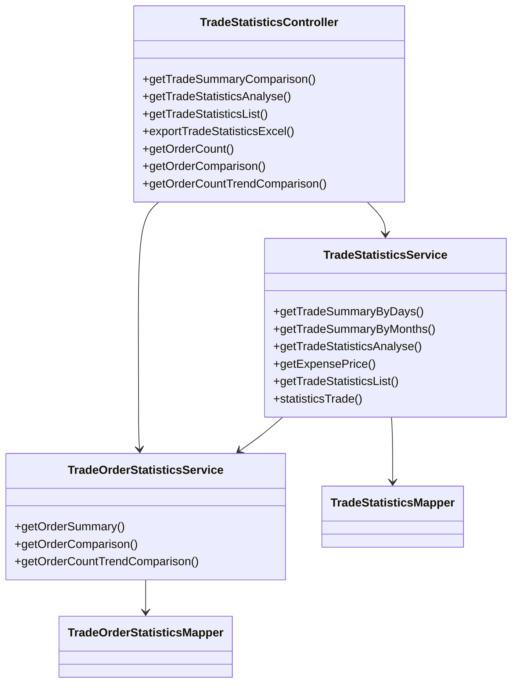

# 交易对账管理

<cite>
**本文引用的文件**
- [TradeStatisticsController.java](file://yudao-module-mall/yudao-module-statistics/src/main/java/cn/iocoder/yudao/module/statistics/controller/admin/trade/TradeStatisticsController.java)
- [TradeStatisticsServiceImpl.java](file://yudao-module-mall/yudao-module-statistics/src/main/java/cn/iocoder/yudao/module/statistics/service/trade/TradeStatisticsServiceImpl.java)
- [TradeOrderStatisticsServiceImpl.java](file://yudao-module-mall/yudao-module-statistics/src/main/java/cn/iocoder/yudao/module/statistics/service/trade/TradeOrderStatisticsServiceImpl.java)
- [TradeStatisticsDO.java](file://yudao-module-mall/yudao-module-statistics/src/main/java/cn/iocoder/yudao/module/statistics/dal/dataobject/trade/TradeStatisticsDO.java)
- [TradeStatisticsMapper.java](file://yudao-module-mall/yudao-module-statistics/src/main/java/cn/iocoder/yudao/module/statistics/dal/mysql/trade/TradeStatisticsMapper.java)
- [TradeOrderStatisticsMapper.java](file://yudao-module-mall/yudao-module-statistics/src/main/java/cn/iocoder/yudao/module/statistics/dal/mysql/trade/TradeOrderStatisticsMapper.java)
- [TradeStatisticsJob.java](file://yudao-module-mall/yudao-module-statistics/src/main/java/cn/iocoder/yudao/module/statistics/job/trade/TradeStatisticsJob.java)
- [TimeRangeTypeEnum.java](file://yudao-module-mall/yudao-module-statistics/src/main/java/cn/iocoder/yudao/module/statistics/enums/TimeRangeTypeEnum.java)
- [TradeTrendSummaryExcelVO.java](file://yudao-module-mall/yudao-module-statistics/src/main/java/cn/iocoder/yudao/module/statistics/controller/admin/trade/vo/TradeTrendSummaryExcelVO.java)
- [TradeOrderStatisticsService.java](file://yudao-module-mall/yudao-module-statistics/src/main/java/cn/iocoder/yudao/module/statistics/service/trade/TradeOrderStatisticsService.java)
- [TradeStatisticsService.java](file://yudao-module-mall/yudao-module-statistics/src/main/java/cn/iocoder/yudao/module/statistics/service/trade/TradeStatisticsService.java)
- [AfterSaleStatisticsService.java](file://yudao-module-mall/yudao-module-statistics/src/main/java/cn/iocoder/yudao/module/statistics/service/trade/AfterSaleStatisticsService.java)
- [BrokerageStatisticsService.java](file://yudao-module-mall/yudao-module-statistics/src/main/java/cn/iocoder/yudao/module/statistics/service/trade/BrokerageStatisticsService.java)
- [PayWalletStatisticsService.java](file://yudao-module-mall/yudao-module-statistics/src/main/java/cn/iocoder/yudao/module/statistics/service/pay/PayWalletStatisticsService.java)
- [TradeOrderSummaryRespBO.java](file://yudao-module-mall/yudao-module-statistics/src/main/java/cn/iocoder/yudao/module/statistics/service/trade/bo/TradeOrderSummaryRespBO.java)
- [TradeSummaryRespBO.java](file://yudao-module-mall/yudao-module-statistics/src/main/java/cn/iocoder/yudao/module/statistics/service/trade/bo/TradeSummaryRespBO.java)
- [TradeOrderTrendReqVO.java](file://yudao-module-mall/yudao-module-statistics/src/main/java/cn/iocoder/yudao/module/statistics/controller/admin/trade/vo/TradeOrderTrendReqVO.java)
- [TradeOrderTrendRespVO.java](file://yudao-module-mall/yudao-module-statistics/src/main/java/cn/iocoder/yudao/module/statistics/controller/admin/trade/vo/TradeOrderTrendRespVO.java)
- [TradeOrderCountRespVO.java](file://yudao-module-mall/yudao-module-statistics/src/main/java/cn/iocoder/yudao/module/statistics/controller/admin/trade/vo/TradeOrderCountRespVO.java)
- [TradeTrendReqVO.java](file://yudao-module-mall/yudao-module-statistics/src/main/java/cn/iocoder/yudao/module/statistics/controller/admin/trade/vo/TradeTrendReqVO.java)
- [TradeTrendSummaryRespVO.java](file://yudao-module-mall/yudao-module-statistics/src/main/java/cn/iocoder/yudao/module/statistics/controller/admin/trade/vo/TradeTrendSummaryRespVO.java)
- [DataComparisonRespVO.java](file://yudao-module-mall/yudao-module-statistics/src/main/java/cn/iocoder/yudao/module/statistics/controller/admin/common/vo/DataComparisonRespVO.java)
- [TradeStatisticsConvert.java](file://yudao-module-mall/yudao-module-statistics/src/main/java/cn/iocoder/yudao/module/statistics/convert/trade/TradeStatisticsConvert.java)
- [TradeStatisticsJob.java](file://yudao-module-mall/yudao-module-statistics/src/main/java/cn/iocoder/yudao/module/statistics/job/trade/TradeStatisticsJob.java)
- [TradeStatisticsController.java](file://yudao-module-mall/yudao-module-statistics/src/main/java/cn/iocoder/yudao/module/statistics/controller/admin/trade/TradeStatisticsController.java)
</cite>

## 目录
1. [引言](#引言)
2. [项目结构](#项目结构)
3. [核心组件](#核心组件)
4. [架构总览](#架构总览)
5. [详细组件分析](#详细组件分析)
6. [依赖关系分析](#依赖关系分析)
7. [性能考虑](#性能考虑)
8. [故障排查指南](#故障排查指南)
9. [结论](#结论)
10. [附录](#附录)

## 引言
本文件面向“交易对账管理”业务，基于现有代码库中的交易统计与报表能力，系统化梳理对账管理的完整闭环：覆盖订单对账、退款对账、手续费/佣金对账、利润统计等核心流程；明确对账规则与算法（收入确认、成本核算、费用分摊、利润计算）；阐述对账周期管理（日/月/年）；给出差异处理、异常监控、报表展示与合规审计要点，并提供自动化处理与准确性保障方案。

## 项目结构
交易对账管理主要由“统计服务层 + 控制器 + 定时任务 + 数据模型 + VO/BO/枚举 + Mapper”构成，围绕每日交易快照表进行聚合统计与对外输出。

图表来源
- [TradeStatisticsController.java:41-131](file://yudao-module-mall/yudao-module-statistics/src/main/java/cn/iocoder/yudao/module/statistics/controller/admin/trade/TradeStatisticsController.java#L41-L131)
- [TradeStatisticsServiceImpl.java:34-136](file://yudao-module-mall/yudao-module-statistics/src/main/java/cn/iocoder/yudao/module/statistics/service/trade/TradeStatisticsServiceImpl.java#L34-L136)
- [TradeOrderStatisticsServiceImpl.java:30-108](file://yudao-module-mall/yudao-module-statistics/src/main/java/cn/iocoder/yudao/module/statistics/service/trade/TradeOrderStatisticsServiceImpl.java#L30-L108)
- [TradeStatisticsDO.java:26-90](file://yudao-module-mall/yudao-module-statistics/src/main/java/cn/iocoder/yudao/module/statistics/dal/dataobject/trade/TradeStatisticsDO.java#L26-L90)
- [TradeStatisticsMapper.java](file://yudao-module-mall/yudao-module-statistics/src/main/java/cn/iocoder/yudao/module/statistics/dal/mysql/trade/TradeStatisticsMapper.java)
- [TradeOrderStatisticsMapper.java](file://yudao-module-mall/yudao-module-statistics/src/main/java/cn/iocoder/yudao/module/statistics/dal/mysql/trade/TradeOrderStatisticsMapper.java)
- [TradeStatisticsJob.java:20-49](file://yudao-module-mall/yudao-module-statistics/src/main/java/cn/iocoder/yudao/module/statistics/job/trade/TradeStatisticsJob.java#L20-L49)
- [TradeStatisticsConvert.java](file://yudao-module-mall/yudao-module-statistics/src/main/java/cn/iocoder/yudao/module/statistics/convert/trade/TradeStatisticsConvert.java)

章节来源
- [TradeStatisticsController.java:41-131](file://yudao-module-mall/yudao-module-statistics/src/main/java/cn/iocoder/yudao/module/statistics/controller/admin/trade/TradeStatisticsController.java#L41-L131)
- [TradeStatisticsServiceImpl.java:34-136](file://yudao-module-mall/yudao-module-statistics/src/main/java/cn/iocoder/yudao/module/statistics/service/trade/TradeStatisticsServiceImpl.java#L34-L136)
- [TradeOrderStatisticsServiceImpl.java:30-108](file://yudao-module-mall/yudao-module-statistics/src/main/java/cn/iocoder/yudao/module/statistics/service/trade/TradeOrderStatisticsServiceImpl.java#L30-L108)
- [TradeStatisticsDO.java:26-90](file://yudao-module-mall/yudao-module-statistics/src/main/java/cn/iocoder/yudao/module/statistics/dal/dataobject/trade/TradeStatisticsDO.java#L26-L90)

## 核心组件
- 控制器层：提供交易统计的汇总、趋势、明细、导出、订单对比等接口，统一权限控制与响应封装。
- 服务层：
  - 交易统计服务：按日/月聚合，生成日粒度交易快照，支持同比/环比差异分析。
  - 订单统计服务：提供订单创建/支付数量与金额、区域分布、用户数、趋势对比等。
  - 售后/退款统计服务：提供售后申请、退款金额等维度统计。
  - 佣金统计服务：提供已结算佣金金额统计。
  - 钱包/充值统计服务：提供充值金额、退款金额等统计。
- 定时任务：每日自动执行，按天统计并写入日粒度快照表。
- 数据模型与转换：日粒度交易快照实体、VO/BO/DO转换器。
- 枚举与请求体：时间范围类型、趋势请求体、对比响应体等。

章节来源
- [TradeStatisticsController.java:41-131](file://yudao-module-mall/yudao-module-statistics/src/main/java/cn/iocoder/yudao/module/statistics/controller/admin/trade/TradeStatisticsController.java#L41-L131)
- [TradeStatisticsServiceImpl.java:34-136](file://yudao-module-mall/yudao-module-statistics/src/main/java/cn/iocoder/yudao/module/statistics/service/trade/TradeStatisticsServiceImpl.java#L34-L136)
- [TradeOrderStatisticsServiceImpl.java:30-108](file://yudao-module-mall/yudao-module-statistics/src/main/java/cn/iocoder/yudao/module/statistics/service/trade/TradeOrderStatisticsServiceImpl.java#L30-L108)
- [TradeStatisticsDO.java:26-90](file://yudao-module-mall/yudao-module-statistics/src/main/java/cn/iocoder/yudao/module/statistics/dal/dataobject/trade/TradeStatisticsDO.java#L26-L90)
- [TimeRangeTypeEnum.java:16-48](file://yudao-module-mall/yudao-module-statistics/src/main/java/cn/iocoder/yudao/module/statistics/enums/TimeRangeTypeEnum.java#L16-L48)
- [TradeStatisticsConvert.java](file://yudao-module-mall/yudao-module-statistics/src/main/java/cn/iocoder/yudao/module/statistics/convert/trade/TradeStatisticsConvert.java)

## 架构总览
交易对账管理采用“控制器-服务-数据访问-定时任务”的分层架构，通过日粒度快照表实现对账数据的稳定存储与高效查询。

图表来源
- [TradeStatisticsController.java:52-67](file://yudao-module-mall/yudao-module-statistics/src/main/java/cn/iocoder/yudao/module/statistics/controller/admin/trade/TradeStatisticsController.java#L52-L67)
- [TradeStatisticsServiceImpl.java:48-81](file://yudao-module-mall/yudao-module-statistics/src/main/java/cn/iocoder/yudao/module/statistics/service/trade/TradeStatisticsServiceImpl.java#L48-L81)
- [TradeStatisticsMapper.java](file://yudao-module-mall/yudao-module-statistics/src/main/java/cn/iocoder/yudao/module/statistics/dal/mysql/trade/TradeStatisticsMapper.java)
- [TradeStatisticsJob.java:32-46](file://yudao-module-mall/yudao-module-statistics/src/main/java/cn/iocoder/yudao/module/statistics/job/trade/TradeStatisticsJob.java#L32-L46)

## 详细组件分析

### 交易统计服务（按日/月聚合、差异分析、批量统计）
- 功能职责
  - 按日/月聚合订单、售后、佣金、钱包等指标，生成日粒度交易快照。
  - 提供同比/环比差异分析，支持多维度对比。
  - 支持批量统计最近N天数据。
- 关键流程
  - 统计前检查当日是否已存在快照，避免重复统计。
  - 分别调用订单、售后、佣金、钱包服务获取指标，组装为日粒度快照实体并入库。
  - 提供按天/月查询与导出明细。

图表来源
- [TradeStatisticsServiceImpl.java:98-133](file://yudao-module-mall/yudao-module-statistics/src/main/java/cn/iocoder/yudao/module/statistics/service/trade/TradeStatisticsServiceImpl.java#L98-L133)

章节来源
- [TradeStatisticsServiceImpl.java:48-133](file://yudao-module-mall/yudao-module-statistics/src/main/java/cn/iocoder/yudao/module/statistics/service/trade/TradeStatisticsServiceImpl.java#L48-L133)
- [TradeStatisticsDO.java:26-90](file://yudao-module-mall/yudao-module-statistics/src/main/java/cn/iocoder/yudao/module/statistics/dal/dataobject/trade/TradeStatisticsDO.java#L26-L90)

### 订单统计服务（数量/金额、趋势、对比）
- 功能职责
  - 订单创建数、支付数、支付金额等汇总。
  - 区域分布、用户数统计。
  - 订单量趋势（按天/按月分组），支持同比/环比对比。
- 关键流程
  - 按时间范围查询订单统计指标。
  - 根据时间范围类型选择按日或按月分组。
  - 生成对比数据（当前 vs 昨日/上周/上月）。

图表来源
- [TradeOrderStatisticsServiceImpl.java:82-105](file://yudao-module-mall/yudao-module-statistics/src/main/java/cn/iocoder/yudao/module/statistics/service/trade/TradeOrderStatisticsServiceImpl.java#L82-L105)
- [TimeRangeTypeEnum.java:16-48](file://yudao-module-mall/yudao-module-statistics/src/main/java/cn/iocoder/yudao/module/statistics/enums/TimeRangeTypeEnum.java#L16-L48)

章节来源
- [TradeOrderStatisticsServiceImpl.java:35-105](file://yudao-module-mall/yudao-module-statistics/src/main/java/cn/iocoder/yudao/module/statistics/service/trade/TradeOrderStatisticsServiceImpl.java#L35-L105)
- [TradeOrderStatisticsMapper.java](file://yudao-module-mall/yudao-module-statistics/src/main/java/cn/iocoder/yudao/module/statistics/dal/mysql/trade/TradeOrderStatisticsMapper.java)

### 对账报表与导出
- 报表内容
  - 交易汇总：按日/月对比，包含订单、支付金额、退款、佣金、充值等。
  - 交易趋势：按天/月趋势，支持同比/环比。
  - 明细列表：支持导出 Excel，字段包含日期、营业额、商品支付金额、充值金额、支出金额、余额支付金额、支付佣金金额、商品退款金额等。
- 导出流程
  - 查询明细列表 → VO 转换 → Excel 写出。

图表来源
- [TradeStatisticsController.java:86-96](file://yudao-module-mall/yudao-module-statistics/src/main/java/cn/iocoder/yudao/module/statistics/controller/admin/trade/TradeStatisticsController.java#L86-L96)
- [TradeTrendSummaryExcelVO.java:18-44](file://yudao-module-mall/yudao-module-statistics/src/main/java/cn/iocoder/yudao/module/statistics/controller/admin/trade/vo/TradeTrendSummaryExcelVO.java#L18-L44)

章节来源
- [TradeStatisticsController.java:52-96](file://yudao-module-mall/yudao-module-statistics/src/main/java/cn/iocoder/yudao/module/statistics/controller/admin/trade/TradeStatisticsController.java#L52-L96)
- [TradeTrendSummaryExcelVO.java:18-44](file://yudao-module-mall/yudao-module-statistics/src/main/java/cn/iocoder/yudao/module/statistics/controller/admin/trade/vo/TradeTrendSummaryExcelVO.java#L18-L44)

### 对账周期管理（日/月/年）
- 日对账：每日定时任务执行，生成当日交易快照。
- 月对账：按自然月聚合，支持上月对比。
- 年对账：通过月聚合实现年度汇总。
- 趋势分析：支持按天/月分组的趋势对比。

章节来源
- [TradeStatisticsServiceImpl.java:48-60](file://yudao-module-mall/yudao-module-statistics/src/main/java/cn/iocoder/yudao/module/statistics/service/trade/TradeStatisticsServiceImpl.java#L48-L60)
- [TradeOrderStatisticsServiceImpl.java:98-105](file://yudao-module-mall/yudao-module-statistics/src/main/java/cn/iocoder/yudao/module/statistics/service/trade/TradeOrderStatisticsServiceImpl.java#L98-L105)
- [TimeRangeTypeEnum.java:16-48](file://yudao-module-mall/yudao-module-statistics/src/main/java/cn/iocoder/yudao/module/statistics/enums/TimeRangeTypeEnum.java#L16-L48)

### 对账差异处理（识别、分析、调整、监控）
- 差异识别：通过“当前 vs 参照期”对比，识别订单量、金额等指标的异常波动。
- 原因分析：结合订单、售后、佣金、钱包等维度分别定位差异来源。
- 调整处理：若发现重复统计或错误数据，可在快照表中删除后重跑。
- 异常监控：定时任务参数校验、日志记录与耗时监控，便于及时发现异常。

章节来源
- [TradeStatisticsController.java:115-128](file://yudao-module-mall/yudao-module-statistics/src/main/java/cn/iocoder/yudao/module/statistics/controller/admin/trade/TradeStatisticsController.java#L115-L128)
- [TradeOrderStatisticsServiceImpl.java:82-96](file://yudao-module-mall/yudao-module-statistics/src/main/java/cn/iocoder/yudao/module/statistics/service/trade/TradeOrderStatisticsServiceImpl.java#L82-L96)
- [TradeStatisticsJob.java:32-46](file://yudao-module-mall/yudao-module-statistics/src/main/java/cn/iocoder/yudao/module/statistics/job/trade/TradeStatisticsJob.java#L32-L46)

### 对账规则与算法（收入确认、成本核算、费用分摊、利润计算）
- 收入确认
  - 订单支付金额：来自订单支付统计。
  - 充值金额：来自钱包充值统计。
- 成本核算
  - 退款金额：来自售后统计。
  - 支出金额：来自交易快照中的支出字段（如钱包提现/支出等）。
- 费用分摊
  - 佣金金额（已结算）：来自佣金统计。
- 利润计算
  - 利润 = 收入 - 退款 - 支出 - 佣金
  - 利润率 = 利润 / 收入（若收入非零）

章节来源
- [TradeStatisticsDO.java:48-89](file://yudao-module-mall/yudao-module-statistics/src/main/java/cn/iocoder/yudao/module/statistics/dal/dataobject/trade/TradeStatisticsDO.java#L48-L89)
- [TradeOrderSummaryRespBO.java:11-23](file://yudao-module-mall/yudao-module-statistics/src/main/java/cn/iocoder/yudao/module/statistics/service/trade/bo/TradeOrderSummaryRespBO.java#L11-L23)

### 合规要求与审计需求
- 数据一致性：每日定时任务仅在快照不存在时执行，避免重复统计。
- 参数校验：定时任务参数必须为正整数。
- 权限控制：接口使用注解鉴权，确保仅授权用户可访问。
- 可追溯性：导出明细与日志记录，便于审计与复核。

章节来源
- [TradeStatisticsJob.java:32-46](file://yudao-module-mall/yudao-module-statistics/src/main/java/cn/iocoder/yudao/module/statistics/job/trade/TradeStatisticsJob.java#L32-L46)
- [TradeStatisticsController.java:52-67](file://yudao-module-mall/yudao-module-statistics/src/main/java/cn/iocoder/yudao/module/statistics/controller/admin/trade/TradeStatisticsController.java#L52-L67)

### 自动化处理与准确性保障
- 自动化：定时任务每日自动执行，按天统计并写入快照。
- 准确性保障：
  - 快照去重：统计前检查当日是否存在快照。
  - 耗时监控：统计过程使用计时器记录各阶段耗时。
  - 参数校验：定时任务参数校验，防止非法输入。
  - 导出一致性：明细导出前统一转换为 Excel VO。

章节来源
- [TradeStatisticsServiceImpl.java:103-133](file://yudao-module-mall/yudao-module-statistics/src/main/java/cn/iocoder/yudao/module/statistics/service/trade/TradeStatisticsServiceImpl.java#L103-L133)
- [TradeStatisticsJob.java:32-46](file://yudao-module-mall/yudao-module-statistics/src/main/java/cn/iocoder/yudao/module/statistics/job/trade/TradeStatisticsJob.java#L32-L46)

## 依赖关系分析

图表来源
- [TradeStatisticsController.java:41-131](file://yudao-module-mall/yudao-module-statistics/src/main/java/cn/iocoder/yudao/module/statistics/controller/admin/trade/TradeStatisticsController.java#L41-L131)
- [TradeStatisticsServiceImpl.java:34-136](file://yudao-module-mall/yudao-module-statistics/src/main/java/cn/iocoder/yudao/module/statistics/service/trade/TradeStatisticsServiceImpl.java#L34-L136)
- [TradeOrderStatisticsServiceImpl.java:30-108](file://yudao-module-mall/yudao-module-statistics/src/main/java/cn/iocoder/yudao/module/statistics/service/trade/TradeOrderStatisticsServiceImpl.java#L30-L108)

章节来源
- [TradeStatisticsController.java:41-131](file://yudao-module-mall/yudao-module-statistics/src/main/java/cn/iocoder/yudao/module/statistics/controller/admin/trade/TradeStatisticsController.java#L41-L131)
- [TradeStatisticsServiceImpl.java:34-136](file://yudao-module-mall/yudao-module-statistics/src/main/java/cn/iocoder/yudao/module/statistics/service/trade/TradeStatisticsServiceImpl.java#L34-L136)
- [TradeOrderStatisticsServiceImpl.java:30-108](file://yudao-module-mall/yudao-module-statistics/src/main/java/cn/iocoder/yudao/module/statistics/service/trade/TradeOrderStatisticsServiceImpl.java#L30-L108)

## 性能考虑
- 分层聚合：通过日粒度快照表降低复杂查询成本，提高趋势与对比查询性能。
- 分组策略：按年统计时按月分组，其他周期按天分组，减少大数据量扫描。
- 批量统计：支持按天批量重跑，便于修复历史数据。
- 监控与告警：定时任务记录耗时，便于发现慢查询与异常。

## 故障排查指南
- 快照重复：若提示“数据已存在”，需先清理对应日期快照再重跑。
- 参数错误：定时任务参数必须为正整数，否则抛出运行时异常。
- 权限不足：访问接口需具备相应权限，否则返回无权限。
- 导出异常：确认查询时间段内有数据且转换器正常工作。

章节来源
- [TradeStatisticsServiceImpl.java:103-107](file://yudao-module-mall/yudao-module-statistics/src/main/java/cn/iocoder/yudao/module/statistics/service/trade/TradeStatisticsServiceImpl.java#L103-L107)
- [TradeStatisticsJob.java:36-43](file://yudao-module-mall/yudao-module-statistics/src/main/java/cn/iocoder/yudao/module/statistics/job/trade/TradeStatisticsJob.java#L36-L43)
- [TradeStatisticsController.java:52-67](file://yudao-module-mall/yudao-module-statistics/src/main/java/cn/iocoder/yudao/module/statistics/controller/admin/trade/TradeStatisticsController.java#L52-L67)

## 结论
本对账体系以日粒度快照为核心，通过订单、售后、佣金、钱包等多维度指标聚合，形成完整的对账闭环。配合定时任务、差异分析、报表导出与权限控制，满足日常对账、趋势分析与合规审计需求。建议后续扩展“月/年对账”与“差异审批流程”，进一步完善对账治理。

## 附录
- 关键接口与路径
  - 获取交易统计汇总与对比：GET /statistics/trade/summary
  - 获取交易状况统计：GET /statistics/trade/analyse
  - 获取交易状况明细：GET /statistics/trade/list
  - 导出交易状况明细 Excel：GET /statistics/trade/export-excel
  - 获取订单数量与状态：GET /statistics/trade/order-count
  - 获取订单对比：GET /statistics/trade/order-comparison
  - 获取订单量趋势对比：GET /statistics/trade/order-count-trend
- 关键实体与转换
  - 日粒度交易快照：TradeStatisticsDO
  - 对比响应体：DataComparisonRespVO
  - Excel 导出 VO：TradeTrendSummaryExcelVO
  - 趋势请求体：TradeTrendReqVO、TradeOrderTrendReqVO
  - 汇总 BO：TradeOrderSummaryRespBO、TradeSummaryRespBO