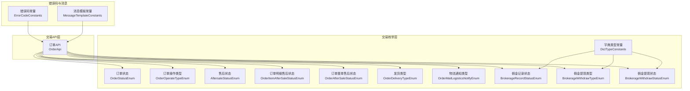
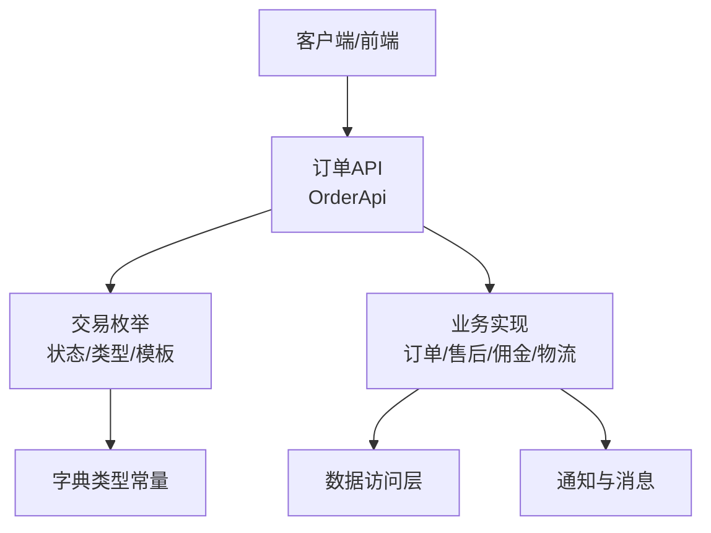
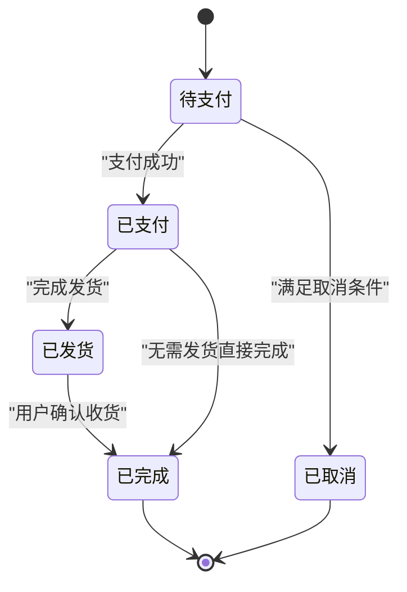
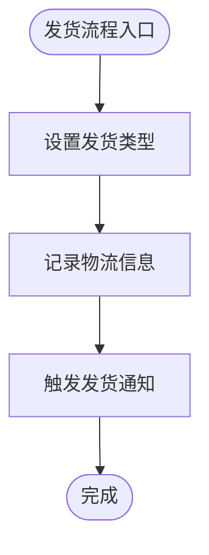
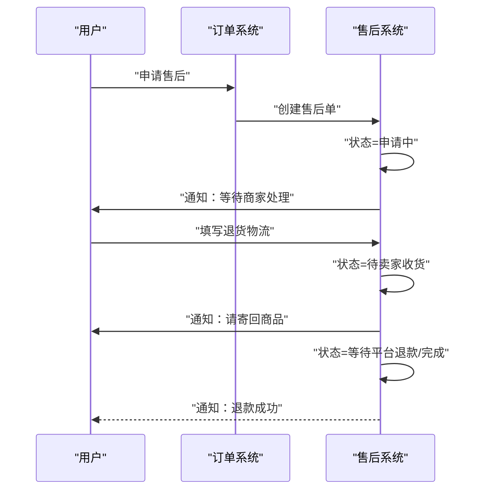
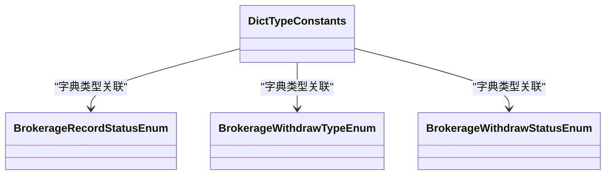
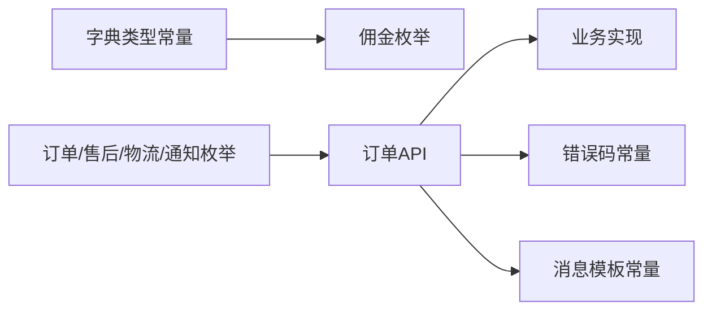

# 交易管理系统

<cite>
**本文引用的文件**
- [DictTypeConstants.java](file://qiji-module-mall/qiji-module-trade-api/src/main/java/com.qiji.cps/module/trade/enums/DictTypeConstants.java)
- [AftersaleStatusEnum.java](file://qiji-module-mall/qiji-module-trade-api/src/main/java/com.qiji.cps/module/trade/enums/aftersale/AftersaleStatusEnum.java)
- [BrokerageRecordStatusEnum.java](file://qiji-module-mall/qiji-module-trade-api/src/main/java/com.qiji.cps/module/trade/enums/brokerage/BrokerageRecordStatusEnum.java)
- [BrokerageWithdrawTypeEnum.java](file://qiji-module-mall/qiji-module-trade-api/src/main/java/com.qiji.cps/module/trade/enums/brokerage/BrokerageWithdrawTypeEnum.java)
- [BrokerageWithdrawStatusEnum.java](file://qiji-module-mall/qiji-module-trade-api/src/main/java/com.qiji.cps/module/trade/enums/brokerage/BrokerageWithdrawStatusEnum.java)
- [OrderStatusEnum.java](file://qiji-module-mall/qiji-module-trade-api/src/main/java/com.qiji.cps/module/trade/enums/order/OrderStatusEnum.java)
- [OrderOperateTypeEnum.java](file://qiji-module-mall/qiji-module-trade-api/src/main/java/com.qiji.cps/module/trade/enums/order/OrderOperateTypeEnum.java)
- [OrderItemAfterSaleStatusEnum.java](file://qiji-module-mall/qiji-module-trade-api/src/main/java/com.qiji.cps/module/trade/enums/order/OrderItemAfterSaleStatusEnum.java)
- [OrderAfterSaleStatusEnum.java](file://qiji-module-mall/qiji-module-trade-api/src/main/java/com.qiji.cps/module/trade/enums/order/OrderAfterSaleStatusEnum.java)
- [OrderDeliveryTypeEnum.java](file://qiji-module-mall/qiji-module-trade-api/src/main/java/com.qiji.cps/module/trade/enums/delivery/OrderDeliveryTypeEnum.java)
- [OrderMailLogisticsNotifyEnum.java](file://qiji-module-mall/qiji-module-trade-api/src/main/java/com.qiji.cps/module/trade/enums/notify/OrderMailLogisticsNotifyEnum.java)
- [ErrorCodeConstants.java](file://qiji-module-mall/qiji-module-trade-api/src/main/java/com.qiji.cps/module/trade/enums/ErrorCodeConstants.java)
- [MessageTemplateConstants.java](file://qiji-module-mall/qiji-module-trade-api/src/main/java/com.qiji.cps/module/trade/enums/MessageTemplateConstants.java)
- [OrderApi.java](file://qiji-module-mall/qiji-module-trade-api/src/main/java/com.qiji.cps/module/trade/api/order/OrderApi.java)
- [OrderItemAfterSaleStatusEnum.java](file://qiji-module-mall/qiji-module-trade-api/src/main/java/com.qiji.cps/module/trade/enums/order/OrderItemAfterSaleStatusEnum.java)
- [OrderAfterSaleStatusEnum.java](file://qiji-module-mall/qiji-module-trade-api/src/main/java/com.qiji.cps/module/trade/enums/order/OrderAfterSaleStatusEnum.java)
- [OrderDeliveryTypeEnum.java](file://qiji-module-mall/qiji-module-trade-api/src/main/java/com.qiji.cps/module/trade/enums/delivery/OrderDeliveryTypeEnum.java)
- [OrderMailLogisticsNotifyEnum.java](file://qiji-module-mall/qiji-module-trade-api/src/main/java/com.qiji.cps/module/trade/enums/notify/OrderMailLogisticsNotifyEnum.java)
- [ErrorCodeConstants.java](file://qiji-module-mall/qiji-module-trade-api/src/main/java/com.qiji.cps/module/trade/enums/ErrorCodeConstants.java)
- [MessageTemplateConstants.java](file://qiji-module-mall/qiji-module-trade-api/src/main/java/com.qiji.cps/module/trade/enums/MessageTemplateConstants.java)
- [OrderApi.java](file://qiji-module-mall/qiji-module-trade-api/src/main/java/com.qiji.cps/module/trade/api/order/OrderApi.java)
</cite>

## 目录
1. [引言](#引言)
2. [项目结构](#项目结构)
3. [核心组件](#核心组件)
4. [架构总览](#架构总览)
5. [详细组件分析](#详细组件分析)
6. [依赖分析](#依赖分析)
7. [性能考虑](#性能考虑)
8. [故障排查指南](#故障排查指南)
9. [结论](#结论)
10. [附录](#附录)

## 引言
本文件面向交易管理系统，围绕订单处理、发货物流、售后退换、佣金结算、交易对账与风控等核心业务进行系统化梳理。文档以仓库中现有的枚举与接口定义为基础，结合业务语义，构建从“下单—支付—发货—收货—评价”的完整生命周期，并给出状态流转、操作能力、配置项与集成点的说明，帮助研发与产品团队快速理解与落地。

## 项目结构
交易系统主要由以下层次构成：
- 枚举层：定义订单状态、售后状态、佣金状态、发货类型、通知模板等统一常量与取值范围
- API 层：对外暴露订单相关服务接口契约
- 业务层：在各模块内实现订单生命周期管理、售后处理、佣金计算与结算、物流通知等
- 数据访问层：持久化订单、售后、佣金、物流等数据
- 通知与消息：短信、站内信、邮件等通知模板与触发机制

图表来源
- [OrderStatusEnum.java](file://qiji-module-mall/qiji-module-trade-api/src/main/java/com.qiji.cps/module/trade/enums/order/OrderStatusEnum.java)
- [OrderOperateTypeEnum.java](file://qiji-module-mall/qiji-module-trade-api/src/main/java/com.qiji.cps/module/trade/enums/order/OrderOperateTypeEnum.java)
- [AftersaleStatusEnum.java](file://qiji-module-mall/qiji-module-trade-api/src/main/java/com.qiji.cps/module/trade/enums/aftersale/AftersaleStatusEnum.java)
- [OrderItemAfterSaleStatusEnum.java](file://qiji-module-mall/qiji-module-trade-api/src/main/java/com.qiji.cps/module/trade/enums/order/OrderItemAfterSaleStatusEnum.java)
- [OrderAfterSaleStatusEnum.java](file://qiji-module-mall/qiji-module-trade-api/src/main/java/com.qiji.cps/module/trade/enums/order/OrderAfterSaleStatusEnum.java)
- [OrderDeliveryTypeEnum.java](file://qiji-module-mall/qiji-module-trade-api/src/main/java/com.qiji.cps/module/trade/enums/delivery/OrderDeliveryTypeEnum.java)
- [OrderMailLogisticsNotifyEnum.java](file://qiji-module-mall/qiji-module-trade-api/src/main/java/com.qiji.cps/module/trade/enums/notify/OrderMailLogisticsNotifyEnum.java)
- [BrokerageRecordStatusEnum.java](file://qiji-module-mall/qiji-module-trade-api/src/main/java/com.qiji.cps/module/trade/enums/brokerage/BrokerageRecordStatusEnum.java)
- [BrokerageWithdrawTypeEnum.java](file://qiji-module-mall/qiji-module-trade-api/src/main/java/com.qiji.cps/module/trade/enums/brokerage/BrokerageWithdrawTypeEnum.java)
- [BrokerageWithdrawStatusEnum.java](file://qiji-module-mall/qiji-module-trade-api/src/main/java/com.qiji.cps/module/trade/enums/brokerage/BrokerageWithdrawStatusEnum.java)
- [DictTypeConstants.java](file://qiji-module-mall/qiji-module-trade-api/src/main/java/com.qiji.cps/module/trade/enums/DictTypeConstants.java)
- [OrderApi.java](file://qiji-module-mall/qiji-module-trade-api/src/main/java/com.qiji.cps/module/trade/api/order/OrderApi.java)
- [ErrorCodeConstants.java](file://qiji-module-mall/qiji-module-trade-api/src/main/java/com.qiji.cps/module/trade/enums/ErrorCodeConstants.java)
- [MessageTemplateConstants.java](file://qiji-module-mall/qiji-module-trade-api/src/main/java/com.qiji.cps/module/trade/enums/MessageTemplateConstants.java)

章节来源
- [DictTypeConstants.java:1-16](file://qiji-module-mall/qiji-module-trade-api/src/main/java/com.qiji.cps/module/trade/enums/DictTypeConstants.java#L1-L16)

## 核心组件
- 订单状态与操作
  - 订单状态：用于标识订单生命周期关键节点，如待支付、已支付、已发货、已完成、已取消等
  - 订单操作类型：用于记录订单在不同阶段的操作行为，如支付、发货、取消、合并、拆分等
  - 明细与整单售后状态：区分订单级与明细级的售后状态，便于精细化管理
- 售后管理
  - 售后状态：覆盖申请、同意/拒绝、买家退货、平台退款、完成/取消/拒收等环节
- 物流与通知
  - 发货类型：区分自配/快递等发货方式
  - 物流通知类型：用于触发短信/邮件/站内信等通知
- 佣金体系
  - 佣金记录状态、提现类型与提现状态：支撑分销/推广佣金的生成、结算与提现流程
- 错误码与消息模板
  - 统一错误码常量与消息模板常量，保障异常处理与用户提示的一致性

章节来源
- [OrderStatusEnum.java](file://qiji-module-mall/qiji-module-trade-api/src/main/java/com.qiji.cps/module/trade/enums/order/OrderStatusEnum.java)
- [OrderOperateTypeEnum.java](file://qiji-module-mall/qiji-module-trade-api/src/main/java/com.qiji.cps/module/trade/enums/order/OrderOperateTypeEnum.java)
- [AftersaleStatusEnum.java:1-96](file://qiji-module-mall/qiji-module-trade-api/src/main/java/com.qiji.cps/module/trade/enums/aftersale/AftersaleStatusEnum.java#L1-L96)
- [OrderItemAfterSaleStatusEnum.java](file://qiji-module-mall/qiji-module-trade-api/src/main/java/com.qiji.cps/module/trade/enums/order/OrderItemAfterSaleStatusEnum.java)
- [OrderAfterSaleStatusEnum.java](file://qiji-module-mall/qiji-module-trade-api/src/main/java/com.qiji.cps/module/trade/enums/order/OrderAfterSaleStatusEnum.java)
- [OrderDeliveryTypeEnum.java](file://qiji-module-mall/qiji-module-trade-api/src/main/java/com.qiji.cps/module/trade/enums/delivery/OrderDeliveryTypeEnum.java)
- [OrderMailLogisticsNotifyEnum.java](file://qiji-module-mall/qiji-module-trade-api/src/main/java/com.qiji.cps/module/trade/enums/notify/OrderMailLogisticsNotifyEnum.java)
- [BrokerageRecordStatusEnum.java](file://qiji-module-mall/qiji-module-trade-api/src/main/java/com.qiji.cps/module/trade/enums/brokerage/BrokerageRecordStatusEnum.java)
- [BrokerageWithdrawTypeEnum.java](file://qiji-module-mall/qiji-module-trade-api/src/main/java/com.qiji.cps/module/trade/enums/brokerage/BrokerageWithdrawTypeEnum.java)
- [BrokerageWithdrawStatusEnum.java](file://qiji-module-mall/qiji-module-trade-api/src/main/java/com.qiji.cps/module/trade/enums/brokerage/BrokerageWithdrawStatusEnum.java)
- [ErrorCodeConstants.java](file://qiji-module-mall/qiji-module-trade-api/src/main/java/com.qiji.cps/module/trade/enums/ErrorCodeConstants.java)
- [MessageTemplateConstants.java](file://qiji-module-mall/qiji-module-trade-api/src/main/java/com.qiji.cps/module/trade/enums/MessageTemplateConstants.java)

## 架构总览
交易系统采用“枚举驱动 + API 契约 + 业务实现”的分层设计：
- 枚举层统一业务取值域，确保跨模块一致性
- API 层定义对外服务契约，屏蔽内部实现细节
- 业务层在各子模块中落地具体流程（订单、售后、佣金、物流）
- 数据访问层负责持久化与查询
- 通知与消息层通过模板常量与通知类型解耦

图表来源
- [OrderApi.java](file://qiji-module-mall/qiji-module-trade-api/src/main/java/com.qiji.cps/module/trade/api/order/OrderApi.java)
- [DictTypeConstants.java:1-16](file://qiji-module-mall/qiji-module-trade-api/src/main/java/com.qiji.cps/module/trade/enums/DictTypeConstants.java#L1-L16)

## 详细组件分析

### 订单生命周期与状态管理
- 生命周期阶段
  - 下单：生成订单，进入待支付状态
  - 支付：支付成功后进入已支付状态
  - 发货：根据发货类型执行发货，进入已发货状态
  - 收货：用户确认收货，进入已完成状态
  - 取消：在特定阶段支持取消，进入已取消状态
- 状态流转要点
  - 待支付 → 已支付：支付成功
  - 已支付 → 已发货：完成发货
  - 已发货 → 已完成：用户确认收货
  - 待支付/已支付 → 已取消：满足取消条件
- 明细与整单售后状态
  - 明细售后状态：用于单个商品的售后处理
  - 整单售后状态：用于整笔订单的售后汇总

图表来源
- [OrderStatusEnum.java](file://qiji-module-mall/qiji-module-trade-api/src/main/java/com.qiji.cps/module/trade/enums/order/OrderStatusEnum.java)
- [OrderOperateTypeEnum.java](file://qiji-module-mall/qiji-module-trade-api/src/main/java/com.qiji.cps/module/trade/enums/order/OrderOperateTypeEnum.java)
- [OrderItemAfterSaleStatusEnum.java](file://qiji-module-mall/qiji-module-trade-api/src/main/java/com.qiji.cps/module/trade/enums/order/OrderItemAfterSaleStatusEnum.java)
- [OrderAfterSaleStatusEnum.java](file://qiji-module-mall/qiji-module-trade-api/src/main/java/com.qiji.cps/module/trade/enums/order/OrderAfterSaleStatusEnum.java)

章节来源
- [OrderStatusEnum.java](file://qiji-module-mall/qiji-module-trade-api/src/main/java/com.qiji.cps/module/trade/enums/order/OrderStatusEnum.java)
- [OrderOperateTypeEnum.java](file://qiji-module-mall/qiji-module-trade-api/src/main/java/com.qiji.cps/module/trade/enums/order/OrderOperateTypeEnum.java)
- [OrderItemAfterSaleStatusEnum.java](file://qiji-module-mall/qiji-module-trade-api/src/main/java/com.qiji.cps/module/trade/enums/order/OrderItemAfterSaleStatusEnum.java)
- [OrderAfterSaleStatusEnum.java](file://qiji-module-mall/qiji-module-trade-api/src/main/java/com.qiji.cps/module/trade/enums/order/OrderAfterSaleStatusEnum.java)

### 订单操作功能
- 支持的操作类型
  - 支付：标记订单已支付
  - 发货：更新发货类型与物流信息
  - 取消：在允许阶段取消订单
  - 合并/拆分：基于业务策略对订单进行合并或拆分
- 操作记录
  - 通过订单操作类型枚举记录每次关键动作，便于审计与回溯

章节来源
- [OrderOperateTypeEnum.java](file://qiji-module-mall/qiji-module-trade-api/src/main/java/com.qiji.cps/module/trade/enums/order/OrderOperateTypeEnum.java)

### 发货物流管理
- 快递公司配置
  - 通过发货类型枚举定义发货方式（如快递/自配），便于扩展与统一管理
- 物流跟踪
  - 结合订单与明细售后状态，记录退货/换货物流轨迹
- 发货通知
  - 通过物流通知类型触发短信/邮件/站内信通知

图表来源
- [OrderDeliveryTypeEnum.java](file://qiji-module-mall/qiji-module-trade-api/src/main/java/com.qiji.cps/module/trade/enums/delivery/OrderDeliveryTypeEnum.java)
- [OrderMailLogisticsNotifyEnum.java](file://qiji-module-mall/qiji-module-trade-api/src/main/java/com.qiji.cps/module/trade/enums/notify/OrderMailLogisticsNotifyEnum.java)

章节来源
- [OrderDeliveryTypeEnum.java](file://qiji-module-mall/qiji-module-trade-api/src/main/java/com.qiji.cps/module/trade/enums/delivery/OrderDeliveryTypeEnum.java)
- [OrderMailLogisticsNotifyEnum.java](file://qiji-module-mall/qiji-module-trade-api/src/main/java/com.qiji.cps/module/trade/enums/notify/OrderMailLogisticsNotifyEnum.java)

### 售后退换管理
- 申请与处理
  - 申请中：买家提交售后申请
  - 卖家通过/拒绝：商家审批
  - 买家退货/待收货：物流流转
  - 平台退款/完成：退款闭环
  - 买家取消/卖家拒绝收货：售后终止
- 状态集合
  - 进行中状态集合：用于筛选当前进行中的售后单
- 明细与整单售后状态
  - 明细售后状态：单个商品维度
  - 整单售后状态：整笔订单维度

图表来源
- [AftersaleStatusEnum.java:1-96](file://qiji-module-mall/qiji-module-trade-api/src/main/java/com.qiji.cps/module/trade/enums/aftersale/AftersaleStatusEnum.java#L1-L96)
- [OrderItemAfterSaleStatusEnum.java](file://qiji-module-mall/qiji-module-trade-api/src/main/java/com.qiji.cps/module/trade/enums/order/OrderItemAfterSaleStatusEnum.java)
- [OrderAfterSaleStatusEnum.java](file://qiji-module-mall/qiji-module-trade-api/src/main/java/com.qiji.cps/module/trade/enums/order/OrderAfterSaleStatusEnum.java)

章节来源
- [AftersaleStatusEnum.java:1-96](file://qiji-module-mall/qiji-module-trade-api/src/main/java/com.qiji.cps/module/trade/enums/aftersale/AftersaleStatusEnum.java#L1-L96)
- [OrderItemAfterSaleStatusEnum.java](file://qiji-module-mall/qiji-module-trade-api/src/main/java/com.qiji.cps/module/trade/enums/order/OrderItemAfterSaleStatusEnum.java)
- [OrderAfterSaleStatusEnum.java](file://qiji-module-mall/qiji-module-trade-api/src/main/java/com.qiji.cps/module/trade/enums/order/OrderAfterSaleStatusEnum.java)

### 佣金结算功能
- 佣金记录状态：用于标识佣金生成、入账、结算等阶段
- 提现类型与提现状态：支撑分销/推广佣金的提现流程
- 字典类型常量：统一管理佣金相关字典项

图表来源
- [BrokerageRecordStatusEnum.java](file://qiji-module-mall/qiji-module-trade-api/src/main/java/com.qiji.cps/module/trade/enums/brokerage/BrokerageRecordStatusEnum.java)
- [BrokerageWithdrawTypeEnum.java](file://qiji-module-mall/qiji-module-trade-api/src/main/java/com.qiji.cps/module/trade/enums/brokerage/BrokerageWithdrawTypeEnum.java)
- [BrokerageWithdrawStatusEnum.java](file://qiji-module-mall/qiji-module-trade-api/src/main/java/com.qiji.cps/module/trade/enums/brokerage/BrokerageWithdrawStatusEnum.java)
- [DictTypeConstants.java:1-16](file://qiji-module-mall/qiji-module-trade-api/src/main/java/com.qiji.cps/module/trade/enums/DictTypeConstants.java#L1-L16)

章节来源
- [BrokerageRecordStatusEnum.java](file://qiji-module-mall/qiji-module-trade-api/src/main/java/com.qiji.cps/module/trade/enums/brokerage/BrokerageRecordStatusEnum.java)
- [BrokerageWithdrawTypeEnum.java](file://qiji-module-mall/qiji-module-trade-api/src/main/java/com.qiji.cps/module/trade/enums/brokerage/BrokerageWithdrawTypeEnum.java)
- [BrokerageWithdrawStatusEnum.java](file://qiji-module-mall/qiji-module-trade-api/src/main/java/com.qiji.cps/module/trade/enums/brokerage/BrokerageWithdrawStatusEnum.java)
- [DictTypeConstants.java:1-16](file://qiji-module-mall/qiji-module-trade-api/src/main/java/com.qiji.cps/module/trade/enums/DictTypeConstants.java#L1-L16)

### 交易对账与风控
- 对账维度
  - 订单对账：核对订单金额、优惠、实收
  - 退款对账：核对退款申请、审核与执行
  - 手续费对账：核对支付通道/平台手续费
- 风控机制
  - 异常订单识别：基于状态、金额、频次、设备/IP等特征
  - 风险控制与欺诈防范：接入风控策略引擎，实施拦截/加审/额度限制等

说明：本节为概念性说明，用于指导对账与风控的整体思路，不直接对应具体代码文件。

## 依赖分析
- 枚举依赖
  - 佣金相关枚举依赖字典类型常量进行统一管理
  - 订单/售后/物流/通知枚举相互协作，形成完整的业务闭环
- API 依赖
  - 订单 API 依赖各类枚举与错误码、消息模板常量，保证调用侧的一致性与可维护性

图表来源
- [DictTypeConstants.java:1-16](file://qiji-module-mall/qiji-module-trade-api/src/main/java/com.qiji.cps/module/trade/enums/DictTypeConstants.java#L1-L16)
- [OrderApi.java](file://qiji-module-mall/qiji-module-trade-api/src/main/java/com.qiji.cps/module/trade/api/order/OrderApi.java)
- [ErrorCodeConstants.java](file://qiji-module-mall/qiji-module-trade-api/src/main/java/com.qiji.cps/module/trade/enums/ErrorCodeConstants.java)
- [MessageTemplateConstants.java](file://qiji-module-mall/qiji-module-trade-api/src/main/java/com.qiji.cps/module/trade/enums/MessageTemplateConstants.java)

章节来源
- [DictTypeConstants.java:1-16](file://qiji-module-mall/qiji-module-trade-api/src/main/java/com.qiji.cps/module/trade/enums/DictTypeConstants.java#L1-L16)
- [OrderApi.java](file://qiji-module-mall/qiji-module-trade-api/src/main/java/com.qiji.cps/module/trade/api/order/OrderApi.java)
- [ErrorCodeConstants.java](file://qiji-module-mall/qiji-module-trade-api/src/main/java/com.qiji.cps/module/trade/enums/ErrorCodeConstants.java)
- [MessageTemplateConstants.java](file://qiji-module-mall/qiji-module-trade-api/src/main/java/com.qiji.cps/module/trade/enums/MessageTemplateConstants.java)

## 性能考虑
- 并发与锁
  - 在支付、发货、退款等关键节点使用分布式锁或幂等设计，避免重复执行
- 缓存策略
  - 将常用状态、模板、字典项缓存于 Redis，降低数据库压力
- 异步化
  - 发货通知、退款回调、对账任务等采用消息队列异步处理
- 分库分表
  - 订单与售后按时间/主键分片，热点表读写分离
- 监控与限流
  - 对高频接口增加限流与熔断，结合链路追踪定位瓶颈

说明：本节为通用性能建议，不直接对应具体代码文件。

## 故障排查指南
- 常见问题定位
  - 状态不一致：检查订单/售后状态枚举是否正确映射
  - 通知失败：核对通知类型与模板常量是否匹配
  - 佣金异常：核对佣金记录状态与提现状态字典项
- 错误码与消息
  - 使用统一错误码常量与消息模板常量，便于前端展示与日志检索

章节来源
- [ErrorCodeConstants.java](file://qiji-module-mall/qiji-module-trade-api/src/main/java/com.qiji.cps/module/trade/enums/ErrorCodeConstants.java)
- [MessageTemplateConstants.java](file://qiji-module-mall/qiji-module-trade-api/src/main/java/com.qiji.cps/module/trade/enums/MessageTemplateConstants.java)

## 结论
本文件基于现有枚举与接口定义，系统化梳理了交易管理的核心业务：订单生命周期、状态流转、操作能力、发货物流、售后退换、佣金结算、对账与风控。建议在后续开发中：
- 补充订单 API 的具体方法签名与参数说明
- 在业务层完善状态机与流程编排
- 建立完善的监控与告警体系，持续优化性能与稳定性

## 附录
- 术语
  - 订单：用户购买商品形成的交易凭证
  - 售后：包含退货、换货、退款等售后服务
  - 佣金：分销/推广产生的收益结算
  - 对账：订单、退款、手续费等财务核对