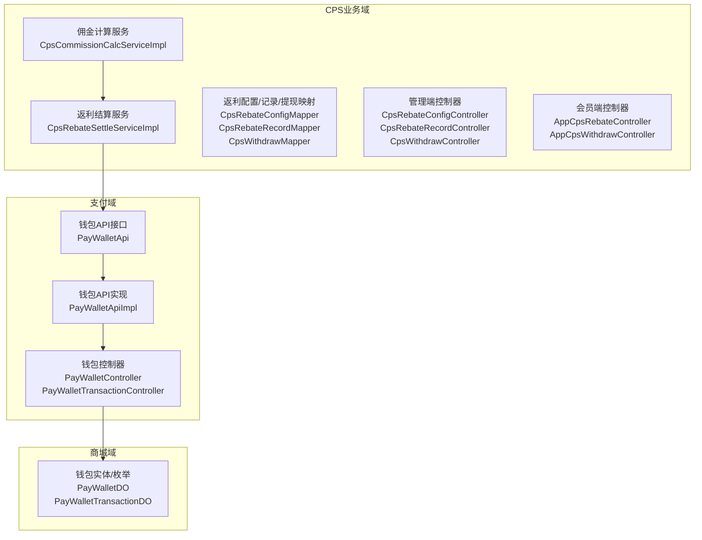
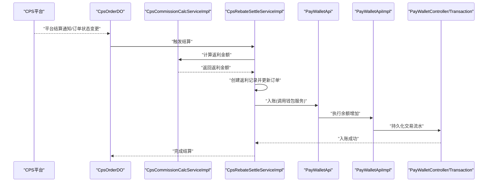
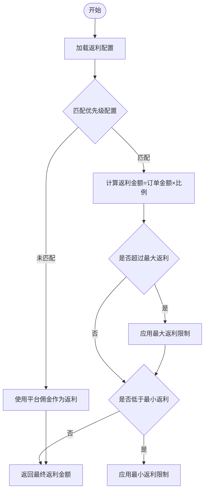
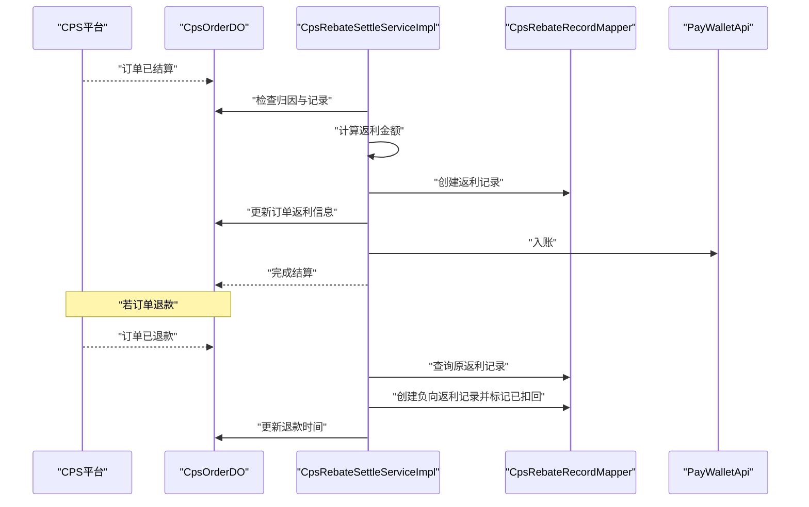
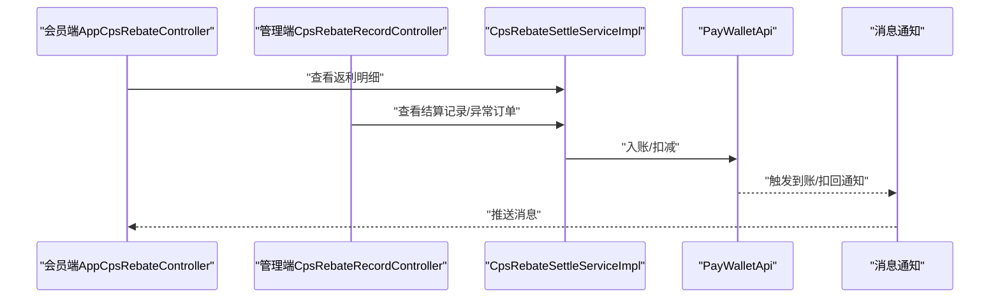
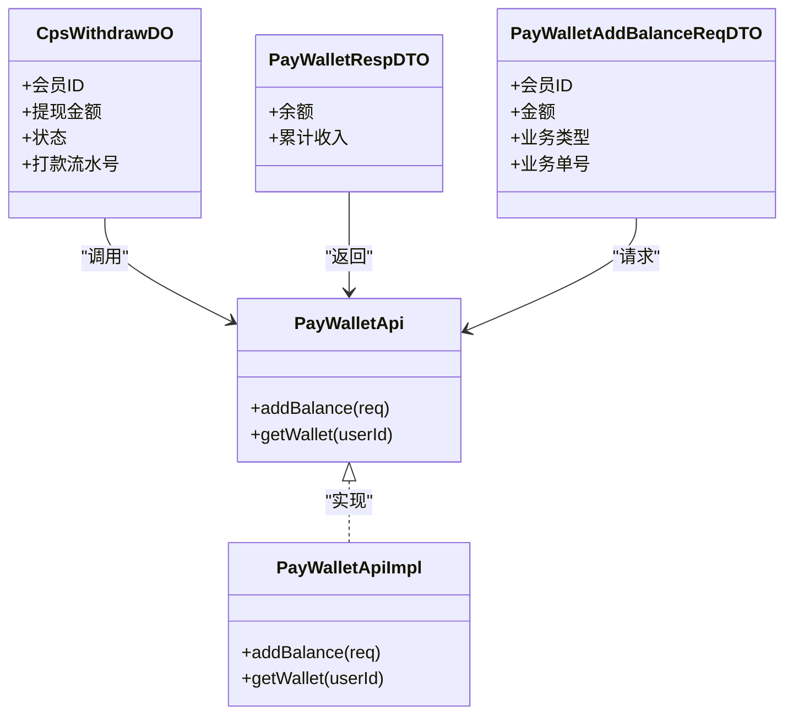
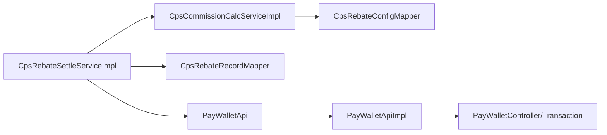

# 佣金结算管理

<cite>
**本文引用的文件**
- [CPS系统PRD文档.md](file://docs/CPS系统PRD文档.md)
- [CpsCommissionCalcService.java](file://yudao-module-cps/yudao-module-cps-biz/src/main/java/cn/zhijian/cps/service/commission/CpsCommissionCalcService.java)
- [CpsCommissionCalcServiceImpl.java](file://yudao-module-cps/yudao-module-cps-biz/src/main/java/cn/zhijian/cps/service/commission/CpsCommissionCalcServiceImpl.java)
- [CpsRebateSettleService.java](file://yudao-module-cps/yudao-module-cps-biz/src/main/java/cn/zhijian/cps/service/commission/CpsRebateSettleService.java)
- [CpsRebateSettleServiceImpl.java](file://yudao-module-cps/yudao-module-cps-biz/src/main/java/cn/zhijian/cps/service/commission/CpsRebateSettleServiceImpl.java)
- [CpsRebateConfigDO.java](file://yudao-module-cps/yudao-module-cps-biz/src/main/java/cn/zhijian/cps/dal/dataobject/CpsRebateConfigDO.java)
- [CpsRebateRecordDO.java](file://yudao-module-cps/yudao-module-cps-biz/src/main/java/cn/zhijian/cps/dal/dataobject/CpsRebateRecordDO.java)
- [CpsWithdrawDO.java](file://yudao-module-cps/yudao-module-cps-biz/src/main/java/cn/zhijian/cps/dal/dataobject/CpsWithdrawDO.java)
- [CpsRebateAccountDO.java](file://yudao-module-cps/yudao-module-cps-biz/src/main/java/cn/zhijian/cps/dal/dataobject/CpsRebateAccountDO.java)
- [CpsRebateConfigMapper.java](file://yudao-module-cps/yudao-module-cps-biz/src/main/java/cn/zhijian/cps/dal/mysql/CpsRebateConfigMapper.java)
- [CpsRebateRecordMapper.java](file://yudao-module-cps/yudao-module-cps-biz/src/main/java/cn/zhijian/cps/dal/mysql/CpsRebateRecordMapper.java)
- [CpsWithdrawMapper.java](file://yudao-module-cps/yudao-module-cps-biz/src/main/java/cn/zhijian/cps/dal/mysql/CpsWithdrawMapper.java)
- [CpsRebateAccountMapper.java](file://yudao-module-cps/yudao-module-cps-biz/src/main/java/cn/zhijian/cps/dal/mysql/CpsRebateAccountMapper.java)
- [CpsRebateConfigController.java](file://yudao-module-cps/yudao-module-cps-biz/src/main/java/cn/zhijian/cps/controller/admin/CpsRebateConfigController.java)
- [CpsRebateRecordController.java](file://yudao-module-cps/yudao-module-cps-biz/src/main/java/cn/zhijian/cps/controller/admin/CpsRebateRecordController.java)
- [CpsWithdrawController.java](file://yudao-module-cps/yudao-module-cps-biz/src/main/java/cn/zhijian/cps/controller/admin/CpsWithdrawController.java)
- [AppCpsRebateController.java](file://yudao-module-cps/yudao-module-cps-biz/src/main/java/cn/zhijian/cps/controller/app/AppCpsRebateController.java)
- [AppCpsWithdrawController.java](file://yudao-module-cps/yudao-module-cps-biz/src/main/java/cn/zhijian/cps/controller/app/AppCpsWithdrawController.java)
- [PayWalletApi.java](file://yudao-module-pay/src/main/java/cn/iocoder/yudao/module/pay/api/wallet/PayWalletApi.java)
- [PayWalletApiImpl.java](file://yudao-module-pay/src/main/java/cn/iocoder/yudao/module/pay/api/wallet/PayWalletApiImpl.java)
- [PayWalletRespDTO.java](file://yudao-module-pay/src/main/java/cn/iocoder/yudao/module/pay/api/wallet/dto/PayWalletRespDTO.java)
- [PayWalletAddBalanceReqDTO.java](file://yudao-module-pay/src/main/java/cn/iocoder/yudao/module/pay/api/wallet/dto/PayWalletAddBalanceReqDTO.java)
- [PayWalletController.java](file://yudao-module-pay/src/main/java/cn/iocoder/yudao/module/pay/controller/admin/wallet/PayWalletController.java)
- [PayWalletTransactionController.java](file://yudao-module-pay/src/main/java/cn/iocoder/yudao/module/pay/controller/admin/wallet/PayWalletTransactionController.java)
</cite>

## 目录
1. [引言](#引言)
2. [项目结构](#项目结构)
3. [核心组件](#核心组件)
4. [架构总览](#架构总览)
5. [详细组件分析](#详细组件分析)
6. [依赖分析](#依赖分析)
7. [性能考虑](#性能考虑)
8. [故障排查指南](#故障排查指南)
9. [结论](#结论)
10. [附录](#附录)

## 引言
本文件面向“佣金结算管理”业务域，基于现有PRD与代码实现，系统化梳理分销佣金、推广返利、结算周期、结算规则、佣金发放、账户管理、风控与自动化处理等完整流程。文档旨在帮助产品、研发与运营人员快速理解并高效落地该系统。

## 项目结构
围绕佣金结算的关键模块与文件组织如下：
- 业务域模块：yudao-module-cps（CPS业务实现）
- 支付域模块：yudao-module-pay（钱包与转账）
- 商城域模块：yudao-module-mall（佣金相关控制器与枚举）

**图表来源**
- [CpsCommissionCalcServiceImpl.java:1-170](file://yudao-module-cps/yudao-module-cps-biz/src/main/java/cn/zhijian/cps/service/commission/CpsCommissionCalcServiceImpl.java#L1-L170)
- [CpsRebateSettleServiceImpl.java:1-188](file://yudao-module-cps/yudao-module-cps-biz/src/main/java/cn/zhijian/cps/service/commission/CpsRebateSettleServiceImpl.java#L1-L188)
- [PayWalletApi.java](file://yudao-module-pay/src/main/java/cn/iocoder/yudao/module/pay/api/wallet/PayWalletApi.java)
- [PayWalletApiImpl.java](file://yudao-module-pay/src/main/java/cn/iocoder/yudao/module/pay/api/wallet/PayWalletApiImpl.java)
- [PayWalletController.java](file://yudao-module-pay/src/main/java/cn/iocoder/yudao/module/pay/controller/admin/wallet/PayWalletController.java)
- [PayWalletTransactionController.java](file://yudao-module-pay/src/main/java/cn/iocoder/yudao/module/pay/controller/admin/wallet/PayWalletTransactionController.java)

**章节来源**
- [CPS系统PRD文档.md:1-1099](file://docs/CPS系统PRD文档.md#L1-L1099)

## 核心组件
- 佣金计算服务：负责根据订单金额与返利配置计算返利金额，支持多维度优先级匹配与上下限控制。
- 返利结算服务：负责订单结算、返利入账、退款扣回与状态流转。
- 钱包服务：负责余额增减、交易流水与余额查询。
- 配置与记录：返利配置、返利记录、提现记录与账户信息的持久化与查询。
- 控制器：管理端与会员端的对外接口，支撑业务操作与数据查询。

**章节来源**
- [CpsCommissionCalcService.java:1-38](file://yudao-module-cps/yudao-module-cps-biz/src/main/java/cn/zhijian/cps/service/commission/CpsCommissionCalcService.java#L1-L38)
- [CpsCommissionCalcServiceImpl.java:1-170](file://yudao-module-cps/yudao-module-cps-biz/src/main/java/cn/zhijian/cps/service/commission/CpsCommissionCalcServiceImpl.java#L1-L170)
- [CpsRebateSettleService.java:1-36](file://yudao-module-cps/yudao-module-cps-biz/src/main/java/cn/zhijian/cps/service/commission/CpsRebateSettleService.java#L1-L36)
- [CpsRebateSettleServiceImpl.java:1-188](file://yudao-module-cps/yudao-module-cps-biz/src/main/java/cn/zhijian/cps/service/commission/CpsRebateSettleServiceImpl.java#L1-L188)
- [PayWalletApi.java](file://yudao-module-pay/src/main/java/cn/iocoder/yudao/module/pay/api/wallet/PayWalletApi.java)
- [PayWalletApiImpl.java](file://yudao-module-pay/src/main/java/cn/iocoder/yudao/module/pay/api/wallet/PayWalletApiImpl.java)

## 架构总览
下图展示了从订单结算到返利入账、再到钱包余额更新的端到端流程。

**图表来源**
- [CpsRebateSettleServiceImpl.java:35-98](file://yudao-module-cps/yudao-module-cps-biz/src/main/java/cn/zhijian/cps/service/commission/CpsRebateSettleServiceImpl.java#L35-L98)
- [CpsCommissionCalcServiceImpl.java:35-79](file://yudao-module-cps/yudao-module-cps-biz/src/main/java/cn/zhijian/cps/service/commission/CpsCommissionCalcServiceImpl.java#L35-L79)
- [PayWalletApi.java](file://yudao-module-pay/src/main/java/cn/iocoder/yudao/module/pay/api/wallet/PayWalletApi.java)
- [PayWalletApiImpl.java](file://yudao-module-pay/src/main/java/cn/iocoder/yudao/module/pay/api/wallet/PayWalletApiImpl.java)
- [PayWalletController.java](file://yudao-module-pay/src/main/java/cn/iocoder/yudao/module/pay/controller/admin/wallet/PayWalletController.java)
- [PayWalletTransactionController.java](file://yudao-module-pay/src/main/java/cn/iocoder/yudao/module/pay/controller/admin/wallet/PayWalletTransactionController.java)

## 详细组件分析

### 佣金计算规则与实现
- 计算输入：订单金额（券后价）、平台佣金、返利配置。
- 计算公式：返利金额 = 订单金额 × 返利比例；若存在最大/最小返利限制，则进行边界裁剪。
- 配置优先级：会员等级+平台 > 仅会员等级 > 仅平台 > 默认配置。
- 批量处理：对订单集合逐条计算并容错兜底（异常时以平台佣金作为返利）。

**图表来源**
- [CpsCommissionCalcServiceImpl.java:81-167](file://yudao-module-cps/yudao-module-cps-biz/src/main/java/cn/zhijian/cps/service/commission/CpsCommissionCalcServiceImpl.java#L81-L167)

**章节来源**
- [CpsCommissionCalcService.java:1-38](file://yudao-module-cps/yudao-module-cps-biz/src/main/java/cn/zhijian/cps/service/commission/CpsCommissionCalcService.java#L1-L38)
- [CpsCommissionCalcServiceImpl.java:1-170](file://yudao-module-cps/yudao-module-cps-biz/src/main/java/cn/zhijian/cps/service/commission/CpsCommissionCalcServiceImpl.java#L1-L170)
- [CpsRebateConfigDO.java](file://yudao-module-cps/yudao-module-cps-biz/src/main/java/cn/zhijian/cps/dal/dataobject/CpsRebateConfigDO.java)
- [CpsRebateConfigMapper.java](file://yudao-module-cps/yudao-module-cps-biz/src/main/java/cn/zhijian/cps/dal/mysql/CpsRebateConfigMapper.java)

### 结算周期与结算流程
- 周期来源：平台侧结算周期（如日结、月结等），系统在平台结算后触发返利结算。
- 流程节点：订单归因、平台结算、系统计算返利、创建返利记录、更新订单、入账到钱包、通知会员。
- 退款处理：若订单发生退款，系统创建负向返利记录并更新原记录状态，必要时扣减钱包余额。

**图表来源**
- [CpsRebateSettleServiceImpl.java:35-185](file://yudao-module-cps/yudao-module-cps-biz/src/main/java/cn/zhijian/cps/service/commission/CpsRebateSettleServiceImpl.java#L35-L185)

**章节来源**
- [CpsRebateSettleService.java:1-36](file://yudao-module-cps/yudao-module-cps-biz/src/main/java/cn/zhijian/cps/service/commission/CpsRebateSettleService.java#L1-L36)
- [CpsRebateSettleServiceImpl.java:1-188](file://yudao-module-cps/yudao-module-cps-biz/src/main/java/cn/zhijian/cps/service/commission/CpsRebateSettleServiceImpl.java#L1-L188)
- [CpsRebateRecordDO.java](file://yudao-module-cps/yudao-module-cps-biz/src/main/java/cn/zhijian/cps/dal/dataobject/CpsRebateRecordDO.java)
- [CpsRebateRecordMapper.java](file://yudao-module-cps/yudao-module-cps-biz/src/main/java/cn/zhijian/cps/dal/mysql/CpsRebateRecordMapper.java)

### 佣金发放流程（统计-审核-打款-通知）
- 佣金统计：系统在平台结算后计算返利并入账。
- 审核确认：会员端可查看返利明细与状态；管理端可查看结算与异常订单。
- 打款处理：钱包服务负责余额增减与流水记录；提现流程由CPS提现模块与钱包打通。
- 到账通知：系统通过站内信/微信模板消息等方式通知会员。

**图表来源**
- [AppCpsRebateController.java](file://yudao-module-cps/yudao-module-cps-biz/src/main/java/cn/zhijian/cps/controller/app/AppCpsRebateController.java)
- [CpsRebateRecordController.java](file://yudao-module-cps/yudao-module-cps-biz/src/main/java/cn/zhijian/cps/controller/admin/CpsRebateRecordController.java)
- [CpsRebateSettleServiceImpl.java:35-98](file://yudao-module-cps/yudao-module-cps-biz/src/main/java/cn/zhijian/cps/service/commission/CpsRebateSettleServiceImpl.java#L35-L98)
- [PayWalletApi.java](file://yudao-module-pay/src/main/java/cn/iocoder/yudao/module/pay/api/wallet/PayWalletApi.java)

**章节来源**
- [AppCpsRebateController.java](file://yudao-module-cps/yudao-module-cps-biz/src/main/java/cn/zhijian/cps/controller/app/AppCpsRebateController.java)
- [CpsRebateRecordController.java](file://yudao-module-cps/yudao-module-cps-biz/src/main/java/cn/zhijian/cps/controller/admin/CpsRebateRecordController.java)
- [CpsRebateSettleServiceImpl.java:1-188](file://yudao-module-cps/yudao-module-cps-biz/src/main/java/cn/zhijian/cps/service/commission/CpsRebateSettleServiceImpl.java#L1-L188)

### 佣金账户管理（余额、提现、记录）
- 余额管理：钱包服务提供余额查询与增减接口，CPS结算通过钱包服务入账。
- 提现申请：会员端提交提现申请，管理端审核，钱包服务执行打款。
- 提现记录：包含申请、审核、打款、失败等状态流转。
- 到账记录：钱包交易流水记录提现与入账明细。

**图表来源**
- [CpsWithdrawDO.java](file://yudao-module-cps/yudao-module-cps-biz/src/main/java/cn/zhijian/cps/dal/dataobject/CpsWithdrawDO.java)
- [PayWalletRespDTO.java](file://yudao-module-pay/src/main/java/cn/iocoder/yudao/module/pay/api/wallet/dto/PayWalletRespDTO.java)
- [PayWalletAddBalanceReqDTO.java](file://yudao-module-pay/src/main/java/cn/iocoder/yudao/module/pay/api/wallet/dto/PayWalletAddBalanceReqDTO.java)
- [PayWalletApi.java](file://yudao-module-pay/src/main/java/cn/iocoder/yudao/module/pay/api/wallet/PayWalletApi.java)
- [PayWalletApiImpl.java](file://yudao-module-pay/src/main/java/cn/iocoder/yudao/module/pay/api/wallet/PayWalletApiImpl.java)

**章节来源**
- [CpsWithdrawDO.java](file://yudao-module-cps/yudao-module-cps-biz/src/main/java/cn/zhijian/cps/dal/dataobject/CpsWithdrawDO.java)
- [PayWalletApi.java](file://yudao-module-pay/src/main/java/cn/iocoder/yudao/module/pay/api/wallet/PayWalletApi.java)
- [PayWalletApiImpl.java](file://yudao-module-pay/src/main/java/cn/iocoder/yudao/module/pay/api/wallet/PayWalletApiImpl.java)
- [PayWalletController.java](file://yudao-module-pay/src/main/java/cn/iocoder/yudao/module/pay/controller/admin/wallet/PayWalletController.java)
- [PayWalletTransactionController.java](file://yudao-module-pay/src/main/java/cn/iocoder/yudao/module/pay/controller/admin/wallet/PayWalletTransactionController.java)

### 业务规则与风控
- 返利比例优先级：会员专属配置 > 等级+平台 > 等级 > 平台 > 全局默认。
- 返利上下限：支持最大/最小返利金额限制，保障策略灵活性与成本控制。
- 风控策略：高频搜索、高退款率、同设备多账号、异常提现、批量注册等行为触发限制与人工审核。
- 黑名单机制：管理员可将异常用户加入黑名单，冻结返利入账与提现。

**章节来源**
- [CpsCommissionCalcServiceImpl.java:81-124](file://yudao-module-cps/yudao-module-cps-biz/src/main/java/cn/zhijian/cps/service/commission/CpsCommissionCalcServiceImpl.java#L81-L124)
- [CPS系统PRD文档.md:882-900](file://docs/CPS系统PRD文档.md#L882-L900)

### 自动化处理与异常处理
- 自动化：定时任务触发订单同步与结算，平台结算后自动计算返利并入账。
- 异常处理：批量计算时单订单异常不阻塞整体流程；结算前检查归因与重复记录；退款场景创建负向记录并标记已扣回。

**章节来源**
- [CpsCommissionCalcServiceImpl.java:63-79](file://yudao-module-cps/yudao-module-cps-biz/src/main/java/cn/zhijian/cps/service/commission/CpsCommissionCalcServiceImpl.java#L63-L79)
- [CpsRebateSettleServiceImpl.java:35-98](file://yudao-module-cps/yudao-module-cps-biz/src/main/java/cn/zhijian/cps/service/commission/CpsRebateSettleServiceImpl.java#L35-L98)
- [CpsRebateSettleServiceImpl.java:121-185](file://yudao-module-cps/yudao-module-cps-biz/src/main/java/cn/zhijian/cps/service/commission/CpsRebateSettleServiceImpl.java#L121-L185)

## 依赖分析
- 低耦合高内聚：佣金计算与结算解耦，分别由独立服务承担；钱包服务通过API抽象与实现分离。
- 外部依赖：CPS平台API（订单同步与结算）、支付渠道（钱包服务）。
- 数据依赖：返利配置、返利记录、提现记录与钱包交易流水。

**图表来源**
- [CpsCommissionCalcServiceImpl.java:1-170](file://yudao-module-cps/yudao-module-cps-biz/src/main/java/cn/zhijian/cps/service/commission/CpsCommissionCalcServiceImpl.java#L1-L170)
- [CpsRebateSettleServiceImpl.java:1-188](file://yudao-module-cps/yudao-module-cps-biz/src/main/java/cn/zhijian/cps/service/commission/CpsRebateSettleServiceImpl.java#L1-L188)
- [PayWalletApi.java](file://yudao-module-pay/src/main/java/cn/iocoder/yudao/module/pay/api/wallet/PayWalletApi.java)
- [PayWalletApiImpl.java](file://yudao-module-pay/src/main/java/cn/iocoder/yudao/module/pay/api/wallet/PayWalletApiImpl.java)

**章节来源**
- [CpsRebateConfigMapper.java](file://yudao-module-cps/yudao-module-cps-biz/src/main/java/cn/zhijian/cps/dal/mysql/CpsRebateConfigMapper.java)
- [CpsRebateRecordMapper.java](file://yudao-module-cps/yudao-module-cps-biz/src/main/java/cn/zhijian/cps/dal/mysql/CpsRebateRecordMapper.java)
- [CpsWithdrawMapper.java](file://yudao-module-cps/yudao-module-cps-biz/src/main/java/cn/zhijian/cps/dal/mysql/CpsWithdrawMapper.java)
- [CpsRebateAccountMapper.java](file://yudao-module-cps/yudao-module-cps-biz/src/main/java/cn/zhijian/cps/dal/mysql/CpsRebateAccountMapper.java)

## 性能考虑
- 订单同步延迟：平台结算后24小时内入账，满足业务SLA。
- 搜索与比价性能：单平台 < 2秒，多平台 < 5秒（P99）。
- 并发能力：支持高并发查询与批量结算，缓存命中优化重复搜索响应。

**章节来源**
- [CPS系统PRD文档.md:972-1016](file://docs/CPS系统PRD文档.md#L972-L1016)

## 故障排查指南
- 订单未归因：结算前检查会员ID，未归因直接跳过。
- 重复结算：若已存在返利记录则跳过，避免重复入账。
- 退款扣回：未找到原返利记录则无法扣回；已扣回状态不再重复处理。
- 批量异常：单订单异常不影响整体批量结算，记录错误日志并继续处理。
- 钱包入账失败：预留钱包调用占位，需确保钱包服务可用与幂等处理。

**章节来源**
- [CpsRebateSettleServiceImpl.java:35-98](file://yudao-module-cps/yudao-module-cps-biz/src/main/java/cn/zhijian/cps/service/commission/CpsRebateSettleServiceImpl.java#L35-L98)
- [CpsRebateSettleServiceImpl.java:121-185](file://yudao-module-cps/yudao-module-cps-biz/src/main/java/cn/zhijian/cps/service/commission/CpsRebateSettleServiceImpl.java#L121-L185)
- [CpsCommissionCalcServiceImpl.java:63-79](file://yudao-module-cps/yudao-module-cps-biz/src/main/java/cn/zhijian/cps/service/commission/CpsCommissionCalcServiceImpl.java#L63-L79)

## 结论
本系统通过清晰的“配置优先级 + 边界控制 + 自动化结算 + 钱包入账 + 风控治理”的闭环，实现了从订单结算到返利入账的稳定与高效。建议在生产环境完善钱包调用与通知通道，持续优化配置优先级与风控策略，确保业务稳健增长。

## 附录
- 接口概览（会员端/管理端）与页面导航详见PRD文档。
- 术语表与术语解释可参考PRD附录。

**章节来源**
- [CPS系统PRD文档.md:923-1099](file://docs/CPS系统PRD文档.md#L923-L1099)