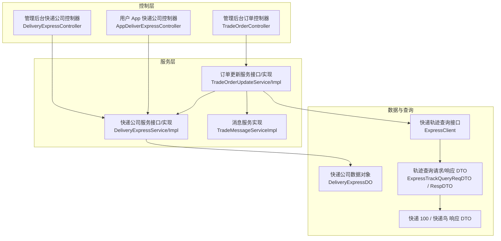
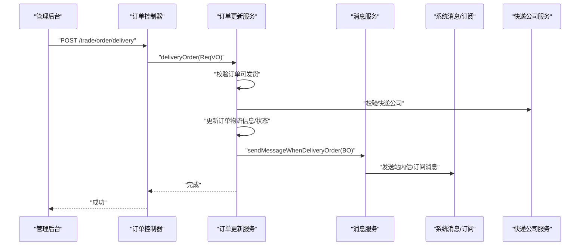
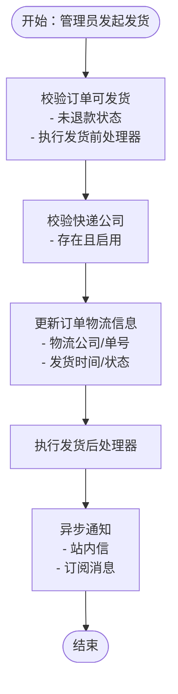
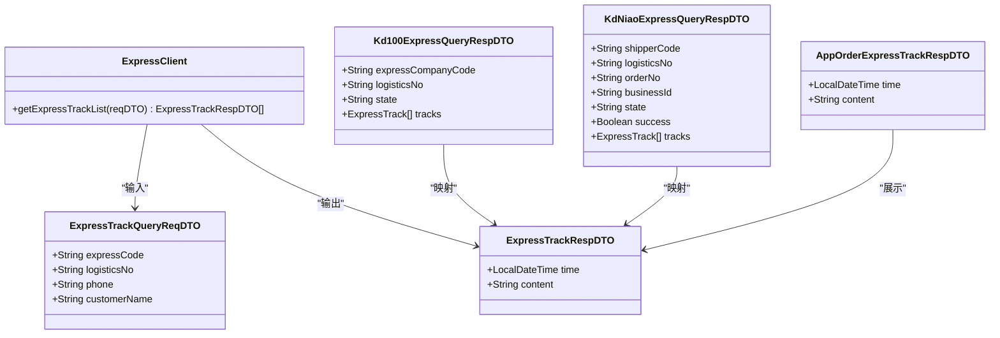
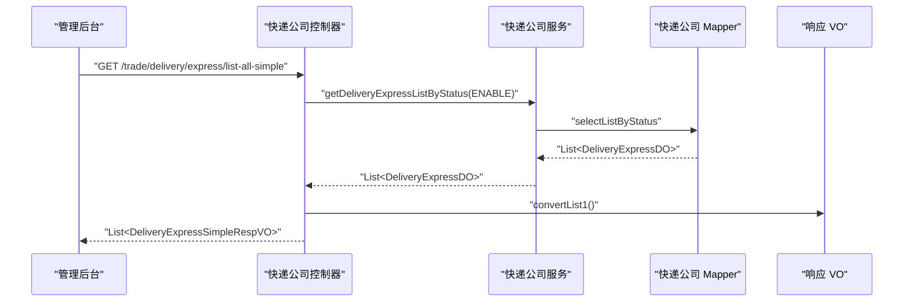
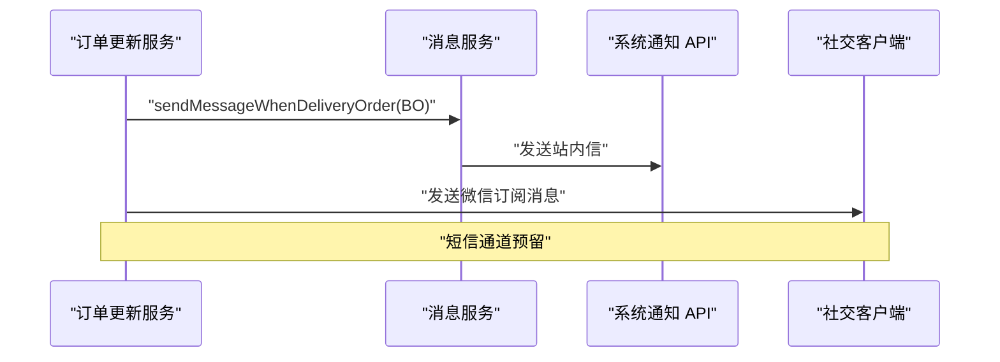
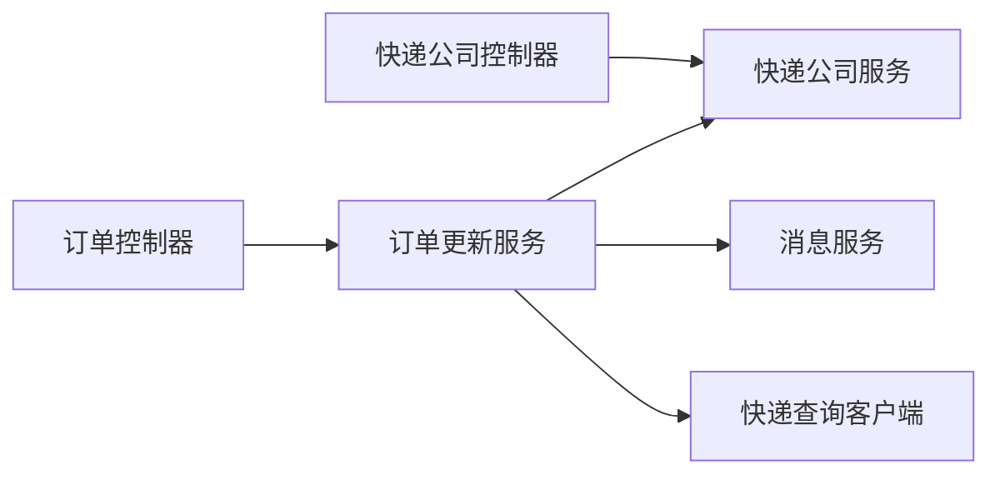

# 发货物流管理

<cite>
**本文引用的文件**
- [TradeOrderController.java](file://yudao-module-mall/yudao-module-trade/src/main/java/cn/iocoder/yudao/module/trade/controller/admin/order/TradeOrderController.java)
- [TradeOrderDeliveryReqVO.java](file://yudao-module-mall/yudao-module-trade/src/main/java/cn/iocoder/yudao/module/trade/controller/admin/order/vo/TradeOrderDeliveryReqVO.java)
- [TradeOrderUpdateService.java](file://yudao-module-mall/yudao-module-trade/src/main/java/cn/iocoder/yudao/module/trade/service/order/TradeOrderUpdateService.java)
- [TradeOrderUpdateServiceImpl.java](file://yudao-module-mall/yudao-module-trade/src/main/java/cn/iocoder/yudao/module/trade/service/order/TradeOrderUpdateServiceImpl.java)
- [DeliveryExpressController.java](file://yudao-module-mall/yudao-module-trade/src/main/java/cn/iocoder/yudao/module/trade/controller/admin/delivery/DeliveryExpressController.java)
- [DeliveryExpressService.java](file://yudao-module-mall/yudao-module-trade/src/main/java/cn/iocoder/yudao/module/trade/service/delivery/DeliveryExpressService.java)
- [DeliveryExpressServiceImpl.java](file://yudao-module-mall/yudao-module-trade/src/main/java/cn/iocoder/yudao/module/trade/service/delivery/DeliveryExpressServiceImpl.java)
- [DeliveryExpressDO.java](file://yudao-module-mall/yudao-module-trade/src/main/java/cn/iocoder/yudao/module/trade/dal/dataobject/delivery/DeliveryExpressDO.java)
- [AppDeliverExpressController.java](file://yudao-module-mall/yudao-module-trade/src/main/java/cn/iocoder/yudao/module/trade/controller/app/delivery/AppDeliverExpressController.java)
- [AppDeliveryExpressRespVO.java](file://yudao-module-mall/yudao-module-trade/src/main/java/cn/iocoder/yudao/module/trade/controller/app/delivery/vo/express/AppDeliveryExpressRespVO.java)
- [DeliveryExpressBaseVO.java](file://yudao-module-mall/yudao-module-trade/src/main/java/cn/iocoder/yudao/module/trade/controller/admin/delivery/vo/express/DeliveryExpressBaseVO.java)
- [DeliveryExpressPageReqVO.java](file://yudao-module-mall/yudao-module-trade/src/main/java/cn/iocoder/yudao/module/trade/controller/admin/delivery/vo/express/DeliveryExpressPageReqVO.java)
- [DeliveryExpressRespVO.java](file://yudao-module-mall/yudao-module-trade/src/main/java/cn/iocoder/yudao/module/trade/controller/admin/delivery/vo/express/DeliveryExpressRespVO.java)
- [DeliveryExpressExcelVO.java](file://yudao-module-mall/yudao-module-trade/src/main/java/cn/iocoder/yudao/module/trade/controller/admin/delivery/vo/express/DeliveryExpressExcelVO.java)
- [DeliveryExpressSimpleRespVO.java](file://yudao-module-mall/yudao-module-trade/src/main/java/cn/iocoder/yudao/module/trade/controller/admin/delivery/vo/express/DeliveryExpressSimpleRespVO.java)
- [TradeMessageServiceImpl.java](file://yudao-module-mall/yudao-module-trade/src/main/java/cn/iocoder/yudao/module/trade/service/message/TradeMessageServiceImpl.java)
- [TradeOrderMessageWhenDeliveryOrderReqBO.java](file://yudao-module-mall/yudao-module-trade/src/main/java/cn/iocoder/yudao/module/trade/service/message/bo/TradeOrderMessageWhenDeliveryOrderReqBO.java)
- [ExpressClient.java](file://yudao-module-mall/yudao-module-trade/src/main/java/cn/iocoder/yudao/module/trade/framework/delivery/core/client/ExpressClient.java)
- [ExpressTrackQueryReqDTO.java](file://yudao-module-mall/yudao-module-trade/src/main/java/cn/iocoder/yudao/module/trade/framework/delivery/core/client/dto/ExpressTrackQueryReqDTO.java)
- [ExpressTrackRespDTO.java](file://yudao-module-mall/yudao-module-trade/src/main/java/cn/iocoder/yudao/module/trade/framework/delivery/core/client/dto/ExpressTrackRespDTO.java)
- [Kd100ExpressQueryRespDTO.java](file://yudao-module-mall/yudao-module-trade/src/main/java/cn/iocoder/yudao/module/trade/framework/delivery/core/client/dto/kd100/Kd100ExpressQueryRespDTO.java)
- [KdNiaoExpressQueryRespDTO.java](file://yudao-module-mall/yudao-module-trade/src/main/java/cn/iocoder/yudao/module/trade/framework/delivery/core/client/dto/kdniao/KdNiaoExpressQueryRespDTO.java)
- [AppOrderExpressTrackRespDTO.java](file://yudao-module-mall/yudao-module-trade/src/main/java/cn/iocoder/yudao/module/trade/controller/app/order/vo/AppOrderExpressTrackRespDTO.java)
</cite>

## 目录
1. [简介](#简介)
2. [项目结构](#项目结构)
3. [核心组件](#核心组件)
4. [架构总览](#架构总览)
5. [详细组件分析](#详细组件分析)
6. [依赖关系分析](#依赖关系分析)
7. [性能考量](#性能考量)
8. [故障排查指南](#故障排查指南)
9. [结论](#结论)
10. [附录](#附录)

## 简介
本文件面向“发货物流管理”业务域，系统化梳理从订单发货、物流跟踪、快递公司管理到发货通知的完整流程与实现要点。重点覆盖以下方面：
- 发货操作流程：库存检查、打包处理、快递选择、发货单生成、状态变更与通知
- 物流跟踪能力：轨迹查询接口抽象、多平台适配（快递 100、快递鸟）、轨迹展示
- 快递公司配置：维护、状态控制、导出与前端下拉使用
- 发货通知：站内信、微信订阅消息、短信（预留）等渠道
- 业务规则与约束：发货前置校验、异常处理、幂等与并发控制建议
- 优化策略与最佳实践：异步通知、缓存与批量处理、日志与可观测性

## 项目结构
围绕发货物流管理，核心代码分布在“交易订单”与“物流配置”两大模块路径下：
- 控制层：管理后台与用户 App 的控制器
- 服务层：订单发货、快递公司管理、消息通知
- 数据对象：快递公司实体
- 轨迹查询：快递客户端接口与多平台响应 DTO

图表来源
- [TradeOrderController.java:110-116](file://yudao-module-mall/yudao-module-trade/src/main/java/cn/iocoder/yudao/module/trade/controller/admin/order/TradeOrderController.java#L110-L116)
- [DeliveryExpressController.java:37-95](file://yudao-module-mall/yudao-module-trade/src/main/java/cn/iocoder/yudao/module/trade/controller/admin/delivery/DeliveryExpressController.java#L37-L95)
- [AppDeliverExpressController.java:32-33](file://yudao-module-mall/yudao-module-trade/src/main/java/cn/iocoder/yudao/module/trade/controller/app/delivery/AppDeliverExpressController.java#L32-L33)
- [TradeOrderUpdateService.java:63-68](file://yudao-module-mall/yudao-module-trade/src/main/java/cn/iocoder/yudao/module/trade/service/order/TradeOrderUpdateService.java#L63-L68)
- [TradeOrderUpdateServiceImpl.java:418-426](file://yudao-module-mall/yudao-module-trade/src/main/java/cn/iocoder/yudao/module/trade/service/order/TradeOrderUpdateServiceImpl.java#L418-L426)
- [DeliveryExpressService.java:18-82](file://yudao-module-mall/yudao-module-trade/src/main/java/cn/iocoder/yudao/module/trade/service/delivery/DeliveryExpressService.java#L18-L82)
- [DeliveryExpressServiceImpl.java:33-96](file://yudao-module-mall/yudao-module-trade/src/main/java/cn/iocoder/yudao/module/trade/service/delivery/DeliveryExpressServiceImpl.java#L33-L96)
- [DeliveryExpressDO.java:15-60](file://yudao-module-mall/yudao-module-trade/src/main/java/cn/iocoder/yudao/module/trade/dal/dataobject/delivery/DeliveryExpressDO.java#L15-L60)
- [ExpressClient.java:13-23](file://yudao-module-mall/yudao-module-trade/src/main/java/cn/iocoder/yudao/module/trade/framework/delivery/core/client/ExpressClient.java#L13-L23)
- [ExpressTrackQueryReqDTO.java:12-36](file://yudao-module-mall/yudao-module-trade/src/main/java/cn/iocoder/yudao/module/trade/framework/delivery/core/client/dto/ExpressTrackQueryReqDTO.java#L12-L36)
- [ExpressTrackRespDTO.java:12-25](file://yudao-module-mall/yudao-module-trade/src/main/java/cn/iocoder/yudao/module/trade/framework/delivery/core/client/dto/ExpressTrackRespDTO.java#L12-L25)
- [Kd100ExpressQueryRespDTO.java:22-73](file://yudao-module-mall/yudao-module-trade/src/main/java/cn/iocoder/yudao/module/trade/framework/delivery/core/client/dto/kd100/Kd100ExpressQueryRespDTO.java#L22-L73)
- [KdNiaoExpressQueryRespDTO.java:22-99](file://yudao-module-mall/yudao-module-trade/src/main/java/cn/iocoder/yudao/module/trade/framework/delivery/core/client/dto/kdniao/KdNiaoExpressQueryRespDTO.java#L22-L99)

章节来源
- [TradeOrderController.java:110-116](file://yudao-module-mall/yudao-module-trade/src/main/java/cn/iocoder/yudao/module/trade/controller/admin/order/TradeOrderController.java#L110-L116)
- [DeliveryExpressController.java:37-95](file://yudao-module-mall/yudao-module-trade/src/main/java/cn/iocoder/yudao/module/trade/controller/admin/delivery/DeliveryExpressController.java#L37-L95)
- [AppDeliverExpressController.java:32-33](file://yudao-module-mall/yudao-module-trade/src/main/java/cn/iocoder/yudao/module/trade/controller/app/delivery/AppDeliverExpressController.java#L32-L33)

## 核心组件
- 订单发货链路
  - 控制器接收发货请求，调用订单更新服务执行发货
  - 发货过程中进行前置校验、状态变更、异步通知与扩展点处理
- 快递公司管理
  - 提供创建、更新、删除、分页、导出、按状态筛选等能力
  - 校验编码唯一性与状态有效性
- 物流跟踪
  - 抽象快递查询客户端接口，支持多平台响应 DTO
  - App 层提供轨迹展示 VO
- 发货通知
  - 站内信与微信订阅消息通道，预留短信通道

章节来源
- [TradeOrderUpdateService.java:63-68](file://yudao-module-mall/yudao-module-trade/src/main/java/cn/iocoder/yudao/module/trade/service/order/TradeOrderUpdateService.java#L63-L68)
- [TradeOrderUpdateServiceImpl.java:418-426](file://yudao-module-mall/yudao-module-trade/src/main/java/cn/iocoder/yudao/module/trade/service/order/TradeOrderUpdateServiceImpl.java#L418-L426)
- [DeliveryExpressService.java:18-82](file://yudao-module-mall/yudao-module-trade/src/main/java/cn/iocoder/yudao/module/trade/service/delivery/DeliveryExpressService.java#L18-L82)
- [DeliveryExpressServiceImpl.java:33-96](file://yudao-module-mall/yudao-module-trade/src/main/java/cn/iocoder/yudao/module/trade/service/delivery/DeliveryExpressServiceImpl.java#L33-L96)
- [ExpressClient.java:13-23](file://yudao-module-mall/yudao-module-trade/src/main/java/cn/iocoder/yudao/module/trade/framework/delivery/core/client/ExpressClient.java#L13-L23)
- [TradeMessageServiceImpl.java:26-42](file://yudao-module-mall/yudao-module-trade/src/main/java/cn/iocoder/yudao/module/trade/service/message/TradeMessageServiceImpl.java#L26-L42)

## 架构总览
发货物流管理采用“控制器-服务-数据对象-查询客户端”的分层架构，关键交互如下：

图表来源
- [TradeOrderController.java:110-116](file://yudao-module-mall/yudao-module-trade/src/main/java/cn/iocoder/yudao/module/trade/controller/admin/order/TradeOrderController.java#L110-L116)
- [TradeOrderUpdateService.java:63-68](file://yudao-module-mall/yudao-module-trade/src/main/java/cn/iocoder/yudao/module/trade/service/order/TradeOrderUpdateService.java#L63-L68)
- [TradeOrderUpdateServiceImpl.java:404-416](file://yudao-module-mall/yudao-module-trade/src/main/java/cn/iocoder/yudao/module/trade/service/order/TradeOrderUpdateServiceImpl.java#L404-L416)
- [TradeMessageServiceImpl.java:26-42](file://yudao-module-mall/yudao-module-trade/src/main/java/cn/iocoder/yudao/module/trade/service/message/TradeMessageServiceImpl.java#L26-L42)
- [DeliveryExpressService.java:56-96](file://yudao-module-mall/yudao-module-trade/src/main/java/cn/iocoder/yudao/module/trade/service/delivery/DeliveryExpressService.java#L56-L96)

## 详细组件分析

### 发货操作流程
- 触发入口：管理后台订单控制器提供发货接口
- 校验与前置处理：验证订单未处于退款中、执行订单处理器的发货前钩子
- 快递公司校验：确保快递公司存在且启用
- 状态更新：写入物流公司编号、物流单号、发货时间、订单状态
- 后置处理与通知：执行发货后钩子，并异步发送站内信与订阅消息
- 并发与幂等：通过事务包裹与处理器钩子保障一致性；异步通知避免阻塞主流程

图表来源
- [TradeOrderController.java:110-116](file://yudao-module-mall/yudao-module-trade/src/main/java/cn/iocoder/yudao/module/trade/controller/admin/order/TradeOrderController.java#L110-L116)
- [TradeOrderUpdateServiceImpl.java:433-451](file://yudao-module-mall/yudao-module-trade/src/main/java/cn/iocoder/yudao/module/trade/service/order/TradeOrderUpdateServiceImpl.java#L433-L451)
- [TradeOrderUpdateServiceImpl.java:404-416](file://yudao-module-mall/yudao-module-trade/src/main/java/cn/iocoder/yudao/module/trade/service/order/TradeOrderUpdateServiceImpl.java#L404-L416)
- [DeliveryExpressService.java:56-96](file://yudao-module-mall/yudao-module-trade/src/main/java/cn/iocoder/yudao/module/trade/service/delivery/DeliveryExpressService.java#L56-L96)

章节来源
- [TradeOrderController.java:110-116](file://yudao-module-mall/yudao-module-trade/src/main/java/cn/iocoder/yudao/module/trade/controller/admin/order/TradeOrderController.java#L110-L116)
- [TradeOrderDeliveryReqVO.java:12-22](file://yudao-module-mall/yudao-module-trade/src/main/java/cn/iocoder/yudao/module/trade/controller/admin/order/vo/TradeOrderDeliveryReqVO.java#L12-L22)
- [TradeOrderUpdateServiceImpl.java:433-451](file://yudao-module-mall/yudao-module-trade/src/main/java/cn/iocoder/yudao/module/trade/service/order/TradeOrderUpdateServiceImpl.java#L433-L451)
- [TradeOrderUpdateServiceImpl.java:404-416](file://yudao-module-mall/yudao-module-trade/src/main/java/cn/iocoder/yudao/module/trade/service/order/TradeOrderUpdateServiceImpl.java#L404-L416)

### 物流跟踪功能
- 查询接口抽象：统一的快递查询客户端接口，屏蔽不同平台差异
- 请求参数：包含快递公司编码、物流单号、电话等
- 响应 DTO：分别映射快递 100 与快递鸟的响应结构
- App 展示：提供轨迹列表的响应 VO

图表来源
- [ExpressClient.java:13-23](file://yudao-module-mall/yudao-module-trade/src/main/java/cn/iocoder/yudao/module/trade/framework/delivery/core/client/ExpressClient.java#L13-L23)
- [ExpressTrackQueryReqDTO.java:12-36](file://yudao-module-mall/yudao-module-trade/src/main/java/cn/iocoder/yudao/module/trade/framework/delivery/core/client/dto/ExpressTrackQueryReqDTO.java#L12-L36)
- [ExpressTrackRespDTO.java:12-25](file://yudao-module-mall/yudao-module-trade/src/main/java/cn/iocoder/yudao/module/trade/framework/delivery/core/client/dto/ExpressTrackRespDTO.java#L12-L25)
- [Kd100ExpressQueryRespDTO.java:22-73](file://yudao-module-mall/yudao-module-trade/src/main/java/cn/iocoder/yudao/module/trade/framework/delivery/core/client/dto/kd100/Kd100ExpressQueryRespDTO.java#L22-L73)
- [KdNiaoExpressQueryRespDTO.java:22-99](file://yudao-module-mall/yudao-module-trade/src/main/java/cn/iocoder/yudao/module/trade/framework/delivery/core/client/dto/kdniao/KdNiaoExpressQueryRespDTO.java#L22-L99)
- [AppOrderExpressTrackRespDTO.java:14-23](file://yudao-module-mall/yudao-module-trade/src/main/java/cn/iocoder/yudao/module/trade/controller/app/order/vo/AppOrderExpressTrackRespDTO.java#L14-L23)

章节来源
- [ExpressClient.java:13-23](file://yudao-module-mall/yudao-module-trade/src/main/java/cn/iocoder/yudao/module/trade/framework/delivery/core/client/ExpressClient.java#L13-L23)
- [ExpressTrackQueryReqDTO.java:12-36](file://yudao-module-mall/yudao-module-trade/src/main/java/cn/iocoder/yudao/module/trade/framework/delivery/core/client/dto/ExpressTrackQueryReqDTO.java#L12-L36)
- [Kd100ExpressQueryRespDTO.java:22-73](file://yudao-module-mall/yudao-module-trade/src/main/java/cn/iocoder/yudao/module/trade/framework/delivery/core/client/dto/kd100/Kd100ExpressQueryRespDTO.java#L22-L73)
- [KdNiaoExpressQueryRespDTO.java:22-99](file://yudao-module-mall/yudao-module-trade/src/main/java/cn/iocoder/yudao/module/trade/framework/delivery/core/client/dto/kdniao/KdNiaoExpressQueryRespDTO.java#L22-L99)
- [AppOrderExpressTrackRespDTO.java:14-23](file://yudao-module-mall/yudao-module-trade/src/main/java/cn/iocoder/yudao/module/trade/controller/app/order/vo/AppOrderExpressTrackRespDTO.java#L14-L23)

### 快递公司配置管理
- 管理后台能力
  - 新增/修改/删除/查询/分页/导出
  - 精简列表用于前端下拉（仅启用状态）
- 校验规则
  - 编码唯一性校验
  - 存在性与状态校验（禁用不可用于发货）
- App 展示
  - 提供简单列表，仅包含编号与名称

图表来源
- [DeliveryExpressController.java:70-75](file://yudao-module-mall/yudao-module-trade/src/main/java/cn/iocoder/yudao/module/trade/controller/admin/delivery/DeliveryExpressController.java#L70-L75)
- [DeliveryExpressService.java:74-81](file://yudao-module-mall/yudao-module-trade/src/main/java/cn/iocoder/yudao/module/trade/service/delivery/DeliveryExpressService.java#L74-L81)
- [DeliveryExpressServiceImpl.java:109-112](file://yudao-module-mall/yudao-module-trade/src/main/java/cn/iocoder/yudao/module/trade/service/delivery/DeliveryExpressServiceImpl.java#L109-L112)
- [DeliveryExpressSimpleRespVO.java:14-24](file://yudao-module-mall/yudao-module-trade/src/main/java/cn/iocoder/yudao/module/trade/controller/admin/delivery/vo/express/DeliveryExpressSimpleRespVO.java#L14-L24)
- [AppDeliverExpressController.java:32-33](file://yudao-module-mall/yudao-module-trade/src/main/java/cn/iocoder/yudao/module/trade/controller/app/delivery/AppDeliverExpressController.java#L32-L33)
- [AppDeliveryExpressRespVO.java:10-16](file://yudao-module-mall/yudao-module-trade/src/main/java/cn/iocoder/yudao/module/trade/controller/app/delivery/vo/express/AppDeliveryExpressRespVO.java#L10-L16)

章节来源
- [DeliveryExpressController.java:37-95](file://yudao-module-mall/yudao-module-trade/src/main/java/cn/iocoder/yudao/module/trade/controller/admin/delivery/DeliveryExpressController.java#L37-L95)
- [DeliveryExpressService.java:18-82](file://yudao-module-mall/yudao-module-trade/src/main/java/cn/iocoder/yudao/module/trade/service/delivery/DeliveryExpressService.java#L18-L82)
- [DeliveryExpressServiceImpl.java:33-96](file://yudao-module-mall/yudao-module-trade/src/main/java/cn/iocoder/yudao/module/trade/service/delivery/DeliveryExpressServiceImpl.java#L33-L96)
- [DeliveryExpressDO.java:15-60](file://yudao-module-mall/yudao-module-trade/src/main/java/cn/iocoder/yudao/module/trade/dal/dataobject/delivery/DeliveryExpressDO.java#L15-L60)
- [DeliveryExpressExcelVO.java:14-39](file://yudao-module-mall/yudao-module-trade/src/main/java/cn/iocoder/yudao/module/trade/controller/admin/delivery/vo/express/DeliveryExpressExcelVO.java#L14-L39)
- [DeliveryExpressPageReqVO.java:16-31](file://yudao-module-mall/yudao-module-trade/src/main/java/cn/iocoder/yudao/module/trade/controller/admin/delivery/vo/express/DeliveryExpressPageReqVO.java#L16-L31)
- [DeliveryExpressBaseVO.java:13-34](file://yudao-module-mall/yudao-module-trade/src/main/java/cn/iocoder/yudao/module/trade/controller/admin/delivery/vo/express/DeliveryExpressBaseVO.java#L13-L34)
- [DeliveryExpressRespVO.java:14-22](file://yudao-module-mall/yudao-module-trade/src/main/java/cn/iocoder/yudao/module/trade/controller/admin/delivery/vo/express/DeliveryExpressRespVO.java#L14-L22)
- [AppDeliverExpressController.java:32-33](file://yudao-module-mall/yudao-module-trade/src/main/java/cn/iocoder/yudao/module/trade/controller/app/delivery/AppDeliverExpressController.java#L32-L33)
- [AppDeliveryExpressRespVO.java:10-16](file://yudao-module-mall/yudao-module-trade/src/main/java/cn/iocoder/yudao/module/trade/controller/app/delivery/vo/express/AppDeliveryExpressRespVO.java#L10-L16)

### 发货通知功能
- 站内信：通过系统通知 API 发送
- 订阅消息：通过社交客户端发送微信订阅消息
- 短信：预留模板常量，当前逻辑中未实际发送

图表来源
- [TradeOrderUpdateServiceImpl.java:404-416](file://yudao-module-mall/yudao-module-trade/src/main/java/cn/iocoder/yudao/module/trade/service/order/TradeOrderUpdateServiceImpl.java#L404-L416)
- [TradeMessageServiceImpl.java:26-42](file://yudao-module-mall/yudao-module-trade/src/main/java/cn/iocoder/yudao/module/trade/service/message/TradeMessageServiceImpl.java#L26-L42)
- [TradeOrderMessageWhenDeliveryOrderReqBO.java:14-32](file://yudao-module-mall/yudao-module-trade/src/main/java/cn/iocoder/yudao/module/trade/service/message/bo/TradeOrderMessageWhenDeliveryOrderReqBO.java#L14-L32)

章节来源
- [TradeOrderUpdateServiceImpl.java:404-416](file://yudao-module-mall/yudao-module-trade/src/main/java/cn/iocoder/yudao/module/trade/service/order/TradeOrderUpdateServiceImpl.java#L404-L416)
- [TradeMessageServiceImpl.java:26-42](file://yudao-module-mall/yudao-module-trade/src/main/java/cn/iocoder/yudao/module/trade/service/message/TradeMessageServiceImpl.java#L26-L42)
- [TradeOrderMessageWhenDeliveryOrderReqBO.java:14-32](file://yudao-module-mall/yudao-module-trade/src/main/java/cn/iocoder/yudao/module/trade/service/message/bo/TradeOrderMessageWhenDeliveryOrderReqBO.java#L14-L32)

## 依赖关系分析
- 控制器依赖服务接口，服务实现依赖 Mapper 与外部 API
- 订单服务依赖快递公司服务与消息服务
- 快递查询通过客户端接口解耦不同平台

图表来源
- [TradeOrderController.java:110-116](file://yudao-module-mall/yudao-module-trade/src/main/java/cn/iocoder/yudao/module/trade/controller/admin/order/TradeOrderController.java#L110-L116)
- [DeliveryExpressController.java:37-95](file://yudao-module-mall/yudao-module-trade/src/main/java/cn/iocoder/yudao/module/trade/controller/admin/delivery/DeliveryExpressController.java#L37-L95)
- [TradeOrderUpdateService.java:63-68](file://yudao-module-mall/yudao-module-trade/src/main/java/cn/iocoder/yudao/module/trade/service/order/TradeOrderUpdateService.java#L63-L68)
- [DeliveryExpressService.java:18-82](file://yudao-module-mall/yudao-module-trade/src/main/java/cn/iocoder/yudao/module/trade/service/delivery/DeliveryExpressService.java#L18-L82)
- [ExpressClient.java:13-23](file://yudao-module-mall/yudao-module-trade/src/main/java/cn/iocoder/yudao/module/trade/framework/delivery/core/client/ExpressClient.java#L13-L23)

章节来源
- [TradeOrderController.java:110-116](file://yudao-module-mall/yudao-module-trade/src/main/java/cn/iocoder/yudao/module/trade/controller/admin/order/TradeOrderController.java#L110-L116)
- [DeliveryExpressController.java:37-95](file://yudao-module-mall/yudao-module-trade/src/main/java/cn/iocoder/yudao/module/trade/controller/admin/delivery/DeliveryExpressController.java#L37-L95)
- [TradeOrderUpdateService.java:63-68](file://yudao-module-mall/yudao-module-trade/src/main/java/cn/iocoder/yudao/module/trade/service/order/TradeOrderUpdateService.java#L63-L68)
- [DeliveryExpressService.java:18-82](file://yudao-module-mall/yudao-module-trade/src/main/java/cn/iocoder/yudao/module/trade/service/delivery/DeliveryExpressService.java#L18-L82)
- [ExpressClient.java:13-23](file://yudao-module-mall/yudao-module-trade/src/main/java/cn/iocoder/yudao/module/trade/framework/delivery/core/client/ExpressClient.java#L13-L23)

## 性能考量
- 异步通知：发货后通知采用异步方法，降低主流程延迟
- 批量查询：分页与列表查询结合，减少一次性加载压力
- 幂等设计：通过订单状态机与处理器钩子，避免重复发货
- 缓存与限流：建议对快递查询接口增加缓存与限流策略，防止上游接口抖动
- 日志与监控：为关键节点埋点，便于定位性能瓶颈与异常

## 故障排查指南
- 发货失败
  - 订单处于退款状态：检查退款状态枚举与校验逻辑
  - 快递公司不存在或禁用：确认快递公司状态与编码
  - 并发冲突：关注发货前后处理器与事务边界
- 物流跟踪异常
  - 平台返回失败：检查请求参数与平台返回字段映射
  - 时间解析异常：确认时区与格式化配置
- 通知未达
  - 站内信/订阅消息发送失败：检查系统通知与社交客户端配置
  - 短信通道：确认模板与参数

章节来源
- [TradeOrderUpdateServiceImpl.java:441-451](file://yudao-module-mall/yudao-module-trade/src/main/java/cn/iocoder/yudao/module/trade/service/order/TradeOrderUpdateServiceImpl.java#L441-L451)
- [DeliveryExpressServiceImpl.java:86-96](file://yudao-module-mall/yudao-module-trade/src/main/java/cn/iocoder/yudao/module/trade/service/delivery/DeliveryExpressServiceImpl.java#L86-L96)
- [Kd100ExpressQueryRespDTO.java:44-49](file://yudao-module-mall/yudao-module-trade/src/main/java/cn/iocoder/yudao/module/trade/framework/delivery/core/client/dto/kd100/Kd100ExpressQueryRespDTO.java#L44-L49)
- [KdNiaoExpressQueryRespDTO.java:66-72](file://yudao-module-mall/yudao-module-trade/src/main/java/cn/iocoder/yudao/module/trade/framework/delivery/core/client/dto/kdniao/KdNiaoExpressQueryRespDTO.java#L66-L72)

## 结论
本系统以清晰的分层与接口抽象实现了发货物流管理的关键闭环：从订单发货、快递公司配置到物流跟踪与通知，具备良好的扩展性与可维护性。建议在生产环境中进一步完善异常处理、缓存与限流策略，并持续优化可观测性与告警体系。

## 附录
- 关键请求体与响应体
  - 发货请求体：包含订单编号、物流公司编号、物流单号
  - 快递公司响应体：包含编号、编码、名称、Logo、排序、状态、创建时间
  - 物流轨迹响应体：包含时间与内容
- 业务规则摘要
  - 发货前置条件：订单未处于退款中
  - 快递公司：必须存在且启用
  - 通知：站内信与订阅消息默认开启，短信通道预留

章节来源
- [TradeOrderDeliveryReqVO.java:12-22](file://yudao-module-mall/yudao-module-trade/src/main/java/cn/iocoder/yudao/module/trade/controller/admin/order/vo/TradeOrderDeliveryReqVO.java#L12-L22)
- [DeliveryExpressRespVO.java:14-22](file://yudao-module-mall/yudao-module-trade/src/main/java/cn/iocoder/yudao/module/trade/controller/admin/delivery/vo/express/DeliveryExpressRespVO.java#L14-L22)
- [AppOrderExpressTrackRespDTO.java:14-23](file://yudao-module-mall/yudao-module-trade/src/main/java/cn/iocoder/yudao/module/trade/controller/app/order/vo/AppOrderExpressTrackRespDTO.java#L14-L23)