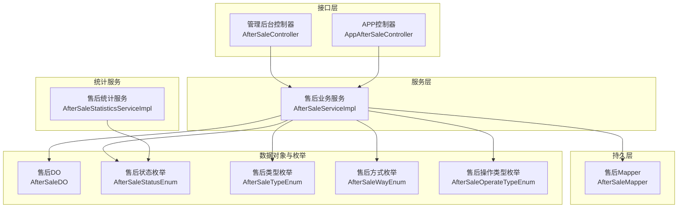
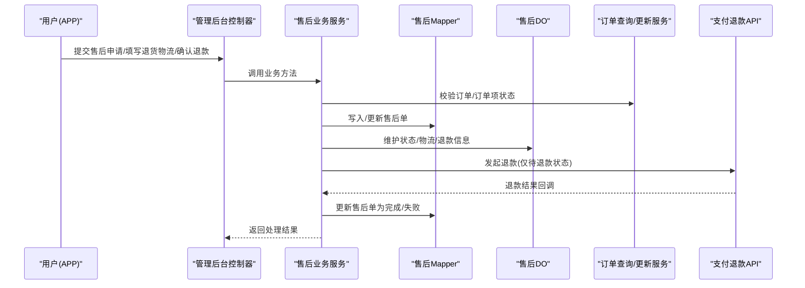
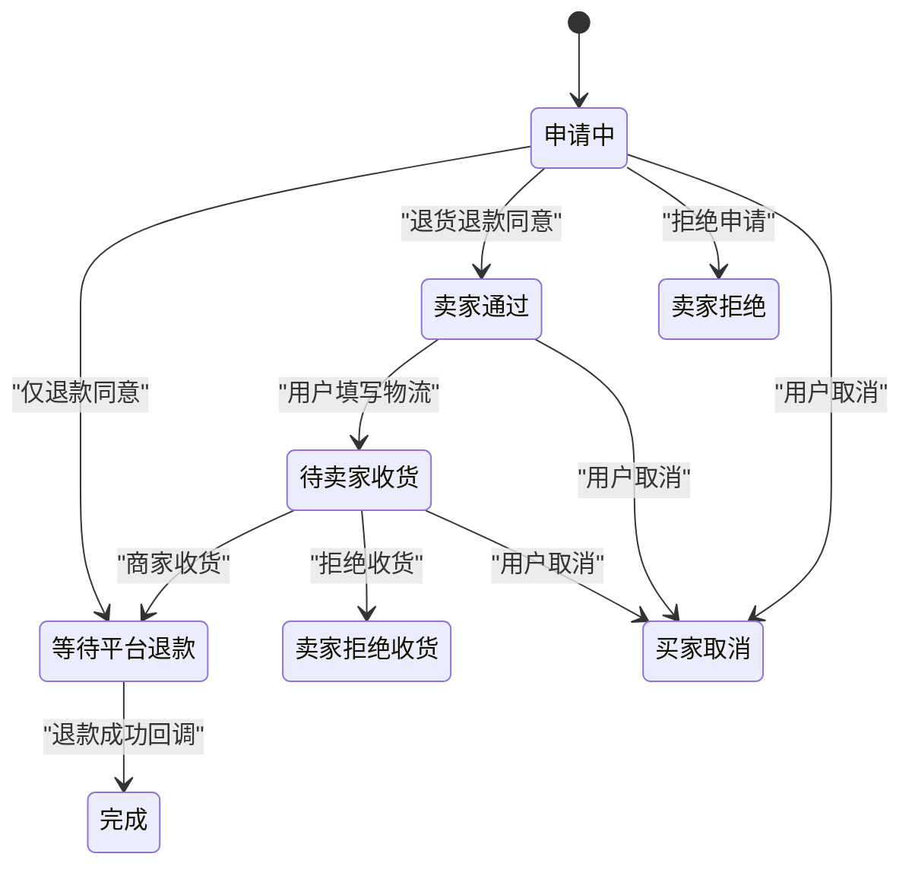
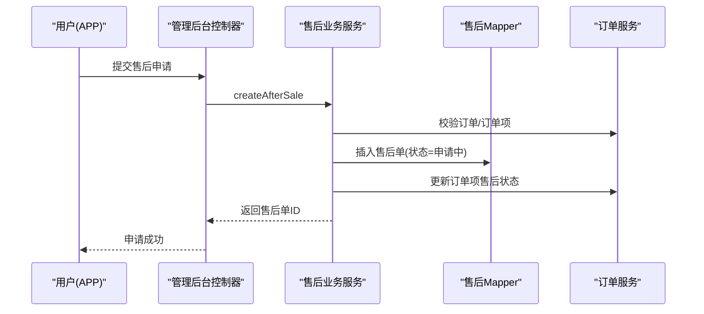
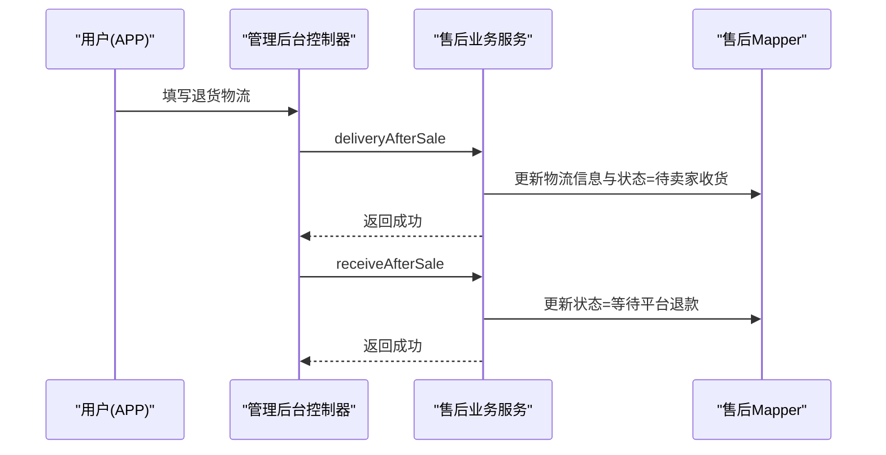
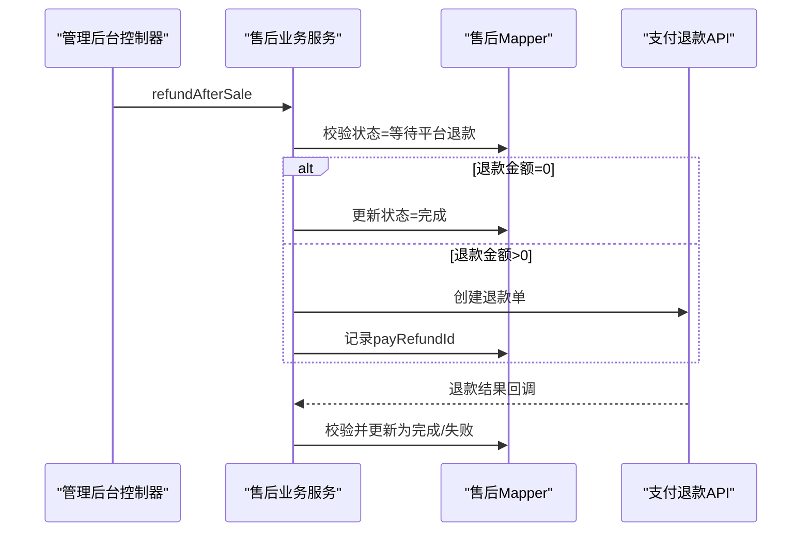
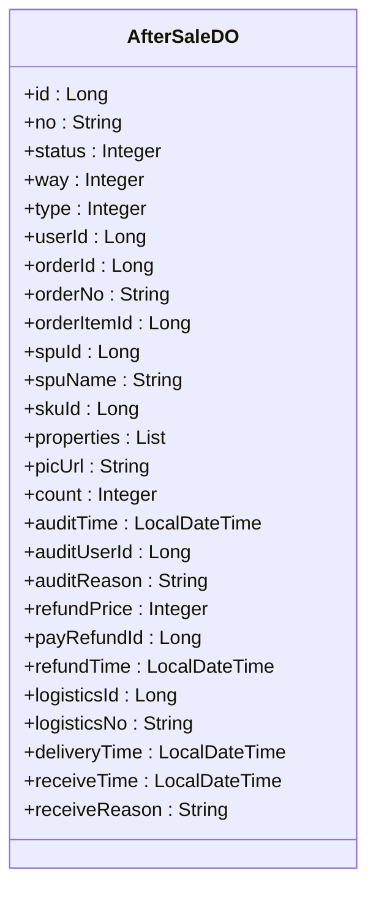
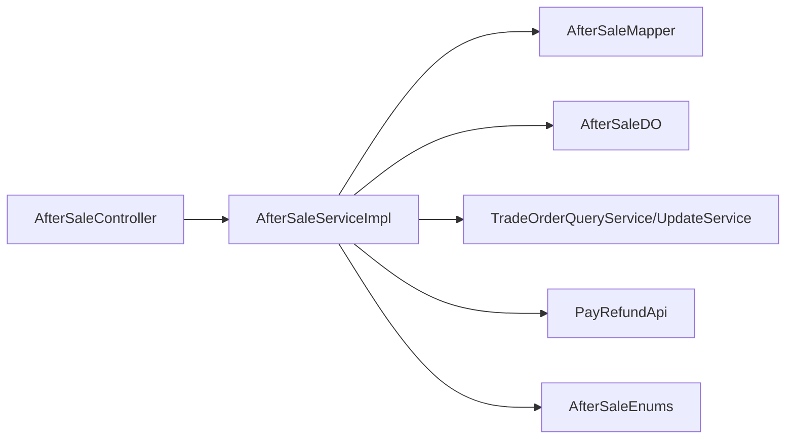

# 售后退换管理

<cite>
**本文引用的文件**
- [qiji-module-mall/qiji-module-trade-api/src/main/java/com.qiji.cps/module/trade/enums/aftersale/AfterSaleStatusEnum.java](file://qiji-module-mall/qiji-module-trade-api/src/main/java/com.qiji.cps/module/trade/enums/aftersale/AfterSaleStatusEnum.java)
- [qiji-module-mall/qiji-module-trade-api/src/main/java/com.qiji.cps/module/trade/enums/aftersale/AfterSaleTypeEnum.java](file://qiji-module-mall/qiji-module-trade-api/src/main/java/com.qiji.cps/module/trade/enums/aftersale/AfterSaleTypeEnum.java)
- [qiji-module-mall/qiji-module-trade-api/src/main/java/com.qiji.cps/module/trade/enums/aftersale/AfterSaleWayEnum.java](file://qiji-module-mall/qiji-module-trade-api/src/main/java/com.qiji.cps/module/trade/enums/aftersale/AfterSaleWayEnum.java)
- [qiji-module-mall/qiji-module-trade-api/src/main/java/com.qiji.cps/module/trade/enums/aftersale/AfterSaleOperateTypeEnum.java](file://qiji-module-mall/qiji-module-trade-api/src/main/java/com.qiji.cps/module/trade/enums/aftersale/AfterSaleOperateTypeEnum.java)
- [qiji-module-mall/qiji-module-trade/src/main/java/com.qiji.cps/module/trade/dal/dataobject/aftersale/AfterSaleDO.java](file://qiji-module-mall/qiji-module-trade/src/main/java/com.qiji.cps/module/trade/dal/dataobject/aftersale/AfterSaleDO.java)
- [qiji-module-mall/qiji-module-trade/src/main/java/com.qiji.cps/module/trade/dal/mysql/aftersale/AfterSaleMapper.java](file://qiji-module-mall/qiji-module-trade/src/main/java/com.qiji.cps/module/trade/dal/mysql/aftersale/AfterSaleMapper.java)
- [qiji-module-mall/qiji-module-trade/src/main/java/com.qiji.cps/module/trade/service/aftersale/AfterSaleServiceImpl.java](file://qiji-module-mall/qiji-module-trade/src/main/java/com.qiji.cps/module/trade/service/aftersale/AfterSaleServiceImpl.java)
- [qiji-module-mall/qiji-module-trade/src/main/java/com.qiji.cps/module/trade/controller/admin/aftersale/AfterSaleController.java](file://qiji-module-mall/qiji-module-trade/src/main/java/com.qiji.cps/module/trade/controller/admin/aftersale/AfterSaleController.java)
- [qiji-module-mall/qiji-module-trade/src/main/java/com.qiji.cps/module/trade/controller/app/aftersale/AppAfterSaleController.java](file://qiji-module-mall/qiji-module-trade/src/main/java/com.qiji.cps/module/trade/controller/app/aftersale/AppAfterSaleController.java)
- [qiji-module-mall/qiji-module-trade/src/main/java/com.qiji.cps/module/trade/controller/app/aftersale/vo/AppAfterSaleCreateReqVO.java](file://qiji-module-mall/qiji-module-trade/src/main/java/com.qiji.cps/module/trade/controller/app/aftersale/vo/AppAfterSaleCreateReqVO.java)
- [qiji-module-mall/qiji-module-trade/src/main/java/com.qiji.cps/module/trade/controller/app/aftersale/vo/AppAfterSaleDeliveryReqVO.java](file://qiji-module-mall/qiji-module-trade/src/main/java/com.qiji.cps/module/trade/controller/app/aftersale/vo/AppAfterSaleDeliveryReqVO.java)
- [qiji-module-mall/qiji-module-trade/src/main/java/com.qiji.cps/module/trade/controller/admin/aftersale/vo/AfterSaleDisagreeReqVO.java](file://qiji-module-mall/qiji-module-trade/src/main/java/com.qiji.cps/module/trade/controller/admin/aftersale/vo/AfterSaleDisagreeReqVO.java)
- [qiji-module-mall/qiji-module-trade/src/main/java/com.qiji.cps/module/trade/controller/admin/aftersale/vo/AfterSaleRefuseReqVO.java](file://qiji-module-mall/qiji-module-trade/src/main/java/com.qiji.cps/module/trade/controller/admin/aftersale/vo/AfterSaleRefuseReqVO.java)
- [qiji-module-mall/qiji-module-trade/src/main/java/com.qiji.cps/module/trade/convert/aftersale/AfterSaleConvert.java](file://qiji-module-mall/qiji-module-trade/src/main/java/com.qiji.cps/module/trade/convert/aftersale/AfterSaleConvert.java)
- [qiji-module-mall/qiji-module-statistics/src/main/java/com.qiji.cps/module/statistics/service/trade/AfterSaleStatisticsServiceImpl.java](file://qiji-module-mall/qiji-module-statistics/src/main/java/com.qiji.cps/module/statistics/service/trade/AfterSaleStatisticsServiceImpl.java)
</cite>

## 目录
1. [简介](#简介)
2. [项目结构](#项目结构)
3. [核心组件](#核心组件)
4. [架构总览](#架构总览)
5. [详细组件分析](#详细组件分析)
6. [依赖关系分析](#依赖关系分析)
7. [性能考量](#性能考量)
8. [故障排查指南](#故障排查指南)
9. [结论](#结论)
10. [附录](#附录)

## 简介
本文件面向售后退换管理系统，系统性梳理“退货申请、换货处理、退款审核、纠纷处理”等完整业务流程，明确售后申请的提交、审核、处理结果通知等关键步骤；阐述售后类型与方式的差异及处理策略；说明售后状态流转与操作类型；介绍售后相关的业务规则与时效限制；并给出流程优化与用户体验提升建议。

## 项目结构
售后模块位于“qiji-module-mall/qiji-module-trade”子模块内，采用“接口层-服务层-持久层-数据对象-枚举与转换”的分层设计，配合“管理后台控制器+APP控制器”双入口，支撑从用户侧申请到运营侧审核的闭环。

图示来源
- [qiji-module-mall/qiji-module-trade/src/main/java/com.qiji.cps/module/trade/controller/admin/aftersale/AfterSaleController.java:1-156](file://qiji-module-mall/qiji-module-trade/src/main/java/com.qiji.cps/module/trade/controller/admin/aftersale/AfterSaleController.java#L1-L156)
- [qiji-module-mall/qiji-module-trade/src/main/java/com.qiji.cps/module/trade/controller/app/aftersale/AppAfterSaleController.java](file://qiji-module-mall/qiji-module-trade/src/main/java/com.qiji.cps/module/trade/controller/app/aftersale/AppAfterSaleController.java)
- [qiji-module-mall/qiji-module-trade/src/main/java/com.qiji.cps/module/trade/service/aftersale/AfterSaleServiceImpl.java:1-487](file://qiji-module-mall/qiji-module-trade/src/main/java/com.qiji.cps/module/trade/service/aftersale/AfterSaleServiceImpl.java#L1-L487)
- [qiji-module-mall/qiji-module-trade/src/main/java/com.qiji.cps/module/trade/dal/mysql/aftersale/AfterSaleMapper.java:1-54](file://qiji-module-mall/qiji-module-trade/src/main/java/com.qiji.cps/module/trade/dal/mysql/aftersale/AfterSaleMapper.java#L1-L54)
- [qiji-module-mall/qiji-module-trade/src/main/java/com.qiji.cps/module/trade/dal/dataobject/aftersale/AfterSaleDO.java:1-200](file://qiji-module-mall/qiji-module-trade/src/main/java/com.qiji.cps/module/trade/dal/dataobject/aftersale/AfterSaleDO.java#L1-L200)
- [qiji-module-mall/qiji-module-statistics/src/main/java/com.qiji.cps/module/statistics/service/trade/AfterSaleStatisticsServiceImpl.java:1-34](file://qiji-module-mall/qiji-module-statistics/src/main/java/com.qiji.cps/module/statistics/service/trade/AfterSaleStatisticsServiceImpl.java#L1-L34)

章节来源
- [qiji-module-mall/qiji-module-trade/src/main/java/com.qiji.cps/module/trade/controller/admin/aftersale/AfterSaleController.java:1-156](file://qiji-module-mall/qiji-module-trade/src/main/java/com.qiji.cps/module/trade/controller/admin/aftersale/AfterSaleController.java#L1-L156)
- [qiji-module-mall/qiji-module-trade/src/main/java/com.qiji.cps/module/trade/service/aftersale/AfterSaleServiceImpl.java:1-487](file://qiji-module-mall/qiji-module-trade/src/main/java/com.qiji.cps/module/trade/service/aftersale/AfterSaleServiceImpl.java#L1-L487)

## 核心组件
- 售后状态枚举：定义“申请中、卖家通过、待卖家收货、等待平台退款、完成、买家取消、卖家拒绝、卖家拒绝收货”等状态及其名称与操作内容，支撑状态机流转与日志记录。
- 售后类型枚举：区分“售中退款”和“售后退款”，依据订单完成与否自动判定。
- 售后方式枚举：支持“仅退款”和“退货退款”，决定后续是否需要物流退货环节。
- 售后操作类型枚举：记录会员/商家/系统在各节点的操作动作，便于审计与日志展示。
- 售后数据对象：承载售后单主表字段（单号、状态、方式、类型、用户与订单关联、退款/退货物流信息、审批与退款时间等），并与订单项建立强关联。
- 售后Mapper：提供分页查询、按用户与状态计数、按条件更新等基础能力。
- 售后服务实现：封装完整的售后生命周期逻辑，包括申请校验、审批、退货物流登记、收货确认、退款发起与结果回写、取消等。
- 管理后台控制器：提供售后列表、详情、同意/拒绝、收货/拒收、确认退款、退款结果回调等接口。
- APP控制器与VO：提供用户侧申请、填写退货物流等前端交互能力。
- 统计服务：按时间段统计售后汇总与按状态计数，辅助运营监控。

章节来源
- [qiji-module-mall/qiji-module-trade-api/src/main/java/com.qiji.cps/module/trade/enums/aftersale/AfterSaleStatusEnum.java:1-96](file://qiji-module-mall/qiji-module-trade-api/src/main/java/com.qiji.cps/module/trade/enums/aftersale/AfterSaleStatusEnum.java#L1-L96)
- [qiji-module-mall/qiji-module-trade-api/src/main/java/com.qiji.cps/module/trade/enums/aftersale/AfterSaleTypeEnum.java:1-38](file://qiji-module-mall/qiji-module-trade-api/src/main/java/com.qiji.cps/module/trade/enums/aftersale/AfterSaleTypeEnum.java#L1-L38)
- [qiji-module-mall/qiji-module-trade-api/src/main/java/com.qiji.cps/module/trade/enums/aftersale/AfterSaleWayEnum.java:1-38](file://qiji-module-mall/qiji-module-trade-api/src/main/java/com.qiji.cps/module/trade/enums/aftersale/AfterSaleWayEnum.java#L1-L38)
- [qiji-module-mall/qiji-module-trade-api/src/main/java/com.qiji.cps/module/trade/enums/aftersale/AfterSaleOperateTypeEnum.java:1-38](file://qiji-module-mall/qiji-module-trade-api/src/main/java/com.qiji.cps/module/trade/enums/aftersale/AfterSaleOperateTypeEnum.java#L1-L38)
- [qiji-module-mall/qiji-module-trade/src/main/java/com.qiji.cps/module/trade/dal/dataobject/aftersale/AfterSaleDO.java:1-200](file://qiji-module-mall/qiji-module-trade/src/main/java/com.qiji.cps/module/trade/dal/dataobject/aftersale/AfterSaleDO.java#L1-L200)
- [qiji-module-mall/qiji-module-trade/src/main/java/com.qiji.cps/module/trade/dal/mysql/aftersale/AfterSaleMapper.java:1-54](file://qiji-module-mall/qiji-module-trade/src/main/java/com.qiji.cps/module/trade/dal/mysql/aftersale/AfterSaleMapper.java#L1-L54)
- [qiji-module-mall/qiji-module-trade/src/main/java/com.qiji.cps/module/trade/service/aftersale/AfterSaleServiceImpl.java:1-487](file://qiji-module-mall/qiji-module-trade/src/main/java/com.qiji.cps/module/trade/service/aftersale/AfterSaleServiceImpl.java#L1-L487)
- [qiji-module-mall/qiji-module-trade/src/main/java/com.qiji.cps/module/trade/controller/admin/aftersale/AfterSaleController.java:1-156](file://qiji-module-mall/qiji-module-trade/src/main/java/com.qiji.cps/module/trade/controller/admin/aftersale/AfterSaleController.java#L1-L156)
- [qiji-module-mall/qiji-module-statistics/src/main/java/com.qiji.cps/module/statistics/service/trade/AfterSaleStatisticsServiceImpl.java:1-34](file://qiji-module-mall/qiji-module-statistics/src/main/java/com.qiji.cps/module/statistics/service/trade/AfterSaleStatisticsServiceImpl.java#L1-L34)

## 架构总览
售后模块遵循“控制器-服务-持久层-数据对象-枚举”的分层架构，结合订单查询/更新服务与支付退款API，形成“申请-审核-退货-退款-完成”的闭环。

图示来源
- [qiji-module-mall/qiji-module-trade/src/main/java/com.qiji.cps/module/trade/controller/admin/aftersale/AfterSaleController.java:94-153](file://qiji-module-mall/qiji-module-trade/src/main/java/com.qiji.cps/module/trade/controller/admin/aftersale/AfterSaleController.java#L94-L153)
- [qiji-module-mall/qiji-module-trade/src/main/java/com.qiji.cps/module/trade/service/aftersale/AfterSaleServiceImpl.java:108-416](file://qiji-module-mall/qiji-module-trade/src/main/java/com.qiji.cps/module/trade/service/aftersale/AfterSaleServiceImpl.java#L108-L416)
- [qiji-module-mall/qiji-module-trade/src/main/java/com.qiji.cps/module/trade/dal/mysql/aftersale/AfterSaleMapper.java:37-40](file://qiji-module-mall/qiji-module-trade/src/main/java/com.qiji.cps/module/trade/dal/mysql/aftersale/AfterSaleMapper.java#L37-L40)

## 详细组件分析

### 售后类型与方式
- 售后类型
  - 售中退款：交易完成前买家申请退款
  - 售后退款：交易完成后买家申请退款
- 售后方式
  - 仅退款：无需退货，直接发起退款
  - 退货退款：需先退货，再发起退款
- 区别与处理
  - 仅退款：审批通过后进入“等待平台退款”，随后由支付模块发起退款并回调更新为“完成”
  - 退货退款：审批通过后进入“卖家通过”，用户填写物流后进入“待卖家收货”，商家收货后进入“等待平台退款”，最后完成

章节来源
- [qiji-module-mall/qiji-module-trade-api/src/main/java/com.qiji.cps/module/trade/enums/aftersale/AfterSaleTypeEnum.java:16-19](file://qiji-module-mall/qiji-module-trade-api/src/main/java/com.qiji.cps/module/trade/enums/aftersale/AfterSaleTypeEnum.java#L16-L19)
- [qiji-module-mall/qiji-module-trade-api/src/main/java/com.qiji.cps/module/trade/enums/aftersale/AfterSaleWayEnum.java:16-19](file://qiji-module-mall/qiji-module-trade-api/src/main/java/com.qiji.cps/module/trade/enums/aftersale/AfterSaleWayEnum.java#L16-L19)

### 售后状态管理与流转
售后状态机覆盖“申请中、卖家通过、待卖家收货、等待平台退款、完成、买家取消、卖家拒绝、卖家拒绝收货”。服务层对每个关键节点进行严格校验与原子更新，确保状态一致性。

图示来源
- [qiji-module-mall/qiji-module-trade-api/src/main/java/com.qiji.cps/module/trade/enums/aftersale/AfterSaleStatusEnum.java:21-55](file://qiji-module-mall/qiji-module-trade-api/src/main/java/com.qiji.cps/module/trade/enums/aftersale/AfterSaleStatusEnum.java#L21-L55)

章节来源
- [qiji-module-mall/qiji-module-trade-api/src/main/java/com.qiji.cps/module/trade/enums/aftersale/AfterSaleStatusEnum.java:1-96](file://qiji-module-mall/qiji-module-trade-api/src/main/java/com.qiji.cps/module/trade/enums/aftersale/AfterSaleStatusEnum.java#L1-L96)

### 售后申请与审批流程
- 申请提交
  - 用户提交申请，服务层校验订单项状态、是否已申请、退款金额上限、订单支付状态、是否发货（退货退款）、拼团状态等
  - 生成售后单号，设置初始状态为“申请中”，并标记“售中/售后”类型
- 审核处理
  - 同意：仅退款进入“等待平台退款”，退货退款进入“卖家通过”
  - 拒绝：进入“卖家拒绝”，并回滚订单项售后状态
- 处理结果通知
  - 通过日志与回调机制记录操作与状态变更，支持后续通知

图示来源
- [qiji-module-mall/qiji-module-trade/src/main/java/com.qiji.cps/module/trade/service/aftersale/AfterSaleServiceImpl.java:108-191](file://qiji-module-mall/qiji-module-trade/src/main/java/com.qiji.cps/module/trade/service/aftersale/AfterSaleServiceImpl.java#L108-L191)
- [qiji-module-mall/qiji-module-trade/src/main/java/com.qiji.cps/module/trade/controller/admin/aftersale/AfterSaleController.java:94-109](file://qiji-module-mall/qiji-module-trade/src/main/java/com.qiji.cps/module/trade/controller/admin/aftersale/AfterSaleController.java#L94-L109)

章节来源
- [qiji-module-mall/qiji-module-trade/src/main/java/com.qiji.cps/module/trade/service/aftersale/AfterSaleServiceImpl.java:108-230](file://qiji-module-mall/qiji-module-trade/src/main/java/com.qiji.cps/module/trade/service/aftersale/AfterSaleServiceImpl.java#L108-L230)
- [qiji-module-mall/qiji-module-trade/src/main/java/com.qiji.cps/module/trade/controller/admin/aftersale/AfterSaleController.java:94-109](file://qiji-module-mall/qiji-module-trade/src/main/java/com.qiji.cps/module/trade/controller/admin/aftersale/AfterSaleController.java#L94-L109)

### 退货与收货处理
- 用户填写退货物流
  - 校验当前状态为“卖家通过”，保存物流公司与单号，状态变更为“待卖家收货”
- 商家收货
  - 校验当前状态为“待卖家收货”，更新收货时间，状态变更为“等待平台退款”
- 商家拒收
  - 校验当前状态为“待卖家收货”，记录拒收原因，状态变更为“卖家拒绝收货”，并回滚订单项售后状态

图示来源
- [qiji-module-mall/qiji-module-trade/src/main/java/com.qiji.cps/module/trade/service/aftersale/AfterSaleServiceImpl.java:256-297](file://qiji-module-mall/qiji-module-trade/src/main/java/com.qiji.cps/module/trade/service/aftersale/AfterSaleServiceImpl.java#L256-L297)
- [qiji-module-mall/qiji-module-trade/src/main/java/com.qiji.cps/module/trade/controller/admin/aftersale/AfterSaleController.java:111-127](file://qiji-module-mall/qiji-module-trade/src/main/java/com.qiji.cps/module/trade/controller/admin/aftersale/AfterSaleController.java#L111-L127)

章节来源
- [qiji-module-mall/qiji-module-trade/src/main/java/com.qiji.cps/module/trade/service/aftersale/AfterSaleServiceImpl.java:256-324](file://qiji-module-mall/qiji-module-trade/src/main/java/com.qiji.cps/module/trade/service/aftersale/AfterSaleServiceImpl.java#L256-L324)

### 退款处理与补偿
- 商家确认退款
  - 校验状态为“等待平台退款”，若退款金额为0则直接完成；否则调用支付退款API创建退款单
- 退款结果回调
  - 支付模块回调后，校验退款单状态与金额一致性，成功则更新为“完成”，失败则记录失败日志
- 补偿处理
  - 当前代码聚焦于退款流程；如需补偿，可在业务扩展中增加补偿单据与状态，复用类似日志与状态机机制

图示来源
- [qiji-module-mall/qiji-module-trade/src/main/java/com.qiji.cps/module/trade/service/aftersale/AfterSaleServiceImpl.java:343-416](file://qiji-module-mall/qiji-module-trade/src/main/java/com.qiji.cps/module/trade/service/aftersale/AfterSaleServiceImpl.java#L343-L416)
- [qiji-module-mall/qiji-module-trade/src/main/java/com.qiji.cps/module/trade/controller/admin/aftersale/AfterSaleController.java:129-153](file://qiji-module-mall/qiji-module-trade/src/main/java/com.qiji.cps/module/trade/controller/admin/aftersale/AfterSaleController.java#L129-L153)

章节来源
- [qiji-module-mall/qiji-module-trade/src/main/java/com.qiji.cps/module/trade/service/aftersale/AfterSaleServiceImpl.java:343-452](file://qiji-module-mall/qiji-module-trade/src/main/java/com.qiji.cps/module/trade/service/aftersale/AfterSaleServiceImpl.java#L343-L452)

### 售后操作类型与日志
- 操作类型涵盖：会员申请、商家同意/拒绝、会员填写物流、商家收货/拒绝收货、商家发起退款、系统退款成功/失败、会员取消等
- 日志记录贯穿关键节点，便于审计与问题追溯

章节来源
- [qiji-module-mall/qiji-module-trade-api/src/main/java/com.qiji.cps/module/trade/enums/aftersale/AfterSaleOperateTypeEnum.java:14-26](file://qiji-module-mall/qiji-module-trade-api/src/main/java/com.qiji.cps/module/trade/enums/aftersale/AfterSaleOperateTypeEnum.java#L14-L26)

### 售后数据模型

图示来源
- [qiji-module-mall/qiji-module-trade/src/main/java/com.qiji.cps/module/trade/dal/dataobject/aftersale/AfterSaleDO.java:23-199](file://qiji-module-mall/qiji-module-trade/src/main/java/com.qiji.cps/module/trade/dal/dataobject/aftersale/AfterSaleDO.java#L23-L199)

章节来源
- [qiji-module-mall/qiji-module-trade/src/main/java/com.qiji.cps/module/trade/dal/dataobject/aftersale/AfterSaleDO.java:1-200](file://qiji-module-mall/qiji-module-trade/src/main/java/com.qiji.cps/module/trade/dal/dataobject/aftersale/AfterSaleDO.java#L1-L200)

### 售后统计
- 按退款时间段统计汇总
- 按状态计数，支持运营看板与预警

章节来源
- [qiji-module-mall/qiji-module-statistics/src/main/java/com.qiji.cps/module/statistics/service/trade/AfterSaleStatisticsServiceImpl.java:24-32](file://qiji-module-mall/qiji-module-statistics/src/main/java/com.qiji.cps/module/statistics/service/trade/AfterSaleStatisticsServiceImpl.java#L24-L32)

## 依赖关系分析
- 控制器依赖服务层；服务层依赖Mapper与DO、订单服务、支付退款API、组合购服务等
- Mapper提供基础CRUD与条件更新；DO承载字段与冗余信息（如订单号、SPU/SKU信息）
- 枚举统一定义状态、类型、方式与操作类型，保证跨层一致性

图示来源
- [qiji-module-mall/qiji-module-trade/src/main/java/com.qiji.cps/module/trade/controller/admin/aftersale/AfterSaleController.java:46-55](file://qiji-module-mall/qiji-module-trade/src/main/java/com.qiji.cps/module/trade/controller/admin/aftersale/AfterSaleController.java#L46-L55)
- [qiji-module-mall/qiji-module-trade/src/main/java/com.qiji.cps/module/trade/service/aftersale/AfterSaleServiceImpl.java:66-85](file://qiji-module-mall/qiji-module-trade/src/main/java/com.qiji.cps/module/trade/service/aftersale/AfterSaleServiceImpl.java#L66-L85)

章节来源
- [qiji-module-mall/qiji-module-trade/src/main/java/com.qiji.cps/module/trade/service/aftersale/AfterSaleServiceImpl.java:1-487](file://qiji-module-mall/qiji-module-trade/src/main/java/com.qiji.cps/module/trade/service/aftersale/AfterSaleServiceImpl.java#L1-L487)

## 性能考量
- 分页查询与条件过滤：使用Mapper的条件构造器，支持按用户、状态、类型、订单号、商品名、时间范围等筛选，减少全表扫描
- 状态计数：提供按用户与状态集合的计数查询，便于前端快速展示进行中数量
- 事务边界：退款发起与状态更新在事务内，确保一致性；退款回调在事务提交后再发起，避免重复发起
- 日志与审计：通过操作类型与日志工具记录关键节点，便于问题定位与性能分析

章节来源
- [qiji-module-mall/qiji-module-trade/src/main/java/com.qiji.cps/module/trade/dal/mysql/aftersale/AfterSaleMapper.java:17-51](file://qiji-module-mall/qiji-module-trade/src/main/java/com.qiji.cps/module/trade/dal/mysql/aftersale/AfterSaleMapper.java#L17-L51)
- [qiji-module-mall/qiji-module-trade/src/main/java/com.qiji.cps/module/trade/service/aftersale/AfterSaleServiceImpl.java:87-95](file://qiji-module-mall/qiji-module-trade/src/main/java/com.qiji.cps/module/trade/service/aftersale/AfterSaleServiceImpl.java#L87-L95)
- [qiji-module-mall/qiji-module-trade/src/main/java/com.qiji.cps/module/trade/service/aftersale/AfterSaleServiceImpl.java:363-381](file://qiji-module-mall/qiji-module-trade/src/main/java/com.qiji.cps/module/trade/service/aftersale/AfterSaleServiceImpl.java#L363-L381)

## 故障排查指南
- 申请被拒
  - 可能原因：订单未支付、已取消、未发货（退货退款）、拼团进行中、退款金额超限、订单项已申请过售后
  - 排查要点：检查订单状态、支付状态、发货状态、拼团状态与订单项售后状态
- 审批异常
  - 可能原因：状态非“申请中”或并发更新导致更新失败
  - 排查要点：确认当前状态、幂等更新条件、唯一索引与乐观锁
- 退货物流错误
  - 可能原因：状态非“卖家通过”或物流公司无效
  - 排查要点：核对状态、物流公司ID
- 退款失败
  - 可能原因：退款单不存在、状态非成功/失败、金额不匹配、订单ID不匹配
  - 排查要点：核对回调参数、退款单状态与金额、商户订单号映射

章节来源
- [qiji-module-mall/qiji-module-trade/src/main/java/com.qiji.cps/module/trade/service/aftersale/AfterSaleServiceImpl.java:126-169](file://qiji-module-mall/qiji-module-trade/src/main/java/com.qiji.cps/module/trade/service/aftersale/AfterSaleServiceImpl.java#L126-L169)
- [qiji-module-mall/qiji-module-trade/src/main/java/com.qiji.cps/module/trade/service/aftersale/AfterSaleServiceImpl.java:238-247](file://qiji-module-mall/qiji-module-trade/src/main/java/com.qiji.cps/module/trade/service/aftersale/AfterSaleServiceImpl.java#L238-L247)
- [qiji-module-mall/qiji-module-trade/src/main/java/com.qiji.cps/module/trade/service/aftersale/AfterSaleServiceImpl.java:260-281](file://qiji-module-mall/qiji-module-trade/src/main/java/com.qiji.cps/module/trade/service/aftersale/AfterSaleServiceImpl.java#L260-L281)
- [qiji-module-mall/qiji-module-trade/src/main/java/com.qiji.cps/module/trade/service/aftersale/AfterSaleServiceImpl.java:425-452](file://qiji-module-mall/qiji-module-trade/src/main/java/com.qiji.cps/module/trade/service/aftersale/AfterSaleServiceImpl.java#L425-L452)

## 结论
售后模块通过清晰的状态机、严格的校验与完善的日志体系，实现了从申请到完成的闭环管理。结合支付退款回调与订单状态联动，保障了业务一致性与可追溯性。建议在现有基础上补充补偿流程与时效规则配置，持续优化用户体验与运营效率。

## 附录

### 售后类型与方式对照
- 类型：售中退款、售后退款
- 方式：仅退款、退货退款

章节来源
- [qiji-module-mall/qiji-module-trade-api/src/main/java/com.qiji.cps/module/trade/enums/aftersale/AfterSaleTypeEnum.java:16-19](file://qiji-module-mall/qiji-module-trade-api/src/main/java/com.qiji.cps/module/trade/enums/aftersale/AfterSaleTypeEnum.java#L16-L19)
- [qiji-module-mall/qiji-module-trade-api/src/main/java/com.qiji.cps/module/trade/enums/aftersale/AfterSaleWayEnum.java:16-19](file://qiji-module-mall/qiji-module-trade-api/src/main/java/com.qiji.cps/module/trade/enums/aftersale/AfterSaleWayEnum.java#L16-L19)

### 售后状态与操作类型对照
- 状态：申请中、卖家通过、待卖家收货、等待平台退款、完成、买家取消、卖家拒绝、卖家拒绝收货
- 操作类型：会员申请退款、商家同意退款、商家拒绝退款、会员填写退货物流、商家收货、商家拒绝收货、商家发起退款、系统退款成功、系统退款失败、会员取消退款

章节来源
- [qiji-module-mall/qiji-module-trade-api/src/main/java/com.qiji.cps/module/trade/enums/aftersale/AfterSaleStatusEnum.java:21-55](file://qiji-module-mall/qiji-module-trade-api/src/main/java/com.qiji.cps/module/trade/enums/aftersale/AfterSaleStatusEnum.java#L21-L55)
- [qiji-module-mall/qiji-module-trade-api/src/main/java/com.qiji.cps/module/trade/enums/aftersale/AfterSaleOperateTypeEnum.java:14-26](file://qiji-module-mall/qiji-module-trade-api/src/main/java/com.qiji.cps/module/trade/enums/aftersale/AfterSaleOperateTypeEnum.java#L14-L26)

### 用户侧与管理侧关键接口
- 用户侧
  - 申请售后：提交申请参数（订单项、退款金额、原因、图片等）
  - 填写退货物流：提交售后单号、物流公司、物流单号
- 管理侧
  - 列表与详情：分页查询、获取售后详情
  - 审批：同意/拒绝申请
  - 退货：确认收货/拒绝收货
  - 退款：确认退款（触发支付退款）
  - 回调：接收支付退款结果并更新售后单

章节来源
- [qiji-module-mall/qiji-module-trade/src/main/java/com.qiji.cps/module/trade/controller/app/aftersale/AppAfterSaleController.java](file://qiji-module-mall/qiji-module-trade/src/main/java/com.qiji.cps/module/trade/controller/app/aftersale/AppAfterSaleController.java)
- [qiji-module-mall/qiji-module-trade/src/main/java/com.qiji.cps/module/trade/controller/app/aftersale/vo/AppAfterSaleCreateReqVO.java:1-200](file://qiji-module-mall/qiji-module-trade/src/main/java/com.qiji.cps/module/trade/controller/app/aftersale/vo/AppAfterSaleCreateReqVO.java#L1-L200)
- [qiji-module-mall/qiji-module-trade/src/main/java/com.qiji.cps/module/trade/controller/app/aftersale/vo/AppAfterSaleDeliveryReqVO.java:1-24](file://qiji-module-mall/qiji-module-trade/src/main/java/com.qiji.cps/module/trade/controller/app/aftersale/vo/AppAfterSaleDeliveryReqVO.java#L1-L24)
- [qiji-module-mall/qiji-module-trade/src/main/java/com.qiji.cps/module/trade/controller/admin/aftersale/AfterSaleController.java:57-153](file://qiji-module-mall/qiji-module-trade/src/main/java/com.qiji.cps/module/trade/controller/admin/aftersale/AfterSaleController.java#L57-L153)
- [qiji-module-mall/qiji-module-trade/src/main/java/com.qiji.cps/module/trade/controller/admin/aftersale/vo/AfterSaleDisagreeReqVO.java](file://qiji-module-mall/qiji-module-trade/src/main/java/com.qiji.cps/module/trade/controller/admin/aftersale/vo/AfterSaleDisagreeReqVO.java)
- [qiji-module-mall/qiji-module-trade/src/main/java/com.qiji.cps/module/trade/controller/admin/aftersale/vo/AfterSaleRefuseReqVO.java](file://qiji-module-mall/qiji-module-trade/src/main/java/com.qiji.cps/module/trade/controller/admin/aftersale/vo/AfterSaleRefuseReqVO.java)