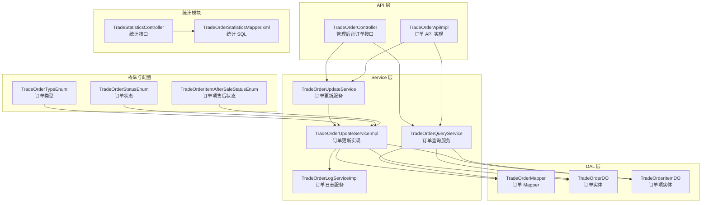
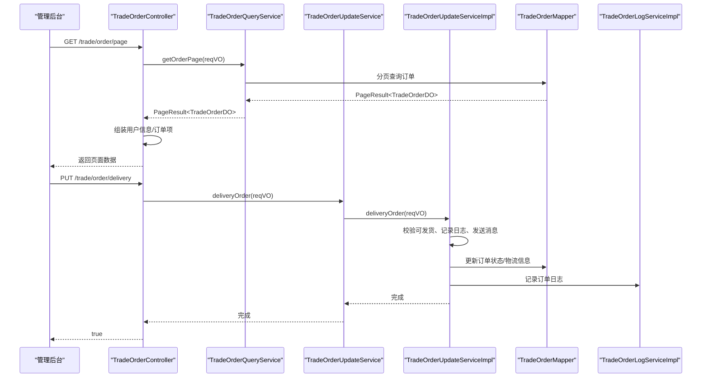
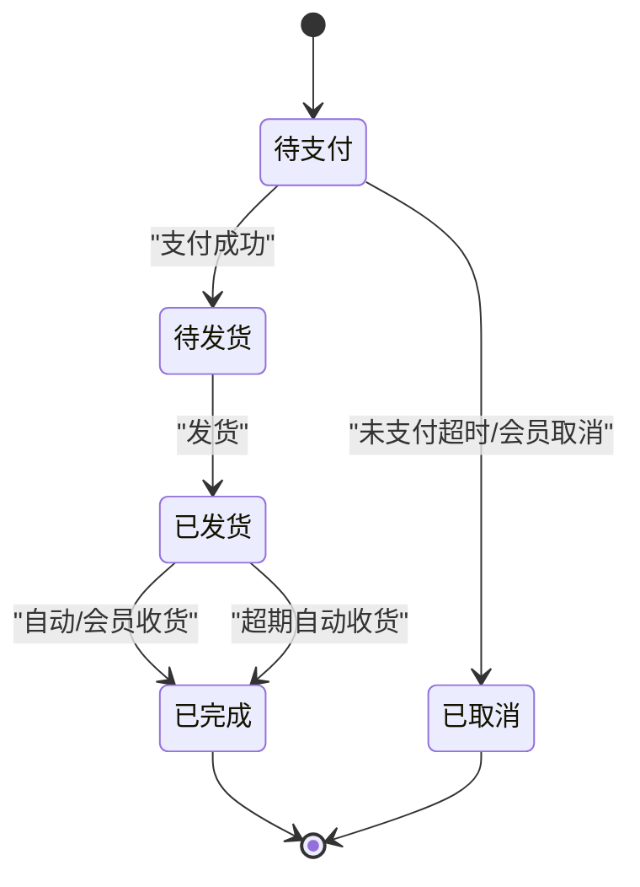
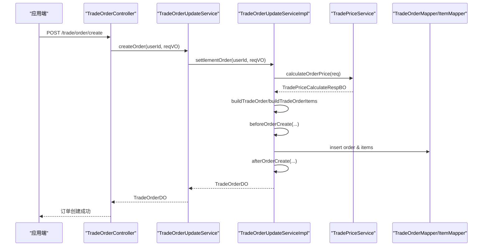
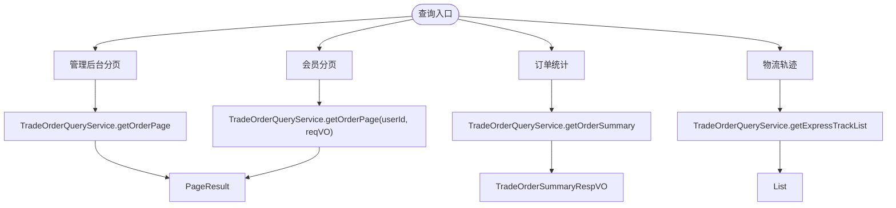
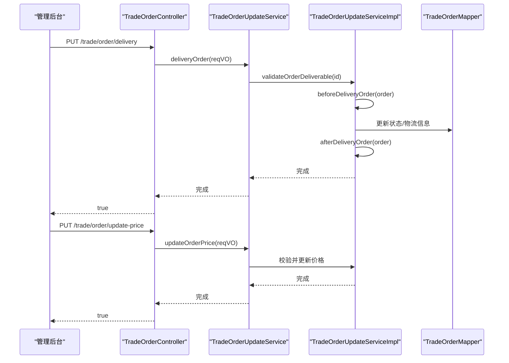
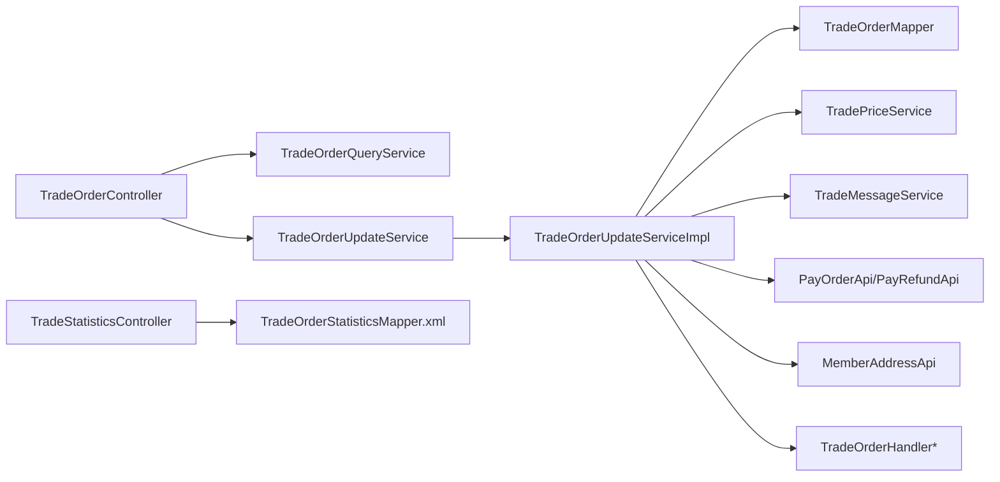

# 订单管理系统

<cite>
**本文引用的文件**
- [TradeOrderDO.java](file://yudao-module-mall/yudao-module-trade/src/main/java/cn/iocoder/yudao/module/trade/dal/dataobject/order/TradeOrderDO.java)
- [TradeOrderItemDO.java](file://yudao-module-mall/yudao-module-trade/src/main/java/cn/iocoder/yudao/module/trade/dal/dataobject/order/TradeOrderItemDO.java)
- [TradeOrderQueryService.java](file://yudao-module-mall/yudao-module-trade/src/main/java/cn/iocoder/yudao/module/trade/service/order/TradeOrderQueryService.java)
- [TradeOrderUpdateService.java](file://yudao-module-mall/yudao-module-trade/src/main/java/cn/iocoder/yudao/module/trade/service/order/TradeOrderUpdateService.java)
- [TradeOrderUpdateServiceImpl.java](file://yudao-module-mall/yudao-module-trade/src/main/java/cn/iocoder/yudao/module/trade/service/order/TradeOrderUpdateServiceImpl.java)
- [TradeOrderController.java](file://yudao-module-mall/yudao-module-trade/src/main/java/cn/iocoder/yudao/module/trade/controller/admin/order/TradeOrderController.java)
- [TradeOrderApiImpl.java](file://yudao-module-mall/yudao-module-trade/src/main/java/cn/iocoder/yudao/module/trade/api/order/TradeOrderApiImpl.java)
- [TradeOrderMapper.java](file://yudao-module-mall/yudao-module-trade/src/main/java/cn/iocoder/yudao/module/trade/dal/mysql/order/TradeOrderMapper.java)
- [TradeOrderLogServiceImpl.java](file://yudao-module-mall/yudao-module-trade/src/main/java/cn/iocoder/yudao/module/trade/service/order/TradeOrderLogServiceImpl.java)
- [TradeOrderTypeEnum.java](file://yudao-module-mall/yudao-module-trade-api/src/main/java/cn/iocoder/yudao/module/trade/enums/order/TradeOrderTypeEnum.java)
- [TradeOrderStatusEnum.java](file://yudao-module-mall/yudao-module-trade-api/src/main/java/cn/iocoder/yudao/module/trade/enums/order/TradeOrderStatusEnum.java)
- [TradeOrderItemAfterSaleStatusEnum.java](file://yudao-module-mall/yudao-module-trade-api/src/main/java/cn/iocoder/yudao/module/trade/enums/order/TradeOrderItemAfterSaleStatusEnum.java)
- [TradeOrderUpdatePriceReqVO.java](file://yudao-module-mall/yudao-module-trade/src/main/java/cn/iocoder/yudao/module/trade/controller/admin/order/vo/TradeOrderUpdatePriceReqVO.java)
- [TradePriceCalculateRespBO.java](file://yudao-module-mall/yudao-module-trade/src/main/java/cn/iocoder/yudao/module/trade/service/price/bo/TradePriceCalculateRespBO.java)
- [TradePriceCalculatorHelper.java](file://yudao-module-mall/yudao-module-trade/src/main/java/cn/iocoder/yudao/module/trade/service/price/calculator/TradePriceCalculatorHelper.java)
- [TradeStatisticsController.java](file://yudao-module-mall/yudao-module-statistics/src/main/java/cn/iocoder/yudao/module/statistics/controller/admin/trade/TradeStatisticsController.java)
- [TradeOrderStatisticsMapper.xml](file://yudao-module-mall/yudao-module-statistics/src/main/resources/mapper/trade/TradeOrderStatisticsMapper.xml)
</cite>

## 目录
1. [引言](#引言)
2. [项目结构](#项目结构)
3. [核心组件](#核心组件)
4. [架构总览](#架构总览)
5. [详细组件分析](#详细组件分析)
6. [依赖分析](#依赖分析)
7. [性能考虑](#性能考虑)
8. [故障排查指南](#故障排查指南)
9. [结论](#结论)
10. [附录](#附录)

## 引言
本文件面向订单管理系统，系统化梳理订单生命周期、数据模型、状态流转、价格计算、查询与统计、以及常见业务操作（修改、取消、发货、收货、核销、导出等）。目标是帮助研发与运营人员快速理解并正确使用订单能力。

## 项目结构
围绕“订单”主题，系统采用模块化分层：
- API 层：对外暴露订单查询与修改接口（控制器与 API 实现）
- Service 层：订单读写服务接口与实现，包含价格计算、发货、收货、取消、核销等业务编排
- DAL 层：订单与订单项的数据对象与 Mapper
- 枚举与配置：订单类型、状态、售后状态等常量定义
- 统计模块：提供订单统计与趋势查询能力

图表来源
- [TradeOrderController.java:1-170](file://yudao-module-mall/yudao-module-trade/src/main/java/cn/iocoder/yudao/module/trade/controller/admin/order/TradeOrderController.java#L1-L170)
- [TradeOrderApiImpl.java:1-43](file://yudao-module-mall/yudao-module-trade/src/main/java/cn/iocoder/yudao/module/trade/api/order/TradeOrderApiImpl.java#L1-L43)
- [TradeOrderQueryService.java:1-161](file://yudao-module-mall/yudao-module-trade/src/main/java/cn/iocoder/yudao/module/trade/service/order/TradeOrderQueryService.java#L1-L161)
- [TradeOrderUpdateService.java:1-230](file://yudao-module-mall/yudao-module-trade/src/main/java/cn/iocoder/yudao/module/trade/service/order/TradeOrderUpdateService.java#L1-L230)
- [TradeOrderUpdateServiceImpl.java:1-200](file://yudao-module-mall/yudao-module-trade/src/main/java/cn/iocoder/yudao/module/trade/service/order/TradeOrderUpdateServiceImpl.java#L1-L200)
- [TradeOrderMapper.java:1-30](file://yudao-module-mall/yudao-module-trade/src/main/java/cn/iocoder/yudao/module/trade/dal/mysql/order/TradeOrderMapper.java#L1-L30)
- [TradeOrderDO.java:1-364](file://yudao-module-mall/yudao-module-trade/src/main/java/cn/iocoder/yudao/module/trade/dal/dataobject/order/TradeOrderDO.java#L1-L364)
- [TradeOrderItemDO.java:1-212](file://yudao-module-mall/yudao-module-trade/src/main/java/cn/iocoder/yudao/module/trade/dal/dataobject/order/TradeOrderItemDO.java#L1-L212)
- [TradeOrderTypeEnum.java:1-62](file://yudao-module-mall/yudao-module-trade-api/src/main/java/cn/iocoder/yudao/module/trade/enums/order/TradeOrderTypeEnum.java#L1-L62)
- [TradeOrderStatusEnum.java:1-50](file://yudao-module-mall/yudao-module-trade-api/src/main/java/cn/iocoder/yudao/module/trade/enums/order/TradeOrderStatusEnum.java#L1-L50)
- [TradeOrderItemAfterSaleStatusEnum.java:1-49](file://yudao-module-mall/yudao-module-trade-api/src/main/java/cn/iocoder/yudao/module/trade/enums/order/TradeOrderItemAfterSaleStatusEnum.java#L1-L49)
- [TradeStatisticsController.java:96-117](file://yudao-module-mall/yudao-module-statistics/src/main/java/cn/iocoder/yudao/module/statistics/controller/admin/trade/TradeStatisticsController.java#L96-L117)
- [TradeOrderStatisticsMapper.xml:60-92](file://yudao-module-mall/yudao-module-statistics/src/main/resources/mapper/trade/TradeOrderStatisticsMapper.xml#L60-L92)

章节来源
- [TradeOrderController.java:1-170](file://yudao-module-mall/yudao-module-trade/src/main/java/cn/iocoder/yudao/module/trade/controller/admin/order/TradeOrderController.java#L1-L170)
- [TradeOrderApiImpl.java:1-43](file://yudao-module-mall/yudao-module-trade/src/main/java/cn/iocoder/yudao/module/trade/api/order/TradeOrderApiImpl.java#L1-L43)
- [TradeOrderQueryService.java:1-161](file://yudao-module-mall/yudao-module-trade/src/main/java/cn/iocoder/yudao/module/trade/service/order/TradeOrderQueryService.java#L1-L161)
- [TradeOrderUpdateService.java:1-230](file://yudao-module-mall/yudao-module-trade/src/main/java/cn/iocoder/yudao/module/trade/service/order/TradeOrderUpdateService.java#L1-L230)
- [TradeOrderUpdateServiceImpl.java:1-200](file://yudao-module-mall/yudao-module-trade/src/main/java/cn/iocoder/yudao/module/trade/service/order/TradeOrderUpdateServiceImpl.java#L1-L200)
- [TradeOrderMapper.java:1-30](file://yudao-module-mall/yudao-module-trade/src/main/java/cn/iocoder/yudao/module/trade/dal/mysql/order/TradeOrderMapper.java#L1-L30)
- [TradeOrderDO.java:1-364](file://yudao-module-mall/yudao-module-trade/src/main/java/cn/iocoder/yudao/module/trade/dal/dataobject/order/TradeOrderDO.java#L1-L364)
- [TradeOrderItemDO.java:1-212](file://yudao-module-mall/yudao-module-trade/src/main/java/cn/iocoder/yudao/module/trade/dal/dataobject/order/TradeOrderItemDO.java#L1-L212)
- [TradeOrderTypeEnum.java:1-62](file://yudao-module-mall/yudao-module-trade-api/src/main/java/cn/iocoder/yudao/module/trade/enums/order/TradeOrderTypeEnum.java#L1-L62)
- [TradeOrderStatusEnum.java:1-50](file://yudao-module-mall/yudao-module-trade-api/src/main/java/cn/iocoder/yudao/module/trade/enums/order/TradeOrderStatusEnum.java#L1-L50)
- [TradeOrderItemAfterSaleStatusEnum.java:1-49](file://yudao-module-mall/yudao-module-trade-api/src/main/java/cn/iocoder/yudao/module/trade/enums/order/TradeOrderItemAfterSaleStatusEnum.java#L1-L49)
- [TradeStatisticsController.java:96-117](file://yudao-module-mall/yudao-module-statistics/src/main/java/cn/iocoder/yudao/module/statistics/controller/admin/trade/TradeStatisticsController.java#L96-L117)
- [TradeOrderStatisticsMapper.xml:60-92](file://yudao-module-mall/yudao-module-statistics/src/main/resources/mapper/trade/TradeOrderStatisticsMapper.xml#L60-L92)

## 核心组件
- 订单实体与订单项实体：承载订单基本信息、价格明细、营销信息、售后状态等
- 订单查询服务：提供分页、统计、物流轨迹、订单项查询等
- 订单更新服务：提供结算、创建、支付同步、发货、收货、取消、核销、改价、改地址等
- 控制器与 API：对外暴露管理后台与应用端接口
- 枚举：订单类型、状态、售后状态等统一定义
- 统计模块：提供订单数量与趋势统计

章节来源
- [TradeOrderDO.java:1-364](file://yudao-module-mall/yudao-module-trade/src/main/java/cn/iocoder/yudao/module/trade/dal/dataobject/order/TradeOrderDO.java#L1-L364)
- [TradeOrderItemDO.java:1-212](file://yudao-module-mall/yudao-module-trade/src/main/java/cn/iocoder/yudao/module/trade/dal/dataobject/order/TradeOrderItemDO.java#L1-L212)
- [TradeOrderQueryService.java:1-161](file://yudao-module-mall/yudao-module-trade/src/main/java/cn/iocoder/yudao/module/trade/service/order/TradeOrderQueryService.java#L1-L161)
- [TradeOrderUpdateService.java:1-230](file://yudao-module-mall/yudao-module-trade/src/main/java/cn/iocoder/yudao/module/trade/service/order/TradeOrderUpdateService.java#L1-L230)
- [TradeOrderController.java:1-170](file://yudao-module-mall/yudao-module-trade/src/main/java/cn/iocoder/yudao/module/trade/controller/admin/order/TradeOrderController.java#L1-L170)
- [TradeOrderApiImpl.java:1-43](file://yudao-module-mall/yudao-module-trade/src/main/java/cn/iocoder/yudao/module/trade/api/order/TradeOrderApiImpl.java#L1-L43)
- [TradeOrderTypeEnum.java:1-62](file://yudao-module-mall/yudao-module-trade-api/src/main/java/cn/iocoder/yudao/module/trade/enums/order/TradeOrderTypeEnum.java#L1-L62)
- [TradeOrderStatusEnum.java:1-50](file://yudao-module-mall/yudao-module-trade-api/src/main/java/cn/iocoder/yudao/module/trade/enums/order/TradeOrderStatusEnum.java#L1-L50)
- [TradeOrderItemAfterSaleStatusEnum.java:1-49](file://yudao-module-mall/yudao-module-trade-api/src/main/java/cn/iocoder/yudao/module/trade/enums/order/TradeOrderItemAfterSaleStatusEnum.java#L1-L49)

## 架构总览
订单系统遵循“接口-服务-数据访问”的分层架构，控制器负责请求编排与权限控制，服务层负责业务编排与事务边界，数据访问层负责持久化与查询。

图表来源
- [TradeOrderController.java:52-116](file://yudao-module-mall/yudao-module-trade/src/main/java/cn/iocoder/yudao/module/trade/controller/admin/order/TradeOrderController.java#L52-L116)
- [TradeOrderUpdateService.java:63-68](file://yudao-module-mall/yudao-module-trade/src/main/java/cn/iocoder/yudao/module/trade/service/order/TradeOrderUpdateService.java#L63-L68)
- [TradeOrderUpdateServiceImpl.java:400-431](file://yudao-module-mall/yudao-module-trade/src/main/java/cn/iocoder/yudao/module/trade/service/order/TradeOrderUpdateServiceImpl.java#L400-L431)
- [TradeOrderMapper.java:20-30](file://yudao-module-mall/yudao-module-trade/src/main/java/cn/iocoder/yudao/module/trade/dal/mysql/order/TradeOrderMapper.java#L20-L30)
- [TradeOrderLogServiceImpl.java:24-34](file://yudao-module-mall/yudao-module-trade/src/main/java/cn/iocoder/yudao/module/trade/service/order/TradeOrderLogServiceImpl.java#L24-L34)

## 详细组件分析

### 数据模型与字段定义
- 订单基本信息：订单编号、流水号、类型、来源、用户、状态、备注、完成/取消时间、取消类型、推广人等
- 价格与支付：应付金额、支付单号、支付状态、支付渠道、支付时间、各优惠与抵扣
- 物流与收货：配送方式、快递公司与单号、发货/收货时间、收件人信息、自提核销码
- 售后：售后状态、退款金额
- 营销：优惠券、积分、VIP 抵扣、赠送优惠券与积分
- 订单项：SPU/SKU、属性、图片、数量、单价、应付、优惠、积分、售后状态等

```mermaid
erDiagram
TRADE_ORDER {
bigint id PK
string no UK
int type
int terminal
bigint user_id
string user_ip
string user_remark
int status
int product_count
datetime finish_time
datetime cancel_time
int cancel_type
string remark
boolean comment_status
bigint brokerage_user_id
bigint pay_order_id
boolean pay_status
datetime pay_time
string pay_channel_code
int total_price
int discount_price
int delivery_price
int adjust_price
int pay_price
int delivery_type
bigint logistics_id
string logistics_no
datetime delivery_time
datetime receive_time
string receiver_name
string receiver_mobile
int receiver_area_id
string receiver_detail_address
bigint pick_up_store_id
string pick_up_verify_code
int refund_status
int refund_price
bigint coupon_id
int coupon_price
int use_point
int point_price
int give_point
int refund_point
int vip_price
json give_coupon_template_counts
long_list give_coupon_ids
bigint seckill_activity_id
bigint bargain_activity_id
bigint bargain_record_id
bigint combination_activity_id
bigint combination_head_id
bigint combination_record_id
bigint point_activity_id
}
TRADE_ORDER_ITEM {
bigint id PK
bigint user_id
bigint order_id FK
bigint cart_id
bigint spu_id
string spu_name
bigint sku_id
json properties
string pic_url
int count
boolean comment_status
int price
int discount_price
int delivery_price
int adjust_price
int pay_price
int coupon_price
int point_price
int use_point
int give_point
int vip_price
bigint after_sale_id
int after_sale_status
}
TRADE_ORDER ||--o{ TRADE_ORDER_ITEM : "包含"
```

图表来源
- [TradeOrderDO.java:45-364](file://yudao-module-mall/yudao-module-trade/src/main/java/cn/iocoder/yudao/module/trade/dal/dataobject/order/TradeOrderDO.java#L45-L364)
- [TradeOrderItemDO.java:26-212](file://yudao-module-mall/yudao-module-trade/src/main/java/cn/iocoder/yudao/module/trade/dal/dataobject/order/TradeOrderItemDO.java#L26-L212)

章节来源
- [TradeOrderDO.java:45-364](file://yudao-module-mall/yudao-module-trade/src/main/java/cn/iocoder/yudao/module/trade/dal/dataobject/order/TradeOrderDO.java#L45-L364)
- [TradeOrderItemDO.java:26-212](file://yudao-module-mall/yudao-module-trade/src/main/java/cn/iocoder/yudao/module/trade/dal/dataobject/order/TradeOrderItemDO.java#L26-L212)

### 订单生命周期与状态流转
- 状态枚举：待支付、待发货、已发货、已完成、已取消
- 关键流转：
  - 创建订单后进入“待支付”
  - 支付成功后进入“待发货”
  - 发货后进入“已发货”
  - 自动/手动收货后进入“已完成”
  - 在特定条件下可取消（如未支付超时或会员取消）

图表来源
- [TradeOrderStatusEnum.java:18-25](file://yudao-module-mall/yudao-module-trade-api/src/main/java/cn/iocoder/yudao/module/trade/enums/order/TradeOrderStatusEnum.java#L18-L25)
- [TradeOrderUpdateServiceImpl.java:474-528](file://yudao-module-mall/yudao-module-trade/src/main/java/cn/iocoder/yudao/module/trade/service/order/TradeOrderUpdateServiceImpl.java#L474-L528)
- [TradeOrderUpdateServiceImpl.java:578-599](file://yudao-module-mall/yudao-module-trade/src/main/java/cn/iocoder/yudao/module/trade/service/order/TradeOrderUpdateServiceImpl.java#L578-L599)

章节来源
- [TradeOrderStatusEnum.java:18-25](file://yudao-module-mall/yudao-module-trade-api/src/main/java/cn/iocoder/yudao/module/trade/enums/order/TradeOrderStatusEnum.java#L18-L25)
- [TradeOrderUpdateServiceImpl.java:474-528](file://yudao-module-mall/yudao-module-trade/src/main/java/cn/iocoder/yudao/module/trade/service/order/TradeOrderUpdateServiceImpl.java#L474-L528)
- [TradeOrderUpdateServiceImpl.java:578-599](file://yudao-module-mall/yudao-module-trade/src/main/java/cn/iocoder/yudao/module/trade/service/order/TradeOrderUpdateServiceImpl.java#L578-L599)

### 订单创建与价格计算
- 结算流程：选择地址、计算价格、构建订单与订单项
- 价格计算响应包含订单类型、价格汇总、订单项明细、营销活动明细、优惠券等
- 订单创建前会触发订单处理器的前置逻辑，创建后插入订单与订单项，并执行后置逻辑

图表来源
- [TradeOrderController.java:80-99](file://yudao-module-mall/yudao-module-trade/src/main/java/cn/iocoder/yudao/module/trade/controller/admin/order/TradeOrderController.java#L80-L99)
- [TradeOrderUpdateService.java:35-42](file://yudao-module-mall/yudao-module-trade/src/main/java/cn/iocoder/yudao/module/trade/service/order/TradeOrderUpdateService.java#L35-L42)
- [TradeOrderUpdateServiceImpl.java:135-200](file://yudao-module-mall/yudao-module-trade/src/main/java/cn/iocoder/yudao/module/trade/service/order/TradeOrderUpdateServiceImpl.java#L135-L200)
- [TradePriceCalculateRespBO.java:12-54](file://yudao-module-mall/yudao-module-trade/src/main/java/cn/iocoder/yudao/module/trade/service/price/bo/TradePriceCalculateRespBO.java#L12-L54)
- [TradePriceCalculatorHelper.java:296-318](file://yudao-module-mall/yudao-module-trade/src/main/java/cn/iocoder/yudao/module/trade/service/price/calculator/TradePriceCalculatorHelper.java#L296-L318)

章节来源
- [TradeOrderUpdateServiceImpl.java:135-200](file://yudao-module-mall/yudao-module-trade/src/main/java/cn/iocoder/yudao/module/trade/service/order/TradeOrderUpdateServiceImpl.java#L135-L200)
- [TradePriceCalculateRespBO.java:12-54](file://yudao-module-mall/yudao-module-trade/src/main/java/cn/iocoder/yudao/module/trade/service/price/bo/TradePriceCalculateRespBO.java#L12-L54)
- [TradePriceCalculatorHelper.java:296-318](file://yudao-module-mall/yudao-module-trade/src/main/java/cn/iocoder/yudao/module/trade/service/price/calculator/TradePriceCalculatorHelper.java#L296-L318)

### 订单查询与统计
- 分页查询：支持管理员与会员分页，支持统计与汇总
- 物流轨迹：提供前台与后台两种查询入口
- 统计模块：提供待发货、自提待核销、售后申请等统计

图表来源
- [TradeOrderQueryService.java:62-121](file://yudao-module-mall/yudao-module-trade/src/main/java/cn/iocoder/yudao/module/trade/service/order/TradeOrderQueryService.java#L62-L121)
- [TradeStatisticsController.java:96-117](file://yudao-module-mall/yudao-module-statistics/src/main/java/cn/iocoder/yudao/module/statistics/controller/admin/trade/TradeStatisticsController.java#L96-L117)
- [TradeOrderStatisticsMapper.xml:60-92](file://yudao-module-mall/yudao-module-statistics/src/main/resources/mapper/trade/TradeOrderStatisticsMapper.xml#L60-L92)

章节来源
- [TradeOrderQueryService.java:62-121](file://yudao-module-mall/yudao-module-trade/src/main/java/cn/iocoder/yudao/module/trade/service/order/TradeOrderQueryService.java#L62-L121)
- [TradeStatisticsController.java:96-117](file://yudao-module-mall/yudao-module-statistics/src/main/java/cn/iocoder/yudao/module/statistics/controller/admin/trade/TradeStatisticsController.java#L96-L117)
- [TradeOrderStatisticsMapper.xml:60-92](file://yudao-module-mall/yudao-module-statistics/src/main/resources/mapper/trade/TradeOrderStatisticsMapper.xml#L60-L92)

### 订单操作：发货、收货、取消、核销、改价/地址
- 发货：校验订单可发货、记录日志、发送消息、更新物流与状态
- 收货：校验订单可收货、原子更新状态与收货时间、记录日志、执行后置处理
- 取消：校验未支付且允许取消、必要时检查支付回调延迟、执行取消
- 核销：支持按订单号或核销码核销
- 改价/改地址：管理员操作，更新订单价格与收货地址

图表来源
- [TradeOrderController.java:110-140](file://yudao-module-mall/yudao-module-trade/src/main/java/cn/iocoder/yudao/module/trade/controller/admin/order/TradeOrderController.java#L110-L140)
- [TradeOrderUpdateService.java:63-127](file://yudao-module-mall/yudao-module-trade/src/main/java/cn/iocoder/yudao/module/trade/service/order/TradeOrderUpdateService.java#L63-L127)
- [TradeOrderUpdateServiceImpl.java:433-451](file://yudao-module-mall/yudao-module-trade/src/main/java/cn/iocoder/yudao/module/trade/service/order/TradeOrderUpdateServiceImpl.java#L433-L451)
- [TradeOrderUpdateServiceImpl.java:126-127](file://yudao-module-mall/yudao-module-trade/src/main/java/cn/iocoder/yudao/module/trade/service/order/TradeOrderUpdateServiceImpl.java#L126-L127)
- [TradeOrderUpdatePriceReqVO.java:1-20](file://yudao-module-mall/yudao-module-trade/src/main/java/cn/iocoder/yudao/module/trade/controller/admin/order/vo/TradeOrderUpdatePriceReqVO.java#L1-L20)

章节来源
- [TradeOrderController.java:110-140](file://yudao-module-mall/yudao-module-trade/src/main/java/cn/iocoder/yudao/module/trade/controller/admin/order/TradeOrderController.java#L110-L140)
- [TradeOrderUpdateService.java:63-127](file://yudao-module-mall/yudao-module-trade/src/main/java/cn/iocoder/yudao/module/trade/service/order/TradeOrderUpdateService.java#L63-L127)
- [TradeOrderUpdateServiceImpl.java:433-451](file://yudao-module-mall/yudao-module-trade/src/main/java/cn/iocoder/yudao/module/trade/service/order/TradeOrderUpdateServiceImpl.java#L433-L451)
- [TradeOrderUpdateServiceImpl.java:126-127](file://yudao-module-mall/yudao-module-trade/src/main/java/cn/iocoder/yudao/module/trade/service/order/TradeOrderUpdateServiceImpl.java#L126-L127)
- [TradeOrderUpdatePriceReqVO.java:1-20](file://yudao-module-mall/yudao-module-trade/src/main/java/cn/iocoder/yudao/module/trade/controller/admin/order/vo/TradeOrderUpdatePriceReqVO.java#L1-L20)

### 订单状态变更规则与业务约束
- 发货：必须处于“待发货”状态，且售后状态为“未售后”
- 收货：仅“已发货”状态可收货，系统自动收货基于到期时间判定
- 取消：仅“待支付”可取消；若支付回调延迟导致已支付，需拒绝取消
- 核销：支持按订单号或核销码核销

章节来源
- [TradeOrderUpdateServiceImpl.java:441-451](file://yudao-module-mall/yudao-module-trade/src/main/java/cn/iocoder/yudao/module/trade/service/order/TradeOrderUpdateServiceImpl.java#L441-L451)
- [TradeOrderUpdateServiceImpl.java:539-550](file://yudao-module-mall/yudao-module-trade/src/main/java/cn/iocoder/yudao/module/trade/service/order/TradeOrderUpdateServiceImpl.java#L539-L550)
- [TradeOrderUpdateServiceImpl.java:552-576](file://yudao-module-mall/yudao-module-trade/src/main/java/cn/iocoder/yudao/module/trade/service/order/TradeOrderUpdateServiceImpl.java#L552-L576)

### 订单数据模型与价格明细
- 价格计算响应包含：订单类型、价格汇总、订单项明细、营销活动明细、优惠券等
- 订单与订单项均包含应付金额、优惠、积分、VIP 抵扣、运费、调价等字段

章节来源
- [TradePriceCalculateRespBO.java:12-54](file://yudao-module-mall/yudao-module-trade/src/main/java/cn/iocoder/yudao/module/trade/service/price/bo/TradePriceCalculateRespBO.java#L12-L54)
- [TradeOrderDO.java:125-190](file://yudao-module-mall/yudao-module-trade/src/main/java/cn/iocoder/yudao/module/trade/dal/dataobject/order/TradeOrderDO.java#L125-L190)
- [TradeOrderItemDO.java:92-128](file://yudao-module-mall/yudao-module-trade/src/main/java/cn/iocoder/yudao/module/trade/dal/dataobject/order/TradeOrderItemDO.java#L92-L128)

## 依赖分析
- 控制器依赖查询与更新服务，更新实现依赖 Mapper、价格服务、消息服务、支付与地址等外部接口
- 订单与订单项通过外键关联，价格计算与营销活动明细在价格计算响应中体现
- 统计模块通过 SQL 聚合查询订单数量与金额

图表来源
- [TradeOrderController.java:42-47](file://yudao-module-mall/yudao-module-trade/src/main/java/cn/iocoder/yudao/module/trade/controller/admin/order/TradeOrderController.java#L42-L47)
- [TradeOrderUpdateServiceImpl.java:96-131](file://yudao-module-mall/yudao-module-trade/src/main/java/cn/iocoder/yudao/module/trade/service/order/TradeOrderUpdateServiceImpl.java#L96-L131)
- [TradeStatisticsController.java:96-117](file://yudao-module-mall/yudao-module-statistics/src/main/java/cn/iocoder/yudao/module/statistics/controller/admin/trade/TradeStatisticsController.java#L96-L117)
- [TradeOrderStatisticsMapper.xml:60-92](file://yudao-module-mall/yudao-module-statistics/src/main/resources/mapper/trade/TradeOrderStatisticsMapper.xml#L60-L92)

章节来源
- [TradeOrderController.java:42-47](file://yudao-module-mall/yudao-module-trade/src/main/java/cn/iocoder/yudao/module/trade/controller/admin/order/TradeOrderController.java#L42-L47)
- [TradeOrderUpdateServiceImpl.java:96-131](file://yudao-module-mall/yudao-module-trade/src/main/java/cn/iocoder/yudao/module/trade/service/order/TradeOrderUpdateServiceImpl.java#L96-L131)
- [TradeStatisticsController.java:96-117](file://yudao-module-mall/yudao-module-statistics/src/main/java/cn/iocoder/yudao/module/statistics/controller/admin/trade/TradeStatisticsController.java#L96-L117)
- [TradeOrderStatisticsMapper.xml:60-92](file://yudao-module-mall/yudao-module-statistics/src/main/resources/mapper/trade/TradeOrderStatisticsMapper.xml#L60-L92)

## 性能考虑
- 分页查询：合理使用索引（如按状态、创建时间、用户 ID 等），避免全表扫描
- 价格计算：批量计算与缓存策略，减少重复计算
- 发货/收货：批量处理与异步消息，降低阻塞
- 统计查询：使用聚合索引与分区表，提升大跨度时间范围统计性能

## 故障排查指南
- 发货失败：检查订单是否处于“未售后”状态，确认前置处理器是否通过
- 收货失败：确认订单状态为“已发货”，系统自动收货基于到期时间判定
- 取消失败：确认订单仍为“待支付”，若支付回调延迟导致已支付则无法取消
- 日志定位：通过订单日志服务查询订单变更历史，辅助定位问题

章节来源
- [TradeOrderUpdateServiceImpl.java:441-451](file://yudao-module-mall/yudao-module-trade/src/main/java/cn/iocoder/yudao/module/trade/service/order/TradeOrderUpdateServiceImpl.java#L441-L451)
- [TradeOrderUpdateServiceImpl.java:539-550](file://yudao-module-mall/yudao-module-trade/src/main/java/cn/iocoder/yudao/module/trade/service/order/TradeOrderUpdateServiceImpl.java#L539-L550)
- [TradeOrderUpdateServiceImpl.java:552-576](file://yudao-module-mall/yudao-module-trade/src/main/java/cn/iocoder/yudao/module/trade/service/order/TradeOrderUpdateServiceImpl.java#L552-L576)
- [TradeOrderLogServiceImpl.java:24-34](file://yudao-module-mall/yudao-module-trade/src/main/java/cn/iocoder/yudao/module/trade/service/order/TradeOrderLogServiceImpl.java#L24-L34)

## 结论
订单系统以清晰的分层与完善的枚举定义为基础，覆盖从创建到完成的全生命周期管理，并提供查询、统计与多种操作能力。遵循状态机约束与业务规则，结合异步与批量处理，可在高并发场景下保持稳定与高效。

## 附录
- 订单类型：普通、秒杀、砍价、拼团、积分商城
- 订单状态：待支付、待发货、已发货、已完成、已取消
- 订单项售后状态：未售后、售后中、售后成功

章节来源
- [TradeOrderTypeEnum.java:17-26](file://yudao-module-mall/yudao-module-trade-api/src/main/java/cn/iocoder/yudao/module/trade/enums/order/TradeOrderTypeEnum.java#L17-L26)
- [TradeOrderStatusEnum.java:18-26](file://yudao-module-mall/yudao-module-trade-api/src/main/java/cn/iocoder/yudao/module/trade/enums/order/TradeOrderStatusEnum.java#L18-L26)
- [TradeOrderItemAfterSaleStatusEnum.java:17-23](file://yudao-module-mall/yudao-module-trade-api/src/main/java/cn/iocoder/yudao/module/trade/enums/order/TradeOrderItemAfterSaleStatusEnum.java#L17-L23)