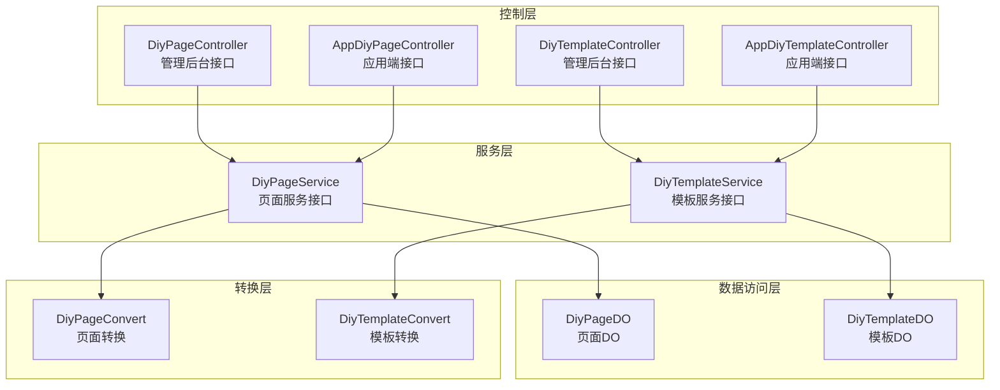
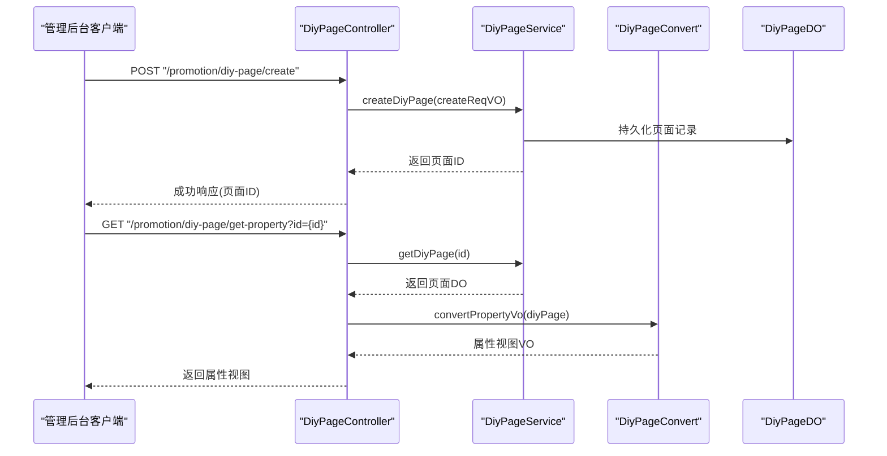
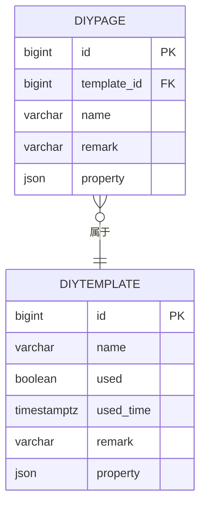
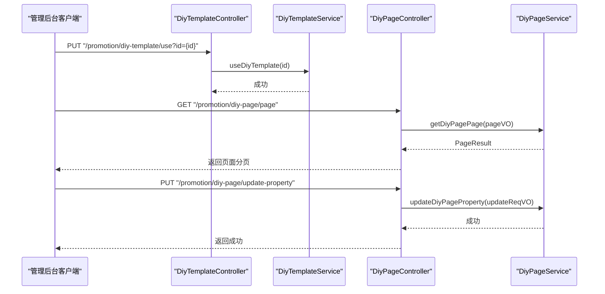
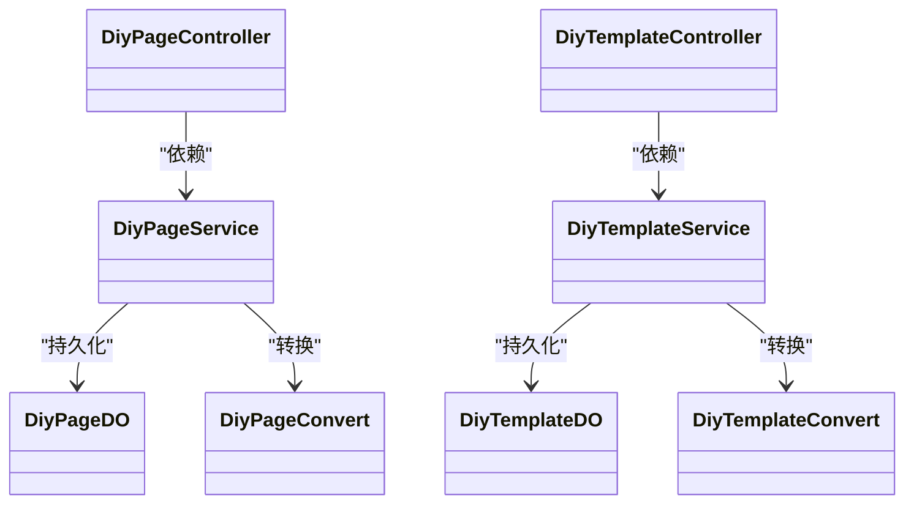
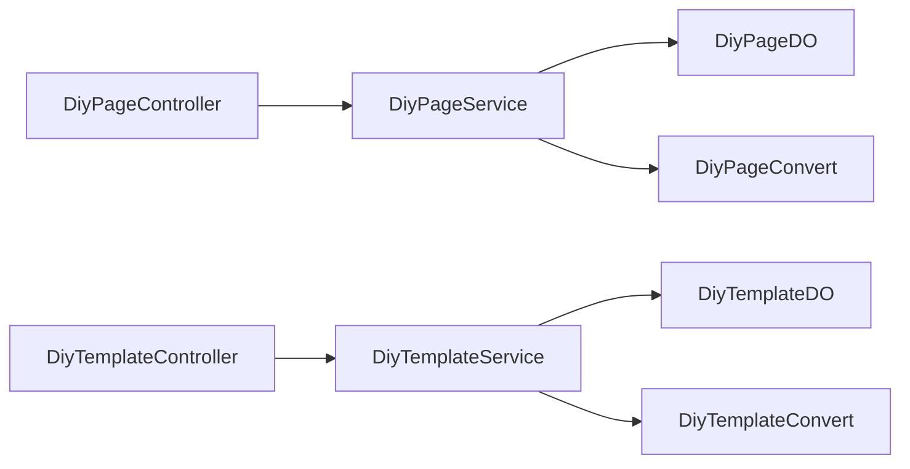

# DIY组件管理

<cite>
**本文引用的文件**
- [DiyPageController.java](file://yudao-module-mall/yudao-module-promotion/src/main/java/cn/iocoder/yudao/module/promotion/controller/admin/diy/DiyPageController.java)
- [DiyTemplateController.java](file://yudao-module-mall/yudao-module-promotion/src/main/java/cn/iocoder/yudao/module/promotion/controller/admin/diy/DiyTemplateController.java)
- [DiyPageDO.java](file://yudao-module-mall/yudao-module-promotion/src/main/java/cn/iocoder/yudao/module/promotion/dal/dataobject/diy/DiyPageDO.java)
- [DiyTemplateDO.java](file://yudao-module-mall/yudao-module-promotion/src/main/java/cn/iocoder/yudao/module/promotion/dal/dataobject/diy/DiyTemplateDO.java)
- [DiyPageService.java](file://yudao-module-mall/yudao-module-promotion/src/main/java/cn/iocoder/yudao/module/promotion/service/diy/DiyPageService.java)
- [DiyTemplateService.java](file://yudao-module-mall/yudao-module-promotion/src/main/java/cn/iocoder/yudao/module/promotion/service/diy/DiyTemplateService.java)
- [DiyPageConvert.java](file://yudao-module-mall/yudao-module-promotion/src/main/java/cn/iocoder/yudao/module/promotion/convert/diy/DiyPageConvert.java)
- [DiyTemplateConvert.java](file://yudao-module-mall/yudao-module-promotion/src/main/java/cn/iocoder/yudao/module/promotion/convert/diy/DiyTemplateConvert.java)
- [AppDiyPageController.java](file://yudao-module-mall/yudao-module-promotion/src/main/java/cn/iocoder/yudao/module/promotion/controller/app/diy/AppDiyPageController.java)
- [AppDiyTemplateController.java](file://yudao-module-mall/yudao-module-promotion/src/main/java/cn/iocoder/yudao/module/promotion/controller/app/diy/AppDiyTemplateController.java)
- [DiyPageServiceImplTest.java](file://yudao-module-mall/yudao-module-promotion/src/test/java/cn/iocoder/yudao/module/promotion/service/diy/DiyPageServiceImplTest.java)
</cite>

## 目录
1. [简介](#简介)
2. [项目结构](#项目结构)
3. [核心组件](#核心组件)
4. [架构总览](#架构总览)
5. [详细组件分析](#详细组件分析)
6. [依赖分析](#依赖分析)
7. [性能考虑](#性能考虑)
8. [故障排查指南](#故障排查指南)
9. [结论](#结论)
10. [附录](#附录)

## 简介
本文件面向DIY组件管理功能，系统性梳理自定义组件系统的业务架构与实现原理，覆盖组件的创建、配置、属性管理、页面与模板关联、以及前后端交互流程。文档同时给出数据模型设计、业务规则（如唯一使用模板、属性JSON化存储）、组件类型与可视化编辑体验的落地建议，并提供模板库与使用示例思路及扩展机制与性能优化策略。

## 项目结构
DIY组件管理位于“营销模块”下的“装修页面/模板”子域，采用经典的分层架构：
- 控制层：Admin与App双端控制器，分别暴露管理后台与应用端接口
- 服务层：页面与模板的服务接口与实现
- 数据访问层：基于MyBatis-Plus的DO实体与类型处理器
- 转换层：MapStruct映射VO/DO

图表来源
- [DiyPageController.java:1-100](file://yudao-module-mall/yudao-module-promotion/src/main/java/cn/iocoder/yudao/module/promotion/controller/admin/diy/DiyPageController.java#L1-L100)
- [DiyTemplateController.java:1-106](file://yudao-module-mall/yudao-module-promotion/src/main/java/cn/iocoder/yudao/module/promotion/controller/admin/diy/DiyTemplateController.java#L1-L106)
- [DiyPageService.java:1-83](file://yudao-module-mall/yudao-module-promotion/src/main/java/cn/iocoder/yudao/module/promotion/service/diy/DiyPageService.java#L1-L83)
- [DiyTemplateService.java:1-79](file://yudao-module-mall/yudao-module-promotion/src/main/java/cn/iocoder/yudao/module/promotion/service/diy/DiyTemplateService.java#L1-L79)
- [DiyPageDO.java:1-58](file://yudao-module-mall/yudao-module-promotion/src/main/java/cn/iocoder/yudao/module/promotion/dal/dataobject/diy/DiyPageDO.java#L1-L58)
- [DiyTemplateDO.java:1-65](file://yudao-module-mall/yudao-module-promotion/src/main/java/cn/iocoder/yudao/module/promotion/dal/dataobject/diy/DiyTemplateDO.java#L1-L65)
- [DiyPageConvert.java:1-38](file://yudao-module-mall/yudao-module-promotion/src/main/java/cn/iocoder/yudao/module/promotion/convert/diy/DiyPageConvert.java#L1-L38)
- [DiyTemplateConvert.java:1-40](file://yudao-module-mall/yudao-module-promotion/src/main/java/cn/iocoder/yudao/module/promotion/convert/diy/DiyTemplateConvert.java#L1-L40)

章节来源
- [DiyPageController.java:1-100](file://yudao-module-mall/yudao-module-promotion/src/main/java/cn/iocoder/yudao/module/promotion/controller/admin/diy/DiyPageController.java#L1-L100)
- [DiyTemplateController.java:1-106](file://yudao-module-mall/yudao-module-promotion/src/main/java/cn/iocoder/yudao/module/promotion/controller/admin/diy/DiyTemplateController.java#L1-L106)

## 核心组件
- 页面控制器：提供页面的增删改查、分页、属性获取与更新等接口
- 模板控制器：提供模板的增删改查、分页、使用、属性获取与更新等接口
- 页面服务：封装页面的CRUD、分页、属性更新、按模板查询页面等业务
- 模板服务：封装模板的CRUD、分页、使用标记、属性更新、查询使用中模板等业务
- 数据对象：页面与模板的持久化实体，包含基础字段、备注、预览图、属性JSON等
- 转换器：负责VO与DO之间的映射，以及属性视图对象的转换

章节来源
- [DiyPageController.java:1-100](file://yudao-module-mall/yudao-module-promotion/src/main/java/cn/iocoder/yudao/module/promotion/controller/admin/diy/DiyPageController.java#L1-L100)
- [DiyTemplateController.java:1-106](file://yudao-module-mall/yudao-module-promotion/src/main/java/cn/iocoder/yudao/module/promotion/controller/admin/diy/DiyTemplateController.java#L1-L106)
- [DiyPageService.java:1-83](file://yudao-module-mall/yudao-module-promotion/src/main/java/cn/iocoder/yudao/module/promotion/service/diy/DiyPageService.java#L1-L83)
- [DiyTemplateService.java:1-79](file://yudao-module-mall/yudao-module-promotion/src/main/java/cn/iocoder/yudao/module/promotion/service/diy/DiyTemplateService.java#L1-L79)
- [DiyPageDO.java:1-58](file://yudao-module-mall/yudao-module-promotion/src/main/java/cn/iocoder/yudao/module/promotion/dal/dataobject/diy/DiyPageDO.java#L1-L58)
- [DiyTemplateDO.java:1-65](file://yudao-module-mall/yudao-module-promotion/src/main/java/cn/iocoder/yudao/module/promotion/dal/dataobject/diy/DiyTemplateDO.java#L1-L65)
- [DiyPageConvert.java:1-38](file://yudao-module-mall/yudao-module-promotion/src/main/java/cn/iocoder/yudao/module/promotion/convert/diy/DiyPageConvert.java#L1-L38)
- [DiyTemplateConvert.java:1-40](file://yudao-module-mall/yudao-module-promotion/src/main/java/cn/iocoder/yudao/module/promotion/convert/diy/DiyTemplateConvert.java#L1-L40)

## 架构总览
DIY组件管理遵循“控制器-服务-数据访问-转换”的分层设计，Admin与App两端分别暴露不同维度的接口，页面与模板之间通过外键关联，属性以JSON字符串形式存储，便于灵活扩展。

图表来源
- [DiyPageController.java:32-97](file://yudao-module-mall/yudao-module-promotion/src/main/java/cn/iocoder/yudao/module/promotion/controller/admin/diy/DiyPageController.java#L32-L97)
- [DiyPageService.java:19-82](file://yudao-module-mall/yudao-module-promotion/src/main/java/cn/iocoder/yudao/module/promotion/service/diy/DiyPageService.java#L19-L82)
- [DiyPageConvert.java:31-35](file://yudao-module-mall/yudao-module-promotion/src/main/java/cn/iocoder/yudao/module/promotion/convert/diy/DiyPageConvert.java#L31-L35)
- [DiyPageDO.java:26-57](file://yudao-module-mall/yudao-module-promotion/src/main/java/cn/iocoder/yudao/module/promotion/dal/dataobject/diy/DiyPageDO.java#L26-L57)

## 详细组件分析

### 数据模型设计
- 页面实体（DiyPageDO）
  - 关键字段：主键、模板ID、名称、备注、预览图数组、页面属性JSON
  - 关系：属于某个模板（templateId → DiyTemplateDO.id）
  - 存储：预览图采用字符串列表类型处理器，属性采用JSON字符串存储
- 模板实体（DiyTemplateDO）
  - 关键字段：主键、名称、是否使用、使用时间、备注、预览图数组、模板属性JSON
  - 关系：可包含多个页面（一对多）
  - 业务：同一时刻仅允许一个模板处于“使用中”

图表来源
- [DiyPageDO.java:26-57](file://yudao-module-mall/yudao-module-promotion/src/main/java/cn/iocoder/yudao/module/promotion/dal/dataobject/diy/DiyPageDO.java#L26-L57)
- [DiyTemplateDO.java:30-64](file://yudao-module-mall/yudao-module-promotion/src/main/java/cn/iocoder/yudao/module/promotion/dal/dataobject/diy/DiyTemplateDO.java#L30-L64)

章节来源
- [DiyPageDO.java:1-58](file://yudao-module-mall/yudao-module-promotion/src/main/java/cn/iocoder/yudao/module/promotion/dal/dataobject/diy/DiyPageDO.java#L1-L58)
- [DiyTemplateDO.java:1-65](file://yudao-module-mall/yudao-module-promotion/src/main/java/cn/iocoder/yudao/module/promotion/dal/dataobject/diy/DiyTemplateDO.java#L1-L65)

### 业务规则与约束
- 模板唯一使用：模板DO中提供“是否使用”字段，服务层需保证同一时刻仅有一个模板被标记为使用中
- 属性JSON化：页面与模板的属性均以JSON字符串存储，便于前端可视化编辑器扩展字段
- 预览图数组：支持多张预览图，便于模板库展示
- 页面与模板关联：页面通过templateId关联模板，支持按模板查询页面列表

章节来源
- [DiyTemplateDO.java:42-48](file://yudao-module-mall/yudao-module-promotion/src/main/java/cn/iocoder/yudao/module/promotion/dal/dataobject/diy/DiyTemplateDO.java#L42-L48)
- [DiyPageDO.java:34-38](file://yudao-module-mall/yudao-module-promotion/src/main/java/cn/iocoder/yudao/module/promotion/dal/dataobject/diy/DiyPageDO.java#L34-L38)

### 组件类型与可视化编辑器
- 组件类型：可在属性JSON中定义组件类型标识，如商品展示、活动入口、富文本、视频播放等
- 可视化编辑器：前端通过拖拽组件到画布，实时预览并保存属性JSON
- 属性配置：每个组件支持独立的配置参数与样式设置，统一以JSON结构存储
- 响应式适配：在属性JSON中增加设备维度或断点配置，后端不强制解析，由前端渲染器处理
- 版本管理：可通过模板的“使用时间”字段记录版本生效时间，或在属性中嵌入版本号字段

说明：以上为系统设计层面的建议与落地方式，具体组件类型与渲染器实现不在当前仓库范围内。

### 管理后台接口与流程
- 页面接口
  - 创建/更新/删除/分页/列表/详情
  - 属性获取与更新（独立接口）
- 模板接口
  - 创建/更新/删除/分页
  - 使用模板（置位“使用中”）
  - 属性获取与更新（独立接口）
  - 按模板查询页面列表

图表来源
- [DiyTemplateController.java:51-57](file://yudao-module-mall/yudao-module-promotion/src/main/java/cn/iocoder/yudao/module/promotion/controller/admin/diy/DiyTemplateController.java#L51-L57)
- [DiyTemplateController.java:77-83](file://yudao-module-mall/yudao-module-promotion/src/main/java/cn/iocoder/yudao/module/promotion/controller/admin/diy/DiyTemplateController.java#L77-L83)
- [DiyPageController.java:74-97](file://yudao-module-mall/yudao-module-promotion/src/main/java/cn/iocoder/yudao/module/promotion/controller/admin/diy/DiyPageController.java#L74-L97)

章节来源
- [DiyPageController.java:1-100](file://yudao-module-mall/yudao-module-promotion/src/main/java/cn/iocoder/yudao/module/promotion/controller/admin/diy/DiyPageController.java#L1-L100)
- [DiyTemplateController.java:1-106](file://yudao-module-mall/yudao-module-promotion/src/main/java/cn/iocoder/yudao/module/promotion/controller/admin/diy/DiyTemplateController.java#L1-L106)

### 应用端接口与使用
- 应用端控制器提供页面与模板的属性查询接口，供小程序/APP渲染使用
- 页面属性与模板属性均以JSON返回，前端按组件类型解析并渲染

章节来源
- [AppDiyPageController.java](file://yudao-module-mall/yudao-module-promotion/src/main/java/cn/iocoder/yudao/module/promotion/controller/app/diy/AppDiyPageController.java)
- [AppDiyTemplateController.java](file://yudao-module-mall/yudao-module-promotion/src/main/java/cn/iocoder/yudao/module/promotion/controller/app/diy/AppDiyTemplateController.java)

### 类关系与职责

图表来源
- [DiyPageController.java:29-30](file://yudao-module-mall/yudao-module-promotion/src/main/java/cn/iocoder/yudao/module/promotion/controller/admin/diy/DiyPageController.java#L29-L30)
- [DiyTemplateController.java:31-34](file://yudao-module-mall/yudao-module-promotion/src/main/java/cn/iocoder/yudao/module/promotion/controller/admin/diy/DiyTemplateController.java#L31-L34)
- [DiyPageService.java:19-82](file://yudao-module-mall/yudao-module-promotion/src/main/java/cn/iocoder/yudao/module/promotion/service/diy/DiyPageService.java#L19-L82)
- [DiyTemplateService.java:17-79](file://yudao-module-mall/yudao-module-promotion/src/main/java/cn/iocoder/yudao/module/promotion/service/diy/DiyTemplateService.java#L17-L79)
- [DiyPageDO.java:26-57](file://yudao-module-mall/yudao-module-promotion/src/main/java/cn/iocoder/yudao/module/promotion/dal/dataobject/diy/DiyPageDO.java#L26-L57)
- [DiyTemplateDO.java:30-64](file://yudao-module-mall/yudao-module-promotion/src/main/java/cn/iocoder/yudao/module/promotion/dal/dataobject/diy/DiyTemplateDO.java#L30-L64)
- [DiyPageConvert.java:16-37](file://yudao-module-mall/yudao-module-promotion/src/main/java/cn/iocoder/yudao/module/promotion/convert/diy/DiyPageConvert.java#L16-L37)
- [DiyTemplateConvert.java:18-39](file://yudao-module-mall/yudao-module-promotion/src/main/java/cn/iocoder/yudao/module/promotion/convert/diy/DiyTemplateConvert.java#L18-L39)

## 依赖分析
- 控制器依赖服务接口，服务接口依赖DO与转换器
- 页面与模板之间存在外键关联，模板唯一使用状态由服务层保证
- 转换器承担VO/DO映射职责，避免控制器直接操作领域对象

图表来源
- [DiyPageController.java:29-30](file://yudao-module-mall/yudao-module-promotion/src/main/java/cn/iocoder/yudao/module/promotion/controller/admin/diy/DiyPageController.java#L29-L30)
- [DiyTemplateController.java:31-34](file://yudao-module-mall/yudao-module-promotion/src/main/java/cn/iocoder/yudao/module/promotion/controller/admin/diy/DiyTemplateController.java#L31-L34)
- [DiyPageService.java:19-82](file://yudao-module-mall/yudao-module-promotion/src/main/java/cn/iocoder/yudao/module/promotion/service/diy/DiyPageService.java#L19-L82)
- [DiyTemplateService.java:17-79](file://yudao-module-mall/yudao-module-promotion/src/main/java/cn/iocoder/yudao/module/promotion/service/diy/DiyTemplateService.java#L17-L79)
- [DiyPageConvert.java:16-37](file://yudao-module-mall/yudao-module-promotion/src/main/java/cn/iocoder/yudao/module/promotion/convert/diy/DiyPageConvert.java#L16-L37)
- [DiyTemplateConvert.java:18-39](file://yudao-module-mall/yudao-module-promotion/src/main/java/cn/iocoder/yudao/module/promotion/convert/diy/DiyTemplateConvert.java#L18-L39)

章节来源
- [DiyPageController.java:1-100](file://yudao-module-mall/yudao-module-promotion/src/main/java/cn/iocoder/yudao/module/promotion/controller/admin/diy/DiyPageController.java#L1-L100)
- [DiyTemplateController.java:1-106](file://yudao-module-mall/yudao-module-promotion/src/main/java/cn/iocoder/yudao/module/promotion/controller/admin/diy/DiyTemplateController.java#L1-L106)

## 性能考虑
- JSON属性解析：建议在服务层对属性JSON进行轻量校验与必要字段校验，避免每次渲染时重复解析
- 预览图存储：多图场景下建议采用CDN直链与懒加载策略，减少首屏压力
- 分页查询：页面与模板分页接口应结合索引（如名称、创建时间、使用状态）优化查询性能
- 缓存策略：模板唯一使用状态可缓存于Redis，避免频繁读取数据库
- 批量操作：列表查询与批量删除接口可合并为一次请求，减少网络往返

## 故障排查指南
- 权限不足：控制器使用权限注解保护，若出现403，请确认用户角色是否具备相应权限
- 参数校验失败：请求体未满足校验规则会触发参数异常，检查请求参数与必填项
- 模板唯一使用冲突：当尝试启用新模板时，需先清理旧模板的“使用中”标记
- 属性JSON格式错误：前端编辑器需确保属性JSON合法，后端在更新属性时进行基本校验

章节来源
- [DiyPageController.java:32-54](file://yudao-module-mall/yudao-module-promotion/src/main/java/cn/iocoder/yudao/module/promotion/controller/admin/diy/DiyPageController.java#L32-L54)
- [DiyTemplateController.java:36-66](file://yudao-module-mall/yudao-module-promotion/src/main/java/cn/iocoder/yudao/module/promotion/controller/admin/diy/DiyTemplateController.java#L36-L66)

## 结论
DIY组件管理以“页面-模板”为核心模型，通过JSON化属性实现灵活扩展，Admin与App双端接口满足管理与渲染需求。系统具备清晰的分层职责与良好的扩展性，建议在前端引入可视化编辑器与组件库，配合模板库与版本管理策略，进一步提升易用性与维护效率。

## 附录
- 模板库与使用示例
  - 模板库：以模板为单位提供多套页面组合，支持预览图与描述
  - 使用示例：通过“使用模板”接口将某模板标记为使用中，随后应用端按模板属性渲染页面
- 扩展机制
  - 组件类型：在属性JSON中新增type字段，前端渲染器按类型分支渲染
  - 插件化：将组件渲染逻辑抽离为插件，按需注册与加载
- 性能优化
  - JSON解析缓存、CDN预览图、分页索引、模板状态缓存、批量接口